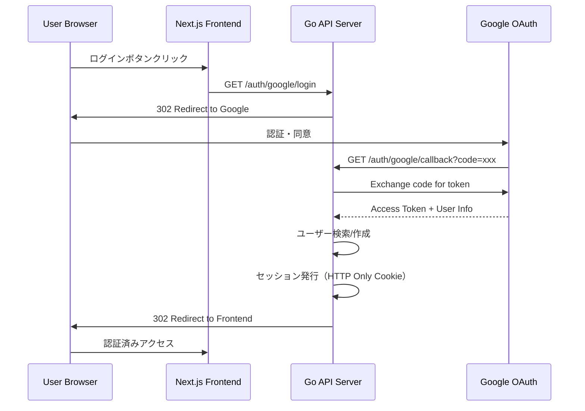
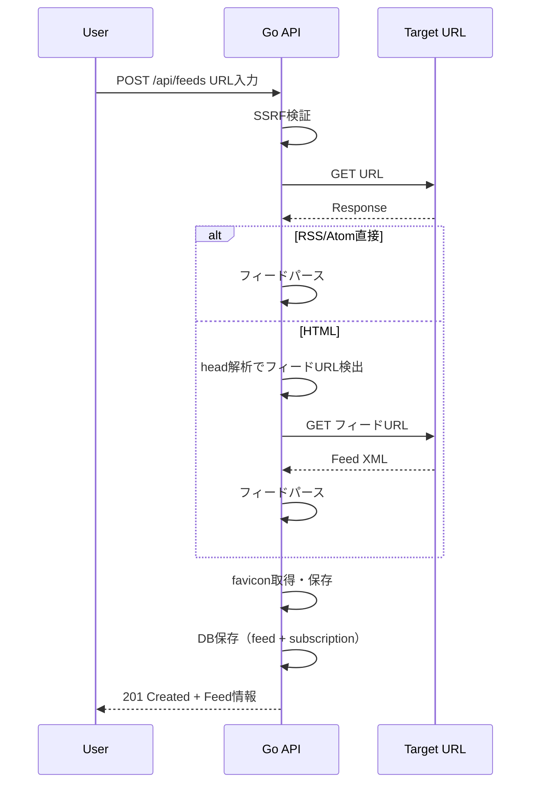
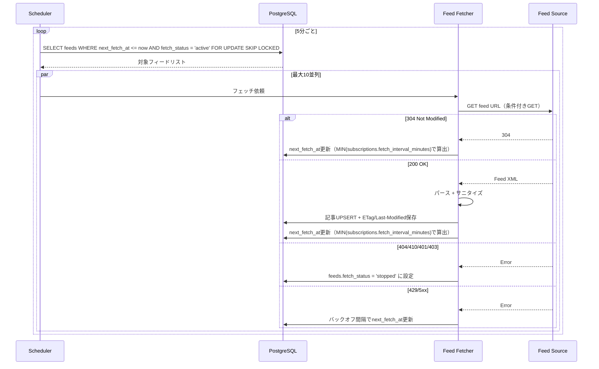
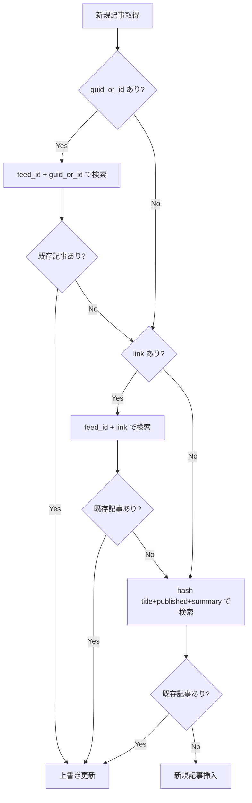
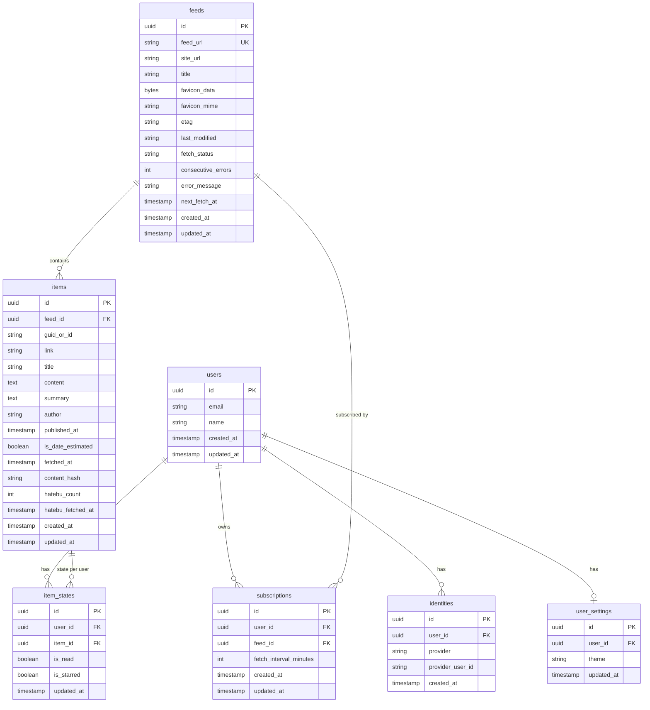

# Technical Design: rss-reader

## Overview

**Purpose**: 本機能はWeb上で利用できるRSS/Atomリーダーを提供する。ユーザーはフィードの登録・閲覧・管理を行い、2ペインUIで効率的に情報収集できる。

**Users**: 一般ユーザーがRSS/Atomフィードの購読・閲覧・管理のワークフローで利用する。運用者がログ・メトリクスによるサービス監視で利用する。

**Impact**: グリーンフィールドプロジェクトとして、Go APIサーバー、Goワーカー、Next.jsフロントエンド、PostgreSQLデータベースの4コンポーネントで構成される新規システムを構築する。

### Goals
- Google OAuthによるシームレスな認証・登録フロー
- URL入力のみでのフィード自動検出・登録
- 2ペインUIでの効率的な記事閲覧（無限スクロール、排他的展開、フィルタリング）
- バックグラウンドワーカーによる定期フィードフェッチ（排他制御、リトライ、停止）
- はてなブックマーク連携による記事注目度の可視化
- XSS/SSRF対策を含む多層セキュリティ

### Non-Goals
- モバイルアプリ対応（Webのみ）
- ユーザー間の共有機能
- 管理画面の構築（ログ・メトリクスによる運用）
- 全文検索機能
- フィードの自動カテゴリ分類

## Architecture

### Architecture Pattern & Boundary Map

```mermaid
graph TB
    subgraph Frontend
        NextJS[Next.js App]
    end

    subgraph GoAPI[Go API Server]
        Router[Chi Router]
        AuthMW[Auth Middleware]
        CORSMW[CORS Middleware]
        RateMW[Rate Limit Middleware]
        AuthHandler[Auth Handler]
        FeedHandler[Feed Handler]
        ItemHandler[Item Handler]
        SubHandler[Subscription Handler]
        AuthService[Auth Service]
        FeedService[Feed Service]
        ItemService[Item Service]
        SubService[Subscription Service]
        HatebuService[Hatebu Service]
        FeedRepo[Feed Repository]
        ItemRepo[Item Repository]
        SubRepo[Subscription Repository]
        UserRepo[User Repository]
        ItemStateRepo[ItemState Repository]
    end

    subgraph Worker[Go Worker]
        Scheduler[Fetch Scheduler]
        FeedFetcher[Feed Fetcher]
        FeedParser[Feed Parser]
        HatebuFetcher[Hatebu Fetcher]
        ArticleCleaner[Article Cleaner]
    end

    subgraph External
        GoogleOAuth[Google OAuth]
        HatebuAPI[Hatena Bookmark API]
        FeedSources[RSS/Atom Feeds]
    end

    subgraph Data
        PostgreSQL[(PostgreSQL)]
    end

    NextJS -->|HTTP Cookie Session| Router
    Router --> AuthMW
    CORSMW --> AuthMW
    AuthMW --> RateMW
    RateMW --> AuthHandler
    RateMW --> FeedHandler
    RateMW --> ItemHandler
    RateMW --> SubHandler
    AuthHandler --> AuthService
    FeedHandler --> FeedService
    ItemHandler --> ItemService
    SubHandler --> SubService
    AuthService --> UserRepo
    FeedService --> FeedRepo
    ItemService --> ItemRepo
    ItemService --> HatebuService
    SubService --> SubRepo
    SubService --> ItemStateRepo
    UserRepo --> PostgreSQL
    FeedRepo --> PostgreSQL
    ItemRepo --> PostgreSQL
    SubRepo --> PostgreSQL
    ItemStateRepo --> PostgreSQL
    AuthService --> GoogleOAuth
    Scheduler --> FeedRepo
    Scheduler --> FeedFetcher
    FeedFetcher --> FeedSources
    FeedFetcher --> FeedParser
    FeedParser --> ItemRepo
    FeedParser --> ArticleCleaner
    HatebuFetcher --> HatebuAPI
    HatebuFetcher --> ItemRepo
    ArticleCleaner -->|bluemonday| FeedParser
end
```

**Architecture Integration**:
- 選択パターン: レイヤードアーキテクチャ（Handler → Service → Repository）。プロジェクト規模に適切で、Goコミュニティで広く採用されているパターン
- ドメイン境界: 認証、フィード管理、記事管理、購読管理、はてなブックマーク連携の5ドメインに分離
- 新規コンポーネント: すべて新規構築。Go APIサーバー、Goワーカー、Next.jsフロントエンド
- デプロイ構成: 4コンテナ構成（web、api、worker、db）。Next.jsはstandaloneモードでDockerコンテナ化し、APIサーバーとは別オリジンで動作
- BFF構成: Go APIサーバーがBFFとして機能し、HTTP Only Cookieセッション（credentials: 'include'）でフロントエンドと通信。フロントエンドからAPIへの通信先は`NEXT_PUBLIC_API_URL`環境変数（ビルド時バンドル）で指定

### Technology Stack

| Layer | Choice / Version | Role in Feature | Notes |
|-------|------------------|-----------------|-------|
| Frontend | Next.js 15 + React 19 | SPA、2ペインUI | App Router使用、Client Components中心 |
| UI Components | shadcn/ui + Tailwind CSS 4 | UIコンポーネント、テーマ | ライト/ダーク切替対応 |
| Data Fetching | TanStack Query (React Query) v5 | サーバーデータ管理、キャッシュ | 無限スクロール、楽観的更新 |
| Backend API | Go 1.25 + chi v5 | BFF APIサーバー | net/http標準互換 |
| Worker | Go 1.25 | バックグラウンドフェッチ処理 | APIと同一バイナリ、サブコマンドで起動 |
| Database | PostgreSQL 16 | データ永続化 | SKIP LOCKEDによる排他制御 |
| Migration | golang-migrate v4 | スキーマ管理 | タイムスタンプベースのバージョニング |
| Feed Parser | gofeed latest | RSS/Atom/JSONフィード解析 | 統一モデルへの変換 |
| HTML Sanitizer | bluemonday latest | XSS防止コンテンツサニタイズ | 許可リストベースポリシー |
| SSRF Protection | safeurl latest | SSRF防止HTTPクライアント | RFC1918準拠、DNS再バインディング対策 |
| Session | gorilla/sessions latest | Cookieセッション管理 | HTTP Only、署名付き暗号化 |
| Logging | log/slog (stdlib) | JSON構造化ログ | Go標準ライブラリ |
| Metrics | prometheus/client_golang | メトリクス収集・公開 | /metricsエンドポイント |
| Rate Limiting | golang.org/x/time/rate | ユーザーごとのレート制限 | インメモリ、トークンバケット |
| Infrastructure | Docker + docker-compose | コンテナ実行環境 | Web（Next.js standalone）、API、Worker、PostgreSQL の4コンテナ構成 |

> 各ライブラリの選定経緯と比較の詳細は`research.md`を参照。

## System Flows

### OAuth認証フロー



### フィード登録フロー



### ワーカーフェッチフロー



> **Feed単位フェッチの設計方針**: フェッチ対象はsubscription単位ではなくfeed単位とする。同一フィードを複数ユーザーが購読しても、フェッチは1回のみ実行される。next_fetch_atは当該フィードを購読する全subscriptionのfetch_interval_minutesの最小値を用いて算出する。フィードの購読者が0になった場合はフェッチ対象外となる（孤児フィードは将来GC対象）。

### 記事の同一性判定フロー



## Requirements Traceability

| Requirement | Summary | Components | Interfaces | Flows |
|-------------|---------|------------|------------|-------|
| 1.1 | Google OAuthフロー開始 | AuthHandler, AuthService | GET /auth/google/login | OAuth認証フロー |
| 1.2 | 未登録ユーザーの自動作成 | AuthService, UserRepo | - | OAuth認証フロー |
| 1.3 | 登録済みユーザーのログイン | AuthService, UserRepo | - | OAuth認証フロー |
| 1.4 | HTTP Only Cookieセッション発行 | AuthService, SessionMiddleware | Set-Cookie | OAuth認証フロー |
| 1.5 | CSRF対策 | CORSMiddleware | SameSite=Lax + CORS | - |
| 1.6 | ユーザーデータ分離 | 全Repository | WHERE user_id = ? | - |
| 1.7 | 複数IdP対応テーブル設計 | identitiesテーブル | - | - |
| 1.8 | クロスオリジン通信（NEXT_PUBLIC_API_URL） | API通信設定、credentials: include | - | - |
| 2.1 | RSS/AtomフィードURL直接登録 | FeedService, FeedDetector | POST /api/feeds | フィード登録フロー |
| 2.2 | HTMLからフィード検出 | FeedDetector | POST /api/feeds | フィード登録フロー |
| 2.3 | 複数候補の優先順位自動選択 | FeedDetector | - | フィード登録フロー |
| 2.4 | 登録後のフィードURL表示・変更 | FeedHandler, FeedPanel | PATCH /api/feeds/:id | - |
| 2.5 | favicon取得・保存 | FaviconFetcher | - | フィード登録フロー |
| 2.6 | フィード未検出エラー | FeedDetector | 422 response | フィード登録フロー |
| 2.7 | favicon取得失敗時の非表示 | FeedPanel | - | - |
| 2.8 | 購読上限100件制限 | SubscriptionService | 409 response | - |
| 3.1 | 2ペインレイアウト | FeedPanel, ItemListPanel | - | - |
| 3.2 | フィードタイトル・favicon表示 | FeedPanel | GET /api/subscriptions | - |
| 3.3 | フィード選択で記事一覧表示 | ItemListPanel | GET /api/feeds/:id/items | - |
| 3.4 | Tailwind + shadcn使用 | 全UIコンポーネント | - | - |
| 3.5 | ライト/ダーク切替 | ThemeProvider | - | - |
| 4.1 | published_at降順表示 | ItemService | ORDER BY clause | - |
| 4.2 | fetched_at代用・推定フラグ | ItemService, ItemListPanel | is_date_estimated field | - |
| 4.3 | 無限スクロール（50件/回） | ItemListPanel | cursor pagination | - |
| 4.4 | 記事クリックで展開表示 | ItemDetailPanel | GET /api/items/:id | - |
| 4.5 | 展開時に既読化 | ItemStateService | PUT /api/items/:id/state | - |
| 4.6 | 排他的展開 | ItemListPanel | - | - |
| 4.7 | 元記事URL遷移ボタン | ItemDetailPanel | - | - |
| 5.1 | 3種フィルタ（全て/未読/スター） | ItemListPanel, ItemService | filter query param | - |
| 5.2 | 未読フィルタ | ItemService | GET /api/feeds/:id/items?filter=unread | - |
| 5.3 | スターフィルタ | ItemService | GET /api/feeds/:id/items?filter=starred | - |
| 6.1 | 既読・スター状態保持 | item_statesテーブル | - | - |
| 6.2 | 既読の冪等更新 | ItemStateService | PUT /api/items/:id/state | - |
| 6.3 | スターの冪等更新 | ItemStateService | PUT /api/items/:id/state | - |
| 7.1 | 記事同一性判定（3段階優先順位） | ItemUpsertService | - | 同一性判定フロー |
| 7.2 | 既存記事の上書き更新 | ItemUpsertService | - | 同一性判定フロー |
| 8.1 | 5分ごとのワーカー実行（feed単位） | FetchScheduler | - | ワーカーフェッチフロー |
| 8.2 | SKIP LOCKEDによる排他制御・10並列（feed単位） | FetchScheduler | - | ワーカーフェッチフロー |
| 8.3 | ETag/Last-Modified条件付きGET | FeedFetcher | - | ワーカーフェッチフロー |
| 8.4 | タイムアウト10秒・最大5MB | FeedFetcher | - | - |
| 8.5 | フェッチ間隔設定（30分-12時間） | SubscriptionService | PUT /api/subscriptions/:id/settings | - |
| 9.1 | 404/410でフェッチ停止 | FeedFetcher | - | ワーカーフェッチフロー |
| 9.2 | 401/403でフェッチ停止 | FeedFetcher | - | ワーカーフェッチフロー |
| 9.3 | パース失敗10回連続で停止 | FeedFetcher | - | ワーカーフェッチフロー |
| 9.4 | 429/5xxでバックオフ継続 | FeedFetcher | - | ワーカーフェッチフロー |
| 9.5 | 手動復帰ボタン | SubscriptionService | POST /api/subscriptions/:id/resume | - |
| 10.1 | はてブ数・取得日時保持 | HatebuService, itemsテーブル | - | - |
| 10.2 | 24時間TTLで再取得 | HatebuFetcher | - | - |
| 10.3 | 取得失敗時の前回値維持 | HatebuFetcher | - | - |
| 11.1 | 許可タグのみサニタイズ | ContentSanitizer | - | - |
| 11.2 | script/iframe/style/on*除去 | ContentSanitizer | - | - |
| 11.3 | imgのhttpsのみ | ContentSanitizer | - | - |
| 11.4 | aタグのtarget/rel付与 | ContentSanitizer | - | - |
| 12.1 | 登録時・フェッチ時のSSRFチェック | SSRFGuard | - | - |
| 12.2 | プライベート/リンクローカル/メタデータIP拒否 | SSRFGuard | - | - |
| 12.3 | egress制限 | SSRFGuard, Docker Network | - | - |
| 13.1 | API 120 req/min/user | RateLimitMiddleware | 429 response | - |
| 13.2 | 登録 10 req/min/user | RateLimitMiddleware | 429 response | - |
| 14.1 | 180日記事保持 | ArticleCleanupJob | - | - |
| 14.2 | 購読解除時のデータ削除 | SubscriptionService | DELETE /api/subscriptions/:id | - |
| 14.3 | 退会時のユーザーデータ削除 | UserService | DELETE /api/users/me | - |
| 14.4 | feeds/itemsの共有キャッシュ保持 | UserService | - | - |
| 15.1 | JSON構造化ログ出力 | 全コンポーネント（slog） | - | - |
| 15.2 | ログ14日保持 | インフラ設定 | - | - |
| 15.3 | メトリクス提供 | MetricsCollector | GET /metrics | - |
| 15.4 | UIエラー表示（原因カテゴリ+対処方法） | ErrorDisplay | - | - |
| 16.1 | 環境変数による設定制御 | Config | - | - |
| 16.2 | Dockerコンテナ動作 | Dockerfile, docker-compose | - | - |
| 16.3 | DBマイグレーション管理 | golang-migrate | - | - |

## Components and Interfaces

| Component | Domain/Layer | Intent | Req Coverage | Key Dependencies | Contracts |
|-----------|-------------|--------|-------------|-----------------|-----------|
| AuthHandler | 認証/Handler | OAuth認証エンドポイント | 1.1, 1.3, 1.4 | AuthService (P0) | API |
| AuthService | 認証/Service | OAuth認証ロジック、セッション管理 | 1.1-1.8 | UserRepo (P0), Google OAuth (P0) | Service |
| SessionMiddleware | 認証/Middleware | セッション検証 | 1.4, 1.6 | gorilla/sessions (P0) | Service |
| CORSMiddleware | セキュリティ/Middleware | CORS制御・CSRF防御 | 1.5 | 環境変数 CORS_ALLOWED_ORIGIN (P0) | Service |
| RateLimitMiddleware | セキュリティ/Middleware | レート制限 | 13.1, 13.2 | x/time/rate (P0) | Service |
| FeedHandler | フィード/Handler | フィード登録・管理エンドポイント | 2.1-2.8 | FeedService (P0) | API |
| FeedService | フィード/Service | フィード登録ロジック、検出 | 2.1-2.8 | FeedRepo (P0), SSRFGuard (P0) | Service |
| FeedDetector | フィード/Service | HTML解析によるフィードURL検出 | 2.2, 2.3 | safeurl (P0) | Service |
| FaviconFetcher | フィード/Service | favicon取得・保存 | 2.5, 2.7 | safeurl (P1) | Service |
| ItemHandler | 記事/Handler | 記事一覧・詳細エンドポイント | 4.1-4.7, 5.1-5.3 | ItemService (P0) | API |
| ItemService | 記事/Service | 記事取得・フィルタリング | 4.1-4.3, 5.1-5.3 | ItemRepo (P0), ItemStateRepo (P0) | Service |
| ItemStateService | 記事/Service | 既読・スター状態管理 | 6.1-6.3 | ItemStateRepo (P0) | Service |
| ItemUpsertService | 記事/Service | 記事同一性判定・UPSERT | 7.1, 7.2 | ItemRepo (P0) | Service |
| SubscriptionHandler | 購読/Handler | 購読管理エンドポイント | 2.8, 8.5, 9.5, 14.2 | SubscriptionService (P0) | API |
| SubscriptionService | 購読/Service | 購読CRUD、設定管理 | 2.8, 8.5, 9.5, 14.2 | SubRepo (P0), ItemStateRepo (P1) | Service |
| UserHandler | ユーザー/Handler | ユーザー管理エンドポイント | 14.3, 14.4 | UserService (P0) | API |
| UserService | ユーザー/Service | 退会処理 | 14.3, 14.4 | UserRepo (P0), SubRepo (P0) | Service |
| FetchScheduler | ワーカー/Batch | フェッチスケジューリング | 8.1, 8.2 | FeedRepo (P0), SubRepo (P0), FeedFetcher (P0) | Batch |
| FeedFetcher | ワーカー/Service | フィードHTTPフェッチ | 8.3, 8.4, 9.1-9.4 | safeurl (P0), gofeed (P0) | Service |
| ContentSanitizer | セキュリティ/Service | HTMLサニタイズ | 11.1-11.4 | bluemonday (P0) | Service |
| SSRFGuard | セキュリティ/Service | SSRF防止 | 12.1-12.3 | safeurl (P0) | Service |
| HatebuService | はてブ/Service | はてブ数取得・管理 | 10.1-10.3 | Hatena Bookmark API (P1) | Service |
| HatebuFetcher | ワーカー/Batch | はてブ数バッチ取得 | 10.1-10.3 | HatebuService (P0) | Batch |
| ArticleCleanupJob | ワーカー/Batch | 180日超過記事削除 | 14.1 | ItemRepo (P0) | Batch |
| MetricsCollector | 観測性/Service | Prometheusメトリクス収集 | 15.3 | client_golang (P0) | Service |
| Config | インフラ/Utility | 環境変数読み込み | 16.1 | - | State |
| FeedPanel | UI/Component | 左ペイン フィード一覧 | 3.1, 3.2 | - | State |
| ItemListPanel | UI/Component | 右ペイン 記事一覧 | 3.3, 4.1-4.7, 5.1-5.3 | - | State |
| ItemDetailPanel | UI/Component | 記事展開表示 | 4.4, 4.7 | - | State |
| ThemeProvider | UI/Component | テーマ切替 | 3.5 | - | State |

### 認証/セキュリティ層

#### AuthService

| Field | Detail |
|-------|--------|
| Intent | Google OAuthフロー管理、ユーザー登録/ログイン、セッション発行 |
| Requirements | 1.1, 1.2, 1.3, 1.4, 1.7 |

**Responsibilities & Constraints**
- Google OAuthフローの開始・コールバック処理
- 未登録ユーザーの自動作成（users + identities同時作成）
- identitiesテーブルによる複数IdP対応構造の維持
- セッション発行・破棄

**Dependencies**
- Outbound: UserRepo -- ユーザー・identity永続化 (P0)
- External: Google OAuth 2.0 -- 認証 (P0)
- External: gorilla/sessions -- セッション管理 (P0)

**Contracts**: Service [x] / API [ ] / Event [ ] / Batch [ ] / State [ ]

##### Service Interface
```go
type AuthService interface {
    // GetLoginURL はOAuth認証URLを生成する
    GetLoginURL(state string) string
    // HandleCallback はOAuthコールバックを処理し、セッションを発行する
    HandleCallback(ctx context.Context, code string) (*Session, error)
    // Logout はセッションを破棄する
    Logout(ctx context.Context, sessionID string) error
    // GetCurrentUser はセッションから現在のユーザーを取得する
    GetCurrentUser(ctx context.Context, sessionID string) (*User, error)
}

type Session struct {
    ID        string
    UserID    string
    ExpiresAt time.Time
}
```
- Preconditions: OAuthのclient_id/client_secretが環境変数で設定済み
- Postconditions: 認証成功時にHTTP Only Cookie付きのセッションが発行される
- Invariants: 1ユーザーに対して複数のidentityを紐付け可能

#### SessionMiddleware

| Field | Detail |
|-------|--------|
| Intent | リクエストごとのセッション検証とユーザーコンテキスト注入 |
| Requirements | 1.4, 1.6 |

**Responsibilities & Constraints**
- HTTP Only Cookieからセッションを読み取り、有効性を検証
- 認証済みユーザーIDをリクエストコンテキストに注入
- 未認証リクエストは401を返す（認証不要エンドポイントを除く）

**Dependencies**
- External: gorilla/sessions -- Cookie読み取り (P0)

**Contracts**: Service [x] / API [ ] / Event [ ] / Batch [ ] / State [ ]

##### Service Interface
```go
type SessionMiddleware func(next http.Handler) http.Handler

// コンテキストからユーザーIDを取得するヘルパー
func UserIDFromContext(ctx context.Context) (string, error)
```

#### CORSMiddleware

| Field | Detail |
|-------|--------|
| Intent | クロスオリジンリクエストの制御、CSRF攻撃の防止 |
| Requirements | 1.5, 1.8 |

**Responsibilities & Constraints**
- `CORS_ALLOWED_ORIGIN` 環境変数で指定されたオリジンからのリクエストを許可
- `Access-Control-Allow-Credentials: true` でCookie送信を許可
- OPTIONSプリフライトリクエストに204で応答
- SameSite=Lax Cookie + CORSポリシーによりCSRF攻撃を防御

**Contracts**: Service [x] / API [ ] / Event [ ] / Batch [ ] / State [ ]

##### Service Interface
```go
func NewCORSMiddleware(allowedOrigin string) func(next http.Handler) http.Handler
```

#### RateLimitMiddleware

| Field | Detail |
|-------|--------|
| Intent | ユーザーごとのAPIリクエストレート制限 |
| Requirements | 13.1, 13.2 |

**Responsibilities & Constraints**
- API全般: 120 req/min/user（トークンバケット方式）
- フィード登録: 10 req/min/user（エンドポイント固有制限）
- 制限超過時は429 Too Many Requestsを返す
- ユーザーごとのリミッターを管理し、期限切れエントリを定期クリーンアップ

**Dependencies**
- External: golang.org/x/time/rate -- トークンバケット実装 (P0)

**Contracts**: Service [x] / API [ ] / Event [ ] / Batch [ ] / State [ ]

##### Service Interface
```go
type RateLimiterConfig struct {
    GeneralRate  rate.Limit // 120/60 = 2 req/sec
    GeneralBurst int        // 120
    FeedRegRate  rate.Limit // 10/60
    FeedRegBurst int        // 10
}

type RateLimitMiddleware func(next http.Handler) http.Handler

// エンドポイント固有の制限を適用するミドルウェア
func FeedRegistrationRateLimit() func(next http.Handler) http.Handler
```

#### ContentSanitizer

| Field | Detail |
|-------|--------|
| Intent | フィードコンテンツのHTML安全化 |
| Requirements | 11.1, 11.2, 11.3, 11.4 |

**Responsibilities & Constraints**
- 許可タグ: p, br, a, ul, ol, li, blockquote, pre, code, strong, em, img
- script, iframe, style, on*イベント属性を除去
- img src属性はhttpsスキームのみ許可
- aタグにtarget="_blank" rel="noopener noreferrer"を付与

**Dependencies**
- External: bluemonday -- HTMLサニタイズエンジン (P0)

**Contracts**: Service [x] / API [ ] / Event [ ] / Batch [ ] / State [ ]

##### Service Interface
```go
type ContentSanitizer interface {
    // Sanitize はHTMLコンテンツをサニタイズして安全なHTMLを返す
    Sanitize(rawHTML string) string
}
```
- Preconditions: なし（空文字列も受け付ける）
- Postconditions: 返却されるHTMLには許可タグのみ含まれる
- Invariants: 同一入力に対して常に同一出力（冪等）

#### SSRFGuard

| Field | Detail |
|-------|--------|
| Intent | SSRF攻撃の防止 |
| Requirements | 12.1, 12.2, 12.3 |

**Responsibilities & Constraints**
- プライベートIPアドレス（10.0.0.0/8, 172.16.0.0/12, 192.168.0.0/16）拒否
- リンクローカルアドレス（169.254.0.0/16, fe80::/10）拒否
- メタデータIP（169.254.169.254）拒否
- ループバック（127.0.0.0/8, ::1）拒否
- フィード登録時とフェッチ時の両方で検証
- DNS再バインディング攻撃への対策

**Dependencies**
- External: safeurl -- SSRF防止HTTPクライアント (P0)

**Contracts**: Service [x] / API [ ] / Event [ ] / Batch [ ] / State [ ]

##### Service Interface
```go
type SSRFGuard interface {
    // NewSafeClient はSSRF防止機能付きのHTTPクライアントを生成する
    NewSafeClient(timeout time.Duration, maxResponseSize int64) *http.Client
    // ValidateURL はURLの安全性を検証する
    ValidateURL(rawURL string) error
}
```

### フィード管理層

#### FeedHandler

| Field | Detail |
|-------|--------|
| Intent | フィード登録・管理のHTTPエンドポイント |
| Requirements | 2.1, 2.2, 2.3, 2.4, 2.5, 2.6, 2.7, 2.8 |

**Contracts**: Service [ ] / API [x] / Event [ ] / Batch [ ] / State [ ]

##### API Contract

| Method | Endpoint | Request | Response | Errors |
|--------|----------|---------|----------|--------|
| POST | /api/feeds | `{ "url": "string" }` | `Feed` | 400, 409, 422, 429 |
| GET | /api/feeds/:id | - | `Feed` | 404 |
| PATCH | /api/feeds/:id | `{ "feed_url": "string" }` | `Feed` | 400, 404 |
| DELETE | /api/feeds/:id | - | 204 | 404 |

**Implementation Notes**
- POST /api/feeds は購読上限（100件）チェックを行い、超過時は409を返す
- フィード未検出時は422を返す（エラーメッセージに原因カテゴリと対処方法を含む）
- 登録専用のレート制限（10 req/min）が適用される

#### FeedService

| Field | Detail |
|-------|--------|
| Intent | フィード登録ロジック、自動検出、favicon取得 |
| Requirements | 2.1, 2.2, 2.3, 2.4, 2.5, 2.6 |

**Responsibilities & Constraints**
- URL入力に対するフィード自動判定（RSS/Atom直接 or HTML解析）
- 複数候補検出時の優先順位適用（同一ホスト > Atom > RSS > 先頭）
- favicon取得・保存（取得失敗時はnullとして保存）
- feedテーブルへの保存（既存フィードはfeed_urlでの重複チェック）
- subscriptionテーブルへの購読レコード作成

**Dependencies**
- Outbound: FeedRepo -- フィード永続化 (P0)
- Outbound: SubRepo -- 購読永続化 (P0)
- Outbound: SSRFGuard -- URL安全性検証 (P0)
- Outbound: FeedDetector -- フィードURL検出 (P0)
- Outbound: FaviconFetcher -- favicon取得 (P1)

**Contracts**: Service [x] / API [ ] / Event [ ] / Batch [ ] / State [ ]

##### Service Interface
```go
type FeedService interface {
    // RegisterFeed はURLからフィードを検出し登録する
    RegisterFeed(ctx context.Context, userID string, inputURL string) (*Feed, error)
    // GetFeed はフィード情報を取得する
    GetFeed(ctx context.Context, feedID string) (*Feed, error)
    // UpdateFeedURL はフィードURLを更新する
    UpdateFeedURL(ctx context.Context, feedID string, newURL string) (*Feed, error)
}
```
- Preconditions: userIDが有効な認証済みユーザー
- Postconditions: 登録成功時にfeed + subscriptionレコードが作成される
- Invariants: ユーザーあたりの購読数は100件以下

#### FeedDetector

| Field | Detail |
|-------|--------|
| Intent | HTMLページからRSS/AtomフィードURLを検出する |
| Requirements | 2.2, 2.3 |

**Responsibilities & Constraints**
- `<link rel="alternate" type="application/rss+xml">` の検出
- `<link rel="alternate" type="application/atom+xml">` の検出
- 優先順位: 同一ホスト > Atom > RSS > 先頭

**Contracts**: Service [x] / API [ ] / Event [ ] / Batch [ ] / State [ ]

##### Service Interface
```go
type FeedDetector interface {
    // DetectFeedURL はURLがフィードかHTMLかを判定し、フィードURLを返す
    DetectFeedURL(ctx context.Context, inputURL string) (feedURL string, err error)
    // IsDirectFeed はURLが直接フィードURLかどうかを判定する
    IsDirectFeed(contentType string, body []byte) bool
}
```

### 記事管理層

#### ItemHandler

| Field | Detail |
|-------|--------|
| Intent | 記事一覧・詳細・状態管理のHTTPエンドポイント |
| Requirements | 4.1, 4.2, 4.3, 4.4, 4.5, 4.7, 5.1, 5.2, 5.3, 6.1, 6.2, 6.3 |

**Contracts**: Service [ ] / API [x] / Event [ ] / Batch [ ] / State [ ]

##### API Contract

| Method | Endpoint | Request | Response | Errors |
|--------|----------|---------|----------|--------|
| GET | /api/feeds/:id/items | `?cursor=string&filter=all/unread/starred` | `ItemListResponse` | 400, 404 |
| GET | /api/items/:id | - | `ItemDetail` | 404 |
| PUT | /api/items/:id/state | `{ "is_read": bool, "is_starred": bool }` | `ItemState` | 400, 404 |

```go
type ItemListResponse struct {
    Items      []ItemSummary `json:"items"`
    NextCursor string        `json:"next_cursor,omitempty"`
    HasMore    bool          `json:"has_more"`
}

type ItemSummary struct {
    ID               string    `json:"id"`
    FeedID           string    `json:"feed_id"`
    Title            string    `json:"title"`
    Link             string    `json:"link"`
    PublishedAt      time.Time `json:"published_at"`
    IsDateEstimated  bool      `json:"is_date_estimated"`
    IsRead           bool      `json:"is_read"`
    IsStarred        bool      `json:"is_starred"`
    HatebuCount      int       `json:"hatebu_count"`
}

type ItemDetail struct {
    ItemSummary
    Content     string `json:"content"`   // サニタイズ済みHTML
    Summary     string `json:"summary"`
    Author      string `json:"author"`
}

type ItemStateRequest struct {
    IsRead    *bool `json:"is_read,omitempty"`
    IsStarred *bool `json:"is_starred,omitempty"`
}
```

**Implementation Notes**
- カーソルベースページネーション（published_at + id の複合カーソル）
- 1回の取得件数は50件固定
- フィルタはall（デフォルト）、unread、starredの3種
- 状態更新は冪等（PUTメソッド、明示的な値設定）

#### ItemService

| Field | Detail |
|-------|--------|
| Intent | 記事取得、フィルタリング、ソートロジック |
| Requirements | 4.1, 4.2, 4.3, 5.1, 5.2, 5.3 |

**Contracts**: Service [x] / API [ ] / Event [ ] / Batch [ ] / State [ ]

##### Service Interface
```go
type ItemService interface {
    // ListItems はフィードの記事一覧をフィルタ・ページネーション付きで返す
    ListItems(ctx context.Context, userID string, feedID string, filter ItemFilter, cursor string, limit int) (*ItemListResult, error)
    // GetItem は記事詳細を返す
    GetItem(ctx context.Context, userID string, itemID string) (*ItemDetail, error)
}

type ItemFilter string

const (
    ItemFilterAll     ItemFilter = "all"
    ItemFilterUnread  ItemFilter = "unread"
    ItemFilterStarred ItemFilter = "starred"
)

type ItemListResult struct {
    Items      []ItemSummary
    NextCursor string
    HasMore    bool
}
```

#### ItemStateService

| Field | Detail |
|-------|--------|
| Intent | 記事の既読・スター状態の管理 |
| Requirements | 6.1, 6.2, 6.3, 4.5 |

**Contracts**: Service [x] / API [ ] / Event [ ] / Batch [ ] / State [ ]

##### Service Interface
```go
type ItemStateService interface {
    // UpdateState は記事の状態を冪等に更新する
    UpdateState(ctx context.Context, userID string, itemID string, req ItemStateUpdate) (*ItemState, error)
    // GetStates はユーザーの記事状態を一括取得する
    GetStates(ctx context.Context, userID string, itemIDs []string) (map[string]*ItemState, error)
}

type ItemStateUpdate struct {
    IsRead    *bool // nilの場合は変更しない
    IsStarred *bool // nilの場合は変更しない
}

type ItemState struct {
    UserID    string
    ItemID    string
    IsRead    bool
    IsStarred bool
    UpdatedAt time.Time
}
```
- Preconditions: userID、itemIDが有効
- Postconditions: 指定されたフィールドのみ更新される（nil以外）
- Invariants: 同一userID+itemIDに対して1レコードのみ存在

#### ItemUpsertService

| Field | Detail |
|-------|--------|
| Intent | 記事の同一性判定とUPSERT処理 |
| Requirements | 7.1, 7.2 |

**Responsibilities & Constraints**
- 3段階の同一性判定: (feed_id, guid_or_id) > (feed_id, link) > hash(title + published + summary)
- 既存記事は上書き更新（履歴保持なし）
- ワーカーから呼び出される内部サービス

**Contracts**: Service [x] / API [ ] / Event [ ] / Batch [ ] / State [ ]

##### Service Interface
```go
type ItemUpsertService interface {
    // UpsertItems はフィードから取得した記事をUPSERTする
    UpsertItems(ctx context.Context, feedID string, items []ParsedItem) (inserted int, updated int, err error)
}

type ParsedItem struct {
    GuidOrID    string
    Title       string
    Link        string
    Content     string    // サニタイズ済み
    Summary     string    // サニタイズ済み
    Author      string
    PublishedAt *time.Time
    Categories  []string
}
```

### 購読管理層

#### SubscriptionHandler

| Field | Detail |
|-------|--------|
| Intent | 購読管理のHTTPエンドポイント |
| Requirements | 2.8, 8.5, 9.5, 14.2 |

**Contracts**: Service [ ] / API [x] / Event [ ] / Batch [ ] / State [ ]

##### API Contract

| Method | Endpoint | Request | Response | Errors |
|--------|----------|---------|----------|--------|
| GET | /api/subscriptions | - | `[]Subscription` | - |
| DELETE | /api/subscriptions/:id | - | 204 | 404 |
| PUT | /api/subscriptions/:id/settings | `SubscriptionSettings` | `Subscription` | 400, 404 |
| POST | /api/subscriptions/:id/resume | - | `Subscription` | 404, 409 |

```go
type Subscription struct {
    ID             string     `json:"id"`
    UserID         string     `json:"user_id"`
    FeedID         string     `json:"feed_id"`
    FeedTitle      string     `json:"feed_title"`
    FeedURL        string     `json:"feed_url"`
    FaviconURL     *string    `json:"favicon_url,omitempty"`
    FetchInterval  int        `json:"fetch_interval_minutes"`
    FeedStatus     string     `json:"feed_status"` // active, stopped, error（feeds.fetch_statusから取得）
    ErrorMessage   *string    `json:"error_message,omitempty"` // feeds.error_messageから取得
    UnreadCount    int        `json:"unread_count"`
    CreatedAt      time.Time  `json:"created_at"`
}

type SubscriptionSettings struct {
    FetchIntervalMinutes int `json:"fetch_interval_minutes"` // 30-720, 30刻み
}
```

#### SubscriptionService

| Field | Detail |
|-------|--------|
| Intent | 購読CRUD、設定管理、購読解除 |
| Requirements | 2.8, 8.5, 9.5, 14.2 |

**Contracts**: Service [x] / API [ ] / Event [ ] / Batch [ ] / State [ ]

##### Service Interface
```go
type SubscriptionService interface {
    // ListSubscriptions はユーザーの購読一覧を返す
    ListSubscriptions(ctx context.Context, userID string) ([]Subscription, error)
    // Unsubscribe は購読を解除する（subscription + item_states削除）
    Unsubscribe(ctx context.Context, userID string, subscriptionID string) error
    // UpdateSettings は購読設定を更新する
    UpdateSettings(ctx context.Context, userID string, subscriptionID string, settings SubscriptionSettings) (*Subscription, error)
    // ResumeFetch は停止中のフィードのフェッチを再開する（feeds.fetch_statusをactiveに戻す）
    ResumeFetch(ctx context.Context, userID string, subscriptionID string) (*Subscription, error)
    // CountSubscriptions はユーザーの購読数を返す
    CountSubscriptions(ctx context.Context, userID string) (int, error)
}
```
- Preconditions: フェッチ間隔は30-720の範囲、30の倍数
- Postconditions: Unsubscribe時にsubscription + 関連item_statesが削除される
- Invariants: ユーザーあたり最大100購読

### ワーカー層

#### FetchScheduler

| Field | Detail |
|-------|--------|
| Intent | 定期フィードフェッチのスケジューリングと並列制御 |
| Requirements | 8.1, 8.2 |

**Responsibilities & Constraints**
- 5分間隔でスケジュール実行
- feeds.next_fetch_at <= now() かつ feeds.fetch_status = 'active' のフィードを取得
- FOR UPDATE SKIP LOCKEDによるPostgreSQLレベルの排他制御
- 最大10ゴルーチンによる並列フェッチ
- semaphoreパターンで並列数を制御
- フェッチ対象はfeed単位（同一フィードの重複フェッチを防止）
- next_fetch_at算出時に当該フィードの全subscription中の最小fetch_interval_minutesを使用
- 購読者が0のフィードはフェッチ対象外

**Dependencies**
- Outbound: FeedRepo -- 対象フィードの取得・ステータス更新 (P0)
- Outbound: SubRepo -- フィードごとの最小フェッチ間隔算出 (P0)
- Outbound: FeedFetcher -- フィードフェッチ実行 (P0)

**Contracts**: Service [ ] / API [ ] / Event [ ] / Batch [x] / State [ ]

##### Batch / Job Contract
- Trigger: 5分間隔のティッカー
- Input: next_fetch_at <= now() かつ fetch_status = 'active' かつ購読者が存在するフィードレコード
- Output: 記事UPSERT、next_fetch_at更新、エラー時のfetch_status更新
- Idempotency: SKIP LOCKEDにより同一フィードの二重処理を防止。記事UPSERTは同一性判定により冪等

#### FeedFetcher

| Field | Detail |
|-------|--------|
| Intent | 個別フィードのHTTPフェッチとパース |
| Requirements | 8.3, 8.4, 9.1, 9.2, 9.3, 9.4 |

**Responsibilities & Constraints**
- 条件付きGET（ETag/Last-Modified）の使用
- タイムアウト10秒、最大レスポンスサイズ5MB
- HTTPステータスに基づく停止/バックオフ判定
- パース失敗の連続回数カウント（10回連続で停止）
- バックオフ戦略: 指数バックオフ（初回30分、最大12時間）

**Dependencies**
- External: safeurl -- SSRF防止HTTPクライアント (P0)
- External: gofeed -- RSS/Atomパーサー (P0)
- Outbound: ContentSanitizer -- HTMLサニタイズ (P0)
- Outbound: ItemUpsertService -- 記事UPSERT (P0)

**Contracts**: Service [x] / API [ ] / Event [ ] / Batch [ ] / State [ ]

##### Service Interface
```go
type FeedFetcher interface {
    // FetchAndProcess はフィードをフェッチし、記事をパース・保存する
    FetchAndProcess(ctx context.Context, feed *FeedForFetch) (*FetchResult, error)
}

type FeedForFetch struct {
    FeedID            string
    FeedURL           string
    ETag              string
    LastModified      string
    ConsecutiveErrors int
    MinFetchInterval  int // 全subscriptionの最小fetch_interval_minutes
}

type FetchResult struct {
    Status          FetchStatus
    ItemsInserted   int
    ItemsUpdated    int
    NewETag         string
    NewLastModified string
    NextFetchAt     time.Time
    ErrorMessage    string
}

type FetchStatus int

const (
    FetchStatusOK         FetchStatus = iota
    FetchStatusNotModified
    FetchStatusStopped
    FetchStatusBackoff
    FetchStatusError
)
```

#### HatebuFetcher

| Field | Detail |
|-------|--------|
| Intent | はてなブックマーク数のバッチ取得 |
| Requirements | 10.1, 10.2, 10.3 |

**Responsibilities & Constraints**
- hatebu_fetched_atから24時間経過した記事を対象
- はてなブックマークAPIの一括取得（最大50URL/リクエスト）を活用
- 取得失敗時は前回値を維持（エラーはログのみ）
- **初回取得タイミング**: フィードフェッチ時にはインライン取得を行わない。バッチジョブのみで取得する（hatebu_fetched_at = NULLの記事も対象）
- **未取得時のUI表示**: hatebu_fetched_at = NULLの記事はブックマーク数を「-」（未取得）として表示し、0件と区別する

**スロットリング戦略（安全側設計）**:
- API呼び出し間隔: 最低5秒のインターバルを設ける
- 1バッチサイクルあたりの最大API呼び出し回数: 100回（= 最大5000記事/サイクル）
- 1バッチサイクルの実行間隔: 10分
- 連続エラー時のバックオフ: 3回連続失敗で30分待機、5回で1時間待機、10回で6時間待機
- 1日あたりの最大API呼び出し回数: 上限14,400回（= 100回/サイクル × 144サイクル/日）を超えないよう制御
- スロットリングパラメータは環境変数で調整可能

**Dependencies**
- External: Hatena Bookmark API -- ブックマーク数取得 (P1)
- Outbound: ItemRepo -- 記事データ更新 (P0)

**Contracts**: Service [ ] / API [ ] / Event [ ] / Batch [x] / State [ ]

##### Batch / Job Contract
- Trigger: 10分間隔のティッカー（フェッチスケジューラと同居）
- Input: hatebu_fetched_at IS NULL OR hatebu_fetched_at + 24h < now() の記事レコード（最大5000件/サイクル）
- Output: hatebu_count, hatebu_fetched_at の更新
- Idempotency: 再実行しても同一のはてブ数で上書きされるため冪等
- Priority: hatebu_fetched_at IS NULL（未取得）を優先し、次にhatebu_fetched_atが古い順に処理

#### ArticleCleanupJob

| Field | Detail |
|-------|--------|
| Intent | 180日超過記事の削除 |
| Requirements | 14.1 |

**Contracts**: Service [ ] / API [ ] / Event [ ] / Batch [x] / State [ ]

##### Batch / Job Contract
- Trigger: 日次実行（例: 毎日03:00 UTC）
- Input: created_at < now() - 180 days の記事レコード
- Output: 対象記事と関連item_statesの削除
- Idempotency: 削除済みレコードの再削除は影響なし

### はてブ連携層

#### HatebuService

| Field | Detail |
|-------|--------|
| Intent | はてなブックマークAPI呼び出しとレスポンス処理 |
| Requirements | 10.1, 10.2, 10.3 |

**Contracts**: Service [x] / API [ ] / Event [ ] / Batch [ ] / State [ ]

##### Service Interface
```go
type HatebuService interface {
    // GetBookmarkCounts は複数URLのはてなブックマーク数を一括取得する
    GetBookmarkCounts(ctx context.Context, urls []string) (map[string]int, error)
}
```
- Preconditions: URLリストは50件以下
- Postconditions: 各URLに対するブックマーク数のマップを返す。ブックマーク0件のURLはマップに含まれない可能性がある（その場合は0として扱う）
- Invariants: はてなブックマークAPIの一括エンドポイント（`https://bookmark.hatenaapis.com/count/entries`）を使用
- Rate Control: 呼び出し元（HatebuFetcher）が最低5秒のインターバルを保証。HatebuService自体はステートレス

### ユーザー管理層

#### UserHandler / UserService

| Field | Detail |
|-------|--------|
| Intent | 退会処理 |
| Requirements | 14.3, 14.4 |

**Contracts**: Service [ ] / API [x] / Event [ ] / Batch [ ] / State [ ]

##### API Contract

| Method | Endpoint | Request | Response | Errors |
|--------|----------|---------|----------|--------|
| DELETE | /api/users/me | - | 204 | 401 |

**Implementation Notes**
- 退会時はuser、identities、subscriptions、item_states、settingsを削除
- feeds、itemsは共有キャッシュとして残す
- トランザクションで一括削除を実行

### 観測性層

#### MetricsCollector

| Field | Detail |
|-------|--------|
| Intent | Prometheusメトリクスの収集と公開 |
| Requirements | 15.3 |

**Responsibilities & Constraints**
- fetch_success_count (Counter)
- fetch_fail_count (Counter)
- parse_fail_count (Counter)
- http_status_count (Counter, label: status_code)
- fetch_latency (Histogram)
- items_upserted_count (Counter)
- /metricsエンドポイントでPrometheusスクレイプに対応

**Dependencies**
- External: prometheus/client_golang -- メトリクスライブラリ (P0)

**Contracts**: Service [x] / API [ ] / Event [ ] / Batch [ ] / State [ ]

##### Service Interface
```go
type MetricsCollector interface {
    RecordFetchSuccess(feedID string)
    RecordFetchFailure(feedID string, reason string)
    RecordParseFailure(feedID string)
    RecordHTTPStatus(statusCode int)
    RecordFetchLatency(duration time.Duration)
    RecordItemsUpserted(count int)
}
```

### インフラ層

#### Config

| Field | Detail |
|-------|--------|
| Intent | 環境変数からアプリケーション設定を読み込む |
| Requirements | 16.1 |

**Contracts**: Service [ ] / API [ ] / Event [ ] / Batch [ ] / State [x]

##### State Management
```go
type Config struct {
    // Database
    DatabaseURL string `env:"DATABASE_URL,required"`

    // OAuth
    GoogleClientID     string `env:"GOOGLE_CLIENT_ID,required"`
    GoogleClientSecret string `env:"GOOGLE_CLIENT_SECRET,required"`
    GoogleRedirectURL  string `env:"GOOGLE_REDIRECT_URL,required"`

    // Session
    SessionSecret string `env:"SESSION_SECRET,required"`
    SessionMaxAge int    `env:"SESSION_MAX_AGE" envDefault:"86400"`

    // Fetch
    FetchTimeout       time.Duration `env:"FETCH_TIMEOUT" envDefault:"10s"`
    FetchMaxSize       int64         `env:"FETCH_MAX_SIZE" envDefault:"5242880"`
    FetchMaxConcurrent int           `env:"FETCH_MAX_CONCURRENT" envDefault:"10"`
    FetchInterval      time.Duration `env:"FETCH_INTERVAL" envDefault:"5m"`

    // Rate Limit
    RateLimitGeneral int `env:"RATE_LIMIT_GENERAL" envDefault:"120"`
    RateLimitFeedReg int `env:"RATE_LIMIT_FEED_REG" envDefault:"10"`

    // Hatebu
    HatebuTTL              time.Duration `env:"HATEBU_TTL" envDefault:"24h"`
    HatebuBatchInterval    time.Duration `env:"HATEBU_BATCH_INTERVAL" envDefault:"10m"`
    HatebuAPIInterval      time.Duration `env:"HATEBU_API_INTERVAL" envDefault:"5s"`
    HatebuMaxCallsPerCycle int           `env:"HATEBU_MAX_CALLS_PER_CYCLE" envDefault:"100"`

    // Server
    ServerPort string `env:"SERVER_PORT" envDefault:"8080"`
    BaseURL    string `env:"BASE_URL,required"`
}
```
- Persistence: 環境変数から起動時に1回読み込み、イミュータブルとして扱う
- Consistency: required指定の変数が未設定の場合は起動時にエラー終了

### UI層

#### アーキテクチャ方針: Client Components中心のSPA構成

Next.js 15 (App Router)を使用するが、**Client Components中心のSPA構成**を採用する。Server ComponentsやServer Actionsは使用しない。

**方針の理由**:
- 2ペインUIの状態（選択フィード、展開記事、フィルタ、スクロール位置）をクライアント側で一元管理する必要がある
- リアルタイムな操作応答性（記事展開、既読化、スター切替）が重要
- Go APIサーバー（BFF）が認証・CORS・データ取得を担当するため、Next.js側にサーバーロジックは不要

**Next.jsの役割**:
- Dockerコンテナ化（standalone出力モード）により独立コンテナとしてデプロイ
- 静的シェルのホスティング（`layout.tsx` のみServer Component）
- 各ページは `"use client"` 指定のClient Componentとして実装
- API Routeは使用しない（Go APIサーバーに直接リクエスト）

**デプロイ構成**:
- `web/Dockerfile` によるマルチステージビルド（deps → builder → runner）
- `NEXT_PUBLIC_API_URL` をビルド引数として受け取り、静的にバンドル
- `output: "standalone"` で自己完結型Node.jsサーバーとして動作

#### API通信方式

- **データフェッチ**: TanStack Query (React Query) を使用
  - キャッシュ管理、バックグラウンド再フェッチ、楽観的更新に対応
  - 無限スクロールは `useInfiniteQuery` で実装
- **通信先**: `NEXT_PUBLIC_API_URL` 環境変数で指定されたGo APIサーバー（クロスオリジン）。ビルド時にNext.jsに静的バンドルされる
- **認証**: HTTP Only Cookieを `credentials: 'include'` で明示的に送信（クロスオリジンのため）

#### CSRF対策

SameSite=Lax Cookie + CORSポリシーにより、CSRFトークンなしでCSRF攻撃を防御する。
- SameSite=Lax: クロスサイトのPOST/PUT/DELETEリクエストにはCookieが送信されない
- CORS: `CORS_ALLOWED_ORIGIN`で指定されたオリジン以外からのリクエストはブラウザがブロック
- `Access-Control-Allow-Credentials: true` により、許可されたオリジンからのみCookie送信を許可

#### 状態管理

| 状態 | 管理方法 | 理由 |
|------|---------|------|
| サーバーデータ（フィード一覧、記事一覧、記事状態） | TanStack Query | キャッシュ・再フェッチ・楽観的更新の恩恵 |
| 選択中フィード、展開記事ID、フィルタ状態 | React Context + useReducer | 複数コンポーネント間で共有するUIステート |
| テーマ（ライト/ダーク） | React Context + localStorage | ページリロード時の復元が必要 |

#### UIコンポーネント

UIコンポーネントはshadcn/uiとTailwind CSSで構築する。

- **AppShell**: 最上位レイアウト。2ペイン分割。各Providerのラップ（QueryClientProvider、ThemeProvider、AppStateProvider）
- **FeedPanel**: 左ペイン。フィード一覧表示（タイトル + favicon）。フィード選択イベントを親に通知。フィード登録ダイアログを含む。フィードのfetch_statusが停止/エラーの場合はアイコンで表示
- **ItemListPanel**: 右ペイン。記事一覧表示（`useInfiniteQuery` + Intersection Observer による無限スクロール）。フィルタ切替（全て/未読/スター）。記事クリックで展開表示（排他的）
- **ItemDetailPanel**: 記事展開コンポーネント。サニタイズ済みHTML表示。元記事遷移ボタン。はてブ数表示
- **ThemeProvider**: ライト/ダーク切替。Tailwindの`dark:`クラスを使用。デフォルトはライト。`localStorage`で永続化
- **ErrorDisplay**: エラー表示コンポーネント。原因カテゴリと対処方法の提示

## Data Models

### Domain Model



**Aggregates and Boundaries**:
- **User Aggregate**: users + identities + user_settings。ユーザーのライフサイクルを管理
- **Feed Aggregate**: feeds + items。フィードとその記事群を管理。ユーザー非依存の共有キャッシュ。フェッチスケジュール状態（next_fetch_at、fetch_status、consecutive_errors）はfeed単位で管理
- **Subscription**: users と feeds の多対多関係を管理。ユーザーごとのフェッチ間隔設定（fetch_interval_minutes）を保持。フェッチ実行はfeed単位で行われ、全subscriptionの最小間隔が採用される
- **ItemState**: ユーザーごとの記事状態（既読/スター）。ユーザー退会・購読解除時に削除

**Business Rules & Invariants**:
- 1ユーザーあたり最大100購読
- identities.provider + identities.provider_user_id はユニーク
- subscriptions.user_id + subscriptions.feed_id はユニーク
- item_states.user_id + item_states.item_id はユニーク
- items.feed_id + items.guid_or_id がnullでない場合はユニーク
- fetch_interval_minutesは30-720の範囲、30の倍数

### Physical Data Model

#### テーブル定義

**users**

| Column | Type | Constraints | Notes |
|--------|------|------------|-------|
| id | UUID | PK, DEFAULT gen_random_uuid() | |
| email | VARCHAR(255) | NOT NULL | |
| name | VARCHAR(255) | NOT NULL | |
| created_at | TIMESTAMPTZ | NOT NULL, DEFAULT now() | |
| updated_at | TIMESTAMPTZ | NOT NULL, DEFAULT now() | |

**identities**

| Column | Type | Constraints | Notes |
|--------|------|------------|-------|
| id | UUID | PK, DEFAULT gen_random_uuid() | |
| user_id | UUID | FK users(id) ON DELETE CASCADE, NOT NULL | |
| provider | VARCHAR(50) | NOT NULL | google, github等 |
| provider_user_id | VARCHAR(255) | NOT NULL | |
| created_at | TIMESTAMPTZ | NOT NULL, DEFAULT now() | |

- UNIQUE(provider, provider_user_id)
- INDEX(user_id)

**feeds**

| Column | Type | Constraints | Notes |
|--------|------|------------|-------|
| id | UUID | PK, DEFAULT gen_random_uuid() | |
| feed_url | TEXT | UNIQUE, NOT NULL | |
| site_url | TEXT | | |
| title | VARCHAR(500) | NOT NULL | |
| favicon_data | BYTEA | | バイナリ保存 |
| favicon_mime | VARCHAR(100) | | image/png等 |
| etag | VARCHAR(500) | | 条件付きGET用 |
| last_modified | VARCHAR(500) | | 条件付きGET用 |
| fetch_status | VARCHAR(20) | NOT NULL, DEFAULT 'active' | active/stopped/error |
| consecutive_errors | INTEGER | NOT NULL, DEFAULT 0 | |
| error_message | TEXT | | |
| next_fetch_at | TIMESTAMPTZ | NOT NULL, DEFAULT now() | |
| created_at | TIMESTAMPTZ | NOT NULL, DEFAULT now() | |
| updated_at | TIMESTAMPTZ | NOT NULL, DEFAULT now() | |

- INDEX(next_fetch_at) WHERE fetch_status = 'active'

**items**

| Column | Type | Constraints | Notes |
|--------|------|------------|-------|
| id | UUID | PK, DEFAULT gen_random_uuid() | |
| feed_id | UUID | FK feeds(id) ON DELETE CASCADE, NOT NULL | |
| guid_or_id | VARCHAR(2000) | | フィードのguid/id |
| link | TEXT | | 元記事URL |
| title | VARCHAR(1000) | NOT NULL | |
| content | TEXT | | サニタイズ済みHTML |
| summary | TEXT | | |
| author | VARCHAR(500) | | |
| published_at | TIMESTAMPTZ | | |
| is_date_estimated | BOOLEAN | NOT NULL, DEFAULT false | |
| fetched_at | TIMESTAMPTZ | NOT NULL, DEFAULT now() | |
| content_hash | VARCHAR(64) | | SHA-256ハッシュ |
| hatebu_count | INTEGER | NOT NULL, DEFAULT 0 | |
| hatebu_fetched_at | TIMESTAMPTZ | | |
| created_at | TIMESTAMPTZ | NOT NULL, DEFAULT now() | |
| updated_at | TIMESTAMPTZ | NOT NULL, DEFAULT now() | |

- UNIQUE(feed_id, guid_or_id) WHERE guid_or_id IS NOT NULL
- INDEX(feed_id, link)
- INDEX(feed_id, content_hash)
- INDEX(feed_id, published_at DESC)
- INDEX(hatebu_fetched_at) WHERE hatebu_fetched_at IS NOT NULL

**subscriptions**

| Column | Type | Constraints | Notes |
|--------|------|------------|-------|
| id | UUID | PK, DEFAULT gen_random_uuid() | |
| user_id | UUID | FK users(id) ON DELETE CASCADE, NOT NULL | |
| feed_id | UUID | FK feeds(id) ON DELETE CASCADE, NOT NULL | |
| fetch_interval_minutes | INTEGER | NOT NULL, DEFAULT 60 | 30-720、ユーザー希望値 |
| created_at | TIMESTAMPTZ | NOT NULL, DEFAULT now() | |
| updated_at | TIMESTAMPTZ | NOT NULL, DEFAULT now() | |

- UNIQUE(user_id, feed_id)
- INDEX(user_id)
- INDEX(feed_id)

**item_states**

| Column | Type | Constraints | Notes |
|--------|------|------------|-------|
| id | UUID | PK, DEFAULT gen_random_uuid() | |
| user_id | UUID | FK users(id) ON DELETE CASCADE, NOT NULL | |
| item_id | UUID | FK items(id) ON DELETE CASCADE, NOT NULL | |
| is_read | BOOLEAN | NOT NULL, DEFAULT false | |
| is_starred | BOOLEAN | NOT NULL, DEFAULT false | |
| updated_at | TIMESTAMPTZ | NOT NULL, DEFAULT now() | |

- UNIQUE(user_id, item_id)
- INDEX(user_id, is_read) WHERE is_read = false
- INDEX(user_id, is_starred) WHERE is_starred = true

**user_settings**

| Column | Type | Constraints | Notes |
|--------|------|------------|-------|
| id | UUID | PK, DEFAULT gen_random_uuid() | |
| user_id | UUID | FK users(id) ON DELETE CASCADE, UNIQUE, NOT NULL | |
| theme | VARCHAR(20) | NOT NULL, DEFAULT 'light' | light/dark |
| updated_at | TIMESTAMPTZ | NOT NULL, DEFAULT now() | |

**sessions**

| Column | Type | Constraints | Notes |
|--------|------|------------|-------|
| id | VARCHAR(255) | PK | セッションID |
| user_id | UUID | FK users(id) ON DELETE CASCADE, NOT NULL | |
| data | BYTEA | NOT NULL | セッションデータ |
| expires_at | TIMESTAMPTZ | NOT NULL | |
| created_at | TIMESTAMPTZ | NOT NULL, DEFAULT now() | |

- INDEX(expires_at)
- INDEX(user_id)

## Error Handling

### Error Strategy

APIレスポンスは統一エラーフォーマットを使用する。

```go
type APIError struct {
    Code     string `json:"code"`
    Message  string `json:"message"`
    Category string `json:"category"` // auth, validation, feed, system
    Action   string `json:"action"`   // ユーザー向け対処方法
}
```

### Error Categories and Responses

**User Errors (4xx)**:
- 400 Bad Request: 入力バリデーション失敗 → フィールドごとのエラー詳細を返す
- 401 Unauthorized: 未認証 → ログイン画面への誘導
- 403 Forbidden: アクセス権限なし → ログイン画面への誘導
- 404 Not Found: リソース不在 → 一覧画面への誘導
- 409 Conflict: 購読上限到達 → 上限数と解除手順の案内
- 422 Unprocessable Entity: フィード未検出 → 正しいURL形式の案内
- 429 Too Many Requests: レート制限超過 → 待機時間の案内（Retry-Afterヘッダー）

**System Errors (5xx)**:
- 500 Internal Server Error: サーバーエラー → 再試行の案内。詳細はログのみ
- 502/503: 外部サービス障害 → 時間をおいた再試行の案内

**Worker Errors**:
- フェッチ失敗: ステータスコードに基づく停止/バックオフ判定（ユーザーUIに反映）
- パース失敗: 連続カウントで停止判定
- はてブ取得失敗: 前回値維持、ログ記録のみ

### Monitoring

- 全エラーはJSON構造化ログ（slog）で記録
- user_id、feed_id、url、HTTPステータス、処理時間、エラー種別を含む
- Prometheusメトリクスでエラーカウントを集計
- ログ保持期間: 14日

## Testing Strategy

### Unit Tests
- ContentSanitizer: 各許可タグの通過、禁止タグの除去、属性の付与を検証
- FeedDetector: RSS/Atom直接判定、HTMLからのフィード検出、優先順位ロジックを検証
- ItemUpsertService: 3段階の同一性判定ロジック、新規挿入・上書き更新を検証
- RateLimitMiddleware: トークンバケットの消費・補充、ユーザー分離を検証
- SSRFGuard: プライベートIP拒否、メタデータIP拒否、許可URLの通過を検証

### Integration Tests
- OAuth認証フロー: ログイン→セッション発行→認証済みアクセス→ログアウト
- フィード登録フロー: URL入力→フィード検出→DB保存→購読作成
- ワーカーフェッチフロー: スケジューラ→フェッチ→パース→UPSERT→next_fetch_at更新
- 購読解除フロー: 解除→subscription削除→item_states削除
- 退会フロー: 退会→関連データ一括削除→feeds/items残存確認

### E2E/UI Tests
- ログイン→フィード登録→記事一覧表示→記事展開→既読化
- フィルタ切替（全て→未読→スター）→表示内容の変化確認
- 無限スクロール→追加読み込み→カーソルページネーション動作
- ライト/ダークテーマ切替

### Performance/Load Tests
- 10並列フィードフェッチのスループットとレイテンシ
- 50件記事取得のレスポンスタイム（インデックス有効性検証）
- SKIP LOCKEDによる複数ワーカーインスタンスの排他制御
- レート制限ミドルウェアの高負荷時の動作

## Security Considerations

- **認証**: Google OAuth 2.0 + HTTP Only Cookie セッション
- **CSRF対策**: SameSite=Lax Cookie + CORSポリシーによる防御
- **XSS**: bluemondayによる許可リストベースのHTMLサニタイズ
- **SSRF**: safeurlによるプライベートIP・メタデータIP拒否、DNS再バインディング対策
- **データ分離**: 全クエリにuser_id条件を付与。Repository層で強制
- **セッションセキュリティ**: Secure属性（本番）、HttpOnly、SameSite=Lax、署名付き暗号化
- **egress制限**: Docker networkによるコンテナ間通信の制御。internalネットワーク（DB専用、外部通信不可）とexternalネットワーク（web、api、workerが接続）の2系統。APIのSSRF防止はアプリケーション層（safeurl）で実施

## Performance & Scalability

- **フェッチ並列度**: semaphoreパターンで最大10並列に制御。環境変数で調整可能
- **条件付きGET**: ETag/Last-Modifiedにより不要なデータ転送を削減
- **カーソルページネーション**: OFFSETベースではなく、published_at + id の複合カーソルで大量データに対応
- **部分インデックス**: item_states の未読/スター検索用の部分インデックスでフィルタクエリを最適化
- **はてブバッチ取得**: 最大50URLの一括取得でAPI呼び出し回数を削減。最低5秒のインターバルと1サイクルあたり最大100回のAPI呼び出し制限で安全側に制御
- **ワーカースケーリング**: SKIP LOCKEDにより複数ワーカーインスタンスの並列実行が可能
- **Feed単位フェッチ**: 同一フィードを複数ユーザーが購読しても1回のフェッチで済むため、外部サーバーへのリクエスト数がユーザー数に比例して増加しない
