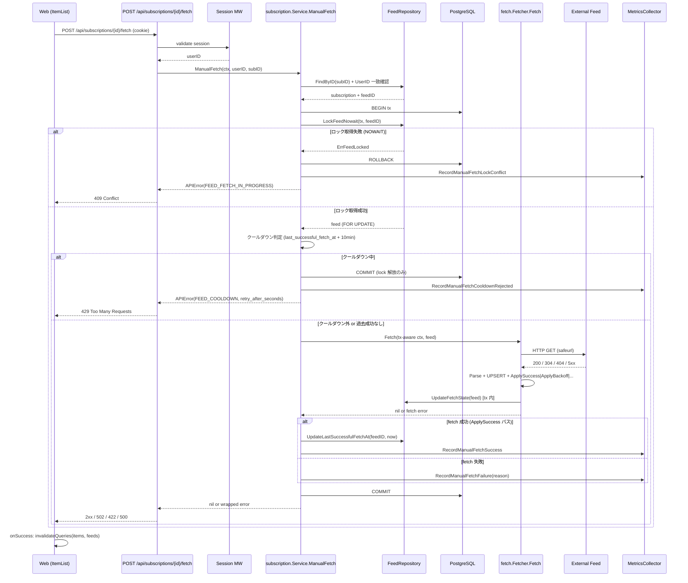
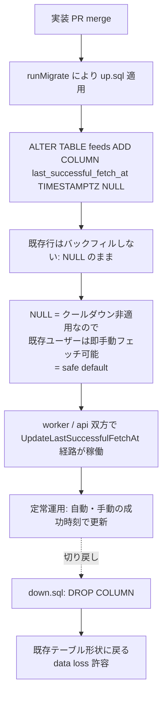

# Design Document

## Overview

**Purpose**: 本機能は「次の自動フェッチサイクルを待たずに任意の購読フィードを即時更新する手段」を、Feedman に
ログインしたユーザーに提供する。ユーザーは記事一覧ヘッダー右上の更新ボタンから 1 クリックで対象フィードの
取得・パース・記事 UPSERT を起動し、完了直後に最新の記事一覧と未読バッジを確認できる。

**Users**: 認証済みユーザーが日常の閲覧ワークフローの中で、新規登録直後のフィードや今すぐ読みたい更新がある
場面で利用する。運用者は外部サイトへの DoS と自動ワーカーとの二重実行を恐れずに済むよう、10 分クールダウン
と行ロックによる排他制御が同時に効くことを期待する。

**Impact**: 現在 Feedman のフィード取得は worker プロセスのスケジューラのみが起動経路で、api プロセス側には
`internal/worker/fetch` 系の配線が存在しない（`internal/app/app.go:runServe` 参照）。本機能では api プロセスにも
同一の `fetch.Fetcher` を依存配線し、同期 HTTP 経路から既存 fetcher を再利用する形で実装する。`feeds` テーブル
には「最終成功時刻」を保持する新規カラム `last_successful_fetch_at` を追加し、worker / api の双方の成功経路で
更新する。クライアント側は `web/src/components/item-list.tsx` の filter tabs 右側に更新ボタン UI を追加する。

### Goals

- 認証済みユーザーが自身の購読 1 件に対して同期的に手動フェッチを起動できる API（`POST /api/subscriptions/{id}/fetch`）を提供する
- 10 分クールダウン制御を行サイドで判定し、クールダウン中は外部 HTTP を発行せず HTTP 429 を返す
- 自動ワーカーと手動フェッチが同一フィードを二重実行しないよう、`SELECT ... FOR UPDATE NOWAIT` による非ブロッキング行ロックで排他する
- 既存 fetcher 経路を再利用し、SSRF・サニタイズ・状態遷移ルール・next_fetch_at 計算の挙動を自動フェッチと完全に同一に保つ
- 手動フェッチの成功 / 失敗 / クールダウン拒否 / 競合拒否を区別可能な Prometheus カウンタとして公開する
- フロントエンドで完了直後に記事一覧と未読数を自動再取得し、追加操作なしで結果を確認可能にする
- 失敗時はエラー区分（クールダウン / 競合 / 認証切れ / 一時的失敗）が判別できるインライン通知を表示する

### Non-Goals

- 複数フィードの一括手動更新（1 リクエスト = 1 購読 ID のみ）
- 手動更新の進捗ストリーミング表示（取得バイト数・パース中件数等）
- 手動更新の履歴・監査ログ画面
- クールダウン時間（10 分）のユーザー個別カスタマイズ
- 手動更新トリガーのキーボードショートカット・Webhook・プッシュ通知
- LaunchDarkly 等の外部 Feature Flag SaaS 連携（本リポジトリは Feature Flag Protocol opt-out）

## Architecture

### Existing Architecture Analysis

現状把握（コードベース調査済み）:

- `internal/handler/router.go` の `/api/subscriptions/{id}` 配下に `Delete` / `PUT /settings` / `POST /resume` が並ぶ。
  本機能は同じグループに `POST /fetch` を追加する。**認証ミドルウェアおよび General レート制限ミドルウェア**は
  グループ単位で `r.Use(...)` 適用済みなので、新規ハンドラーは自動的にこれらの中段に乗る（NFR 2.1 / 2.2 充足）
- `internal/handler/feed_handler.go:mapAPIErrorToHTTPStatus` がドメインエラーコード → HTTP ステータスへの
  単一ディスパッチ点。**ドメイン衝突系（`FEED_NOT_STOPPED`、`SUBSCRIPTION_LIMIT`、`DUPLICATE_SUBSCRIPTION`）は
  すべて 409 で統一**されており（`internal/handler/feed_handler_test.go:953`）、行ロック競合の `FEED_FETCH_IN_PROGRESS`
  も同じ 409 を採用するのが既存慣習との整合上自然
- `internal/subscription/service.go` の `Service` 構造体に `feedRepo` / `subRepo` / `itemStateRepo` が注入済み。
  本機能はここに **`feedFetcher fetch.FeedFetcherService` 依存を追加**して `ManualFetch` メソッドを生やす
- `internal/worker/fetch/fetcher.go:Fetcher.Fetch` は `feed *model.Feed` を受け取り、SSRF 検証 → 条件付き GET →
  パース → UPSERT → `feedRepo.UpdateFetchState(ctx, feed)` を一気通貫で行う既製品。手動フェッチも **このメソッドを
  そのまま呼ぶ**ことで挙動同一性（Req 4.3, NFR 3.1, NFR 3.2）を担保する
- 現状 `runServe` は fetcher を組み立てておらず（`runWorker` のみが配線）、本機能で **serve プロセスにも fetcher
  と必要な repository 依存を組み込む**必要がある（依存配線の追加箇所）
- `internal/database/migrations/20260227120000_initial_schema.up.sql:37-52` 時点で `feeds` テーブルに
  `last_successful_fetch_at` 相当のカラムは存在しない。**新規マイグレーション**で追加する
- メトリクスは `internal/metrics/metrics.go` の `MetricsCollector` interface に集約済みで、`Collector` 実装に
  `manualFetch` 系カウンタを追加する。`NopCollector` と `mockMetricsCollector`（テストヘルパ）も同期更新する
- フロントエンドには toast / sonner 等の通知基盤が未導入。**インラインバナー**で完結させる（追加ライブラリなし）

尊重する制約:
- `context.Context` を第 1 引数で引き回す
- `*model.APIError` で wrap し、ハンドラの単一ディスパッチ点でステータス変換
- 既存 fetcher の状態遷移（ApplySuccess / ApplyBackoff / ApplyStopFeed / ApplyParseFailure）を改変しない

### Architecture Pattern & Boundary Map

採用パターン: **同期 API + 既存 fetcher 再利用 + 行サイド排他制御**。リクエスト受領 → 認可 → 行ロック →
クールダウン判定 → 既存 fetcher 実行 → `last_successful_fetch_at` 更新 → メトリクス記録 → HTTP 応答、を
単一トランザクション + 同一 goroutine で完結させる。非同期キューやワーカ間通信は導入しない。



**Architecture Integration**:
- 採用パターン: 同期 API + 既存 fetcher 再利用 + 行ロック排他（PG `SELECT ... FOR UPDATE NOWAIT`）
- ドメイン／機能境界:
  - **handler 層** は HTTP リクエスト → service 呼び出し → APIError → HTTP マッピングのみ
  - **subscription.Service** に手動フェッチのオーケストレーション（認可 / 行ロック / クールダウン判定 / fetcher 呼び出し / 成功時刻更新 / メトリクス記録）を集約
  - **fetch.Fetcher** は worker 側と完全に同じインスタンスを再利用（NFR 3.1 / 3.2）。手動フェッチ専用の改変は加えない
  - **repository 層** に行ロック取得メソッド `LockFeedForUpdateNowait` と `UpdateLastSuccessfulFetchAt`、および
    `FindByID` の戻り値に `LastSuccessfulFetchAt *time.Time` を追加
  - **metrics** は既存 `MetricsCollector` interface に手動フェッチ系メソッドを追加し、worker / serve 両プロセスから利用可能にする
- 既存パターンの維持:
  - 認証ミドルウェア（Session）と General レート制限はルートグループの `r.Use` 経由で自動適用
  - エラーは `*model.APIError` を経由し、`handleServiceError` → `mapAPIErrorToHTTPStatus` で単一ディスパッチ
  - `feedRepo.UpdateFetchState` で next_fetch_at / consecutive_errors / fetch_status を更新する既存ロジックを温存
- 新規コンポーネントの根拠:
  - `ManualFetch` メソッドは既存 `ResumeFetch` と並列構造を持つため `subscription.Service` への増設が自然
  - `LockFeedForUpdateNowait` は行ロック粒度を repository 層に閉じ込めるための新規メソッド
  - `last_successful_fetch_at` は worker / 手動の両経路から更新される共有カラムであり、`FeedRepository` に専用更新メソッドを置く

### Technology Stack

| Layer | Choice / Version | Role in Feature | Notes |
|-------|------------------|-----------------|-------|
| Frontend / CLI | Next.js 15 + React 19 + TypeScript 5 | 記事一覧ヘッダーへのボタン追加、TanStack Query mutation | shadcn/ui Button、Tailwind CSS 4、Lucide `RotateCw` アイコン |
| Backend / Services | Go 1.25 + chi/v5 + lib/pq | 同期 API ハンドラ、行ロック付きサービス層、既存 fetcher 再利用 | 既存スタックを温存、追加ライブラリなし |
| Data / Storage | PostgreSQL 16 + golang-migrate | `feeds.last_successful_fetch_at TIMESTAMPTZ NULL` カラム追加、`SELECT ... FOR UPDATE NOWAIT` | バックフィル無し（NULL = 過去成功なし） |
| Messaging / Events | （なし） | 同期実行のため非同期メッセージング不要 | NFR 1.1: 単一リクエストで完結 |
| Infrastructure / Runtime | Docker + GitHub Actions CI | 既存スタックを温存 | api プロセスへの fetcher 配線追加のみ |
| Security | safeurl + bluemonday | SSRF（既存 fetcher 経由で適用）+ HTML サニタイズ（既存 UPSERT 経由で適用） | Req 4.1 / 4.3 |
| Metrics | prometheus/client_golang | 手動フェッチ専用カウンタ 4 種 | `feedman_manual_fetch_total{result="..."}` ラベル付き 1 メトリクスに統合 |

## File Structure Plan

### Directory Structure

```
internal/
├── database/migrations/
│   ├── 20260528120000_add_feeds_last_successful_fetch_at.up.sql      # 新規: カラム追加
│   └── 20260528120000_add_feeds_last_successful_fetch_at.down.sql    # 新規: カラム削除
├── model/
│   ├── feed.go                                                        # 変更: Feed struct に LastSuccessfulFetchAt *time.Time 追加
│   └── errors.go                                                      # 変更: ErrCodeFeedFetchInProgress / ErrCodeFeedCooldown 定数 + 生成関数
├── repository/
│   ├── interfaces.go                                                  # 変更: FeedRepository に LockFeedForUpdateNowait / UpdateLastSuccessfulFetchAt 追加
│   └── postgres_feed_repo.go                                          # 変更: 上記メソッド実装 + Scan に last_successful_fetch_at 追加
├── subscription/
│   ├── service.go                                                     # 変更: feedFetcher 依存追加 + ManualFetch メソッド追加
│   └── service_test.go                                                # 変更: ManualFetch のユニットテスト追加（クールダウン境界 / 行ロック競合 / fetch 失敗）
├── handler/
│   ├── subscription_handler.go                                        # 変更: ManualFetch ハンドラ + SubscriptionServiceInterface 拡張
│   ├── subscription_handler_test.go                                   # 変更: ManualFetch のハンドラテスト追加
│   ├── feed_handler.go                                                # 変更: mapAPIErrorToHTTPStatus に FEED_FETCH_IN_PROGRESS=409 / FEED_COOLDOWN=429 追加
│   ├── feed_handler_test.go                                           # 変更: 上記 HTTP マッピングテスト追加
│   ├── service_adapter.go                                             # 変更: SubscriptionServiceAdapter に ManualFetch アダプタ追加
│   └── router.go                                                      # 変更: /api/subscriptions/{id}/fetch ルート追加 + RouterDeps に変更なし
├── metrics/
│   ├── metrics.go                                                     # 変更: MetricsCollector interface に Record系メソッド追加 + Collector 実装
│   ├── metrics_test.go                                                # 変更: 新規メトリクスのテスト追加
│   └── nop.go                                                         # 変更: NopCollector に新規メソッドの no-op 実装追加
├── worker/fetch/
│   └── fetcher.go                                                     # 変更（最小限）: ApplySuccess 成功経路で last_successful_fetch_at を set する場合は同ファイル内で対応。詳細は「データ更新の責務」節を参照
└── app/
    └── app.go                                                         # 変更: runServe に fetcher と必要 repo の依存配線を追加 + subscription.NewService への fetcher 注入

web/src/
├── components/
│   ├── item-list.tsx                                                  # 変更: ItemListHeader（filter tabs 右）に ManualRefreshButton 追加 + バナー領域
│   ├── item-list.test.tsx                                             # 変更: ボタン表示 / disabled / aria 属性 / エラーバナー表示のテスト
│   └── manual-refresh-banner.tsx                                      # 新規: エラー区分別メッセージを表示するインラインバナー（成功は表示しない）
├── hooks/
│   ├── use-manual-refresh.ts                                          # 新規: useMutation で POST /api/subscriptions/{id}/fetch、成功時に invalidateQueries(["items"] / ["feeds"])
│   └── use-manual-refresh.test.tsx                                    # 新規: mutation 成功 / 各エラーパスのテスト
└── types/
    └── feed.ts                                                        # 変更: Subscription に id は既存。新規型として ManualFetchError(status / code / retry_after_seconds) を追加
```

### Modified Files

- `internal/database/migrations/20260528120000_add_feeds_last_successful_fetch_at.up.sql` (新規) — `ALTER TABLE feeds ADD COLUMN last_successful_fetch_at TIMESTAMPTZ NULL`。バックフィルしない（NULL = 過去成功なし、クールダウン非適用）
- `internal/database/migrations/20260528120000_add_feeds_last_successful_fetch_at.down.sql` (新規) — `ALTER TABLE feeds DROP COLUMN last_successful_fetch_at`
- `internal/model/feed.go` — `Feed` struct に `LastSuccessfulFetchAt *time.Time` を追加（NULL 表現のため pointer）
- `internal/model/errors.go` — `ErrCodeFeedFetchInProgress = "FEED_FETCH_IN_PROGRESS"` / `ErrCodeFeedCooldown = "FEED_COOLDOWN"` 定数 + `NewFeedFetchInProgressError()` / `NewFeedCooldownError(retryAfterSeconds int)` 生成関数。後者は `APIError` 構造体を拡張せず `Action` フィールドに残り秒を平文で記述する代わりに、**`APIError` に optional の `Details map[string]any` フィールドを 1 つだけ追加**して `Details["retry_after_seconds"]` を載せる（後方互換: 既存テストは Details を参照しない）
- `internal/repository/interfaces.go` — `FeedRepository` に `LockFeedForUpdateNowait(ctx, tx, feedID) (*model.Feed, error)` と `UpdateLastSuccessfulFetchAt(ctx, feedID, at time.Time) error` を追加
- `internal/repository/postgres_feed_repo.go` — 上記 2 メソッドを `*sql.DB` / `*sql.Tx` 双方で動かすため `dbExecutor` interface 経由で実装。`FindByID` / `FindByFeedURL` / `ListDueForFetch` の SELECT 句に `last_successful_fetch_at` を追加し Scan
- `internal/subscription/service.go` — `Service` に `feedFetcher fetch.FeedFetcherService` と `txBeginner repository.TxBeginner` を依存追加。`ManualFetch(ctx, userID, subscriptionID) (*SubscriptionInfo, error)` を新設
- `internal/handler/subscription_handler.go` — `SubscriptionServiceInterface` に `ManualFetch(ctx, userID, subscriptionID string) (*subscriptionResponse, error)` 追加、`(*SubscriptionHandler).ManualFetch` ハンドラ追加
- `internal/handler/feed_handler.go` — `mapAPIErrorToHTTPStatus` の switch に `case ErrCodeFeedFetchInProgress: return http.StatusConflict` / `case ErrCodeFeedCooldown: return http.StatusTooManyRequests` を追加。`middleware.WriteErrorResponse` が `APIError.Details` を JSON ボディに含めるよう `internal/middleware` 側の writer も連動修正
- `internal/handler/service_adapter.go` — `SubscriptionServiceAdapter.ManualFetch` を追加（`subscription.Service.ManualFetch` を呼んで `*SubscriptionInfo` → `*subscriptionResponse` 変換）
- `internal/handler/router.go` — `r.Route("/api/subscriptions", ...)` の `r.Route("/{id}", ...)` 内に `r.Post("/fetch", subHandler.ManualFetch)` を 1 行追加
- `internal/metrics/metrics.go` — `MetricsCollector` に `RecordManualFetchSuccess()` / `RecordManualFetchFailure(reason string)` / `RecordManualFetchCooldownRejected()` / `RecordManualFetchLockConflict()` を追加。実装は `feedman_manual_fetch_total` CounterVec（label: `result`）に集約
- `internal/metrics/nop.go` — 上記 4 メソッドの no-op 実装を追加
- `internal/app/app.go` — `runServe` に worker と同じ手順で fetcher / ssrfGuard / upsertSvc / collector を組み立てる依存配線を追加。`subscription.NewService` に fetcher と `txBeginner` を渡す。serve プロセスでも `metrics.NewCollector(serveRegistry)` の戻り値を受け取り保持（現状は `_` 廃棄）
- `web/src/components/item-list.tsx` — `ItemList` 内部に `ManualRefreshButton` 子コンポーネントを追加（filter tabs の右隣 `flex justify-between` レイアウト）。エラー時のみ `ManualRefreshBanner` をフィルタタブ直下に表示
- `web/src/components/manual-refresh-banner.tsx` (新規) — `ApiError` の status / body から表示メッセージを決定する純粋表示コンポーネント
- `web/src/hooks/use-manual-refresh.ts` (新規) — `useMutation<void, ApiError, string>` で `POST /api/subscriptions/{id}/fetch`。`onSuccess` で `["items", feedId]` と `["feeds"]` を `invalidateQueries`
- `web/src/types/feed.ts` — 既存 `Subscription` 型は不変。`ManualFetchErrorBody` 型を追加（`{ error: { code, message, category, action, details?: { retry_after_seconds?: number } } }`）

### データ更新の責務（重要な設計判断）

`last_successful_fetch_at` の更新責務をどこに置くかは設計上の中核論点で、以下を採用する:

- **手動経路**: `subscription.Service.ManualFetch` が、fetcher の戻り値が nil（成功 = `ApplySuccess` パス到達）の
  ときに `feedRepo.UpdateLastSuccessfulFetchAt(feedID, now)` を **同一 tx 内**で呼ぶ
- **自動経路（worker）**: `internal/worker/fetch/fetcher.go` の **`ApplySuccess` 呼び出し直後**（200 OK 成功パス
  および 304 Not Modified 成功パスの両方）に `feedRepo.UpdateLastSuccessfulFetchAt(feed.ID, now)` を呼び出す。
  `UpdateFetchState` と同一の `*sql.DB` 経由でも問題ないが、**1 件 INSERT で済む追加 UPDATE が冪等であるため** 別
  クエリで発行する（既存 `UpdateFetchState` のシグネチャを変更しない後方互換最優先）

判定起点としては worker 成功時刻と手動成功時刻の両方を同等に扱う（Req 2.4）。判定は **`time.Now().Sub(*feed.LastSuccessfulFetchAt) < 10 * time.Minute`**。`LastSuccessfulFetchAt == nil` のときはクールダウン非適用（Req 2.5）。

## Requirements Traceability

| Requirement | Summary | Components | Interfaces | Flows |
|-------------|---------|------------|------------|-------|
| 1.1 | 同期で取得・パース・UPSERT 完了後 2xx | Handler.ManualFetch / Service.ManualFetch / Fetcher.Fetch | `POST /api/subscriptions/{id}/fetch` 成功時 200 | Sequence: 成功パス |
| 1.2 | 最終成功時刻をリクエスト完了時刻で更新 | Service.ManualFetch / FeedRepository.UpdateLastSuccessfulFetchAt | `UpdateLastSuccessfulFetchAt(feedID, time.Now())` | Sequence: ApplySuccess 直後 |
| 1.3 | フェッチ完了まで応答返さない | Handler.ManualFetch（goroutine 化しない） | 同期呼び出し | Sequence: 全体が単一 goroutine |
| 1.4 | 未認証は 401、フェッチ実行しない | Session MW + Handler.ManualFetch の UserIDFromContext | `WriteErrorResponse(401, UNAUTHORIZED)` | Sequence: Auth 失敗で短絡 |
| 1.5 | 存在しない subID は 404 | Service.ManualFetch の FindByID nil 判定 | `model.NewSubscriptionNotFoundError` | 認可ステップ |
| 1.6 | 他人の subID も 404（情報示唆しない） | Service.ManualFetch の UserID 不一致時も SubscriptionNotFound を返す | 既存 ResumeFetch と同パターン | 認可ステップ |
| 1.7 | ボディ不要 | Handler.ManualFetch は req body を読まない | URL path param のみ | Handler 入口 |
| 2.1 | クールダウン中は外部 HTTP 出さず 429 | Service.ManualFetch のクールダウン判定 | `model.NewFeedCooldownError(retryAfter)` | Sequence: クールダウン分岐 |
| 2.2 | 429 ボディに残り時間 | NewFeedCooldownError が `Details.retry_after_seconds` を載せる | `APIError.Details` 追加フィールド | Error Handling 節 |
| 2.3 | 10 分超は通常実行 | Service.ManualFetch の判定 `now.Sub(last) >= 10min` | 定数 `cooldownDuration = 10 * time.Minute` | Sequence: クールダウン外分岐 |
| 2.4 | 自動・手動の成功時刻を同等扱い | 共通カラム `feeds.last_successful_fetch_at` を両経路から更新 | Migration + Worker fetcher 変更 + Service.ManualFetch | データモデル節 |
| 2.5 | 成功実績なし時はクールダウン非適用 | Service.ManualFetch の `LastSuccessfulFetchAt == nil` 分岐 | nil チェック | Sequence: 過去成功なし分岐 |
| 3.1 | 非ブロッキング排他ロック取得後に処理開始 | FeedRepository.LockFeedForUpdateNowait | `SELECT ... FROM feeds WHERE id = $1 FOR UPDATE NOWAIT` | Sequence: tx 開始直後 |
| 3.2 | 競合時は待機せず即座に 4xx | FeedRepository.LockFeedForUpdateNowait が PG ErrCode 55P03 (lock_not_available) を検知 | `model.NewFeedFetchInProgressError()` → 409 | Sequence: ロック失敗分岐 |
| 3.3 | 競合エラーボディに再試行案内 | NewFeedFetchInProgressError の Action 文字列 | `APIError.Action: "現在フェッチが進行中です。しばらく待ってから再試行してください。"` | Error Handling 節 |
| 3.4 | ロックはレスポンス返却前に解放 | tx の COMMIT / ROLLBACK で必ず解放 | `defer tx.Rollback()` / 明示的 COMMIT | Service.ManualFetch のスコープ |
| 4.1 | SSRF 対策（自動と同等） | Fetcher.Fetch 内の ssrfGuard.ValidateURL を再利用 | 既存 `security.NewSSRFGuard()` 流用 | Sequence: F が ValidateURL 実行 |
| 4.2 | SSRF 拒否時は外部 HTTP なし + 中立失敗 | Fetcher 経由で ApplyStopFeed → SSRF 由来 APIError は返さず汎用 FETCH_FAILED にマップ | Service.ManualFetch がエラー分類を集約 | Error Handling: 5xx 系 |
| 4.3 | サニタイズも自動と同一 | item.ItemUpsertService 経由（bluemonday） | 既存 sanitizer 流用 | Sequence: F → upsertSvc |
| 5.1 | フィード選択時に更新ボタンを filter tabs 右に表示 | ItemList.ItemListHeader / ManualRefreshButton | `<Button aria-label="フィードを更新">` | Component: ItemList |
| 5.2 | 未選択時は非表示 or disabled | ItemList が feedId === null のときは早期 return（既存挙動） | 既存 `if (feedId === null)` ガード | Component: ItemList |
| 5.3 | クリックで 1 件だけ発行 | useManualRefresh の `isPending` で disabled 制御 | useMutation の `mutate` は重複起動しない | Hook: useManualRefresh |
| 5.4 | レスポンス到達まで disabled + 回転 | `isPending` を ButtonProps と `<RotateCw className={cn(isPending && "animate-spin")} />` に渡す | Tailwind `animate-spin` | Component: ManualRefreshButton |
| 5.5 | レスポンス後にアニメ停止 + 操作可能 | `isPending` が false に戻る | useMutation の自然なライフサイクル | Hook + Component |
| 5.6 | disabled 中は重複発行しない | ボタンの `disabled={isPending}` 属性 | HTML button native semantics | Component |
| 6.1 | 成功時に記事一覧再取得 | useManualRefresh の onSuccess で `queryClient.invalidateQueries({ queryKey: ["items", feedId] })` | TanStack Query | Hook |
| 6.2 | 成功時に未読バッジ再取得 | useManualRefresh の onSuccess で `queryClient.invalidateQueries({ queryKey: ["feeds"] })` | TanStack Query | Hook |
| 6.3 | 再取得中も既存表示維持 | invalidateQueries は背景再取得（keepPreviousData は不要、既存 useInfiniteQuery が前ページ保持） | TanStack Query | Hook |
| 7.1 | 429 → クールダウン通知 | ManualRefreshBanner が status === 429 を分岐 | `body.error.details.retry_after_seconds` を表示 | Component |
| 7.2 | 409 → フェッチ中通知 | ManualRefreshBanner が status === 409 を分岐 | 既定メッセージ | Component |
| 7.3 | 401 → 認証切れ通知 | ManualRefreshBanner が status === 401 を分岐 | 再ログイン動線文言 | Component |
| 7.4 | 5xx / ネットワーク → 一時的失敗通知 | ManualRefreshBanner が status >= 500 / `!isApiError` 分岐 | 再試行可能文言 | Component |
| 7.5 | 失敗時は記事一覧維持 | onError は invalidateQueries を呼ばない | useMutation の onError 経路 | Hook |
| 8.1 | 成功カウンタ +1 | metrics.RecordManualFetchSuccess | `feedman_manual_fetch_total{result="success"}` | Metrics 節 |
| 8.2 | 失敗カウンタ +1（理由カテゴリ別） | metrics.RecordManualFetchFailure(reason) | `result="fetch_error"` / `"parse_error"` / `"upsert_error"` 等 | Metrics 節 |
| 8.3 | クールダウン拒否カウンタ +1 | metrics.RecordManualFetchCooldownRejected | `result="cooldown_rejected"` | Metrics 節 |
| 8.4 | 競合拒否カウンタ +1 | metrics.RecordManualFetchLockConflict | `result="lock_conflict"` | Metrics 節 |
| 8.5 | 自動と区別可能 | メトリクス名が `feedman_manual_fetch_total` で区別、自動は既存 `feedman_fetch_success_total` 系 | Prometheus メトリクス名 | Metrics 節 |
| NFR 1.1 | 自動と同一タイムアウト上限 | Fetcher を `cfg.FetchTimeout` で初期化（worker と同設定値） | `fetchpkg.NewFetcher(..., cfg.FetchTimeout, ...)` | runServe 配線 |
| NFR 1.2 | 拒否レスポンスを 500ms 以内 | クールダウン分岐・行ロック失敗分岐は外部 HTTP を発行しない | service 内のローカル判定のみ | テスト戦略で結合計測 |
| NFR 1.3 | 別フィードへの並行手動フェッチを妨げない | ロックは feedID 単位、`subscription.Service` は state を持たない | per-request 独立 tx | Architecture 節 |
| NFR 2.1 | 既存認証ミドルウェアと同一 | router.go の `/api/subscriptions` グループ内に配置 | 既存 `r.Use(NewSessionMiddleware(...))` 適用済み | Router 配線 |
| NFR 2.2 | 既存レート制限の対象 | 同上、`GeneralMiddleware()` も適用済み | rateLimiter.GeneralMiddleware() | Router 配線 |
| NFR 3.1 | 自動ワーカーのスケジューリングロジック温存 | Fetcher.Fetch の ApplySuccess / ApplyBackoff を再利用 | 既存挙動の改変なし | Existing Analysis |
| NFR 3.2 | フィード状態遷移ルール温存 | Fetcher 内の Apply* を再利用 | 既存挙動の改変なし | Existing Analysis |

## Components and Interfaces

### Handler Layer

#### SubscriptionHandler.ManualFetch

| Field | Detail |
|-------|--------|
| Intent | `POST /api/subscriptions/{id}/fetch` を受け、認証・パスパラメータ抽出・サービス呼び出し・HTTP マッピングを行う |
| Requirements | 1.1, 1.4, 1.5, 1.6, 1.7, 5.x（API 経由）, 7.x（HTTP ステータス）, NFR 2.x |

**Responsibilities & Constraints**
- HTTP 入出力に専念し、ビジネスロジック（クールダウン / 行ロック / fetcher 呼び出し）には踏み込まない
- リクエストボディを読まない（パラメータは `chi.URLParam(r, "id")` のみ）
- 認証エラーは `middleware.UserIDFromContext` が返すエラーで 401 短絡
- それ以外のエラーは `handleServiceError` 経由で APIError → HTTP マッピング

**Dependencies**
- Inbound: chi Router via `r.Post("/fetch", subHandler.ManualFetch)` — エンドポイント配線 (Critical)
- Outbound: `SubscriptionServiceInterface.ManualFetch` — オーケストレーション呼び出し (Critical)
- External: なし

**Contracts**: API [x] / Service [ ] / Event [ ] / Batch [ ] / State [ ]

##### API Contract

| Method | Endpoint | Request | Response | Errors |
|--------|----------|---------|----------|--------|
| POST | `/api/subscriptions/{id}/fetch` | (no body) | 200 OK: `{ id, user_id, feed_id, feed_title, ..., unread_count, created_at }` (subscriptionResponse) | 401 UNAUTHORIZED / 404 SUBSCRIPTION_NOT_FOUND / 409 FEED_FETCH_IN_PROGRESS / 429 FEED_COOLDOWN / 502 FETCH_FAILED / 422 PARSE_FAILED / 500 INTERNAL_ERROR |

### Service Layer

#### subscription.Service.ManualFetch

| Field | Detail |
|-------|--------|
| Intent | 認可・行ロック・クールダウン判定・既存 fetcher 呼び出し・成功時刻更新・メトリクス記録を単一トランザクションで完結させる |
| Requirements | 1.1, 1.2, 1.5, 1.6, 2.1, 2.3, 2.4, 2.5, 3.1, 3.2, 3.3, 3.4, 4.1, 4.3, 6.x（API レスポンス精度）, 8.x |

**Responsibilities & Constraints**
- 単一 goroutine / 単一 tx で完結（ロックは feedID 行のみ、保持期間は fetcher 完了まで）
- 認可: `subRepo.FindByID(subID)` が nil または UserID 不一致のときは即 SubscriptionNotFound（Req 1.5 / 1.6）
- クールダウン判定の起点は `feed.LastSuccessfulFetchAt`（pointer）。nil は非適用、非 nil は `now - *last < 10min` で拒否
- クールダウン判定で 429 を返す場合でも、ロックは取得した状態で COMMIT して解放する（ロックは判定終了で即座に release してよい）
- fetch 経路で `Fetcher.Fetch` が nil を返した場合のみ「成功」と判定し `last_successful_fetch_at` を更新する。**Fetcher 内部で `ApplyBackoff` / `ApplyParseFailure` 経路に入ったケースは `Fetch` が nil を返す既存挙動（例: 304 では nil、パース失敗時も既存実装は nil を返す）と区別が必要**。本機能では「Fetch から返ったエラー値が nil かつ `feed.FetchStatus == FetchStatusActive` かつ `feed.ConsecutiveErrors == 0`」を成功条件とし、その場合のみ `last_successful_fetch_at` を更新する（既存 ApplySuccess 後の Feed 状態と一致）
- メトリクスは return path ごとに一度だけ記録（重複記録を避けるため defer ではなく明示的に呼ぶ）

**Dependencies**
- Inbound: SubscriptionServiceAdapter.ManualFetch — handler 層からのエントリ (Critical)
- Outbound:
  - `repository.TxBeginner.BeginTx` — トランザクション開始 (Critical)
  - `repository.FeedRepository.LockFeedForUpdateNowait` — 非ブロッキング行ロック (Critical)
  - `repository.FeedRepository.UpdateLastSuccessfulFetchAt` — 成功時刻更新 (Critical)
  - `repository.SubscriptionRepository.FindByID` — 認可 (Critical)
  - `fetch.FeedFetcherService.Fetch` — 既存 fetcher 再利用 (Critical)
  - `metrics.MetricsCollector` — メトリクス記録 (High)
- External: なし

**Contracts**: Service [x] / API [ ] / Event [ ] / Batch [ ] / State [ ]

##### Service Interface

```go
// ManualFetch は指定購読のフィードを手動で同期フェッチする。
// クールダウン中は外部 HTTP を発行せず FEED_COOLDOWN を返し、
// 行ロック競合時は FEED_FETCH_IN_PROGRESS を返す。
// 成功時は更新後の SubscriptionInfo を返す。
func (s *Service) ManualFetch(ctx context.Context, userID, subscriptionID string) (*SubscriptionInfo, error)
```

- Preconditions:
  - `ctx` は認証済み（呼び出し側で UserID 抽出済み）
  - `subscriptionID` は path 経由で渡された non-empty 文字列
  - `s.feedFetcher` は serve / worker いずれかから既存実装が注入済み
- Postconditions:
  - 成功時: 対象 feed の `last_successful_fetch_at = now()`、`UpdateFetchState` で fetch_status / next_fetch_at / etc が更新済み
  - 失敗時: `last_successful_fetch_at` は変化なし。fetcher が `UpdateFetchState` を呼ぶケースでは fetch_status が変化する可能性あり（既存挙動）
  - 拒否時（クールダウン / 競合）: feeds テーブルへの書き込みは行わない（クールダウン分岐は COMMIT、競合は ROLLBACK）
- Invariants:
  - 1 リクエスト = 1 行ロックのみ取得。複数行を跨ぐロックは取らない（NFR 1.3）
  - メトリクスカウンタは 1 リクエストにつきちょうど 1 回 + 1 種別のみ記録

### Fetcher Layer

#### fetch.Fetcher.Fetch（再利用）

| Field | Detail |
|-------|--------|
| Intent | 既存実装をそのまま再利用。手動経路でも同じ SSRF / 条件付き GET / UPSERT / 状態遷移を適用する |
| Requirements | 4.1, 4.3, NFR 3.1, NFR 3.2 |

**Responsibilities & Constraints**
- 本機能では `Fetcher` のシグネチャを変更しない（既存 worker 経路への影響ゼロ）
- ただし `ApplySuccess` 呼び出し直後（200 OK パスと 304 Not Modified パスの 2 箇所）に
  `f.feedRepo.UpdateLastSuccessfulFetchAt(ctx, feed.ID, time.Now())` を 1 行追加する
- この変更は worker / api 共通の成功時刻記録経路となり、Req 2.4 を構造的に保証する

**Dependencies**
- Inbound: subscription.Service.ManualFetch（新）/ fetch.Scheduler.RunOnce（既存） (Critical)
- Outbound: 既存依存（feedRepo / subRepo / upsertSvc / ssrfGuard / metrics） + UpdateLastSuccessfulFetchAt 1 メソッド追加

**Contracts**: Service [x]（既存）

### Repository Layer

#### FeedRepository.LockFeedForUpdateNowait

| Field | Detail |
|-------|--------|
| Intent | 指定 feedID の行に対し `SELECT ... FOR UPDATE NOWAIT` を発行し、競合時は `ErrFeedLocked` を返す |
| Requirements | 3.1, 3.2, 3.4 |

##### Service Interface

```go
// LockFeedForUpdateNowait は指定フィード行に対し非ブロッキング排他ロック（FOR UPDATE NOWAIT）を取得する。
// 既に別トランザクションがロックを保持している場合は ErrFeedLocked を返し、待機しない。
// 取得したロックは tx の COMMIT / ROLLBACK で自動解放される。
func (r *PostgresFeedRepo) LockFeedForUpdateNowait(ctx context.Context, tx *sql.Tx, feedID string) (*model.Feed, error)

// ErrFeedLocked は対象フィード行が別トランザクションによって既にロックされている場合に返される。
// PostgreSQL ErrCode 55P03 (lock_not_available) を判定し、上位レイヤ用に sentinel error として正規化する。
var ErrFeedLocked = errors.New("feed row is currently locked by another transaction")
```

- Preconditions: `tx != nil`、`feedID` は UUID 形式
- Postconditions: 成功時はロック取得済みの `*model.Feed` を返す。`ErrFeedLocked` 時はロックを保持しない
- Invariants: NOWAIT により呼び出し側は最大 ~1ms 程度で結果を得る（NFR 1.2 充足の前提）

#### FeedRepository.UpdateLastSuccessfulFetchAt

```go
// UpdateLastSuccessfulFetchAt は指定フィードの last_successful_fetch_at を更新する。
// dbExecutor 経由で *sql.DB と *sql.Tx の双方から呼び出し可能。
func (r *PostgresFeedRepo) UpdateLastSuccessfulFetchAt(ctx context.Context, feedID string, at time.Time) error
```

### Metrics Layer

#### feedman_manual_fetch_total

| Field | Detail |
|-------|--------|
| Intent | 手動フェッチの実行状況（成功 / 失敗カテゴリ別 / クールダウン拒否 / 競合拒否）を Prometheus カウンタとして公開 |
| Requirements | 8.1, 8.2, 8.3, 8.4, 8.5 |

**メトリクス定義**:

```go
manualFetchTotal = prometheus.NewCounterVec(prometheus.CounterOpts{
    Name: "feedman_manual_fetch_total",
    Help: "手動フェッチの実行回数（result ラベルで成功・失敗カテゴリ・拒否を区別）",
}, []string{"result"})
```

`result` ラベル値:
- `success` — Req 8.1
- `fetch_error` — HTTP 取得失敗（タイムアウト / DNS / 接続失敗） — Req 8.2
- `parse_error` — パース失敗 — Req 8.2
- `upsert_error` — UPSERT 失敗 — Req 8.2
- `ssrf_blocked` — SSRF 拒否 — Req 8.2, 4.2
- `cooldown_rejected` — クールダウン拒否 — Req 8.3
- `lock_conflict` — 行ロック競合 — Req 8.4

自動フェッチ系の既存メトリクス（`feedman_fetch_success_total` / `feedman_fetch_fail_total` 等）とは別名のため、
PromQL から両者を独立にクエリ可能（Req 8.5）。

### Web Hook

#### useManualRefresh

| Field | Detail |
|-------|--------|
| Intent | 指定 subscriptionId に対する手動フェッチ mutation を提供し、成功時に items / feeds のキャッシュを invalidate する |
| Requirements | 5.3, 5.4, 5.5, 5.6, 6.1, 6.2, 6.3, 7.5 |

```typescript
/**
 * 指定購読の手動フェッチを起動する mutation フック。
 * `mutate(subscriptionId)` 呼び出し中は `isPending=true` となり、
 * 成功時に items / feeds キャッシュを invalidate する（失敗時は invalidate しない）。
 */
export function useManualRefresh(feedId: string | null): UseMutationResult<void, ApiError, string>
```

**Responsibilities & Constraints**
- mutation 引数は `subscriptionId: string`
- `onSuccess`: `queryClient.invalidateQueries({ queryKey: ["items", feedId] })` + `queryClient.invalidateQueries({ queryKey: ["feeds"] })`
- `onError`: invalidate しない（Req 7.5 = 既存表示を維持）
- 重複起動防止は呼び出し側コンポーネントが `isPending` を見て disabled 制御（hook 自体に重複ガードは持たない、TanStack Query の native semantics で十分）

### Web Component

#### ManualRefreshButton（ItemList 内部の子コンポーネント）

| Field | Detail |
|-------|--------|
| Intent | フィルタタブ群の右隣に表示する「フィードを更新」ボタン |
| Requirements | 5.1, 5.2, 5.3, 5.4, 5.5, 5.6 |

**実装方針**（疑似コード）:

```tsx
function ManualRefreshButton({ subscriptionId, feedId }: { subscriptionId: string; feedId: string }) {
  const { mutate, isPending } = useManualRefresh(feedId);
  return (
    <button
      type="button"
      aria-label="フィードを更新"
      aria-busy={isPending}
      disabled={isPending}
      onClick={() => mutate(subscriptionId)}
      className="..."
    >
      <RotateCw aria-hidden="true" className={cn("w-4 h-4", isPending && "animate-spin")} />
    </button>
  );
}
```

- `aria-label="フィードを更新"`: スクリーンリーダー対応（icon-only button のラベル提供）
- `aria-busy={isPending}`: ARIA 1.2 で進行中状態を機械可読化
- `disabled={isPending}`: 重複起動防止（HTML semantics）
- `animate-spin`: Tailwind の rotate アニメーション

**未選択時の扱い**（Req 5.2）: `ItemList` は `feedId === null` のとき早期 return しヘッダー自体を描画しない（既存挙動）。
そのため `ManualRefreshButton` も自動的に非表示となる。subscriptionId の解決は `useFeeds` の結果から
`feedId` で `find(f => f.feed_id === feedId)?.id` で行う（既存型 `Subscription.id` を利用）。

#### ManualRefreshBanner（新規ファイル）

| Field | Detail |
|-------|--------|
| Intent | 直前の手動フェッチが失敗したとき、エラー区分別の説明をフィルタタブ直下にインラインバナーとして表示 |
| Requirements | 7.1, 7.2, 7.3, 7.4 |

**表示メッセージマップ**:

| status | code | メッセージ |
|---|---|---|
| 429 | FEED_COOLDOWN | 「最終更新から {retry_after_seconds} 秒以内のため再試行できません。クールダウン解除までお待ちください。」 |
| 409 | FEED_FETCH_IN_PROGRESS | 「現在フェッチ中です。少し時間をおいてから再試行してください。」 |
| 401 | UNAUTHORIZED | 「セッションが切れました。ページを再読み込みしてログインしてください。」 |
| 500-503 / ネットワーク | 任意 | 「一時的なエラーが発生しました。しばらくしてから再試行してください。」 |

`useManualRefresh` の `error` を読み、`ApiError` であれば `status` 別に分岐、それ以外は一時的失敗扱い。
成功時は表示しない（既存挙動を維持）。

### Backend Wiring（runServe 拡張）

`internal/app/app.go:runServe` の依存配線を拡張する:

```go
// 既存 reg リストに加えて：
ssrfGuard := security.NewSSRFGuard()
sanitizer := security.NewContentSanitizer()
serveCollector := metrics.NewCollector(serveRegistry) // 戻り値を受け取る
upsertSvc := item.NewItemUpsertService(itemRepo, sanitizer, item.WithMetrics(serveCollector))
fetcher := fetchpkg.NewFetcher(
    feedRepo, subRepo, upsertSvc, ssrfGuard,
    slog.Default(), cfg.FetchTimeout, cfg.FetchMaxSize,
    fetchpkg.WithMetrics(serveCollector),
)
txBeginner := repository.NewSQLTxBeginner(db) // 既存
subService := subscription.NewService(subRepo, itemStateRepo, feedRepo, fetcher, txBeginner, serveCollector)
```

`subscription.NewService` の引数を増やすが、既存呼び出し箇所は `internal/app/app.go` のみのため変更影響は局所的。
テスト側（`internal/subscription/service_test.go`）は mock を増やして対応。

## Data Models

### Domain Model

- **Feed** アグリゲートに新フィールド `LastSuccessfulFetchAt *time.Time` を追加
  - 値オブジェクトではなく単純な時刻フィールド
  - nil = 過去に成功実績なし（Req 2.5 が適用される）
  - 非 nil = 直近成功時刻。クールダウン判定の起点（Req 2.3 / 2.4）
- **トランザクション境界**: 手動フェッチ 1 リクエストにつき 1 つの tx。tx 内で行ロック取得 → fetcher 実行 → 状態更新を完了
- **invariants**:
  - `LastSuccessfulFetchAt` は単調増加（バックワード更新は発生しない、worker / 手動の両経路で `time.Now()` のみセット）
  - `fetch_status = active` でなくても `LastSuccessfulFetchAt` は記録される（停止フィードでも過去の成功時刻は保持）
  - `LastSuccessfulFetchAt` は `UpdateFavicon` / `UpdateFetchInterval` 等の他更新では一切変化しない

### Physical Data Model

#### Migration: `20260528120000_add_feeds_last_successful_fetch_at.up.sql`

```sql
ALTER TABLE feeds
  ADD COLUMN last_successful_fetch_at TIMESTAMPTZ NULL;

-- バックフィルしない:
-- - 既存 feeds は過去成功実績不明のため NULL のままとする
-- - NULL = クールダウン非適用なので、ユーザーは即座に手動フェッチ可能（safe default）
```

#### Migration: `20260528120000_add_feeds_last_successful_fetch_at.down.sql`

```sql
ALTER TABLE feeds DROP COLUMN last_successful_fetch_at;
```

#### APIError 拡張

`model.APIError` 構造体に optional フィールド `Details map[string]any` を 1 つだけ追加する:

```go
type APIError struct {
    Code     string
    Message  string
    Category string
    Action   string
    Details  map[string]any // 任意。429 等で構造化追加情報を載せる
}
```

JSON シリアライズ時は `Details == nil` なら出力しない（`omitempty`）。これにより既存 APIError の wire format は
不変（既存テストは Details を参照しないため後方互換）。

`middleware.WriteErrorResponse` の出力 JSON は次の形を保つ:

```json
{
  "error": {
    "code": "FEED_COOLDOWN",
    "message": "...",
    "category": "feed",
    "action": "...",
    "details": { "retry_after_seconds": 480 }
  }
}
```

`details` フィールドの出力規約も `middleware.WriteErrorResponse` 側のテストで担保する（後述のテスト戦略）。

## Error Handling

### Error Strategy

すべてのエラーは `*model.APIError` を `fmt.Errorf("...: %w", err)` で wrap せず直接返すか、内部エラーは
ハンドラ層で `INTERNAL_ERROR` に正規化する。手動フェッチ系の新規エラーコードは 2 つのみ追加（行ロック / クールダウン）。

### Error Categories and Responses

| 種別 | HTTP | Code | Category | 発生条件 | User メッセージ案 |
|---|---|---|---|---|---|
| 認証切れ | 401 | UNAUTHORIZED | auth | session 失効・未送信 | 「認証が必要です。ログインしてください。」 |
| 未存在 / 他人 | 404 | SUBSCRIPTION_NOT_FOUND | feed | subID 不存在 or UserID 不一致 | 「指定された購読が見つかりません。」 |
| 行ロック競合 | 409 | FEED_FETCH_IN_PROGRESS | feed | 別 tx がロック保持中 | 「現在フェッチが進行中のためしばらく待ってから再試行してください。」 |
| クールダウン | 429 | FEED_COOLDOWN | feed | last_successful_fetch_at + 10min > now | 「クールダウン中です。再試行まで残り {N} 秒です。」（Details.retry_after_seconds） |
| 外部 HTTP 失敗 | 502 | FETCH_FAILED | feed | fetcher が ApplyBackoff 経路に入り、ConsecutiveErrors > 0 | 「フィードの取得に一時的に失敗しました。」 |
| パース失敗 | 422 | PARSE_FAILED | feed | gofeed parse error（既存 ApplyParseFailure） | 「フィードの解析に失敗しました。」 |
| SSRF 拒否 | 502 | FETCH_FAILED | feed | safeurl が拒否（中立扱い） | 「フィードの取得に一時的に失敗しました。」（SSRF を露呈しない） |
| その他 | 500 | INTERNAL_ERROR | system | DB / 想定外 | 「内部エラーが発生しました。」 |

**4.2 の中立メッセージについて**: Fetcher は SSRF 検出時に `ApplyStopFeed` で fetch_status=stopped にする
（既存挙動）。手動経路では SSRF 検出を `FETCH_FAILED` にマップして上位 UI には「一時的失敗」として返す
（攻撃者に SSRF ガードの存在を露呈しないため）。メトリクスは `result=ssrf_blocked` で内部観測可能。

**User Errors (4xx)**: 入力検証は本機能では path param のみ（純粋に存在チェック）。認可ガイダンス（401 / 404）は
既存メッセージを流用。

**System Errors (5xx)**: graceful degradation は不要（同期 API のため）。Circuit breaker も導入しない
（既存 worker 側にも未導入）。Rate limiting は `GeneralMiddleware` で既存適用済み。

**Business Logic Errors (4xx + 422)**: クールダウン（429）・ロック競合（409）・パース失敗（422）。
状態遷移ガイダンスは Action フィールドで提供。

## Testing Strategy

### Unit Tests（Go）

1. **subscription.Service.ManualFetch — クールダウン境界判定**: `last_successful_fetch_at = now - 9min 59sec` で
   FEED_COOLDOWN を返し、`= now - 10min 0sec` で fetch を実行することを table-driven テストで検証
2. **subscription.Service.ManualFetch — 過去成功なし時の即時実行**: `last_successful_fetch_at = nil` のとき
   `feedFetcher.Fetch` が呼ばれ、成功時に `UpdateLastSuccessfulFetchAt` が呼ばれることをモック検証
3. **subscription.Service.ManualFetch — 認可失敗（404 マッピング）**: subID 不一致 / 他人 / 未存在の 3 ケースを
   table-driven で `SUBSCRIPTION_NOT_FOUND` を返すことを検証
4. **subscription.Service.ManualFetch — 行ロック競合**: `feedRepo.LockFeedForUpdateNowait` が `ErrFeedLocked` を
   返したとき `FEED_FETCH_IN_PROGRESS` を返し、`feedFetcher.Fetch` が呼ばれないことを検証
5. **subscription.Service.ManualFetch — fetch エラー時にメトリクス記録**: fetcher が error を返したとき
   `RecordManualFetchFailure(reason)` が呼ばれることを mock collector で検証
6. **metrics.Collector — manual fetch カウンタの増分**: `RecordManualFetchSuccess` / `RecordManualFetchFailure` /
   `RecordManualFetchCooldownRejected` / `RecordManualFetchLockConflict` で対応 label の counter が +1 することを検証

### Integration Tests（Go + テスト用 PostgreSQL）

1. **POST /api/subscriptions/{id}/fetch — 成功フロー**: 実 PostgreSQL + テスト用フィードサーバで 200 / 304 を
   返し、それぞれで `last_successful_fetch_at` が更新されることを DB から再取得して検証
2. **POST /api/subscriptions/{id}/fetch — 行ロック競合シミュレーション**: 別 goroutine で先に同一フィード行を
   `BEGIN; SELECT ... FOR UPDATE` し続けたまま手動フェッチを起動し、HTTP 409 が **500ms 以内**に返ることを
   `time.Since` で測定（NFR 1.2）。先行 tx は計測後に ROLLBACK
3. **POST /api/subscriptions/{id}/fetch — クールダウン拒否**: `feeds.last_successful_fetch_at = now() - 5min` の
   状態で API を叩き、HTTP 429 + Details.retry_after_seconds の値が 295〜305 秒範囲であることを検証
4. **マイグレーション up/down 整合性**: `up.sql` 適用後にカラムが存在、`down.sql` 適用後に消えることを
   `information_schema.columns` クエリで検証
5. **handler 層 HTTP マッピング**: `mapAPIErrorToHTTPStatus` の table-driven テストに `FEED_FETCH_IN_PROGRESS=409`
   / `FEED_COOLDOWN=429` を追加し、既存テストパターンに沿って `feed_handler_test.go` で検証

### E2E / UI Tests（Vitest + Testing Library）

1. **ItemList — フィード選択時にボタンが表示される**: feedId を指定した状態で `ItemList` を render し、
   `aria-label="フィードを更新"` の button が DOM に存在することを検証
2. **ManualRefreshButton — クリック → disabled + animate-spin**: msw / `vi.fn` で mutation を pending 状態にし、
   button が `disabled` + アイコンに `animate-spin` クラスが付くことを検証
3. **useManualRefresh — 成功時に items / feeds が invalidate される**: mock QueryClient で
   `invalidateQueries` が `["items", feedId]` と `["feeds"]` の 2 回呼ばれることを検証
4. **ManualRefreshBanner — 429 のとき残り時間付きメッセージ**: `error.body.error.details.retry_after_seconds=480`
   を渡し、表示テキストに「480 秒」相当の表記が含まれることを検証
5. **ManualRefreshBanner — 409 / 401 / 5xx 別メッセージ**: status 別の表示メッセージを table-driven で検証

### Performance / Load

1. **クールダウン拒否レスポンスの所要時間**: integration テストの 2 番と同じ枠組みで `time.Since(start) < 500ms`
   をアサート（NFR 1.2）
2. **行ロック競合拒否の所要時間**: 同 500ms 以内（NFR 1.2）
3. **並行手動フェッチ — 別フィード**: feed A をロック保持中に feed B への手動フェッチが正常完了することを
   integration テストで検証（NFR 1.3）

## Security Considerations

- **認証**: 既存 Session ミドルウェア（`/api/subscriptions` グループに `r.Use(NewSessionMiddleware)` 適用済み）が
  cookie 経由のセッション必須を保証（NFR 2.1）
- **認可**: `subscription.Service.ManualFetch` で `subRepo.FindByID(subID).UserID == ctxUserID` を厳格チェック。
  不一致は **存在しないものと同じ** `SUBSCRIPTION_NOT_FOUND` を返し、他人の購読の存在を示唆しない（Req 1.6）
- **SSRF 対策**: 既存 `security.NewSSRFGuard()` を `runServe` の依存配線にも組み込み、worker と同じ
  `safeurl` ベース検証を経由させる（Req 4.1）。SSRF 検出時の UI 露呈は中立メッセージで防ぐ（Req 4.2）
- **サニタイズ**: 既存 `item.ItemUpsertService` 経由（bluemonday）。手動経路でも同じ upsertSvc を使う（Req 4.3）
- **レート制限**: 既存 `rateLimiter.GeneralMiddleware()` がグループ全体に適用済み（NFR 2.2）。手動フェッチ専用の
  追加レート制限は本機能では設けない（10 分クールダウンが事実上のレート制限として機能）

## Performance & Scalability

- **NFR 1.1（タイムアウト）**: 既存 `cfg.FetchTimeout`（既定 10s）を `fetchpkg.NewFetcher` に渡す。
  手動経路でも同一上限を超えない
- **NFR 1.2（拒否レスポンス 500ms 以内）**:
  - クールダウン拒否: 行ロック取得 + 1 行 SELECT + tx COMMIT のみ（外部 HTTP なし）。期待値 < 50ms
  - 行ロック競合拒否: NOWAIT による即時失敗（期待値 < 10ms）
- **NFR 1.3（別フィードへの並行手動フェッチ）**: ロック粒度は feedID 行のみ、service は per-request stateless。
  別フィードへの並行リクエストは互いに干渉しない
- **同一フィードの完全な並行排他**: 手動 × 手動 / 手動 × 自動の全組み合わせで FOR UPDATE NOWAIT が排他を保証

## Migration Strategy



**ロールバック安全性**:
- `down.sql` の `DROP COLUMN` は値を破壊するが、本カラムは派生情報（成功時刻の記録）であり、
  application が機能停止する依存はない（クールダウン判定が無効化 = ユーザーが即手動フェッチ可能になるだけ）
- ただし手動フェッチ機能自体は同時にロールバックされる前提（コード側も revert）
- 部分ロールバック（コードは新、DB は旧）は禁止: コードが `last_successful_fetch_at` を参照する SQL を含むため、
  カラム不在で SELECT が失敗する。デプロイは **マイグレーション → コード反映** の順を厳守

**バックフィル方針**:
- 既存 feeds 行に対する手動バックフィル（`UPDATE feeds SET last_successful_fetch_at = ...`）は行わない
- 理由 1: 「過去成功時刻」の信頼できる代替値が存在しない（next_fetch_at は次回時刻であって last ではない）
- 理由 2: NULL = クールダウン非適用は safe default（ユーザーが不便にならない）
- 理由 3: 自動 worker が次回フェッチ実行時に値を埋めるため、自然な定常運用で全行が埋まる
