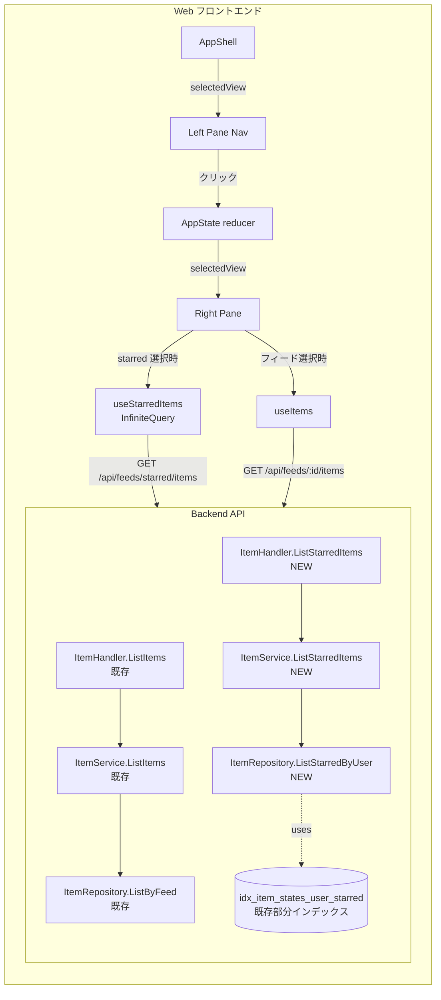

# Design Document

## Overview

**Purpose**: 本機能は「フィードを横断したお気に入り（スター付き）記事の一覧」を、左ペインの固定ナビゲーション項目から 1 クリックで参照できる体験を Feedman ユーザーに提供する。既存のスター機能はフィード単位の `?filter=starred` でしか参照できず、複数フィードにまたがる過去のお気に入り記事を再閲覧する動線が存在しなかった。

**Users**: ログイン済みの Feedman ユーザー全員。ユーザーはこれまで個別フィードに切り替えて `starred` タブを開く必要があったが、本機能により「お気に入り」項目を選択するだけで全フィード横断のスター付き記事を時系列で確認できる。

**Impact**: 左ペインに「お気に入り」ナビゲーション項目を 1 件常時追加し、新規 API `GET /api/feeds/starred/items` を導入して横断取得経路を提供する。既存単一フィード API `GET /api/feeds/{feedID}/items`、スター更新エンドポイント `PUT /api/items/{id}/state`、既存スター部分インデックス `idx_item_states_user_starred`、既存フィード行クリック動線・フィルタタブ動線は一切変更しない。スキーマ追加・マイグレーションは行わない。

### Goals

- 左ペインに「お気に入り」固定ナビ項目（1 件・フィード件数非依存）を追加し、フィード一覧と同等の選択 UI 規約で表示する。
- 「お気に入り」選択時に、現ユーザーの全フィード横断スター付き記事を `published_at` 降順でカーソルベース無限スクロール表示する。
- 新規 API `GET /api/feeds/starred/items` を既存単一フィード API と同一応答スキーマ（`items` / `next_cursor` / `has_more`）で実装し、フロントエンドが既存無限スクロール機構をほぼそのまま再利用できるようにする。
- 既存スター部分インデックス `idx_item_states_user_starred` を破壊しない前提で、単一フィード API と同等の応答時間を維持する（NFR 1.1）。
- ユーザー境界の漏洩を一切起こさない（NFR 2.1）。

### Non-Goals

- フォルダ分け・タグ付け・並べ替えカスタマイズ（要件 Non-Goals 明示）。
- お気に入り以外のフィード横断ビュー（横断「全件」「未読」等）。
- スター更新 API の挙動変更・新規スター操作エンドポイントの追加。
- DB スキーマ追加・新規マイグレーション（既存 `idx_item_states_user_starred` で性能要件を満たす想定。後述「Performance & Scalability」参照）。
- お気に入り一覧上の未読/全件サブフィルタ UI 切替。
- 既存 `GET /api/feeds/{feedID}/items?filter=starred` 経路の廃止（共存で扱う）。

## Architecture

### Existing Architecture Analysis

現行アーキテクチャは以下の 3 層 + フロントエンドで構成される（本機能で尊重する制約）:

- **Handler 層** (`internal/handler/`): chi v5 ベースの HTTP ハンドラ。`middleware.UserIDFromContext(ctx)` でセッション由来 user_id を取り出し、認証失敗時は 401。エラーは `handleServiceError` で `model.APIError` → HTTP status へマップ。
- **Service 層** (`internal/item/service.go`): フィルタ・カーソル検証・`limit+1` 取得による `has_more` 判定・`next_cursor` 算出（`PublishedAt.Format(time.RFC3339Nano)`）を担う。Repository 層に対しては `model.ItemFilter` と `time.Time` cursor を渡す純粋ドメインインターフェースを使う。
- **Repository 層** (`internal/repository/postgres_item_repo.go`): `ListByFeed` が `items LEFT JOIN item_states (ON s.user_id = $1)` + `i.feed_id = $2` で記事を取得し、フィルタごとに `WHERE` を切り替える。カーソルは `i.published_at < $cursor` の単純比較。
- **Web フロントエンド** (`web/src/`): `useInfiniteQuery` + Intersection Observer による無限スクロール。`useItems(feedId, filter)` がクエリキー `["items", feedId, filter]` でキャッシュ管理。`useToggleStar` は楽観的更新 + `onSettled` で `["items"]` キー全体を invalidate する。

これらのパターンを本機能で踏襲し、**新規コンポーネント追加と既存メソッドの並列追加で完結させる**（既存メソッドの signature 変更は行わない）。`idx_item_states_user_starred (user_id, is_starred) WHERE is_starred = true` は `initial_schema` で既に存在しており、スター記事抽出を効率化する前提で利用可能。

### Architecture Pattern & Boundary Map

採用パターン: 既存 3 層 + フロント機構をそのまま流用し、**横軸（フィード単位 → ユーザー単位 + 全フィード）にメソッドを並列追加**する。新規 API は既存ハンドラに統合せず、別ハンドラメソッドとして同一ファイルに追加する。



**Architecture Integration**:

- 採用パターン: 既存 Handler → Service → Repository 3 層パターンを踏襲し、各層に「全フィード横断スター取得」専用のメソッドを並列追加する。
- ドメイン／機能境界: 「単一フィード文脈」と「ユーザー横断スター文脈」を**メソッド単位で分離**し、引数（`feedID` を取らない・`filter` を取らない）と SQL（`items JOIN item_states` を `WHERE s.is_starred = true AND s.user_id = $1` で駆動）の両方で区別する。
- 既存パターンの維持: カーソル表現（RFC3339Nano string）、`limit+1` による `has_more` 判定、`itemListResult` レスポンス型、Web の `useInfiniteQuery` パターン、AppState reducer による排他選択、フィルタタブ UI を維持。
- 新規コンポーネントの根拠: 既存 `ListByFeed` の signature には `feedID` が必須であり、フィード横断クエリは別 SQL を要するため、Repository / Service / Handler 各層に並列メソッドを設けるのが最小侵襲。AppState に `selectedView` 概念を導入するのは、既存の `selectedFeedId: string | null` だけでは「未選択」と「お気に入り選択」を区別できないため。

### Technology Stack

| Layer | Choice / Version | Role in Feature | Notes |
|-------|------------------|-----------------|-------|
| Frontend / CLI | Next.js 15 + React 19 + TypeScript 5 + TanStack React Query | 左ペイン項目・無限スクロール一覧・状態管理 | 既存スタック踏襲 |
| Backend / Services | Go 1.25 + chi/v5 | 新規 `GET /api/feeds/starred/items` ルート | 既存ハンドラと同じ session middleware を経由 |
| Data / Storage | PostgreSQL 16 + `lib/pq` | `items LEFT JOIN item_states` の横断クエリ | 既存 `idx_item_states_user_starred` 部分インデックスを活用 |
| Messaging / Events | - | - | 本機能では使用しない |
| Infrastructure / Runtime | docker-compose（`api` / `worker` / `web` / PostgreSQL） | - | 既存設定の変更なし |

## File Structure Plan

### Directory Structure

```
internal/
├── repository/
│   ├── postgres_item_repo.go      # ListStarredByUser メソッドを追加（既存ファイルに追加）
│   ├── postgres_item_repo_test.go # ListStarredByUser のコンパイル時 interface check 追加
│   ├── interfaces.go              # ItemRepository に ListStarredByUser を追加（既存 interface に並列追加）
│   └── postgres_item_repo_starred_test.go # 新規: DB 結合テスト（テスト用 PostgreSQL）
├── item/
│   ├── service.go                 # ListStarredItems メソッドを追加（既存ファイルに追加）
│   └── service_test.go            # ListStarredItems の単体テスト追加（既存ファイルに追加）
├── handler/
│   ├── item_handler.go            # ListStarredItems ハンドラ + ItemServiceInterface 拡張（既存ファイルに追加）
│   ├── item_handler_test.go       # ListStarredItems ハンドラの単体テスト追加（既存ファイルに追加）
│   ├── service_adapter.go         # ItemServiceAdapterFromDomain.ListStarredItems 追加（既存ファイルに追加）
│   └── router.go                  # /api/feeds/starred/items を /api/feeds/{id} より優先位置に登録（修正）
└── （migrations / model はいずれも変更なし）

web/src/
├── types/
│   └── item.ts                    # ItemSummary を拡張（feed_title を optional 追加）または StarredItemSummary 型追加
├── hooks/
│   ├── use-starred-items.ts       # 新規: useStarredItems（InfiniteQuery, queryKey: ["items", "starred"]）
│   └── use-starred-items.test.tsx # 新規: hook テスト
├── contexts/
│   ├── app-state.tsx              # selectedView 概念を導入し SELECT_STARRED アクション追加（修正）
│   └── app-state.test.tsx         # selectedView 関連テスト追加（既存ファイルに追加）
├── components/
│   ├── app-shell.tsx              # 左ペインに StarredNavItem を組み込み、右ペインを RightPaneRouter で切替（修正）
│   ├── app-shell.test.tsx         # StarredNavItem 表示・選択フローのテスト追加（既存ファイルに追加）
│   ├── starred-nav-item.tsx       # 新規: 「お気に入り」固定ナビ項目（FeedList の上に表示）
│   ├── starred-nav-item.test.tsx  # 新規: コンポーネント単体テスト
│   ├── starred-item-list.tsx      # 新規: 横断スター一覧表示（ItemList から共通部分を切り出す or 専用実装）
│   ├── starred-item-list.test.tsx # 新規: コンポーネント単体テスト
│   ├── feed-list.tsx              # selectedFeedId が null かつ selectedView=starred の場合に全フィード非アクティブ表示（修正）
│   └── item-list.tsx              # （単一フィード版は基本そのまま。共通行レンダラを抽出する場合は ItemRow を export）
└── lib/api.ts                     # 既存 apiClient.get をそのまま再利用（変更なし）
```

### Modified Files

- `internal/repository/interfaces.go` — `ItemRepository` インターフェースに `ListStarredByUser(ctx, userID, cursor, limit)` を追加。
- `internal/repository/postgres_item_repo.go` — 新規メソッド `ListStarredByUser` を追加。`items i INNER JOIN item_states s ON i.id = s.item_id WHERE s.user_id = $1 AND s.is_starred = true ORDER BY i.published_at DESC` を発行。
- `internal/item/service.go` — 新規メソッド `ListStarredItems(ctx, userID, cursorStr, limit)`。`ListItems` のフィルタ／カーソル／`has_more` 算出ロジックを参照し再利用可能な部分を抽出する。
- `internal/handler/item_handler.go` — `ItemServiceInterface` に `ListStarredItems` を追加。`(h *ItemHandler).ListStarredItems` ハンドラを追加。`SetupItemRoutes` を維持（ただし `router.go` 側に直書きで登録するため `SetupItemRoutes` は本機能では使われない）。
- `internal/handler/service_adapter.go` — `ItemServiceAdapterFromDomain.ListStarredItems` を追加し、ドメイン層 `item.ItemListResult` を handler の `itemListResult` 型に変換。
- `internal/handler/router.go` — 認証必須ルート群の `/api/feeds` ブロックに `r.Get("/starred/items", itemHandler.ListStarredItems)` を `/{id}` ルートと**同居**して追加。chi v5 のトライ木は静的セグメントを `{param}` より優先するため登録順は問わないが、可読性のため `/{id}` ブロックの**直前**に置く。
- `web/src/contexts/app-state.tsx` — `AppState` に `selectedView: "feed" | "starred"` 概念を導入（または `selectedFeedId: string | "starred" | null` の sentinel 化）。新規アクション `SELECT_STARRED` を追加。フィード選択時は `selectedView=feed` に戻す。
- `web/src/components/app-shell.tsx` — 左ペイン先頭に `StarredNavItem` を配置。右ペインを `state.selectedView` で `ItemList` と `StarredItemList` に切替。
- `web/src/components/feed-list.tsx` — `selectedFeedId !== null` 時のみアクティブ表示する既存挙動を踏襲（`selectedView=starred` 時は `selectedFeedId=null` のため自動的に全フィード非アクティブ。要件 1.5）。
- `web/src/types/item.ts` — `ItemSummary` に `feed_title?: string` を追加（横断 API のみ含む。単一フィード API では undefined で OK）。または `StarredItemSummary extends ItemSummary` を別型として導入。後者を採用（型レベルで横断 API を区別）。

## Requirements Traceability

| Requirement | Summary | Components | Interfaces | Flows |
|-------------|---------|------------|------------|-------|
| 1.1 | 左ペインに「お気に入り」固定 1 件 | `StarredNavItem`, `AppShell` | - | 左ペイン描画 |
| 1.2 | 既存フィード行と同じ選択 UI 規約 | `StarredNavItem` | - | アクティブ状態描画 |
| 1.3 | クリックで右ペイン切替 | `AppShell`, `AppState reducer` | `SELECT_STARRED` action | dispatch → reducer |
| 1.4 | フィード選択で「お気に入り」非アクティブ化 | `AppState reducer` | `SELECT_FEED` action | reducer 側 selectedView リセット |
| 1.5 | 「お気に入り」選択中はフィード全行非アクティブ | `FeedList`, `AppState` | - | `selectedFeedId === null` の既存挙動を活用 |
| 2.1 | 右ペインタイトル「お気に入り」 | `StarredItemList` | - | 描画 |
| 2.2 | 公開日時降順で全フィード横断スター記事を表示 | `useStarredItems`, `ItemService.ListStarredItems`, `ItemRepository.ListStarredByUser` | `ListStarredByUser` SQL | API ラウンドトリップ |
| 2.3 | 既存と同じ記事行レイアウト | `StarredItemList`（既存 `ItemRow` を流用） | - | コンポーネント再利用 |
| 2.4 | 各記事行にフィード識別情報を併記 | `StarredItemList` | `StarredItemSummary.feed_title` | レスポンス → 描画 |
| 2.5 | 無限スクロール | `useStarredItems` (InfiniteQuery), `StarredItemList` (IntersectionObserver) | `next_cursor` / `has_more` | カーソル送り |
| 2.6 | 空状態メッセージ | `StarredItemList` | - | `items.length === 0 && !isError` |
| 2.7 | エラー状態メッセージ | `StarredItemList` | - | `isError` 分岐 |
| 2.8 | 記事行クリックで排他展開 | `StarredItemList`（既存 `AppState.expandedItemId` と `useItemDetail` 流用） | - | 既存挙動踏襲 |
| 3.1 | 既存スター切替操作を再利用可能 | `useToggleStar` (既存) | - | 変更なし |
| 3.2 | スター解除でキャッシュ無効化 → 再取得時除外 | `useToggleStar` (既存 `["items"]` invalidate) | - | `queryKey: ["items", "starred"]` が invalidate 対象に含まれる |
| 3.3 | 他フィード切替後の再選択で最新一覧 | `useStarredItems` | - | React Query の refetch 仕様 |
| 3.4 | 個別フィードでのスター解除も反映 | `useToggleStar` (既存) | - | 同上 |
| 4.1 | 認証済みユーザー自身のスター記事のみ | `ListStarredByUser` SQL の `s.user_id = $1` | session middleware の `userID` 注入 | handler → service → repo |
| 4.2 | 公開日時降順 | `ListStarredByUser` SQL の `ORDER BY i.published_at DESC` | - | SQL |
| 4.3 | 既存と同一応答スキーマ（`items` / `next_cursor` / `has_more`） | `itemListResult` 型を再利用 | `itemSummaryResponse` | handler 出力 |
| 4.4 | cursor なしで先頭ページ | `ItemService.ListStarredItems` | - | cursor=zero handling 流用 |
| 4.5 | next_cursor でページング継続 | `ItemService.ListStarredItems` | - | RFC3339Nano cursor 流用 |
| 4.6 | 未認証で 401 | session middleware + `UserIDFromContext` 失敗パス | - | 既存ハンドラと同じ |
| 4.7 | スター 0 件で空配列 + has_more=false | `ItemService.ListStarredItems` | - | 既存ロジック流用 |
| 4.8 | 不正カーソルで 400 相当 | `ItemService.ListStarredItems` | `model.NewInvalidFilterError` 相当 | 既存パース失敗ハンドラ流用 |
| 4.9 | 他ユーザーのスター記事を含めない | `ListStarredByUser` SQL の `s.user_id = $1` 強制 | - | SQL |
| 4.10 | 応答に feed_id を含める | `itemSummaryResponse.FeedID` 既存フィールド | - | 既存スキーマで充足 |
| 5.1 | 既存 `GET /api/feeds/{feedID}/items` 不変 | `ItemHandler.ListItems`（既存メソッド変更なし）, `ItemService.ListItems`（既存メソッド変更なし）, `ListByFeed`（既存 SQL 変更なし） | - | 既存テストで担保 |
| 5.2 | 既存スター更新エンドポイント不変 | `ItemHandler.UpdateItemState`（既存） | - | 変更なし |
| 5.3 | 既存 Web UI 動線不変 | `FeedList`, `ItemList`, フィルタタブ（既存） | - | 既存テストで担保 |
| NFR 1.1 | 単一フィード API と同等の応答時間 | `ListStarredByUser` SQL | `idx_item_states_user_starred` を活用 | クエリプラン |
| NFR 1.2 | 既存部分インデックスを破壊しない | DB マイグレーション追加なし | - | 変更なし |
| NFR 2.1 | クロスユーザー漏洩なし | `s.user_id = $1` 強制 + cursor も user_id を変えない | - | SQL |
| NFR 3.1 | 単一フィード API と JSON 区別不能 | `itemListResult` / `itemSummaryResponse` 完全共通 | - | type alias |

## Components and Interfaces

### Backend / Repository Layer

#### ItemRepository.ListStarredByUser

| Field | Detail |
|-------|--------|
| Intent | 指定ユーザーがスター付与した記事を全フィード横断・published_at 降順・カーソル付きで取得する |
| Requirements | 2.2, 4.1, 4.2, 4.4, 4.5, 4.9, NFR 1.1, NFR 1.2, NFR 2.1 |

**Responsibilities & Constraints**
- 主責務: `items` + `item_states` の JOIN による横断スター記事一覧 SQL 発行と結果スキャン。
- ドメイン境界: 「ユーザー単位スター取得」専用。`feed_id` を引数に取らず、フィルタ概念も持たない。
- データ所有権・invariants: `user_id = $1` でフィルタすることが strict invariant（NFR 2.1）。`is_starred = true` も strict invariant（要件 4.1）。

**Dependencies**
- Inbound: `ItemService.ListStarredItems` — スター一覧取得 (Critical)
- Outbound: PostgreSQL（`items`, `item_states` テーブル） (Critical)
- External: `lib/pq` (Critical)

**Contracts**: Service [x] / API [ ] / Event [ ] / Batch [ ] / State [ ]

##### Service Interface

```go
// ListStarredByUser はユーザーがスター付与した記事を全フィード横断・published_at 降順で取得する。
// cursor がゼロ値の場合は先頭から取得する。
// 戻り値は ItemWithState のスライス（IsStarred は常に true、IsRead は item_states レコードに従う）。
ListStarredByUser(
    ctx context.Context,
    userID string,
    cursor time.Time,
    limit int,
) ([]model.ItemWithState, error)
```
- Preconditions: `userID != ""`、`limit > 0`。
- Postconditions: 返却スライス内の全行は `s.user_id = userID AND s.is_starred = true` を満たす。`published_at DESC` でソート済み。`cursor != zero` のとき `published_at < cursor` を満たす。
- Invariants: 他ユーザーの記事は一切含まれない（NFR 2.1）。

**SQL 設計方針**

```sql
SELECT i.id, i.feed_id, i.guid_or_id, i.title, i.link, i.summary, i.author,
       i.published_at, i.is_date_estimated, i.fetched_at,
       i.hatebu_count, i.created_at, i.updated_at,
       COALESCE(s.is_read, false) AS is_read,
       true AS is_starred  -- INNER JOIN の結果 s.is_starred=true が保証される
FROM items i
INNER JOIN item_states s ON i.id = s.item_id
WHERE s.user_id = $1
  AND s.is_starred = true
  [AND i.published_at < $cursor]  -- cursor がゼロ値でないとき
ORDER BY i.published_at DESC
LIMIT $limit;
```

- `INNER JOIN` を採用（スター付き = `item_states` 行存在が前提なので LEFT JOIN は不要）。
- `WHERE s.user_id = $1 AND s.is_starred = true` の組合せは `idx_item_states_user_starred (user_id, is_starred) WHERE is_starred = true` 部分インデックスを利用可能（NFR 1.2）。
- カーソルは既存単一フィード API と同じ `published_at < cursor` の単純比較（要件 4.5、Open Question 解消: 同一規約を採用）。
- 並び順は `published_at DESC` のみ（既存 `ListByFeed` と同じ）。同一 `published_at` の同点解決は既存仕様に従い決定論性は保証しない（既存 API も同様であり NFR 3.1 と整合）。

### Backend / Service Layer

#### ItemService.ListStarredItems

| Field | Detail |
|-------|--------|
| Intent | カーソル文字列のパース、`limit+1` 取得、`has_more` 判定、`next_cursor` 算出を担うアプリケーション層 |
| Requirements | 2.2, 4.2, 4.3, 4.4, 4.5, 4.7, 4.8 |

**Responsibilities & Constraints**
- 主責務: 既存 `ListItems` と同形のロジック（カーソルパース・`limit+1`・`has_more`）を、`feedID` と `filter` を取らない signature で提供する。
- ドメイン境界: フィード横断スター文脈。`filter` バリデーションは行わない（横断 API は filter を取らないため）。
- データ所有権: なし（純粋ロジック）。

**Dependencies**
- Inbound: `ItemServiceAdapterFromDomain.ListStarredItems`（handler 層アダプタ） (Critical)
- Outbound: `ItemRepository.ListStarredByUser` (Critical)

**Contracts**: Service [x] / API [ ] / Event [ ] / Batch [ ] / State [ ]

##### Service Interface

```go
// ListStarredItems はユーザーの全フィード横断スター記事一覧を返す。
// cursorStr が空文字列の場合は先頭ページを返す。
// 不正な cursorStr は model.APIError（code: INVALID_FILTER 相当）を返す。
ListStarredItems(
    ctx context.Context,
    userID string,
    cursorStr string,
    limit int,
) (*ItemListResult, error)
```
- Preconditions: `userID != ""`、`limit > 0`。
- Postconditions: `Items` は `published_at` 降順。`HasMore == true` のとき `NextCursor` は最後尾記事の `published_at.Format(RFC3339Nano)`。スター 0 件で `Items` が空、`HasMore == false`。
- Invariants: 既存 `ListItems` と完全に同一の `ItemListResult` 形状を返す（NFR 3.1）。

**実装方針**:
- 既存 `ListItems` のカーソルパース部・`limit+1` 取得部・`has_more` 算出部・`summaries` 変換部を**ヘルパー関数として抽出**して再利用する（重複削減）。例: `parseCursor(cursorStr) (time.Time, error)` と `buildResult(items []model.ItemWithState, limit int) *ItemListResult`。
- 既存 `ListItems` の挙動は変えない（同じヘルパーを呼ぶだけ）。
- 不正カーソルは既存と同じ `model.NewInvalidFilterError("無効なカーソル値: " + cursorStr)` を返す（要件 4.8、Open Question 解消: 同一基準）。

### Backend / Handler Layer

#### ItemHandler.ListStarredItems

| Field | Detail |
|-------|--------|
| Intent | 新規 HTTP エンドポイント `GET /api/feeds/starred/items` の入出力変換と認証チェック |
| Requirements | 4.1, 4.3, 4.4, 4.5, 4.6, 4.7, 4.8, 4.10 |

**Responsibilities & Constraints**
- 主責務: クエリパラメータ `cursor` / `limit` のパース、`UserIDFromContext` での認証チェック、`itemListResult` の JSON 返却。
- ドメイン境界: HTTP 層のみ。ビジネスロジックは含まない。

**Dependencies**
- Inbound: `router.go` の `/api/feeds/starred/items` GET ルート (Critical)
- Outbound: `ItemServiceInterface.ListStarredItems` (Critical)

**Contracts**: Service [ ] / API [x] / Event [ ] / Batch [ ] / State [ ]

##### API Contract

| Method | Endpoint | Request | Response | Errors |
|--------|----------|---------|----------|--------|
| GET | `/api/feeds/starred/items` | Query: `cursor?: string (RFC3339Nano)`, `limit?: int (default 50)` | `200 { items: ItemSummary[], next_cursor?: string, has_more: bool }` | `400`（不正 cursor）, `401`（未認証）, `500`（DB 失敗） |

**応答スキーマ（既存 `GET /api/feeds/{feedID}/items` と完全同形 / NFR 3.1）**:

```json
{
  "items": [
    {
      "id": "uuid",
      "feed_id": "uuid",
      "title": "string",
      "link": "string",
      "summary": "string",
      "published_at": "RFC3339",
      "is_date_estimated": false,
      "is_read": false,
      "is_starred": true,
      "hatebu_count": 0
    }
  ],
  "next_cursor": "RFC3339Nano",
  "has_more": false
}
```

- 応答行に `feed_id` は既存スキーマで含まれる（要件 4.10 充足）。フィードタイトル（要件 2.4 用）は別途検討（後述）。
- `Content-Type: application/json` を必ず付与する。
- ルーティング登録は `router.go` 内 `/api/feeds` 直下に `r.Get("/starred/items", itemHandler.ListStarredItems)` を `/{id}` ルートと同時登録する。chi v5 のトライ木は静的セグメントを `{id}` より優先するため、`starred` パスは正しくこのハンドラに到達する（ハンドラ単体テストとは別に、router レベルの結合テストで `/api/feeds/{id}/items` 既存挙動の維持と `/api/feeds/starred/items` 新規挙動の両方を検証する）。

#### 要件 2.4 のフィードタイトル併記（Open Question 解消）

要件 2.4 は「各記事行にどのフィードに属する記事かを示す情報（フィードタイトル等のフィード識別情報）を併記」と規定。Open Question は具体的なビジュアル仕様を design 段階で確定する余地を残している。本設計では以下を採用:

- **API 層**: `feed_id` のみ既存スキーマで返却し、`feed_title` は追加で返却する（join 1 段で取得可能なため）。
- **Repository**: `ListStarredByUser` SQL に `INNER JOIN feeds f ON i.feed_id = f.id` を追加し、`f.title AS feed_title` を SELECT する。
- **モデル**: `model.ItemWithState` 構造体を変更せず、`StarredItemRow` のような専用構造体を `repository` パッケージ内に追加（または `model.ItemWithStateAndFeed` を追加）。NFR 3.1（既存 API との JSON 区別不能）に抵触しないよう、**横断 API のレスポンスにのみ `feed_title` を含める**。既存単一フィード API の応答スキーマは一切変更しない。
- **Handler 層**: 新規 `starredItemSummaryResponse` 型を定義し、`itemSummaryResponse` の全フィールド + `FeedTitle string \`json:"feed_title"\`` を持つ。レスポンス型は新規定義（既存型を汚染しない）。
- **代替案**: 「フロントエンドで `useFeeds()` の購読一覧と `feed_id` をマッチさせて feed_title を解決する」アプローチもあるが、(a) 購読していないフィード（後から購読解除した場合等）の記事が漏れる、(b) クライアント側 join のレース条件で表示が遅延する、という欠点がある。本設計では API 側で join する案を採用。

**注**: NFR 3.1（既存 API と区別不能）の解釈について — 「同じエンドポイントが返す JSON のフィールド集合とセマンティクスが同一」が NFR の意図であり、**新エンドポイントが追加フィールド `feed_title` を持つこと自体は許容される**（既存エンドポイントの応答は変更されないため後方互換性は保たれる）。design レビュアーには「新フィールド追加が NFR 3.1 を侵害しないか」を確認してもらいたい。

### Frontend / Hooks

#### useStarredItems

| Field | Detail |
|-------|--------|
| Intent | 横断スター記事一覧の InfiniteQuery フック |
| Requirements | 2.2, 2.5, 2.6, 2.7, 3.2, 3.3, 4.5 |

**Responsibilities & Constraints**
- 主責務: TanStack Query の `useInfiniteQuery` で `GET /api/feeds/starred/items` を呼び出し、カーソル送りとキャッシュ管理を担う。
- データ所有権: React Query キャッシュ（`["items", "starred"]`）。

**Dependencies**
- Inbound: `StarredItemList` (Critical)
- Outbound: `apiClient.get` (Critical)

**Contracts**: Service [ ] / API [ ] / Event [ ] / Batch [ ] / State [x]

##### Hook Interface

```typescript
export function useStarredItems(): UseInfiniteQueryResult<StarredItemListResponse>;

interface StarredItemSummary extends ItemSummary {
  feed_title: string;
}

interface StarredItemListResponse {
  items: StarredItemSummary[];
  next_cursor: string | null;
  has_more: boolean;
}
```

**実装方針**:
- queryKey: `["items", "starred"]`。**前置キー `"items"` を共有することで既存 `useToggleStar` の `queryClient.invalidateQueries({ queryKey: ["items"] })` が横断キャッシュも invalidate する**（要件 3.2 / 3.3 / 3.4 を既存挙動の流用で satisfy）。
- enabled は常時 true（フックを呼ぶ条件はコンポーネント側で判定）。
- `getNextPageParam`: `lastPage.has_more ? lastPage.next_cursor : undefined`。
- リクエスト URL: `/api/feeds/starred/items?limit=50[&cursor=...]`。

### Frontend / Components

#### StarredNavItem

| Field | Detail |
|-------|--------|
| Intent | 左ペイン「お気に入り」固定ナビ項目 |
| Requirements | 1.1, 1.2, 1.3 |

- 既存 `FeedList` の `<button>` 行と同じ Tailwind クラス・hover / active 状態クラスを使う（要件 1.2: 既存表示規約と同じ）。
- アイコンは lucide-react の `Star` を使う（既存スターアイコンと同じ視覚言語）。
- クリック時に `useAppDispatch()({ type: "SELECT_STARRED" })`。
- `data-testid="starred-nav-item"` を付与。

#### StarredItemList

| Field | Detail |
|-------|--------|
| Intent | 右ペイン横断スター記事一覧 |
| Requirements | 2.1, 2.2, 2.3, 2.4, 2.5, 2.6, 2.7, 2.8 |

- ヘッダにコンテキストタイトル「お気に入り」を表示（要件 2.1）。フィルタタブは表示しない（Non-Goals: サブフィルタ UI 切替を提供しない）。
- `useStarredItems()` で取得した記事を、既存 `ItemList` の `ItemRow` と同じレイアウトで表示（要件 2.3）。`ItemRow` を `item-list.tsx` から export して再利用するか、`starred-item-list.tsx` 内に複製した実装を持つかは実装段階で決定（**実装段階で `ItemRow` を `item-list.tsx` から export して再利用する方針を推奨**。重複削減）。
- 各行に `feed_title` を併記表示（要件 2.4）。配置はタイトル直下の概要行の前に薄い文字色で 1 行。
- 無限スクロール: 既存と同じ Intersection Observer + sentinel 要素パターン（要件 2.5）。
- 空状態: `items.length === 0 && !isError` で「記事がありません」を描画（要件 2.6、既存単一フィード版と同一文言）。
- エラー状態: `isError` で「記事の読み込みに失敗しました」を描画（要件 2.7、既存と同一文言）。
- 排他展開: 既存 `useAppState().expandedItemId` + `useItemDetail` + `ItemDetailArea` を流用（要件 2.8）。スター切替・既読化も既存 `useMarkAsRead` / `useToggleStar` を流用する。

#### AppShell / AppState（修正）

- `AppState` を以下のように拡張（互換維持の前提で sentinel を導入する案を採用）:

```typescript
interface AppState {
  selectedView: "feed" | "starred";  // 新規
  selectedFeedId: string | null;      // 既存
  expandedItemId: string | null;
  filter: ItemFilter;
}
```

- 新規アクション: `{ type: "SELECT_STARRED" }`。
- reducer 遷移:
  - `SELECT_STARRED`: `selectedView = "starred"`, `selectedFeedId = null`, `expandedItemId = null`, `filter = "all"`。
  - `SELECT_FEED`: 既存挙動 + `selectedView = "feed"` に更新。
- `AppShell` は `state.selectedView` を見て右ペインを `ItemList` か `StarredItemList` に切り替える。

## Data Models

### Domain Model

- 既存 `model.Item` / `model.ItemState` / `model.ItemWithState` を踏襲。新規 entity 追加なし。
- 集約境界: `Item`（記事）と `ItemState`（ユーザー固有の状態）は別アグリゲート。スター状態は `ItemState` 集約に属する。
- ドメインイベント: なし（既存スター更新の副作用に乗る）。

### Logical / Physical Data Model

- **新規スキーマ追加なし**。既存テーブル `items` / `item_states` / `feeds` のみ参照。
- 既存インデックスのみ使用:
  - `idx_item_states_user_starred ON item_states(user_id, is_starred) WHERE is_starred = true`（NFR 1.2）。
  - `idx_items_feed_published_at ON items(feed_id, published_at DESC)` — 横断クエリでは feed_id でフィルタしないため使われないが、JOIN 順序・プランナ判断はクエリプラン検証で確認する。
- **マイグレーション不要**。

### 型の追加（コード上）

- Backend:
  - `repository` パッケージ内で `StarredItemRow` 構造体（または `model.ItemWithStateAndFeed`）を新設し、`feed_title` を保持。
  - `handler` パッケージ内で `starredItemSummaryResponse`（既存 `itemSummaryResponse` に `FeedTitle string \`json:"feed_title"\`` を追加した型）。
  - `item.StarredItemSummary` ドメイン構造体（既存 `ItemSummary` に `FeedTitle string` を追加）。
- Frontend:
  - `StarredItemSummary extends ItemSummary` + `feed_title: string`。
  - `StarredItemListResponse`。

## Error Handling

### Error Strategy

- **既存 `handleServiceError` パターンを完全流用**。サービス層が `*model.APIError` を返し、ハンドラが `mapAPIErrorToHTTPStatus` で HTTP status にマップ。新規エラーコードは追加しない。

### Error Categories and Responses

- **User Errors (4xx)**:
  - `400 Bad Request`: 不正カーソル文字列（要件 4.8）。既存 `model.NewInvalidFilterError(...)` を再利用し `model.ErrCodeInvalidFilter` で 400 にマップ。
  - `401 Unauthorized`: 未認証（要件 4.6）。既存ハンドラと同じ `UserIDFromContext` 失敗パスで `WriteErrorResponse(401, "UNAUTHORIZED")`。
- **System Errors (5xx)**:
  - `500 Internal Server Error`: DB アクセス失敗・予期しない panic。既存 `handleServiceError` の default パスでマップ。`slog.Error` でログ出力（ユーザー ID は middleware が自動付与）。
- **Business Logic Errors (422)**: 本機能には該当なし（スター操作は既存エンドポイントが担う）。

### フロントエンドのエラー UI

- 取得失敗時: `StarredItemList` 内で `isError` true なら「記事の読み込みに失敗しました」を `text-destructive` 色で表示（要件 2.7）。空状態（要件 2.6）とは別の DOM ノード／文言で区別可能にする（要件 2.7「空一覧との区別を可能にする」）。
- 401: ルートレベルの `AuthGuard` が既存実装でログイン画面に redirect するため、本コンポーネントでは特別扱い不要。

## Testing Strategy

### Unit Tests

- `internal/repository/postgres_item_repo_starred_test.go`（DB 結合テスト）:
  - スター 1 件のみ、複数フィードにまたがる複数件、スター 0 件、他ユーザーのスター記事が混入しないこと、`published_at` 降順、`cursor` 境界（指定時刻の前後で正しく分割）。
- `internal/item/service_test.go`:
  - 不正カーソルで `INVALID_FILTER` エラー、空文字列カーソルで先頭取得、`limit+1` 取得による `has_more` 判定、`next_cursor` の RFC3339Nano フォーマット。
- `internal/handler/item_handler_test.go`:
  - 401（未認証 = `UserIDFromContext` 失敗 mock）、200 正常応答、`?cursor` パラメータの service 層への伝搬、不正 cursor で 400 マップ。
- `web/src/hooks/use-starred-items.test.tsx`:
  - 初回リクエストの URL クエリ、`next_cursor` を `pageParam` として送る、`enabled` 制御。
- `web/src/components/starred-nav-item.test.tsx`:
  - 表示テキスト、クリックで `SELECT_STARRED` dispatch、`selectedView === "starred"` 時のアクティブクラス。
- `web/src/components/starred-item-list.test.tsx`:
  - 空状態文言、エラー状態文言、複数行表示と `feed_title` 併記、Intersection Observer による次ページ取得トリガ、記事行クリックで `EXPAND_ITEM` dispatch。

### Integration Tests

- `internal/handler/integration_test.go`:
  - 認証クッキー付きで `GET /api/feeds/starred/items` を呼び、自分のスター記事のみが含まれること（他ユーザーが事前にスターした記事を一切返さないこと）（要件 4.9 / NFR 2.1）。
  - スター 0 件ユーザーで `200 { items: [], has_more: false }` が返ること（要件 4.7）。
  - `?cursor=<無効な文字列>` で 400（要件 4.8）。
  - 既存 `GET /api/feeds/{id}/items` が引き続き想定通り動作すること（既存テスト維持で担保。要件 5.1 / 5.3）。

### E2E/UI Tests

- 本リポジトリは Playwright 等の E2E スイートを持たないため、`web/src/__tests__/` 配下に統合的コンポーネントテストを追加する（あるいは省略）。優先度は単体・結合テストの方が高い。
- `web/src/components/app-shell.test.tsx` の拡張: 「お気に入り」項目クリック → 右ペインが `StarredItemList` に切替 → フィード行クリック → `selectedView` が "feed" に戻る、というフロー検証。

### Performance/Load

- NFR 1.1 検証は CI では行わない（自動性能テストの仕組みが本リポジトリには未整備）。
- 代わりに **クエリプラン検証** を impl-notes.md に残す: `EXPLAIN ANALYZE` で `idx_item_states_user_starred` が選ばれることを開発者が手動確認し、結果を impl-notes.md に貼り付ける運用。

## Security Considerations

- **認証境界**: `middleware.NewSessionMiddleware` を通る `/api/*` 認証必須グループに新規ルートを追加。`UserIDFromContext` 失敗時は 401 を返し、レスポンスボディに記事データを含めない（要件 4.6）。
- **認可境界（NFR 2.1）**: SQL で `s.user_id = $1` を strict にフィルタすることで他ユーザーのスター記事を一切返さない。`cursor` 値は `published_at` のみを表現し、user_id を含まないため、悪意あるカーソル操作で他ユーザー記事を引き出す経路は存在しない。Integration test で他ユーザーが事前にスターした記事を含まないことを必ず検証する。
- **SQL Injection**: `lib/pq` のプレースホルダ `$1`, `$2` 経由でユーザー入力（user_id, cursor）を渡す。文字列連結は行わない。
- **個人情報**: スター記事一覧自体に PII は含まれない（記事のタイトル・URL・要約のみ）。ログ出力時に user_id を含めるかどうかは既存 `middleware/logging.go` の挙動に従う（変更なし）。
- **SSRF / XSS**: 記事 content の表示は既存 `bluemonday` サニタイズ済みコンテンツを使うため新規対策不要。

## Performance & Scalability

- **クエリ性能**: `idx_item_states_user_starred (user_id, is_starred) WHERE is_starred = true` でスター付き行を高速に絞り込み、続いて `items` を PK で JOIN、`feeds` を PK で JOIN（feed_title 取得用）。想定行数は 1 ユーザー数千〜数万件のスター記事が上限であり、50 件 limit のページングであれば応答時間は単一フィード API と同等の `O(limit * log N)` で収まる見込み（NFR 1.1）。
- **N+1 回避**: `feeds` JOIN を SQL 1 発で完結させ、Repository → Service → Handler 間で追加クエリは発行しない。
- **インデックス変更なし**: 既存インデックスを破壊しない（NFR 1.2）。新規インデックスの追加判断は本要件のスコープ外（Non-Goals）。
- **キャッシュ**: TanStack Query の standard staleTime / cacheTime を使う（変更なし）。`["items", "starred"]` キーで他フィードのキャッシュと独立に管理される。

## Open Questions の解消

- **要件 2.4（フィードタイトル併記）**: 上記「要件 2.4 のフィードタイトル併記」節で確定 — API レスポンスに `feed_title` フィールドを追加し、UI ではタイトル直下に薄い文字色で 1 行表示。
- **要件 3（スター解除の反映タイミング）**: 既存 `useToggleStar` の楽観的更新（`["items"]` 前置キーマッチで横断キャッシュも即時更新）+ `onSettled` での invalidate により、「楽観的更新で即時消える」挙動が自動的に得られる。要件は「最低保証として再取得時に消える」だが、設計上は楽観的更新も自動的に動作する。
- **要件 4.8（不正カーソル）**: 既存 `ListItems` と完全に同一の `time.RFC3339Nano → time.RFC3339` フォールバックパースを使い、失敗時は `model.NewInvalidFilterError("無効なカーソル値: " + cursorStr)` → 400 にマップ。
