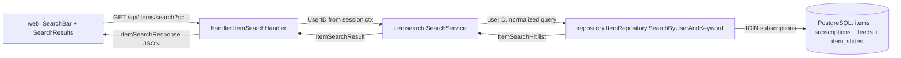
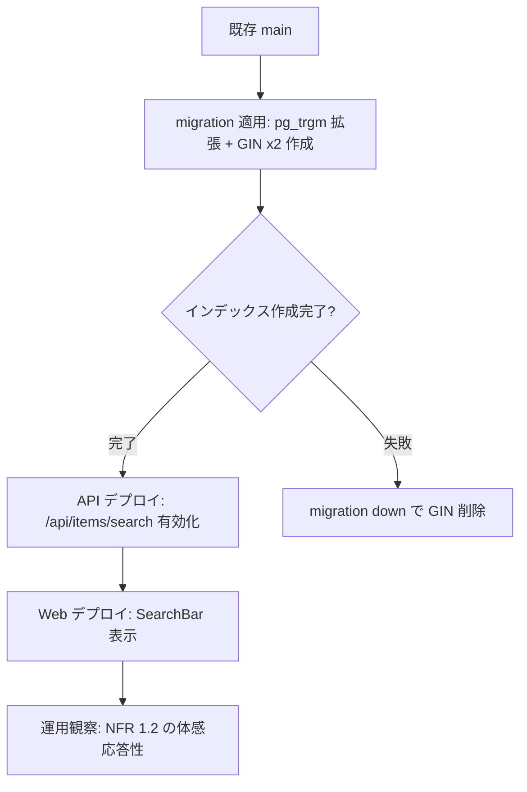

# Design Document

## Overview

**Purpose**: 本機能はログインユーザーが自身の購読フィード群を横断して、記事タイトルと
本文に対するキーワード部分一致検索を行えるようにすることで、時系列スクロールに依存しない
過去ストック情報への到達手段を提供する。

**Users**: Feedman のログインユーザーが、Web UI 上部の検索入力欄からキーワードを入力して
検索を実行する。検索結果は既存の右ペイン（記事一覧の表示領域）に時系列で展開され、各結果
カードには所属フィードを識別する情報（フィード名と favicon）を併記する。

**Impact**: 既存の「フィード単位の記事一覧表示」を一切変更せず、新規 API エンドポイント
`GET /api/items/search` と新規 UI 状態（検索モード）を追加することで、横断検索という新しい
表示モードを追加する。フィード一覧表示や既存の既読・スター操作は本機能の影響を受けない。

### Goals

- 主要目標 1: ログインユーザーの購読フィード範囲に閉じた、タイトル + 本文の部分一致検索を
  API として公開する（Req 2, 3）
- 主要目標 2: 検索結果を公開日時の新しい順で時系列表示し、各記事のフィード所属（feed_title /
  favicon）を識別可能にする（Req 4.1, 4.2）
- 主要目標 3: 大量購読記事下でも、結果取得開始から 1 秒以内にローディング表示を提示し、検索
  完了まで体感応答性を維持する（NFR 1）
- 成功基準: 検索 UI からの全 AC（Req 1〜5）が pass、かつ NFR 2（既存挙動非回帰）を破らない

### Non-Goals

- AND / OR / NOT 等の論理演算子・正規表現・ワイルドカード検索（Out of Scope）
- 検索履歴・サジェスト・最近の検索キーワード表示（Out of Scope）
- フィード単位 / 期間単位 / 既読状態によるフィルタ、ソート順の切替（Out of Scope）
- 検索結果ハイライト表示・全文プレビュー強調（Out of Scope）
- 検索インデックスのバッチ再構築 UI（Out of Scope）
- LaunchDarkly 等の外部 Feature Flag SaaS の導入（本リポジトリは opt-out）

## Architecture

### Existing Architecture Analysis

現在の API は `internal/handler/*` → `internal/<domain>/service.go` →
`internal/repository/*` の 3 層構成を取り、`*Adapter` でドメイン型を handler のレスポンス型に
変換する。記事一覧は `GET /api/feeds/{id}/items` がフィード単位で `published_at` 降順の
カーソルベースページネーション（limit+1 件取得 + `next_cursor`）を提供している
（[`internal/repository/postgres_item_repo.go:199-280`](../../../internal/repository/postgres_item_repo.go)、
[`internal/item/service.go:60-131`](../../../internal/item/service.go)）。

尊重すべきドメイン境界:

- 認証は `middleware.NewSessionMiddleware` が `user_id` を `context.Context` に注入し、
  各 handler が `middleware.UserIDFromContext(r.Context())` で取り出す既存パターン
- 認可（記事への user 隔離）は既存 `ListByFeed` では `items LEFT JOIN item_states ON
  s.user_id = $1` で行っているが、購読範囲のチェックは行っていない（フィード単位 API は
  「フィードを直接指定する」前提のため）。本検索は「全フィード横断」のため、`items` を
  `subscriptions` と JOIN して当該ユーザーの購読フィード範囲に限定する必要がある（Req 3）
- favicon と feed_title の取得は `subscriptions.ListByUserIDWithFeedInfo` が `feeds` JOIN +
  `data:<mime>;base64,...` 形式の data URL 化を行うパターンを採用している。検索結果でも同様
  に data URL 形式で返すことで、Web 側の `` 表示パターンを再利用できる

維持すべき統合点:

- `RouterDeps` の依存注入経路（`app.go` の wiring）
- `handleServiceError` による `model.APIError` → HTTP status の変換
- カーソルベースページネーションのレスポンス形状（`items[]`, `next_cursor`, `has_more`）

解消・回避する technical debt:

- 既存 `ItemDetail` 構造体は `ItemSummary` を埋め込むため、Summary フィールドがシャドウされる
  既知の挙動があるが、本機能の検索結果は `ItemSummary` 同等のフィールド集合のみを返すため
  この問題には触れない

### Architecture Pattern & Boundary Map

採用パターン: 既存の **handler → service → repository** 3 層パターンを踏襲し、検索ドメイン
（`internal/itemsearch`）を新規追加する。新規ドメインを切る理由は、検索固有のクエリ正規化・
SQL 検索戦略・結果整形が `item.ItemService`（フィード単位の取得サービス）と責務が異なるため。



ドメイン／機能境界:

- `internal/itemsearch/` — 検索ドメインサービス（クエリ正規化・空入力判定・結果整形）
- `internal/repository/postgres_item_repo.go` への新規メソッド追加 — DB レベル検索 SQL の責務
- `internal/handler/item_search_handler.go` — HTTP 境界（クエリパラメータ解析・認証チェック・
  エラーレスポンス）
- `web/src/components/search-bar.tsx` / `web/src/hooks/use-item-search.ts` — UI ドメイン
- `internal/database/migrations/*_add_item_search_indexes.*.sql` — 検索インデックス（pg_trgm
  GIN）の追加

新規コンポーネントの根拠:

- `itemsearch` パッケージ: 検索は「フィード ID なし、全 user スコープ、tsvector や pg_trgm の
  扱い」など `item.ItemService` とは異なる責務を持つため独立させる
- `SearchBar` コンポーネント: ヘッダー上に常設する検索入力欄を、既存 `AppShell` の責務を
  膨らませず独立配置するため
- 検索状態（`isSearching` / `searchQuery`）の `AppStateContext` への統合: 既存の
  `selectedFeedId` / `expandedItemId` と排他的に管理する必要があり（Req 1.4: 検索解除で
  元の一覧へ戻る）、Context の reducer 経由で一元管理する

### Technology Stack

| Layer | Choice / Version | Role in Feature | Notes |
|-------|------------------|-----------------|-------|
| Frontend / CLI | Next.js 15 + React 19 + TypeScript 5 + TanStack React Query | 検索 UI / API クライアント / 状態管理 | 既存 `use-items.ts` パターンを `useItemSearch` として複製 |
| Backend / Services | Go 1.25 + chi/v5 | HTTP handler + ドメインサービス | `internal/itemsearch/` 新規追加、`internal/handler/item_search_handler.go` 新規追加 |
| Data / Storage | PostgreSQL 16 + pg_trgm 拡張 + GIN インデックス | 部分一致検索を `WHERE title ILIKE '%q%' OR content ILIKE '%q%'` で実装し、`gin_trgm_ops` で高速化 | 拡張は既存 migration の `pgcrypto` と同じパターンで追加 |
| Messaging / Events | （使用しない） | - | バックグラウンドジョブは関与しない |
| Infrastructure / Runtime | docker-compose（postgres:16）/ GitHub Actions CI | pg_trgm は標準 contrib モジュールで postgres:16 公式イメージに同梱 | 追加 image 変更不要 |

## File Structure Plan

### Directory Structure

```
internal/
├── itemsearch/                            # 新規: 検索ドメインサービス
│   ├── service.go                         # SearchService: クエリ正規化・空入力判定・結果整形
│   └── service_test.go                    # SearchService の単体テスト（テーブル駆動）
├── handler/
│   ├── item_search_handler.go             # 新規: GET /api/items/search のハンドラ
│   ├── item_search_handler_test.go        # 新規: ハンドラのテーブル駆動テスト
│   ├── router.go                          # 修正: /api/items/search ルート登録 + ItemSearchService 注入
│   └── service_adapter.go                 # 修正: ItemSearchServiceAdapter を追加
├── repository/
│   ├── postgres_item_repo.go              # 修正: SearchByUserAndKeyword メソッド追加
│   ├── interfaces.go                      # 修正: ItemSearchRepository インターフェース追加
│   └── postgres_item_repo_search_test.go  # 新規: DB 結合テスト（pg_trgm 拡張前提）
├── model/
│   ├── item.go                            # 修正: ItemSearchHit 構造体追加（feed_title/favicon を伴う）
│   └── errors.go                          # 修正: ErrCodeInvalidSearchQuery / NewInvalidSearchQueryError 追加
├── database/migrations/
│   ├── 20260528120000_add_item_search_indexes.up.sql      # 新規: pg_trgm 拡張 + GIN インデックス
│   └── 20260528120000_add_item_search_indexes.down.sql    # 新規: ロールバック
└── app/
    └── app.go                             # 修正: itemsearch.SearchService の wiring を追加

web/src/
├── components/
│   ├── search-bar.tsx                     # 新規: ヘッダーに常設する検索入力欄
│   ├── search-bar.test.tsx                # 新規
│   ├── search-results.tsx                 # 新規: 検索結果リスト（feed_title + favicon バッジ付き）
│   ├── search-results.test.tsx            # 新規
│   ├── app-shell.tsx                      # 修正: SearchBar 配置 + 検索モード時に SearchResults 切替
│   └── app-shell.test.tsx                 # 修正: 検索モード切替の統合テスト
├── contexts/
│   ├── app-state.tsx                      # 修正: searchQuery / isSearching 状態 + SET_SEARCH_QUERY/CLEAR_SEARCH アクション
│   └── app-state.test.tsx                 # 修正: 検索状態の reducer テスト
├── hooks/
│   ├── use-item-search.ts                 # 新規: useInfiniteQuery で /api/items/search を呼ぶ
│   └── use-item-search.test.tsx           # 新規
└── types/
    └── item.ts                            # 修正: ItemSearchHit / ItemSearchResponse 型追加
```

### Modified Files

- `internal/handler/router.go` — `RouterDeps` に `ItemSearchService ItemSearchServiceInterface`
  を追加し、`/api/items/search` を **`/api/items/{id}` よりも前**に登録する（chi の static
  segment 優先で `search` が `{id}` の捕捉に吸われないよう順序を担保する）
- `internal/handler/service_adapter.go` — `ItemSearchServiceAdapter` を追加
- `internal/app/app.go` — `itemsearch.NewSearchService(itemRepo)` の wiring を追加し
  `RouterDeps.ItemSearchService` にセット
- `internal/repository/postgres_item_repo.go` — 新規メソッド `SearchByUserAndKeyword`
- `internal/repository/interfaces.go` — `ItemSearchRepository` インターフェース（または
  `ItemRepository` に統合）
- `internal/model/item.go` — `ItemSearchHit` 構造体（`ItemSummary` 相当 + feed_title +
  favicon_data + favicon_mime）
- `internal/model/errors.go` — `ErrCodeInvalidSearchQuery`、`NewInvalidSearchQueryError`、
  および `mapAPIErrorToHTTPStatus` の対応エントリ（`internal/handler/feed_handler.go` の
  `mapAPIErrorToHTTPStatus`）
- `web/src/contexts/app-state.tsx` — `searchQuery: string`, `isSearching: boolean` を state に
  追加し、`SET_SEARCH_QUERY` / `CLEAR_SEARCH` アクションを追加。`SELECT_FEED` 時に検索状態を
  クリアする（既存の `expandedItemId` / `filter` リセットと同じ枝で処理）
- `web/src/components/app-shell.tsx` — ヘッダーに `SearchBar` を配置、右ペインを
  `state.isSearching ? <SearchResults /> : <ItemList />` で出し分け
- `web/src/types/item.ts` — `ItemSearchHit`, `ItemSearchResponse` 型追加

## Requirements Traceability

| Requirement | Summary | Components | Interfaces | Flows |
|-------------|---------|------------|------------|-------|
| 1.1 | 検索入力欄の常設 | `SearchBar` | `AppShell` 内配置 | UI render |
| 1.2 | 検索実行操作 | `SearchBar`, `useItemSearch` | `apiClient.get('/api/items/search?q=...')` | submit / Enter |
| 1.3 | 空入力時は検索しない | `SearchBar`, `app-state.tsx` | reducer ガード | UI no-op |
| 1.4 | 検索結果解除で元一覧へ復元 | `SearchBar`, `app-state.tsx` | `CLEAR_SEARCH` action | reducer |
| 2.1 | 横断検索（購読中フィード） | `repository.SearchByUserAndKeyword` | SQL: `items JOIN subscriptions ON subscriptions.user_id = $1` | DB query |
| 2.2 | タイトル + 本文を対象 | `repository.SearchByUserAndKeyword` | SQL: `(title ILIKE $2 OR content ILIKE $2)` | DB query |
| 2.3 | 部分一致 | `repository.SearchByUserAndKeyword`, `itemsearch.SearchService` | SQL: `ILIKE '%q%'` + escape | DB query |
| 2.4 | 不一致は含めない | `repository.SearchByUserAndKeyword` | SQL の WHERE 評価 | DB query |
| 2.5 | 大文字小文字を区別しない | `repository.SearchByUserAndKeyword` | `ILIKE`（case-insensitive） | DB query |
| 3.1 | 購読中フィードに限定 | `repository.SearchByUserAndKeyword` | SQL: `JOIN subscriptions s ON s.user_id = $1 AND s.feed_id = i.feed_id` | DB query |
| 3.2 | 非購読フィード除外 | 同上 | JOIN 条件で自然除外 | DB query |
| 3.3 | 未認証拒否 | `ItemSearchHandler`, `SessionMiddleware` | `middleware.UserIDFromContext` 失敗 → 401 | HTTP middleware |
| 3.4 | 解除済みフィード除外 | `repository.SearchByUserAndKeyword` | JOIN 条件で自然除外（解除済み = subscriptions 行なし） | DB query |
| 4.1 | published_at 降順 | `repository.SearchByUserAndKeyword` | SQL: `ORDER BY i.published_at DESC, i.id DESC` | DB query |
| 4.2 | feed_title + favicon 表示 | `repository.SearchByUserAndKeyword`, `SearchResults` | SQL: feeds JOIN, 結果に feed_title/favicon_data/favicon_mime | DB query + UI |
| 4.3 | 0 件空状態表示 | `SearchResults` | `items.length === 0` 分岐 | UI render |
| 4.4 | ローディング表示 | `SearchResults` | TanStack Query `isLoading` | UI render |
| 4.5 | エラー表示 | `SearchResults` | TanStack Query `isError` | UI render |
| 4.6 | 記事本文閲覧 | `SearchResults` | 既存 `ItemDetail` / `useItemDetail` 再利用 | UI render |
| 5.1 | 既読化挙動の同一性 | `SearchResults` | 既存 `useMarkAsRead` 再利用 | mutation |
| 5.2 | スター操作の同一性 | `SearchResults` | 既存 `useToggleStar` 再利用 | mutation |
| 5.3 | 検索でメタデータ変更しない | `repository.SearchByUserAndKeyword`, `ItemSearchHandler` | SELECT 専用 SQL のみ、副作用なし | 仕様 |
| NFR 1.1 | 1 秒以内のローディング表示 | `SearchResults`, `useItemSearch` | TanStack Query が即時 `isLoading=true` | UI render |
| NFR 1.2 | 体感応答性の確保 | `repository`, インデックス | `idx_items_title_trgm` / `idx_items_content_trgm` GIN | DB |
| NFR 2.1 | 通常利用の非回帰 | （既存コードの追加変更なし） | `state.isSearching === false` パス維持 | 設計 |
| NFR 2.2 | 検索解除で復元 | `app-state.tsx` | `CLEAR_SEARCH` で `searchQuery=''` のみ変更、`selectedFeedId` 維持 | reducer |
| NFR 3.1 | 検索の観測可能性 | `ItemSearchHandler` | `slog.Info("item search", user_id=..., scope="subscribed")` | logging middleware |

## Components and Interfaces

### Backend Domain

#### `internal/itemsearch.SearchService`

| Field | Detail |
|-------|--------|
| Intent | クエリ正規化と検索 repository 呼び出しを担うアプリケーションサービス |
| Requirements | 1.3, 2.3, 2.5, 3.1, 4.1, NFR 1.2 |

**Responsibilities & Constraints**

- 主責務: 入力クエリの正規化（前後空白 trim、空文字判定、LIKE エスケープ）、repository 呼び出し、
  結果のドメイン型整形
- ドメイン境界: 認証チェックは行わない（handler 層の責務）。トランザクションは持たない（SELECT 専用）
- データ所有権: なし（read-only）。invariants: 戻り値の `Items` は `published_at` 降順で整列済み

**Dependencies**

- Inbound: `handler.ItemSearchHandler`（HTTP 経由） — リクエスト処理（critical）
- Outbound: `repository.ItemSearchRepository.SearchByUserAndKeyword` — DB クエリ（critical）
- External: なし

**Contracts**: Service [x] / API [ ] / Event [ ] / Batch [ ] / State [ ]

##### Service Interface

```go
// SearchService は記事の横断検索ドメインサービス。
type SearchService struct {
    repo repository.ItemSearchRepository
}

// SearchResult は SearchService.Search の戻り値。
type SearchResult struct {
    Items      []ItemSearchSummary
    NextCursor string
    HasMore    bool
}

// ItemSearchSummary は検索結果 1 件のサマリ（feed_title / favicon を含む）。
type ItemSearchSummary struct {
    ID              string
    FeedID          string
    FeedTitle       string
    FaviconURL      *string   // data:<mime>;base64,... 形式。未設定時 nil
    Title           string
    Link            string
    Summary         string
    PublishedAt     time.Time
    IsDateEstimated bool
    IsRead          bool
    IsStarred       bool
    HatebuCount     int
}

// Search は当該ユーザーが購読中のフィードに属する記事から、キーワードに部分一致するものを
// published_at 降順で返す。
//
// preconditions:
//   - userID は session middleware を通過した値
//   - rawQuery は任意の文字列（正規化は本メソッド内で実施）
//   - cursorStr は前回レスポンスの NextCursor をそのまま渡す（空でも可）
//   - limit > 0
// postconditions:
//   - 正規化後の query が空（rawQuery が空または全て空白）の場合は &SearchResult{} を返す
//     （Req 1.3: 空クエリは検索しないため、サービス層では明示的に空結果として処理）
//   - 結果は published_at DESC, id DESC で安定ソート（NextCursor は最後の (published_at, id) ペア）
//   - error が APIError なら handler が status code を引く
// invariants:
//   - 結果に当該ユーザーが購読していないフィードの記事を含めない（repository SQL で保証）
func (s *SearchService) Search(
    ctx context.Context,
    userID, rawQuery, cursorStr string,
    limit int,
) (*SearchResult, error)
```

正規化ロジック（疑似コード）:

```text
query := strings.TrimSpace(rawQuery)
if query == "" {
    return &SearchResult{Items: nil, HasMore: false}, nil  // Req 1.3: 空入力は明示的に空結果
}
escaped := escapeLikePattern(query)  // %, _, \ をエスケープして "%escaped%" の中身に組み立て
pattern := "%" + escaped + "%"
// repository に escaped pattern と (cursorPublishedAt, cursorID) を渡す
```

##### `internal/repository.ItemSearchRepository` Interface

```go
// ItemSearchRepository は記事の横断検索向けの DB アクセス。
// 既存 ItemRepository に statically extension しても構わない（実装上は PostgresItemRepo に
// メソッドを追加し、interfaces.go で新インターフェースとして公開する）。
type ItemSearchRepository interface {
    // SearchByUserAndKeyword は当該ユーザーが購読中のフィードに属する記事から、
    // title または content がキーワードに部分一致するものを取得する。
    // pattern は ILIKE に渡す '%escaped%' 形式の文字列を呼び出し側で組み立てて渡す。
    // cursorPublishedAt がゼロ値でない場合、(published_at, id) < (cursor) のレコードに限定する。
    // limit は実取得件数（HasMore 判定は呼び出し側で limit+1 件取得して行う）。
    SearchByUserAndKeyword(
        ctx context.Context,
        userID, pattern, cursorID string,
        cursorPublishedAt time.Time,
        limit int,
    ) ([]model.ItemSearchHit, error)
}
```

参照 SQL（pg_trgm GIN + ILIKE）:

```sql
SELECT
    i.id, i.feed_id, i.title, i.link, i.summary,
    i.published_at, i.is_date_estimated, i.hatebu_count,
    f.title AS feed_title,
    f.favicon_data, f.favicon_mime,
    COALESCE(st.is_read, false)   AS is_read,
    COALESCE(st.is_starred, false) AS is_starred
FROM items i
JOIN subscriptions s
    ON s.feed_id = i.feed_id
   AND s.user_id = $1
JOIN feeds f
    ON f.id = i.feed_id
LEFT JOIN item_states st
    ON st.item_id = i.id
   AND st.user_id = $1
WHERE (i.title ILIKE $2 OR i.content ILIKE $2)
  AND ($3::timestamptz IS NULL
       OR (i.published_at, i.id) < ($3, $4::uuid))
ORDER BY i.published_at DESC NULLS LAST, i.id DESC
LIMIT $5;
```

トレードオフメモ（採用根拠）:

- **採用案: pg_trgm GIN + `ILIKE '%q%'`**: 拡張は postgres:16 公式イメージに同梱され追加 image
  変更不要。GIN インデックスがあれば LIKE/ILIKE の部分一致が大幅に高速化する（trigram で
  3-gram の部分文字列マッチを索引化）。要件「部分一致」と完全に整合。日本語含む BMP 範囲文字
  でも語境界に依存しないため挙動が読みやすい
- 代替案 A（tsvector + `to_tsvector` + GIN）: 全文検索として高速だが「語幹マッチ」になり要件
  「部分一致」を超過する。日本語処理用 dict も追加導入が必要で本リポジトリの構成では過剰
- 代替案 B（通常 B-tree インデックス + `ILIKE '%q%'`）: 部分一致では前方一致以外でインデックス
  が効かず、購読記事が増えるとフル sequential scan に陥り NFR 1.2 に違反する可能性が高い
- リスク: pg_trgm GIN はインデックス更新コストが B-tree より大きい（INSERT/UPDATE 時に複数
  trigram エントリを更新）。ただし本リポジトリは worker による定期 INSERT/UPSERT が主であり、
  検索エンドポイントは read-only。書込み頻度に対する読込性能を優先する判断を採用

#### `internal/handler.ItemSearchHandler`

| Field | Detail |
|-------|--------|
| Intent | `GET /api/items/search` の HTTP 境界 |
| Requirements | 1.2, 1.3, 3.3, 4.4, 4.5, NFR 3.1 |

**Responsibilities & Constraints**

- 主責務: クエリパラメータ `q` / `cursor` のパース、認証チェック、サービス呼び出し、レスポンス整形
- ドメイン境界: ビジネスロジック・SQL は持たない（service / repository に委譲）
- データ所有権: なし

**Dependencies**

- Inbound: chi router（`/api/items/search`） — HTTP 経由（critical）
- Outbound: `ItemSearchServiceInterface` — ドメインサービス呼び出し（critical）
- External: `middleware.UserIDFromContext` — セッション情報取り出し（critical）

**Contracts**: Service [ ] / API [x] / Event [ ] / Batch [ ] / State [ ]

##### API Contract

| Method | Endpoint | Request | Response | Errors |
|--------|----------|---------|----------|--------|
| GET | `/api/items/search?q=<keyword>&cursor=<cursor>&limit=<n>` | クエリパラメータのみ（body なし） | `itemSearchResponse` JSON | 400（INVALID_SEARCH_QUERY） / 401（UNAUTHORIZED） / 500（INTERNAL_ERROR） |

レスポンス形状:

```json
{
  "items": [
    {
      "id": "uuid",
      "feed_id": "uuid",
      "feed_title": "Example Feed",
      "favicon_url": "data:image/png;base64,...",
      "title": "記事タイトル",
      "link": "https://example.com/article",
      "summary": "サニタイズ済み概要",
      "published_at": "2026-05-28T12:00:00Z",
      "is_date_estimated": false,
      "is_read": false,
      "is_starred": false,
      "hatebu_count": 0
    }
  ],
  "next_cursor": "2026-05-28T12:00:00Z|uuid",
  "has_more": true
}
```

- `next_cursor` 形式: `<RFC3339Nano published_at>|<item id>` のパイプ区切り。空クエリ・末尾
  ページ時は省略可（既存 `itemListResult` と同じ `omitempty` 流儀でなく、`null` を許容して
  Web 側で `has_more` を見るほうが Tanstack Query の `getNextPageParam` と整合しやすい）
- 既存 `itemListResult` の `next_cursor` は `published_at` のみだが、本検索は同時刻の重複が
  起こりやすい（同じフィードから複数記事が同タイムスタンプで取得される）ため `id` を tie-breaker
  に含める
- クエリパラメータ:
  - `q`: 必須に近い扱いだが、トリム後空文字なら 200 OK で `items: []` を返す（Req 1.3）
  - `cursor`: 任意。形式不正は 400 `INVALID_SEARCH_QUERY`（または専用エラーコード）
  - `limit`: 任意。未指定時は既定 50（`defaultItemsPerPage` と同値）。上限値（例: 200）超過時
    はクランプして返す（既存 ListItems と整合）

##### エラーレスポンスフロー

```text
- セッション cookie なし / 期限切れ → middleware が 401 で短絡（既存挙動）
- handler 内 UserIDFromContext 失敗 → 401 UNAUTHORIZED（既存パターン）
- cursor 形式不正 → 400 INVALID_SEARCH_QUERY（model.NewInvalidSearchQueryError）
- repository / DB エラー → 500 INTERNAL_ERROR（handleServiceError 経由）
```

### Frontend Domain

#### `web/src/components/SearchBar`

| Field | Detail |
|-------|--------|
| Intent | ヘッダー上の検索入力欄。Enter 押下 / 入力消去で AppState を更新する |
| Requirements | 1.1, 1.2, 1.3, 1.4 |

**Responsibilities & Constraints**

- 主責務: テキスト入力受け取り、Enter 押下時の dispatch、× ボタンによる検索クリア
- ドメイン境界: API 通信を直接行わない（state を更新するのみ）。state 変更により
  `useItemSearch` が起動する

**Dependencies**

- Inbound: `AppShell` の header 領域から render
- Outbound: `useAppDispatch` 経由で `SET_SEARCH_QUERY` / `CLEAR_SEARCH`
- External: なし

**Contracts**: Service [ ] / API [ ] / Event [ ] / Batch [ ] / State [x]

##### コンポーネント Interface（疑似シグネチャ）

```typescript
export function SearchBar(): JSX.Element {
  // local state: 入力中の値（未確定）
  // global state: state.searchQuery（確定済み）
  //
  // handleSubmit:
  //   - localQuery.trim() === '' なら何もしない（Req 1.3）
  //   - そうでなければ dispatch({ type: 'SET_SEARCH_QUERY', query: localQuery.trim() })
  //
  // handleClear:
  //   - dispatch({ type: 'CLEAR_SEARCH' })（Req 1.4）
}
```

#### `web/src/components/SearchResults`

| Field | Detail |
|-------|--------|
| Intent | 検索結果リスト。フィード識別バッジ付き ItemRow を再利用し、本文展開・既読化・スターを既存パターンで提供 |
| Requirements | 4.1, 4.2, 4.3, 4.4, 4.5, 4.6, 5.1, 5.2 |

**Responsibilities & Constraints**

- 主責務: `useItemSearch` 結果のレンダリング、空状態 / ローディング / エラーの 3 状態出し分け、
  feed_title + favicon バッジの表示
- ドメイン境界: 検索クエリ自体は持たない（AppState から読む）
- 制約: 既存 `ItemDetail` / `useItemDetail` / `useMarkAsRead` / `useToggleStar` を再利用する
  （Req 5.1, 5.2 の整合）

**Dependencies**

- Inbound: `AppShell` の右ペインから `state.isSearching === true` のときに render
- Outbound: `useItemSearch(state.searchQuery)`, `useItemDetail`, `useMarkAsRead`, `useToggleStar`

**Contracts**: Service [ ] / API [ ] / Event [ ] / Batch [ ] / State [ ]

#### `web/src/hooks/useItemSearch`

```typescript
export function useItemSearch(query: string) {
  return useInfiniteQuery<ItemSearchResponse>({
    queryKey: ['item-search', query],
    queryFn: async ({ pageParam }) => {
      const params = new URLSearchParams();
      params.set('q', query);
      params.set('limit', '50');
      if (pageParam) {
        params.set('cursor', pageParam as string);
      }
      return apiClient.get<ItemSearchResponse>(`/api/items/search?${params.toString()}`);
    },
    initialPageParam: null as string | null,
    getNextPageParam: (lastPage) => (lastPage.has_more ? lastPage.next_cursor : undefined),
    enabled: query.trim().length > 0,  // Req 1.3
  });
}
```

#### `web/src/contexts/AppState`（修正）

State / Action 追加:

```typescript
export interface AppState {
  selectedFeedId: string | null;
  expandedItemId: string | null;
  filter: ItemFilter;
  // 追加:
  searchQuery: string;       // 空文字 = 検索オフ
  isSearching: boolean;      // searchQuery !== '' と等価のキャッシュ（reducer で derive）
}

type SetSearchQueryAction = { type: 'SET_SEARCH_QUERY'; query: string };
type ClearSearchAction    = { type: 'CLEAR_SEARCH' };
```

Reducer 規約:

- `SET_SEARCH_QUERY`: `searchQuery = action.query`, `isSearching = true`, `expandedItemId = null`
- `CLEAR_SEARCH`: `searchQuery = ''`, `isSearching = false`, `expandedItemId = null`。
  `selectedFeedId` と `filter` は **保持**（Req 1.4 / NFR 2.2: 検索実行前の表示状態を復元）
- `SELECT_FEED`: 既存挙動に加えて `searchQuery = ''`, `isSearching = false` を併設
  （フィード選択を検索の暗黙的解除として扱う）

## Data Models

### Domain Model

- アグリゲート: `ItemSearchHit` は `Item` の射影（投影）に `Feed.title` と `Feed.favicon_*` を
  追加した値オブジェクト。新規エンティティは追加しない
- トランザクション境界: 検索は単一 SELECT で完結（read-only）。コミット境界は不要

### Physical Data Model

- 新規テーブル: なし
- 新規カラム: なし
- 新規拡張: `pg_trgm`（CREATE EXTENSION IF NOT EXISTS）
- 新規インデックス:
  - `idx_items_title_trgm`: `CREATE INDEX ... ON items USING GIN (title gin_trgm_ops)`
  - `idx_items_content_trgm`: `CREATE INDEX ... ON items USING GIN (content gin_trgm_ops) WHERE content IS NOT NULL`
- マイグレーション up / down:
  - up: 拡張作成 → GIN インデックス 2 本作成
  - down: GIN インデックス 2 本削除（拡張は他用途で使用されうるため DROP しない方針。down で
    残すか落とすかはレビュー判断対象。本設計案では「拡張は残し、インデックスのみ削除」を採用）

### マイグレーションネーミング

- 既存規約: `<YYYYMMDDhhmmss>_<snake_case_label>.up.sql` / `.down.sql`
- 採用ファイル名: `20260528120000_add_item_search_indexes.up.sql` / `.down.sql`

## Error Handling

### Error Strategy

既存の `model.APIError` ベースのエラー体系を踏襲する。`handleServiceError` が `errors.As` で
APIError を抽出し、`mapAPIErrorToHTTPStatus` で HTTP status へ変換する既存フローを再利用する。

### Error Categories and Responses

- **User Errors (4xx)**:
  - 401 UNAUTHORIZED: セッション無効・ない（既存パターン）
  - 400 INVALID_SEARCH_QUERY: cursor 形式不正（`<RFC3339Nano>|<uuid>` で parse 失敗）。空クエリ
    は 200 OK で `items: []` を返す（Req 1.3 と UX 一貫性）
- **System Errors (5xx)**:
  - 500 INTERNAL_ERROR: DB エラー、unknown error（`handleServiceError` の default 経路）
  - DB エラーは `slog.Error("internal server error", ...)` で構造化ログに記録
- **Business Logic Errors**:
  - 該当なし（検索は副作用なし）

エラーログ要件（Req NFR 3.1）:

- handler 入口で `slog.Info("item search request", slog.String("user_id", userID), slog.String("scope", "subscribed"), slog.Int("query_len", len(rawQuery)))`
  を発行する（query 本文はログ汚染と PII 観点で出さず、長さのみ）

## Testing Strategy

### Unit Tests

1. `itemsearch.SearchService.Search`: 空クエリ → 空結果（Req 1.3）
2. `itemsearch.SearchService.Search`: 前後空白のみクエリ → 空結果（Req 1.3）
3. `itemsearch.SearchService.Search`: LIKE メタ文字（`%`, `_`, `\`）が混入したクエリ →
   エスケープされて文字通り検索される
4. `itemsearch.SearchService.Search`: cursor 形式不正 → `INVALID_SEARCH_QUERY` APIError
5. `web/src/contexts/app-state.test.tsx`: `SET_SEARCH_QUERY` / `CLEAR_SEARCH` reducer 挙動と、
   `SELECT_FEED` で `searchQuery=''` にリセットされること（Req 1.4 / NFR 2.2）

### Integration Tests

1. `internal/handler/item_search_handler_test.go`: 認証なし → 401（Req 3.3）
2. `internal/handler/item_search_handler_test.go`: `q=foo` で service が呼ばれ JSON が
   レスポンスされる（mock service 経由）
3. `internal/repository/postgres_item_repo_search_test.go`（DB 結合）: 当該ユーザーが購読中の
   フィードに属する記事のみ返ること、購読解除済みフィードの記事は返らないこと（Req 3.1, 3.4）
4. `internal/repository/postgres_item_repo_search_test.go`: タイトル一致 / 本文一致 / 両方
   一致 / どちらも不一致 の 4 ケース（Req 2.2, 2.3, 2.4）
5. `internal/repository/postgres_item_repo_search_test.go`: 大文字小文字差で同一ヒット
   （ILIKE 検証、Req 2.5）
6. `internal/repository/postgres_item_repo_search_test.go`: 同 `published_at` の複数記事に対し
   id 昇順ソートで安定ページング（次 cursor で重複・欠落なし、Req 4.1）

### E2E/UI Tests（Vitest + Testing Library）

1. `search-bar.test.tsx`: 入力 → Enter で `SET_SEARCH_QUERY` dispatch されること（Req 1.2）
2. `search-bar.test.tsx`: 空入力で Enter → dispatch なし（Req 1.3）
3. `search-results.test.tsx`: `useItemSearch` が `isLoading` のときローディング表示
   （Req 4.4）、`isError` のときエラー表示（Req 4.5）、`items=[]` のとき空状態表示（Req 4.3）
4. `search-results.test.tsx`: 結果カードに feed_title と favicon が表示される（Req 4.2）
5. `app-shell.test.tsx`: 検索モード時に `ItemList` ではなく `SearchResults` がレンダされる

### Performance / Load（手動 / ad-hoc）

1. pg_trgm GIN インデックスありで、1 ユーザー / 10,000 件のテストデータに対し `q='test'` の
   検索が 200ms 以内（NFR 1.2 の目安）。具体的な数値目標は Open Questions で運用者に確認する

## Security Considerations

- **認可境界**: 全ての検索クエリは `JOIN subscriptions s ON s.user_id = $1` を必須とし、
  当該ユーザーが購読中でないフィードの記事は SQL レベルで除外する（Req 3.1, 3.2）。`user_id`
  は middleware が注入したセッション値のみを使用し、クライアントから受け取った値は信頼しない
- **SQL injection**: ILIKE のパターンも含めて `$1`, `$2` ... の placeholder のみで渡す。
  `pattern = '%' + escapeLikePattern(q) + '%'` の組み立てはアプリケーション側で行い、
  最終的に placeholder 経由で渡す
- **PII / 機密**: 検索クエリ本文はログに出さず、長さのみログ出力する（Req NFR 3.1）。
  検索結果の content は既に `bluemonday` でサニタイズ済み（既存 UPSERT 経路）
- **未認証アクセス**: 既存 `SessionMiddleware` で 401 を返す経路をそのまま使用（Req 3.3）。
  追加の認証コードは書かない

## Performance & Scalability

- **想定スケール**: 1 ユーザーあたり購読フィード 100 件上限（既存 `NewSubscriptionLimitError`）、
  記事は数万〜十数万件オーダーを想定
- **インデックス選択根拠**: 上記「Architecture」セクションのトレードオフメモ参照
- **クエリプラン**: `EXPLAIN ANALYZE` で確認すべきポイント:
  - `Bitmap Index Scan on idx_items_title_trgm` または `idx_items_content_trgm` がヒットすること
  - `Nested Loop` で subscriptions 経由のフィルタリングが items 取得前に効くこと
- **N+1 回避**: favicon_data / feed_title は SELECT 内で JOIN 済みのため、結果整形時に追加
  クエリは発生しない
- **ページング**: limit+1 件取得 → HasMore 判定の既存パターンを再利用（`item.ItemService.ListItems`
  と同じ）

## Migration Strategy



- **本番運用時の注意**: 既存大規模 items テーブルへの GIN インデックス作成は時間を要する可能性
  あり。`CREATE INDEX CONCURRENTLY` の採用を検討すべきだが、golang-migrate が
  transaction wrap でこれを禁止するため、本マイグレーションは通常 `CREATE INDEX` を使う
  （現状のスケールでは許容範囲と判断）。大規模 production が確定したら別 Issue で
  CONCURRENTLY 化を検討
- **後方互換**: 既存エンドポイントは無変更。新エンドポイント `/api/items/search` の追加のみ

## 確認事項（人間レビュアー向け）

要件側で明示されていない論点（PM の Open Questions 由来）。本設計では下記の暫定方針で進める
が、運用者の意向と異なる場合は PM フェーズへ差し戻しが必要:

1. **想定スケールと許容応答時間の数値目標**（NFR 1.2 関連）: 暫定で「ユーザーあたり購読 100 件 /
   記事数万件で検索 200ms 以内」を目安とする。pg_trgm GIN で十分達成可能な水準だが、本番
   要件が桁違いに大きいなら設計を見直す
2. **1 ページあたり件数の既定値**: 既存 `defaultItemsPerPage = 50` を踏襲する暫定方針。検索
   結果は記事一覧と異なる UX を要する可能性があるため、初期値 50 で問題ないか確認
3. **キーワード長の上限**: 暫定で「200 文字程度を上限とし、超過時は 400 INVALID_SEARCH_QUERY」
   とする。SQL レベルでは LIKE パターンが無制限に長いとパフォーマンス影響があるため上限は
   必要だが、絶対値は要確認
4. **記事カード選択時の詳細表示方式**: PM Open Questions に従い「#106 の挙動に揃える」前提で
   設計（`ItemList` の `ItemDetailArea` を再利用）。検索結果一覧と詳細展開を同居させる方式で
   進める
5. **`pg_trgm` 拡張の運用上の許容**: 拡張追加に伴う DBA 承認等のプロセスが本リポジトリ運用で
   不要かを確認（既存 `pgcrypto` と同じ migration パターンで導入する）
