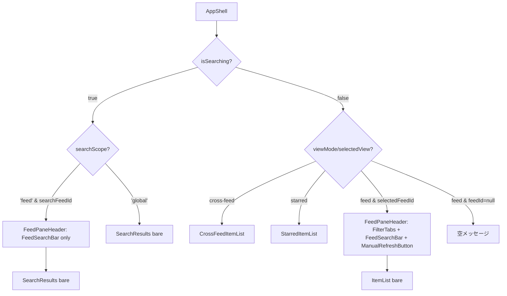

# Design Document

## Overview

**Purpose**: 本変更は #120 で導入した「フィード内検索」の結果表示中もフィードヘッダ領域に
フィード内検索バーを残置し、現在の検索キーワードを反映した状態で再編集・再検索できるように
することで、検索→絞り込み→再検索の反復操作の摩擦を取り除く。現状は `app-shell.tsx` が
`state.isSearching` 真値で右ペイン全体を `<SearchResults />` に差し替えるため、
`FeedSearchBar` を内包する `<ItemList />` が unmount されてしまい、検索バーが画面から
消える。これを「フィードヘッダ領域は通常一覧／検索結果で共有し、その下のリスト本体だけを
出し分ける」構成に組み替えるのが本設計の中心である。

**Users**: Feedman の Web UI を利用するログインユーザーが、左ペインで特定のフィードを
選択した状態で、右ペイン上部のフィード内検索バーにキーワードを入力 →Enter →結果表示 →
入力欄を編集 →Enter による再検索、というワークフローを単一画面の中で完結させる。

**Impact**: 既存の `app-shell.tsx`（右ペイン分岐ロジック）、`item-list.tsx`（フィルタ群と
FeedSearchBar を内包するフィードヘッダ）、`feed-search-bar.tsx`（state 同期）、
`search-results.tsx`（フィードヘッダ非保持）の 4 コンポーネントの組み合わせを再構成する。
新規にフィードペイン上部のヘッダ領域を担う薄いレイアウトコンポーネント
（`FeedPaneHeader`）を導入し、`ItemList` / `SearchResults` のそれぞれが自前で
持っていた「上部ヘッダ + 下部リスト」の構造をヘッダ抽出する。バックエンド API・データモデル・
検索ロジックは一切変更しない（純粋な Web フロントエンドのレイアウト/状態同期変更）。

### Goals

- 主要目標 1: フィード内検索結果表示中も `FeedSearchBar` が画面上に常に存在し、
  `state.searchQuery` を入力欄に反映した状態で再編集できるようにする（Req 1.1〜1.6）
- 主要目標 2: 横断検索結果表示中・フィード未選択状態では `FeedSearchBar` を表示しない
  （Req 2.1, 2.3）。左ペインで別フィードを選択した場合の遷移挙動も明示する（Req 2.2）
- 主要目標 3: #120 で確定したヘッダー横断検索バー、検索結果表示、ユーザー隔離、記事操作整合、
  非機能要件のいずれも変更しない（Req 3.1〜3.4 / NFR 1.1〜1.2 / NFR 2.1）
- 成功基準: requirements.md の全 AC（Req 1.x / 2.x / 3.x / NFR 1.x / NFR 2.x）が pass し、
  #120 の既存 UI / DB / API テストが回帰しない

### Non-Goals

- 横断検索バー（ヘッダー常設）の挙動変更（Out of Scope）
- フィード内検索結果表示中のフィルタタブ・手動更新ボタンの去就決定（Out of Scope。本設計では
  「検索結果表示中はフィードヘッダから一旦撤去し、フィード内検索バーのみ残す」を **暫定方針**
  として確認事項に記載するが、確定は別 Issue）
- 検索方式・検索対象範囲・ユーザー隔離・記事操作整合の変更（Out of Scope。#120 で確定済み）
- 検索キーワード入力時のリアルタイム検索（debounce 自動実行）
- バックエンド API（`GET /api/items/search`）の変更
- データモデル・DB スキーマ・マイグレーションの追加

## Architecture

### Existing Architecture Analysis

現在の関連コンポーネント構造（#120 確定後）:

```
AppShell                                  (app-shell.tsx)
└── 右ペイン分岐: state.isSearching
    ├── true  → <SearchResults />         (search-results.tsx)
    └── false → <ItemList feedId=...>     (item-list.tsx)
                ├── フィードヘッダ領域
                │   ├── フィルタタブ (Tabs)
                │   ├── <FeedSearchBar />  ← state.isSearching=true で消滅する
                │   └── <ManualRefreshButton />
                └── 記事リスト
```

問題点:

- `app-shell.tsx` L147 `{state.isSearching ? <SearchResults /> : <ItemList .../>}` の
  分岐により、フィード内検索を実行した瞬間 `ItemList` が unmount される
- `ItemList` 内部の `FeedSearchBar` も unmount されるため、検索結果表示中はバーが画面から消失
- `SearchResults` はフィードヘッダ領域を持たず、結果リストのみを描画する構造

尊重すべき境界:

- `AppState` の reducer（`SET_SEARCH_QUERY` / `CLEAR_SEARCH` / `SELECT_FEED` の副作用）は
  `app-state.tsx` で既に完成しており、本設計では **変更しない**。
  `SELECT_FEED` 時に検索状態をリセットする既存挙動（L173-178）は Req 2.2 を満たす
- `useItemSearch` フックは `query` `scope` `feedId` を受け取り `enabled` ガードを持つ
  `web/src/hooks/use-item-search.ts`。検索クエリ駆動の useInfiniteQuery 設計は変更しない
- `feed-search-bar.tsx` L36-42 の「`state.isSearching && scope='feed' && searchFeedId === selectedFeedId`
  なら `state.searchQuery` を localQuery 初期値に反映する」ロジックは、検索結果表示中も
  コンポーネントが mount され続ければそのまま活きる設計になっており、**再利用する**
- `search-results.tsx`、`item-list.tsx` の **記事リスト描画ロジック・状態出し分け・既読/スター
  操作・無限スクロール** は本設計では一切変更しない（Req 3.3 / NFR 1.1 / NFR 1.2 担保）

技術債回避:

- `FeedSearchBar` を `ItemList` と `SearchResults` の両方に複製配置する誘惑があるが、複製は
  state 同期の二重実装（local input ↔ AppState）を招きやすく避ける
- `app-shell.tsx` 直下に `FeedSearchBar` を裸で置くと、cross-feed モード（`viewMode === 'cross-feed'`）
  や starred モード（`selectedView === 'starred'`）まで誤って表示が漏れるため、フィード単一表示の
  文脈でのみ残置するレイアウト境界を作る

### Architecture Pattern & Boundary Map

**採用案: 新規 `FeedPaneHeader` レイアウトコンポーネントを `AppShell` の右ペイン分岐の
"feed view" 枝の外側に共通配置する**。`ItemList` と `SearchResults` は記事リスト本体だけに
責務を縮める。



ドメイン／機能境界:

- **`web/src/components/feed-pane-header.tsx`（新規）**: フィードヘッダ領域のレイアウト枠。
  通常一覧モードでは `FilterTabs + FeedSearchBar + ManualRefreshButton` の 3 要素を、検索結果
  表示モードでは `FeedSearchBar` のみを描画する（暫定方針）。各内側要素は既存実装をそのまま
  re-use する
- **`web/src/components/feed-search-bar.tsx`（修正）**: コンポーネント自体の責務は不変だが、
  検索結果表示中に **mount し続けたまま** `state.searchQuery` の外部変更にも追従するよう、
  `useState(initialLocalQuery)` のみの実装から `useEffect` による外部変更 sync を加える
  （後述 Components and Interfaces で詳細）
- **`web/src/components/app-shell.tsx`（修正）**: 右ペイン分岐ロジックを書き換える。
  従来の `isSearching` 単独判定を、`isSearching` × `searchScope` × `selectedFeedId` の
  組合せに拡張し、`FeedPaneHeader` の挿入有無を制御する
- **`web/src/components/item-list.tsx`（修正）**: 自前のフィードヘッダ領域（L143-169）を
  `FeedPaneHeader` 側に切り出し、`ItemList` 本体は「記事リスト + 詳細展開」のみを担う形に
  縮める。`useState<ItemFilter>` および filter state は引き続き `ItemList` 内部に保持し、
  `FeedPaneHeader` へは props として渡す（または `ItemList` の親で持つ）
- **`web/src/components/search-results.tsx`（修正）**: フィードヘッダ領域は持たない既存責務を
  維持する（フィードヘッダの存在は `AppShell` の上位 layout で担保される）。本設計では
  `SearchResults` 内部は **変更不要**（リスト描画・展開・スクロールはそのまま）

**新規コンポーネントの根拠**:

- `FeedPaneHeader` を切り出す理由: 通常一覧モードと検索結果モードの両方で「フィードを開いて
  いる文脈の上部ヘッダ」という同一意味論を共有しつつ、内部要素の出し分けが必要なため。
  この境界を作らないと、(a) `app-shell.tsx` 内で複雑な条件分岐 + 直接 `FeedSearchBar` を埋める、
  (b) `ItemList` と `SearchResults` の両方で同等ヘッダを複製する、のどちらかになる
- 代替案 B（`SearchResults` 内に `FeedSearchBar` を埋める）: `SearchResults` が
  `searchScope === 'feed'` のときだけ自前で `<FeedSearchBar />` を冒頭に置く案。一見シンプル
  だが、(i) `ItemList` 側の `FeedSearchBar` と `SearchResults` 側の `FeedSearchBar` が別の
  mount instance になり、ユーザーが通常一覧 → 検索 → クリア の遷移で local state が破棄され、
  Req 1.6 の「検索実行前の表示状態へ戻す」と入力欄初期化挙動が一貫しない、(ii) Req 1.1 の
  「画面上に表示し続ける」を mount-unmount 切替で実現するため、視覚的にも一瞬消える可能性が
  ある — のため不採用
- 代替案 C（`app-shell.tsx` 内に裸の `FeedSearchBar` を置く）: 上記「技術債回避」記載のとおり、
  cross-feed / starred モードへ表示が漏れない条件分岐が `app-shell.tsx` に集中して複雑化する。
  `FeedPaneHeader` 抽出によりこの条件式に名前を付けて 1 箇所に閉じ込める

### Technology Stack

| Layer | Choice / Version | Role in Feature | Notes |
|-------|------------------|-----------------|-------|
| Frontend / CLI | Next.js 15 + React 19 + TypeScript 5 | Web UI レイアウト変更のみ | TanStack React Query / shadcn/ui の既存利用を継続 |
| Backend / Services | （変更なし） | - | API 仕様変更なし |
| Data / Storage | （変更なし） | - | DB スキーマ変更なし |
| Messaging / Events | （変更なし） | - | - |
| Infrastructure / Runtime | （変更なし） | - | - |

## File Structure Plan

### Directory Structure

```
web/src/components/
├── app-shell.tsx                 # 修正: 右ペイン分岐に FeedPaneHeader 挿入の枝を追加
├── app-shell.test.tsx            # 修正: フィード内検索中も FeedSearchBar が表示される統合テスト追加
├── feed-pane-header.tsx          # 新規: フィードペイン上部ヘッダ領域のレイアウトコンポーネント
├── feed-pane-header.test.tsx     # 新規: 通常一覧モード / 検索結果モードでの要素出し分けテスト
├── feed-search-bar.tsx           # 修正: useEffect による外部 searchQuery 変更 sync を追加
├── feed-search-bar.test.tsx      # 修正: 検索結果表示中の input value 同期テスト追加
├── item-list.tsx                 # 修正: フィードヘッダ領域（L143-169）を FeedPaneHeader へ移譲し、
│                                  #         自身は記事リスト本体に責務を縮める
├── item-list.test.tsx            # 修正: ヘッダ移譲後の表示テストを調整（フィルタタブ・FeedSearchBar
│                                  #         は FeedPaneHeader 側のテストに移管、ItemList 本体は記事
│                                  #         リスト挙動のみ検証）
└── search-results.tsx            # 変更なし: 検索結果リスト本体は責務不変（フィードヘッダは
                                  #         AppShell 側の上位 layout で担保される）
```

### Modified Files

- `web/src/components/app-shell.tsx`
  - L147 付近の右ペイン分岐ロジックを書き換える。新しい疑似ロジック:
    ```
    if (isSearching) {
      if (searchScope === 'feed' && searchFeedId !== null) {
        render <FeedPaneHeader mode="search-feed" feedId={searchFeedId} />
               <SearchResults />
      } else {
        // 横断検索は従来どおり SearchResults のみ
        render <SearchResults />
      }
    } else if (selectedView === 'starred') {
      render <StarredItemList />
    } else if (viewMode === 'cross-feed') {
      render <CrossFeedItemList />
    } else if (selectedFeedId !== null) {
      render <FeedPaneHeader mode="normal" feedId={selectedFeedId} filter={...} onFilterChange={...} />
             <ItemList feedId={selectedFeedId} ... />
    } else {
      render <空メッセージ "フィードを選択してください">
    }
    ```
  - 既存 `<HeaderSearchBar />` の配置（L94-95）は変更しない（Req 3.1）

- `web/src/components/item-list.tsx`
  - L143-169 のフィードヘッダ領域（`<div className="flex flex-shrink-0 flex-wrap items-center ...">` 配下の
    フィルタタブ + FeedSearchBar + ManualRefreshButton）を削除し、責務を `FeedPaneHeader` へ移譲
  - `filter` state は `ItemList` 内部に残すか、親（`AppShell`）へ持ち上げるかをトレードオフで選択:
    - 採用案: **`filter` を `AppShell` に持ち上げる**。`FeedPaneHeader` が
      `filter` / `onFilterChange` を props で受け取り、`ItemList` も同じ `filter` を props で受け取る。
      `ItemList` 内部の `useState<ItemFilter>` は撤去し、props 化する。フィード切替時の filter
      リセット（L84-86 の `useEffect`）は `AppShell` 側で扱うか、または `AppState` の `filter`
      （既に存在）を使う流儀に揃える
    - 代替案: `filter` state を `ItemList` のまま残し、`FeedPaneHeader` 側から
      `ItemList` への callback ref / forwardRef で繋ぐ — 過度に複雑なので不採用
  - `useEffect`（L84-86）でフィード切替時に filter をリセットしていた処理は、AppState の
    `SELECT_FEED` reducer が既に `filter: "all"` にリセットしているため（`app-state.tsx` L173-178）、
    AppState の `filter` を使う形に揃えれば自動的に賄える
  - `ManualRefreshButton` は `FeedPaneHeader` 側へ移動

- `web/src/components/feed-search-bar.tsx`
  - `useState(initialLocalQuery)` のみだと検索結果表示中に `state.searchQuery` が外部変更（例:
    後述の横断検索からフィード内検索への切替）された際に `localQuery` が同期しない
  - 以下の `useEffect` を追加して、`state.isSearching && scope === 'feed' &&
    searchFeedId === selectedFeedId` のときに `state.searchQuery` を `localQuery` へ反映する:
    ```typescript
    useEffect(() => {
      if (
        state.isSearching &&
        state.searchScope === "feed" &&
        state.searchFeedId === selectedFeedId
      ) {
        setLocalQuery(state.searchQuery);
      }
    }, [
      state.isSearching, state.searchScope,
      state.searchFeedId, state.searchQuery, selectedFeedId,
    ]);
    ```
  - 既存の初期化ロジック（L36-42）は活かしたまま、外部変更にも追従する形に拡張

- `web/src/components/app-shell.test.tsx`
  - 既存テストは ItemList 内部に FeedSearchBar がある前提で書かれている部分があるなら更新
  - 新規テスト: フィード選択 → キーワード入力 → Enter → 検索結果表示中も `feed-search-bar`
    testid が表示されている（Req 1.1）

- `web/src/components/item-list.test.tsx`
  - ヘッダ要素（フィルタタブ・FeedSearchBar・ManualRefreshButton）の表示検証を `FeedPaneHeader`
    側のテストへ移管し、ItemList 本体は記事リスト挙動のテストに集中させる
  - もしくは ItemList を `AppShell` 経由でレンダする統合テスト形態に変更する

## Requirements Traceability

| Requirement | Summary | Components | Flow |
|-------------|---------|------------|------|
| 1.1 | 結果表示中に FeedSearchBar を画面に残す | `AppShell`, `FeedPaneHeader`, `FeedSearchBar` | AppShell が searchScope='feed' 枝で FeedPaneHeader を SearchResults 上に挿入 |
| 1.2 | 現在の検索キーワードを入力欄に反映 | `FeedSearchBar` | useState 初期化 + useEffect sync で state.searchQuery → localQuery |
| 1.3 | 入力編集に追随して表示更新 | `FeedSearchBar` | onChange で setLocalQuery（既存 L85） |
| 1.4 | 送信で新しい検索を開始 | `FeedSearchBar` | handleSubmit → dispatch SET_SEARCH_QUERY（既存 L48-61） |
| 1.5 | 空入力での送信は無視 | `FeedSearchBar` | trim().length === 0 で early return（既存 L50-53） |
| 1.6 | クリア操作で検索前一覧へ戻す | `FeedSearchBar`, `AppState.CLEAR_SEARCH` | handleClear → dispatch CLEAR_SEARCH（既存 L63-67） + AppShell が selectedFeedId 経由で ItemList に戻す |
| 2.1 | 横断検索結果中は FeedSearchBar 非表示 | `AppShell` | searchScope === 'global' の枝で FeedPaneHeader を挿入しない |
| 2.2 | 別フィード選択時に結果解除 → 通常一覧 | `AppState.SELECT_FEED`, `AppShell` | 既存 reducer が searchQuery='' / isSearching=false にリセット（app-state.tsx L173-178） |
| 2.3 | フィード未選択時は FeedSearchBar 非表示 | `AppShell`, `FeedSearchBar` | AppShell が selectedFeedId === null の枝で FeedPaneHeader を挿入しない、かつ FeedSearchBar 自身も selectedFeedId===null で null を返す |
| 3.1 | ヘッダー横断検索バーは変更しない | `AppShell`, `HeaderSearchBar` | app-shell.tsx L94-95 の配置を保持、HeaderSearchBar 自体は変更なし |
| 3.2 | 検索対象範囲・ユーザー隔離は変更しない | （変更なし） | バックエンド `/api/items/search` 仕様変更なし、`useItemSearch` の `feed_id` 任意付与ロジック変更なし |
| 3.3 | 検索結果画面の表示順・空/ローディング/エラー/詳細展開は不変 | `SearchResults` | search-results.tsx は本変更で修正しない |
| 3.4 | 通常一覧モードのフィードヘッダは従来と同じ要素群 | `FeedPaneHeader`, `AppShell` | mode='normal' で FilterTabs + FeedSearchBar + ManualRefreshButton の 3 要素を従来と同じレイアウトで描画 |
| NFR 1.1 | 通常利用の非回帰 | （変更なし） | isSearching=false パスの記事一覧表示・選択・既読/スターはそのまま |
| NFR 1.2 | 検索結果画面の表示領域・カード構造は同一 | `SearchResults` | search-results.tsx を本変更で修正しないため自動的に担保 |
| NFR 2.1 | 入力編集の即応性（即時知覚遅延） | `FeedSearchBar` | local state での onChange 反映（既存挙動、CSR で React の state update が同期的に反映） |

## Components and Interfaces

### Frontend Layer

#### `web/src/components/feed-pane-header.tsx`（新規）

| Field | Detail |
|-------|--------|
| Intent | フィードを開いた文脈での右ペイン上部ヘッダ領域を担う薄いレイアウトコンポーネント |
| Requirements | 1.1, 2.1, 2.3, 3.4 |

**Responsibilities & Constraints**

- 主責務: フィード文脈の上部ヘッダ枠を提供し、`mode` プロパティに応じて内部要素を出し分ける:
  - `mode === 'normal'`: `FilterTabs` + `<FeedSearchBar />` + `<ManualRefreshButton />`（従来と
    同じ 3 要素・同じレイアウト、Req 3.4）
  - `mode === 'search-feed'`: `<FeedSearchBar />` のみ（暫定方針。フィルタタブ・手動更新ボタンは
    本 Issue の Open Questions に従い検索結果表示中は撤去する。将来の確定で再表示する場合は
    本コンポーネント内部で対応）
- ドメイン境界: コンポーネント自体は state を持たず、props と AppState のみで動作する
- データ所有権: なし

**Dependencies**

- Inbound: `AppShell`（フィード文脈の枝でレンダ） — レイアウト埋め込み（critical）
- Outbound: `FeedSearchBar`, `Tabs/TabsList/TabsTrigger`（shadcn/ui）,
  `ManualRefreshButton`（item-list.tsx から export 化）, `useManualRefresh`, `useFeeds`
- External: なし

**Contracts**: Service [ ] / API [ ] / Event [ ] / Batch [ ] / State [x]

##### Component Interface（疑似シグネチャ）

```typescript
type FeedPaneHeaderMode = "normal" | "search-feed";

interface FeedPaneHeaderProps {
  /** 表示モード（'normal' = 通常一覧、'search-feed' = フィード内検索結果表示中） */
  mode: FeedPaneHeaderMode;
  /** 対象フィードID（'normal' / 'search-feed' のいずれでも非 null。
      呼び出し側で selectedFeedId / searchFeedId を解決して渡す） */
  feedId: string;
  /** 'normal' モードでのフィルタ値（'search-feed' モードでは未使用） */
  filter?: ItemFilter;
  /** 'normal' モードでのフィルタ変更ハンドラ（'search-feed' モードでは未使用） */
  onFilterChange?: (filter: ItemFilter) => void;
}

export function FeedPaneHeader(props: FeedPaneHeaderProps): JSX.Element;
```

- mode='normal' 時は `<Tabs value={filter} onValueChange={onFilterChange}>` + `<FeedSearchBar />`
  + `<ManualRefreshButton>` を `item-list.tsx` 旧 L148-169 と同等のレイアウト DOM 構造で描画する
- mode='search-feed' 時は `<FeedSearchBar />` のみを描画する（暫定方針。Open Questions で確定）
- mode 切替時に `<FeedSearchBar />` が unmount されないよう、両モードで同一の React tree 位置に
  `<FeedSearchBar />` を配置する（key を変えない、条件分岐は親コンテナの className のみ）。
  これにより Req 1.1 の「画面上に表示し続ける」を mount 維持として担保する

#### `web/src/components/feed-search-bar.tsx`（修正）

| Field | Detail |
|-------|--------|
| Intent | フィード内検索バー。入力欄の表示値と AppState の検索キーワードを双方向同期する（修正対象は外部変更 sync の追加のみ） |
| Requirements | 1.1, 1.2, 1.3, 1.4, 1.5, 1.6, 2.3, NFR 2.1 |

**Responsibilities & Constraints**

- 主責務（既存）: テキスト入力受け取り、Enter で `SET_SEARCH_QUERY({scope:'feed', feedId})`、
  × ボタンで `CLEAR_SEARCH` を dispatch する
- **追加責務**: `state.isSearching && state.searchScope === 'feed' && state.searchFeedId === selectedFeedId`
  のとき、`state.searchQuery` の外部変更を `useEffect` で `localQuery` に反映する。
  これにより検索結果表示中に AppState 経由で他の経路（例: ProgrammaticallyDispatched）からの
  キーワード変更にも追従でき、より一般的に Req 1.2 の「現在の検索キーワードを入力欄に反映」を
  満たす
- ドメイン境界: API 通信は行わない。`selectedFeedId === null` のとき `null` を返す（NFR 2.3）
- Invariant: input の `value={localQuery}` は controlled component として常に React state と
  一致する（NFR 2.1 の即応性は React の同期 state update により担保）

**Dependencies**

- Inbound: `FeedPaneHeader` から render（mode='normal' / 'search-feed' のいずれでも同じ位置）
- Outbound: `useAppState`, `useAppDispatch`
- External: なし

**Contracts**: Service [ ] / API [ ] / Event [ ] / Batch [ ] / State [x]

##### 修正後 useEffect の追加箇所（疑似コード）

```typescript
const [localQuery, setLocalQuery] = useState(initialLocalQuery);

// 追加: 検索結果表示中に AppState の searchQuery 外部変更を localQuery に反映
useEffect(() => {
  if (
    state.isSearching &&
    state.searchScope === "feed" &&
    state.searchFeedId === selectedFeedId
  ) {
    setLocalQuery(state.searchQuery);
  }
  // 注: deps に setLocalQuery を含めない（setter は安定参照）
}, [
  state.isSearching,
  state.searchScope,
  state.searchFeedId,
  state.searchQuery,
  selectedFeedId,
]);
```

- handleSubmit / handleClear / 描画 JSX は既存ロジックを保持
- handleSubmit 後に AppState の searchQuery が `trimmed` に更新されるが、ユーザーが入力した
  値（`localQuery`）が同値かそれ以上の整合値であるため、useEffect の `setLocalQuery` は
  実質的に同値 set で no-op となり、再 render は React の bail-out で抑制される

#### `web/src/components/app-shell.tsx`（修正）

| Field | Detail |
|-------|--------|
| Intent | 右ペイン分岐ロジックを拡張し、フィード内検索結果表示中に `FeedPaneHeader` を `SearchResults` の上に挿入する |
| Requirements | 1.1, 2.1, 2.3, 3.1, 3.4 |

**Responsibilities & Constraints**

- 主責務（既存）: 2 ペインレイアウト、ヘッダー（HeaderSearchBar 含む）、左ペイン（FeedList）、
  右ペイン分岐の制御
- **追加責務**: 右ペイン分岐に `FeedPaneHeader` の挿入有無を制御するロジックを統合する
- ドメイン境界: フィードヘッダ要素の中身（フィルタタブ・FeedSearchBar・手動更新ボタン）の知識は
  `FeedPaneHeader` に委譲する

**Dependencies**

- Inbound: app root（`page.tsx`）
- Outbound: `FeedPaneHeader`, `ItemList`, `SearchResults`, `StarredItemList`, `CrossFeedItemList`,
  `HeaderSearchBar`, `FeedList`, `useAppState`, `useAppDispatch`, `useFeeds`
- External: なし

**Contracts**: Service [ ] / API [ ] / Event [ ] / Batch [ ] / State [x]

##### 右ペイン分岐の擬似コード（修正後）

```typescript
function renderRightPane(state: AppState): JSX.Element {
  // 優先順位: 検索モード > starred モード > cross-feed モード > 通常フィード一覧 > 空メッセージ
  if (state.isSearching) {
    if (state.searchScope === "feed" && state.searchFeedId !== null) {
      // Req 1.1: フィード内検索結果表示中は FeedPaneHeader（FeedSearchBar のみ）を残す
      return (
        <>
          <FeedPaneHeader mode="search-feed" feedId={state.searchFeedId} />
          <SearchResults />
        </>
      );
    }
    // Req 2.1: 横断検索結果中は FeedPaneHeader を挿入しない
    return <SearchResults />;
  }

  if (state.selectedView === "starred") {
    return <StarredItemList />;
  }
  if (state.viewMode === "cross-feed") {
    return <CrossFeedItemList />;
  }
  if (state.selectedFeedId !== null) {
    // Req 3.4: 通常一覧モードは FeedPaneHeader（3 要素）+ ItemList
    return (
      <>
        <FeedPaneHeader
          mode="normal"
          feedId={state.selectedFeedId}
          filter={state.filter}
          onFilterChange={(filter) => dispatch({ type: "SET_FILTER", filter })}
        />
        <ItemList
          feedId={state.selectedFeedId}
          onSelectItem={handleSelectItem}
          expandedItemId={state.expandedItemId}
          filter={state.filter}
        />
      </>
    );
  }
  // フィード未選択（Req 2.3 の前提状態）
  return (
    <div className="flex items-center justify-center h-full text-sm text-muted-foreground">
      フィードを選択してください
    </div>
  );
}
```

> filter を AppState 側に持ち上げるか、AppShell の useState で持つかはトレードオフ。
> 採用案: **AppState の `filter` を直接読み書きする**（既に `app-state.tsx` の reducer が
> `SET_FILTER` および `SELECT_FEED` 時の `filter: "all"` リセットを処理している）。これにより
> `ItemList` 内部の `useState<ItemFilter>` および `useEffect`（L84-86）を撤去できる

#### `web/src/components/item-list.tsx`（修正）

| Field | Detail |
|-------|--------|
| Intent | 記事リスト本体（リスト・詳細展開・無限スクロール）に責務を縮める。フィードヘッダ領域は `FeedPaneHeader` に移譲する |
| Requirements | 3.3, 3.4, NFR 1.1 |

**Responsibilities & Constraints**

- 主責務（縮小後）: 記事一覧の `useItems` 取得・ローディング/エラー/空状態描画、`ItemRow` 列挙、
  `ItemDetailArea` 展開、無限スクロール sentinel
- **撤去責務**: フィードヘッダ領域の DOM（L143-169）、`useState<ItemFilter>`、
  フィード切替時の filter リセット `useEffect`、`useManualRefresh`、`useFeeds` ベースの
  `subscriptionId` 解決、`ManualRefreshBanner` 表示、`ManualRefreshButton` の描画
- ドメイン境界: filter は props 化（`AppShell` 経由で AppState の `state.filter` を受け取る）。
  `ManualRefreshButton` は `FeedPaneHeader` 側に移管。`ManualRefreshBanner` も `FeedPaneHeader` 側
  へ移管（手動更新ボタンと結果バナーは同一文脈であるため移管先を分けない）

**Dependencies**

- Inbound: `AppShell`（`selectedFeedId !== null` の枝で render）
- Outbound: `useItems`, `useItemDetail`, `useMarkAsRead`, `useToggleStar`, `ItemDetail`,
  `ItemDetailArea`, `ItemRow`
- External: なし

**Contracts**: Service [ ] / API [ ] / Event [ ] / Batch [ ] / State [ ]

##### Props 修正

```typescript
interface ItemListProps {
  feedId: string | null;
  onSelectItem: (itemId: string) => void;
  expandedItemId: string | null;
  filter: ItemFilter;  // 追加: AppState から props で受け取る
}
```

- `useState<ItemFilter>` および `useEffect` の filter リセットを撤去
- `FeedSearchBar` および `ManualRefreshButton` の import・配置を撤去
- `ManualRefreshBanner` も撤去（移管先は `FeedPaneHeader`）

#### `web/src/components/search-results.tsx`（変更なし）

| Field | Detail |
|-------|--------|
| Intent | 検索結果リスト本体。本変更では修正しない |
| Requirements | 3.3, NFR 1.2 |

- 検索結果リストの描画・状態出し分け・展開・スクロール・既読/スター操作は全て不変
- `FeedPaneHeader` は `SearchResults` の **外側**（`AppShell` の右ペイン枝）で挿入されるため、
  `SearchResults` 自身は本変更の影響を受けない

## Data Models

本変更では新規データモデル・既存モデルの変更は **無い**。AppState の `searchQuery` /
`isSearching` / `searchScope` / `searchFeedId` は既に `app-state.tsx` で定義済みで、
reducer の挙動も変更しない。

## Error Handling

### Error Strategy

本変更はレイアウト変更のみのため、新規エラー経路は導入しない。既存のエラー表示
（`SearchResults` のエラー / 空状態 / ローディング、`ItemList` のエラー、
`ManualRefreshBanner` のエラー）はそのまま保持される。

### Error Categories and Responses

- **User Errors**: 該当なし（バリデーションの追加なし）
- **System Errors**: 該当なし（API 呼び出しの追加なし）
- **Business Logic Errors**: 該当なし

特記事項として、`FeedSearchBar` の `useEffect` で `setLocalQuery` を実行する際、
React の state setter は同期処理であり例外を投げないため、追加のエラーハンドリングは不要。

## Testing Strategy

### Unit Tests

1. `feed-pane-header.test.tsx`: `mode="normal"` で FilterTabs / FeedSearchBar /
   ManualRefreshButton の 3 要素が描画される（Req 3.4）
2. `feed-pane-header.test.tsx`: `mode="search-feed"` で FeedSearchBar のみが描画され、
   FilterTabs / ManualRefreshButton は描画されない（暫定方針確認）
3. `feed-search-bar.test.tsx`: 検索結果表示中に AppState の `searchQuery` が外部変更されたとき、
   `useEffect` 経由で input value が同期する（Req 1.2 一般化ケース）
4. `feed-search-bar.test.tsx`: `mode="search-feed"` 状態で初回 mount 時に input value が
   現在の `state.searchQuery` を反映している（Req 1.2 初期描画ケース）
5. `feed-search-bar.test.tsx`: 既存テスト（クリア・空入力 dispatch なし・trim 等）が全て pass

### Integration Tests

1. `app-shell.test.tsx`: フィード選択 → キーワード入力 → Enter → `SearchResults` 表示中に
   `feed-search-bar` testid が存在する（Req 1.1）
2. `app-shell.test.tsx`: フィード内検索結果表示中に `feed-search-input` の value が現在の
   検索キーワードを表示している（Req 1.2）
3. `app-shell.test.tsx`: フィード内検索結果表示中に input を編集 → Enter で `useItemSearch` の
   queryKey が新キーワードで変わる（Req 1.4）
4. `app-shell.test.tsx`: フィード内検索結果表示中に input を空にして Enter → 検索結果表示が
   維持される（Req 1.5）
5. `app-shell.test.tsx`: フィード内検索結果表示中にクリアボタン押下 → 通常の記事一覧表示に
   戻る（Req 1.6）
6. `app-shell.test.tsx`: 横断検索結果表示中（`HeaderSearchBar` から submit）に
   `feed-search-bar` testid が存在しないこと（Req 2.1）
7. `app-shell.test.tsx`: フィード内検索結果表示中に左ペインで別フィードを選択 → 検索が解除され、
   選択先フィードの通常一覧が表示される（Req 2.2）
8. `app-shell.test.tsx`: フィード未選択状態（初期状態）で `feed-search-bar` testid が存在しない
   こと（Req 2.3）

### E2E/UI Tests（手動確認 / Vitest jsdom 困難な領域）

1. ブラウザ実機で、検索→結果→入力欄編集→Enter→再検索の連続操作で画面ちらつきがないこと
   （Req 1.1, NFR 2.1）
2. 通常一覧モードと検索結果モードでヘッダ領域の縦方向ジャンプが発生しないこと（UX 確認）

### Performance / Load

- 本変更は API 呼び出しを追加せず、レイアウト変更のみのため新規 perf 計測は不要
- NFR 2.1 の即応性は React の同期 state update に依存し、既存 `feed-search-bar.tsx` で
  既に担保されている

## 確認事項（人間レビュアー向け）

要件側で明示されていない論点（PM の Open Questions 由来）。本設計では下記の暫定方針で進める
が、運用者の意向と異なる場合は PM フェーズへ差し戻しが必要:

1. **フィード内検索結果表示中のフィルタタブ表示** (Open Question 1): 暫定で「検索結果表示中は
   フィルタタブを撤去する（`mode="search-feed"` で FilterTabs を描画しない）」を採用する。
   理由: (a) 検索結果は別データソース（`/api/items/search`）で取得されておりフィルタタブ
   （既読/未読/スター）が技術的に効かない、(b) 残置するなら無効化グレイアウト等の追加 UI が
   必要だが Out of Scope に「フィルタタブの仕様は別 Issue」と明記されている。残置・無効化
   表示が望ましければ別 Issue 化を提案
2. **フィード内検索結果表示中の手動更新ボタン表示** (Open Question 2): 暫定で「検索結果表示中は
   手動更新ボタンを撤去する」を採用する。理由は同上（手動更新は記事一覧のフェッチを更新する
   ものであり、検索結果に対する意味づけが曖昧）。残置する場合の挙動（更新後に再検索を発火するか
   等）は別 Issue で検討すべき
3. **`filter` state の置き場所**: 暫定で「`AppState.filter` を直接読み書きし、`ItemList` 内部の
   `useState<ItemFilter>` を撤去する」設計とする。AppState の reducer が既に `SELECT_FEED` 時の
   filter リセットを処理しているため、`ItemList` の `useEffect`（L84-86）も併せて撤去できる。
   この副次変更が **`ItemList` の独立性を損なう** と判断されたら、`AppShell` 内 useState 経由で
   渡す形（AppState を経由しない）に倒すことも可能
4. **`FeedPaneHeader` の DOM 配置位置**: 暫定で「右ペイン `<main>` 内の flex-col の 1 要素として、
   リスト本体の上に配置する」を採用する。現状 `item-list.tsx` のヘッダ DOM 構造
   （`flex flex-shrink-0 flex-wrap items-center justify-between gap-2 border-b px-4 py-2`）を
   そのまま `FeedPaneHeader` のルート div に移植することで、Req 3.4 の「従来と同じ要素群」の
   視覚的同一性を担保する
5. **`FeedSearchBar` の `useEffect` sync 範囲**: 暫定で「`searchScope === 'feed'` かつ
   `searchFeedId === selectedFeedId` のときのみ sync する」とする。横断検索中の
   `state.searchQuery` は `searchScope === 'global'` なので、フィード内検索バーには反映しない
   （二重表示の混乱を避ける）
