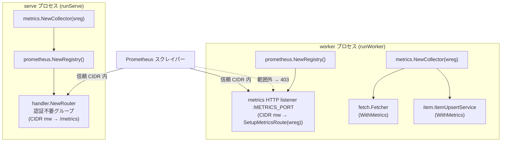

# Design Document

## Overview

**Purpose**: 既に実装済みだが起動エントリから一切参照されずデッドコード状態の
`internal/metrics` Collector を、本番のフィードフェッチ処理・記事 UPSERT 処理に組み込み（wiring）、
`/metrics` エンドポイントを信頼 CIDR 制限付きで公開する。これにより運用者は Prometheus 互換の
外部監視基盤からフィード取得処理の稼働状況（成功率・失敗傾向・処理量・レイテンシ）をスクレイプして
可視化できる。

**Users**: Feedman の運用者が、Prometheus 等のスクレイパーを `/metrics` に向けてスクレイプし、
ダッシュボード／アラートで稼働状況を監視する workflow で利用する。

**Impact**: 現在 serve / worker いずれのプロセスも `/metrics` を公開しておらず、Collector の 6 つの
記録メソッドはどこからも呼ばれていない。本変更で (1) worker プロセスにフェッチ系メトリクスを記録する
Collector を注入し、(2) worker プロセスに metrics 専用の軽量 HTTP listener を新設し、(3) serve
プロセスのルーターにも `/metrics` を登録し、(4) 両プロセスで信頼 CIDR ミドルウェアによる IP 制限を
かける。既存メトリクス実装（`internal/metrics/metrics.go` の 6 メソッド・Collector・Handler）は
**一切変更しない**（スコープは wiring に限定）。

### Goals

- 既存 Collector の 6 メソッドをフェッチャー層・UPSERT サービス層に注入し、本番のフェッチ／UPSERT
  実行結果がメトリクスに反映される（Requirement 2）。
- フェッチを実行する worker プロセスが、自プロセスで記録したフェッチ系メトリクスを **同一プロセスの**
  `/metrics` 経由でスクレイプ可能にする（Requirement 1, 3）。
- `/metrics` を信頼 CIDR 範囲内からのアクセスのみに制限し、範囲外は 403、CIDR 未設定時は安全側
  （全拒否）に倒す（Requirement 4, NFR 2）。
- 既存エンドポイントのルーティング・レスポンス・タイムアウト挙動と既存自動テストスイートを退行させない
  （Requirement 5, NFR 1）。
- 成功基準: `go build ./... && go test ./... && go vet ./...` が green、新規追加した CIDR
  ミドルウェア・worker metrics listener・wiring の単体／結合テストが通過する。

### Non-Goals

- 新規メトリクス項目の追加（既存 6 メソッドの範囲を超える指標定義は行わない）。
- Grafana ダッシュボード・アラートルールの整備。
- メトリクスの永続化・push 型送信（pull/スクレイプ前提）。
- 信頼 CIDR 以外の保護方式（共有シークレット・OAuth・mTLS 等）の導入。
- serve / worker 間での Prometheus registry 共有（別プロセスのため原理的に不可。後述「Architecture
  Decision」で別 registry・別 listener とする根拠を述べる）。

## Architecture

### Existing Architecture Analysis

- **現在のアーキテクチャパターン**: `internal/<domain>/` のレイヤ分割（`metrics` / `middleware` /
  `handler` / `worker/fetch` / `item` / `config` / `app`）。`app.go` が 3 つの起動モード
  （`runServe` / `runWorker` / `runMigrate`）を切り替える composition root。
- **尊重すべきドメイン境界**:
  - `internal/metrics` は Prometheus 依存をカプセル化する境界。`MetricsCollector` interface を介して
    他レイヤから記録のみ行う（本変更でも metrics 実装本体は変更しない）。
  - `internal/middleware` の各ミドルウェアは `func(next http.Handler) http.Handler` を返す
    コンストラクタ関数パターン（cors / security_headers / session 参照）。CIDR ミドルウェアも同型に揃える。
  - `internal/handler/router.go` の `RouterDeps` 構造体経由の依存注入。`/metrics` は認証不要グループに
    登録する。
- **維持すべき統合点**:
  - `fetchpkg.NewFetcher(...)` / `item.NewItemUpsertService(...)` のシグネチャ。両者には合計 50 箇所超の
    既存テスト call site が存在する（`internal/worker/fetch/*_test.go` / `internal/item/upsert_test.go`）。
    後方互換のため **既存の位置引数を変えず**、可変長 functional options を末尾に追加する。
  - `internal/metrics/metrics.go` の `NewCollector(reg prometheus.Registerer)` と
    `SetupMetricsRoute(gatherer prometheus.Gatherer)`。テストは `prometheus.NewRegistry()` を渡しており、
    default registry には依存していない（`handler_test.go` 確認済み）。
- **解消・回避する technical debt**: Collector のデッドコード化（呼び出し元ゼロ）を解消する。

### Architecture Decision: serve / worker 別プロセスのメトリクス公開戦略

requirements.md Requirement 3 が要件化した最重要論点。serve と worker は **別プロセス**として起動され、
Prometheus はプロセス単位でスクレイプするため、フェッチ系カウンタ（`feedman_fetch_success_total` 等）は
**worker プロセス内でのみ増加**する。serve のルーターに `/metrics` を足すだけでは worker のカウンタは
観測できない。

#### 採用案: プロセスごとに独立した registry + 独立した `/metrics` listener

| プロセス | registry | metrics 公開経路 | 観測されるメトリクス |
|---|---|---|---|
| serve | `prometheus.NewRegistry()`（serve 専用） | 既存メインルーター（`:SERVER_PORT`）に `/metrics` を登録 | serve プロセス内で記録された分（本機能では Collector 記録経路が無いため初期値）。Requirement 1/2/3 の主役は worker 側 |
| worker | `prometheus.NewRegistry()`（worker 専用） | **新設**の軽量 metrics HTTP listener（`:METRICS_PORT`、既定 9090） | フェッチ系全 6 メトリクス（worker でフェッチ／UPSERT が実行されるため） |

- 各プロセスが `prometheus.NewRegistry()` で **自前の registry** を生成し、`NewCollector(reg)` で
  Collector を登録、`SetupMetricsRoute(reg)`（gatherer = registry）で公開する。
- worker は HTTP ルーターを持たないため、`/metrics` 専用の軽量 `http.Server` を新規 goroutine で起動する
  （別ポート `METRICS_PORT`、既定 9090）。信頼 CIDR ミドルウェアでラップする。
- serve は既存メインルーターの認証不要グループに `/metrics` を登録し、信頼 CIDR ミドルウェアを前段に置く。
- これにより worker プロセスは「自プロセスで記録したメトリクスを別プロセスのスクレイプ応答に依存せず
  観測可能」（Requirement 3.3）を満たす。

#### 代替案と却下理由

- **代替案 A: default registry（`prometheus.DefaultRegisterer`）を使う**。却下: process-global であり、
  複数回 `MustRegister` すると重複登録 panic のリスク。テストも `NewRegistry()` を使っており既存方針と不整合。
  明示 registry の方が wiring の所有権が明確。
- **代替案 B: serve のルーターに `/metrics` を足すだけ（worker に listener を追加しない）**。却下:
  Requirement 3 を満たせない（worker のフェッチカウンタが永遠に観測されない）。
- **代替案 C: worker を serve の同一プロセスに統合**。却下: 既存の 2 プロセス分離アーキテクチャを破壊し、
  Requirement 5（後方互換）に違反する。スコープも過大。
- **代替案 D: worker metrics を serve の同一ポートで多重化（共有ポート）**。却下: 別プロセスのため同一ポートを
  共有できない。worker は独立 listener が必須。

### Architecture Decision: Collector の nil 注入と no-op 化

`MetricsCollector` を依存注入する `Fetcher` / `ItemUpsertService` で、Collector が注入されない場合
（既存テストや Collector 不要な構成）に nil 参照で panic しないよう、**no-op Collector** を導入する。

- `Fetcher` / `ItemUpsertService` は内部フィールド `metrics metrics.MetricsCollector` を持つ。
- functional option（`WithMetrics(c)`）が指定されなかった場合、コンストラクタ内で no-op 実装
  （`metrics.NopCollector`、全メソッド空実装）を既定値として設定する。
- これにより記録呼び出し（`f.metrics.RecordXxx(...)`）は常に nil 安全。既存テストは option 未指定のまま
  no-op になり挙動不変（Requirement 5, NFR 1.2）。
- `NopCollector` は `internal/metrics` に新規追加する（実装本体の変更ではなく追加。Collector の 6 メソッドの
  ロジックには手を入れない）。

### Architecture Pattern & Boundary Map



**Architecture Integration**:
- 採用パターン: **per-process independent registry + per-process metrics endpoint**（別プロセスは
  registry を共有できないという制約への素直な解）。
- ドメイン／機能境界: メトリクス記録は `metrics.MetricsCollector` interface 越し、公開は
  `metrics.SetupMetricsRoute`、IP 制限は `middleware` 層の新規ミドルウェア、wiring は `app` 層。
- 既存パターンの維持: ミドルウェアコンストラクタ関数パターン、`RouterDeps` 依存注入、`config.Load()` の
  env 読み込みパターン（`getEnvString` 流用）。
- 新規コンポーネントの根拠: worker に HTTP listener が無い → 新設必須（Requirement 3）。CIDR による IP
  制限は既存ミドルウェアに無い → 新設必須（Requirement 4）。

### Technology Stack

| Layer | Choice / Version | Role in Feature | Notes |
|-------|------------------|-----------------|-------|
| Backend / Services | Go 1.25 | wiring・ミドルウェア・listener 実装 | 既存スタック踏襲 |
| Metrics | `prometheus/client_golang`（既存） | Collector / registry / promhttp ハンドラ | 実装本体は変更しない |
| HTTP ルーター | chi/v5（既存） | serve の `/metrics` 登録（認証不要グループ） | worker は標準 `http.ServeMux`（既存 `SetupMetricsRoute` が返す mux）を使用 |
| Config | `os.Getenv`（既存 `config.Load`） | 信頼 CIDR・METRICS_PORT の env 読み込み | `getEnvString` を流用 |
| Infrastructure / Runtime | docker-compose（既存） | worker の METRICS_PORT 公開／スクレイプ設定 | 公開ポート設定は運用ドキュメント（README）に追記 |
| テスト | 標準 `testing` + `net/http/httptest` | CIDR mw・wiring・listener のテスト | 既存テスト規約に準拠 |

## File Structure Plan

### Directory Structure

```
internal/
├── metrics/
│   ├── metrics.go            # 既存。変更しない（6 メソッド・Collector・SetupMetricsRoute）
│   └── nop.go                # 新規: NopCollector（全メソッド空実装。nil 注入時の既定値）
├── middleware/
│   ├── trusted_cidr.go       # 新規: 信頼 CIDR による IP 制限ミドルウェア
│   └── trusted_cidr_test.go  # 新規: CIDR 判定・未設定 deny・X-Forwarded-For 非信頼のテスト
├── config/
│   └── config.go             # 変更: TrustedCIDRs []string / MetricsPort string を Config に追加し env 読込
├── handler/
│   └── router.go             # 変更: RouterDeps に MetricsHandler / TrustedCIDRMiddleware を追加、
│                             #       認証不要グループに /metrics を CIDR mw 前段で登録
├── worker/
│   └── fetch/
│       ├── fetcher.go        # 変更: metrics フィールド + WithMetrics option、記録呼び出し挿入
│       └── fetcher_test.go   # 変更: メトリクス記録の検証テストを追加（既存 call site は不変）
├── item/
│   ├── upsert.go             # 変更: metrics フィールド + WithMetrics option、UpsertItems で記録
│   └── upsert_test.go        # 変更: items_upserted 記録の検証テストを追加（既存 call site は不変）
└── app/
    ├── app.go                # 変更: runServe / runWorker で registry・Collector を生成し wiring。
    │                         #       runWorker に metrics HTTP listener goroutine を追加
    └── metrics_listener.go   # 新規: worker 用 metrics listener の起動/停止ヘルパ（runWorker から呼ぶ）
```

### Modified Files

- `internal/config/config.go` — `Config` に `TrustedCIDRs []string`（カンマ区切り env をパース）と
  `MetricsPort string`（既定 9090）を追加。`Load()` で `METRICS_TRUSTED_CIDRS` / `METRICS_PORT` を
  読み込む。`TrustedCIDRs` が空（未設定）の場合はそのまま空スライスとし、ミドルウェア側で安全側（全拒否）に
  倒す（NFR 2.1）。
- `internal/handler/router.go` — `RouterDeps` に `MetricsHandler http.Handler`（nil 可）と
  `MetricsMiddleware func(http.Handler) http.Handler`（CIDR mw、nil 可）を追加。`MetricsHandler` が
  非 nil のとき認証不要グループに `r.With(MetricsMiddleware).Handle("/metrics", MetricsHandler)` を登録。
  nil の場合は登録しない（既存挙動不変＝後方互換）。
- `internal/worker/fetch/fetcher.go` — `Fetcher` に `metrics metrics.MetricsCollector` フィールドを追加。
  `NewFetcher(...)` の末尾に `opts ...FetcherOption` を追加（既存 7 引数 call site は不変でコンパイル可能）。
  `Fetch` 内の各分岐で `RecordHTTPStatus` / `RecordFetchSuccess` / `RecordFetchFailure` /
  `RecordParseFailure` / `RecordFetchLatency` を記録。
- `internal/item/upsert.go` — `ItemUpsertService` に `metrics metrics.MetricsCollector` フィールドを追加。
  `NewItemUpsertService(...)` の末尾に `opts ...UpsertOption` を追加（既存 2 引数 call site は不変）。
  `UpsertItems` 成功時に `RecordItemsUpserted(inserted + updated)` を記録（Requirement 2.6）。
- `internal/app/app.go` — `runServe` で serve 専用 registry + Collector を生成し、CIDR mw と
  `SetupMetricsRoute` を `RouterDeps` に注入。`runWorker` で worker 専用 registry + Collector を生成し、
  `WithMetrics` で fetcher / upsert に注入、metrics listener goroutine を起動・graceful stop。

## Requirements Traceability

| Requirement | Summary | Components | Interfaces | Flows |
|-------------|---------|------------|------------|-------|
| 1.1 | 信頼 CIDR 内から `/metrics` で Prometheus 形式応答 | TrustedCIDRMiddleware, MetricsEndpoint(serve/worker) | `SetupMetricsRoute`, CIDR mw | スクレイプ → CIDR 判定 → promhttp |
| 1.2 | 起動完了で即スクレイプ可能 | App Wiring | registry 即時公開 | 起動時に listener/route 登録 |
| 1.3 | 全 6 メトリクス系列を応答に含める | Collector(既存), App Wiring | `NewCollector(reg)` | registry に 6 系列登録済み |
| 2.1 | フェッチ成功で成功数増加 | Fetcher | `RecordFetchSuccess` | Fetch 200 成功時 |
| 2.2 | フェッチ失敗で失敗数増加 | Fetcher | `RecordFetchFailure` | SSRF/HTTP/backoff/stop 時 |
| 2.3 | パース失敗でパース失敗数増加 | Fetcher | `RecordParseFailure` | gofeed parse 失敗時 |
| 2.4 | HTTP ステータス別レスポンス数増加 | Fetcher | `RecordHTTPStatus` | レスポンス受信時 |
| 2.5 | フェッチ完了で所要時間記録 | Fetcher | `RecordFetchLatency` | Fetch 完了時 |
| 2.6 | UPSERT 完了でアップサート件数加算 | ItemUpsertService | `RecordItemsUpserted` | UpsertItems 成功時 |
| 3.1 | フェッチプロセスのメトリクスをスクレイプ可能に | Worker MetricsListener | worker listener + registry | worker 専用 listener 公開 |
| 3.2 | 成功数増加分を同一プロセス応答に反映 | Worker registry/Collector | 同一 registry 共有 | worker 内で記録→公開 |
| 3.3 | 別プロセス応答に依存せず観測可能 | per-process registry | 独立 registry/listener | serve/worker 分離 |
| 4.1 | CIDR 範囲外は 403 | TrustedCIDRMiddleware | CIDR 判定 | 範囲外 → 403、本文無し |
| 4.2 | CIDR 範囲内はメトリクス応答 | TrustedCIDRMiddleware | CIDR 判定 | 範囲内 → next |
| 4.3 | IP のみで判定・秘匿情報を要求しない | TrustedCIDRMiddleware | RemoteAddr パース | シークレット要求なし |
| 5.1 | 既存ルーティング・レスポンス維持 | Router(条件登録) | RouterDeps nil 分岐 | MetricsHandler nil で不変 |
| 5.2 | タイムアウト設定維持 | App Wiring | 既存 server timeout 不変 | serve の timeout 変更なし |
| 5.3 | 起動直後の未記録状態でも正常応答 | Collector(既存) | registry 初期値 | 初期値 0 を gather |
| NFR 1.1 | 未記録でも 2xx 応答 | MetricsEndpoint | promhttp 既定 | 空 gather でも 200 |
| NFR 1.2 | 既存テストスイートを失敗させない | 全 wiring | 後方互換 option/nil 分岐 | 既存 call site 不変 |
| NFR 2.1 | CIDR 未設定時は安全側（全拒否） | TrustedCIDRMiddleware, Config | 空 CIDR → deny | 未設定 → 403 |
| NFR 2.2 | 拒否時にメトリクス本文を含めない | TrustedCIDRMiddleware | 403 before next | next を呼ばず即返却 |

## Components and Interfaces

### Metrics Layer

#### NopCollector（新規）

| Field | Detail |
|-------|--------|
| Intent | Collector 未注入時に nil panic を避ける no-op 実装 |
| Requirements | 5.1, NFR 1.2 |

**Responsibilities & Constraints**
- `MetricsCollector` interface の 6 メソッドをすべて空実装する。
- 状態を持たず副作用なし。Collector 実装本体（`Collector`）には手を入れない（追加のみ）。

**Dependencies**
- Inbound: `Fetcher` / `ItemUpsertService` — option 未指定時の既定値 (High)
- Outbound: なし
- External: なし

**Contracts**: Service [x]

##### Service Interface

```go
// NopCollector は MetricsCollector の no-op 実装。Collector 未注入時の既定値として使う。
type NopCollector struct{}

func (NopCollector) RecordFetchSuccess(feedID string)             {}
func (NopCollector) RecordFetchFailure(feedID, reason string)     {}
func (NopCollector) RecordParseFailure(feedID string)             {}
func (NopCollector) RecordHTTPStatus(statusCode int)              {}
func (NopCollector) RecordFetchLatency(duration time.Duration)    {}
func (NopCollector) RecordItemsUpserted(count int)                {}
```
- Preconditions: なし
- Postconditions: 何も記録しない（副作用なし）
- Invariants: 常に nil 安全

### Middleware Layer

#### TrustedCIDRMiddleware（新規）

| Field | Detail |
|-------|--------|
| Intent | 送信元 IP が信頼 CIDR 範囲内のときのみ next を呼び、範囲外/未設定は 403 |
| Requirements | 4.1, 4.2, 4.3, NFR 2.1, NFR 2.2 |

**Responsibilities & Constraints**
- `r.RemoteAddr`（`host:port` 形式）から host を抽出し `net.ParseIP` でパースする。
- 事前に `net.ParseCIDR` でパースした `[]*net.IPNet` のいずれかに含まれれば許可、なければ 403。
- **信頼 CIDR が空（未設定）の場合は全拒否**（403）に倒す（NFR 2.1）。
- 拒否時は `next` を呼ばず `http.Error(w, "forbidden", 403)` で即終了し、メトリクス本文を一切含めない
  （NFR 2.2）。
- **`X-Forwarded-For` は信頼しない**（既定）。リバースプロキシ背後では `RemoteAddr` がプロキシの IP に
  なるため、信頼 CIDR にプロキシ／内部ネットワーク範囲を設定する運用前提を README に明記する（リスクとして
  下記 Security Considerations に記載）。
- パース不能な RemoteAddr / IP は拒否（安全側）。

**Dependencies**
- Inbound: serve router / worker metrics listener — `/metrics` 前段 (High)
- Outbound: なし
- External: 標準 `net` パッケージ

**Contracts**: Service [x]

##### Service Interface

```go
// NewTrustedCIDRMiddleware は信頼 CIDR 範囲内の送信元のみ通過させるミドルウェアを返す。
// cidrs が空の場合は全リクエストを 403 で拒否する（安全側）。
// 不正な CIDR 文字列はスキップしてログ出力し、有効分のみ採用する。
func NewTrustedCIDRMiddleware(cidrs []string) func(next http.Handler) http.Handler
```
- Preconditions: `cidrs` は `"10.0.0.0/8"` 等の CIDR 文字列スライス（空可）
- Postconditions: 範囲内 → next 呼び出し / 範囲外・未設定・パース不能 → 403（本文 "forbidden"）
- Invariants: 拒否時に next を呼ばない

### Handler Layer

#### Router（変更: `/metrics` 条件登録）

| Field | Detail |
|-------|--------|
| Intent | serve プロセスで `/metrics` を CIDR mw 前段で認証不要グループに条件登録 |
| Requirements | 1.1, 5.1 |

**Responsibilities & Constraints**
- `RouterDeps.MetricsHandler` が非 nil のときのみ `/metrics` を登録（nil なら既存挙動完全不変＝後方互換）。
- 既存ミドルウェアスタック（Recovery → SecurityHeaders → CORS）配下の認証不要グループに、CIDR mw を
  前段に重ねて登録する（`r.With(deps.MetricsMiddleware).Handle("/metrics", deps.MetricsHandler)`）。
- 既存 `/health` `/auth/*` `/api/*` のルーティング・レスポンス・タイムアウトは変更しない（Requirement 5）。

**Dependencies**
- Inbound: `app.runServe` — RouterDeps 経由注入 (High)
- Outbound: TrustedCIDRMiddleware, metrics.SetupMetricsRoute (High)

**Contracts**: API [x]

##### API Contract

| Method | Endpoint | Request | Response | Errors |
|--------|----------|---------|----------|--------|
| GET | /metrics | （IP のみ判定、ボディ無し） | Prometheus テキスト公開形式（200） | 403（CIDR 範囲外/未設定） |

### Worker Fetch Layer

#### Fetcher（変更: メトリクス記録注入）

| Field | Detail |
|-------|--------|
| Intent | フェッチ実行結果（成功/失敗/パース失敗/HTTP ステータス/レイテンシ）をメトリクスに記録 |
| Requirements | 2.1, 2.2, 2.3, 2.4, 2.5 |

**Responsibilities & Constraints**
- `metrics metrics.MetricsCollector` フィールドを保持。option 未指定時は `NopCollector{}`。
- `Fetch` 内の記録ポイント（既存ロジックは変更せず記録呼び出しを挿入）:
  - レスポンス受信直後: `RecordHTTPStatus(resp.StatusCode)`（Requirement 2.4）。
  - HTTP エラー（client.Do 失敗）/ SSRF 失敗 / FetchResultStop / FetchResultBackoff: `RecordFetchFailure`
    （Requirement 2.2）。
  - gofeed parse 失敗: `RecordParseFailure` ＋ `RecordFetchFailure`（Requirement 2.3）。
  - 200 で UPSERT まで成功: `RecordFetchSuccess`（Requirement 2.1）。304 NotModified の扱いは
    「成功（変更なし）」として `RecordFetchSuccess` を記録する方針（実装ノートに明記）。
  - `Fetch` 終了時（defer または各 return 前）: `RecordFetchLatency(time.Since(start))`（Requirement 2.5）。
- `feedID` / `reason` 引数は既存 interface シグネチャに合わせて渡す（Collector 実装はラベルに未使用だが
  interface 契約を守る）。

**Dependencies**
- Inbound: `app.runWorker` — WithMetrics 注入 (High)
- Outbound: `metrics.MetricsCollector` (High)

**Contracts**: Service [x]

##### Service Interface

```go
// FetcherOption は NewFetcher の任意設定。
type FetcherOption func(*Fetcher)

// WithMetrics は Fetcher にメトリクスコレクタを注入する。
func WithMetrics(c metrics.MetricsCollector) FetcherOption

// NewFetcher は既存 7 引数を維持し、末尾に可変長 opts を追加する（後方互換）。
func NewFetcher(
    feedRepo repository.FeedRepository,
    subRepo repository.SubscriptionRepository,
    upsertSvc ItemUpserter,
    ssrfGuard SSRFValidator,
    logger *slog.Logger,
    timeout time.Duration,
    maxBodySize int64,
    opts ...FetcherOption,
) *Fetcher
```
- Preconditions: opts 省略時は no-op メトリクス
- Postconditions: 各 Fetch でメトリクスが記録される（注入時）
- Invariants: 既存 7 引数 call site はコンパイル・挙動不変（NFR 1.2）

### Item Upsert Layer

#### ItemUpsertService（変更: アップサート件数記録）

| Field | Detail |
|-------|--------|
| Intent | UPSERT 完了時にアップサート件数をメトリクスに加算 |
| Requirements | 2.6 |

**Responsibilities & Constraints**
- `metrics metrics.MetricsCollector` フィールドを保持。option 未指定時は `NopCollector{}`。
- `UpsertItems` の `BulkUpsert` 成功後に `RecordItemsUpserted(inserted + updated)` を記録（Requirement 2.6）。
  エラー時（ロールバック）は記録しない。
- 既存の同一性判定・dedup・bulk upsert ロジックは変更しない。

**Dependencies**
- Inbound: `app.runWorker`（fetcher 経由で利用）— WithMetrics 注入 (High)
- Outbound: `metrics.MetricsCollector` (Medium)

**Contracts**: Service [x]

##### Service Interface

```go
// UpsertOption は NewItemUpsertService の任意設定。
type UpsertOption func(*ItemUpsertService)

// WithMetrics は ItemUpsertService にメトリクスコレクタを注入する。
func WithMetrics(c metrics.MetricsCollector) UpsertOption

// NewItemUpsertService は既存 2 引数を維持し、末尾に可変長 opts を追加する（後方互換）。
func NewItemUpsertService(
    itemRepo repository.ItemRepository,
    sanitizer security.ContentSanitizerService,
    opts ...UpsertOption,
) *ItemUpsertService
```
- Preconditions: opts 省略時は no-op
- Postconditions: 成功時に件数加算
- Invariants: 既存 2 引数 call site 不変（NFR 1.2）

### App Layer

#### Worker MetricsListener（新規）

| Field | Detail |
|-------|--------|
| Intent | worker プロセスで `/metrics` を独立 HTTP listener として公開（CIDR 制限付き） |
| Requirements | 1.1, 1.2, 3.1, 3.2, 3.3 |

**Responsibilities & Constraints**
- worker 専用 registry を gatherer として `metrics.SetupMetricsRoute(reg)` を取得し、
  `NewTrustedCIDRMiddleware(cfg.TrustedCIDRs)` でラップした `http.Server{Addr: ":"+cfg.MetricsPort}` を
  新規 goroutine で `ListenAndServe`。
- `ctx` キャンセル時に `server.Shutdown(ctx)` で graceful stop（goroutine リーク防止）。
- listener 起動失敗（ポート競合等）は worker 本体を落とさずエラーログにとどめる（フェッチ継続を優先）。

**Dependencies**
- Inbound: `app.runWorker` — 起動/停止 (High)
- Outbound: `metrics.SetupMetricsRoute`, `middleware.NewTrustedCIDRMiddleware` (High)

**Contracts**: Service [x] / State [x]

##### Service Interface

```go
// startWorkerMetricsListener は worker 用 metrics HTTP listener を goroutine で起動し、
// ctx キャンセルで graceful shutdown する。
func startWorkerMetricsListener(ctx context.Context, addr string, gatherer prometheus.Gatherer, cidrs []string)
```
- Preconditions: gatherer は worker registry、addr は `:METRICS_PORT`
- Postconditions: `/metrics` が CIDR 制限付きで公開、ctx キャンセルで停止
- Invariants: worker 本体のフェッチ処理をブロックしない（別 goroutine）

#### Config（変更: 信頼 CIDR / メトリクスポート）

| Field | Detail |
|-------|--------|
| Intent | 信頼 CIDR とメトリクスポートを env から読み込む |
| Requirements | 4.1, NFR 2.1 |

**Responsibilities & Constraints**
- `METRICS_TRUSTED_CIDRS`（カンマ区切り、未設定時は空スライス）→ `TrustedCIDRs []string`。
- `METRICS_PORT`（既定 `"9090"`）→ `MetricsPort string`（`getEnvString` 流用）。
- `TrustedCIDRs` の検証はミドルウェア側に委譲（不正値スキップ）。未設定時は空 → ミドルウェアが全拒否（NFR 2.1）。

**Contracts**: State [x]

## Data Models

本機能は永続データモデルを追加しない（メトリクスは in-memory の Prometheus registry に保持され、
スクレイプ時に gather される）。設定値（`TrustedCIDRs` / `MetricsPort`）は `Config` 構造体の
イミュータブルなフィールドとして起動時に 1 回読み込む（既存 Config の慣習に準拠）。

## Error Handling

### Error Strategy

- 信頼 CIDR ミドルウェア: 範囲外・未設定・パース不能はすべて 403 で即拒否（安全側）。`next` を呼ばないため
  メトリクス本文は応答に含まれない。
- worker metrics listener: 起動失敗はエラーログにとどめ、worker のフェッチ処理は継続（メトリクス公開の
  失敗でフェッチ機能全体を落とさない）。
- メトリクス記録: `NopCollector` により Collector 未注入でも nil panic しない。記録呼び出し自体は
  副作用のみで戻り値を持たず、フェッチ／UPSERT のビジネスロジックのエラーフローには影響しない。

### Error Categories and Responses

- **User Errors (4xx)**: `/metrics` への信頼 CIDR 範囲外アクセス → 403 Forbidden（本文 "forbidden"、
  メトリクス本文は含めない）。Requirement 4.1 / NFR 2.2。
- **System Errors (5xx)**: 起動直後の未記録状態でも promhttp は空 gather を 200 で返すため 5xx には
  しない（NFR 1.1, Requirement 5.3）。worker listener 起動失敗はプロセス内ログのみ（HTTP 応答ではない）。
- **Business Logic Errors (422)**: 本機能に該当なし（メトリクスは記録のみ、状態遷移を持たない）。

## Testing Strategy

### Unit Tests

- `NewTrustedCIDRMiddleware`: 信頼 CIDR 範囲内の RemoteAddr → next 到達（200）。
- `NewTrustedCIDRMiddleware`: 範囲外 RemoteAddr → 403、レスポンスボディにメトリクス文字列を含まない。
- `NewTrustedCIDRMiddleware`: 空 CIDR（未設定）→ 全リクエスト 403（NFR 2.1）。
- `NewTrustedCIDRMiddleware`: 不正な CIDR 文字列はスキップし、有効分のみで判定する。
- `NopCollector`: 6 メソッドが panic せず副作用なしで呼べる。

### Integration Tests

- `Fetcher` + テスト用 Collector（モック実装）: 200 成功フェッチで `RecordFetchSuccess` /
  `RecordHTTPStatus` / `RecordFetchLatency` が呼ばれる（Requirement 2.1, 2.4, 2.5）。
- `Fetcher` + テスト用 Collector: HTTP エラー／パース失敗で `RecordFetchFailure` / `RecordParseFailure`
  が呼ばれる（Requirement 2.2, 2.3）。
- `ItemUpsertService` + テスト用 Collector: UPSERT 成功で `RecordItemsUpserted(inserted+updated)`、
  エラー時は記録しない（Requirement 2.6）。
- `handler.NewRouter`: `MetricsHandler` 非 nil で `/metrics` が CIDR mw 前段で登録され、範囲内 200 /
  範囲外 403。`MetricsHandler` nil で既存ルーティング不変（Requirement 1.1, 5.1）。

### E2E/UI Tests

- worker registry + Collector + metrics listener の結合: フェッチ成功記録後、`/metrics` 応答に
  `feedman_fetch_success_total` の増加が反映される（Requirement 3.1, 3.2）。
- 起動直後（未記録）に `/metrics` をスクレイプして 200 と全 6 系列名が含まれることを確認（Requirement
  1.3, 5.3, NFR 1.1）。

### Performance/Load

- 該当なし（記録は in-memory のカウンタ Inc/Add・Histogram Observe で定数オーダー。性能目標は要件に無い）。

## Security Considerations

- **`X-Forwarded-For` 非信頼の前提**: ミドルウェアは `r.RemoteAddr` のみで判定する。Feedman は
  Cloudflare / リバースプロキシ配下で動作するため（`security_headers.go` の `isHTTPS` 参照）、
  プロキシ背後では `RemoteAddr` が **プロキシの IP** になる。よって信頼 CIDR には「スクレイパーの
  実 IP」ではなく「プロキシ／内部ネットワークの範囲」を設定する運用前提を README に明記する。
  `X-Forwarded-For` を信頼してしまうとクライアントが任意の IP を詐称でき制限を回避できるため、本機能では
  信頼しない（Requirement 4.3 の「IP のみで判定・秘匿情報を要求しない」と整合）。
- **CIDR 未設定時の全拒否（fail-closed）**: env 未設定で誤って無制限公開しないよう、空 CIDR は全拒否に
  倒す（NFR 2.1）。運用者は明示的に `METRICS_TRUSTED_CIDRS` を設定して初めて公開される。
- メトリクス本体に個人情報・セッショントークン等は含まれない（feedID はラベル未使用、6 系列はすべて
  集約カウンタ／ヒストグラム）。

## Migration Strategy

スキーマ・データ移動を伴わないため不要。デプロイ時の運用変更は (1) `METRICS_TRUSTED_CIDRS` の設定、
(2) worker コンテナの `METRICS_PORT`（既定 9090）公開とスクレイプターゲット追加、の 2 点。これらは
README の運用ドキュメントに追記する（コードのマイグレーションではない）。
