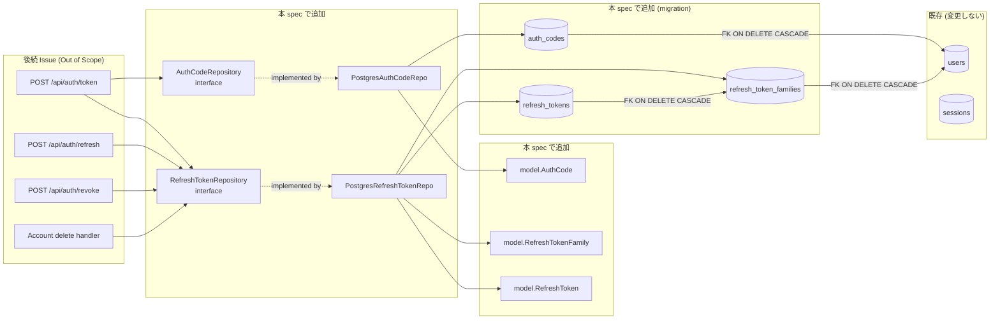

# Design Document

## Overview

**Purpose**: 本 spec は Feedman の Native Auth フロー（親 Issue #163）が必要とする
サーバー側永続化レイヤー（DB スキーマ / ドメインモデル / repository interface +
PostgreSQL 実装）を、後続 Issue #165〜#172 が依存できる粒度で提供する。

**Users**: 後続 Issue を担当する API 開発者（Feedman の Go バックエンド実装者）が、
auth code 発行 / token 交換 / refresh rotation / family revoke / アカウント削除時の
クリーンアップ handler を実装する際に、本 spec で追加された repository interface に
依存する形でビジネスロジックを構築する。

**Impact**: 現状の `internal/repository` は Cookie session 用 `SessionRepository` しか
持たないため、native auth に必要な「使い捨て auth_code」「refresh token family」
「rotation/revocation 状態を持つ refresh_token」を表現できない。本 spec は **既存
Cookie session スキーマ・コードを一切変更せず**、独立した 3 テーブルと 2 つの新規
repository interface を追加することで、native auth 永続化の土台を作る。Bearer-or-
Session middleware / handler 実装は本 spec のスコープ外（Out of Scope）であり、
後続 Issue で追加される。

### Goals

- Native auth 用 3 テーブル（`auth_codes` / `refresh_token_families` / `refresh_tokens`）の
  up/down migration を追加し、適用・ロールバックともに既存スキーマに影響しないこと
- auth_code / refresh_token の本体（平文）を永続化領域・ログ・エラーメッセージのいずれにも
  残さない hash 専用永続化方針を確立すること（NFR 1.1〜1.3）
- 後続 Issue が依存できる **小さく分離された** 2 つの repository interface
  （`AuthCodeRepository` / `RefreshTokenRepository`）を提供すること（Req 4.1, 4.2）
- repository implementation のテストを、既存 `*_db_test.go` 同様にテスト用 PostgreSQL を
  使って正常系・異常系（not-found / 使用済み / 期限切れ / 二重 revoke）の境界値を網羅すること
  （Req 4.4, NFR 3.2）

### Non-Goals

- OAuth callback `flow=native` redirect 実装（Issue #165）
- `POST /api/auth/token` / `POST /api/auth/refresh` / `POST /api/auth/revoke` の handler
  実装（Issue #166 / #167 / #168）
- Bearer-or-Session middleware 導入（Issue #169）
- アカウント削除時の native auth クリーンアップ **呼び出し統合**（Issue #170 — 本 spec は
  ユーザー単位削除の repository 操作のみ提供）
- Native auth endpoint のレート制限・contract テスト整備（Issue #171 / #172）
- Access token（Bearer 本体）の永続化（短命・stateless 想定で対象外）
- 既存 `sessions` テーブル・`SessionRepository` のリファクタや改修
- 後続 Issue で初めて必要になる operation（例: refresh token を「rotated」フラグで
  論理削除する具体的フィールドの handler 側使い方）を本 spec で先取り実装すること
  — interface 上は表現するが、business rule の確定は handler 側 Issue に委ねる

## Architecture

### Existing Architecture Analysis

- 現在の認証永続化は `internal/repository/postgres_session_repo.go` のみで、Cookie
  セッション ID をそのまま PK にして `expires_at` 経過後を不可視にする単純構造
- `users.id` は `UUID PRIMARY KEY DEFAULT gen_random_uuid()`、外部参照はすべて
  `REFERENCES users(id) ON DELETE CASCADE`。本 spec で追加するテーブルも同方針に揃える
- repository 層は `internal/repository/interfaces.go` で interface を集約宣言し、
  実装は `internal/repository/postgres_<entity>_repo.go` に配置、最後に
  `var _ XxxRepository = (*PostgresXxxRepo)(nil)` で compile-time check を入れる
- DB 結合テストは `*_db_test.go` で `TEST_DATABASE_URL` を読み、未設定/接続不可なら
  `t.Skip` する慣習（Issue #100 の経緯）。本 spec の repository test も同パターンに従う
- migration は `internal/database/migrations/<UTC タイムスタンプ>_<slug>.up.sql` /
  `.down.sql` の対称ペアで配置し、`//go:embed migrations/*.sql` により実行ファイルに同梱
- 既存 `model` 型は public フィールドだけの素直な struct（`internal/model/user.go` 参照）

### Architecture Pattern & Boundary Map



**Architecture Integration**:

- 採用パターン: 既存 `internal/repository` の **interface + Postgres 実装 + compile-time
  check** パターンを踏襲（Repository Pattern）。新規アーキテクチャ要素は導入しない
- ドメイン／機能境界:
  - `AuthCodeRepository` … OAuth callback と token endpoint の境界で一度だけ使う「使い捨て」
  - `RefreshTokenRepository` … refresh / revoke / アカウント削除の 3 ハンドラから使う「長期」
  - 2 つを **分離する** ことで Req 4.1（小さく分離された interface）を機械的に満たし、
    後続テストでは必要側のみ mock 差し替え可能
- 既存パターンの維持: `SessionRepository` と同居しつつ干渉しない。FK は全て `users(id)` /
  `refresh_token_families(id)` に対する `ON DELETE CASCADE`（既存テーブル群と同方針）
- 新規コンポーネントの根拠: スキーマ・interface・実装の 3 層は、後続 5+ Issue が安心して
  並行着手できる「形だけ通った最小単位」を提供するために必要

### Technology Stack

| Layer | Choice / Version | Role in Feature | Notes |
|-------|------------------|-----------------|-------|
| Frontend / CLI | — | （本 spec 対象外） | iOS / Web 側の token 利用は後続 Issue |
| Backend / Services | Go 1.25 (既存) | repository interface + impl | 既存 module `github.com/hitoshi/feedman` |
| Data / Storage | PostgreSQL 16 + `lib/pq` v1.11.2 (既存) | 3 新規テーブル | UUID PK + `TIMESTAMPTZ` |
| Hash | `crypto/sha256` (Go 標準) | auth_code / refresh_token の hash 化 | 復号不要・一致比較のみ（NFR 1.3） |
| Messaging / Events | — | 本 spec 対象外 | — |
| Infrastructure / Runtime | golang-migrate v4 (既存) | up/down migration | `//go:embed migrations/*.sql` |

> **Hash 方式の選択**: SHA-256 を選ぶ理由は (1) auth_code / refresh_token はサーバー側で
> ランダム生成する **高エントロピー値**（Issue #163 / 後続 #166 で 256bit 以上の crypto/rand
> 由来を想定）であり、password と異なりブルートフォース耐性のための work factor は不要、
> (2) DB index で部分一致検索なしの一致比較のみに使う、(3) Go 標準ライブラリで追加依存ゼロ、
> の 3 点（NFR 1.3）。代替案として bcrypt / argon2id は password 向けの slow hash であり、
> auth コード検証経路の latency を増やすデメリットが上回るため不採用。

## File Structure Plan

### Directory Structure

```
internal/
├── database/
│   └── migrations/
│       ├── 20260609120000_add_native_auth_tables.up.sql       # 新規: 3 テーブル DDL
│       └── 20260609120000_add_native_auth_tables.down.sql     # 新規: 3 テーブル DROP
├── model/
│   ├── auth_code.go                                            # 新規: model.AuthCode
│   └── refresh_token.go                                        # 新規: model.RefreshTokenFamily / model.RefreshToken
└── repository/
    ├── interfaces.go                                           # 既存: AuthCodeRepository / RefreshTokenRepository 追加
    ├── postgres_auth_code_repo.go                              # 新規: PostgresAuthCodeRepo
    ├── postgres_auth_code_repo_db_test.go                      # 新規: 結合テスト（TEST_DATABASE_URL）
    ├── postgres_refresh_token_repo.go                          # 新規: PostgresRefreshTokenRepo
    └── postgres_refresh_token_repo_db_test.go                  # 新規: 結合テスト（TEST_DATABASE_URL）
```

### Modified Files

- `internal/repository/interfaces.go` — `AuthCodeRepository` / `RefreshTokenRepository`
  interface 定義の追加のみ。既存 interface 群（`UserRepository` / `SessionRepository`
  ほか）は変更しない
- migration ファイル名のタイムスタンプ部分（`20260609120000`）は最新 commit 日時を
  基準に PR 作成時の値で確定する（既存 migration の昇順を破らないこと）

### 既存ファイルに対する非変更ポリシー

- `internal/database/migrations/20260227120000_initial_schema.up.sql` / `.down.sql` は
  **変更しない**（NFR 2.1）
- `internal/repository/postgres_session_repo.go` および `SessionRepository` interface は
  **変更しない**（NFR 2.1 / 2.2）
- `internal/model/user.go` の `Session` 型は **変更しない**

## Requirements Traceability

| Requirement | Summary | Components | Interfaces | Flows |
|-------------|---------|------------|------------|-------|
| 1.1 | auth_code 領域作成 | Migration up | — | up migration |
| 1.2 | refresh_token_families 領域作成 | Migration up | — | up migration |
| 1.3 | refresh_tokens 領域作成 | Migration up | — | up migration |
| 1.4 | down で本 spec 追加分のみ削除 | Migration down | — | down migration |
| 1.5 | 既存スキーマを変更しない | Migration up/down | — | — |
| 2.1 | auth_code は hash のみ保存 | PostgresAuthCodeRepo | AuthCodeRepository.Create | Create flow |
| 2.2 | user_id / S256 / expires / used を保存 | model.AuthCode + Schema | AuthCodeRepository.Create | Create flow |
| 2.3 | 有効期限を呼び出し側から受け取る | model.AuthCode.ExpiresAt | AuthCodeRepository.Create | Create flow |
| 2.4 | hash 参照で 1 件 or not-found | PostgresAuthCodeRepo | AuthCodeRepository.FindByHash | Lookup flow |
| 2.5 | 使用済み確定 | PostgresAuthCodeRepo | AuthCodeRepository.MarkUsed | Single-use flow |
| 2.6 | 使用済み / 期限切れの再確定を拒否 | PostgresAuthCodeRepo | AuthCodeRepository.MarkUsed | Single-use flow |
| 2.7 | 平文を残さない | 全層 | — | NFR 1.1, 1.2 |
| 3.1 | refresh_token は hash のみ保存 | PostgresRefreshTokenRepo | RefreshTokenRepository.CreateToken | Issue flow |
| 3.2 | family/user/expiry/rotation/revoke 保存 | model.RefreshToken + Schema | CreateFamily / CreateToken | Issue flow |
| 3.3 | rotation 状態の識別 | PostgresRefreshTokenRepo | MarkRotated / FindByHash | Rotation flow |
| 3.4 | family 単位 revoke | PostgresRefreshTokenRepo | RevokeFamily | Revoke flow |
| 3.5 | hash 参照で 1 件 or not-found | PostgresRefreshTokenRepo | FindByHash | Lookup flow |
| 3.6 | user 単位削除 | PostgresRefreshTokenRepo | DeleteByUserID | Cascade flow |
| 3.7 | 平文を残さない | 全層 | — | NFR 1.1, 1.2 |
| 4.1 | 2 interface に分離 | interfaces.go | AuthCodeRepository / RefreshTokenRepository | — |
| 4.2 | 本 spec 要件に該当する操作のみ | interfaces.go | 両 interface | — |
| 4.3 | テスト差し替え可能 | interfaces.go | — | mock 容易性 |
| 4.4 | repository test の網羅 | *_db_test.go | — | テスト戦略 |
| NFR 1.1 | 平文の永続化禁止 | model + repo | — | hash-only |
| NFR 1.2 | 平文のログ/エラー混入禁止 | repo | — | error wrap 方針 |
| NFR 1.3 | 復号化処理を導入しない | repo | — | SHA-256 採用根拠 |
| NFR 2.1 | 既存テーブル非変更 | Migration | — | — |
| NFR 2.2 | Cookie session フローを 100% 維持 | — | — | 既存テスト維持で担保 |
| NFR 3.1 | 外部 NW 依存なし | *_db_test.go | — | TEST_DATABASE_URL 経由のみ |
| NFR 3.2 | 正常系 + 異常系を境界値で網羅 | *_db_test.go | — | テスト戦略 |

## Components and Interfaces

### Data Layer (Migration)

#### Migration: `add_native_auth_tables`

| Field | Detail |
|-------|--------|
| Intent | Native auth 用 3 テーブルを追加 |
| Requirements | 1.1, 1.2, 1.3, 1.4, 1.5, NFR 2.1, NFR 2.2 |

**Responsibilities & Constraints**
- up: `auth_codes` / `refresh_token_families` / `refresh_tokens` を順に CREATE
- down: 上記 3 テーブルを **本 spec で追加した順の逆順** で DROP（FK 依存を尊重して
  `refresh_tokens` → `refresh_token_families` → `auth_codes` の順）
- 既存テーブル（`users` / `sessions` ほか）には `ALTER`/`DROP`/`CREATE INDEX` を実行しない
- 既存 down migration（`20260227120000_initial_schema.down.sql`）の挙動を変更しない

**Dependencies**
- Inbound: `internal/database/migrate.go` の `RunMigrations`（既存。embed 経由で自動検出）
- Outbound: `users` テーブル（`UUID PRIMARY KEY`）への FK
- External: PostgreSQL 16, `pgcrypto`（既存 migration で有効化済 — `gen_random_uuid()` 使用可）

**Contracts**: API [ ] / Service [ ] / Event [ ] / Batch [ ] / State [x]

### Model Layer

#### model.AuthCode

| Field | Detail |
|-------|--------|
| Intent | 一時 auth_code の hash・PKCE challenge・TTL・single-use 状態を持つ |
| Requirements | 2.1, 2.2, 2.3, 2.5 |

**Responsibilities & Constraints**
- `CodeHash` は SHA-256 のバイト列 / 16 進文字列のいずれか（実装で確定。design では
  「SHA-256 由来の固定長 hash 文字列」と規定し、保存/比較の双方を同一の正規化形で行う）
- 平文 `code` 自体は struct に含めない（NFR 1.1 / 1.2）
- `Used` は単純な bool。「過去に確定された使用」を意味し、`MarkUsed` で false → true へ
  単調遷移する
- `ExpiresAt` は呼び出し側から渡された絶対時刻（UTC）。本 model は 60 秒 TTL の計算を
  含まない（Req 2.3 / handler 側に委ねる）

**Contracts**: State [x]

##### Struct Sketch

```go
package model

import "time"

// AuthCode は native auth の使い捨て認可コード状態を表す。
// 平文の code はサーバー側で生成され、本構造体には絶対に保持しない（NFR 1.1）。
type AuthCode struct {
    ID            string    // UUID
    CodeHash      string    // SHA-256 hex（lowercase, 固定長）
    UserID        string    // users.id への FK
    PKCEChallenge string    // S256 challenge（生文字列。client が送る base64url 値）
    ExpiresAt     time.Time // 呼び出し側から渡された絶対時刻
    Used          bool      // true なら確定済み（単回利用後）
    CreatedAt     time.Time
}
```

#### model.RefreshTokenFamily

| Field | Detail |
|-------|--------|
| Intent | refresh token の rotation chain を束ねる family 単位 |
| Requirements | 3.2, 3.4 |

**Responsibilities & Constraints**
- family ID は UUID。`refresh_tokens.family_id` の FK ターゲット
- `RevokedAt` が non-NULL なら family 全体が revoke 済みとみなす
- `UserID` を持つことでアカウント削除時の一括削除（Req 3.6）を簡潔に表現

**Contracts**: State [x]

##### Struct Sketch

```go
package model

import "time"

// RefreshTokenFamily は同一 refresh chain（rotation 系列）の束。
type RefreshTokenFamily struct {
    ID        string
    UserID    string
    CreatedAt time.Time
    RevokedAt *time.Time // family 単位 revoke 用（nil なら有効）
}
```

#### model.RefreshToken

| Field | Detail |
|-------|--------|
| Intent | rotation 単位の refresh token。hash 保存 + rotation/revocation メタを持つ |
| Requirements | 3.1, 3.2, 3.3 |

**Responsibilities & Constraints**
- `TokenHash` は SHA-256 由来の固定長文字列。平文 token は保持しない
- `RotatedAt` は当該 token が次の token に rotation された時刻。non-NULL なら「直前の token」
  として扱われる（Req 3.3 で求められる「rotation 済み識別」を表現）
- `RevokedAt` は token 単位の revoke 時刻。family 単位 revoke でも本フィールドを set する
  実装にする（query が単純になる）。`RevokedAt` non-NULL なら使用不可

**Contracts**: State [x]

##### Struct Sketch

```go
package model

import "time"

// RefreshToken は rotation の各世代の refresh token を表す。
type RefreshToken struct {
    ID        string
    FamilyID  string
    UserID    string
    TokenHash string
    ExpiresAt time.Time
    RotatedAt *time.Time // 次の token に rotate された時刻（nil なら最新世代）
    RevokedAt *time.Time // revoke 時刻（nil なら有効）
    CreatedAt time.Time
}
```

### Repository Layer

#### AuthCodeRepository (interface)

| Field | Detail |
|-------|--------|
| Intent | auth_code の保存 / hash 参照 / 単回利用確定を最小操作で公開する |
| Requirements | 2.1, 2.4, 2.5, 2.6, 4.1, 4.2, 4.3 |

**Responsibilities & Constraints**
- 主責務: auth_code の lifecycle（create → find → mark-used）のみ
- ドメイン境界: token endpoint の境界以外から参照しない
- データ所有権: `auth_codes` テーブルのみ。他テーブルへの ALTER は行わない
- invariants:
  - 同一 hash が同時に複数行存在しない（一意制約）
  - `Used = true` に遷移したら以降 false へ戻らない（単調）
  - 期限切れ / 既使用の `MarkUsed` は失敗（Req 2.6）

**Dependencies**
- Inbound: 後続 Issue #166 (token endpoint)（Critical）
- Outbound: PostgreSQL `auth_codes` テーブル（Critical）
- External: なし

**Contracts**: Service [x] / API [ ] / Event [ ] / Batch [ ] / State [x]

##### Service Interface

```go
// AuthCodeRepository は native auth の一時認可コード永続化操作を公開する。
type AuthCodeRepository interface {
    // Create は AuthCode を新規保存する。
    // code.CodeHash / code.UserID / code.PKCEChallenge / code.ExpiresAt は
    // 呼び出し側で確定済みであること（Req 2.3）。
    Create(ctx context.Context, code *model.AuthCode) error

    // FindByHash は code_hash に一致する未削除レコードを 1 件返す。
    // 見つからない場合は (nil, nil) を返す（既存 FindByID パターンに整合）。
    FindByHash(ctx context.Context, codeHash string) (*model.AuthCode, error)

    // MarkUsed は当該 ID の auth_code を used = true に遷移させる。
    // 当該レコードが 1) 既に used = true, 2) expires_at <= now() のいずれかの場合は
    // ErrAuthCodeNotUsable（または相当の sentinel error）を返し、永続化状態は変更しない。
    MarkUsed(ctx context.Context, id string) error
}
```

- Preconditions: `Create` 引数の `CodeHash` は SHA-256 由来の固定長文字列であること
- Postconditions: `MarkUsed` 成功後は同一 ID への再 `MarkUsed` が必ず失敗する
- Invariants: 平文 `code` は引数にも戻り値にも一切含まれない

#### RefreshTokenRepository (interface)

| Field | Detail |
|-------|--------|
| Intent | refresh family / token 単位の保存 / rotation / revoke / user 削除を公開する |
| Requirements | 3.1, 3.2, 3.3, 3.4, 3.5, 3.6, 4.1, 4.2, 4.3 |

**Responsibilities & Constraints**
- 主責務: refresh family + token の lifecycle（family create / token create /
  find / mark-rotated / revoke-family / delete-by-user）
- ドメイン境界: refresh / revoke / account-delete の 3 経路でのみ参照
- データ所有権: `refresh_token_families` / `refresh_tokens` 両テーブル
- トランザクションスコープ:
  - **rotation 時に「直前 token を rotated とマーク + 新 token を create」を同一 tx で
    完結させる必要があるが**、その business orchestration は後続 Issue #167 の領分。
    本 spec の repository は **operation 単位のメソッドを提供**するに留め、tx の境界
    決定は呼び出し側（後続 Issue の handler/service）に委ねる
  - 本 spec の Postgres 実装は 1 メソッド 1 SQL を基本とし、tx を要する操作は提供しない
- invariants:
  - 同一 `token_hash` が同時に複数行存在しない（部分 unique index）
  - family の `revoked_at` set 後は当該 family の全 token が論理的に使用不可

**Dependencies**
- Inbound: 後続 Issue #166 / #167 / #168 / #170（Critical）
- Outbound: PostgreSQL `refresh_token_families` / `refresh_tokens`（Critical）
- External: なし

**Contracts**: Service [x] / API [ ] / Event [ ] / Batch [ ] / State [x]

##### Service Interface

```go
// RefreshTokenRepository は native auth の refresh token / family 永続化操作を公開する。
type RefreshTokenRepository interface {
    // CreateFamily は新規 family を保存する。token 発行の前に呼ぶ。
    CreateFamily(ctx context.Context, family *model.RefreshTokenFamily) error

    // CreateToken は family に属する refresh token を保存する。
    // token.TokenHash / FamilyID / UserID / ExpiresAt は呼び出し側で確定済みであること。
    CreateToken(ctx context.Context, token *model.RefreshToken) error

    // FindByHash は token_hash に一致する 1 件を返す。
    // 見つからない場合は (nil, nil) を返す。
    // 戻り値の token が RotatedAt / RevokedAt を持つかは呼び出し側で判定する。
    FindByHash(ctx context.Context, tokenHash string) (*model.RefreshToken, error)

    // MarkRotated は当該 ID の refresh_token の rotated_at を set する。
    // 既に rotated_at が set 済みの場合は ErrRefreshTokenAlreadyRotated を返す。
    MarkRotated(ctx context.Context, id string, rotatedAt time.Time) error

    // RevokeFamily は当該 family を revoked にし、family 配下の全 token の revoked_at を
    // 一括で set する。当該 family が既に revoked の場合は冪等に成功する（二重 revoke 安全）。
    RevokeFamily(ctx context.Context, familyID string, revokedAt time.Time) error

    // DeleteByUserID は当該ユーザーに属する全ての refresh_token と family を削除する。
    // FK ON DELETE CASCADE で users 削除時にも到達するが、明示的削除経路も提供する（Req 3.6）。
    DeleteByUserID(ctx context.Context, userID string) error
}
```

- Preconditions: `CreateToken` 呼び出し時点で `FamilyID` は既存 family を指していること
- Postconditions:
  - `RevokeFamily` 成功後、当該 family 配下の全 token の `RevokedAt` が non-NULL
  - `DeleteByUserID` 成功後、当該ユーザーの family / token は 0 件
- Invariants: 平文 `token` は引数にも戻り値にも含まれない

#### PostgresAuthCodeRepo (implementation)

| Field | Detail |
|-------|--------|
| Intent | `AuthCodeRepository` の PostgreSQL 実装 |
| Requirements | 2.1, 2.4, 2.5, 2.6 |

**Responsibilities & Constraints**
- 既存 `PostgresSessionRepo` と同じ構成（`*sql.DB` を field に持ち、`New...` で構築）
- compile-time check: `var _ AuthCodeRepository = (*PostgresAuthCodeRepo)(nil)`
- `MarkUsed` は `UPDATE auth_codes SET used = true WHERE id = $1 AND used = false AND
  expires_at > now()` で `RowsAffected = 0` の場合に sentinel error を返す（race 安全）
- エラーメッセージに `code_hash` の値や平文を含めない（NFR 1.2）

#### PostgresRefreshTokenRepo (implementation)

| Field | Detail |
|-------|--------|
| Intent | `RefreshTokenRepository` の PostgreSQL 実装 |
| Requirements | 3.1〜3.6 |

**Responsibilities & Constraints**
- compile-time check: `var _ RefreshTokenRepository = (*PostgresRefreshTokenRepo)(nil)`
- `MarkRotated` は `UPDATE refresh_tokens SET rotated_at = $1 WHERE id = $2 AND
  rotated_at IS NULL` で `RowsAffected = 0` の場合に sentinel error
- `RevokeFamily` は同一 method 内で 2 つの UPDATE を実行（`refresh_token_families` の
  `revoked_at` set + `refresh_tokens` の family_id 一致行の `revoked_at` set）。`*sql.DB`
  上で実行し、外側で tx 化は呼び出し側に委ねる（本実装はベストエフォート冪等）
- `DeleteByUserID` は `refresh_tokens` → `refresh_token_families` の順で DELETE
  （FK 順序を尊重）。あるいは FK `refresh_tokens.family_id ON DELETE CASCADE` を使い
  family 削除 1 文で済ませてもよい（後者の方が単純なので本 spec は後者を採用）

### Sentinel Errors

本 spec の repository は以下 sentinel error を `internal/repository` パッケージに公開する
（既存 `errors.go` 型ではなく、`var ErrXxx = errors.New(...)` 形式で十分。後続 handler 側は
`errors.Is` で判別する）:

- `ErrAuthCodeNotUsable` — `MarkUsed` 対象が not-found / 期限切れ / 既使用のいずれか
- `ErrRefreshTokenAlreadyRotated` — `MarkRotated` 対象が既に rotated

エラーメッセージは「auth_code is not usable」「refresh_token already rotated」のような
**機密値を含まない一般的な文言**に統一する（NFR 1.2）。具体的にどのレコードがどの状態に
あったかの追加情報はログにも出さない。

## Data Models

### Domain Model

- アグリゲート境界:
  - **AuthCode** … 単一エンティティ（family なし）
  - **RefreshTokenFamily** … aggregate root。`RefreshToken` は family に属する子エンティティ
- トランザクション境界: 本 spec の repository は 1 メソッド 1 SQL を基本とし、複数操作の
  atomic 性が必要な orchestration（rotation = 旧 token rotate + 新 token create）は
  呼び出し側に委ねる
- ドメインイベント: 本 spec では発火しない（純粋な永続化レイヤー）

### Physical Data Model

#### `auth_codes`

| Column | Type | Constraint | Notes |
|--------|------|------------|-------|
| `id` | `UUID` | `PRIMARY KEY DEFAULT gen_random_uuid()` | |
| `code_hash` | `VARCHAR(128) NOT NULL` | `UNIQUE` | SHA-256 hex（64 文字）。将来 hash 強化に備え 128 を確保 |
| `user_id` | `UUID NOT NULL` | `REFERENCES users(id) ON DELETE CASCADE` | アカウント削除時に自動清掃 |
| `pkce_challenge` | `VARCHAR(255) NOT NULL` | — | S256 base64url 値 |
| `expires_at` | `TIMESTAMPTZ NOT NULL` | — | 呼び出し側から渡された絶対時刻 |
| `used` | `BOOLEAN NOT NULL DEFAULT false` | — | 単回利用フラグ |
| `created_at` | `TIMESTAMPTZ NOT NULL DEFAULT now()` | — | |

Indexes:

- `UNIQUE (code_hash)` — 1 件参照を保証
- `INDEX idx_auth_codes_user_id (user_id)` — user 単位の運用調査用（cascade 削除自体は FK で十分）
- `INDEX idx_auth_codes_expires_at (expires_at)` — 期限切れの掃除運用用（将来）

#### `refresh_token_families`

| Column | Type | Constraint | Notes |
|--------|------|------------|-------|
| `id` | `UUID` | `PRIMARY KEY DEFAULT gen_random_uuid()` | |
| `user_id` | `UUID NOT NULL` | `REFERENCES users(id) ON DELETE CASCADE` | アカウント削除時 cascade |
| `created_at` | `TIMESTAMPTZ NOT NULL DEFAULT now()` | — | |
| `revoked_at` | `TIMESTAMPTZ` | — | NULL = 有効 / non-NULL = revoke 済み |

Indexes:

- `INDEX idx_refresh_token_families_user_id (user_id)` — user 単位削除・調査用

#### `refresh_tokens`

| Column | Type | Constraint | Notes |
|--------|------|------------|-------|
| `id` | `UUID` | `PRIMARY KEY DEFAULT gen_random_uuid()` | |
| `family_id` | `UUID NOT NULL` | `REFERENCES refresh_token_families(id) ON DELETE CASCADE` | family 削除で cascade |
| `user_id` | `UUID NOT NULL` | `REFERENCES users(id) ON DELETE CASCADE` | 直接 user FK も持たせて DeleteByUserID 経路を簡潔化 |
| `token_hash` | `VARCHAR(128) NOT NULL` | `UNIQUE` | SHA-256 hex |
| `expires_at` | `TIMESTAMPTZ NOT NULL` | — | |
| `rotated_at` | `TIMESTAMPTZ` | — | NULL = 最新世代 / non-NULL = rotated |
| `revoked_at` | `TIMESTAMPTZ` | — | NULL = 有効 |
| `created_at` | `TIMESTAMPTZ NOT NULL DEFAULT now()` | — | |

Indexes:

- `UNIQUE (token_hash)` — 1 件参照
- `INDEX idx_refresh_tokens_family_id (family_id)` — family revoke 経路
- `INDEX idx_refresh_tokens_user_id (user_id)` — DeleteByUserID 経路

**FK 設計の意図**: `refresh_tokens.user_id` を直接持つ重複は冗長に見えるが、
(1) `DeleteByUserID` 実装が `WHERE user_id = $1` 1 文で済む（family JOIN 不要）、
(2) 運用調査時に user 単位の token 数を即座に集計できる、の 2 点で採用。FK は user と family の
両方を持ち、users 削除時の cascade と family 削除時の cascade のいずれでも到達する。

## Error Handling

### Error Strategy

- repository 層の通常エラーは既存規約どおり `fmt.Errorf("...: %w", err)` で wrap し、
  原因 `error` を保持する
- 業務的に「成功させない」遷移（auth_code not usable / refresh_token already rotated）は
  **sentinel error**（`errors.New` 由来）で表現し、handler 層が `errors.Is` で判別できる
  ようにする
- not-found は `(nil, nil)` 返却で表現（既存 `FindByID` / `FindByHash` 系のパターンを踏襲）

### Error Categories and Responses

- **User Errors (4xx)**: 本 spec の repository 層では発生しない（handler 側で sentinel error
  を 401 等にマッピング）
- **System Errors (5xx)**: DB エラーは wrap して上位へ。message に hash 値・平文・SQL の
  バインド変数を含めない（NFR 1.2）
- **Business Logic Errors (422)**: `ErrAuthCodeNotUsable` / `ErrRefreshTokenAlreadyRotated` を
  sentinel として export。handler 側は `errors.Is(err, repository.ErrAuthCodeNotUsable)` で
  判別し、適切な HTTP ステータス（後続 Issue で確定）に変換

### Logging Policy

- `code_hash` / `token_hash` 自体は機密値ではない（hash 済み）が、混乱を避けるため
  ログ出力では truncate（先頭 8 文字 + `...`）するか、`id`（UUID）のみで参照する運用を
  本 spec の例示として記述する。実装は後続 Issue が log を出す段階で正式採用する
- 本 spec の repository コードは新規 log 出力を一切追加しない（library-level の沈黙）

## Testing Strategy

### Unit Tests（pure logic）

`internal/model/auth_code.go` / `refresh_token.go` は単純 struct で pure ロジックは持たない
ため、unit test は最小限（interface 満足の compile-time check + struct field の zero-value
確認程度）に留める:

1. `TestPostgresAuthCodeRepo_ImplementsInterface` — `var _ AuthCodeRepository = (*PostgresAuthCodeRepo)(nil)`
2. `TestPostgresRefreshTokenRepo_ImplementsInterface` — 同上
3. `TestNewPostgresAuthCodeRepo_Initializes` — nil DB で構造体が初期化される
4. `TestNewPostgresRefreshTokenRepo_Initializes` — 同上
5. `TestSentinelErrors_AreDistinct` — `ErrAuthCodeNotUsable` と `ErrRefreshTokenAlreadyRotated`
   が `errors.Is` で互いに区別される

### Integration Tests (`*_db_test.go`、TEST_DATABASE_URL 経由)

既存 `postgres_subscription_repo_db_test.go` と同じ setup パターンに従い、
DB 接続不可なら `t.Skip` で逃げる（Req NFR 3.1）。

**AuthCodeRepo (`postgres_auth_code_repo_db_test.go`)**:

1. `Create` → `FindByHash` で同値が返り、`code_hash` でしかヒットしない（正常系、Req 2.1, 2.4）
2. 存在しない hash で `FindByHash` が `(nil, nil)` を返す（異常系 not-found、Req 2.4）
3. `MarkUsed` が一度成功し、二度目で `ErrAuthCodeNotUsable` を返す（境界、Req 2.5, 2.6）
4. `expires_at` を過去にした auth_code に `MarkUsed` すると `ErrAuthCodeNotUsable`（境界、Req 2.6）
5. `DELETE FROM users WHERE id = $userID` 後に `auth_codes` 行が cascade 削除される
   （Req 1.5 / NFR 2.1 の cascade 確認、Req 3.6 と同系統の cascade テスト）

**RefreshTokenRepo (`postgres_refresh_token_repo_db_test.go`)**:

1. `CreateFamily` + `CreateToken` + `FindByHash` で同値復元（正常系、Req 3.1, 3.5）
2. `MarkRotated` 成功 → 同一 ID で再呼び出しが `ErrRefreshTokenAlreadyRotated`（境界、Req 3.3）
3. `RevokeFamily` 後、配下の全 token の `revoked_at` が non-NULL（Req 3.4）
4. `RevokeFamily` 二重呼び出しが冪等に成功（境界、二重 revoke 安全）
5. `DeleteByUserID` 後、当該ユーザーの token・family が 0 件、他ユーザーには影響なし（Req 3.6）
6. 存在しない hash で `FindByHash` が `(nil, nil)`（異常系 not-found、Req 3.5）

### Migration Tests

7. `internal/database/migrate_test.go` 同様、up → down → up のラウンドトリップが成功し、
   既存テーブル（`users` / `sessions` / `feeds` 等）が存在し続けることを確認（Req 1.4, 1.5,
   NFR 2.1）。既存 `migrate_test.go` がカバーしている場合は新規 migration が追加された
   状態でも同テストが pass することを CI で担保すれば十分

### E2E / Performance

本 spec は永続化レイヤーのみで E2E / Performance テストは対象外。後続 Issue の
endpoint 実装時に追加される。

### Security Tests

- repository test 中で `code_hash` / `token_hash` 列に平文 `"plain-code-12345"` 等が
  **絶対に保存されていない** ことを `SELECT code_hash FROM auth_codes WHERE code_hash = $1`
  で逆引きできない（plain 値で検索しても 0 件）形で確認する 1 ケース（NFR 1.1 の回帰検出）

## Security Considerations

- **Hash 強度**: SHA-256 は 256bit 出力で、サーバー生成の高エントロピー入力（256bit
  crypto/rand）に対して collision/preimage 攻撃の脅威は事実上ゼロ
- **Timing attack**: hash 一致比較は DB の `WHERE token_hash = $1`（B-tree index）で行う。
  Go プロセス内での bytes 比較ではないため、constant-time 比較の追加は本 spec では不要
- **Salt の不要性**: password と異なり、auth_code / refresh_token は一意かつ高エントロピーの
  random 値であり、複数 user 間で同一平文が衝突する確率は無視できる。salt なしで運用する
- **平文混入経路の遮断**:
  - struct field に `Code`/`Token`（平文）を持たない
  - repository メソッド引数・戻り値に平文を受け取らない
  - error.Error() / log message に hash 値以外の機密情報を含めない（NFR 1.2）

## 参考実装の対応関係

- `internal/repository/postgres_session_repo.go` … 構造の手本（DB field + New + 4 method
  + compile-time check）
- `internal/repository/postgres_subscription_repo_db_test.go` … `*_db_test.go` の setup pattern
- `internal/database/migrations/20260528130000_add_user_cross_feed_views.up.sql` … 追加
  migration の書式手本
