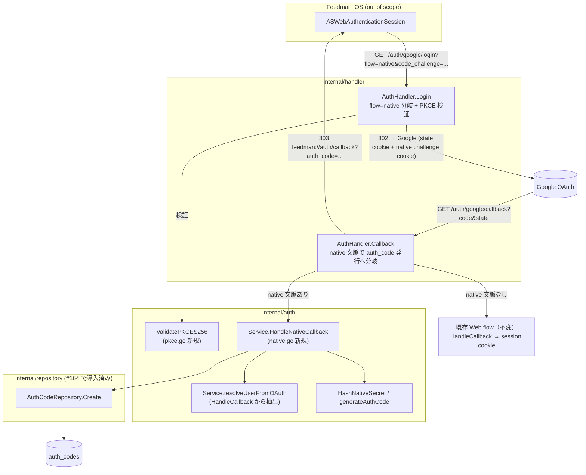

# Design Document

## Overview

**Purpose**: 本 spec は Feedman の Google OAuth login / callback に `flow=native` 分岐を追加し、
iOS アプリ（親 Issue #163）が PKCE S256 challenge 付きでログインを開始し、OAuth 完了後に
アプリスキーム `feedman://auth/callback?auth_code=<one-time-code>` で短命・単回利用の
`auth_code` を受け取れるようにする。

**Users**: Feedman iOS アプリが `ASWebAuthenticationSession` 経由で native flow を利用する。
既存 Web ユーザーは従来どおり Cookie セッションでログインする（挙動不変）。

**Impact**: 既存の `AuthHandler.Login` / `AuthHandler.Callback` に native 分岐を追加し、
`auth.Service` に「セッションを発行せず `auth_code` を発行する」callback 処理を追加する。
永続化は Issue #164 で導入済みの `AuthCodeRepository`（`auth_codes` テーブル）をそのまま
利用し、**新規 migration・新規テーブルは追加しない**。`flow=native` を伴わないリクエストの
応答（ステータス・リダイレクト先・Cookie 発行）は 100% 不変とする。

### Goals

- `flow=native` + PKCE S256 パラメータ検証付きのログイン開始と、OAuth round-trip をまたぐ
  native flow 文脈（PKCE challenge）の保持（Req 1）
- callback 成功時の `auth_code` 発行（60 秒 TTL・単回利用前提・hash 保存）と
  `feedman://auth/callback` への 303 リダイレクト（Req 2）
- state 検証・native 文脈の単回破棄・Web flow への安全なフォールバック（Req 3）
- 既存 Web flow の完全な後方互換（Req 4 / NFR 2.1）

### Non-Goals

- `POST /api/auth/token`（auth_code → Bearer 交換、PKCE verifier 検証）— Issue #166
- refresh token 発行・rotation・再利用検知 — Issue #167 / #168
- Bearer-or-Session middleware — Issue #169
- 退会時 cleanup — Issue #170、IP レート制限 — Issue #171、contract tests — Issue #172
- 期限切れ `auth_codes` レコードの定期削除 worker（TTL・単回利用は #164 の
  `MarkUsed` 判定で担保済み。掃除は将来の運用 Issue）
- アプリスキームの設定化（Issue 仮案どおり固定値）

## Architecture Pattern & Boundary Map

既存の handler → service → repository → model の一方向依存に従い、native 分岐を
**既存メソッドの前段分岐**として追加する（既存パスのコードは移動しない）。



### Native flow 文脈の伝搬方式（設計判断）

OAuth round-trip（login → Google → callback）をまたいで「native flow であること」と
「PKCE challenge」を伝える必要がある。**既存の `oauth_state` Cookie と同じ
HttpOnly Cookie 方式**を採用する:

| 候補 | 採否 | 理由 |
|---|---|---|
| HttpOnly Cookie（採用） | ✅ | 既存 `oauth_state` と同一パターン（SameSite=Lax は Google からの top-level GET リダイレクトで送信される実績あり）。サーバー側状態が不要 |
| state 値をキーに DB 保存 | ❌ | OAuth round-trip のためだけに新規テーブル/列が必要。#164 のスキーマに手を入れる必要があり過剰 |
| state 値に challenge を埋め込む | ❌ | 既存 state 生成・定数時間比較ロジックの変更が必要で、Web flow の後方互換リスクが上がる |

- Cookie 名: `oauth_native_challenge`、値: `code_challenge`（クライアントが送る base64url 値
  そのもの。秘密情報ではない）、`MaxAge: 600`（`oauth_state` と同じ）、HttpOnly、
  SameSite=Lax、Secure は既存設定（`config.CookieSecure`）に従う
- callback では state 検証通過後に native cookie を読み、**読んだら成否に関わらず削除**する
  （単回性、Req 3.3）
- cookie 不在 → Web flow として処理（Req 3.2 の fail-safe。`ASWebAuthenticationSession` の
  Cookie が失われた場合、Web リダイレクトに落ちてアプリ側でログイン失敗となるだけで
  セッション漏えいは起きない — エフェメラルなブラウザ文脈に閉じる）
- cookie は存在するが challenge 形式が不正（改ざん等）→ 安全なエラー（400）で拒否し、
  不正値を `auth_codes` に保存しない（defensive、Req 1.4 と同じ検証関数を再利用）

## Technology Stack

| レイヤ | 技術 | 備考 |
|---|---|---|
| HTTP handler | net/http + chi/v5（既存） | ルーティング変更なし（既存 `/auth/google/*` のまま） |
| PKCE 検証 | 標準 regexp / strings | RFC 7636 §4.2: S256 challenge = base64url no-pad 43 文字 |
| auth_code 生成 | crypto/rand 32 byte + base64.RawURLEncoding | 256bit エントロピー（NFR 1.1）、URL-safe 43 文字 |
| auth_code hash | crypto/sha256 → hex lowercase | #164 `model.AuthCode.CodeHash` の規約に整合 |
| 永続化 | `repository.AuthCodeRepository`（#164 導入済み） | 新規 migration なし |
| テスト | 標準 testing + httptest | OAuth provider はモック（NFR 3.1） |

## File Structure Plan

```
internal/
├── auth/
│   ├── pkce.go               # 新規: ValidatePKCES256（method/challenge 形式検証の純粋関数）
│   ├── pkce_test.go          # 新規: 検証の table-driven test
│   ├── native.go             # 新規: Service.HandleNativeCallback / HashNativeSecret /
│   │                         #       generateAuthCode / NativeAuthCodeTTL / AuthCodeCreator IF
│   ├── native_test.go        # 新規: HandleNativeCallback の unit test（mock repo / mock OAuth）
│   ├── service.go            # 変更: HandleCallback からユーザー解決を resolveUserFromOAuth に
│   │                         #       抽出（挙動不変）。NewService に AuthCodeCreator を追加
│   └── service_test.go       # 変更: NewService 呼び出し箇所の引数追従（挙動検証は不変）
├── handler/
│   ├── auth_handler.go       # 変更: Login の flow=native 分岐 / Callback の native 分岐
│   ├── auth_handler_test.go  # 変更: native ケース（成功 / PKCE 欠落・不正 / state 不正 /
│   │                         #       web 互換 / 残存 cookie 破棄）を追加
│   └── integration_test.go   # 変更: native flow の handler 統合ケースを 1 本追加
└── app/
    └── app.go                # 変更: PostgresAuthCodeRepo を生成し auth.NewService へ注入
```

## Requirements Traceability

| Req | 設計要素 |
|---|---|
| 1.1 | `AuthHandler.Login` native 分岐（state cookie + `oauth_native_challenge` cookie 設定 → OAuth redirect） |
| 1.2, 1.3, 1.4 | `auth.ValidatePKCES256`（pkce.go）+ Login での 400 応答（入力値を反射しない固定メッセージ） |
| 1.5 | Login の web パス（既存コード不変。native 分岐は early-branch） |
| 1.6 | Login web パスでの残存 `oauth_native_challenge` cookie 条件付き削除 |
| 2.1 | `Callback` native 分岐 → `HandleNativeCallback` → 303 `feedman://auth/callback?auth_code=...` |
| 2.2 | `native.go`: `NativeAuthCodeTTL = 60s`、`model.AuthCode{CodeHash, UserID, PKCEChallenge, ExpiresAt}` を `AuthCodeRepository.Create` で保存 |
| 2.3 | native 分岐は `createSession` / session cookie 設定経路を通らない（early return） |
| 2.4 | `resolveUserFromOAuth`（HandleCallback と共通の抽出メソッド） |
| 2.5 | 平文 code は戻り値のみ。ログは `slog` に hash 先頭 8 文字のみ（既存 `hashSessionIDForLog` 方針） |
| 3.1 | 既存 state 検証（定数時間比較）が native 分岐より前に位置する（コード順序で担保） |
| 3.2 | native cookie 不在 → 既存 web パスへ fallthrough |
| 3.3 | callback 冒頭で native cookie を読み取り後、無条件に削除 Set-Cookie を発行 |
| 3.4 | `HandleNativeCallback` エラー時に 500 固定メッセージ（"authentication failed"、既存と同形） |
| 4.1, 4.2 | web パスのコード・応答を変更しない（native は分岐追加のみ）。既存テストが回帰検証 |
| NFR 1.1 | `generateAuthCode`: crypto/rand 32 byte（256bit） |
| NFR 1.2 | `ValidatePKCES256` が method == "S256" を厳密一致で要求 |
| NFR 1.3 | 4xx/5xx 応答は固定文字列（入力反射なし） |
| NFR 2.1 | native 分岐は `flow=native` または native cookie 存在時のみ作動。条件付き cookie 削除により非 native リクエストの応答ヘッダも不変 |
| NFR 3.1 | OAuth provider は既存 `OAuthProvider` interface のモック、repo は `AuthCodeCreator` のモックで単体検証 |

## Components and Interfaces

### auth.ValidatePKCES256（新規 / pkce.go）

```go
// ValidatePKCES256 は flow=native の PKCE パラメータを検証する。
// method は "S256" の厳密一致のみ受理し（plain 拒否、NFR 1.2）、challenge は
// RFC 7636 §4.2 の S256 形式（base64url no-padding、43 文字）のみ受理する。
// 合格時は nil、不合格時は理由を含む error を返す（呼び出し側はクライアントに
// error 文字列を反射しないこと）。
func ValidatePKCES256(challenge, method string) error
```

- challenge 判定 regex: `^[A-Za-z0-9_-]{43}$`（事前 compile した package var）
- 純粋関数。I/O なし

### auth.Service の拡張（native.go / service.go）

```go
// AuthCodeCreator は native callback が必要とする auth_code 保存の最小インターフェース。
// repository.AuthCodeRepository が構造的に充足する（インターフェース分離）。
type AuthCodeCreator interface {
	Create(ctx context.Context, code *model.AuthCode) error
}

// NativeAuthCodeTTL は auth_code の有効期間（SERVER.md §1.2: 60 秒・単回）。
const NativeAuthCodeTTL = 60 * time.Second

// HashNativeSecret は auth_code / refresh token 等の native auth 機密値を
// SHA-256 hex（lowercase）へハッシュする。#166 以降の交換 endpoint でも同一関数を使う。
func HashNativeSecret(plain string) string

// HandleNativeCallback は native flow の OAuth callback を処理する。
// OAuth code を交換してユーザーを解決（Web flow と同一規則）し、セッションは作成せず、
// 60 秒 TTL の auth_code を hash 保存して平文 code を返す。
// 平文 code は戻り値以外（ログ・エラー）に残さない。
func (s *Service) HandleNativeCallback(ctx context.Context, code, pkceChallenge string) (string, error)
```

- `service.go` の `HandleCallback` から手順 1〜3（OAuth 交換 → identity 検索 → user
  upsert）を `resolveUserFromOAuth(ctx, code) (userID string, err error)` として抽出し、
  `HandleCallback` / `HandleNativeCallback` の両方から呼ぶ（`HandleCallback` の挙動・
  ログ出力は不変に保つ）
- `NewService` に `authCodeRepo AuthCodeCreator` 引数を追加（呼び出し箇所は
  `internal/app/app.go` と auth パッケージ内テストのみ）
- `generateAuthCode()`: `crypto/rand` 32 byte → `base64.RawURLEncoding`（43 文字・URL-safe）

### AuthHandler の拡張（auth_handler.go）

```go
const (
	oauthNativeChallengeCookie = "oauth_native_challenge"
	nativeAuthCallbackURL      = "feedman://auth/callback"
)

// AuthServiceInterface に追加
HandleNativeCallback(ctx context.Context, code, pkceChallenge string) (string, error)
```

**Login の処理フロー（変更後）**:

```
1. flow=native か?
   yes → ValidatePKCES256(code_challenge, code_challenge_method)
          ├ 不合格 → 400 "invalid pkce parameters"（state cookie 未発行・redirect なし）
          └ 合格   → oauth_native_challenge cookie を設定（MaxAge 600）
   no  → 残存 oauth_native_challenge cookie があれば削除（条件付き、Req 1.6 / NFR 2.1）
2. （既存）state 生成 → oauth_state cookie 設定 → Google へ 307 redirect
```

**Callback の処理フロー（変更後）**:

```
1. （既存・不変）state 検証（定数時間比較）→ 不合格 400 / oauth_state cookie 削除
2. native cookie (oauth_native_challenge) を読む
   present → cookie 削除 Set-Cookie を発行（単回性、Req 3.3）
             challenge 形式を ValidatePKCES256 で再検証 → 不正なら 400
             code 取得（既存と同じ "missing authorization code" 検査）
             HandleNativeCallback(ctx, code, challenge)
               ├ エラー → 500 "authentication failed"
               └ 成功   → 303 feedman://auth/callback?auth_code=<url.QueryEscape(code)>
             ※ セッション作成・session_id cookie 設定・旧セッション rotation は行わない
   absent  → （既存・不変）Web flow: HandleCallback → session 固定対策 → cookie → 303 BaseURL
```

### Wiring（app.go）

```go
authCodeRepo := repository.NewPostgresAuthCodeRepo(db)
authService := auth.NewService(oauthProvider, userRepo, identRepo, sessionRepo, authCodeRepo, authCfg)
```

## Data Models

新規モデル・migration なし。#164 の `model.AuthCode` / `auth_codes` テーブルをそのまま使用:

| フィールド | 本 spec での値 |
|---|---|
| `ID` | `uuid.New().String()` |
| `CodeHash` | `HashNativeSecret(平文 43 文字)` = SHA-256 hex lowercase |
| `UserID` | `resolveUserFromOAuth` の解決結果 |
| `PKCEChallenge` | cookie 経由で受け取った S256 challenge（生 base64url 文字列） |
| `ExpiresAt` | `time.Now().Add(NativeAuthCodeTTL)`（60 秒） |
| `Used` | false（#166 の交換時に `MarkUsed` で単回確定） |

## Error Handling

| 状況 | 応答 | 備考 |
|---|---|---|
| native で PKCE 欠落 / method≠S256 / 形式不正（login 時） | 400 `invalid pkce parameters`（固定文字列） | state cookie 未発行・OAuth 開始しない（Req 1.2-1.4） |
| state 検証失敗（callback、native/web 共通） | 400 `invalid state parameter`（既存どおり） | auth_code 発行なし（Req 3.1） |
| native cookie の challenge 形式不正（callback 時） | 400 `invalid pkce parameters` | 改ざん・破損の defensive 検査 |
| OAuth code 欠落（callback、共通） | 400 `missing authorization code`（既存どおり） | |
| OAuth 交換 / ユーザー解決 / auth_code 保存失敗 | 500 `authentication failed`（既存どおり） | 内部詳細は slog のみ（NFR 1.3、Req 3.4） |

- すべてのエラーメッセージは固定文字列でクライアント入力・内部詳細を反射しない
- `HandleNativeCallback` 内のエラーは `fmt.Errorf("...: %w", err)` で wrap し handler 側で
  `slog.Error` に記録（平文 code・challenge は記録しない）

## Testing Strategy

### 単体テスト（auth パッケージ）

1. `pkce_test.go`: table-driven — 正常（43 文字 base64url）/ method 欠落 / method=plain /
   method 小文字 s256 / challenge 欠落 / 42・44 文字 / 不正文字（`+` `/` `=` 等）
2. `native_test.go`: HandleNativeCallback 成功 — mock repo が受け取った `AuthCode` の
   `CodeHash == HashNativeSecret(返り値平文)`・`PKCEChallenge`・`ExpiresAt ≈ now+60s`・
   `Used == false` を検証。既存ユーザー / 新規ユーザーの両パス。repo Create 失敗 → error
   （メッセージに平文を含まない）。OAuth 交換失敗 → error
3. `service_test.go` 既存ケース: `HandleCallback` の挙動不変（resolveUserFromOAuth 抽出の回帰）

### 単体テスト（handler パッケージ）

4. Login native 成功: 307 redirect（Google URL）+ `oauth_state` / `oauth_native_challenge`
   両 cookie 設定
5. Login native PKCE 欠落・method=plain・形式不正: 400 + Set-Cookie なし
6. Login web（flow なし）: 既存挙動 + 残存 native cookie がある場合のみ削除 Set-Cookie
7. Callback native 成功: 303 + `Location` が `feedman://auth/callback?auth_code=` 始まり +
   `session_id` Set-Cookie が**存在しない** + native cookie 削除
8. Callback native でサービスエラー: 500 + auth_code リダイレクトなし
9. Callback state 不正（native cookie あり）: 400（auth_code 発行なし）
10. Callback web（native cookie なし）: 既存テストが回帰検証（変更なしで green を確認）

### 統合テスト（handler パッケージ）

11. `integration_test.go`: login(native) → callback の 2 ステップを実 router + mock service で
    通し、auth_code が URL で返り session cookie が発行されないことを確認

## Security Considerations

- `auth_code` は 256bit 乱数 + 60 秒 TTL + 単回利用（#164 `MarkUsed`）+ PKCE 紐付けで、
  リダイレクト URL 経由の漏えいリスクを多層で緩和する（SERVER.md §1.7）
- 平文 code は HTTP リダイレクト URL にのみ現れる。ログ・DB・エラーには hash のみ
- PKCE challenge は秘密情報ではない（verifier が秘密）。cookie 保持で問題ない
- 既存 state 検証（CSRF）は native 分岐より**前**に実行され、native でも素通りしない
- native 分岐で `session_id` cookie を一切発行しないため、`ASWebAuthenticationSession` の
  エフェメラル文脈に Web セッションが残留しない

## Supporting References

- feedman-ios `design/SERVER.md` §1.1〜§1.2（フロー定義・auth_code 契約）
- RFC 7636 (PKCE) §4.2: code_challenge = BASE64URL-ENCODE(SHA256(verifier))（43 文字、
  no padding）<https://datatracker.ietf.org/doc/html/rfc7636#section-4.2>
- Issue #164 spec: `docs/specs/164-native-auth/design.md`（AuthCodeRepository 契約）
