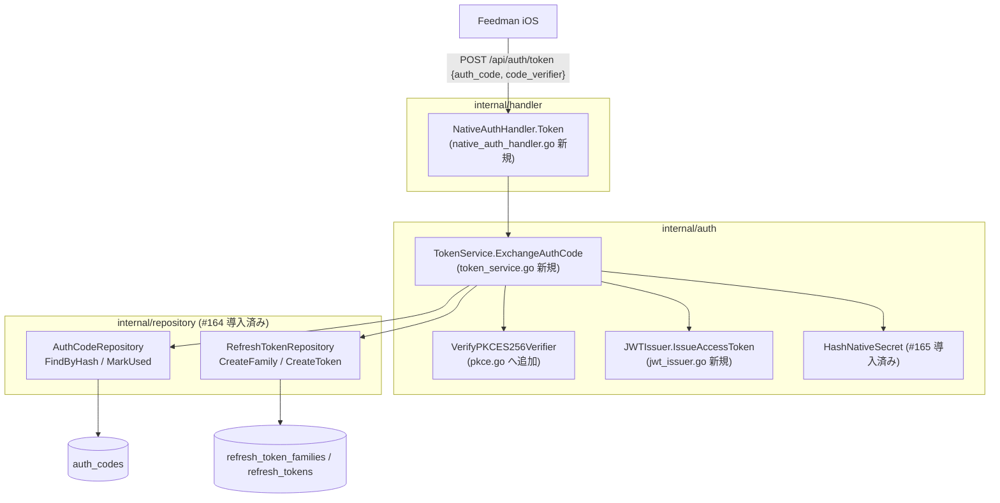

# Design Document

## Overview

**Purpose**: 本 spec は `POST /api/auth/token` を追加し、Issue #165 の OAuth callback が発行した
一時 `auth_code` を、PKCE S256 verifier 検証のうえで access token（JWT・900 秒）と
refresh token（不透明乱数・hash 保存・30 日）に交換できるようにする。

**Users**: Feedman iOS アプリがディープリンクで受領した `auth_code` を本エンドポイントで
交換する。既存 Web ユーザー・既存 API には影響しない。

**Impact**: 新規 handler / service / JWT issuer を追加し、router の**認証不要グループ**に
1 ルートを足す。永続化は #164 の `AuthCodeRepository`（FindByHash / MarkUsed）と
`RefreshTokenRepository`（CreateFamily / CreateToken）をそのまま使用し、新規 migration は
追加しない。署名鍵 env 未設定の環境ではエンドポイント自体を登録しない（fail-closed、
既存デプロイの起動・挙動は完全不変）。

### Goals

- `{auth_code, code_verifier}` → `{access_token, refresh_token, token_type, expires_in}` の
  交換（SERVER.md §1.3 の JSON 契約に一致）（Req 1）
- auth_code の race-safe な単回消費（#164 `MarkUsed` の atomic 判定を利用）（Req 1.2, 2.3）
- 拒否理由を区別させない uniform な INVALID_GRANT 応答（Req 2.6）
- 署名鍵の env 管理・未設定時 fail-closed・テスト注入可能な issuer（Req 3）

### Non-Goals

- access token の**検証**（Bearer middleware、Issue #169。本 spec は発行のみ。ただし
  issuer の単体テストでは自己検証を行う）
- refresh rotation（#167）/ 再利用検知・revoke（#168）/ IP レート制限（#171）
- 鍵ローテーション実装（kid 付与までを行い、複数鍵受理は将来 Issue）
- 期限切れ auth_codes / refresh_tokens の定期削除 worker

## Architecture Pattern & Boundary Map



### 交換フロー（正常系）

```
1. handler: JSON decode（必須フィールド検査）→ 不正なら 400 INVALID_REQUEST
2. service: HashNativeSecret(auth_code) → AuthCodeRepository.FindByHash
   → nil なら ErrInvalidGrant
3. service: VerifyPKCES256Verifier(code_verifier, 保存済み challenge)
   → 形式不正 / 不一致なら ErrInvalidGrant
4. service: AuthCodeRepository.MarkUsed(id)
   → ErrAuthCodeNotUsable（使用済み / 期限切れ / 消失）なら ErrInvalidGrant
   ※ used / expires_at の判定は MarkUsed の UPDATE ... WHERE が atomic に行うため
     並行二重交換でも片方しか成功しない（#164 の race-safe 設計を利用）
5. service: refresh family 作成 → refresh token（256bit 乱数）を hash 保存（30 日 TTL）
6. service: JWTIssuer.IssueAccessToken(userID) → JWT（900 秒）
7. handler: 200 {access_token, refresh_token, token_type: "Bearer", expires_in: 900}
```

**部分失敗の扱い**: 手順 5〜6 が失敗した場合、auth_code は既に消費済みだが token は
返らない（500）。クライアントはログインからやり直す。一時コードの「安全側に倒して
燃やす」挙動として許容する（rollback 機構は導入しない。発生はインフラ障害時のみ）。

## Technology Stack

| レイヤ | 技術 | 備考 |
|---|---|---|
| JWT 発行 | `github.com/golang-jwt/jwt/v5`（**新規依存**） | HS256。標準的な Go JWT ライブラリ。#169 の検証側でも同一ライブラリを使う想定 |
| 署名鍵 | env `NATIVE_AUTH_JWT_SECRET`（32 byte 以上推奨） + `NATIVE_AUTH_JWT_KID`（既定 `v1`） | `internal/config` で読み込み。未設定なら機能無効（fail-closed） |
| refresh token | crypto/rand 32 byte → base64.RawURLEncoding | 256bit（NFR 1.1）。hash は `HashNativeSecret`（#165） |
| PKCE 検証 | crypto/sha256 + base64 + `crypto/subtle.ConstantTimeCompare` | RFC 7636 §4.6 の S256 検証（NFR 1.4） |
| エラー応答 | 既存 `middleware.WriteErrorResponse` + `model.APIError` | `{error: {code, message, category, action}}` 形式 |

## File Structure Plan

```
internal/
├── config/
│   └── config.go             # 変更: NativeAuthJWTSecret / NativeAuthJWTKid を追加（任意項目）
├── auth/
│   ├── pkce.go               # 変更: VerifyPKCES256Verifier（verifier 形式検証 + S256 導出 +
│   │                         #       定数時間比較）を追加
│   ├── pkce_test.go          # 変更: verifier 検証の table-driven ケースを追加
│   ├── jwt_issuer.go         # 新規: JWTIssuer（HS256 / kid / 900 秒 / now 注入可能）
│   ├── jwt_issuer_test.go    # 新規: claims / kid / 有効期限 / 署名検証の unit test
│   ├── token_service.go      # 新規: TokenService.ExchangeAuthCode / ErrInvalidGrant /
│   │                         #       AuthCodeConsumer・RefreshTokenStore 最小 IF / TokenPair
│   └── token_service_test.go # 新規: 交換成功 / 不一致 / 期限切れ / 使用済み / 永続化失敗
├── handler/
│   ├── native_auth_handler.go      # 新規: POST /api/auth/token の handler（JSON I/O のみ）
│   ├── native_auth_handler_test.go # 新規: 200 / 400 INVALID_GRANT / 400 INVALID_REQUEST
│   ├── router.go             # 変更: RouterDeps.NativeAuthHandler（任意）と認証不要グループへの
│   │                         #       ルート登録（nil なら未登録 = fail-closed）
│   ├── router_test.go        # 変更: handler 注入時 / nil 時のルーティングテスト
│   └── integration_test.go   # 変更: callback → token 交換の通しケースを追加
├── app/
│   └── app.go                # 変更: secret 設定時のみ issuer / service / handler を wiring
.env.sample                   # 変更: NATIVE_AUTH_JWT_SECRET / NATIVE_AUTH_JWT_KID を追記
go.mod / go.sum               # 変更: github.com/golang-jwt/jwt/v5 を追加
```

## Requirements Traceability

| Req | 設計要素 |
|---|---|
| 1.1, 1.6 | `NativeAuthHandler.Token` の 200 応答（`tokenResponse` struct: access_token / refresh_token / token_type / expires_in） |
| 1.2 | `TokenService.ExchangeAuthCode` 手順 4（`MarkUsed` による atomic 単回消費） |
| 1.3 | 手順 5（`CreateFamily` → `CreateToken`、`TokenHash = HashNativeSecret(plain)`） |
| 1.4 | `JWTIssuer`: HS256 JWT、claims `sub`/`exp`/`iat`/`jti`/`token_use`、`AccessTokenTTL = 15 * time.Minute`（= expires_in 900） |
| 1.5 | router の認証不要グループに登録（Session / Bearer middleware を通らない） |
| 2.1, 2.4 | `VerifyPKCES256Verifier`（形式: `^[A-Za-z0-9._~-]{43,128}$`、S256 導出、`subtle.ConstantTimeCompare`） |
| 2.2 | `FindByHash` が nil → `ErrInvalidGrant` |
| 2.3 | `MarkUsed` が `ErrAuthCodeNotUsable` → `ErrInvalidGrant` |
| 2.5 | handler の JSON decode / 必須フィールド検査 → 400 `INVALID_REQUEST` |
| 2.6 | service は全拒否を単一 sentinel `ErrInvalidGrant` に正規化し、handler は単一の 400 `INVALID_GRANT` 応答を返す |
| 2.7 | 拒否パスは手順 5（refresh 永続化）に到達しない処理順序で担保 |
| 3.1 | `config.NativeAuthJWTSecret`（env `NATIVE_AUTH_JWT_SECRET`） |
| 3.2, 3.3 | `app.go`: secret 空なら handler を生成せず `slog.Warn` 1 回。`router.go`: `NativeAuthHandler == nil` なら未登録（/metrics の fail-closed と同パターン） |
| 3.4 | `JWTIssuer` は `now func() time.Time` を保持（テストで固定注入）。secret はコンストラクタ引数 |
| 3.5 | JWT ヘッダに `kid`（`NATIVE_AUTH_JWT_KID`、既定 `v1`） |
| NFR 1.1 | refresh token: crypto/rand 32 byte |
| NFR 1.2, NFR 1.3 | ログは hash 先頭 8 文字のみ（#165 と同方針）。sentinel エラーメッセージに入力値を含めない |
| NFR 1.4 | `subtle.ConstantTimeCompare` |
| NFR 1.5 | 固定メッセージの `model.APIError`（入力反射なし） |
| NFR 2.1, NFR 2.2 | 追加ルートのみ・既存コード経路不変。secret 未設定なら wiring 自体をスキップ |
| NFR 3.1 | repo は最小 IF（`AuthCodeConsumer` / `RefreshTokenStore`）のモックで単体検証 |

## Components and Interfaces

### config（変更）

```go
// Config に追加（いずれも任意。未設定なら native token 交換が無効になるだけで起動は成功）
NativeAuthJWTSecret string // env NATIVE_AUTH_JWT_SECRET
NativeAuthJWTKid    string // env NATIVE_AUTH_JWT_KID（既定 "v1"）
```

### auth.VerifyPKCES256Verifier（pkce.go へ追加）

```go
// VerifyPKCES256Verifier は code_verifier の形式（RFC 7636 §4.1: unreserved 43〜128 文字）を
// 検証し、S256 導出値（base64url no-pad of SHA-256）が保存済み challenge と一致するかを
// 定数時間比較で返す。一致しない・形式不正の場合は false。
func VerifyPKCES256Verifier(verifier, storedChallenge string) bool
```

### auth.JWTIssuer（新規 / jwt_issuer.go）

```go
// AccessTokenTTL は access token の有効期間（SERVER.md §1.4: 15 分 / expires_in 900）。
const AccessTokenTTL = 15 * time.Minute

type JWTIssuer struct { /* secret []byte / kid string / now func() time.Time */ }

func NewJWTIssuer(secret []byte, kid string) *JWTIssuer

// IssueAccessToken は HS256 署名の JWT を発行する。
// claims: sub=userID, exp=now+15m, iat=now, jti=uuid, token_use="access"。ヘッダに kid。
func (i *JWTIssuer) IssueAccessToken(userID string) (string, error)
```

- `now` は非公開 field でテストから固定注入（package 内 test で直接 set）

### auth.TokenService（新規 / token_service.go）

```go
// ErrInvalidGrant は auth_code 不明・期限切れ・使用済み・PKCE 不一致を区別せず表す
// sentinel error（応答の uniform 化のため理由を細分しない）。
var ErrInvalidGrant = errors.New("invalid grant")

// AuthCodeConsumer / RefreshTokenStore は TokenService が必要とする最小 IF。
// repository.AuthCodeRepository / RefreshTokenRepository が構造的に充足する。
type AuthCodeConsumer interface {
	FindByHash(ctx context.Context, codeHash string) (*model.AuthCode, error)
	MarkUsed(ctx context.Context, id string) error
}
type RefreshTokenStore interface {
	CreateFamily(ctx context.Context, family *model.RefreshTokenFamily) error
	CreateToken(ctx context.Context, token *model.RefreshToken) error
}

// RefreshTokenTTL は refresh token の有効期間（SERVER.md §1.4: 30 日）。
const RefreshTokenTTL = 30 * 24 * time.Hour

// TokenPair は交換結果（平文はレスポンス用にのみ保持し、永続化しない）。
type TokenPair struct {
	AccessToken  string
	RefreshToken string
	ExpiresIn    int // 秒（= AccessTokenTTL）
}

func NewTokenService(authCodes AuthCodeConsumer, refreshTokens RefreshTokenStore, issuer *JWTIssuer) *TokenService

// ExchangeAuthCode は交換フロー（design.md 参照）を実行する。
// 拒否はすべて ErrInvalidGrant を返す（errors.Is で判別可能）。
func (s *TokenService) ExchangeAuthCode(ctx context.Context, authCode, codeVerifier string) (*TokenPair, error)
```

### handler.NativeAuthHandler（新規 / native_auth_handler.go）

```go
// TokenExchangeService は handler が必要とする最小 IF。
type TokenExchangeService interface {
	ExchangeAuthCode(ctx context.Context, authCode, codeVerifier string) (*auth.TokenPair, error)
}

type NativeAuthHandler struct { /* svc TokenExchangeService */ }

// Token は POST /api/auth/token を処理する。
// 200: {"access_token", "refresh_token", "token_type": "Bearer", "expires_in": 900}
// 400 INVALID_REQUEST: JSON 不正 / 必須フィールド欠落（category: validation）
// 400 INVALID_GRANT:   ErrInvalidGrant（category: auth、理由は細分しない）
// 500 INTERNAL_ERROR:  上記以外（category: system）
func (h *NativeAuthHandler) Token(w http.ResponseWriter, r *http.Request)
```

### router（変更）

```go
// RouterDeps に追加
// NativeAuthHandler は POST /api/auth/token の handler（任意）。
// nil の場合は登録しない（署名鍵未設定環境の fail-closed。/metrics と同パターン）。
NativeAuthHandler *NativeAuthHandler
```

- 認証不要グループ内に登録（Session middleware を通らない。Req 1.5）:

```go
if deps.NativeAuthHandler != nil {
	r.With(middleware.NewMaxBodyBytesMiddleware(middleware.DefaultMaxBodyBytes)).
		Post("/api/auth/token", deps.NativeAuthHandler.Token)
}
```

- 既存の認証必須グループは `/api/feeds` 等の明示パス登録のため、`/api/auth/token` の
  独立登録と衝突しない（chi の静的ルーティング）
- IP レート制限（`unauthIPMW`）の適用は Issue #171 の領分（本 spec では付けない）

### app.go（変更）

```go
if cfg.NativeAuthJWTSecret != "" {
	issuer := auth.NewJWTIssuer([]byte(cfg.NativeAuthJWTSecret), cfg.NativeAuthJWTKid)
	tokenService := auth.NewTokenService(authCodeRepo, refreshTokenRepo, issuer)
	deps.NativeAuthHandler = handler.NewNativeAuthHandler(tokenService)
} else {
	slog.Warn("NATIVE_AUTH_JWT_SECRET is not set; POST /api/auth/token is disabled")
}
```

- `refreshTokenRepo := repository.NewPostgresRefreshTokenRepo(db)` を新規 wiring

## Data Models

新規モデル・migration なし。#164 のモデルを使用:

| モデル | 本 spec での設定値 |
|---|---|
| `model.RefreshTokenFamily` | `ID = uuid` / `UserID = authCode.UserID` |
| `model.RefreshToken` | `ID = uuid` / `FamilyID` / `UserID` / `TokenHash = HashNativeSecret(平文)` / `ExpiresAt = now + 30d` / `RotatedAt = RevokedAt = nil` |

### JWT claims（access token）

| claim / header | 値 |
|---|---|
| header `alg` | HS256 |
| header `kid` | `NATIVE_AUTH_JWT_KID`（既定 `v1`） |
| `sub` | userID |
| `exp` | iat + 900 秒 |
| `iat` | 発行時刻 |
| `jti` | uuid（将来の失効リスト用） |
| `token_use` | `"access"`（refresh と区別） |

## Error Handling

| 状況 | HTTP | APIError | 備考 |
|---|---|---|---|
| JSON 不正 / 必須フィールド欠落 | 400 | code `INVALID_REQUEST`, category `validation` | ボディ上限超過（MaxBytesReader）もここに合流 |
| auth_code 不明 / 期限切れ / 使用済み / verifier 不一致・形式不正 | 400 | code `INVALID_GRANT`, category `auth` | 理由を区別しない（Req 2.6）。SERVER.md §1.3 の契約 |
| JWT 発行失敗 / 永続化失敗 | 500 | code `INTERNAL_ERROR`, category `system` | 詳細は slog のみ |

- service 層は拒否を `ErrInvalidGrant` に正規化（`fmt.Errorf("...: %w", ErrInvalidGrant)` 可）し、
  handler は `errors.Is(err, auth.ErrInvalidGrant)` で 400/500 を振り分ける
- ログには auth_code / verifier / refresh token の平文を出さない（hash 先頭 8 文字のみ可）

## Testing Strategy

### 単体テスト（auth）

1. `pkce_test.go` 追加分: verifier 形式（42 文字 / 129 文字 / 不正文字）、正しい verifier →
   challenge 一致、不一致 verifier → false（RFC 7636 Appendix B の test vector を使用）
2. `jwt_issuer_test.go`: 固定 secret + 固定 now で発行 → 同ライブラリで parse し
   sub / exp（= iat + 900s）/ iat / jti 非空 / token_use / header kid を検証。空 userID は error
3. `token_service_test.go`: 交換成功（TokenPair 3 値 + MarkUsed 呼び出し + 保存された
   RefreshToken の TokenHash/ExpiresAt/FamilyID 整合）/ FindByHash nil → ErrInvalidGrant /
   MarkUsed が ErrAuthCodeNotUsable → ErrInvalidGrant / verifier 不一致 → ErrInvalidGrant
   （MarkUsed 未呼び出し）/ CreateFamily 失敗 → 非 InvalidGrant エラー / 拒否時に
   CreateToken 未呼び出し

### 単体テスト（handler）

4. `native_auth_handler_test.go`: 正常 200 と JSON フィールド名（`access_token` 等の snake_case
   契約）/ ErrInvalidGrant → 400 INVALID_GRANT / 不正 JSON → 400 INVALID_REQUEST /
   フィールド欠落 → 400 INVALID_REQUEST / service 内部エラー → 500
5. `router_test.go`: NativeAuthHandler 注入時に POST /api/auth/token がセッション無しで
   到達する / nil 時は 404（fail-closed）/ 既存ルート不変

### 統合テスト（handler）

6. `integration_test.go`: native login → callback で auth_code 取得 → POST /api/auth/token で
   交換成功 → 同一 code の再交換が 400 になる通しケース（mock サービス層）

## Security Considerations

- auth_code は #164 の `MarkUsed`（`WHERE used = false AND expires_at > now()`）で race-safe に
  単回消費され、並行二重交換でも token は 1 回しか発行されない
- 拒否応答の uniform 化（INVALID_GRANT 単一）により auth_code の存在有無を列挙できない
- refresh token は 256bit 乱数・hash 保存・30 日 TTL。平文は応答 JSON のみ
- JWT secret は env 管理（コミット禁止は既存規約）。未設定時はエンドポイント自体が
  存在しない（fail-closed）
- PKCE 比較は定数時間（タイミングオラクル回避）。verifier 形式検証で異常入力を早期拒否

## Supporting References

- feedman-ios `design/SERVER.md` §1.3（JSON 契約）/ §1.4（トークン設計）
- RFC 7636 §4.1（verifier 形式）/ §4.6（S256 検証）/ Appendix B（test vector）
  <https://datatracker.ietf.org/doc/html/rfc7636>
- golang-jwt/jwt v5 <https://github.com/golang-jwt/jwt>
- Issue #164 spec（repository 契約）/ #165 spec（auth_code 発行・HashNativeSecret）
