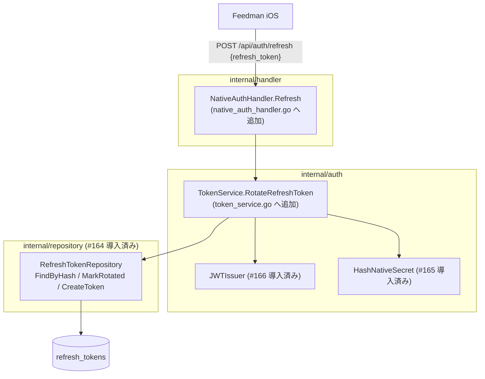

# Design Document

## Overview

**Purpose**: 本 spec は `POST /api/auth/refresh` を追加し、有効な refresh token を rotation
（旧 token の使用不可化 + 同一 family での新 token 発行）したうえで、新しい access token /
refresh token を `POST /api/auth/token`（Issue #166）と同形の JSON で返せるようにする。

**Users**: Feedman iOS アプリが access token（900 秒）の失効前後に本エンドポイントを呼び、
セッションを維持する。既存 Web ユーザー・既存 API には影響しない。

**Impact**: #166 で導入済みの `TokenService` / `NativeAuthHandler` / router 配線に
rotation 操作と 1 ルートを**追加**する。永続化は #164 の `RefreshTokenRepository`
（FindByHash / MarkRotated / CreateToken）をそのまま使用し、新規 migration は追加しない。
署名鍵 env 未設定環境では #166 と同一の fail-closed（`NativeAuthHandler` 自体が nil で
未登録）に乗るため、追加の縮退制御は不要。

### Goals

- `{refresh_token}` → 新 `{access_token, refresh_token, token_type, expires_in}`（Req 1.1, 1.6）
- `MarkRotated`（#164 の atomic UPDATE）を単回確定ゲートとした race-safe rotation（Req 1.2, 3.1）
- スライディング 30 日 TTL の新 token を同一 family に発行（Req 1.3, 1.4）
- 拒否理由を区別させない uniform な 401 応答（Req 2.6）

### Non-Goals

- rotated 済み token 再利用時の **family 全体失効**（Issue #168。本 spec は
  `ErrInvalidRefreshToken` での単純拒否。#168 が本 spec の拒否分岐を失効昇格に拡張する）
- `POST /api/auth/revoke`（#168）/ Bearer middleware（#169）/ IP レート制限（#171）
- 期限切れ refresh_tokens の定期削除 worker

## Architecture Pattern & Boundary Map



### Rotation フロー（正常系）

```
1. handler: JSON decode（refresh_token 必須）→ 不正なら 400 INVALID_REQUEST
2. service: HashNativeSecret(refresh_token) → RefreshTokenStore.FindByHash
   → nil なら ErrInvalidRefreshToken
3. service: 状態検証（いずれかに該当なら ErrInvalidRefreshToken）
   - RevokedAt != nil（失効済み。family 単位 revoke でも token 行に set される #164 設計）
   - ExpiresAt <= now（期限切れ）
   - RotatedAt != nil（rotation 済み = 再利用。#168 が family 失効へ昇格するまでは単純拒否）
4. service: MarkRotated(id, now)
   → ErrRefreshTokenAlreadyRotated なら ErrInvalidRefreshToken
   ※ UPDATE ... WHERE rotated_at IS NULL の atomic 判定により、並行 rotation でも
     高々 1 件のみ成功（Req 3.1。手順 3 の RotatedAt 検査は高速拒否のための事前判定で、
     正本のゲートは本手順）
5. service: 新 refresh token（crypto/rand 32 byte）を同一 FamilyID で hash 保存
   （ExpiresAt = now + RefreshTokenTTL（30 日）= スライディング延長）
6. service: JWTIssuer.IssueAccessToken(token.UserID)
7. handler: 200 {access_token, refresh_token, token_type: "Bearer", expires_in: 900}
```

**部分失敗の扱い**: 手順 5〜6 の失敗時は旧 token が rotation 済みのまま 500 を返す
（クライアントは再ログイン）。#166 の auth_code と同じ「安全側に倒して燃やす」方針
（requirements.md Open Questions）。

## Technology Stack

#166 と完全に同一（新規依存なし）。JWT 発行は導入済み `JWTIssuer`、hash は
`HashNativeSecret`、エラー応答は `middleware.WriteErrorResponse` + `model.APIError`。

## File Structure Plan

```
internal/
├── auth/
│   ├── token_service.go       # 変更: ErrInvalidRefreshToken sentinel /
│   │                          #       RefreshTokenStore IF に FindByHash・MarkRotated を拡張 /
│   │                          #       RotateRefreshToken を追加
│   └── token_service_test.go  # 変更: rotation の成功 / 拒否 / 並行ゲートのケースを追加
├── handler/
│   ├── native_auth_handler.go      # 変更: Refresh handler（401 INVALID_REFRESH_TOKEN 応答）
│   ├── native_auth_handler_test.go # 変更: Refresh の 200 / 401 / 400 / 500 ケース
│   ├── router.go              # 変更: 認証不要グループに POST /api/auth/refresh を登録
│   │                          #       （NativeAuthHandler nil ガードは #166 と共通）
│   ├── router_test.go         # 変更: refresh ルートの到達 / nil 時 404 ケース
│   └── integration_test.go    # 変更: token 交換 → refresh → 旧 token 拒否の通しケース
```

## Requirements Traceability

| Req | 設計要素 |
|---|---|
| 1.1, 1.6 | `NativeAuthHandler.Refresh` が `TokenPair` を #166 と同一の `tokenResponse` 形式で応答 |
| 1.2 | フロー手順 4（`MarkRotated` による rotation 確定） |
| 1.3 | フロー手順 5（`CreateToken`、`FamilyID` は旧 token と同一、`TokenHash = HashNativeSecret(新平文)`） |
| 1.4 | 手順 5 の `ExpiresAt = now + RefreshTokenTTL`（#166 で定義済みの 30 日定数を再利用） |
| 1.5 | router の認証不要グループに登録（Session / Bearer を通らない） |
| 2.1 | 手順 2（FindByHash nil → `ErrInvalidRefreshToken`） |
| 2.2, 2.3, 2.4 | 手順 3（ExpiresAt / RevokedAt / RotatedAt の状態検証） |
| 2.5 | handler の JSON decode / 必須フィールド検査 → 400 `INVALID_REQUEST` |
| 2.6 | service は全拒否を単一 sentinel `ErrInvalidRefreshToken` に正規化し、handler は単一の 401 `INVALID_REFRESH_TOKEN` を返す |
| 2.7 | 拒否パスは手順 5（新 token 永続化）に到達しない処理順序 + 手順 4 失敗時は状態変更なし（UPDATE 0 行） |
| 3.1 | `MarkRotated` の `WHERE rotated_at IS NULL` atomic 判定（#164 の race-safe 設計） |
| NFR 1.1 | 新 token は crypto/rand 32 byte → base64.RawURLEncoding（#166 の生成ヘルパーを共用） |
| NFR 1.2, NFR 1.3 | hash のみ永続化。ログは hash 先頭 8 文字。固定メッセージ応答 |
| NFR 2.1 | 追加ルート・追加メソッドのみで既存経路不変 |
| NFR 2.2 | `NativeAuthHandler` nil 時は token / refresh とも未登録（#166 の fail-closed に同乗） |
| NFR 3.1 | `RefreshTokenStore` のモックで service を単体検証。issue AC の 6 ケースを Testing Strategy に対応付け |

## Components and Interfaces

### auth.TokenService（変更 / token_service.go）

```go
// ErrInvalidRefreshToken は refresh token の不明・期限切れ・失効・rotation 済みを
// 区別せず表す sentinel error。
var ErrInvalidRefreshToken = errors.New("invalid refresh token")

// RefreshTokenStore（#166 導入）を rotation 操作まで拡張する。
// repository.RefreshTokenRepository が引き続き構造的に充足する。
type RefreshTokenStore interface {
	CreateFamily(ctx context.Context, family *model.RefreshTokenFamily) error
	CreateToken(ctx context.Context, token *model.RefreshToken) error
	FindByHash(ctx context.Context, tokenHash string) (*model.RefreshToken, error)
	MarkRotated(ctx context.Context, id string, rotatedAt time.Time) error
}

// RotateRefreshToken は rotation フロー（design.md 参照）を実行する。
// 拒否はすべて ErrInvalidRefreshToken を返す（errors.Is で判別可能）。
func (s *TokenService) RotateRefreshToken(ctx context.Context, refreshToken string) (*TokenPair, error)
```

- 新 refresh token の生成・hash 保存は #166 の内部ヘルパー（乱数生成 +
  `HashNativeSecret`）を共用する
- `now` の参照は `TokenService` 既存の時刻取得方法に合わせる（#166 実装でテスト注入可能に
  している場合はそれを共用）

### handler.NativeAuthHandler（変更 / native_auth_handler.go）

```go
// TokenExchangeService（#166 導入）に Refresh 用メソッドを追加拡張する。
type TokenExchangeService interface {
	ExchangeAuthCode(ctx context.Context, authCode, codeVerifier string) (*auth.TokenPair, error)
	RotateRefreshToken(ctx context.Context, refreshToken string) (*auth.TokenPair, error)
}

// Refresh は POST /api/auth/refresh を処理する。
// 200: token 交換と同形の tokenResponse
// 400 INVALID_REQUEST:        JSON 不正 / refresh_token 欠落（category: validation）
// 401 INVALID_REFRESH_TOKEN:  ErrInvalidRefreshToken（category: auth、理由は細分しない）
// 500 INTERNAL_ERROR:         上記以外（category: system）
func (h *NativeAuthHandler) Refresh(w http.ResponseWriter, r *http.Request)
```

- 401 は SERVER.md §1.3 の契約（`errors: 401 INVALID_REFRESH_TOKEN`）。token 交換の
  400 INVALID_GRANT とはステータス・コードが異なる点に注意

### router（変更）

```go
if deps.NativeAuthHandler != nil {
	r.With(middleware.NewMaxBodyBytesMiddleware(middleware.DefaultMaxBodyBytes)).
		Post("/api/auth/token", deps.NativeAuthHandler.Token)
	r.With(middleware.NewMaxBodyBytesMiddleware(middleware.DefaultMaxBodyBytes)).
		Post("/api/auth/refresh", deps.NativeAuthHandler.Refresh)
}
```

- `RouterDeps` の変更は不要（#166 の `NativeAuthHandler` フィールドに同乗）
- app.go の wiring 変更も不要（`TokenService` のメソッド追加のみで成立）

## Data Models

新規モデル・migration なし。rotation 時の値設定:

| フィールド | 旧 token（更新） | 新 token（作成） |
|---|---|---|
| `RotatedAt` | `now`（MarkRotated） | nil |
| `FamilyID` | 不変 | 旧 token と同一 |
| `UserID` | 不変 | 旧 token と同一 |
| `TokenHash` | 不変 | `HashNativeSecret(新平文)` |
| `ExpiresAt` | 不変 | `now + RefreshTokenTTL`（30 日スライディング） |

## Error Handling

| 状況 | HTTP | APIError | 備考 |
|---|---|---|---|
| JSON 不正 / `refresh_token` 欠落 | 400 | code `INVALID_REQUEST`, category `validation` | #166 と同一ヘルパーを共用 |
| token 不明 / 期限切れ / 失効済み / rotation 済み | 401 | code `INVALID_REFRESH_TOKEN`, category `auth` | 理由を区別しない（Req 2.6）。SERVER.md §1.3 |
| JWT 発行失敗 / 新 token 永続化失敗 | 500 | code `INTERNAL_ERROR`, category `system` | 旧 token は消費済み（Open Questions 参照） |

## Testing Strategy

### 単体テスト（auth / token_service_test.go 追加分）

1. rotation 成功: TokenPair 3 値 / MarkRotated が旧 ID で呼ばれる / CreateToken の
   FamilyID・UserID が旧 token と同一 / ExpiresAt ≈ now+30d / TokenHash が新平文の hash
2. FindByHash nil → ErrInvalidRefreshToken（MarkRotated 未呼び出し）
3. 期限切れ token → ErrInvalidRefreshToken（MarkRotated 未呼び出し）
4. RevokedAt set 済み token → ErrInvalidRefreshToken
5. RotatedAt set 済み token（再利用）→ ErrInvalidRefreshToken（新 token 未作成）
6. MarkRotated が ErrRefreshTokenAlreadyRotated（並行 race の敗者）→ ErrInvalidRefreshToken
   （新 token 未作成 = Req 3.1 の高々 1 件成功）
7. CreateToken 失敗 → 非 InvalidRefreshToken エラー（500 系へ）

### 単体テスト（handler / native_auth_handler_test.go 追加分）

8. 正常 200 と JSON フィールド名 / ErrInvalidRefreshToken → 401 INVALID_REFRESH_TOKEN /
   不正 JSON・フィールド欠落 → 400 INVALID_REQUEST / 内部エラー → 500

### ルーティング・統合テスト

9. `router_test.go`: POST /api/auth/refresh が NativeAuthHandler 注入時にセッション無しで
   到達 / nil 時 404
10. `integration_test.go`: token 交換 → refresh 成功（新 pair 取得）→ **旧 refresh token で
    再 refresh → 401** の通しケース（issue AC「old token after rotation」）

## Security Considerations

- rotation の正本ゲートは `MarkRotated` の atomic UPDATE（#164）。事前の状態検査は
  応答高速化のためで、TOCTOU は手順 4 が防ぐ
- 拒否は 401 単一応答で token の存在・状態を列挙できない
- 新旧 token とも平文はレスポンス JSON のみ。ログは hash 先頭 8 文字
- 再利用（rotated 済み提示)は本 spec では拒否のみ。盗難対応の family 失効は #168 で
  本フローの手順 3〜4 の拒否分岐を昇格させる設計とする（拡張点を局所化済み）

## Supporting References

- feedman-ios `design/SERVER.md` §1.3（/api/auth/refresh 契約・401 INVALID_REFRESH_TOKEN）/
  §1.4（rotation・30 日スライディング）
- Issue #164 spec（MarkRotated の atomic 設計）/ #166 spec（TokenService / handler / 配線）
