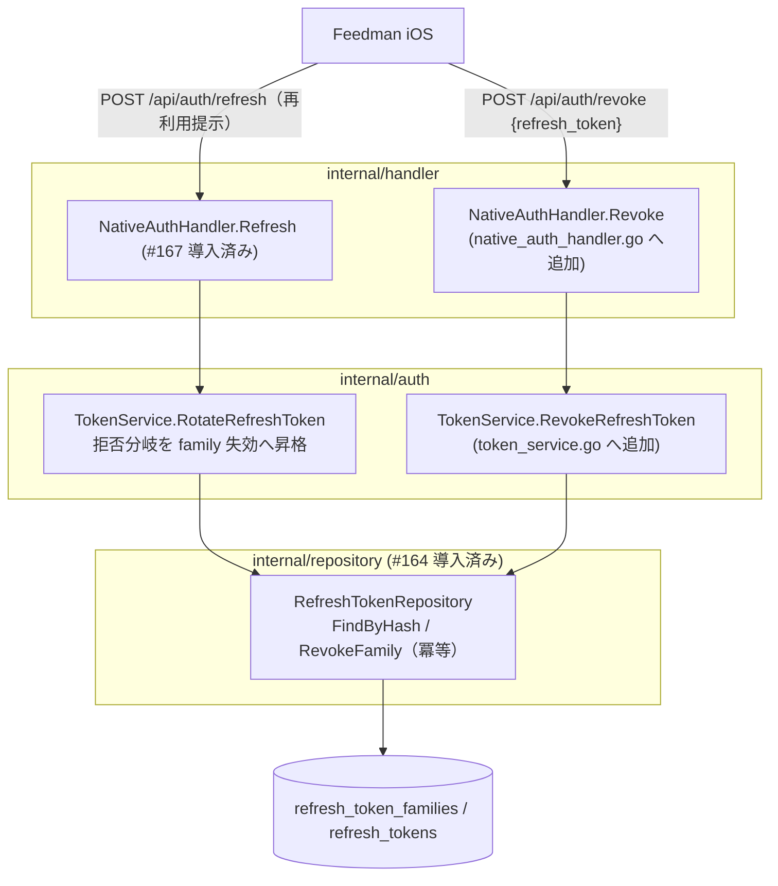

# Design Document

## Overview

**Purpose**: 本 spec は (1) rotation 済み refresh token の再利用検知を **family 全体失効**へ
昇格させ（盗難対策、SERVER.md §1.4）、(2) ログアウト用の **`POST /api/auth/revoke`** を追加する。

**Users**: Feedman iOS アプリ（ログアウト時の revoke 呼び出し）と Feedman 運用者
（漏えい token 系列の自動遮断）。既存 Web ユーザーには影響しない。

**Impact**: #167 で導入済みの `TokenService.RotateRefreshToken` の拒否分岐 2 箇所
（RotatedAt 検出 / MarkRotated 競合敗北）を family 失効に昇格させ、`RevokeRefreshToken` と
handler / route を追加する。永続化は #164 の `RevokeFamily`（冪等設計済み）をそのまま使用し、
新規 migration は追加しない。

### Goals

- 再利用検知（rotated 済み提示・並行競合敗北）→ `RevokeFamily` → 通常拒否と同一の 401（Req 1）
- `POST /api/auth/revoke`: family 失効 + 常に 204（冪等・列挙オラクルなし）（Req 2）
- revoke 後・再利用検知後の family 全 token が refresh 不能であること（Req 1.3, 2.3）

### Non-Goals

- Bearer middleware（#169）/ IP レート制限（#171）/ contract tests 全体整備（#172）
- access token（JWT）の即時失効（短命 900 秒で吸収）
- 再利用検知イベントの外部通知（slog の warn 出力まで）

## Architecture Pattern & Boundary Map



### 再利用検知の昇格（RotateRefreshToken の変更点）

#167 の rotation フロー手順 3〜4 の拒否分岐を以下のとおり拡張する（他の手順は不変）:

```
3. 状態検証:
   - RevokedAt != nil → ErrInvalidRefreshToken（変更なし: 失効済みは再利用ではない）
   - ExpiresAt <= now → ErrInvalidRefreshToken（変更なし）
   - RotatedAt != nil → 【昇格】RevokeFamily(FamilyID, now) を実行してから
                        ErrInvalidRefreshToken（再利用検知。slog.Warn で記録）
4. MarkRotated:
   - ErrRefreshTokenAlreadyRotated → 【昇格】RevokeFamily(FamilyID, now) を実行してから
                        ErrInvalidRefreshToken（並行競合 = 検知漏れ防止、Req 1.2）
   - RevokeFamily 自体が失敗した場合も ErrInvalidRefreshToken ではなく内部エラーを返さず、
     【安全側】失効を諦めず拒否は維持する（新 token は発行しない。Req 1.5。
     実装は「RevokeFamily の error を slog.Error で記録しつつ ErrInvalidRefreshToken を返す」）
```

- strict 方針（正規クライアントの再送も失効対象）の根拠と回復手段は requirements.md
  Open Questions を参照
- 検知ログ: `slog.Warn("refresh token reuse detected", family_id, token_hash 先頭 8 文字)`

### Revoke フロー

```
1. handler: JSON decode（refresh_token 必須）→ 不正なら 400 INVALID_REQUEST
2. service: HashNativeSecret(refresh_token) → FindByHash
   → nil なら【何もせず】nil を返す（handler は 204。存在オラクルを作らない）
3. service: RevokeFamily(token.FamilyID, now)（#164 設計により二重 revoke 冪等）
4. handler: 204 No Content（ボディなし）
```

- token の状態（期限切れ・rotation 済み・失効済み）に関わらず family を失効する
  （クライアントが古い世代の token しか保持していなくてもログアウトを成立させる）
- infra エラー（FindByHash / RevokeFamily の DB 障害）のみ 500

## Technology Stack

#166 / #167 と完全に同一（新規依存なし）。

## File Structure Plan

```
internal/
├── auth/
│   ├── token_service.go       # 変更: RefreshTokenStore IF に RevokeFamily を追加 /
│   │                          #       RotateRefreshToken の拒否分岐 2 箇所を失効昇格 /
│   │                          #       RevokeRefreshToken を追加
│   └── token_service_test.go  # 変更: 再利用昇格 / 競合昇格 / revoke 成功・冪等のケース追加
├── handler/
│   ├── native_auth_handler.go      # 変更: Revoke handler（204 / 400 / 500）
│   ├── native_auth_handler_test.go # 変更: Revoke の 204 / 400 / 500 ケース
│   ├── router.go              # 変更: 認証不要グループに POST /api/auth/revoke を登録
│   ├── router_test.go         # 変更: revoke ルートの到達 / nil 時 404 ケース
│   └── integration_test.go    # 変更: 再利用 → family 全滅 / revoke → refresh 拒否の通しケース
```

## Requirements Traceability

| Req | 設計要素 |
|---|---|
| 1.1 | RotateRefreshToken 手順 3 の RotatedAt 分岐で `RevokeFamily` 実行後に `ErrInvalidRefreshToken` |
| 1.2 | 手順 4 の `ErrRefreshTokenAlreadyRotated` 分岐で同様に昇格 |
| 1.3 | `RevokeFamily` が family 配下全 token の `RevokedAt` を set（#164）→ 手順 3 の RevokedAt 検証で拒否 |
| 1.4 | 昇格後も返すのは同一 sentinel `ErrInvalidRefreshToken` → handler は #167 と同じ 401 単一応答 |
| 1.5 | RevokeFamily 失敗時も `ErrInvalidRefreshToken` を返し新 token を発行しない（slog.Error 記録） |
| 2.1 | `RevokeRefreshToken` 手順 2〜3 + handler `Revoke` の 204 |
| 2.2 | FindByHash nil → 何もせず nil（204）。`RevokeFamily` は二重 revoke 冪等（#164） |
| 2.3 | family 失効後の refresh は RotateRefreshToken 手順 3 の RevokedAt 検証で拒否（#167 既存） |
| 2.4 | router の認証不要グループに登録（Req 2.4 の境界判断は requirements.md Open Questions） |
| 2.5 | handler の JSON decode / 必須フィールド検査 → 400 `INVALID_REQUEST` |
| 2.6 | 既存 `POST /auth/logout` のコード経路に変更なし |
| NFR 1.1 | 平文は hash 化後に破棄。ログは hash 先頭 8 文字 |
| NFR 1.2 | 不明 token でも既知 token でも同一の 204（タイミング差は FindByHash 1 回で同等） |
| NFR 1.3 | 固定メッセージの APIError（入力反射なし） |
| NFR 2.1 | 既存経路の変更は RotateRefreshToken の拒否分岐内部のみ（応答契約は不変） |
| NFR 2.2 | `NativeAuthHandler` nil 時は revoke も未登録（#166 の fail-closed に同乗） |
| NFR 3.1 | RefreshTokenStore モックで service を単体検証。Testing Strategy が issue AC 5 観点を網羅 |

## Components and Interfaces

### auth.TokenService（変更 / token_service.go）

```go
// RefreshTokenStore（#166/#167 導入）に family 失効を追加拡張する。
// repository.RefreshTokenRepository が引き続き構造的に充足する。
type RefreshTokenStore interface {
	CreateFamily(ctx context.Context, family *model.RefreshTokenFamily) error
	CreateToken(ctx context.Context, token *model.RefreshToken) error
	FindByHash(ctx context.Context, tokenHash string) (*model.RefreshToken, error)
	MarkRotated(ctx context.Context, id string, rotatedAt time.Time) error
	RevokeFamily(ctx context.Context, familyID string, revokedAt time.Time) error
}

// RevokeRefreshToken は提示された refresh token の family 全体を失効する。
// token が見つからない場合は何もせず nil を返す（冪等・存在オラクルなし）。
// infra エラーのみ error を返す。
func (s *TokenService) RevokeRefreshToken(ctx context.Context, refreshToken string) error
```

### handler.NativeAuthHandler（変更 / native_auth_handler.go）

```go
// TokenExchangeService に Revoke 用メソッドを追加拡張する。
type TokenExchangeService interface {
	ExchangeAuthCode(ctx context.Context, authCode, codeVerifier string) (*auth.TokenPair, error)
	RotateRefreshToken(ctx context.Context, refreshToken string) (*auth.TokenPair, error)
	RevokeRefreshToken(ctx context.Context, refreshToken string) error
}

// Revoke は POST /api/auth/revoke を処理する。
// 204: 失効成功または対象不明（区別しない・ボディなし）
// 400 INVALID_REQUEST: JSON 不正 / refresh_token 欠落
// 500 INTERNAL_ERROR:  infra エラー
func (h *NativeAuthHandler) Revoke(w http.ResponseWriter, r *http.Request)
```

### router（変更）

```go
if deps.NativeAuthHandler != nil {
	// （既存）POST /api/auth/token / POST /api/auth/refresh
	r.With(middleware.NewMaxBodyBytesMiddleware(middleware.DefaultMaxBodyBytes)).
		Post("/api/auth/revoke", deps.NativeAuthHandler.Revoke)
}
```

- `RouterDeps` / app.go の wiring 変更は不要（#166 の配線に同乗）

## Data Models

新規モデル・migration なし。`RevokeFamily` は `refresh_token_families.revoked_at` と
配下 `refresh_tokens.revoked_at` を一括 set する（#164 実装済み・二重 revoke 冪等）。

## Error Handling

| 状況 | HTTP | APIError | 備考 |
|---|---|---|---|
| revoke: JSON 不正 / フィールド欠落 | 400 | `INVALID_REQUEST` / validation | |
| revoke: token 不明 / 失効済み / 何であれ処理完了 | 204 | （ボディなし） | 区別しない（Req 2.2 / NFR 1.2） |
| revoke: DB 障害 | 500 | `INTERNAL_ERROR` / system | |
| refresh: 再利用検知（昇格後） | 401 | `INVALID_REFRESH_TOKEN` / auth | 通常拒否と同一応答（Req 1.4） |

## Testing Strategy

### 単体テスト（auth / token_service_test.go 追加分）

1. RotatedAt 済み token 提示 → `RevokeFamily` が当該 FamilyID で呼ばれ、`ErrInvalidRefreshToken`
   が返り、新 token 未作成（Req 1.1）
2. MarkRotated が `ErrRefreshTokenAlreadyRotated` → 同様に昇格（Req 1.2）
3. 昇格時の RevokeFamily が失敗 → それでも `ErrInvalidRefreshToken`（新 token 未発行、Req 1.5）
4. RevokeRefreshToken: 既知 token → RevokeFamily 呼び出し + nil（Req 2.1）
5. RevokeRefreshToken: FindByHash nil → RevokeFamily 未呼び出し + nil（Req 2.2 冪等）
6. RevokeRefreshToken: DB 障害 → error（500 系）
7. 失効済み（RevokedAt set）token の refresh は引き続き昇格なしの単純拒否（#167 既存挙動の回帰）

### 単体テスト（handler）

8. Revoke: 正常 204（ボディ空）/ 不明 token でも 204 / 不正 JSON・欠落 → 400 / service エラー → 500

### ルーティング・統合テスト

9. `router_test.go`: POST /api/auth/revoke の到達 / NativeAuthHandler nil 時 404
10. `integration_test.go`:
    - 再利用シナリオ: token 交換 → refresh（旧 A → 新 B）→ A を再提示 → 401 + 以後 B でも 401
      （family 全滅、Req 1.1, 1.3）
    - revoke シナリオ: token 交換 → revoke 204 → 同 token で refresh → 401 → 再 revoke → 204
      （冪等、Req 2.1, 2.2, 2.3）

## Security Considerations

- 再利用検知は「漏えいの可能性がある系列を丸ごと止める」strict 方針（SERVER.md §1.4 準拠）。
  誤検知（正規再送）でもユーザーは再ログインで回復でき、安全側に倒れる
- revoke は破壊的操作のみで奪取に使えず、常に 204 のため列挙オラクルにならない。
  token 所持ベースの認可は RFC 7009 §2.1 の public client 慣行に整合
- family 失効は #164 の冪等 `RevokeFamily` に委譲し、二重実行・並行実行で壊れない

## Supporting References

- feedman-ios `design/SERVER.md` §1.3（/api/auth/revoke 契約）/ §1.4・§1.5（再利用検知 /
  family 失効）
- RFC 7009 (OAuth 2.0 Token Revocation) §2.1 <https://datatracker.ietf.org/doc/html/rfc7009>
- Issue #164 spec（RevokeFamily の冪等設計）/ #167 spec（rotation フローの拒否分岐）
