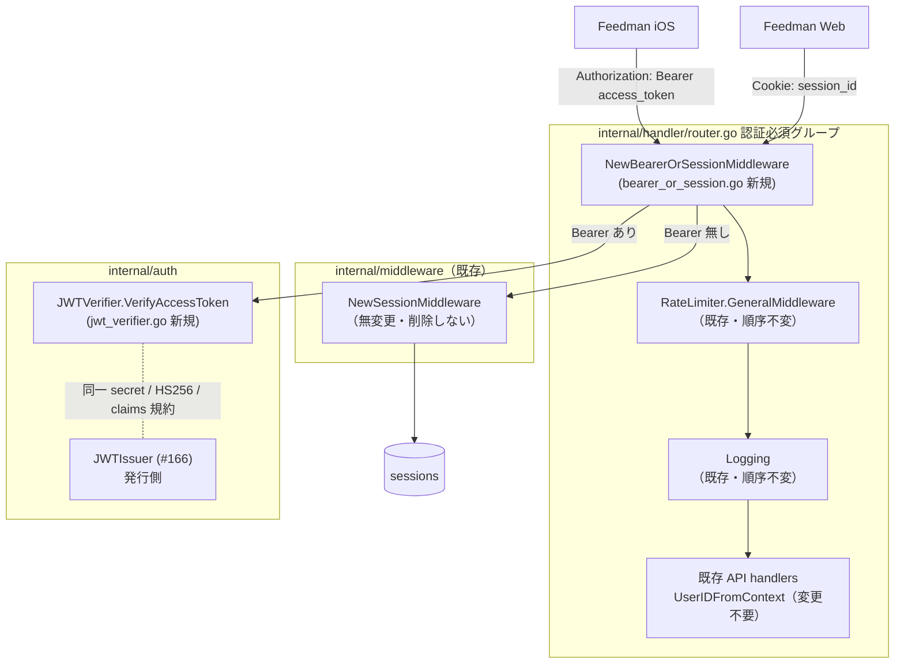

# Design Document

## Overview

**Purpose**: 本 spec は既存の認証必須 API 群（`/api/*`）に Bearer 認証を追加する。
`Authorization: Bearer` を検出した要求は Issue #166 の JWTIssuer と同一規約（同一署名鍵 /
HS256 / claims）で access token を検証し、成立すれば既存 Cookie セッション認証と**同一の
user context** を注入する。Bearer 不在の要求は既存 `SessionMiddleware` へ完全委譲する。

**Users**: Feedman iOS アプリが Bearer 認証で既存 API を呼び出す。既存 Web（Cookie
セッション）ユーザーには一切の挙動変更がない。

**Impact**: `internal/auth/` に検証コンポーネント（JWTVerifier）、`internal/middleware/` に
薄い合成 middleware（BearerOrSession）を新設し、router の認証必須グループの認証 middleware を
1 行差し替える。既存 `SessionMiddleware` は置き換えず削除せず無変更。`NATIVE_AUTH_JWT_SECRET`
未設定の環境では verifier を生成せず、従来どおり SessionMiddleware 単独で動作する（fail-safe
な後方互換。Bearer は単に無効化される）。

**前提（#166 への依存）**: 本 spec は #166 実装で導入される `internal/auth/jwt_issuer.go`
（HS256 / kid / claims: sub / exp / iat / jti / token_use="access"）、`config.NativeAuthJWTSecret`
（env `NATIVE_AUTH_JWT_SECRET`）、依存 `github.com/golang-jwt/jwt/v5`、および `app.go` の
secret 設定分岐の存在を前提とする（Depends on: #166。auto-dev 投入は #166 完了後）。

### Goals

- 有効な Bearer token を Cookie セッションと同一のユーザー識別へ解決し、下流（rate limit /
  logging / 全 handler）を変更ゼロで透過動作させる（Req 1）
- 無効な Bearer token を Cookie へ fallback せず、既存と同形の未認証応答で拒否する（Req 2）
- Bearer 不在時は既存 SessionMiddleware へ委譲し、従来挙動を完全維持する（Req 3, NFR 2）
- 署名鍵未設定環境での fail-safe な縮退（verifier 非生成 = Bearer 無効）（Req 4）

### Non-Goals

- access token の**発行**（#166）/ refresh rotation（#167）/ 再利用検知・revoke（#168）/
  未認証 IP レート制限（#171）
- jti による失効リスト照合・kid による複数鍵受理（単一鍵 v1。将来 Issue）
- `WWW-Authenticate` ヘッダ付与等、401 応答の拡張（既存 SessionMiddleware と同形を優先）
- 既存 API の応答形式変更・Web frontend の変更

## Architecture Pattern & Boundary Map



### 判定フロー（BearerOrSession middleware）

```
0. jwtVerifier == nil（NATIVE_AUTH_JWT_SECRET 未設定）
   → コンストラクタが NewSessionMiddleware(sessionFinder) をそのまま返す
     （全要求が従来どおり Cookie 評価。Authorization ヘッダは一切読まない）
1. Authorization ヘッダ無し → 既存 SessionMiddleware に委譲（従来パス完全維持）
2. ヘッダの scheme が Bearer 以外（Basic 等）→ 1 と同じく委譲
   （従来も Authorization を無視していたため互換）
3. scheme が Bearer（大文字小文字不区別）:
   a. token 部（trim 後）が空 → 401（委譲しない）
   b. JWTVerifier.VerifyAccessToken(token) 失敗 → 401（Cookie へ fallback しない）
   c. 成功 → ContextWithUserID で user context 注入 → next
      （sessionFinder は呼ばない）
```

- Bearer 検出後（手順 3）は結果が成功 / 401 の二択であり、Cookie 側の評価は行わない
  （無効 token の黙認防止。Req 1.4, 2.4）

## Technology Stack

| レイヤ | 技術 | 備考 |
|---|---|---|
| JWT 検証 | `github.com/golang-jwt/jwt/v5`（#166 で追加済みの依存を共用） | **新規依存なし**。`jwt.WithValidMethods` で HS256 限定 |
| 署名鍵 | env `NATIVE_AUTH_JWT_SECRET`（#166 の `config.NativeAuthJWTSecret` を共用） | **新規 config 項目なし**。未設定なら verifier 非生成 = Bearer 無効 |
| 401 応答 | `http.Error(w, "unauthorized", http.StatusUnauthorized)` | 既存 SessionMiddleware の未認証応答と同一（text/plain・本文 "unauthorized"） |
| user context | 既存 `userIDContextKey` / `ContextWithUserID` / `UserIDFromContext` | 下流（rate limit の user 単位制限・logging の user_id 付与・全 handler）が透過動作 |

## File Structure Plan

```
internal/
├── auth/
│   ├── jwt_verifier.go            # 新規: JWTVerifier（HS256 限定 / sub / exp / token_use 検証、
│   │                              #       now はテスト注入可能な非公開 field）
│   └── jwt_verifier_test.go       # 新規: 有効 / 期限切れ / 署名不正 / 用途不一致 / alg 偽装 /
│                                  #       sub 空 / 不正文字列の unit test
├── middleware/
│   ├── bearer_or_session.go       # 新規: JWTVerifier 最小 IF + NewBearerOrSessionMiddleware
│   │                              #       （session.go は無変更）
│   └── bearer_or_session_test.go  # 新規: 分岐 / 401 同形 / 委譲 / nil 縮退の unit test
├── handler/
│   ├── router.go                  # 変更: RouterDeps.JWTVerifier（任意）を追加し、認証必須
│   │                              #       グループの認証 middleware を 1 行差し替え
│   └── router_test.go             # 変更: Bearer 到達 / nil 時従来挙動 / 発行↔検証通しケース
└── app/
    └── app.go                     # 変更: secret 設定時のみ auth.NewJWTVerifier を生成し
                                   #       deps.JWTVerifier へ注入（#166 の分岐ブロックに追記）
```

- 新規 migration / 新規 config 項目 / 新規外部依存 / `.env.sample` 変更はいずれも無し
  （すべて #166 の成果物を共用）

## Requirements Traceability

| Req | 設計要素 |
|---|---|
| 1.1 | 判定フロー 3c: `VerifyAccessToken` 成功 → 既存 `ContextWithUserID` で同一 context key に注入 |
| 1.2 | 下流変更ゼロ: rate limit / logging / 全 handler は `UserIDFromContext` のみ参照（差し替えは認証 middleware 1 箇所） |
| 1.3 | Bearer パスは sessionFinder を呼ばない（判定フロー 3） |
| 1.4 | 判定順序: Bearer 検出が Cookie 評価より先（検出後は成功 / 401 の二択） |
| 2.1, 2.2, 2.3 | `JWTVerifier` 検証規則表（署名 / exp / token_use） |
| 2.4 | 判定フロー 3b: 検証失敗時 401 即応答（session 委譲しない） |
| 2.5 | 判定フロー 3a: token 部空 → 401 |
| 2.6 | 401 応答 = `http.Error(w, "unauthorized", http.StatusUnauthorized)`（SessionMiddleware と同一文・同一形式） |
| 2.7 | 全拒否が同一の 401 応答（失敗理由は slog のみ。Error Handling 参照） |
| 3.1 | 判定フロー 1: ヘッダ無し → SessionMiddleware 委譲 |
| 3.2 | 判定フロー 2: Bearer 以外の scheme → SessionMiddleware 委譲 |
| 3.3, 3.4 | 委譲先は既存 `NewSessionMiddleware` の戻り値そのもの（応答・ログとも従来と同一） |
| 4.1 | `app.go`: `auth.NewJWTVerifier([]byte(cfg.NativeAuthJWTSecret))`（issuer と同一 env 値） |
| 4.2 | 判定フロー 0: verifier nil → SessionMiddleware を返す縮退 + router は無条件 1 行差し替えでも構成が従来同一 |
| 4.3 | 判定フロー 0: nil 縮退時は Authorization ヘッダを一切読まない |
| 4.4 | `app.go` は secret 空なら verifier を生成しないだけで起動継続（#166 の warn 分岐を共用） |
| 4.5 | `JWTVerifier` の `now func() time.Time` 非公開 field（#166 issuer と同パターンの固定注入） |
| NFR 1.1 | slog には検証エラー理由のみ渡す（token 文字列・claims 値を渡さない） |
| NFR 1.2 | 検証は署名鍵と時刻のみで完結（DB・外部呼び出しなし。stateless） |
| NFR 2.1 | `SessionMiddleware` 本体無変更・差し替えは認証 middleware 1 箇所のみ・middleware 順序不変 |
| NFR 2.2 | `deps.JWTVerifier` 未設定（nil）構成が従来構成と同一（判定フロー 0） |
| NFR 3.1 | 全コンポーネントが in-process unit test 可能（Testing Strategy 参照） |

## Components and Interfaces

### auth.JWTVerifier（新規 / jwt_verifier.go）

```go
// JWTVerifier は #166 JWTIssuer が発行した access token（HS256 JWT）を検証する。
type JWTVerifier struct { /* secret []byte / now func() time.Time */ }

func NewJWTVerifier(secret []byte) *JWTVerifier

// VerifyAccessToken は tokenString を検証し、成立時に userID（sub claim）を返す。
// 失敗理由は error に含まれるが、呼び出し側は理由を HTTP 応答に反映しない。
func (v *JWTVerifier) VerifyAccessToken(tokenString string) (string, error)
```

検証規則（#166 発行規約との対応表）:

| 項目 | 発行（#166 JWTIssuer） | 検証（本 spec JWTVerifier） |
|---|---|---|
| alg | HS256 | `jwt.WithValidMethods([]string{"HS256"})`。none / RS256 等は拒否（alg confusion 対策） |
| 署名鍵 | `NATIVE_AUTH_JWT_SECRET` | 同一 env 値で HMAC 署名検証 |
| `exp` | iat + 900 秒 | 必須（`jwt.WithExpirationRequired`）かつ now 超過で拒否。leeway 0 |
| `sub` | userID | 非空必須。成功時の返り値 userID |
| `token_use` | `"access"` | `"access"` 厳密一致以外は拒否（refresh 等の流用防止） |
| `iat` | 発行時刻 | 存在時はライブラリ標準検証に委ねる（presence は要求しない） |
| `jti` | uuid | 検証では参照しない（失効リスト未導入。Out of Scope） |
| header `kid` | `NATIVE_AUTH_JWT_KID` | 検証では参照しない（単一鍵 v1。複数鍵受理は将来 Issue） |

- `now func() time.Time` は非公開 field でテストから固定注入し、`jwt.WithTimeFunc` に渡す
  （#166 JWTIssuer と同パターン。Req 4.5）

### middleware.JWTVerifier 最小 IF + NewBearerOrSessionMiddleware（新規 / bearer_or_session.go）

```go
// JWTVerifier は BearerOrSession middleware が必要とする最小インターフェース。
// auth.JWTVerifier が構造的に充足する（SessionFinder と同じ interface segregation パターン）。
type JWTVerifier interface {
	VerifyAccessToken(tokenString string) (string, error)
}

// NewBearerOrSessionMiddleware は Bearer 優先・Session 委譲の複合認証 middleware を返す。
// Authorization: Bearer があれば JWT 検証（無効なら 401。Cookie への fallback はしない）、
// 無ければ既存 SessionMiddleware に委譲する。
// jwtVerifier が nil の場合は NewSessionMiddleware(sessionFinder) をそのまま返す
// （NATIVE_AUTH_JWT_SECRET 未設定環境の fail-safe 縮退。Bearer は単に無効化される）。
func NewBearerOrSessionMiddleware(jwtVerifier JWTVerifier, sessionFinder SessionFinder) func(next http.Handler) http.Handler
```

Bearer 判定の規約:

- `Authorization` ヘッダは先頭の値のみ評価し、`strings.SplitN(v, " ", 2)` で scheme / token に分離
- scheme 比較は `strings.EqualFold(scheme, "Bearer")`（RFC 9110: 認証方式名は大文字小文字不区別）
- Bearer scheme でない / ヘッダ無し → session 委譲（判定フロー 1, 2）
- Bearer scheme で token（`strings.TrimSpace` 後）が空（`"Bearer"` 単独を含む）→ 401（判定フロー 3a）
- 401 応答は `http.Error(w, "unauthorized", http.StatusUnauthorized)`
  （SessionMiddleware の未認証応答と同一の status / 本文 / Content-Type。Req 2.6）
- 成功時は既存 `ContextWithUserID(r.Context(), userID)` で注入して next へ
  （同一 package の既存ヘルパーを再利用し、context key の同一性を構造的に保証）
- 検証失敗は `slog.Warn` で error 理由のみ記録（token 文字列・claims 値は渡さない。NFR 1.1）

### handler.RouterDeps / NewRouter（変更 / router.go）

```go
// RouterDeps に追加
// JWTVerifier は Bearer access token の検証器（任意）。
// nil の場合、認証必須グループは従来どおり Cookie セッション認証のみで動作する
// （NATIVE_AUTH_JWT_SECRET 未設定環境の後方互換）。
JWTVerifier middleware.JWTVerifier
```

認証必須グループの差し替え（**1 行のみ**。前後の middleware 順序・位置は不変）:

```go
r.Group(func(r chi.Router) {
	r.Use(middleware.NewBearerOrSessionMiddleware(deps.JWTVerifier, deps.SessionFinder)) // 旧: middleware.NewSessionMiddleware(deps.SessionFinder)
	r.Use(deps.RateLimiter.GeneralMiddleware())
	r.Use(middleware.NewMaxBodyBytesMiddleware(middleware.DefaultMaxBodyBytes))
	r.Use(logging)
	// ...（既存ルート登録は無変更）
})
```

- RateLimit（user 単位）と Logging（user_id 付与）は認証 middleware の**内側**のまま →
  Bearer 認証でも `UserIDFromContext` で透過動作し、適用順序・適用有無は従来と同一（Req 1.2, NFR 2.1）
- `deps.JWTVerifier` が nil なら `NewBearerOrSessionMiddleware` が SessionMiddleware を返すため、
  router 側に nil 分岐は不要（構成が従来と文字どおり同一になる）
- 下流ハンドラは既存の `UserIDFromContext` で透過的に動作するため**一切変更不要**

### app.go（変更）

#166 task 6 で導入される secret 設定分岐ブロックに verifier 注入を追記する:

```go
if cfg.NativeAuthJWTSecret != "" {
	// ...（#166: issuer / TokenService / NativeAuthHandler の wiring。既存）
	deps.JWTVerifier = auth.NewJWTVerifier([]byte(cfg.NativeAuthJWTSecret))
} else {
	slog.Warn("NATIVE_AUTH_JWT_SECRET is not set; POST /api/auth/token and Bearer auth are disabled")
}
```

- 警告文言は #166 の 1 回 warn を「Bearer 認証も無効」を含む内容に更新する（warn 回数は増やさない）
- `deps.JWTVerifier` は interface 型のため、secret 設定時のみ非 nil の具象
  （`*auth.JWTVerifier`）を代入する（typed-nil の代入をしない）

## Data Models

新規モデル・migration なし。検証対象の JWT claims は #166 design の発行規約のとおり
（前掲「検証規則表」参照）。`model.Session` / sessions テーブルも無変更。

## Error Handling

| 状況 | HTTP | 応答 | 備考 |
|---|---|---|---|
| Bearer 無し + Cookie 無し / 無効 | 401 | text/plain `"unauthorized"`（既存 SessionMiddleware が応答） | 従来どおり（Req 3.4） |
| Bearer 無効（署名不正 / 期限切れ / 用途不一致 / token 部空） | 401 | 上と同形（BearerOrSession が応答） | 理由は応答に出さない（Req 2.6, 2.7）。`slog.Warn` のみ |
| Bearer 有効 | — | 認証成立し下流へ | sessionFinder 呼び出しなし |
| verifier nil + Bearer あり | — | Bearer 無視で Cookie 評価 | 本機能導入前と完全同一（Req 4.3） |

- `WWW-Authenticate` ヘッダは付けない（既存 401 と同形を優先。Non-Goals 参照）
- 検証エラーのログには jwt ライブラリの error 文字列のみを残す（token 値を含まない。NFR 1.1）
- session 検索エラー時のログ（`slog.Error`）は既存 SessionMiddleware のまま不変

## Testing Strategy

### 単体テスト（auth / jwt_verifier_test.go）

1. #166 `JWTIssuer`（同一 package）と固定 secret + 固定 now を共有して発行した token →
   `VerifyAccessToken` が userID を返す（発行 ↔ 検証の規約整合。Req 4.1）
2. 期限切れ: verifier の now を発行時刻 + 900 秒超に固定 → error（Req 2.2）
3. 異なる secret で署名した token → error（Req 2.1）
4. `token_use` が `"refresh"` / 欠落の token → error（Req 2.3）
5. HS256 以外（none 等）の token → error（alg 偽装拒否）
6. `sub` 空 / 欠落 → error、JWT 形式でない文字列（`"abc"` 等）→ error

### 単体テスト（middleware / bearer_or_session_test.go）— stub verifier + stub SessionFinder

1. 有効 Bearer → 200・下流 handler が `UserIDFromContext` で userID を取得・sessionFinder 不呼び出し（Req 1.1, 1.3）
2. 無効 Bearer + 有効 Cookie 併送 → 401（fallback しない・sessionFinder 不呼び出し。Req 2.4）
3. 401 応答が SessionMiddleware の未認証応答と同一（status / body / Content-Type を比較。Req 2.6）
4. Authorization 無し → session 委譲（有効 Cookie で 200 / Cookie 無しで 401。Req 3.1, 3.4）
5. 境界ケース: Basic scheme → 委譲（Req 3.2）/ token 部空（`"Bearer"` 単独・`"Bearer "`）→ 401（Req 2.5）/ 小文字 `bearer` → Bearer として受理
6. verifier nil → Bearer 付き要求も Cookie で評価され、導入前と同一挙動（Req 4.2, 4.3）

### ルーティング・統合（handler / router_test.go）

1. `JWTVerifier` 注入時: Cookie 無し + Bearer で `/api/*` の既存ルートに到達できる（stub verifier）
2. nil 時: 既存ルーティングテストが無変更で green（従来構成。NFR 2.2）
3. 実物ペアの通し: `auth.JWTIssuer` で発行した token を `auth.JWTVerifier` 注入済み
   `NewRouter` に Bearer 提示して認証成立する（同一 secret。Req 1.1, 4.1）
4. 既存の Cookie 系テスト（`session_test.go` / `router_integration_test.go` 等）が無変更で
   green であること（NFR 2.1）

## Security Considerations

- **alg confusion 対策**: `jwt.WithValidMethods` で HS256 限定（`none` アルゴリズムや非対称鍵
  方式の偽装 token を拒否）
- **無効 Bearer の Cookie fallback 禁止**: 失効・改ざん token の黙認を防ぎ、iOS クライアントが
  401 を token refresh の契機として確実に観測できる
- **401 の uniform 化**: 拒否理由・token の状態推定につながる差分を応答に作らない
  （既存未認証応答と同形。fingerprinting 防止）
- **token 平文の非出力**: ログ・エラー応答に token 文字列を残さない（NFR 1.1）
- **stateless 検証**: DB・外部照会なしで完結（NFR 1.2）。即時失効は不可だが access token は
  900 秒の短命であり、失効は有効期限で吸収する（#163 の設計前提。失効リストは将来 Issue）
- **用途種別の限定**: `token_use=="access"` 厳密一致により、refresh token 等の認証流用を拒否
- **レート制限の不変**: Bearer 認証成立後も user 単位 GeneralMiddleware を従来位置で通過する。
  未認証 endpoint への IP レート制限は #171 の領分
- **secret 未設定環境**: verifier 非生成により Bearer 全無効（攻撃面が増えない fail-safe）

## Supporting References

- feedman-ios `design/SERVER.md` §1.6（複合認証の概念コード・ミドルウェア統合方針の正本）
- `docs/specs/166-auth-token-exchange/design.md`（JWTIssuer 発行規約 / env / ライブラリ選定）
- RFC 9110 §11.1（認証方式名の大文字小文字不区別）/ RFC 6750（Bearer Token Usage）
  <https://datatracker.ietf.org/doc/html/rfc6750>
- golang-jwt/jwt v5 <https://github.com/golang-jwt/jwt>（`WithValidMethods` / `WithTimeFunc` /
  `WithExpirationRequired`）
