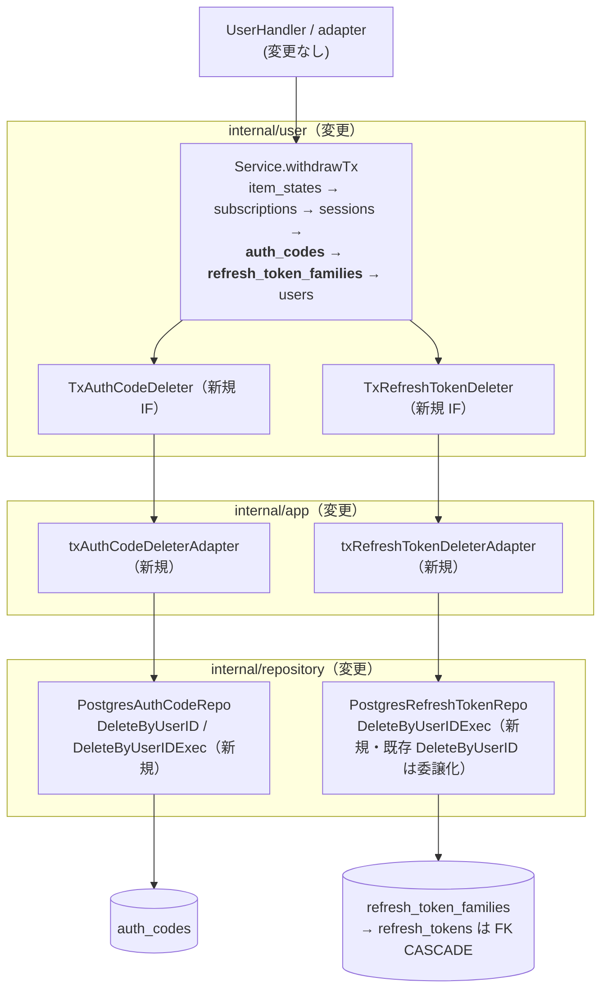

# Design Document

## Overview

**Purpose**: 本 spec はユーザー退会（アカウント削除）フローに、native auth 認証状態
（`auth_codes` / `refresh_tokens` / `refresh_token_families`、Issue #164 で導入）の明示削除を
統合する。退会完了後、当該ユーザーの native auth 認証状態は永続化層に残存しない。

**Users**: Feedman 運用者（削除済みアカウントの認証情報残存リスクの排除）と退会ユーザー
（アカウント消去の完全性）。他ユーザー・既存 API の挙動には影響しない。

**Impact**: 既存の退会トランザクション（`user.Service.withdrawTx`）に削除 2 段
（auth_codes → refresh_token_families）を挿入する。DB スキーマ上は FK `ON DELETE CASCADE`
により users 行削除で 3 テーブルとも自動削除されるが、feedman-ios `design/SERVER.md` §1.5 の
「退会トランザクションに明示 DELETE を追加すること（CASCADE でも担保されるが明示推奨）」に
従い、既存の他リソース削除（item_states / subscriptions / sessions）と**同一のパターン**で
明示削除を統合する。新規 migration なし・新規エンドポイントなし・退会 API の応答変更なし。

### Goals

- 退会トランザクション内での当該ユーザーの auth_codes / refresh_token_families
  （配下 refresh_tokens は FK CASCADE で連動削除）の明示削除（Req 1.1, 1.2, 2.1）
- 既存退会フローの削除順序・トランザクション境界・エラー処理・応答形式の完全維持
  （Req 2.2, 2.3 / NFR 1.1）
- `AuthCodeRepository` へのユーザー単位削除メソッドの追加（#164 interface の後方互換拡張）
- 退会後の native auth 認証状態 0 件・他ユーザー非影響をテストで明文化（Req 3.1 / NFR 2.1）

### Non-Goals

- レガシー（非トランザクション）退会パス `withdrawLegacy` への明示削除の追加
  （後述「レガシーパスへの非統合」の設計判断を参照。FK CASCADE による削除担保は維持される）
- token endpoint 実装（#166 / #167 / #168）・Bearer middleware（#169）
- 期限切れ auth_codes / refresh_tokens の定期削除 worker
- sessions 等の既存削除対象・削除順序の変更、退会 API の応答変更

## Architecture

### 既存退会フローの分析

退会は `user.Service.Withdraw`（`internal/user/service.go`）が担い、2 パス構成:

| パス | 条件 | 構成 |
|---|---|---|
| `withdrawTx`（本番経路） | `txBeginner != nil`（`app.go` の `newTxUserService` は常にこちらを構築） | 単一トランザクションで item_states → subscriptions → sessions → users の順に削除。途中失敗は defer Rollback で全戻し、全成功時のみ Commit |
| `withdrawLegacy`（後方互換） | `txBeginner == nil` | 同順の逐次削除（非原子）。本番 wiring からは使用されない fallback |

`withdrawTx` の各削除段は user パッケージ内の**狭い Tx deleter インターフェース**
（`TxSessionDeleter` 等、シグネチャ `DeleteByUserIDTx(ctx, tx Tx, userID string) error`）で
受け、`internal/app/withdraw_wiring.go` のアダプタが `user.Tx` → `repository.DBTX` 変換
（`querierFromTx`）を行って repository の `DeleteByUserIDExec(ctx, q DBTX, userID)` を呼ぶ。
repository 側は「公開 `DeleteByUserID`（`r.db` 使用）+ `DeleteByUserIDExec`（DBTX 注入）」の
2 段構成（`PostgresSessionRepo` が正本パターン）。

本 spec はこのパターンを**そのまま 2 資源分複製**する（新規の抽象・機構は導入しない）。

### Boundary Map



### 削除順序の決定

```
1. item_states              （既存・不変）
2. subscriptions            （既存・不変）
3. sessions                 （既存・不変）
4. auth_codes               （新規挿入）
5. refresh_token_families   （新規挿入。配下 refresh_tokens は family FK の ON DELETE CASCADE）
6. users                    （既存・不変。identities / user_settings は CASCADE）
```

- 既存手順 1〜3・6 の順序・内容・エラー処理は一切変更しない（4〜5 の挿入のみ）
- 新規 4〜5 は「認証状態の削除」として sessions の直後に置き、親行（users）削除の前に
  子テーブルを払い終える既存方針に揃える。手順 4 と 5 の間に FK 依存はなく順序は規約的
  （Cookie session → native auth の認証手段順）
- refresh_tokens を明示 DELETE しない判断は #164 実装の `DeleteByUserID`
  （families の DELETE 1 文 → tokens は FK CASCADE）を踏襲し、挙動等価を保つ

### レガシーパスへの非統合（設計判断）

`withdrawLegacy` には明示削除を追加**しない**:

- 本番 wiring（`app.go`）は常に `newTxUserService`（tx パス）を構築し、レガシーパスは
  `NewService` 経由の後方互換 fallback としてのみ残存する
- レガシーパスでも最終段 `userRepo.DeleteByID` により FK `ON DELETE CASCADE` で native auth
  3 テーブルの行は削除される（Req 1 の観測可能な結果は DB 防衛線で満たされる）
- レガシーパスへの追加は `NewService` のシグネチャ変更ないしフィールド追加を伴い、
  「後方互換のためシグネチャを維持する」という同パスの存在意義と矛盾する

## Technology Stack

| レイヤ | 技術 | 備考 |
|---|---|---|
| トランザクション共有 | 既存 `repository.DBTX` / `SQLTx` / `querierFromTx` | 新規抽象なし。退会 tx 化（`docs/specs/13--withdraw-db/`）で導入済みの機構をそのまま使用 |
| 削除 SQL | `DELETE FROM auth_codes WHERE user_id = $1` / `DELETE FROM refresh_token_families WHERE user_id = $1` | refresh_tokens は family FK の ON DELETE CASCADE。0 行 DELETE も成功（冪等） |
| スキーマ | 変更なし（migration 追加なし） | #164 の FK ON DELETE CASCADE を防衛線として温存（NFR 1.3） |

## File Structure Plan

```
internal/
├── repository/
│   ├── interfaces.go                          # 変更: AuthCodeRepository に DeleteByUserID を追加
│   ├── postgres_auth_code_repo.go             # 変更: DeleteByUserID / DeleteByUserIDExec を追加
│   ├── postgres_auth_code_repo_db_test.go     # 変更: ユーザー単位削除のサブテストを追加
│   ├── postgres_refresh_token_repo.go         # 変更: DeleteByUserIDExec を追加し既存 DeleteByUserID を委譲化
│   └── postgres_refresh_token_repo_db_test.go # 変更: Exec 変種（tx 参加 / 他ユーザー非影響）のサブテストを追加
├── user/
│   ├── service.go                             # 変更: TxAuthCodeDeleter / TxRefreshTokenDeleter を追加、
│   │                                          #       NewServiceWithTx 拡張、withdrawTx へ削除 2 段を挿入
│   └── service_test.go                        # 変更: 呼び出し順 / Rollback / nil スキップのケースを追加
└── app/
    ├── withdraw_wiring.go                     # 変更: 2 アダプタ追加・newTxUserService 引数拡張
    └── app.go                                 # 変更: PostgresRefreshTokenRepo の構築と newTxUserService への引き渡し
```

## Requirements Traceability

| Req | 設計要素 |
|---|---|
| 1.1 | withdrawTx 手順 4（`TxAuthCodeDeleter` → `txAuthCodeDeleterAdapter` → `PostgresAuthCodeRepo.DeleteByUserIDExec`） |
| 1.2 | withdrawTx 手順 5（`TxRefreshTokenDeleter` → `txRefreshTokenDeleterAdapter` → `PostgresRefreshTokenRepo.DeleteByUserIDExec`。tokens は FK CASCADE で連動削除） |
| 2.1 | 手順 4〜5 を既存共有トランザクション（`user.Tx`）上で実行する（新規 tx を開始しない） |
| 2.2 | 手順 4 / 5 のエラーは `%w` wrap で即 return → defer Rollback（既存手順 1〜3 と同一のエラー処理パターン） |
| 2.3 | 手順 6（users 削除）・Commit の失敗も同一の defer Rollback で手順 4〜5 を未確定に戻す |
| 3.1 | 削除 SQL の `WHERE user_id = $1` スコープ + DB 結合テストでの他ユーザー行残存検証 |
| NFR 1.1 | handler / adapter / 退会 API 応答の変更なし（`user.Service` 内部への挿入のみ） |
| NFR 1.2 | `AuthCodeRepository` 既存 3 メソッド・`RefreshTokenRepository` interface・発行系経路は不変。`DeleteByUserID` の委譲化は挙動等価 refactor（SQL・エラー message 不変） |
| NFR 1.3 | migration 追加なし（File Structure Plan に migration ファイルが含まれない） |
| NFR 2.1 | Testing Strategy 6（退会フロー相当の統合検証: native auth 3 テーブル 0 件 + 他ユーザー残存） |

## Components and Interfaces

### repository.AuthCodeRepository（interface 拡張）

#164 導入の interface（`internal/repository/interfaces.go`）に 1 メソッドを追加する
（既存 Create / FindByHash / MarkUsed は不変）:

```go
// DeleteByUserID は当該ユーザーに属する全ての auth_code を削除する。
// 対象 0 件でも成功する（冪等）。FK ON DELETE CASCADE で users 削除時にも到達するが、
// 退会フローからの明示的削除経路として提供する（RefreshTokenRepository.DeleteByUserID と対）。
DeleteByUserID(ctx context.Context, userID string) error
```

**後方互換性**: 本 interface の実装は `PostgresAuthCodeRepo` のみ（compile-time check
`var _ AuthCodeRepository = (*PostgresAuthCodeRepo)(nil)` で担保）。利用側は
インターフェース分離により狭い IF（#165 の `auth.AuthCodeCreator` = Create のみ、
#166 設計の `auth.AuthCodeConsumer` = FindByHash / MarkUsed のみ）へ依存しており、
メソッド追加の影響を受けない（NFR 1.2）。

### PostgresAuthCodeRepo（実装追加）

```go
// DeleteByUserID は r.db 上で DeleteByUserIDExec を呼ぶ（PostgresSessionRepo と同パターン）。
func (r *PostgresAuthCodeRepo) DeleteByUserID(ctx context.Context, userID string) error

// DeleteByUserIDExec は指定の DBTX（*sql.DB または共有トランザクション）上で
// 当該ユーザーの auth_codes を削除する。
// SQL: DELETE FROM auth_codes WHERE user_id = $1
func (r *PostgresAuthCodeRepo) DeleteByUserIDExec(ctx context.Context, q DBTX, userID string) error
```

- エラー message は `failed to delete auth_codes by user: %w` 形式とし、#164 NFR の方針に
  従い user_id の値を message に含めない

### PostgresRefreshTokenRepo（Exec 変種の追加と委譲化）

```go
// DeleteByUserIDExec は指定の DBTX 上で当該ユーザーの refresh_token_families を削除する。
// 配下の refresh_tokens は family FK の ON DELETE CASCADE により削除される
// （#164 実装と同一の DELETE 1 文）。
func (r *PostgresRefreshTokenRepo) DeleteByUserIDExec(ctx context.Context, q DBTX, userID string) error
```

- 既存 `DeleteByUserID` は `return r.DeleteByUserIDExec(ctx, r.db, userID)` への委譲に
  refactor する（発行 SQL・エラー message は不変 = 挙動等価。`RefreshTokenRepository`
  interface は変更しない）
- `DeleteByUserIDExec` は `PostgresSessionRepo.DeleteByUserIDExec` と同じく**具象型メソッド**
  であり、interface（`interfaces.go`）には載せない（既存 session / subscription /
  item_state の Exec 変種と同じ扱い）

### user.Service（退会 tx への統合）

```go
// TxAuthCodeDeleter は共有トランザクション上で native auth 認可コードを一括削除するインターフェース。
type TxAuthCodeDeleter interface {
	DeleteByUserIDTx(ctx context.Context, tx Tx, userID string) error
}

// TxRefreshTokenDeleter は共有トランザクション上で refresh token（family ごと）を一括削除するインターフェース。
type TxRefreshTokenDeleter interface {
	DeleteByUserIDTx(ctx context.Context, tx Tx, userID string) error
}

// NewServiceWithTx は末尾に引数を 2 つ追加する。
// 呼び出し元は app の newTxUserService と user パッケージ内テストのみ（internal 完結の変更）。
func NewServiceWithTx(
	txBeginner TxBeginner,
	userDeleter TxUserDeleter,
	sessionDeleter TxSessionDeleter,
	subDeleter TxSubscriptionDeleter,
	stateDeleter TxItemStateDeleter,
	authCodeDeleter TxAuthCodeDeleter,         // 追加
	refreshTokenDeleter TxRefreshTokenDeleter, // 追加
) *Service
```

`withdrawTx` は sessions 削除（既存手順 3）の直後・users 削除（既存手順 4 → 新手順 6）の
前に以下を挿入する。既存手順と同じく nil ガード + `%w` wrap + 即 return（defer Rollback が
全戻し）:

```go
// 4. native auth 認可コードを削除
if s.txAuthCodeDeleter != nil {
	if err := s.txAuthCodeDeleter.DeleteByUserIDTx(ctx, tx, userID); err != nil {
		return fmt.Errorf("認可コードの削除に失敗しました: %w", err)
	}
}

// 5. refresh token（family ごと）を削除
if s.txRefreshTokenDeleter != nil {
	if err := s.txRefreshTokenDeleter.DeleteByUserIDTx(ctx, tx, userID); err != nil {
		return fmt.Errorf("refresh token の削除に失敗しました: %w", err)
	}
}
```

- nil ガードは既存 deleter 群（`txStateDeleter` 等）と同じ防御で、テスト・部分構成での
  利用を許容する。本番 wiring（`app.go`）では常に非 nil を注入する
- `Withdraw` の doc comment の削除順序記述を新順序（6 段）に更新する

### app（wiring）

`internal/app/withdraw_wiring.go` に既存アダプタと同型の 2 アダプタを追加する:

```go
// txAuthCodeDeleterAdapter は認可コードリポジトリを user.TxAuthCodeDeleter に適合させる。
type txAuthCodeDeleterAdapter struct{ repo *repository.PostgresAuthCodeRepo }
// DeleteByUserIDTx: querierFromTx(tx) → repo.DeleteByUserIDExec(ctx, q, userID)

// txRefreshTokenDeleterAdapter は refresh token リポジトリを user.TxRefreshTokenDeleter に適合させる。
type txRefreshTokenDeleterAdapter struct{ repo *repository.PostgresRefreshTokenRepo }
// DeleteByUserIDTx: querierFromTx(tx) → repo.DeleteByUserIDExec(ctx, q, userID)
```

- `newTxUserService` の引数に `authCodeRepo *repository.PostgresAuthCodeRepo` /
  `refreshTokenRepo *repository.PostgresRefreshTokenRepo` を追加し、compile-time interface
  checks（`var _ user.TxAuthCodeDeleter = (*txAuthCodeDeleterAdapter)(nil)` 等）も追加する

`internal/app/app.go`:

```go
// リポジトリ初期化部に追加（authCodeRepo は #165 で構築済み）
refreshTokenRepo := repository.NewPostgresRefreshTokenRepo(db)

// 退会サービスの組み立てに 2 repo を追加
userService := newTxUserService(txBeginner, userRepo, sessionRepo, subRepo, itemStateRepo,
	authCodeRepo, refreshTokenRepo)
```

- `PostgresRefreshTokenRepo` の構築は #166 設計（token 交換 wiring）でも予定されている。
  実装が先に merge された側の構築を共用し、重複構築しない（実装時に app.go の現状を確認）

## Data Models

新規モデル・migration なし。関与テーブルと削除経路:

| テーブル | 明示 DELETE | DB 防衛線（FK ON DELETE CASCADE） |
|---|---|---|
| `auth_codes` | 手順 4（`user_id` 直接） | users 削除で CASCADE |
| `refresh_token_families` | 手順 5（`user_id` 直接） | users 削除で CASCADE |
| `refresh_tokens` | なし（手順 5 の family 削除に連動） | families / users 削除で CASCADE |

明示 DELETE と CASCADE の二重化は SERVER.md §1.5 の推奨に基づく。明示削除でアプリレベルの
削除責務を可観測（テスト可能・コードレビュー可能）にしつつ、wiring 漏れ等の事故時も
DB 制約で残存を防ぐ。

## Error Handling

| 状況 | 挙動 | 備考 |
|---|---|---|
| 手順 4 / 5 の削除失敗 | `%w` wrap で即 return → defer Rollback により手順 1〜3 を含む全削除が未確定 | 退会 API は既存どおりの失敗応答（handler 変更なし）。Req 2.2 |
| 手順 6（users 削除）/ Commit の失敗 | 同上（手順 4〜5 も未確定に戻る） | Req 2.3 |
| 対象 0 件（native auth 未使用ユーザー） | 0 行 DELETE は成功（エラーなし） | 既存退会の成功条件に影響しない |

- repository のエラー message に user_id の値を含めない（#164 方針踏襲）
- service 層の wrap message は既存手順と同形式の日本語
  （「認可コードの削除に失敗しました」「refresh token の削除に失敗しました」）

## Testing Strategy

### 単体テスト（user）

1. `service_test.go`: tx 退会成功時に `TxAuthCodeDeleter` / `TxRefreshTokenDeleter` が
   sessions の後・users の前の順で同一 tx 上で呼ばれ、Commit される
   （既存 `txRecorder` / fake deleter パターンを流用）
2. `service_test.go`: 認可コード削除が失敗したとき Rollback され Commit に到達しない /
   refresh token 削除の失敗でも同様
   （既存 `TestService_Withdraw_Tx_RollsBackOnDeleteError` のケース拡張）
3. `service_test.go`: 新規 deleter が nil のとき退会が従来どおり成功する（nil ガード）

### DB 結合テスト（repository）

4. `postgres_auth_code_repo_db_test.go`: `DeleteByUserID` が対象ユーザーの全 auth_codes を
   削除し他ユーザーの行を残す / 対象 0 件でもエラーにならない / `DeleteByUserIDExec` が
   共有 tx に参加し Rollback で削除が取り消される
5. `postgres_refresh_token_repo_db_test.go`: `DeleteByUserIDExec` が tx 上で families +
   配下 tokens を削除（CASCADE）し他ユーザーの family / token を残す / Rollback で取り消される。
   既存 `DeleteByUserID` のサブテストは委譲化後も無変更で green（挙動等価の確認）
6. 退会フロー相当の統合検証: 共有 tx で sessions → auth_codes → refresh_token_families →
   users を削除して Commit した後、当該ユーザーの native auth 3 テーブルが 0 件・他ユーザーの
   行が残存することを検証する（NFR 2.1 の「テストで期待挙動を明示」。users 削除による
   CASCADE 経路に依拠する refresh_tokens の消滅もここで明文化される）

### 回帰

7. 既存の退会単体テスト（user）・退会 API テスト（handler）・#164 の repository DB テストが
   無変更で green であることを確認する（NFR 1.1 / 1.2）

## Security Considerations

- 削除済みユーザーの認証情報（認可コード / refresh token）の残存を排除し、退会後に当該
  ユーザーとして認証され得る状態を断つ（本 spec の主目的）
- 削除 SQL は `WHERE user_id = $1` でスコープし、他ユーザーへの影響を構造的に遮断（Req 3.1）
- user_id の値・token / code の hash 値をログ・エラー message に出さない（#164 方針踏襲）

## Supporting References

- feedman-ios `design/SERVER.md` §1.4（トークン設計）/ §1.5（アカウント削除: 明示 DELETE 推奨）
- Issue #164 spec `docs/specs/164-native-auth/`（repository 契約・FK CASCADE・
  `RefreshTokenRepository.DeleteByUserID` の導入経緯）
- `docs/specs/13--withdraw-db/`（退会のトランザクション化と Tx deleter / wiring アダプタの導入経緯）
