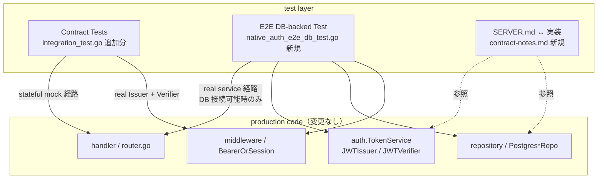

# Design Document

## Overview

**Purpose**: 本機能は native token 認証（親 Issue #163 / サブ Issue #164〜#171）の
**end-to-end な契約整合**を機械的に保証するための **横断契約 / 統合テストレイヤー**と、
iOS 仕様 `feedman-ios/design/SERVER.md` §1 との同期確認文書を整備する。これにより、
複数 Issue にまたがる挙動・JSON 形状・エラー契約・SERVER.md §1 との差分が、後続変更で
気付かないうちに iOS クライアント仕様からずれる事故を防ぐ。

**Users**: Feedman 運用者・サーバー開発者・iOS 実装者。`go test ./...`（CI ジョブ
`backend` 一式）に新規テストが組み込まれ、PR ごとに自動で実行される。SERVER.md §1 と
実装のずれは review 時に `contract-notes.md` を参照することで一目で確認できる。

**Impact**: 既存実装（#164〜#171）の動作は変更しない（テスト追加のみ）。既存テスト
（`internal/handler/integration_test.go` の handler 統合群、`internal/handler/router_test.go`
の Bearer / IP rate limit 群、`internal/auth/*_test.go` の unit 群、`internal/repository/*_db_test.go`
の DB 結合群）の挙動も変えない。新規テスト群は CI の `backend` ジョブで起動された
PostgreSQL 16 service container（既存 `TEST_DATABASE_URL`）に相乗りし、追加インフラを
要求しない。

### Goals

- ネイティブ OAuth callback → `auth_code` 発行 → `POST /api/auth/token` 交換 →
  `POST /api/auth/refresh` rotation → `POST /api/auth/revoke` → Bearer 付き既存 API への
  到達、の **end-to-end 動線**を 1 つの実物経路（real `auth.TokenService` + real `JWTIssuer` +
  real `JWTVerifier` + real `PostgresAuthCodeRepo` + real `PostgresRefreshTokenRepo`）で通す
  契約テストを 1 件追加する（Req 1.1〜1.6 を 1 経路で同時カバー）
- token 系 JSON 応答契約（フィールド名・型・status・revoke の 204 / ボディなし・native
  callback の Location URL）を **未知フィールド混入なし**まで固定する契約テストを追加する
  （Req 2.1〜2.6）
- 拒否パス契約（auth_code・refresh token・Bearer token の 4 区分すべての拒否理由を
  応答から区別できない uniform 拒否）を契約テストとして固定する（Req 3.1〜3.6）
- 既存 web Cookie セッション認証フローへの後方互換（NFR 2.1 / 2.2）を契約テストとして
  明示する（既存テストで担保されている部分は重複追加しない）
- SERVER.md §1（§1.3 / §1.4 / §1.5 / §1.8）と実装 #164〜#171 の対照表を
  `contract-notes.md` として記録し、承認済み逸脱（revoke 未認証化 / DB スキーマ差分）を
  明文化する（Req 4.1〜4.5）

### Non-Goals

- 新規エンドポイントの追加実装 / 既存実装の挙動変更（テスト・文書のみ）
- 実 Google OAuth プロバイダー / 実 FCM への接続を伴う E2E テスト（NFR 1.1）
- 各 spec（#165〜#171）固有の unit / 内部実装詳細の再検証（NFR 3.1）
- 鍵ローテーション（複数 kid 並行受理）の契約検証（要件 Out of Scope に従う）
- 既存 web Cookie セッション認証フローの新規契約検証（後方互換維持の確認のみ / 要件
  Out of Scope に従う）
- 既存 `integration_test.go` の通しテスト群（callback→exchange / rotation / family revoke /
  revoke 冪等）の置き換え。既存テストは「stateful mock を service 層に注入した handler
  通し」として保持し、本 spec は **stateful mock 経路で漏れている契約観点**（JSON 厳密
  shape / Bearer→API 到達 / Bearer 拒否 4 区分）を追加するか、**実物 service 経路**で 1
  経路通す形で補完する

## Architecture

### Existing Architecture Analysis

本 spec が動作する範囲は既存 architecture の **延長線上**であり、新たなアーキテクチャ
パターンを導入しない。尊重すべき既存境界:

- **handler 層**（`internal/handler/`）: HTTP I/O + chi router 構成。既存 test pattern は
  `httptest.NewRecorder()` + `RouterDeps` 経由の `NewRouter` 起動。`integration_test.go` は
  `createIntegrationRouter` / `createNativeAuthIntegrationRouter` 2 種のヘルパーで「stateful
  mock を service 層に注入した router」を組み立てる。本 spec の handler/integration 層追加
  テストはこの pattern に従う
- **service 層**（`internal/auth/`）: `auth.TokenService` / `auth.Service` / `auth.JWTIssuer`
  / `auth.JWTVerifier` がドメインロジック。最小 IF（`AuthCodeConsumer` / `RefreshTokenStore`
  / `AccessTokenIssuer`）を経由した interface segregation 設計のため、real service 経路で
  unit 純粋ロジックを再検証する必要はない（unit は既存 `*_test.go` で完結）
- **repository 層**（`internal/repository/`）: `PostgresAuthCodeRepo` / `PostgresRefreshTokenRepo`
  が DB 結合テスト（`*_db_test.go`）で個別に検証済み。`TEST_DATABASE_URL` env で接続先を
  切替可能。未到達時 `t.Skipf` で silent skip する慣行
- **middleware 層**（`internal/middleware/`）: `BearerOrSessionMiddleware` が Bearer 認証を
  実装。Bearer → context user ID 注入 → 既存 API hander 透過動作の round-trip は
  `router_test.go` の `TestNewRouter_BearerAuth_IssuerVerifierRoundTrip` で確認済み

維持すべき統合点:

- `RouterDeps.NativeAuthHandler == nil` 縮退（fail-closed 404）と `JWTVerifier == nil`
  縮退（Cookie-only fallback）は既存テストで担保済み。本 spec で重複追加しない
- 既存 IP rate limit / max body bytes / CORS / security headers の各 middleware 構成は
  本 spec の追加テストでは触らない（NFR 2.1 / 2.2）

解消・回避する technical debt: なし（テスト追加のみ）。

### Architecture Pattern & Boundary Map

**Architecture Integration**:
- 採用パターン: 既存の **Hexagonal/clean architecture**（handler→service→repo）をそのまま
  踏襲。新規 layer は追加しない
- ドメイン／機能境界: 既存通り。本 spec が触る境界は (a) `handler` パッケージのテスト
  ファイル、(b) `internal/handler/contract` 等のサブパッケージは作らず `internal/handler` に
  追加（既存テスト helper を再利用するため）、(c) `docs/specs/172-...` に notes 文書
- 既存パターンの維持: stateful mock 経路（`createNativeAuthIntegrationRouter` /
  `mockNativeTokenExchangeService`）はそのまま使用し、契約観点の追加を「同 router の
  別 test case」として実装する。実物 service 経路の DB-backed test は
  **新規ファイル**（`internal/handler/native_auth_e2e_db_test.go`）に分離し、DB 不在時の
  `t.Skipf` パターンを repository 層と同型で実装する
- 新規コンポーネントの根拠: なし（test 追加のみ）。新規 production code は導入しない



### Technology Stack

| Layer | Choice / Version | Role in Feature | Notes |
|-------|------------------|-----------------|-------|
| Test runtime | Go 1.25 標準 `testing` パッケージ | 全契約テスト実行 | CI: `go test -p 1 ./...`（既存設定） |
| HTTP test | `net/http/httptest` | `NewRecorder` / `NewRequest` で router を駆動 | 外部ネットワーク不要 / NFR 1.1 |
| JSON 比較 | 標準 `encoding/json` + map 比較 | 厳密フィールド集合の検証 | `json.Decoder.DisallowUnknownFields()` も併用可 |
| JWT 直接組立 | `github.com/golang-jwt/jwt/v5` | 拒否用 token（expired / wrong token_use / wrong signature）の生成 | 既存 `router_test.go` の expired token 生成と同手法 |
| DB | PostgreSQL 16（CI service container） | E2E DB-backed test 用 | `TEST_DATABASE_URL`、`t.Skipf` で未到達時 skip |
| マイグレーション | `internal/database.RunMigrations` | DB 初期化（既存 helper を再利用） | repo DB test と同型のセットアップ |
| SERVER.md 参照 | `/home/hitoshi/github/feedman-ios/design/SERVER.md` | 契約同期確認 | 本 repo 外の文書。同期は contract-notes.md で実施 |

## File Structure Plan

### Directory Structure

```
docs/specs/172-native-auth-contract-tests/
├── requirements.md           # 既存（PM 確定済み）
├── design.md                 # 本ファイル
├── tasks.md                  # 後述
└── contract-notes.md         # 新規: SERVER.md §1 ↔ 実装の対照表 + 承認済み逸脱

internal/handler/
├── integration_test.go       # 既存 — 末尾に契約観点テストを追加（後述）
├── native_auth_e2e_db_test.go  # 新規: real service + real repo + real JWT round-trip
└── router_test.go            # 既存 — 触らない（Bearer / IP rate limit は既存テストで担保）
```

### Modified Files

- `internal/handler/integration_test.go` — **末尾に追加**:
  - `TestContract_TokenResponse_ExactJSONShape`（Req 2.1, 2.3, 2.4 / NFR 1.3）
  - `TestContract_RefreshResponse_ExactJSONShape`（Req 2.2, 2.3, 2.4）
  - `TestContract_RevokeResponse_204AndEmptyBody`（Req 2.5）
  - `TestContract_NativeCallbackLocation_AppSchemeAndAuthCode`（Req 2.6）
  - `TestContract_BearerAccessToken_ReachesProtectedAPI_SameUserAsCookie`（Req 1.5 / NFR 2.1）
  - `TestContract_BearerToken_RejectionUniformity_AllRejectionShapes`（Req 3.5, 3.6 /
    署名不正・期限切れ・token_use 不一致・形式不正 を table-driven で uniform 検証）
  - 既存の `createNativeAuthIntegrationRouter` / `runNativeLoginCallbackAndExchange` を
    そのまま再利用し、新規ヘルパーは原則作らない（追加するのは Bearer round-trip 用の
    最小 wiring helper だけ）
- `internal/handler/native_auth_e2e_db_test.go` — **新規ファイル**:
  - `TestE2E_NativeAuthFullFlow_DBBacked`（Req 1.1〜1.6 を 1 経路で同時カバー）
    - `t.Skipf` パターンで DB 未到達時に skip
    - real `auth.TokenService`（real `PostgresAuthCodeRepo` + real `PostgresRefreshTokenRepo`
      + real `JWTIssuer`）と real `JWTVerifier` を wire し、`createNativeAuthIntegrationRouter`
      では到達できない「token 交換が real DB に永続化される」「real refresh token rotation
      が real DB 上で起こる」「real JWT が real verifier で受理される」までを 1 通し検証
    - 固定鍵（`[]byte("e2e-contract-test-secret-32bytes!")`）と固定 `now` 注入で決定論を
      確保（NFR 1.2 / 1.3）
- `docs/specs/172-native-auth-contract-tests/contract-notes.md` — **新規ファイル**:
  - SERVER.md §1.3（`POST /api/auth/token` / `/refresh` / `/revoke` の req/res JSON 契約）↔
    実装の対照表
  - SERVER.md §1.4（token 寿命・形式）↔ 実装の対照表
  - SERVER.md §1.5（DB スキーマ）↔ 実装スキーマの対照表
  - SERVER.md §1.8（受け入れ基準）↔ 検証テスト ID の対照表
  - 承認済み逸脱: §1.3 `revoke` を「Bearer 認証下」と記述 vs 実装 #168 で「未認証 +
    token 所持 = 権限」を採用（Req 4.3）
  - 承認済み逸脱: §1.5 `auth_codes` の単一テーブル例 vs 実装 #164 で
    `refresh_token_families` / `refresh_tokens` 2 テーブル分離（Req 4.4）
  - 未承認差分発見時のエスカレーション方針: Issue コメントで人間判断を仰ぐ（Req 4.5）

## Requirements Traceability

| Requirement | Summary | Components | Interfaces | Test Cases |
|-------------|---------|------------|------------|------------|
| 1.1 | callback で `auth_code` 発行 + アプリスキーム redirect | NativeAuthCallback / NativeAuthHandler / TokenService | `GET /auth/google/callback?...&flow=native` | `TestE2E_NativeAuthFullFlow_DBBacked` step1〜2 |
| 1.2 | `POST /api/auth/token` で PKCE 検証 + 本トークン交換 | NativeAuthHandler.Token / auth.TokenService.ExchangeAuthCode | `POST /api/auth/token` | `TestE2E_NativeAuthFullFlow_DBBacked` step3 / 既存 `TestIntegration_NativeAuthFlow_CallbackThenExchangeSucceeds` |
| 1.3 | `POST /api/auth/refresh` rotation 付き再発行 | NativeAuthHandler.Refresh / auth.TokenService.RotateRefreshToken | `POST /api/auth/refresh` | `TestE2E_NativeAuthFullFlow_DBBacked` step4 / 既存 `TestIntegration_RefreshFlow_*` |
| 1.4 | `POST /api/auth/revoke` で refresh token 失効 | NativeAuthHandler.Revoke / auth.TokenService.RevokeRefreshToken | `POST /api/auth/revoke` | `TestE2E_NativeAuthFullFlow_DBBacked` step5 / 既存 `TestIntegration_RevokeFlow_*` |
| 1.5 | Bearer 提示で既存 API が Cookie と同一ユーザーで応答 | BearerOrSessionMiddleware / JWTVerifier | `Authorization: Bearer <jwt>` → `/api/subscriptions` 等 | `TestContract_BearerAccessToken_ReachesProtectedAPI_SameUserAsCookie` / `TestE2E_NativeAuthFullFlow_DBBacked` step6 |
| 1.6 | 全動線が外部ネットワーク・実 Google OAuth・実 FCM 不要 | — | — | 全テストが `httptest` のみ。DB は `TEST_DATABASE_URL` のみ |
| 2.1 | `POST /api/auth/token` 成功応答が 4 フィールド | NativeAuthHandler.Token / tokenResponse | response body | `TestContract_TokenResponse_ExactJSONShape` |
| 2.2 | `POST /api/auth/refresh` 成功応答が 4 フィールド | NativeAuthHandler.Refresh / tokenResponse | response body | `TestContract_RefreshResponse_ExactJSONShape` |
| 2.3 | `token_type` フィールド値が `Bearer` | NativeAuthHandler / tokenResponse | response body | 上 2 件で同時アサート |
| 2.4 | `expires_in` フィールド値が 900 | NativeAuthHandler / tokenResponse | response body | 上 2 件で同時アサート |
| 2.5 | `POST /api/auth/revoke` 成功応答が 204 + ボディなし | NativeAuthHandler.Revoke | response status / body length | `TestContract_RevokeResponse_204AndEmptyBody` |
| 2.6 | callback の Location が `feedman://auth/callback?auth_code=<...>` | AuthHandler.handleNativeCallback | `Location` ヘッダ | `TestContract_NativeCallbackLocation_AppSchemeAndAuthCode` |
| 3.1 | 不正 / 期限切れ / 使用済み `auth_code` を拒否 | NativeAuthHandler.Token / TokenService | response status / code | `TestE2E_NativeAuthFullFlow_DBBacked` (unknown / consumed / expired サブケース) |
| 3.2 | PKCE verifier 不一致を拒否 | NativeAuthHandler.Token / TokenService | response status / code | `TestE2E_NativeAuthFullFlow_DBBacked` (wrong verifier サブケース) |
| 3.3 | 不明 / 期限切れ / 失効 / rotation 済み refresh token を拒否 | NativeAuthHandler.Refresh / TokenService | response status / code | `TestE2E_NativeAuthFullFlow_DBBacked` (unknown / rotated サブケース) |
| 3.4 | rotation 済み refresh token 再提示で family 全滅 | TokenService.RotateRefreshToken | response status / code | 既存 `TestIntegration_ReuseDetection_FamilyRevoked` + `TestE2E_NativeAuthFullFlow_DBBacked` (rotated → family-wide reject) |
| 3.5 | Bearer の署名不正 / 期限切れ / 用途不一致 / 形式不正を拒否 | BearerOrSessionMiddleware / JWTVerifier | `/api/subscriptions` 401 | `TestContract_BearerToken_RejectionUniformity_AllRejectionShapes` |
| 3.6 | 拒否応答が原因の別を区別できない | NativeAuthHandler / BearerOrSessionMiddleware | response body | 上記 3.1〜3.5 各テストで同時アサート |
| 4.1 | SERVER.md §1 と実装の整合を記録 | `contract-notes.md` | — | `contract-notes.md` 内容のレビューで確認 |
| 4.2 | 差分を「承認済み逸脱」として明示 | `contract-notes.md` | — | 同上 |
| 4.3 | revoke 未認証化を承認済み逸脱として明文化 | `contract-notes.md` | — | 同上 |
| 4.4 | DB スキーマ差分（テーブル分離）を承認済み逸脱として明文化 | `contract-notes.md` | — | 同上 |
| 4.5 | 未承認差分発見時のエスカレーション方針記録 | `contract-notes.md` | — | 同上 |
| NFR 1.1 | 外部依存なしで完了 | 全テスト | — | `httptest` + 内蔵 `TEST_DATABASE_URL` PostgreSQL のみ |
| NFR 1.2 | 時刻依存を固定時刻注入で決定論的に再現 | JWTIssuer / JWTVerifier / TokenService の `now` field | — | E2E DB test で `time.Time` 固定値を注入 |
| NFR 1.3 | 署名鍵を固定値として注入 | JWTIssuer / JWTVerifier の secret | — | E2E DB test で固定 `[]byte` を注入 |
| NFR 2.1 | 既存 web Cookie セッション動線が変化しない | — | — | 既存 `TestIntegration_AuthFlow_LoginCallbackMeLogout` 等が引き続き green であることで担保 |
| NFR 2.2 | 既存テスト結果が同一に保たれる | — | — | 本 spec は既存テストを変更しない（追加のみ） |
| NFR 3.1 | 各 spec 固有の内部詳細を再検証しない | — | — | 本 design.md で「unit 範囲は既存 `*_test.go` に委譲」を明示 |

## Components and Interfaces

### Test Layer

#### Contract Test Suite (`internal/handler/integration_test.go` 追加分)

| Field | Detail |
|-------|--------|
| Intent | stateful mock 経路で漏れている契約観点（JSON 厳密 shape / Bearer→API 到達 / Bearer 拒否 4 区分 / native callback Location）を追加する |
| Requirements | 1.5, 2.1, 2.2, 2.3, 2.4, 2.5, 2.6, 3.5, 3.6, NFR 2.1 |

**Responsibilities & Constraints**
- 既存 `createNativeAuthIntegrationRouter` / `createIntegrationRouter` / `runNativeLoginCallbackAndExchange`
  ヘルパーを再利用し、独自 router を新規構築しない
- JSON 応答の **厳密フィールド集合**（追加・欠落なし）を `map[string]any` で検証する
  （余剰キーが入っていないことも検証する。`len(body) == 4` 等の総数アサートを併用）
- Bearer round-trip では既存 `router_test.go` の `TestNewRouter_BearerAuth_IssuerVerifierRoundTrip`
  と同様に real `auth.JWTIssuer` + real `auth.JWTVerifier` を組み合わせる
- 拒否 token の生成は既存 `TestNewRouter_BearerAuth_ExpiredTokenWithValidCookie_Returns401`
  と同手法（`jwt.NewWithClaims` + 直接 sign）で行う
- 全テストは外部ネットワーク不要 / DB 不要（NFR 1.1）

**Dependencies**
- Inbound: `go test ./internal/handler` （Critical）
- Outbound: 既存 `createNativeAuthIntegrationRouter` / `RouterDeps` / `auth.JWTIssuer` /
  `auth.JWTVerifier` / `middleware.JWTVerifier` interface（All Critical）
- External: なし

**Contracts**: API [x] / Service [ ] / Event [ ] / Batch [ ] / State [ ]

##### API Contracts under test

| Test | Method | Endpoint | Assertion |
|------|--------|----------|-----------|
| TokenResponse JSON shape | POST | /api/auth/token | 200 / body = {access_token, refresh_token, token_type:"Bearer", expires_in:900} + 余剰キー無 |
| RefreshResponse JSON shape | POST | /api/auth/refresh | 200 / body = {access_token, refresh_token, token_type:"Bearer", expires_in:900} + 余剰キー無 |
| RevokeResponse | POST | /api/auth/revoke | 204 / body 長 0 |
| Native Callback Location | GET | /auth/google/callback?flow=native | 303 / Location = `feedman://auth/callback?auth_code=<one-time-code>` |
| Bearer→Protected API | GET | /api/subscriptions | 200 / userID が JWT sub と一致 |
| Bearer 拒否 uniform | GET | /api/subscriptions | 401 / body 形式・status が 4 区分すべて同一 |

#### E2E DB-backed Test (`internal/handler/native_auth_e2e_db_test.go` 新規)

| Field | Detail |
|-------|--------|
| Intent | callback→exchange→refresh→revoke→Bearer-API の動線を **実物 service + 実物 repository + 実物 JWT** で 1 経路通すゴールデンパス |
| Requirements | 1.1, 1.2, 1.3, 1.4, 1.5, 1.6, 3.1, 3.2, 3.3, 3.4, NFR 1.1, NFR 1.2, NFR 1.3 |

**Responsibilities & Constraints**
- `TEST_DATABASE_URL` で接続可能な PostgreSQL に接続し、未到達時は `t.Skipf` で silent skip
  （`internal/repository/postgres_refresh_token_repo_db_test.go` と同手法）
- `internal/database.RunMigrations` で schema を up し、`auth_codes` / `refresh_token_families`
  / `refresh_tokens` / `users` テーブルを初期化
- real `PostgresAuthCodeRepo` + real `PostgresRefreshTokenRepo` + real `auth.JWTIssuer`
  + real `auth.JWTVerifier` を組み合わせて `auth.TokenService` を構築
- `auth.Service` も real で組み立てるが、`OAuthProvider` だけは外部ネットワークを避けるため
  **fake provider**（`ExchangeCode` が固定 `OAuthUserInfo` を返す軽量実装）を注入する
  （内部に既に test 用 fake 雛形が存在しないため、本ファイル内で 30 行未満の最小実装を置く）
- `auth.JWTIssuer` / `auth.JWTVerifier` / `auth.TokenService` の `now` field を **package-private
  override**（既存 unit test と同じ仕組み）で固定 `time.Time` に差し替え、refresh の expires_at
  境界と access token の exp 境界を決定論で検証する（NFR 1.2）
- 署名鍵を固定 `[]byte("e2e-contract-test-secret-32bytes!")` で注入（NFR 1.3）
- DB テスト並列化は避ける（既存 CI `-p 1` と同じ前提で動く）
- 拒否サブケースは同テスト内で逐次実行する（unknown auth_code / consumed auth_code /
  wrong verifier / unknown refresh token / replay rotated refresh token → family 全滅）

**Dependencies**
- Inbound: `go test ./internal/handler` （DB 到達時のみ）
- Outbound: `auth.TokenService` / `auth.Service` / `JWTIssuer` / `JWTVerifier` /
  `PostgresAuthCodeRepo` / `PostgresRefreshTokenRepo` / `database.RunMigrations`
  / `BearerOrSessionMiddleware` （All Critical）
- External: PostgreSQL（DB 到達時のみ。未到達時 skip）

**Contracts**: API [x] / Service [x] / State [x]

##### Test fixture wiring

```text
db := setupNativeAuthE2EDB(t)           // 既存 setupRefreshTokenTestDB と同型
authCodeRepo := repository.NewPostgresAuthCodeRepo(db)
refreshTokenRepo := repository.NewPostgresRefreshTokenRepo(db)
secret := []byte("e2e-contract-test-secret-32bytes!")
issuer := auth.NewJWTIssuer(secret, "v1-e2e")
verifier := auth.NewJWTVerifier(secret)
tokenService := auth.NewTokenService(authCodeRepo, refreshTokenRepo, issuer)

oauthFake := &fakeOAuthProviderForE2E{ /* 固定 userInfo を返す */ }
authService := auth.NewService(oauthFake, userRepo, identityRepo, sessionRepo, authCodeRepo,
    auth.ServiceConfig{SessionMaxAge: 86400})

deps := &handler.RouterDeps{
    AuthService:       authService,
    AuthConfig:        handler.AuthHandlerConfig{BaseURL: "http://localhost:3000"},
    NativeAuthHandler: handler.NewNativeAuthHandler(tokenService),
    JWTVerifier:       verifier,
    SessionFinder:     &mockSessionFinderForRouter{ ... },
    SubscriptionService: /* 既存 mock を最小 wiring */,
    ...
}
router := handler.NewRouter(deps)
```

##### State transitions checked

| Step | State change | Assertion |
|------|--------------|-----------|
| 1. native login | oauth_state / oauth_native_challenge cookies issued | 307 redirect + 2 Set-Cookie |
| 2. callback | auth_codes row inserted; no session_id cookie | 303 redirect to `feedman://auth/callback?auth_code=...` |
| 3. token exchange | auth_codes.used = true; refresh_token_families / refresh_tokens rows created | 200 / 4 JSON fields / DB row counts |
| 4. refresh | new refresh_tokens row in same family; old token marked rotated | 200 / new pair distinct from old / family_id 同一 |
| 5. revoke | family revoked_at set; subsequent refresh denied | 204 + 401 on retry |
| 6. Bearer → /api/subscriptions | JWTVerifier accepts token; context user_id matches sub | 200 / response derived from sub user |

#### Contract Notes Document (`docs/specs/172-native-auth-contract-tests/contract-notes.md` 新規)

| Field | Detail |
|-------|--------|
| Intent | SERVER.md §1 と実装 #164〜#171 の整合を人間 reviewer が一目で確認できる形で固定する |
| Requirements | 4.1, 4.2, 4.3, 4.4, 4.5 |

**Responsibilities & Constraints**
- 既存実装と SERVER.md §1.3 / §1.4 / §1.5 / §1.8 を section ごとに対照表化する
- 「承認済み逸脱」として最低 2 件（revoke 未認証化 / DB スキーマ差分）を明文化する
- 整合確認の過程で未承認差分を見つけた場合は **本 spec で確定させず**、Issue コメントで
  人間判断を仰ぐ旨を末尾に記録する（Req 4.5）
- 日本語ベース（CLAUDE.md 言語方針）

**Dependencies**
- Inbound: review process（人間 reviewer / Architect / Developer 全員）
- Outbound: SERVER.md §1（feedman-ios リポジトリ） / 実装ファイル（`internal/handler/native_auth_handler.go`
  / `internal/auth/token_service.go` / migrations）

**Contracts**: 文書のみ。コードからの import なし

##### Structure

```markdown
# Contract Notes: native auth API ↔ SERVER.md §1

## §1.3 Endpoint contracts

### POST /api/auth/token
| 項目 | SERVER.md §1.3 | 実装 | 整合 |
| Request | {auth_code, code_verifier} | tokenRequest (snake_case) | ✓ |
| Response | {access_token, refresh_token, token_type:"Bearer", expires_in:900} | tokenResponse | ✓ |
| Error | 400 INVALID_GRANT | invalidGrantError() | ✓ |

### POST /api/auth/refresh
（同型の対照表）

### POST /api/auth/revoke
（同型の対照表 + 承認済み逸脱 4.3）

## §1.4 Token design
（access JWT 15 分 / refresh opaque 30 日 / 承認済み逸脱なし）

## §1.5 DB schema
（テーブル分離の承認済み逸脱 4.4）

## §1.8 受け入れ基準 ↔ テスト ID
| 受け入れ基準 | 対応テスト |
| 既存 Web (Cookie) 変更なし | TestIntegration_AuthFlow_LoginCallbackMeLogout 等 |
| flow=native が auth_code を返す | TestContract_NativeCallbackLocation_... + TestE2E_... |
| POST /api/auth/token が PKCE 検証 | TestE2E_NativeAuthFullFlow_DBBacked step3 |
| POST /api/auth/refresh rotation + family 失効 | 既存 TestIntegration_ReuseDetection_FamilyRevoked + TestE2E_... |
| Bearer 付き既存 API が Cookie と同結果 | TestContract_BearerAccessToken_ReachesProtectedAPI_... + TestE2E_... step6 |
| 退会で refresh_tokens / auth_codes 削除 | 既存 TestPostgresWithdrawIntegration_DB (#170) |

## 承認済み逸脱
- 4.3 revoke 未認証化（#168 で採用 / RFC 7009 §2.1 public client 慣行）
- 4.4 DB スキーマ分離（#164 で `refresh_token_families` 追加）

## 未承認差分エスカレーション方針
（Req 4.5）
```

## Data Models

本 spec はテスト追加のみで、ドメインモデルや DB スキーマには一切変更を加えない。
SERVER.md §1 と実装 #164〜#171 の **対照**のみを `contract-notes.md` で固定する。

参照する既存モデル:
- `model.AuthCode` / `model.RefreshTokenFamily` / `model.RefreshToken`（#164 で導入）
- `model.User` / `model.Session`（既存）

E2E DB-backed test 中の **fixture seed**:
- `users` 1 行（fake OAuth provider が返す sub と紐付ける）
- 他の `feeds` / `subscriptions` 等は最小限（Bearer→`/api/subscriptions` 通り抜けの確認に
  必要な範囲のみ。fake `SubscriptionService` を注入する方法も検討するが、real wiring を
  選択する場合は `users` 1 行に紐づく empty subscription 一覧で十分）

## Error Handling

### Error Strategy

本 spec のテストは production code のエラー戦略を検証する側であり、独自のエラーハンドリングを
持たない。検証対象のエラー応答は既存実装の固定 APIError（`invalidRequestError` /
`invalidGrantError` / `invalidRefreshTokenError`）と既存 BearerOrSessionMiddleware の
plain text 401 で、それぞれの応答 shape が **uniform**（拒否理由を区別できない）ことを
契約として固定する。

### Error Categories and Responses

| 拒否カテゴリ | 期待される応答 | 検証テスト |
|---|---|---|
| auth_code 不明 / 期限切れ / 使用済み / verifier 不一致 | 400 / `code:INVALID_GRANT` / category:auth / message が原因を区別しない | `TestE2E_NativeAuthFullFlow_DBBacked` 拒否サブケース |
| refresh token 不明 / 期限切れ / 失効 / rotation 済み | 401 / `code:INVALID_REFRESH_TOKEN` / 同上 | `TestE2E_NativeAuthFullFlow_DBBacked` 拒否サブケース + 既存 `TestIntegration_RefreshFlow_*` |
| Bearer 署名不正 / 期限切れ / token_use 不一致 / 形式不正 | 401 / plain text `unauthorized` / body 完全同一 | `TestContract_BearerToken_RejectionUniformity_AllRejectionShapes`（4 サブケースを table-driven） |
| revoke 不明 token | 204 / body なし（成功と同一） | `TestE2E_NativeAuthFullFlow_DBBacked` revoke unknown サブケース + 既存 `TestIntegration_RevokeFlow_*` |

各拒否テストでは応答 body の `message` フィールドに **原因区別語**（"used" / "expired" /
"rotated" / "revoked" / "signature" 等）が含まれていないことを `strings.Contains` 否定で
アサートする（Req 3.6 / 既存テストと同方針）。

## Testing Strategy

### Unit Tests

本 spec は unit テストを追加しない。各 spec（#165〜#171）の unit 範囲は対応する
`*_test.go` で完結している（NFR 3.1）。

### Integration / Contract Tests（`internal/handler/integration_test.go` 追加分）

外部ネットワーク・DB 不要。`go test ./internal/handler` で実行される。

1. `TestContract_TokenResponse_ExactJSONShape` — `POST /api/auth/token` 200 応答の
   フィールド集合 {access_token, refresh_token, token_type:"Bearer", expires_in:900} を
   厳密に固定（余剰キー混入を `len(body) == 4` で除去）（Req 2.1, 2.3, 2.4）
2. `TestContract_RefreshResponse_ExactJSONShape` — `POST /api/auth/refresh` 200 応答の
   同フィールド集合を厳密に固定（Req 2.2, 2.3, 2.4）
3. `TestContract_RevokeResponse_204AndEmptyBody` — `POST /api/auth/revoke` 成功時の
   204 + body 長 0 を契約として固定（Req 2.5）
4. `TestContract_NativeCallbackLocation_AppSchemeAndAuthCode` — callback の Location が
   `feedman://auth/callback?auth_code=<one-time-code>` 形式であることを正規表現または
   prefix 一致 + クエリ抽出で固定（Req 2.6）
5. `TestContract_BearerAccessToken_ReachesProtectedAPI_SameUserAsCookie` — 同一 userID で
   発行した JWT を Bearer として `/api/subscriptions` に提示し、Cookie 経由（同 userID）
   と同一の応答（userID コンテキストが同じ）を得ることを契約として固定（Req 1.5 /
   NFR 2.1）
6. `TestContract_BearerToken_RejectionUniformity_AllRejectionShapes` — 4 拒否区分（署名
   不正 / 期限切れ / token_use 不一致 / 形式不正）を table-driven で発生させ、すべて 401 +
   完全同一の応答 body を返すことを契約として固定（Req 3.5, 3.6）

### E2E Tests（`internal/handler/native_auth_e2e_db_test.go` 新規 / DB 必須）

`TEST_DATABASE_URL` 到達時のみ実行（未到達時 `t.Skipf`）。

7. `TestE2E_NativeAuthFullFlow_DBBacked` — 1 つのテスト関数内で以下 step を逐次実行
   （Req 1.1〜1.6, 3.1〜3.4, NFR 1.1〜1.3）:
   - step1: native login で 2 Cookie 取得
   - step2: callback → 303 + Location（real `PostgresAuthCodeRepo.Create` 経由）
   - step3: token 交換 → 200 + DB の auth_codes.used=true / refresh_tokens 1 行
   - step3-reject: unknown auth_code / consumed auth_code / wrong verifier を順次拒否
   - step4: refresh → 200 + 新 token pair / 旧 token は MarkRotated 済み
   - step4-reject: rotated 済み旧 token 再提示 → 401 + family revoked / 新世代 token も 401
   - step5: 新 family を再構築（revoke 用に再 callback → exchange）→ revoke 204 → 同 token
     で refresh → 401 / 同 token で revoke 再実行 → 204（冪等）
   - step6: ステップ 3 で発行された JWT を Bearer として `/api/subscriptions` に提示
     → 200（real `JWTVerifier` 経路）

### Performance / Load

対象外（本 spec の検証範囲は契約整合のみ）。

## Optional Sections

### Security Considerations

本 spec はテスト追加のみで production code を変更しないため、追加のセキュリティ影響を
持たない。固定鍵 `[]byte("e2e-contract-test-secret-32bytes!")` はテストコード内に直接
記述するが、これは production secret ではなく、リポジトリの既存テストパターン
（`router_test.go` の `[]byte("router-roundtrip-secret-32bytes-x")` と同型）に準拠する。

`contract-notes.md` には平文 token / 認証情報 / OAuth client secret は一切含めない。

### Supporting References

- 要件: `docs/specs/172-native-auth-contract-tests/requirements.md`
- iOS 仕様正本: `/home/hitoshi/github/feedman-ios/design/SERVER.md` §1
- 既存実装（変更しない）:
  - #165 native callback: `internal/auth/native.go` / `internal/handler/auth_handler.go`
  - #166 token exchange: `internal/auth/token_service.go` / `internal/handler/native_auth_handler.go`
  - #167 refresh rotation: 同上
  - #168 revoke + family revoke on reuse: 同上
  - #169 BearerOrSessionMiddleware + JWTVerifier: `internal/middleware/bearer_or_session.go`
    / `internal/auth/jwt_verifier.go`
  - #170 withdraw cleanup: `internal/repository/postgres_withdraw_integration_db_test.go`
  - #171 unauthIPMW: `internal/handler/router.go`
- 既存テスト資産（重複させない）:
  - `internal/handler/integration_test.go`（stateful mock 経路の通し）
  - `internal/handler/router_test.go`（Bearer round-trip / IP rate limit）
  - `internal/repository/postgres_refresh_token_repo_db_test.go` /
    `internal/repository/postgres_auth_code_repo_db_test.go` /
    `internal/repository/postgres_withdraw_integration_db_test.go`（DB 結合）
- CI: `.github/workflows/ci.yml`（`TEST_DATABASE_URL` + `go test -p 1 ./...`）
