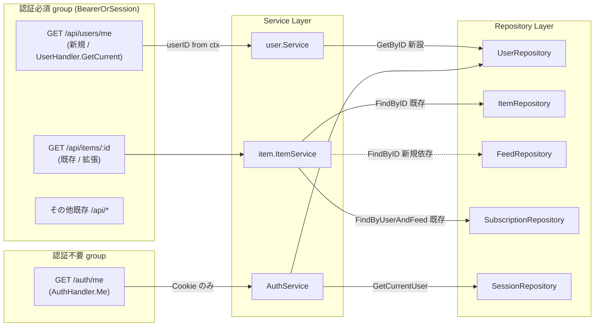

# Design Document

## Overview

**Purpose**: 本機能は Feedman の v1 モバイルクライアント（iOS / Android）に対して、(1)
依存する全エンドポイントを独立した契約文書として明文化し、(2) 現状応答に欠けている 2 項目
（モバイル向け統一ユーザー情報取得エンドポイント・記事詳細応答のフィード表示メタデータ）を
サーバー応答に追加することで、サーバー実装ソースを参照せずにクライアント単独で実装・検証
可能な共通動線を提供する。

**Users**: Feedman の **モバイルクライアント実装者**（iOS / Android）が実装時の参照点として
契約文書を使用し、**モバイル / Web 各クライアント**が認証済み API を呼び出す共通動線として
新規 `GET /api/users/me` と拡張済み `GET /api/items/{id}` を利用する。

**Impact**: 既存 Web Cookie 経路は **完全に非破壊**で維持する（`/auth/me` の URL・応答形状・
認証方式は無変更、既存 `GET /api/items/{id}` の既存応答フィールドはフィールド名・型・null
表現を含めて無変更）。新規エンドポイントと記事詳細応答の新フィールド追加は **加算的変更**
（adding-only）であり、既存テストスイートは追加修正なしに通過する状態を維持する（NFR 1.3）。

### Goals

- モバイル向け統一ユーザー情報取得エンドポイント `GET /api/users/me` を新設し、Bearer
  access token / Web Cookie のいずれの認証経路でも current user 情報を取得可能にする
  （Req 2.1〜2.5）
- 記事詳細エンドポイント `GET /api/items/{id}` 応答に `feed_title` / `feed_favicon_url` の
  2 フィールドを追加する（Req 3.1, 3.2, 3.4）
- 上記 2 点を含む v1 モバイル API 契約を `docs/specs/207--mobile-api-v1-api/mobile-api-contract.md`
  として明文化する（Req 1.1〜1.5 / NFR 2.1, 2.2）
- README の API 一覧に新規エンドポイントと契約文書への参照を追記する（Req 1.6）
- 上記 3 点を Mobile API Contract Test Suite として handler 層の test ファイルに追加する
  （Req 4.1〜4.5 / NFR 3.1）
- 既存 Web Cookie 動線・既存契約フィールドの後方互換を維持する（Req 2.6 / Req 3.3, 3.5 /
  NFR 1.1〜1.3）

### Non-Goals

- Native auth 系エンドポイント（token 発行 / refresh / revoke / native callback）の実装変更
  および契約テストの新規整備（#163 配下 #164〜#171 で実装済み、#172 で end-to-end 契約テスト
  整備済み）。本 spec では契約文書のサマリ記載のみ
- `/api/devices`（デバイス登録）・`/api/keywords`（キーワード通知）の実装。これらは
  キーワードプッシュ通知の次フェーズに該当し、v1 接続確認の必須契約に含めない
- モバイルクライアント（iOS / Android）側の実装変更
- 既存記事一覧 / 検索 / 購読操作 / クロスフィード閲覧エンドポイントの新規フィールド追加
  （契約文書としての固定のみ。応答拡張は本 spec のスコープ外）
- Web フロントエンドの実装変更（モバイル統一ユーザー情報取得エンドポイントを Web からも
  呼び出すかは別 Issue で判断）
- **`users` テーブルへの `avatar_url` カラム追加 / Google OAuth `picture` claim 取得 /
  identities テーブル拡張**。requirement 2.3 / 2.4 は「`avatar_url` を成功応答に含める /
  値がなければ null または省略」を要求するため、本 spec ではフィールドを応答 schema に含め
  当面 `null` を返す（DB 拡張は次フェーズ。詳細は「データモデル / 設計判断」節を参照）

## Architecture

### Existing Architecture Analysis

本 spec は既存 architecture の **延長線上**で動作し、新たなアーキテクチャパターン・新規
ドメイン境界を導入しない。尊重すべき既存規約と取り込み済み前提:

- **handler → service → repository → model の一方向依存**（CLAUDE.md「アーキテクチャと
  機能追加ガイド」§1）。本 spec の追加・変更は全てこの境界を守る
- **認可はサービス層に集約**（同 §1）。`GET /api/users/me` は middleware が解決した
  `userID` を直接利用するためビジネス認可は不要、`GET /api/items/{id}` 拡張は既存
  `item.ItemService.GetItem` 内の `SubscriptionChecker` 認可を **そのまま流用** する
- **BearerOrSession middleware**（Issue #169 / `internal/middleware/bearer_or_session.go`）
  は既に `/api/*` 認証必須グループに適用済み（router.go L237）。`/api/users/me` を同グループ
  配下に置くだけで Bearer / Cookie 両経路が自動で機能する（middleware 改変不要）
- **`/auth/me`** は `SetupAuthRoutes` / NewRouter L193 で「認証不要グループ」配下に置かれ、
  AuthHandler.Me が Cookie 経路のみを評価する。本 spec ではここに一切手を入れない（Req 2.6 /
  NFR 1.1）
- **既存共有ヘルパー**: `model.FaviconDataURL`（生バイト + MIME → data URL）/
  `middleware.UserIDFromContext` / `middleware.WriteErrorResponse` / `handleServiceError` /
  `model.APIError` を再利用し、独自実装を増やさない（CLAUDE.md §4 / §7）
- **interface segregation**: 既存 `item.SubscriptionChecker`（1 メソッドのみの最小
  interface）と同パターンで、本 spec で必要な repository 依存は最小 interface で受ける

### Architecture Pattern & Boundary Map



**Architecture Integration**:

- 採用パターン: 既存 Hexagonal-like layered architecture を維持。ドメインサービス層に最小
  inbound interface を追加し、handler は既存 adapter パターンで service を呼ぶ
- ドメイン境界: `user` ドメインに current user 取得責務を追加（既存 `Withdraw` と同一サービス
  上に同居）。`item` ドメインに feed メタデータ取得依存（`FeedRepository` の `FindByID`
  のみを呼ぶ最小 interface）を追加
- 既存パターンの維持: handler の `UserServiceInterface` / `ItemServiceInterface` 拡張は
  既存 adapter パターン（`service_adapter.go`）に同居させる。`/api/users/me` のルーティング
  登録は既存 `r.Route("/api/users", ...)` ブロック内に追加するだけで完結する
- 新規コンポーネントの根拠: 既存 `AuthHandler.Me` は Cookie 専用かつ `AuthServiceInterface`
  への依存を持ち、Bearer 経路（`UserIDFromContext` 経由）と認証契約が異なる。`/auth/me` を
  そのまま二経路化すると（a）AuthHandler を認証必須グループに移す全面構造変更が必要、
  （b）`/auth/me` の応答契約を変更してしまう、の 2 点で NFR 1.1 / Req 2.6 を破る。よって
  新規ハンドラ `UserHandler.GetCurrent` を `/api/users` route 配下に追加する

### Technology Stack

| Layer | Choice / Version | Role in Feature | Notes |
|-------|------------------|-----------------|-------|
| HTTP Router | chi/v5（既存） | 新規ルート `GET /api/users/me` 登録 | router.go の認証必須グループ既存 `r.Route("/api/users", ...)` ブロックを拡張 |
| Auth Middleware | `middleware.BearerOrSession`（既存 Issue #169） | Bearer / Cookie 両経路を統一処理 | 改変なし。既存配線をそのまま利用 |
| Service Layer | `user.Service` / `item.ItemService`（既存 Go パッケージ） | current user 取得 / 記事詳細での feed メタ取得 | 各サービスに最小メソッド追加 |
| Repository Layer | `lib/pq` + 既存 `PostgresUserRepo` / `PostgresFeedRepo`（既存） | DB アクセス | 新規クエリ追加なし（既存 `FindByID` を再利用） |
| Domain Helper | `model.FaviconDataURL`（既存） | favicon バイト → data URL 整形 | 再利用（`subscription` / `crossfeed` / `itemsearch` と同パターン） |
| Test Framework | 標準 `testing` パッケージ + 既存 `withUserID` / `withChiURLParam` ヘルパー | 契約テスト追加 | 既存テスト規約と同型 |
| Docs | Markdown | mobile-api-contract.md / README 追記 | 既存 spec markdown スタイル |

## File Structure Plan

### Directory Structure

```
internal/
├── handler/
│   ├── user_handler.go             # 変更: UserServiceInterface に GetCurrent 追加 /
│   │                               # UserHandler に GetCurrent メソッド追加 / SetupUserRoutes に GET /me 追加
│   ├── user_handler_test.go        # 変更: GetCurrent 単体テスト追加（Bearer/Cookie 経路で挙動同一 / 401）
│   ├── service_adapter.go          # 変更: UserServiceAdapter.GetCurrent / ItemServiceAdapterFromDomain.GetItem 拡張
│   ├── item_handler.go             # 変更: itemDetailResponse に FeedTitle / FeedFaviconURL 追加
│   ├── item_handler_test.go        # 変更: GetItem 契約テスト（feed_title / feed_favicon_url 含む）
│   ├── router.go                   # 変更: r.Route("/api/users") 配下に GET /me 登録
│   ├── router_full_test.go         # 変更: /api/users/me が認証必須 group に乗っていることの確認 1 件
│   ├── auth_handler.go             # 変更なし
│   └── auth_handler_test.go        # 変更: /auth/me non-regression test を 1 件追加（既存 Cookie 動線維持）
├── user/
│   ├── service.go                  # 変更: user.Service に GetByID(ctx, userID) を追加
│   └── service_test.go             # 変更: GetByID の単体テスト追加
├── item/
│   ├── service.go                  # 変更: item.ItemService に FeedMetaProvider 依存追加 / GetItem で feed メタ取得
│   └── service_test.go             # 変更: GetItem の feed メタ取得を mock した単体テスト追加
├── repository/
│   └── interfaces.go               # 変更なし（既存 UserRepository.FindByID / FeedRepository.FindByID を再利用）
└── app/
    └── app.go                      # 変更: item.NewItemService 呼び出しに feedRepo を追加（最小 interface）

docs/specs/207--mobile-api-v1-api/
├── requirements.md                 # 既存（変更なし）
├── design.md                       # 本ファイル
├── tasks.md                        # 本 spec タスク
└── mobile-api-contract.md          # 新規: v1 モバイル API 契約文書

README.md                           # 変更: API 一覧に GET /api/users/me / native auth / cross-feed / search 追記
```

### Modified Files

| ファイル | 変更内容 | 根拠 |
|---|---|---|
| `internal/handler/user_handler.go` | `UserServiceInterface` に `GetCurrent(ctx, userID) (*currentUserResponse, error)` を追加。`UserHandler.GetCurrent` 実装（`UserIDFromContext` 取得 → service 呼出 → JSON 応答 / 401・404・500）。`SetupUserRoutes` に `GET /me` 登録 | Req 2.1, 2.2, 2.3, 2.4, 2.5 |
| `internal/handler/service_adapter.go` | `UserServiceAdapter.GetCurrent` を追加（`user.Service.GetByID` を呼び `currentUserResponse` に変換）。`ItemServiceAdapterFromDomain.GetItem` の戻り型に `FeedTitle` / `FeedFaviconURL` を populate | Req 2.3, 3.1, 3.2, 3.4 |
| `internal/handler/item_handler.go` | `itemDetailResponse` に `FeedTitle string` (`feed_title`) と `FeedFaviconURL *string` (`feed_favicon_url,omitempty`) を追加。`GetItem` のハンドラロジック自体は変更なし（adapter で populate） | Req 3.1, 3.2, 3.4 |
| `internal/handler/router.go` | 認証必須 group 内 `r.Route("/api/users", ...)` ブロックの先頭に `r.Get("/me", userHandler.GetCurrent)` を追加 | Req 2.1, 2.2 |
| `internal/user/service.go` | `Service` に `GetByID(ctx context.Context, userID string) (*model.User, error)` を追加。実装は `s.userRepo.FindByID(ctx, userID)` を呼ぶだけ。txBeginner パス時は `s.txUserDeleter.FindByID(ctx, userID)` を使う（既存 withdraw と同パターン） | Req 2.1, 2.2 |
| `internal/item/service.go` | `FeedMetaProvider` interface を追加（`FindByID(ctx context.Context, id string) (*model.Feed, error)` のみ）。`ItemService` に `feedRepo FeedMetaProvider` フィールドを追加し、`NewItemService` シグネチャに追加。`ItemDetail` 構造体に `FeedTitle string` / `FeedFaviconURL *string` を追加し、`GetItem` 内で feed 取得 → `model.FaviconDataURL` 整形 | Req 3.1, 3.2, 3.4 |
| `internal/app/app.go` | `item.NewItemService` 呼出しに `feedRepo` を追加（既存変数を渡すだけ） | 新規 service 依存の配線 |
| `internal/handler/user_handler_test.go` | `mockUserService.GetCurrent` 追加。`TestUserHandler_GetCurrent_Success` / `..._NoUserID_ReturnsUnauthorized` / `..._UserNotFound` / `..._OmitsSecrets`（password 等を JSON に含めない） を追加 | Req 4.1, 4.2 |
| `internal/handler/item_handler_test.go` | `TestItemHandler_GetItem_ReturnsFeedMetadata`（feed_title / feed_favicon_url が含まれる）、`TestItemHandler_GetItem_PreservesExistingFields`（既存フィールド全保持）、`TestItemHandler_GetItem_NullFaviconWhenMissing`（favicon 無し → null/省略）を追加 | Req 4.4, 4.5 |
| `internal/handler/auth_handler_test.go` | `TestAuthHandler_Me_CookiePathUnchanged`（`/auth/me` non-regression: Cookie 経路 / 応答形状 `{id, email, name}` のまま）を 1 件追加 | Req 4.3 |
| `internal/handler/router_full_test.go` | `GET /api/users/me` が認証必須 group に乗り、認証情報なしで 401 を返すことを確認する 1 件を追加 | Req 2.1, 2.2, 2.5 |
| `internal/user/service_test.go` | `TestService_GetByID_*`（正常 / NotFound）の単体テストを追加 | Req 4.1, 4.2 |
| `internal/item/service_test.go` | `TestItemService_GetItem_PopulatesFeedMetadata` / `..._NullFaviconWhenFeedHasNone` を追加 | Req 4.4 |
| `docs/specs/207--mobile-api-v1-api/mobile-api-contract.md` | 新規作成（後述「Mobile API Contract Document の構成」） | Req 1.1〜1.5 |
| `README.md` | `## API エンドポイント` 配下の表に `GET /api/users/me` を新設項として記載、Native auth 系（`POST /api/auth/token` / `/refresh` / `/revoke`） / `GET /api/items/cross-feed` / `GET /api/items/search` / `GET /api/feeds/starred/items` / `PUT /api/users/me/cross-feed-last-seen` を一覧に追記、契約文書 `docs/specs/207--mobile-api-v1-api/mobile-api-contract.md` への参照リンクを追加 | Req 1.6 |

## Requirements Traceability

| Requirement | Summary | Components | Interfaces | Tests |
|-------------|---------|------------|------------|-------|
| 1.1 | 共通方針記載 | mobile-api-contract.md | — | （文書） |
| 1.2 | native auth サマリ + 既存 spec 参照 | mobile-api-contract.md | — | （文書） |
| 1.3 | 統一ユーザー情報 URL/認証/応答 | mobile-api-contract.md / UserHandler.GetCurrent | currentUserResponse | （文書 + Test 4.1, 4.2） |
| 1.4 | 一覧/詳細/検索/購読/クロスフィード契約 | mobile-api-contract.md | 既存各 handler のレスポンス型 | （文書） |
| 1.5 | v1 スコープ外明示 | mobile-api-contract.md「v1 スコープ外」節 | — | （文書） |
| 1.6 | README 追記 | README.md | — | — |
| 2.1 | Bearer で current user 返却 | UserHandler.GetCurrent + BearerOrSession | UserServiceInterface.GetCurrent | Test 4.1 |
| 2.2 | Cookie で current user 返却 | UserHandler.GetCurrent + BearerOrSession (Cookie 委譲) | 同上 | Test 4.2 |
| 2.3 | id/email/name/avatar_url を含む | currentUserResponse | currentUserResponse JSON tags | Test 4.1, 4.2 |
| 2.4 | avatar_url 欠落時 null/省略 | currentUserResponse (`*string` + `omitempty`) | 同上 | Test 4.1, 4.2 |
| 2.5 | 未認証時拒否 | BearerOrSession middleware（既存）+ UserIDFromContext 失敗 401 | — | router_full_test の認証 group 確認 + handler test の no-userID 401 |
| 2.6 | /auth/me 不変 | AuthHandler.Me（変更なし） | 既存 `{id, email, name}` | Test 4.3 |
| 3.1 | feed_title 含む | itemDetailResponse + ItemServiceAdapter | itemDetailResponse | Test 4.4 |
| 3.2 | feed_favicon_url 含む | 同上 + model.FaviconDataURL | itemDetailResponse | Test 4.4 |
| 3.3 | 既存フィールド維持 | itemDetailResponse 既存フィールド | itemDetailResponse | Test 4.5 |
| 3.4 | favicon 無し → null/省略 | `FeedFaviconURL *string` + `omitempty` | itemDetailResponse | item_handler_test の null ケース |
| 3.5 | 購読外時の拒否応答不変 | item.ItemService.GetItem の既存 SubscriptionChecker 認可 | 既存 ITEM_NOT_FOUND | item_handler_test の既存 fixture 流用 |
| 4.1 | Bearer で current user テスト | user_handler_test | — | TestUserHandler_GetCurrent_Bearer |
| 4.2 | Cookie で current user テスト | user_handler_test（ハンドラレベルでは同一経路 / withUserID 共通） | — | TestUserHandler_GetCurrent_Cookie |
| 4.3 | /auth/me 不変テスト | auth_handler_test | — | TestAuthHandler_Me_CookiePathUnchanged |
| 4.4 | 記事詳細 feed メタ含むテスト | item_handler_test | — | TestItemHandler_GetItem_ReturnsFeedMetadata |
| 4.5 | 既存フィールド維持テスト | item_handler_test | — | TestItemHandler_GetItem_PreservesExistingFields |
| NFR 1.1 | 既存 URL/認証/応答不変 | 全変更箇所が加算のみ | — | 既存テスト全通過 |
| NFR 1.2 | 既存フィールド不変 | itemDetailResponse 既存フィールド名・型・null 表現不変 | — | Test 4.5 |
| NFR 1.3 | 既存テスト追加修正なし | — | — | `go test ./...` で確認 |
| NFR 2.1 | 文書独立可読性 | mobile-api-contract.md 全節 | — | — |
| NFR 2.2 | v1 内 / 次フェーズ明示区別 | 同 v1 / 次フェーズ節 | — | — |
| NFR 3.1 | 標準コマンド実行可能 | 全テストは `go test ./...` 対象 | — | — |

## Components and Interfaces

### Handler Layer

#### UserHandler.GetCurrent（新規）

| Field | Detail |
|-------|--------|
| Intent | モバイル / Web の両クライアント向けに current user 情報を JSON で返す |
| Requirements | 2.1, 2.2, 2.3, 2.4, 2.5 |

**Responsibilities & Constraints**

- `middleware.UserIDFromContext` で `userID` を取得（失敗 → 401 `UNAUTHORIZED`、既存
  `UserHandler.Withdraw` と完全同一の error pattern）
- `UserServiceInterface.GetCurrent(ctx, userID)` を呼び、結果を `currentUserResponse` として
  JSON 出力
- 認証ヘッダ / Cookie の判別は middleware 側（BearerOrSession）の責務であり handler は意識
  しない（Req 2.1 / 2.2 を「同一 handler で両経路」として実現する）

**Dependencies**

- Inbound: chi router（`/api/users/me`）
- Outbound: `UserServiceInterface.GetCurrent` — current user 取得（Critical）
- External: なし

**Contracts**: Service [x] / API [x]

##### API Contract

| Method | Endpoint | Request | Response | Errors |
|--------|----------|---------|----------|--------|
| GET | `/api/users/me` | （body なし。Authorization: Bearer または Cookie session_id を提示） | `200 {"id":string,"email":string,"name":string,"avatar_url":string\|null}` | `401` 未認証 / `404 USER_NOT_FOUND`（DB 上 user が消失している例外時） / `500` 内部エラー |

##### Service Interface（handler 内）

```go
// UserServiceInterface（既存）に追加するメソッド:
type UserServiceInterface interface {
    Withdraw(ctx context.Context, userID string) error
    // GetCurrent は当該 userID の current user 情報を返す。
    // userID は middleware が解決したものを渡す。userID 不正・未存在は
    // model.NewUserNotFoundError() を返す。
    GetCurrent(ctx context.Context, userID string) (*currentUserResponse, error)
}

type currentUserResponse struct {
    ID        string  `json:"id"`
    Email     string  `json:"email"`
    Name      string  `json:"name"`
    AvatarURL *string `json:"avatar_url,omitempty"` // 値不在時は省略（Req 2.4）
}
```

- Preconditions: `ctx` 内に `userID` が注入済み（BearerOrSession 通過後）
- Postconditions: 成功時は当該 userID の `User` を返す。secret（hashed token・session_id 等）
  をレスポンスに含めない（CLAUDE.md「機能追加チェックリスト」）
- Invariants: 応答 JSON のキー集合は `{id, email, name}` ⊆ X ⊆ `{id, email, name, avatar_url}`
  （avatar_url は `null` 値時に省略可、他 3 フィールドは必須）

#### ItemHandler.GetItem（拡張）

| Field | Detail |
|-------|--------|
| Intent | 記事詳細応答に feed メタデータ（title / favicon）を含めて返す |
| Requirements | 3.1, 3.2, 3.3, 3.4, 3.5 |

**Responsibilities & Constraints**

- handler 本体（`item_handler.go` の `GetItem` メソッド）のフロー・認可は不変。応答型の
  `itemDetailResponse` に 2 フィールドを追加するだけ
- 認可（購読確認）と存在秘匿は既存 `item.ItemService.GetItem` の `SubscriptionChecker` で
  実施済み。本拡張で挙動を変えない（Req 3.5）

**Dependencies**

- Inbound: chi router（`/api/items/{id}`）
- Outbound: `ItemServiceInterface.GetItem`（既存 / 拡張）— 戻り型に feed メタを含めて返す
- External: なし

**Contracts**: API [x]

##### API Contract（既存 + 拡張）

| Method | Endpoint | Request | Response（拡張） | Errors |
|--------|----------|---------|------------------|--------|
| GET | `/api/items/{id}` | （path: item ID） | 既存 itemDetailResponse + `feed_title:string`, `feed_favicon_url:string\|null` | 既存と同一: `401` / `404 ITEM_NOT_FOUND`（購読外 or 不在） / `500` |

##### Service Interface（handler 内）

```go
// itemDetailResponse の拡張:
type itemDetailResponse struct {
    itemSummaryResponse              // 既存。id / feed_id / title / link / summary / published_at / is_date_estimated / is_read / is_starred / hatebu_count
    Content        string  `json:"content"`
    Summary        string  `json:"summary"`
    Author         string  `json:"author"`
    FeedTitle      string  `json:"feed_title"`               // 追加 (Req 3.1)
    FeedFaviconURL *string `json:"feed_favicon_url,omitempty"` // 追加 (Req 3.2 / 3.4: null or 省略)
}
```

- Preconditions: 既存と同一
- Postconditions: 既存フィールドの値・型・null 表現は無変更（NFR 1.2 / Req 3.3）
- Invariants: feed が削除された場合は本 spec のスコープ外（item の `FindByID` が成功した時点
  で feed_id は valid 前提。FK 制約により孤立 item は存在しない）

#### AuthHandler.Me（不変 / non-regression）

| Field | Detail |
|-------|--------|
| Intent | 既存 Web Cookie 経路の current user 取得を従来通り維持 |
| Requirements | 2.6 / NFR 1.1 |

**Responsibilities & Constraints**: 一切変更しない。`GET /auth/me` の URL・Cookie 認証方式・
応答形状 `{id, email, name}` を本 spec 導入前と同一に保つ。non-regression test 1 件を追加し、
将来の改修で外れたら即検出する。

### Service Layer

#### user.Service.GetByID（新規）

| Field | Detail |
|-------|--------|
| Intent | userID から current user を取得する純粋な lookup |
| Requirements | 2.1, 2.2 |

**Responsibilities & Constraints**

- `s.userRepo.FindByID(ctx, userID)` を呼ぶ薄い wrapper（既存 `Withdraw` がレガシーパスで
  実施しているのと同一形）
- `txBeginner` が設定されている場合は `s.txUserDeleter.FindByID(ctx, userID)` を使い、トランザクション
  なしで lookup する（既存 withdraw の `txUserDeleter.FindByID` と同一 interface を再利用）
- 見つからない / nil の場合は `model.NewUserNotFoundError()` を返す（既存 `Withdraw` と同パターン）
- ビジネス認可は実施しない（caller userID = lookup userID であり middleware で済んでいる）

**Dependencies**

- Inbound: `UserServiceAdapter.GetCurrent`
- Outbound: `repository.UserRepository.FindByID` / `TxUserDeleter.FindByID` — DB lookup（Critical）

**Contracts**: Service [x]

```go
// user.Service に追加:
// GetByID は指定 userID の current user を返す。
// 認可は呼び出し側（middleware）が担保しており、本メソッドは認可を行わない。
// userID が DB 上に存在しない場合は model.NewUserNotFoundError を返す。
func (s *Service) GetByID(ctx context.Context, userID string) (*model.User, error)
```

#### item.ItemService.GetItem（拡張）

| Field | Detail |
|-------|--------|
| Intent | 既存の認可 + 状態取得に加えて、所属 feed のメタデータ（title / favicon）を併せて返す |
| Requirements | 3.1, 3.2, 3.3, 3.4, 3.5 |

**Responsibilities & Constraints**

- 既存の認可フロー（FindByID → SubscriptionChecker → FindByUserAndItem）は **完全に不変**。
  ITEM_NOT_FOUND を返す条件も不変（Req 3.5）
- 既存処理通過後に `feedRepo.FindByID(ctx, item.FeedID)` を呼び、`Feed.Title` を `FeedTitle`、
  `model.FaviconDataURL(feed.FaviconData, feed.FaviconMime)` を `FeedFaviconURL` として
  `ItemDetail` に populate する
- `feedRepo` は `FeedMetaProvider` 最小 interface（`FindByID` のみ）で受ける（interface
  segregation。既存 `SubscriptionChecker` と同パターン）
- feed が見つからない（NULL）場合は内部不整合とみなし `feedRepo.FindByID` が nil を返したら
  500 を返す方が安全だが、items.feed_id は FK 制約により孤立しないため実運用では発生しない。
  防御的に「nil → FeedTitle 空 / FeedFaviconURL nil」とする選択肢もあるが、本 spec では
  「FindByID が nil なら error として上位に返す」とする（fail-fast / 内部状態の検出）

**Dependencies**

- Inbound: `ItemServiceAdapterFromDomain.GetItem`
- Outbound:
  - `repository.ItemRepository.FindByID` / `ItemStateRepository.FindByUserAndItem`（既存 / Critical）
  - `SubscriptionChecker.FindByUserAndFeed`（既存 / Critical）
  - `FeedMetaProvider.FindByID`（新規 / Critical for メタ取得）
- External: なし

**Contracts**: Service [x]

```go
// item パッケージに新設する最小 interface:
type FeedMetaProvider interface {
    // FindByID は指定 ID のフィードを返す。見つからない場合は nil。
    FindByID(ctx context.Context, id string) (*model.Feed, error)
}

// 既存 ItemService のフィールド + コンストラクタを拡張:
type ItemService struct {
    itemRepo      repository.ItemRepository
    itemStateRepo repository.ItemStateRepository
    subChecker    SubscriptionChecker
    feedRepo      FeedMetaProvider // 新規追加
}

func NewItemService(
    itemRepo repository.ItemRepository,
    itemStateRepo repository.ItemStateRepository,
    subChecker SubscriptionChecker,
    feedRepo FeedMetaProvider, // 新規追加
) *ItemService

// ItemDetail の拡張:
type ItemDetail struct {
    ItemSummary
    Content        string
    Summary        string
    Author         string
    FeedTitle      string  // 新規 (Req 3.1)
    FeedFaviconURL *string // 新規 (Req 3.2 / 3.4)
}
```

- Preconditions: 既存 GetItem と同一
- Postconditions: 認可 / 存在秘匿挙動は不変。成功時のみ feed メタを返す
- Invariants: feed メタ取得失敗時はリクエスト全体を error として返し、レスポンスは送らない
  （部分応答を生成しない）

### Adapter Layer

#### UserServiceAdapter.GetCurrent（新規）

```go
// 既存 UserServiceAdapter（service_adapter.go）にメソッド追加:
func (a *UserServiceAdapter) GetCurrent(ctx context.Context, userID string) (*currentUserResponse, error) {
    u, err := a.svc.GetByID(ctx, userID)
    if err != nil {
        return nil, err
    }
    return &currentUserResponse{
        ID:        u.ID,
        Email:     u.Email,
        Name:      u.Name,
        AvatarURL: nil, // 当面 nil 固定（DB 未拡張 / 詳細は「データモデル」節 / Req 2.4）
    }, nil
}
```

#### ItemServiceAdapterFromDomain.GetItem（拡張）

既存実装に `FeedTitle` / `FeedFaviconURL` のコピーを追加するのみ:

```go
return &itemDetailResponse{
    itemSummaryResponse: itemSummaryResponse{ /* 既存 */ },
    Content:        detail.Content,
    Summary:        detail.Summary,
    Author:         detail.Author,
    FeedTitle:      detail.FeedTitle,      // 追加
    FeedFaviconURL: detail.FeedFaviconURL, // 追加（*string なので nil で省略）
}, nil
```

## Data Models

### Domain Model

#### User（既存。変更なし）

```go
type User struct {
    ID        string
    Email     string
    Name      string
    CreatedAt time.Time
    UpdatedAt time.Time
}
```

#### Feed（既存。再利用）

```go
type Feed struct {
    ID              string
    Title           string
    FaviconData     []byte
    FaviconMime     string
    // ... 既存フィールド
}
```

`Feed.Title` を `feed_title`、`(FaviconData, FaviconMime)` を `model.FaviconDataURL` で
`feed_favicon_url` に変換する。

### Response DTO

#### currentUserResponse（新規 / handler 内 private 型）

| JSON Field | Go Type | Source | Req |
|---|---|---|---|
| `id` | `string` | `User.ID` | 2.3 |
| `email` | `string` | `User.Email` | 2.3 |
| `name` | `string` | `User.Name` | 2.3 |
| `avatar_url` | `*string` (omitempty) | nil 固定（後述設計判断） | 2.3, 2.4 |

#### itemDetailResponse（既存 + 拡張）

| JSON Field | 種別 | Source | Req |
|---|---|---|---|
| 既存 11 フィールド（`id` 〜 `author`） | 既存 | 既存 | 3.3 |
| `feed_title` | 追加 / `string` | `Feed.Title` | 3.1 |
| `feed_favicon_url` | 追加 / `string\|null` (omitempty) | `model.FaviconDataURL(Feed.FaviconData, Feed.FaviconMime)` | 3.2, 3.4 |

### 設計判断: `avatar_url` を当面 nil 固定で返す

**判断**: `users` テーブルへの `avatar_url` カラム追加・Google OAuth `picture` claim 取得・
identities テーブル拡張は本 spec のスコープに **含めない**。`currentUserResponse.AvatarURL`
は `*string` 型として schema には常に存在し、当面 `nil` を返す（JSON では `omitempty` により
省略される）。

**根拠**:

- requirement 2.4 が「JSON null または応答からの省略」を明示的に許容しているため、`nil` 固定
  でも要件は満たされる
- DB スキーマ拡張 / OAuth callback 改修は影響範囲が広く、本 spec の「契約明文化 + サーバ補正」
  というスコープを超える
- 将来 `avatar_url` を実値で返す改修を行う際、`*string` 型と JSON schema は既に確保済みで、
  値を populate する箇所（`UserServiceAdapter.GetCurrent`）のみ変更すれば後方互換に追加できる

**代替案（不採用）**:

- (a) 本 spec で users.avatar_url カラム追加 + OAuth callback で picture claim 保存 →
  影響範囲拡大により Issue 分割の方が健全
- (b) avatar_url を一切応答に含めない → requirement 2.3 違反
- (c) `email` のドメイン部から Gravatar URL を生成 → ユーザー同意なき外部送信であり
  プライバシー方針上不可

**確認事項として PjM に申し送る**: 「将来 `avatar_url` を実値で返す改修を別 Issue として
切るかどうか（OAuth callback で `picture` を保存する設計）」を設計 PR の「確認事項」に
記載する。本 spec では要件 2.4 の「null/省略」を採用する。

### Logical / Physical Data Model

本 spec での DB スキーマ変更・新規テーブル追加・新規カラム追加は **なし**。

## Error Handling

### Error Strategy

既存 `model.APIError` + `middleware.WriteErrorResponse` + `handleServiceError` のパターンを
そのまま踏襲する。新規エラーコードは追加しない（`UNAUTHORIZED` / `USER_NOT_FOUND` /
`ITEM_NOT_FOUND` を再利用）。

### Error Categories and Responses

- **User Errors (4xx)**:
  - `401 UNAUTHORIZED` — `/api/users/me` で `UserIDFromContext` 失敗時（BearerOrSession
    middleware を通過しても context に userID がない異常時のセーフネット）。既存
    `UserHandler.Withdraw` と完全同一のレスポンス
  - `404 USER_NOT_FOUND` — `/api/users/me` で middleware 認証通過後に DB 上の user が
    消失している例外時。`model.NewUserNotFoundError()` → `handleServiceError` → 既存
    パターン
  - `404 ITEM_NOT_FOUND` — `/api/items/{id}` の既存挙動。未購読・不在の両方を同一応答に
    まとめ存在を秘匿する（NFR 1.1 / Req 3.5、既存挙動を変えない）
- **System Errors (5xx)**:
  - `500` — feedRepo の予期せぬ DB エラー / item 詳細取得中の feed lookup 失敗
  - 既存 `handleServiceError` がエラーを `model.APIError` 以外なら 500 に集約する経路を
    そのまま利用
- **Business Logic Errors**: 本 spec の新規ロジックは認可境界を新設しないため、ビジネス
  ルール違反は発生しない

### 認証層のエラー応答

`BearerOrSession` middleware（既存）が以下を返す:

- Authorization 無し + Cookie 無し → 既存 `SessionMiddleware` 経路で 401（`"unauthorized"` plain text）
- Bearer 検証失敗 → 401（`"unauthorized"` plain text、Cookie へ fallback しない）

これらは本 spec の handler に到達する前に処理される（Req 2.5）。本 spec で middleware を
改変しない。

## Testing Strategy

### Unit Tests

- `user.Service.GetByID` 正常系（userID から `*model.User` を返す）
- `user.Service.GetByID` UserNotFound 系（FindByID nil → `model.NewUserNotFoundError()`）
- `item.ItemService.GetItem` 正常系で feed メタが populate されることを mock `FeedMetaProvider`
  で検証
- `item.ItemService.GetItem` favicon なし feed → `FeedFaviconURL` が nil（Req 3.4）
- `item.ItemService.GetItem` 既存認可（購読外 / item 不在）応答が不変であることを確認

### Integration Tests（handler レベル / 既存 fixture 流用）

- `TestUserHandler_GetCurrent_Success`（withUserID で userID 注入 → 200 + JSON）
- `TestUserHandler_GetCurrent_NoUserID_ReturnsUnauthorized`（userID 注入無し → 401）
- `TestUserHandler_GetCurrent_UserNotFound`（service が NewUserNotFoundError → 404）
- `TestUserHandler_GetCurrent_OmitsSecrets`（応答 JSON のキーが `{id, email, name}` ⊆
  X ⊆ `{id, email, name, avatar_url}` であることを assert / NFR セキュリティ）
- `TestItemHandler_GetItem_ReturnsFeedMetadata`（mock service が feed_title / favicon URL を
  返し、JSON に出現する / Req 3.1, 3.2）
- `TestItemHandler_GetItem_PreservesExistingFields`（既存 11 フィールドが全て出現し型不変 / Req 3.3）
- `TestItemHandler_GetItem_NullFaviconWhenMissing`（FeedFaviconURL nil → 応答から省略 / Req 3.4）
- `TestAuthHandler_Me_CookiePathUnchanged`（既存 Cookie 経路で `{id, email, name}` 応答が維持 /
  Req 2.6）
- `TestRouter_GetUsersMe_RequiresAuth`（`router_full_test.go` 追加。`GET /api/users/me` が
  認証必須 group に乗り、Authorization / Cookie 無しで 401 / Req 2.5）

### E2E / Contract Tests

本 spec ではフル E2E は追加せず、handler 統合テストでカバーする（NFR 3.1: 外部接続を要さない /
標準コマンドで実行）。Bearer 経路と Cookie 経路は middleware 層で既に検証済み（#172 で
end-to-end 契約テスト整備済）であり、`/api/users/me` 自体の handler は両経路で同一の
`UserIDFromContext` 経路を通るため二経路のハンドラレベル分岐テストは不要。

### Performance / Load Tests

本 spec の変更は既存クエリの追加（feed FindByID 1 件追加 / user FindByID 1 件追加）に留まり、
性能影響は無視可能。専用負荷テストは追加しない。

## Mobile API Contract Document の構成（`docs/specs/207--mobile-api-v1-api/mobile-api-contract.md`）

本文書は **クライアント実装者がサーバ実装ソースを参照せずに v1 動線を実装可能**な粒度で
記述する（NFR 2.1）。構成案:

1. **概要** — v1 のスコープ・対象クライアント・対象サーバ実装 commit / 日付
2. **共通方針**（Req 1.1）
   - 認証方式: Bearer access token（モバイル） / Cookie session_id（Web）
   - エラー応答形式: `model.APIError` の JSON shape（code / message / category / action）
   - 命名規約: snake_case JSON フィールド / RFC3339 タイムスタンプ / cursor pagination
   - 共通エラーステータス: 400 / 401 / 404 / 422 / 429 / 500
3. **Native Auth エンドポイント**（Req 1.2 / サマリ + 既存 spec 参照）
   - `POST /api/auth/token` — auth_code 交換（詳細 #166 / #172 spec）
   - `POST /api/auth/refresh` — token rotation（詳細 #167 / #172 spec）
   - `POST /api/auth/revoke` — token 無効化（詳細 #168 / #172 spec）
   - `GET /auth/google/login?flow=native&code_challenge=...` — PKCE login（#165）
   - `feedman://auth/callback?auth_code=...` — native callback（#165）
4. **モバイル統一ユーザー情報取得**（Req 1.3）
   - `GET /api/users/me` — URL / 認証方式（Bearer or Cookie）/ 成功応答スキーマ / エラー応答
5. **v1 共通動線エンドポイント**（Req 1.4）
   - `GET /api/feeds/{id}/items` — 記事一覧（cursor / filter）
   - `GET /api/feeds/starred/items` — 全フィード横断スター記事一覧
   - `GET /api/items/{id}` — 記事詳細（**feed_title / feed_favicon_url 含む**）
   - `GET /api/items/search?q=...` — 記事検索
   - `GET /api/items/cross-feed` — 横断新着一覧
   - `GET /api/subscriptions` — 購読一覧
   - `DELETE /api/subscriptions/{id}` — 購読解除
   - `PUT /api/subscriptions/{id}/settings` — フェッチ間隔設定
   - `POST /api/subscriptions/{id}/resume` — 停止フィード再開
   - `POST /api/subscriptions/{id}/fetch` — 手動フェッチ
   - `PUT /api/items/{id}/state` — 既読 / スター状態更新
   - `PUT /api/users/me/cross-feed-last-seen` — 横断一覧の最終閲覧時刻更新
6. **v1 スコープ外（次フェーズ）**（Req 1.5 / NFR 2.2）
   - `/api/devices` — デバイス登録（次フェーズ）
   - `/api/keywords` — キーワード通知（次フェーズ）
   - 上記は v1 クライアントが呼び出さない旨を明示
7. **後方互換ポリシー** — 既存フィールドの削除・改名・型変更を行わない / 追加フィールドの
   みで進化させる旨

## Security Considerations

- **認証スコープ**: `/api/users/me` は `BearerOrSession` middleware を必ず通過させ、未認証
  要求は handler 到達前に 401 で拒否する（Req 2.5）
- **secret 非露出**: `currentUserResponse` には `id` / `email` / `name` / `avatar_url` のみ
  を含め、session_id / refresh_token / hashed token 等は **絶対に含めない**（CLAUDE.md
  「機密情報の扱い」/「機能追加チェックリスト」）
- **エラー応答の最小化**: 内部エラー詳細（SQL エラー / スタックトレース / 内部 URL）を
  レスポンスに含めない。既存 `handleServiceError` の挙動を変えない
- **`/auth/me` の Cookie 動線**: 一切変更しない。HttpOnly / Secure / SameSite=Lax の Cookie
  属性は無変更（Req 2.6 / NFR 1.1）
- **記事詳細の favicon**: 既存 `model.FaviconDataURL` 経由で data URL 化する。生バイトを
  そのまま返さないため、Content-Security-Policy 違反は発生しない（既存 `subscription` /
  `crossfeed` / `itemsearch` と同パターン）

## Migration Strategy

本 spec は **追加のみ**であり破壊的変更を含まない。マイグレーションは不要。クライアント側
の移行（`/auth/me` から `/api/users/me` への切り替え）はモバイルクライアント実装側の別 Issue
で実施する。サーバ側は両エンドポイントを並行提供し続けるため、移行期間中の非対称も問題に
ならない。

## Open Questions / 設計 PR レビュー時の確認事項

設計 PR 本文「確認事項」セクションに以下を記載するよう Project Manager / 運用者に申し送る:

1. **`avatar_url` の実値返却タイミング**: 本 spec では `null` 固定。将来 `users.avatar_url`
   カラム追加 + OAuth callback で `picture` claim 保存を行う改修を別 Issue で起票するか、
   v1 リリースでは null のまま放置するかを決定すること
2. **`/api/users/me` を Web フロントエンドからも呼ぶか**: Web 側は既存 `/auth/me` で動作中。
   モバイル / Web の双方が `/api/users/me` を使う形に統一するかどうかは別 Issue で決定（本
   spec では決定しない / requirements.md Out of Scope）
3. **mobile-api-contract.md の配置場所**: 本 spec では `docs/specs/207--mobile-api-v1-api/`
   配下に配置する案。クライアント実装者が永続参照する文書として `docs/contracts/` のような
   永続的な場所に置くべきかは PjM 判断（本 spec では spec 配下で起票し、必要なら別 PR で
   移動を検討）

## Supporting References

- [chi router v5 - Routing patterns](https://github.com/go-chi/chi#routing-patterns)
  — `r.Route("/api/users", ...)` 配下に `r.Get("/me", ...)` を追加する記法の確認
- 関連 spec:
  - `docs/specs/172-native-auth-contract-tests/design.md` — native auth 契約テストの記述
    パターンを参照
  - Issue #163 / #169 — BearerOrSession middleware の判定フロー
