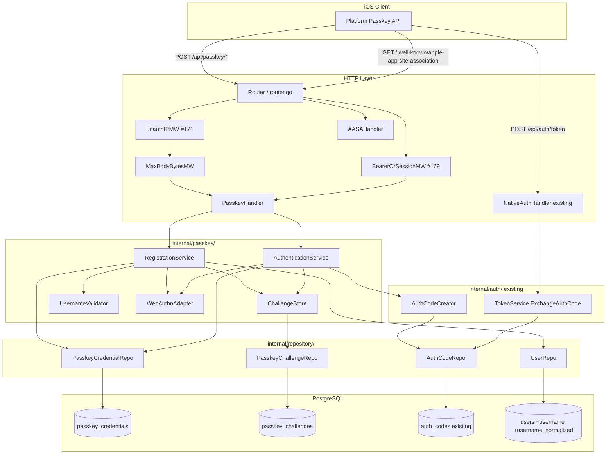
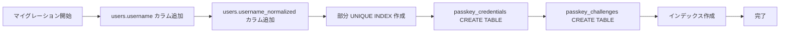

# Design Document

## Overview

**Purpose**: 本機能は Feedman iOS を App Store Review Guideline 4.8 に適合させるための代替
認証（パスキー + ユーザー名）を **サーバ側** に提供する。Google Sign-In 未使用でもアカウント
作成・ログインを完了できる導線と、既存 Google アカウントにパスキーを後付け追加できる導線を
用意し、パスキー認証成功時は **既存の native auth token 交換契約（#163〜#172 で確定）に合流**
させる。

**Users**: Feedman iOS の新規ユーザー（Google アカウントを持たない層 / Google 経由を避けたい
層）と、既に Google 経由で登録済みで iOS ではパスキー主体の運用に切り替えたい既存ユーザー、
そして退会処理・障害対応を担う運用者。

**Impact**: 既存 Google OAuth（Web Cookie / native flow）・native token 交換契約
（`POST /api/auth/token` / `/refresh` / `/revoke`）・退会 cleanup フローは **いずれも
バイト単位で不変** を保ちつつ、認証入口として WebAuthn を追加する。DB スキーマは新規 2 テーブル
（`passkey_credentials` / `passkey_challenges`）と `users` の 2 カラム追加のみで、既存
テーブル構造は変更しない。パスキー機能に関する環境変数が未設定の既存デプロイは、パスキー
endpoint が登録されず（fail-closed）本機能導入前と完全に同一挙動になる（NFR 2.2）。

### Goals

- 主要目標 1: iOS クライアントが「ユーザー名 + パスキー」だけで新規アカウント作成 → 直後の
  パスキー認証 → 既存 auth_code 交換 → Bearer API 到達までを、Google OAuth を通らずに完了できる
- 主要目標 2: 既存 Google アカウント（Google 由来のみ / 既にパスキー登録済み / 併用の各パターン）
  に対して、Google 紐付けを解除・変更せずパスキーを追加登録できる
- 主要目標 3: パスキー認証成功時に発行する auth_code の **契約（60 秒・単回・PKCE 紐付き
  仕様の互換）** が既存 `POST /api/auth/token` の交換ロジックにそのまま合流する（既存契約テスト
  green 維持）
- 成功基準: `docs/specs/172-native-auth-contract-tests/contract-notes.md` の対照表が
  無変更のまま整合し続け、パスキー登録・認証・追加登録・退会 cleanup・IP rate limit の各 AC が
  外部ネットワーク依存なしで検証できる

### Non-Goals

- iOS クライアント側の実装（別 Issue）
- Sign in with Apple / パスワード認証 / メール送信基盤
- Web フロントエンドのパスキーログイン UI（Web は当面 Google OAuth 継続）
- パスキー credential のセルフサービス管理 UI（削除・リネーム・命名等）
- Android platform 用の `assetlinks.json` 配信
- 期限切れ challenge / auth_code の定期削除ワーカー（TTL・単回利用判定で機能上無効化される）
- WebAuthn user verification ポリシーの細分化（platform authenticator 必須・biometric 必須等）
- WebAuthn の attestation 検証を独自実装すること（外部ライブラリを採用する）

## Architecture

### Existing Architecture Analysis

現在の Feedman API は Go + chi + PostgreSQL の 3 層（handler → service → repository → model）
一方向依存を厳格に守り、native auth 基盤（#163〜#172）は既に以下を提供している:

- 既存ドメイン境界:
  - `internal/auth/` — Google OAuth Service（`Service`）と Native Auth Token Service（`TokenService`）
    が共存。Cookie session と Bearer JWT の両認証入口を提供
  - `internal/auth/native.go` — `HandleNativeCallback` が OAuth 認可コードを解決 → `auth_code`
    を hash 保存 → 60 秒 TTL の単回 auth_code を発行する **既存パス**
  - `internal/auth/token_service.go` — `ExchangeAuthCode` / `RotateRefreshToken` /
    `RevokeRefreshToken` の 3 経路。auth_code hash 参照 + 単回消費 → refresh family 発行 →
    JWT access token 発行の一貫フロー
  - `internal/repository/postgres_auth_code_repo.go` — auth_code hash 保存・単回 UPDATE 判定
- 既存統合点:
  - `internal/handler/router.go` の **認証不要グループ**に `POST /api/auth/token|refresh|revoke` が
    `unauthIPMW`（未認証 IP rate limit / #171）+ `NewMaxBodyBytesMiddleware` を通した上で登録
  - `internal/handler/router.go` の **認証必須グループ**に `NewBearerOrSessionMiddleware`
    （#169）が Bearer 優先 / Cookie 委譲の複合認証を提供
  - `internal/app/app.go` の serve wiring で `NATIVE_AUTH_JWT_SECRET` の有無で fail-closed に
    分岐（未設定なら handler nil で router に登録されない）
  - `internal/user/service.go` の `withdrawTx` が単一トランザクション上で
    item_states → subscriptions → sessions → auth_codes → refresh_token_families → user の
    順に削除。deleter は `user.TxXxxDeleter` interface で受け取り、`internal/app/withdraw_wiring.go`
    の adapter が repository を wrap する
- 尊重すべき制約:
  - 認可（user_id スコープ）は service 層に集約。handler / adapter に SQL / 認可を書かない
  - 平文 secret（auth_code / refresh_token / OAuth 認可コード）は永続化・ログ・エラー・レスポンス
    に出さない。ログ追跡は hash 先頭 8 文字のみ
  - fail-closed 縮退: 機能 env が未設定なら handler nil → router に登録されず 404
    （NATIVE_AUTH_JWT_SECRET / MetricsHandler 同パターン）
  - `docs/specs/172-native-auth-contract-tests/contract-notes.md` の対照表を **無変更で
    green 維持**（NFR 2.3）
- 解消・回避する technical debt:
  - `users` テーブルは Google OAuth 前提で `email` / `name` NOT NULL / UNIQUE 制約無しの前提。
    パスキー新規ユーザーは `email = ""`（Req 1.6 でメール未指定許容）で新規作成する必要があるが、
    既存の `HandleCallback` は Google からの email をそのまま保存するため既存 UNIQUE 制約はなく
    競合しない。username は新規カラムで導入し既存カラムに影響を与えない

### Architecture Pattern & Boundary Map

採用パターン: **既存 domain-driven layering の拡張**。新規 `internal/passkey/` ドメインを切り、
WebAuthn ceremony（BeginRegistration / FinishRegistration / BeginLogin / FinishLogin）を担う。
パスキー認証成功時は passkey service が既存 `AuthCodeCreator`（`repository.AuthCodeRepository`）
に直接 auth_code を書き込み、以降は既存 `TokenService.ExchangeAuthCode` が受理する。



**Architecture Integration**:
- 採用パターン: 既存 domain-per-directory + interface segregation を踏襲。
  `internal/passkey/` を独立ドメインとして切り、`internal/auth/` の `AuthCodeCreator`
  interface（既に `native.go` で使われている最小 IF）を再利用してパスキー認証成功時の
  auth_code 発行を **既存経路と同一** に済ませる（新しい token 発行経路を作らない）
- ドメイン／機能境界:
  - `internal/passkey/` — WebAuthn ceremony・challenge lifecycle・username validation・
    credential 管理
  - `internal/auth/` — 既存の Google OAuth / Cookie session / Token Service（**無変更**、
    パスキー機能から見た downstream として `AuthCodeCreator` interface だけを利用）
  - `internal/user/` — 既存の退会 tx オーケストレーション（`TxPasskeyCredentialDeleter`
    interface と cleanup 呼び出しを 1 段追加、既存順序を変えない）
  - `internal/handler/` — `PasskeyHandler` + `AASAHandler` を追加、既存 handler / router 順序は不変
  - `internal/middleware/` — 既存 `IPRateLimiter` / `MaxBodyBytesMiddleware` /
    `BearerOrSessionMiddleware` をそのまま流用（新規 middleware は追加しない）
- 既存パターンの維持:
  - handler → service → repository → model の一方向依存
  - 認可は service 層に集約（追加登録 endpoint は BearerOrSession middleware 通過後の `userID`
    を context から取得 → service が当該 user に紐付ける）
  - 平文 secret を hash 保存・ログマスキング（既存 `HashNativeSecret` を challenge 側でも使用）
  - fail-closed 縮退（`WEBAUTHN_RP_ID` 未設定なら passkey handler / AASA handler を nil で保持
    し router に登録しない）
- 新規コンポーネントの根拠:
  - `internal/passkey/` を新規ドメインにする理由: WebAuthn は Google OAuth と概念的に独立
    （Relying Party / Authenticator / Challenge lifecycle が独自）で、既存
    `internal/auth/Service`（OAuth Provider に依存）に混ぜると責務が肥大化する
  - `WebAuthnAdapter` を interface として切る理由: 外部ライブラリ（`go-webauthn/webauthn`）の
    API 面を service 層から隔離し、テストではモック差し込みで外部ネットワーク依存なしに
    ceremony を検証できる（NFR 4.1）
  - `ChallengeStore` を独立 service にする理由: 発行・単回消費・TTL 検証・kind 別
    lookup の凝集ロジックを 1 か所に集約し、Registration / Authentication 両 service から
    再利用させる

### Technology Stack

| Layer | Choice / Version | Role in Feature | Notes |
|-------|------------------|-----------------|-------|
| Frontend / CLI | (対象外) | — | iOS クライアントは別 Issue |
| Backend / Services | Go 1.25 + chi/v5 | HTTP router / service 層 | 既存構成を踏襲 |
| WebAuthn library | `github.com/go-webauthn/webauthn` v0.13+ | attestation / assertion 検証・ceremony 支援 | 後述「WebAuthn ライブラリ採択」参照 |
| Data / Storage | PostgreSQL 16 (`lib/pq`) + `golang-migrate` | credential / challenge 永続化 | 既存流儀。新規テーブル 2 + `users` 2 カラム追加 |
| Messaging / Events | (無し) | — | パスキー機能に非同期処理は無し |
| Infrastructure / Runtime | Docker / docker-compose（既存） | 既存 `api` プロセスに同居 | worker には影響しない |
| Security | 既存 `security` パッケージ + `crypto/rand` + `crypto/subtle` | challenge 生成の entropy 源・token 比較（既存流儀） | `HashNativeSecret` を再利用 |
| Observability | 既存 `slog` 構造化ログ | 拒否ログ・成功ログ（hash 先頭 8 文字方針を踏襲） | Prometheus counter は本 spec では追加しない |

#### WebAuthn ライブラリ採択

**採用**: [`github.com/go-webauthn/webauthn`](https://github.com/go-webauthn/webauthn)
（v0.13+）を **adopt**。

- **採用根拠**:
  - Go 生態系における WebAuthn の de facto standard 実装（旧 `duo-labs/webauthn` 系譜の
    活発な後継。2026 年時点で active maintenance）
  - `webauthn.WebAuthn`（RP 設定を保持）/ `webauthn.User`（ユーザー抽象）/
    `webauthn.SessionData`（challenge + user handle + allowed credentials を保持）/
    `webauthn.Credential`（credential id + public key + counter）の 4 型を中心に、
    `BeginRegistration` / `FinishRegistration` / `BeginLogin` / `FinishLogin` の 4 メソッドで
    ceremony 全体を提供
  - iOS Platform Authenticator（Face ID / Touch ID）と互換の attestation format（`none` /
    `apple` / `packed`）をライブラリ側でハンドリング
  - counter 値後退検出（NFR 1.4）を `Credential.Authenticator.CloneWarning` として通知する
    仕組みを持ち、本 spec の要件を素直にマップできる
  - `BeginDiscoverableLogin` / `FinishDiscoverableLogin` により、iOS で普及している
    **username を送らない** passkey login（platform が credential 選択）を素直に実装できる
- **代替検討と却下理由**:
  - **build（独自実装）**: attestation format パース、COSE 公開鍵デコード、CBOR デコード、
    署名検証、AAGUID 判定などの実装が広範で、暗号実装ミスのセキュリティリスクが高い。
    本 Issue の Non-Goal（WebAuthn 検証を独自実装しない）と整合しない
  - `github.com/duo-labs/webauthn`（archived）: 上流が停止しており、iOS platform 対応の
    最新化に追随していない
- **一次情報参照**:
  - <https://github.com/go-webauthn/webauthn>（README・godoc・examples）
  - <https://pkg.go.dev/github.com/go-webauthn/webauthn/webauthn>（型・関数リファレンス）
  - <https://developer.apple.com/documentation/authenticationservices/public-private-key-authentication>
    （iOS ASAuthorization + AASA の Apple 公式ドキュメント。RP ID / associated domains 前提）

## File Structure Plan

### Directory Structure

```
internal/
├── passkey/                              # 新規ドメイン: WebAuthn 認証
│   ├── model.go                          # ドメイン型（Credential / Challenge / ChallengeKind）
│   ├── username.go                       # username 正規化・検証（純粋関数）
│   ├── username_test.go
│   ├── errors.go                         # 拒否用 sentinel error（uniform 化）
│   ├── webauthn_adapter.go               # go-webauthn/webauthn 呼び出しの薄い adapter (interface 化)
│   ├── webauthn_adapter_test.go
│   ├── challenge_store.go                # ChallengeStore service（発行・単回消費・TTL）
│   ├── challenge_store_test.go
│   ├── registration_service.go           # 新規登録 (Req 1) + 追加登録 (Req 3)
│   ├── registration_service_test.go
│   ├── authentication_service.go         # パスキー認証 → auth_code 発行 (Req 2)
│   └── authentication_service_test.go
├── model/
│   └── passkey.go                        # 追加: model.PasskeyCredential / model.PasskeyChallenge / model.User(username 拡張)
├── repository/
│   ├── postgres_passkey_credential_repo.go    # 新規: credential 永続化
│   ├── postgres_passkey_credential_repo_db_test.go
│   ├── postgres_passkey_challenge_repo.go     # 新規: challenge 永続化
│   ├── postgres_passkey_challenge_repo_db_test.go
│   ├── postgres_user_repo.go             # 変更: username 関連メソッド追加 (Create / FindByNormalizedUsername)
│   └── interfaces.go                     # 変更: PasskeyCredentialRepository / PasskeyChallengeRepository / ErrUsernameTaken 追加
├── handler/
│   ├── passkey_handler.go                # 新規: /api/passkey/* ハンドラ
│   ├── passkey_handler_test.go
│   ├── aasa_handler.go                   # 新規: /.well-known/apple-app-site-association
│   ├── aasa_handler_test.go
│   ├── service_adapter.go                # 変更: PasskeyServiceAdapter 追加
│   └── router.go                         # 変更: passkey / AASA route 登録、fail-closed nil 分岐
├── middleware/
│   └── (無変更 — 既存 unauthIPMW / MaxBodyBytesMW / BearerOrSessionMW を流用)
├── user/
│   └── service.go                        # 変更: TxPasskeyCredentialDeleter 追加、withdrawTx に 1 段挿入
├── app/
│   ├── app.go                            # 変更: passkey wiring（WEBAUTHN_RP_ID の fail-closed 分岐）
│   └── withdraw_wiring.go                # 変更: txPasskeyCredentialDeleterAdapter 追加
├── config/
│   └── config.go                         # 変更: WebAuthn 関連 env（RP_ID / display_name / origins / iOS App ID）
└── database/
    └── migrations/
        ├── 20260724120000_add_passkey_tables.up.sql       # 新規マイグレーション
        └── 20260724120000_add_passkey_tables.down.sql
```

### Modified Files

- `internal/model/user.go` — `User` 構造体に `Username string` / `UsernameNormalized string` を
  追加。既存 `Email` / `Name` はそのまま（Google 由来ユーザーは username = "" / normalized = ""
  のまま既存互換）
- `internal/repository/postgres_user_repo.go` — `CreateUserOnly`（新規: identity 無し・
  username 付きでユーザー行のみ作成）と `FindByNormalizedUsername`（新規）を追加。既存
  `FindByID` / `CreateWithIdentity` / `DeleteByID` は無変更（NFR 2.1）
- `internal/repository/interfaces.go` — `PasskeyCredentialRepository` /
  `PasskeyChallengeRepository` interface 追加、`ErrUsernameTaken` / `ErrChallengeNotUsable` /
  `ErrCredentialAlreadyRegistered` sentinel error 追加。既存 interface は無変更
- `internal/user/service.go` — `TxPasskeyCredentialDeleter` interface 追加、`withdrawTx` の
  auth_codes 削除の **直前**（sessions と auth_codes の間）に 1 段挿入。deleter が nil のときは
  スキップ（既存 nil ガード方針に整合、NFR 2.2）
- `internal/app/app.go` — `WEBAUTHN_RP_ID` が非空のときのみ WebAuthn 設定を組み立て、
  Passkey / AASA handler を wiring。全 env 未設定なら nil を deps に渡し既存挙動に完全一致
  （NFR 2.2）
- `internal/app/withdraw_wiring.go` — `txPasskeyCredentialDeleterAdapter` を追加し
  `newTxUserService` に注入
- `internal/handler/router.go` — 認証不要グループ配下に `/.well-known/apple-app-site-association`
  と `/api/passkey/registration/begin` / `/api/passkey/registration/finish` /
  `/api/passkey/authentication/begin` / `/api/passkey/authentication/finish` を登録。
  認証必須グループに `/api/passkey/registration/add/begin` / `/api/passkey/registration/add/finish`
  を登録。既存 route の順序・middleware 適用は不変（NFR 2.1）
- `internal/config/config.go` — `WebAuthnRPID` / `WebAuthnRPDisplayName` / `WebAuthnOrigins`
  / `WebAuthnIOSAppID` / `PasskeyChallengeTTL` の 5 フィールドを追加

## Requirements Traceability

| Requirement | Summary | Components | Interfaces | Flows |
|-------------|---------|------------|------------|-------|
| 1.1 | 新規登録 begin: challenge 発行 | RegistrationService, ChallengeStore, WebAuthnAdapter, UsernameValidator | `POST /api/passkey/registration/begin` | 登録 begin フロー |
| 1.2 | 新規登録 finish: 検証 + user + credential 作成 | RegistrationService, WebAuthnAdapter, PasskeyCredentialRepository, UserRepository | `POST /api/passkey/registration/finish` | 登録 finish フロー |
| 1.3 | 登録成功通知（認証で解決可能な状態） | RegistrationService（成功レスポンス）, PasskeyCredentialRepository（credential_id UNIQUE 保存） | 登録 finish 応答 JSON | 登録 finish フロー末尾 |
| 1.4 | ユーザー名重複拒否 | UserRepository.FindByNormalizedUsername, ErrUsernameTaken | RegistrationService.BeginRegistration / FinishRegistration | 登録 begin / finish の pre-check |
| 1.5 | ユーザー名形式不正拒否 | UsernameValidator (username.go) | RegistrationService | 登録 begin フロー冒頭 |
| 1.6 | メール未指定許容 | model.User（Email 空許容）, RegistrationService | 登録 begin リクエスト（email optional） | 登録 finish の user 作成 |
| 1.7 | 登録応答検証失敗の uniform 拒否 | WebAuthnAdapter, ChallengeStore, PasskeyCredentialRepository（credential_id UNIQUE 衝突）, ErrRegistrationFailed | RegistrationService.FinishRegistration | 登録 finish フロー |
| 2.1 | 認証 begin: challenge 発行 | AuthenticationService, ChallengeStore, WebAuthnAdapter | `POST /api/passkey/authentication/begin` | 認証 begin フロー |
| 2.2 | 認証 finish: assertion 検証 + user 解決 + auth_code 発行 | AuthenticationService, WebAuthnAdapter, PasskeyCredentialRepository, AuthCodeCreator（既存） | `POST /api/passkey/authentication/finish` | 認証 finish フロー |
| 2.3 | auth_code の 60 秒 TTL / 単回 / user 紐付 | AuthenticationService（既存 `auth.NativeAuthCodeTTL` / `HashNativeSecret` 流用）, PasskeyChallengeRepository | 認証 finish 内の AuthCode 作成 | 認証 finish フロー末尾 |
| 2.4 | 発行 auth_code が `POST /api/auth/token` で受理 | 既存 `TokenService.ExchangeAuthCode` は **無変更** で受理する | 既存 auth_code hash 保存パターン | 認証 finish → 既存 token 交換 |
| 2.5 | 認証応答検証失敗の uniform 拒否 | AuthenticationService, WebAuthnAdapter（counter 後退含む） | ErrAuthenticationFailed | 認証 finish フロー |
| 2.6 | 拒否応答から user / credential / challenge 存在有無を区別できない | AuthenticationService（拒否は全て同一 `ErrAuthenticationFailed`）, PasskeyHandler（400 応答形式一律） | Handler error mapping | 認証 finish 応答 |
| 3.1 | 追加登録 begin: 認証済み user に紐付いた challenge 発行 | RegistrationService.BeginAddCredential, BearerOrSessionMiddleware | `POST /api/passkey/registration/add/begin` | 追加登録 begin フロー |
| 3.2 | 追加登録 finish: 現在 user に credential 紐付け | RegistrationService.FinishAddCredential, PasskeyCredentialRepository | `POST /api/passkey/registration/add/finish` | 追加登録 finish フロー |
| 3.3 | Google 紐付けを解除・変更しない | RegistrationService（既存 identities テーブルに触れない）, PasskeyCredentialRepository | — | 追加登録 flow 全体 |
| 3.4 | 同一 user に複数 credential 登録可 | model / repo は user_id 単位で複数行許可、`UNIQUE (credential_id)` のみ | PasskeyCredentialRepository.ListByUserID | 認証 finish の credential 解決 |
| 3.5 | 未認証呼び出し拒否 | BearerOrSessionMiddleware（既存）が 401 を返す | — | 追加登録 endpoint の middleware |
| 3.6 | 別 user に既登録の credential 提示を拒否 | PasskeyCredentialRepository.FindByCredentialID, ErrCredentialAlreadyRegistered | RegistrationService.FinishAddCredential | 追加登録 finish フロー |
| 3.7 | 追加登録検証失敗の uniform 拒否 | 上記 1.7 と同じ拒否パス | ErrRegistrationFailed | 追加登録 finish フロー |
| 4.1〜4.2 | 登録・認証 challenge を TTL + 単回で保存 | ChallengeStore, PasskeyChallengeRepository | `Create` / `MarkConsumed` | 登録 / 認証 begin |
| 4.3 | 成功時に再利用不能 | PasskeyChallengeRepository.MarkConsumed（atomic UPDATE） | ErrChallengeNotUsable | 登録 / 認証 finish |
| 4.4 | 消費済み / 期限切れ challenge の拒否 | ChallengeStore.Consume, ErrChallengeNotUsable | RegistrationService / AuthenticationService | 登録 / 認証 finish |
| 4.5 | 128bit 以上の entropy | WebAuthnAdapter (go-webauthn 側で 32 byte challenge / 256 bit) | — | begin フロー |
| 5.1 | `/.well-known/apple-app-site-association` を GET で 200 応答 | AASAHandler | `GET /.well-known/apple-app-site-association` | AASA 配信フロー |
| 5.2 | Apple 要求ヘッダ + Cache-Control 付与 | AASAHandler | HTTP response header | AASA 配信フロー |
| 5.3 | ユーザー個別 secret を含めない | AASAHandler（静的 JSON 生成、env 由来 App ID のみ含む） | — | AASA 配信フロー |
| 5.4 | 認証・IP rate limit 対象外 | Router（`/.well-known/*` を認証不要グループ + `unauthIPMW` の外側に配置） | — | Router 配置 |
| 6.1〜6.4 | パスキー endpoint の IP レート制限 | 既存 `middleware.IPRateLimiter`（`unauthIPMW`）を passkey endpoint にも適用 | Router with unauthIPMW | Router 配置 |
| 6.5 | 既存 429 応答と同一形式 | 既存 `middleware.writeRateLimitResponse` を流用（新規実装なし） | — | 既存 middleware |
| 7.1 | 退会時に passkey credential 全削除 | user.Service.withdrawTx, TxPasskeyCredentialDeleter, PasskeyCredentialRepository.DeleteByUserIDExec | — | 退会 tx フロー |
| 7.2 | 退会と同一 tx で実行 | withdrawTx（既存の単一トランザクション） | Tx / DBTX | 退会 tx フロー |
| 7.3 | 削除失敗時は tx 全体失敗 | withdrawTx（既存の defer rollback / 途中 error return パターン） | — | 退会 tx フロー |
| 7.4 | 他 user の credential に影響しない | DeleteByUserIDExec の `WHERE user_id = $1` | — | SQL |
| 7.5 | 退会後にユーザー名再取得可 | credential 削除 → user 削除で `users.username_normalized` UNIQUE 制約が解放される | — | SQL |
| 8.1〜8.5 | 既存 Google / native auth / refresh / revoke / withdraw の不変維持 | 既存 handler / service / router / repo は無変更、追加は fail-closed で env 未設定なら未登録 | 既存契約テスト green 維持 | 全体 |
| NFR 1.1 | 保存対象を検証情報のみに限定 | model.PasskeyCredential（公開鍵・credential_id・counter のみ） | — | Schema |
| NFR 1.2 | 生応答 / challenge 平文 / auth_code 平文をログ・エラー・レスポンスに含めない | slog マスキング（hash 先頭 8 文字方針）、challenge_hash 保存、既存 `HashNativeSecret` 流用 | — | 各 service |
| NFR 1.3 | エラー応答にクライアント入力値・内部詳細を反射しない | PasskeyHandler（固定 APIError / handleServiceError と同じ方針） | — | Handler |
| NFR 1.4 | counter 後退拒否 | WebAuthnAdapter（go-webauthn 側の `Authenticator.CloneWarning` 判定） | — | 認証 finish |
| NFR 2.1〜2.3 | 後方互換 | fail-closed 縮退（env 未設定なら handler nil で router 未登録）、既存 native contract テスト green | — | Config / Router |
| NFR 3.1〜3.2 | 可観測性（拒否ログ / 平文非含有） | slog.Warn / slog.Info（既存 native auth と同方針） | — | 各 service |
| NFR 4.1〜4.2 | 外部ネットワーク依存なしテスト、退会後 credential 残存無し検証 | WebAuthnAdapter interface でモック差し込み、DB 結合テストで退会後行数検証 | — | Test suite |

## Components and Interfaces

### Passkey Domain

#### PasskeyCredential Model

| Field | Detail |
|-------|--------|
| Intent | パスキー credential の永続化用ドメイン型（保存対象は検証情報のみ）|
| Requirements | 1.2, 3.2, 3.4, NFR 1.1 |

**Responsibilities & Constraints**
- 公開鍵（COSE 形式のバイト列）・credential ID（バイト列、`UNIQUE`）・sign_count（counter）・
  aaguid・attestation_type・transports のみを保持
- 秘密情報を持たない（invariant）
- 1 user あたり複数 credential 可（同一 user_id 複数行）、credential_id は全体で一意

```go
// internal/model/passkey.go
type PasskeyCredential struct {
    ID              string    // UUID
    UserID          string    // users.id への FK
    CredentialID    []byte    // WebAuthn credential ID（UNIQUE）
    PublicKey       []byte    // COSE-encoded public key
    SignCount       uint32    // counter（NFR 1.4 判定に使用）
    AttestationType string
    AAGUID          []byte
    Transports      []string  // "internal", "usb", "nfc" 等
    CreatedAt       time.Time
    LastUsedAt      *time.Time
}
```

#### PasskeyChallenge Model

| Field | Detail |
|-------|--------|
| Intent | 登録・認証・追加登録の 3 種 challenge を統一表現 |
| Requirements | 4.1, 4.2, 4.5 |

```go
// internal/model/passkey.go
type PasskeyChallengeKind string

const (
    PasskeyChallengeKindRegistrationNew PasskeyChallengeKind = "registration_new"
    PasskeyChallengeKindRegistrationAdd PasskeyChallengeKind = "registration_add"
    PasskeyChallengeKindAuthentication  PasskeyChallengeKind = "authentication"
)

type PasskeyChallenge struct {
    ID              string
    ChallengeHash   string    // SHA-256 hex（HashNativeSecret 流用）
    Kind            PasskeyChallengeKind
    UserID          *string   // registration_add / auth 成立後は非 nil
    PendingUsername *string   // registration_new のみ
    SessionData     []byte    // go-webauthn の webauthn.SessionData JSON marshaled
    ExpiresAt       time.Time
    Consumed        bool
    CreatedAt       time.Time
}
```

#### UsernameValidator（純粋関数群）

| Field | Detail |
|-------|--------|
| Intent | username の形式検証と正規化（一意性判定の canonical 形式生成）|
| Requirements | 1.4, 1.5 |

**Responsibilities & Constraints**
- 文字種: ASCII `[a-zA-Z0-9_-]`（Unicode ・空白 ・記号 ・絵文字禁止）
- 長さ: 3〜32 文字
- 正規化: **lowercase 変換のみ** を canonical 形式とする（trim なし・NFKC なし。空白は
  文字種違反として拒否済み）
- 純粋関数（副作用なし、error なし、pattern マッチと文字列変換のみ）

```go
// internal/passkey/username.go
var ErrInvalidUsername = errors.New("username format invalid")

// ValidateAndNormalize は username を検証し、正規化形式（lowercase）を返す。
// 不正時は空文字 + ErrInvalidUsername。
func ValidateAndNormalize(raw string) (normalized string, err error)
```

#### ChallengeStore

| Field | Detail |
|-------|--------|
| Intent | 発行された challenge の TTL 付き単回利用永続化を凝集 |
| Requirements | 4.1, 4.2, 4.3, 4.4, 4.5 |

**Contracts**: Service [x] / API [ ] / Event [ ] / Batch [ ] / State [ ]

**Dependencies**
- Inbound: RegistrationService, AuthenticationService — begin/finish で発行・消費 (Critical)
- Outbound: PasskeyChallengeRepository — 永続化（Critical）

```go
// internal/passkey/challenge_store.go
type ChallengeStore struct {
    repo PasskeyChallengeRepo  // interface segregation: 3 メソッドのみ
    ttl  time.Duration
    now  func() time.Time
}

type PasskeyChallengeRepo interface {
    Create(ctx context.Context, ch *model.PasskeyChallenge) error
    FindByHash(ctx context.Context, hash string) (*model.PasskeyChallenge, error)
    MarkConsumed(ctx context.Context, id string) error  // ErrChallengeNotUsable
}

// Issue は SessionData と kind から challenge を発行して保存し、
// クライアントへ返す opaque challenge_id（DB の PK）を返す。
func (s *ChallengeStore) Issue(ctx context.Context, kind model.PasskeyChallengeKind,
    userID *string, pendingUsername *string, sessionData []byte, rawChallenge []byte,
) (challengeID string, err error)

// Consume は challenge_id で lookup し、TTL / 単回 / kind の一致を検証したうえで
// SessionData を返し、atomic に consumed=true へ遷移させる。
func (s *ChallengeStore) Consume(ctx context.Context, challengeID string,
    expectedKind model.PasskeyChallengeKind,
) (*model.PasskeyChallenge, error)  // ErrChallengeNotUsable で uniform 拒否
```

- Preconditions: `sessionData` は go-webauthn の SessionData を JSON marshal したもの
- Postconditions: 発行時は `expires_at = now() + ttl`、消費時は atomic UPDATE で 1 行のみ変更
- Invariants: 生 challenge byte 列は永続化しない（hash のみ）

#### WebAuthnAdapter

| Field | Detail |
|-------|--------|
| Intent | `go-webauthn/webauthn` の呼び出しを service 層から隔離し、テストでモック差し込み可能に |
| Requirements | 1.1, 1.2, 1.7, 2.1, 2.2, 2.5, 3.1, 3.2, 3.7, 4.5, NFR 1.4, NFR 4.1 |

**Contracts**: Service [x] / API [ ] / Event [ ] / Batch [ ] / State [ ]

```go
// internal/passkey/webauthn_adapter.go
type WebAuthnAdapter interface {
    // BeginRegistration は新規/追加登録の challenge を生成する（library 側で 32 byte
    // random を使用 = 256bit / Req 4.5）。userHandle は user_id の UUID bytes 等。
    // excludeCredentials に既に登録済みの credential IDs を渡す（追加登録時）。
    BeginRegistration(user WebAuthnUser, excludeCredentials [][]byte) (
        options []byte,       // JSON: options that client passes to navigator.credentials.create
        sessionData []byte,   // JSON marshaled webauthn.SessionData
        rawChallenge []byte,  // for hash 化のため
        err error,
    )
    // FinishRegistration は attestation を検証し credential を返す。
    // 拒否は理由詳細なしの ErrRegistrationFailed。
    FinishRegistration(user WebAuthnUser, sessionData []byte, requestBody []byte) (
        *ParsedCredential, error,
    )
    // BeginLogin は認証 challenge を生成する（allowCredentials は空 = discoverable login。
    // iOS platform authenticator が credential を選ぶ / Req 2.6 の存在有無非開示にも整合）。
    BeginLogin() (options []byte, sessionData []byte, rawChallenge []byte, err error)
    // FinishLogin は assertion を検証し、user handle と使用された credential ID を返す。
    // counter 後退（Authenticator.CloneWarning）は ErrAuthenticationFailed として通知（NFR 1.4）。
    FinishLogin(sessionData []byte, requestBody []byte,
        credentialLookup func(credentialID []byte) (WebAuthnUser, *ParsedCredential, error),
    ) (userHandle []byte, credentialID []byte, updatedSignCount uint32, err error)
}

type WebAuthnUser interface {
    WebAuthnID() []byte
    WebAuthnName() string
    WebAuthnDisplayName() string
    WebAuthnCredentials() []webauthn.Credential
}

type ParsedCredential struct {
    ID              []byte
    PublicKey       []byte
    SignCount       uint32
    AttestationType string
    AAGUID          []byte
    Transports      []string
}
```

- Preconditions: RP 設定（`WebAuthnRPID` / `RPOrigins`）は Adapter 生成時に固定
- Postconditions: `sessionData` は Consume 時に **そのまま Finish に渡す** contract
- Invariants: raw request body / attestation blob をログに残さない（NFR 1.2）

#### RegistrationService

| Field | Detail |
|-------|--------|
| Intent | 新規（未認証） / 追加（認証済み）両方の登録 ceremony を担う |
| Requirements | 1.1〜1.7, 3.1〜3.7 |

**Contracts**: Service [x] / API [ ] / Event [ ] / Batch [ ] / State [ ]

**Dependencies**
- Inbound: PasskeyHandler — /api/passkey/registration/* (Critical)
- Outbound: WebAuthnAdapter, ChallengeStore, UserRepository, PasskeyCredentialRepository (Critical)

```go
// internal/passkey/registration_service.go

// UserWriter は新規登録で必要になる最小 IF。既存 UserRepository の subset。
type UserWriter interface {
    FindByNormalizedUsername(ctx context.Context, normalized string) (*model.User, error)
    CreateUserOnly(ctx context.Context, u *model.User) error  // identity 無しで users 行だけ作成
    FindByID(ctx context.Context, id string) (*model.User, error)
}

// PasskeyCredentialWriter は登録・追加登録で使う credential 保存 IF。
type PasskeyCredentialWriter interface {
    FindByCredentialID(ctx context.Context, credentialID []byte) (*model.PasskeyCredential, error)
    ListByUserID(ctx context.Context, userID string) ([]*model.PasskeyCredential, error)
    Create(ctx context.Context, c *model.PasskeyCredential) error  // credential_id UNIQUE 衝突 -> ErrCredentialAlreadyRegistered
}

// BeginRegistrationNew: Req 1.1, 1.4, 1.5
//   - username 検証 → 正規化
//   - 既存 username_normalized の重複チェック（ErrUsernameTaken）
//   - まだ users 行は作らない（finish で作成、race は finish の insert 時に UNIQUE 制約でも防衛）
//   - WebAuthnAdapter.BeginRegistration → ChallengeStore.Issue(kind=registration_new,
//     pendingUsername=normalized)
//   - 返り値: challenge_id, WebAuthn options JSON
func (s *RegistrationService) BeginRegistrationNew(
    ctx context.Context, rawUsername string, optionalEmail string,
) (challengeID string, options []byte, err error)

// FinishRegistrationNew: Req 1.2, 1.3, 1.6, 1.7
//   - challenge_id で ChallengeStore.Consume（kind=registration_new）→ SessionData / pendingUsername 取得
//   - WebAuthnAdapter.FinishRegistration → ParsedCredential
//   - user 未存在なら CreateUserOnly（username / normalized / email をここで確定。UNIQUE 制約で
//     並行競合を最終防衛）
//   - PasskeyCredentialRepository.Create（credential_id UNIQUE 衝突は ErrRegistrationFailed）
//   - 拒否は全て ErrRegistrationFailed（Req 1.7）
func (s *RegistrationService) FinishRegistrationNew(
    ctx context.Context, challengeID string, requestBody []byte,
) (userID string, err error)

// BeginAddCredential: Req 3.1
//   - authenticatedUserID を元に既存 user と既存 credentials を取得
//   - WebAuthnAdapter.BeginRegistration（excludeCredentials に既存 credential IDs）
//   - ChallengeStore.Issue(kind=registration_add, userID=&authenticatedUserID)
func (s *RegistrationService) BeginAddCredential(
    ctx context.Context, authenticatedUserID string,
) (challengeID string, options []byte, err error)

// FinishAddCredential: Req 3.2, 3.4, 3.6, 3.7
//   - ChallengeStore.Consume（kind=registration_add）→ 紐付 userID 検証（context userID と一致）
//   - WebAuthnAdapter.FinishRegistration
//   - PasskeyCredentialRepository.FindByCredentialID で他 user 既登録なら ErrRegistrationFailed
//   - PasskeyCredentialRepository.Create（同 user への 2 件目以降は OK / Req 3.4）
//   - 既存 identities に触れない（Req 3.3）
func (s *RegistrationService) FinishAddCredential(
    ctx context.Context, authenticatedUserID string, challengeID string, requestBody []byte,
) error
```

- Preconditions: `BeginAddCredential` / `FinishAddCredential` は BearerOrSession middleware 通過後に呼ばれる
- Postconditions: 拒否時は user 行 / credential 行 / challenge 消費のどれかで確定するが、
  クライアントには理由を返さない
- Invariants: 平文 attestation / challenge / requestBody をログに残さない

#### AuthenticationService

| Field | Detail |
|-------|--------|
| Intent | パスキー認証を検証し、既存 native auth の auth_code 発行経路に合流させる |
| Requirements | 2.1〜2.6, NFR 1.4 |

**Contracts**: Service [x] / API [ ] / Event [ ] / Batch [ ] / State [ ]

**Dependencies**
- Inbound: PasskeyHandler — /api/passkey/authentication/* (Critical)
- Outbound: WebAuthnAdapter, ChallengeStore, PasskeyCredentialRepository, AuthCodeCreator（既存
  `auth.AuthCodeCreator` interface）, UserRepository (Critical)

```go
// internal/passkey/authentication_service.go

// BeginAuthentication: Req 2.1
//   - WebAuthnAdapter.BeginLogin（discoverable / allowCredentials 空）
//   - ChallengeStore.Issue(kind=authentication, userID=nil)
func (s *AuthenticationService) BeginAuthentication(ctx context.Context,
) (challengeID string, options []byte, err error)

// FinishAuthentication: Req 2.2, 2.3, 2.4, 2.5, 2.6, NFR 1.4
//   - ChallengeStore.Consume（kind=authentication）→ SessionData
//   - WebAuthnAdapter.FinishLogin(sessionData, requestBody, credentialLookup)
//     credentialLookup 内で PasskeyCredentialRepository.FindByCredentialID → user 解決
//     （counter 後退は library 側判定で ErrAuthenticationFailed）
//   - sign_count 更新（PasskeyCredentialRepository.UpdateSignCount / last_used_at）
//   - auth_code 生成（既存 auth.HashNativeSecret 使用）→ AuthCodeCreator.Create（既存契約: 60 秒 TTL /
//     単回 / user_id 紐付）
//     ※ パスキー由来 auth_code は PKCE を持たないため、既存契約との合流方式は後述「PKCE 相互作用」参照
//   - 平文 auth_code は戻り値としてのみ返す（Req 2.3）
//   - 拒否は全て ErrAuthenticationFailed（Req 2.5, 2.6）
func (s *AuthenticationService) FinishAuthentication(ctx context.Context,
    requestBody []byte, challengeID string,
) (authCodePlain string, err error)
```

**設計判断: PKCE 相互作用と合流方式（Req 2.3, 2.4 の裏付け）**

既存 `model.AuthCode.PKCEChallenge` は NOT NULL であり、`ExchangeAuthCode` は
`VerifyPKCES256Verifier(codeVerifier, stored.PKCEChallenge)` を必ず経由する。パスキー認証は
PKCE を持たないため、以下の 2 択のいずれかを design で確定する必要がある:

- **採用案**: iOS クライアントに `code_verifier` を生成させ、`POST /api/passkey/authentication/begin`
  リクエストに `code_challenge` (S256) を含めさせる。サーバは challenge に紐付けて保存し、
  finish 応答で `auth_code` を返す。以降クライアントは既存 `POST /api/auth/token` に
  `auth_code` + `code_verifier` を送信 → **既存契約に完全合流**（Req 2.4 を無変更で達成 /
  NFR 2.3 を維持）
- **代替案**: `AuthCode.PKCEChallenge` を NULL 許容にして PKCE 無しの auth_code を認める
  → 既存 contract-notes.md の対照表を書き換える必要があり NFR 2.3 に抵触

⇒ **採用案（PKCE 継続）** を採る。パスキー認証 begin リクエストで `code_challenge` (43 文字
base64url S256) を **必須** とし、既存 `auth.ValidatePKCES256` を再利用する。ネイティブ Google
OAuth（`flow=native`）と同じ PKCE 契約を維持する。

### HTTP Layer

#### PasskeyHandler

| Field | Detail |
|-------|--------|
| Intent | JSON I/O のみを担当し、ビジネスロジックは Service に委譲 |
| Requirements | 1.1〜1.7, 2.1〜2.6, 3.1〜3.7, NFR 1.3 |

**Contracts**: Service [ ] / API [x] / Event [ ] / Batch [ ] / State [ ]

**API Contract**:

| Method | Endpoint | Auth | Request | Response | Errors |
|--------|----------|------|---------|----------|--------|
| POST | `/api/passkey/registration/begin` | unauth + IP RL | `{username, email?, code_challenge}` | 200 `{challenge_id, options}` | 400 INVALID_REQUEST / 409 USERNAME_TAKEN / 400 INVALID_USERNAME / 429 / 500 |
| POST | `/api/passkey/registration/finish` | unauth + IP RL | `{challenge_id, credential}` | 200 `{user_id}` | 400 INVALID_REQUEST / 400 REGISTRATION_FAILED / 429 / 500 |
| POST | `/api/passkey/registration/add/begin` | Bearer or Cookie | `{}` | 200 `{challenge_id, options}` | 401 / 400 / 500 |
| POST | `/api/passkey/registration/add/finish` | Bearer or Cookie | `{challenge_id, credential}` | 204 | 401 / 400 REGISTRATION_FAILED / 500 |
| POST | `/api/passkey/authentication/begin` | unauth + IP RL | `{code_challenge}` | 200 `{challenge_id, options}` | 400 INVALID_REQUEST / 429 / 500 |
| POST | `/api/passkey/authentication/finish` | unauth + IP RL | `{challenge_id, credential}` | 200 `{auth_code}` | 400 INVALID_REQUEST / 400 AUTHENTICATION_FAILED / 429 / 500 |

- 全レスポンスは既存 `middleware.WriteErrorResponse` の `ErrorResponseBody` 形式を再利用
  （NFR 2.1: 既存レスポンス契約を破らない）
- リクエスト JSON は `dec.DisallowUnknownFields()` で厳格 decode（既存 `NativeAuthHandler` と
  同流儀）
- 拒否理由の区別を防ぐため、認証系は AUTHENTICATION_FAILED / REGISTRATION_FAILED の 2 種のみ
  （Req 2.6 / 1.7 / 3.7）

#### AASAHandler

| Field | Detail |
|-------|--------|
| Intent | Apple のドメイン所有権表明（webcredentials）を配信 |
| Requirements | 5.1〜5.4 |

**Contracts**: Service [ ] / API [x] / Event [ ] / Batch [ ] / State [ ]

**API Contract**:

| Method | Endpoint | Request | Response | Errors |
|--------|----------|---------|----------|--------|
| GET | `/.well-known/apple-app-site-association` | (none) | 200 JSON `{"webcredentials": {"apps": ["<APP_ID>"]}}` | 404（RP 未設定時 fail-closed）|

- Content-Type: `application/json`（Apple 公式ドキュメントの要求。`.json` 拡張子ではないが Apple
  クライアントは Content-Type を尊重）
- Cache-Control: `public, max-age=3600`（Apple ドキュメントは強い要求はないが、1 時間キャッシュを
  設定して CDN 経由運用を可能にする）
- 認証・IP rate limit の外側に配置（Req 5.4）
- 応答 JSON はサーバ起動時に生成した **immutable byte slice** をキャッシュし、リクエストごとに
  json.Marshal を走らせない（性能・安全性）

### Router 配置

```go
// internal/handler/router.go の追記部分（イメージ、実装コードではない）
r.Group(func(r chi.Router) {
    r.Use(logging)

    // 5. AASA（認証・IP レート制限の外側 / Req 5.4）
    if deps.AASAHandler != nil {
        r.Get("/.well-known/apple-app-site-association", deps.AASAHandler.Serve)
    }

    // ... 既存 /health /auth/* /metrics /api/auth/token /refresh /revoke ...

    // 6. Passkey 未認証 endpoint（Req 6: 既存 unauthIPMW + 既存 MaxBodyBytes）
    if deps.PasskeyHandler != nil {
        r.With(unauthIPMW, middleware.NewMaxBodyBytesMiddleware(middleware.DefaultMaxBodyBytes)).
            Post("/api/passkey/registration/begin", deps.PasskeyHandler.RegistrationBegin)
        r.With(unauthIPMW, middleware.NewMaxBodyBytesMiddleware(middleware.DefaultMaxBodyBytes)).
            Post("/api/passkey/registration/finish", deps.PasskeyHandler.RegistrationFinish)
        r.With(unauthIPMW, middleware.NewMaxBodyBytesMiddleware(middleware.DefaultMaxBodyBytes)).
            Post("/api/passkey/authentication/begin", deps.PasskeyHandler.AuthenticationBegin)
        r.With(unauthIPMW, middleware.NewMaxBodyBytesMiddleware(middleware.DefaultMaxBodyBytes)).
            Post("/api/passkey/authentication/finish", deps.PasskeyHandler.AuthenticationFinish)
    }
})

// 認証必須グループ（Req 3.5: BearerOrSession middleware が 401 を返す）
r.Group(func(r chi.Router) {
    r.Use(middleware.NewBearerOrSessionMiddleware(deps.JWTVerifier, deps.SessionFinder))
    // ... 既存 middleware ...

    if deps.PasskeyHandler != nil {
        r.Post("/api/passkey/registration/add/begin", deps.PasskeyHandler.RegistrationAddBegin)
        r.Post("/api/passkey/registration/add/finish", deps.PasskeyHandler.RegistrationAddFinish)
    }
    // ... 既存 /api/feeds /api/items /api/users/me 等 ...
})
```

- 既存 handler の登録順序・middleware は不変（NFR 2.1）
- `deps.PasskeyHandler` / `deps.AASAHandler` は fail-closed nil パターンで env 未設定時は完全に
  未登録（既存 NativeAuthHandler / MetricsHandler と同じ）
- MaxBodyBytesMiddleware は `DefaultMaxBodyBytes = 1 MiB` を継続使用（attestation JSON は最大でも
  数 KB なので十分）

## Data Models

### Domain Model

- **アグリゲート**: `PasskeyCredential`（user_id を root として複数 credential を保持）
- **エンティティ**: `PasskeyChallenge`（発行 → 消費で完結する短命エンティティ）
- **値オブジェクト**: `PasskeyChallengeKind`、`NormalizedUsername`
- **トランザクション境界**:
  - 登録 finish: `users` INSERT と `passkey_credentials` INSERT の合成成功を保証する（1 tx）
  - 追加登録 finish: `passkey_credentials` INSERT 単体（1 tx）+ 事前 credential_id 重複チェック
  - 認証 finish: challenge consume + sign_count 更新 + auth_code INSERT を **3 段の独立クエリ**
    として実行（既存 native flow の `HandleNativeCallback` が単一 tx を持たないのと同構造。
    challenge consume は atomic UPDATE で単回保証、auth_code の単回性は既存 `MarkUsed` で担保）
- **ドメインイベント**: 明示的な event は発火しない（既存 slog ログのみ）

### Physical Data Model

#### 新規テーブル: `passkey_credentials`

```sql
CREATE TABLE passkey_credentials (
    id UUID PRIMARY KEY DEFAULT gen_random_uuid(),
    user_id UUID NOT NULL REFERENCES users(id) ON DELETE CASCADE,
    credential_id BYTEA NOT NULL UNIQUE,
    public_key BYTEA NOT NULL,
    sign_count BIGINT NOT NULL DEFAULT 0,
    attestation_type VARCHAR(32) NOT NULL DEFAULT '',
    aaguid BYTEA,
    transports VARCHAR(255) NOT NULL DEFAULT '',
    created_at TIMESTAMPTZ NOT NULL DEFAULT now(),
    last_used_at TIMESTAMPTZ
);
CREATE INDEX idx_passkey_credentials_user_id ON passkey_credentials(user_id);
```

- `credential_id BYTEA UNIQUE`: WebAuthn credential ID は通常 16〜1023 バイト。UNIQUE 制約が
  Req 3.6 の防衛線として機能する（別 user への同一 credential 登録は制約違反で拒否）
- FK CASCADE: 退会時の防衛線（明示削除もするが CASCADE も残す）
- `sign_count BIGINT`: WebAuthn の counter は 32bit unsigned だが将来拡張余地として BIGINT

#### 新規テーブル: `passkey_challenges`

```sql
CREATE TABLE passkey_challenges (
    id UUID PRIMARY KEY DEFAULT gen_random_uuid(),
    challenge_hash VARCHAR(128) NOT NULL UNIQUE,
    kind VARCHAR(32) NOT NULL,  -- 'registration_new' | 'registration_add' | 'authentication'
    user_id UUID REFERENCES users(id) ON DELETE CASCADE,  -- nullable
    pending_username VARCHAR(64),  -- registration_new のみ
    session_data BYTEA NOT NULL,  -- webauthn.SessionData JSON
    expires_at TIMESTAMPTZ NOT NULL,
    consumed BOOLEAN NOT NULL DEFAULT false,
    created_at TIMESTAMPTZ NOT NULL DEFAULT now()
);
CREATE INDEX idx_passkey_challenges_expires_at ON passkey_challenges(expires_at);
```

- `challenge_hash UNIQUE`: 生 challenge は保存せず SHA-256 hex のみ（NFR 1.2）
- `id` を **opaque challenge_id** としてクライアントに返す（生 challenge は WebAuthn options
  内にも埋め込まれるが、それは navigator.credentials に渡す仕様上必要な露出）
- consumed=true への遷移は `UPDATE ... WHERE id=$1 AND consumed=false AND expires_at > now()`
  の atomic 判定（既存 `MarkUsed` パターン踏襲）

#### 既存テーブル拡張: `users`

```sql
ALTER TABLE users
    ADD COLUMN username VARCHAR(64),
    ADD COLUMN username_normalized VARCHAR(64);
CREATE UNIQUE INDEX idx_users_username_normalized ON users(username_normalized)
    WHERE username_normalized IS NOT NULL;
```

- 部分 UNIQUE 制約: 既存 Google 由来ユーザーは NULL のまま（NULL 同士は UNIQUE 制約に抵触しない
  = 複数 NULL 許可）→ NFR 2.1（データ移行不要）
- `username_normalized` は lowercase 化した canonical 形式（`UsernameValidator` の結果）
- 既存 `email` / `name` 列制約は不変

## Error Handling

### Error Strategy

- **拒否は uniform**: 認証系（Req 2.5/2.6）と登録系（Req 1.7/3.6/3.7）は理由を区別しない sentinel
  error にサービス層で正規化し、handler は固定 APIError を返す
- **infra 起因**: DB 障害・WebAuthn library 予期せぬ内部エラー等は `fmt.Errorf(...: %w, err)` で
  wrap し、handler は `WriteInternalServerError`（500 / 固定メッセージ）で応答
- **拒否ログ**: `slog.Warn`（既存 refresh reuse 検知と同レベル）で拒否理由を **内部側にのみ**
  記録（NFR 3.1）。challenge_hash / credential_id は先頭 8 文字のみ

### Error Categories and Responses

- **User Errors (4xx)**:
  - `INVALID_REQUEST` (400): JSON 不正・必須フィールド欠落・ボディ上限超過（既存流儀）
  - `INVALID_USERNAME` (400): username 形式不正（Req 1.5。理由は返さず一般的なメッセージ）
  - `USERNAME_TAKEN` (409): username 重複（Req 1.4。判別可能な状態通知）
  - `REGISTRATION_FAILED` (400): attestation 検証失敗 / challenge 期限切れ / credential
    重複（Req 1.7 / 3.6 / 3.7）
  - `AUTHENTICATION_FAILED` (400): assertion 検証失敗 / user 未解決 / counter 後退 / challenge
    期限切れ（Req 2.5 / 2.6 / NFR 1.4）
  - `UNAUTHORIZED` (401): 追加登録 endpoint への未認証呼び出し（Req 3.5。既存
    `BearerOrSessionMiddleware` の応答フォーマット）
  - `RATE_LIMITED` (429): 既存 `unauthIPMW` の応答形式そのまま（Req 6.5）
- **System Errors (5xx)**:
  - `INTERNAL_ERROR` (500): DB 障害・library 内部予期せぬエラー（既存
    `WriteInternalServerError`）
- **Business Logic Errors (422)**: 本 spec では該当なし（登録・認証は 400/401/409 でカバー）

### エラー sentinel（内部）

```go
// internal/passkey/errors.go
var (
    ErrInvalidUsername             = errors.New("username format invalid")
    ErrUsernameTaken               = errors.New("username taken")
    ErrRegistrationFailed          = errors.New("passkey registration failed")
    ErrAuthenticationFailed        = errors.New("passkey authentication failed")
    ErrChallengeNotUsable          = errors.New("challenge not usable")  // repository 層と共通
    ErrCredentialAlreadyRegistered = errors.New("credential already registered to another user")
)
```

## Testing Strategy

- **Unit Tests**:
  1. `internal/passkey/username_test.go` — 文字種・長さ・正規化の境界値（空 / 2 文字 /
     3 文字 / 32 文字 / 33 文字 / Unicode / 制御文字 / 空白）
  2. `internal/passkey/challenge_store_test.go` — 発行 → 消費、期限切れ、kind 不一致、二重
     消費（stub repo による）
  3. `internal/passkey/registration_service_test.go` — 新規/追加登録の成功、username 重複、
     credential 重複、challenge 期限切れ、attestation 拒否（WebAuthnAdapter モック使用）
  4. `internal/passkey/authentication_service_test.go` — 成功、user 未解決、counter 後退、
     challenge 期限切れ、auth_code 発行への合流（AuthCodeCreator モック使用）
  5. `internal/passkey/webauthn_adapter_test.go` — 実 library との薄い statement level テスト
     （register → login round trip を synthetic authenticator で検証、NFR 4.1: 外部ネットワーク非依存）
- **Integration Tests**:
  1. `internal/repository/postgres_passkey_credential_repo_db_test.go` — Create（UNIQUE 衝突 →
     ErrCredentialAlreadyRegistered）、FindByCredentialID、ListByUserID、UpdateSignCount、
     DeleteByUserID（テスト用 PostgreSQL 使用）
  2. `internal/repository/postgres_passkey_challenge_repo_db_test.go` — Create、FindByHash、
     MarkConsumed（atomic 単回性 / 期限切れ 0 rows）
  3. `internal/handler/passkey_handler_test.go` — httptest でリクエスト → 応答形式検証、
     rate limit response 形式、認証必須 endpoint への未認証呼び出し（401）
  4. `internal/handler/aasa_handler_test.go` — 200 応答形式・Content-Type・Cache-Control・
     JSON 構造（webcredentials.apps 配列）・ユーザー情報非含有
- **E2E/Contract Tests**:
  1. `internal/handler/passkey_e2e_db_test.go` — begin → finish → 既存 `POST /api/auth/token`
     交換 → Bearer で保護 API 到達までの通しテスト（synthetic authenticator 使用、NFR 4.1）
  2. **既存 `docs/specs/172-native-auth-contract-tests/contract-notes.md` の対照表** が本 spec
     導入後も無変更で green（NFR 2.3。既存 `TestContract_*` / `TestE2E_NativeAuthFullFlow_DBBacked`
     が failing しないこと）
  3. `internal/repository/postgres_withdraw_integration_db_test.go` の拡張 — 退会後に
     `passkey_credentials` が 0 件になることを検証（NFR 4.2 / Req 7.1〜7.5）
- **Rate Limit Tests**: `internal/handler/router_unauth_ratelimit_test.go` の拡張 — passkey
  endpoint 4 種（register begin/finish / auth begin/finish）が閾値超過で 429 を返し、既存
  `/auth/google/login` 系と同一の応答形式を返すこと（Req 6.1〜6.5）

## Security Considerations

- **保存対象の限定**: `passkey_credentials` は公開鍵・credential_id・counter・attestation type・
  aaguid・transports のみ（NFR 1.1）
- **challenge の保存形式**: 生 challenge 値は保存せず SHA-256 hex のみ（NFR 1.2、既存
  `HashNativeSecret` 流用）
- **RP 設定の validation**: 起動時に `WebAuthnRPID` / `WebAuthnOrigins` の非空を確認、
  Origins が空なら fail-closed（handler 未登録）
- **iOS Associated Domains との整合**: `WEBAUTHN_IOS_APP_ID` は AASA の
  `webcredentials.apps` にのみ含み、他の JSON に露出させない（Req 5.3）
- **origin 検証**: go-webauthn/webauthn 側で `RPOrigins` に対する厳格一致検証を行う（本番 /
  staging を明示的に列挙）
- **counter 後退**: library 側の `Authenticator.CloneWarning` を必ず拒否として扱う（NFR 1.4）
- **CORS**: 既存 `NewCORSMiddleware(deps.CORSAllowedOrigin)` を適用（Web からの利用を
  設計判断で許容する場合の余地。iOS からは Origin ヘッダなしで到達するため CORS は
  影響しない）
- **ログマスキング**: 追加ログ出力は `slog.Info` / `slog.Warn` のみ、hash 先頭 8 文字方針を継続。
  平文 attestation / assertion / challenge / auth_code を出力する経路を作らない（NFR 1.2 /
  3.2）

## Configuration

### 追加環境変数

| Env | 型 | 既定値 | 用途 | 未設定時の挙動 |
|-----|----|--------|------|----------------|
| `WEBAUTHN_RP_ID` | string | (無) | Relying Party ID（例: `example.com`）。iOS の associated domains の domain 部と一致必須 | Passkey handler・AASA handler ともに nil で router 未登録（fail-closed / NFR 2.2）|
| `WEBAUTHN_RP_DISPLAY_NAME` | string | `"Feedman"` | ユーザー UI で見せる RP 名 | 既定値を使用 |
| `WEBAUTHN_ORIGINS` | string | (無) | 許容 origin（カンマ区切り。例: `https://example.com,https://staging.example.com,feedman://`）| 空スライスなら fail-closed（Passkey handler 未登録）|
| `WEBAUTHN_IOS_APP_ID` | string | (無) | AASA の `webcredentials.apps` に載せる iOS App ID（`TEAM_ID.com.example.feedman` 形式）| AASA handler 未登録（他 env は有効でも AASA は fail-closed）|
| `PASSKEY_CHALLENGE_TTL_SECONDS` | int | `300`（5 分）| challenge 有効期間 | 既定値を使用 |

- 全 env が非設定なら本機能は完全に無効化され、既存挙動と等価（NFR 2.2）
- 起動時に運用者向け Warn を 1 回記録（既存 `NATIVE_AUTH_JWT_SECRET` 未設定時と同流儀）

## Data Migration Strategy



- 既存データの書き換え不要（既存ユーザーは `username_normalized IS NULL` のまま）
- 追加カラムはすべて NULL 許容 / 追加テーブルは新規作成のみ → NFR 2.1 の「破壊的変更なし」を満たす
- ロールバック（down.sql）: 追加した 2 テーブル DROP + `users.username_normalized` /
  `users.username` の DROP + INDEX DROP。既存データは無変更のまま復元される

## Supporting References

- `github.com/go-webauthn/webauthn` godoc: <https://pkg.go.dev/github.com/go-webauthn/webauthn/webauthn>
- go-webauthn README（`webauthn.User` interface 契約・SessionData JSON marshal / unmarshal 例）:
  <https://github.com/go-webauthn/webauthn>
- Apple Associated Domains（webcredentials / AASA 形式）:
  <https://developer.apple.com/documentation/xcode/supporting-associated-domains>
- WebAuthn L2 §7.1 Registration ceremony / §7.2 Authentication ceremony:
  <https://www.w3.org/TR/webauthn-2/>
- 既存 native auth 契約（本 spec の合流先）:
  `docs/specs/172-native-auth-contract-tests/contract-notes.md`
- 退会 tx 拡張の既存パターン（本 spec の cleanup 統合先）:
  `docs/specs/170-withdraw-native-auth-cleanup/`
- 未認証 IP rate limit（本 spec の passkey endpoint に流用）:
  `internal/handler/router_unauth_ratelimit_test.go` + `internal/middleware/ip_ratelimit.go`
