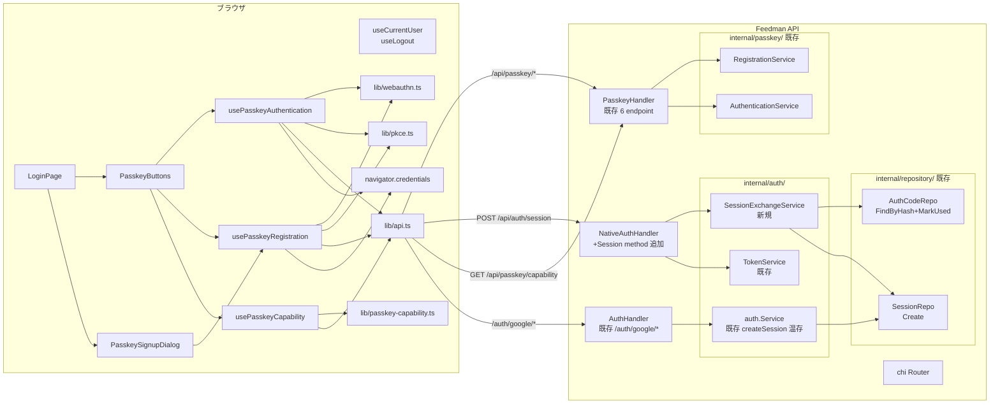
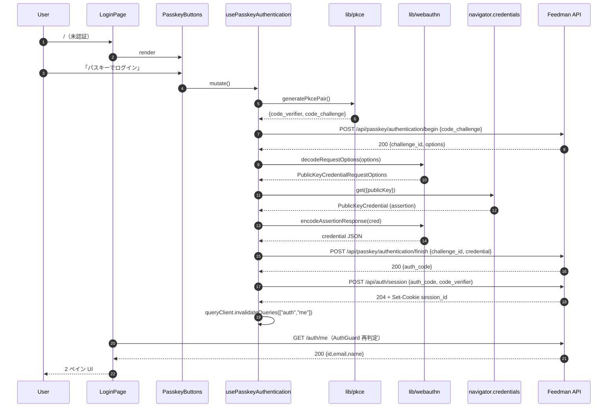
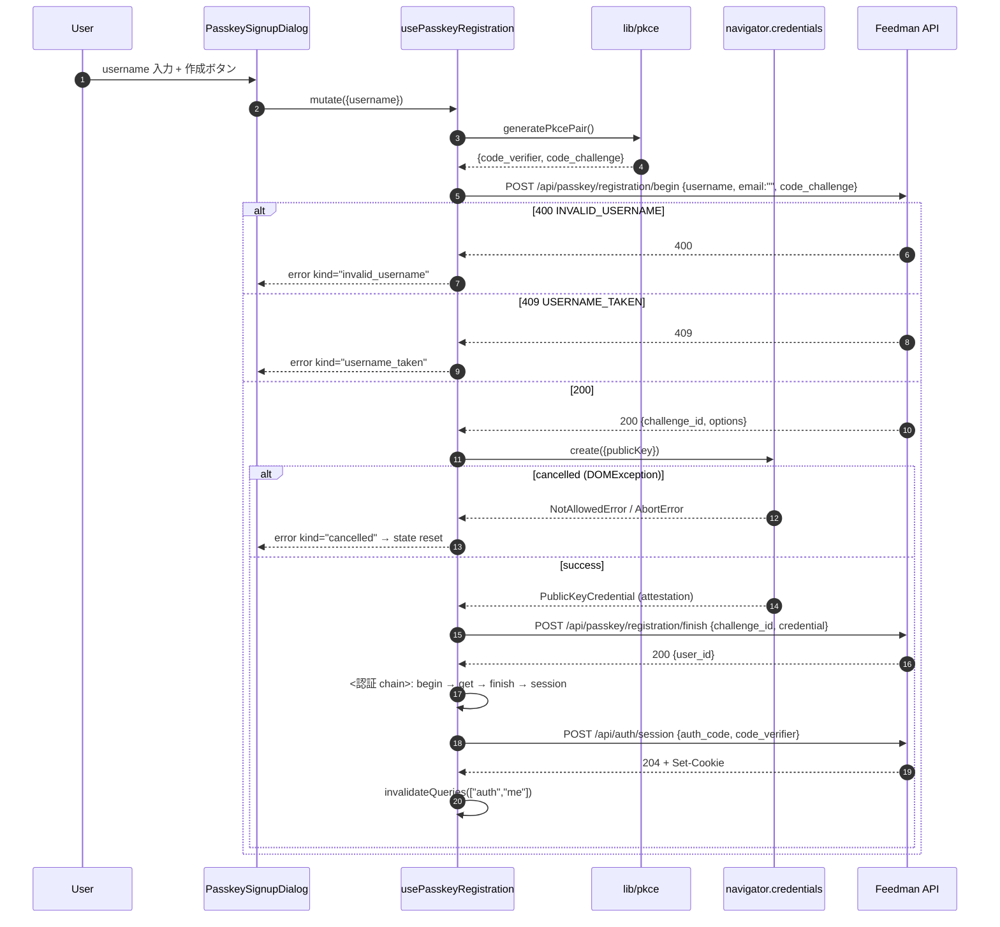

# Design Document

## Overview

**Purpose**: 本機能は Feedman Web（Next.js）のログイン画面に「パスキーでログイン」および
「パスキーでアカウント新規作成」の 2 導線を追加し、Google OAuth を使わずに Web から
Feedman を利用開始・再開できるようにする。#216 で main 済みのサーバ側パスキー API
（`/api/passkey/registration/*`・`/api/passkey/authentication/*`）と、既存 Web の Cookie
セッション認証基盤（`AuthGuard` / `use-auth` / `/auth/me`）を、auth_code → Cookie session
合流方式で接続する。

**Users**: Web を利用する未認証訪問者のうち、Google アカウントを持たない・使いたくない層と、
iOS #216 で作成したパスキー由来アカウントを Web でも使いたい既存ユーザー。加えて、
既存 Google ユーザー・運用者にとって「本機能を追加しても既存ログイン挙動が完全不変」で
あることが要件。

**Impact**: サーバ側は **新規 endpoint 2 種のみ追加**（`POST /api/auth/session`・
`GET /api/passkey/capability`）とし、既存 `/api/passkey/*`・`/api/auth/token|refresh|revoke`・
`/auth/google/*` の request/response 契約はバイト単位で不変。Web 側は login-page.tsx に
パスキー導線を追加し、`web/src/lib/{webauthn,pkce,passkey-capability}.ts` の純粋
ユーティリティ + `web/src/hooks/use-passkey-*.ts` のフック層 + `passkey-signup-dialog.tsx`
を新規追加する。既存の Google OAuth 経路・AuthGuard・use-auth は無変更（NFR 2.1 / 2.2 /
Requirement 6）。パスキー env（`WEBAUTHN_RP_ID` 等）未設定サーバでは capability endpoint も
404 を返し、Web は Google 単体構成に自動縮退する（Requirement 5.2 / NFR 2.1）。

### Goals

- 主要目標 1: 未認証訪問者が Web ログイン画面から「パスキーでログイン」または「パスキーで
  アカウント新規作成」を選び、完了直後に既存 Cookie セッション認証状態へ到達して 2 ペイン UI
  を利用できる（Requirement 1〜4）
- 主要目標 2: ブラウザ WebAuthn 非対応環境およびサーバがパスキー機能を公開しない
  デプロイ環境で、パスキー導線を自動的に非表示または操作不能とし Google OAuth 単体で
  利用開始できる（Requirement 5 / NFR 2.1）
- 主要目標 3: サーバ側の既存 API 契約（#216 の `/api/passkey/*`・`/auth/google/*`・
  `/api/auth/token`）と Web 側の既存 Google OAuth ログイン挙動・既存機能を、
  本機能導入前と同一に保つ（Requirement 6 / NFR 2.1 / 2.2）
- 成功基準:
  - `web && npm test` および `go test ./...` が本機能追加後も既存テストを含めて green
    （NFR 3.1）
  - パスキー非対応環境で `web/src/components/login-page.test.tsx` の既存アサート
    （Google ログインボタン表示・遷移先）が破壊されない（Requirement 6.4）

### Non-Goals

- Google 由来ユーザーが Web からパスキーを追加登録する UI（out of scope 明記済み）
- パスキー credential のセルフサービス管理 UI（一覧・削除・リネーム）
- パスキー由来アカウントへの Google 後付けリンク（アカウント統合）
- パスワード認証・Sign in with Apple・Android 連携
- Web ログイン画面のデザイン全面刷新（既存レイアウトへのパスキー導線追加に留める）
- #216 サーバ API の request/response 契約の破壊的変更（合流に必要な最小限のサーバ追加
  として `POST /api/auth/session`・`GET /api/passkey/capability` の 2 endpoint 新規追加のみ許容）
- iOS/Android クライアント側の実装（#216 / #117 の別 Issue で扱う）

## Architecture

### Existing Architecture Analysis

現行 Feedman Web の認証まわりは以下で構成される:

- 既存ドメイン境界:
  - `web/src/components/login-page.tsx` — 未認証時に表示するログイン画面。現在は
    Google OAuth ボタン 1 つのみ
  - `web/src/components/auth-guard.tsx` — `useCurrentUser()` で `/auth/me` を叩き、
    401 なら `LoginPage` を、成功なら子コンポーネントを表示
  - `web/src/hooks/use-auth.ts` — `useCurrentUser()`（TanStack Query）と `useLogout()`
  - `web/src/lib/api.ts` — `credentials: "include"` の fetch ラッパ + `ApiError` クラス
  - `web/src/lib/rewrites.ts` — 同一オリジン proxy 用 rewrites（`/api/*`・`/auth/*` を内部
    API へ転送）
  - `web/src/types/auth.ts` — `User` 型（GET /auth/me レスポンス）
- 既存統合点:
  - Web は常に **同一オリジン相対パス**で API を呼び出す（`API_BASE_URL = ""`）。
    `NEXT_PUBLIC_API_URL` は参照しない
  - Cookie session は `session_id`（HttpOnly / SameSite=Lax / Secure）を Google OAuth callback
    が設定し、以降は fetch の `credentials: "include"` で自動送信
- サーバ側 #216 で main 済みの資産:
  - `internal/passkey/` ドメイン（`RegistrationService` / `AuthenticationService` /
    `ChallengeStore` / `WebAuthnAdapter`）
  - `internal/handler/passkey_handler.go` — 6 endpoint
    （registration/{begin,finish,add/begin,add/finish}, authentication/{begin,finish}）
  - `internal/auth/token_service.go` — `TokenService.ExchangeAuthCode` が
    `AuthCodeConsumer.FindByHash → VerifyPKCES256Verifier → MarkUsed → JWT 発行` を実行
  - `internal/auth/service.go` — `Service.createSession()` が `sessionRepo.Create` で Cookie
    session を発行（Google OAuth Callback から呼ばれる既存経路）
  - `internal/auth/pkce.go` — `ValidatePKCES256` / `VerifyPKCES256Verifier`
  - `internal/handler/router.go` — passkey handler の fail-closed nil 判定
    （`WEBAUTHN_RP_ID` / `WEBAUTHN_ORIGINS` 未設定なら route 未登録）
- 尊重すべき制約:
  - CLAUDE.md §1: handler → service → repository → model の一方向依存。handler に SQL /
    認可を書かない。認可は service 層に集約
  - CLAUDE.md §6: secret / token / auth_code の生値をログ・エラー・レスポンス・URL に
    残さない。ハッシュ保存・token 比較は constant-time
  - NFR 2.1: 既存 Google OAuth 経路・既存 iOS / native auth 契約・既存 Web 機能一式は
    本 spec 追加後も完全不変
  - fail-closed: パスキー env 未設定なら endpoint 非登録（#216 と同パターン）
- 解消・回避する technical debt:
  - なし（本 spec は既存資産の合流に徹し、新規 debt を作らない）

### Architecture Pattern & Boundary Map

**採用パターン**: 既存 domain-per-directory を踏襲。Web 側は `web/src/lib/` の純粋
ユーティリティ層 + `web/src/hooks/` の TanStack Query mutation/query フック層 +
`web/src/components/` の UI 層の 3 層構成に沿って追加する。サーバ側は
`internal/auth/` に新規サービス `SessionExchangeService` を 1 つ追加し、既存
`AuthCodeConsumer` interface と `sessionRepo`（`SessionCreator` interface に狭める）を
再利用する。合流方式は auth_code → **Cookie session（新規サーバ endpoint 経由）** を採用。



**Architecture Integration**:

- 採用パターン:
  - Web 側は「pure lib（副作用なし）→ hook（mutation / query）→ component（UI）」の
    既存 3 層構成を踏襲（CLAUDE.md §2 の `web/src/lib` / `hooks` / `components` 責務分離）
  - サーバ側は `internal/auth/` 内に 1 サービス追加（`SessionExchangeService`）+
    `NativeAuthHandler` に endpoint 追加。新規ドメインは作らない
- ドメイン／機能境界:
  - `web/src/lib/webauthn.ts` — WebAuthn API と JSON 間の base64url ↔ ArrayBuffer 変換
    （純粋関数群、副作用なし）
  - `web/src/lib/pkce.ts` — PKCE code_verifier / code_challenge (S256) の生成
    （`crypto.getRandomValues` + `crypto.subtle.digest`、副作用は WebCrypto のみ）
  - `web/src/lib/passkey-capability.ts` — ブラウザ側のパスキー対応検出（`window.PublicKeyCredential`
    存在判定）
  - `web/src/hooks/use-passkey-capability.ts` — サーバ capability 有無 + ブラウザ対応の
    合成判定（TanStack Query）
  - `web/src/hooks/use-passkey-authentication.ts` — ログイン mutation（begin → get() → finish
    → session 交換の chain）
  - `web/src/hooks/use-passkey-registration.ts` — 新規作成 mutation（begin → create() → finish
    → 直後に authentication mutation を chain → session 交換）
  - `internal/auth/session_exchange.go` — 新規 `SessionExchangeService`（auth_code +
    code_verifier → Cookie session）
  - `internal/handler/native_auth_handler.go` — 既存 `NativeAuthHandler` に `Session` メソッド追加
  - `internal/handler/passkey_handler.go` — 既存 `PasskeyHandler` に `Capability` メソッド追加
- 既存パターンの維持:
  - CLAUDE.md §1: handler → service → repository → model の一方向依存
  - Cookie session の HttpOnly / SameSite=Lax / Secure / Path=/ 属性は既存
    Google OAuth Callback と厳密同一（NFR 2.1）
  - session_id は既存 `generateSessionID`（32 バイト crypto random）で発行し、既存
    `sessionRepo.Create` で永続化。パスキー用に別スキーマを作らない
  - passkey / capability handler の fail-closed nil 判定は #216 と同一パターン
- 新規コンポーネントの根拠:
  - `SessionExchangeService` を独立サービスにする理由: `TokenService.ExchangeAuthCode`
    は refresh_token family 発行を伴うため、責務が「auth_code → JWT/Bearer」で固定される。
    Web の場合は auth_code → Cookie session（refresh 不要）なので、`RefreshTokenStore`
    依存を伴わせないために別サービスに分離する（interface segregation / CLAUDE.md §5）
  - `web/src/lib/webauthn.ts` / `pkce.ts` を独立ユーティリティにする理由: WebAuthn の
    base64url ↔ ArrayBuffer 変換と PKCE 生成は純粋関数として単独でテスト可能にすること
    で、hook 層のテストからブラウザ WebCrypto を切り離せる（NFR 3.1）
  - `PasskeyButtons` / `PasskeySignupDialog` を独立コンポーネントにする理由:
    `LoginPage` の既存 Google ボタン部分を極力さわらずに追加できるようにし、
    Requirement 6.1 の「表示位置・遷移先」不変を担保する

### Technology Stack

| Layer | Choice / Version | Role in Feature | Notes |
|-------|------------------|-----------------|-------|
| Frontend / CLI | Next.js 15（App Router）+ React 19 + TypeScript 5 | 既存 Web SPA | 追加依存なし |
| Frontend WebAuthn | ブラウザ標準 `navigator.credentials.create/get` | Web ⇔ ブラウザパスキー API | polyfill 不使用（未対応環境は Requirement 5.1 で縮退） |
| Frontend PKCE / base64url | ブラウザ標準 `crypto.getRandomValues` / `crypto.subtle.digest("SHA-256")` | code_verifier 生成・S256 導出・base64url 変換 | Node.js 側テストは `jsdom` + WebCrypto polyfill（vitest 4 標準搭載） |
| Frontend Data fetch | TanStack React Query（既存） | 認証状態・パスキーフロー mutation | 既存 `apiClient` を再利用 |
| Frontend UI | shadcn/ui（Radix UI ベース）+ Tailwind CSS 4（既存） | Button / Dialog / Input / Label | 既存 `web/src/components/ui/*` を再利用 |
| Frontend Test | Vitest + Testing Library（jsdom）| 純粋関数・hook・component 単体テスト | 既存 `web/src/__tests__/setup.ts` を再利用 |
| Backend / Services | Go 1.25 + chi/v5（既存） | 追加 endpoint 2 種 | 追加依存なし |
| Backend Session | 既存 `sessionRepo.Create` + 既存 `generateSessionID`（32 バイト） | Cookie session 発行 | 既存 Google OAuth Callback と共有 |
| Data / Storage | 既存 PostgreSQL `sessions` テーブル | 新規テーブル無し | migration 追加なし |
| Messaging / Events | (無し) | — | 本機能に非同期処理なし |
| Infrastructure / Runtime | 既存 docker-compose / Next.js standalone / `api` プロセス | 追加サービスなし | env 追加なし（既存 `WEBAUTHN_*` を流用） |
| Observability | 既存 `slog` 構造化ログ（Go）/ `console` 抑制（Web） | 拒否・成功ログ（hash 先頭 8 文字） | 平文 auth_code / challenge / code_verifier は絶対に出さない |

**依存追加なし** — Web / サーバ双方とも既存依存のみで実装可能。

## File Structure Plan

### Directory Structure

```
web/src/
├── lib/
│   ├── webauthn.ts                        # 新規: base64url↔ArrayBuffer / options JSON パース / assertion 変換
│   ├── webauthn.test.ts                   # 新規: 上記の table-driven テスト
│   ├── pkce.ts                            # 新規: code_verifier / code_challenge (S256) 生成
│   ├── pkce.test.ts                       # 新規
│   ├── passkey-capability.ts              # 新規: ブラウザ WebAuthn 対応判定
│   ├── passkey-capability.test.ts         # 新規
│   ├── api.ts                             # 既存（無変更）
│   └── rewrites.ts                        # 既存（無変更）
├── hooks/
│   ├── use-passkey-capability.ts          # 新規: サーバ+ブラウザ合成 capability クエリ
│   ├── use-passkey-capability.test.tsx    # 新規
│   ├── use-passkey-authentication.ts      # 新規: ログイン mutation（begin→get→finish→session）
│   ├── use-passkey-authentication.test.tsx # 新規
│   ├── use-passkey-registration.ts        # 新規: 新規作成 mutation（reg→auth→session の連鎖）
│   ├── use-passkey-registration.test.tsx  # 新規
│   ├── use-auth.ts                        # 既存（無変更）
│   └── (他既存フックは無変更)
├── components/
│   ├── login-page.tsx                     # 変更: パスキー導線（PasskeyButtons）と Signup Dialog を統合
│   ├── login-page.test.tsx                # 変更: capability 分岐・Google 導線不変・パスキー導線表示のケース追加
│   ├── passkey-buttons.tsx                # 新規: 「パスキーでログイン」「アカウント新規作成」2 ボタン + 非対応時の非活性表示
│   ├── passkey-buttons.test.tsx           # 新規
│   ├── passkey-signup-dialog.tsx          # 新規: username 入力ダイアログ（バリデーション + 実行トリガ）
│   ├── passkey-signup-dialog.test.tsx     # 新規
│   ├── auth-guard.tsx                     # 既存（無変更）
│   └── (他既存コンポーネントは無変更)
└── types/
    ├── passkey.ts                         # 新規: サーバ DTO 型（BeginResponse / FinishResponse / SessionRequest）
    └── auth.ts                            # 既存（無変更）

internal/
├── auth/
│   ├── session_exchange.go                # 新規: SessionExchangeService（auth_code+code_verifier→*model.Session）
│   ├── session_exchange_test.go           # 新規: ユニット（AuthCodeConsumer / SessionCreator のモック使用）
│   ├── native.go                          # 既存（無変更）
│   ├── token_service.go                   # 既存（無変更）
│   ├── service.go                         # 既存（無変更 / createSession のロジックを sessions.Create に集約されているためコピペしない）
│   └── pkce.go                            # 既存（VerifyPKCES256Verifier を再利用）
├── handler/
│   ├── native_auth_handler.go             # 変更: `Session` メソッド追加（POST /api/auth/session）
│   ├── native_auth_handler_test.go        # 変更: Session の 200 / 400 / 500 / Cookie 検証を追加
│   ├── passkey_handler.go                 # 変更: `Capability` メソッド追加（GET /api/passkey/capability）
│   ├── passkey_handler_test.go            # 変更: Capability の 200 応答テスト追加
│   ├── router.go                          # 変更: `POST /api/auth/session` と `GET /api/passkey/capability` を認証不要グループへ登録（unauthIPMW + MaxBodyBytes）
│   ├── router_test.go                     # 変更: 新規 2 route の登録・fail-closed 分岐テスト追加
│   └── (他既存 handler は無変更)
└── app/
    └── app.go                             # 変更: SessionExchangeService の wiring 追加（fail-closed 分岐に統合）
```

### Modified Files

- `web/src/components/login-page.tsx` — 既存 Google ボタンの直下 or 直上に `PasskeyButtons` を配置。
  `usePasskeyCapability()` で capability が false のときは PasskeyButtons を非表示。
  Google 導線の `href` / `className` / 文言・レイアウトは変更しない（Requirement 6.1）。
  新規作成導線クリック時に `PasskeySignupDialog` を開く。
- `web/src/components/login-page.test.tsx` — 既存 4 テストは維持しつつ、以下ケースを追加:
  - capability 未検出時にパスキー導線が非表示になること
  - capability 有効時にパスキー導線 2 種が表示されること
  - Google ログイン導線の `href` / 表示位置が本 spec 導入前と同一であること
- `internal/handler/native_auth_handler.go` — 新規 `Session(w, r)` メソッド追加。
  request body `{auth_code, code_verifier}` を厳格 decode（`DisallowUnknownFields`）し、
  `SessionExchangeService.ExchangeAuthCodeForSession` を呼び、成功時に既存 Google OAuth
  Callback と同一属性の HttpOnly Cookie を Set-Cookie して 204。拒否は 400 INVALID_GRANT
  に統一（`ErrInvalidGrant` を再利用）。
- `internal/handler/passkey_handler.go` — 新規 `Capability(w, r)` メソッド追加。
  常に `{available: true}` を返す軽量 handler（handler が nil のとき route 自体が
  未登録なので、endpoint 到達 = 有効。Web 側は 200 OK を capability 有効の判定に使う）。
- `internal/handler/router.go` — 認証不要グループ配下に以下を追加登録（既存 passkey 4 endpoint
  と同じ `unauthIPMW + MaxBodyBytes` を通す）:
  - `POST /api/auth/session`（NativeAuthHandler nil のときは登録しない = fail-closed）
  - `GET /api/passkey/capability`（PasskeyHandler nil のときは登録しない = fail-closed）
- `internal/app/app.go` — `SessionExchangeService` を wiring し、`NativeAuthHandler` に注入。
  `NATIVE_AUTH_JWT_SECRET` 未設定時は NativeAuthHandler 自体が nil なので、追加 endpoint も
  未登録（既存 fail-closed 挙動と同期）。

## Requirements Traceability

| Requirement | Summary | Components | Interfaces | Flows |
|-------------|---------|------------|------------|-------|
| 1.1 | 3 種導線を同一画面に提示 | `LoginPage`, `PasskeyButtons` | React コンポーネント表示 | ログイン画面初期表示 |
| 1.2 | 本 spec 導入前と識別可能な形で提示 | `PasskeyButtons`（追加 UI 要素）| — | ログイン画面初期表示 |
| 1.3 | パスキーログイン選択で auth フロー開始 | `PasskeyButtons`, `usePasskeyAuthentication` | onClick handler → mutation.mutate | ログイン開始 |
| 1.4 | 新規作成選択で作成フロー開始 | `PasskeyButtons`, `PasskeySignupDialog` | onClick handler → Dialog 表示 | 新規作成開始 |
| 1.5 | Google 選択で既存フロー | `LoginPage`（既存 Google Button 無変更）| `<a href="/auth/google/login">` | Google OAuth |
| 2.1 | username 入力欄 + 作成開始操作 | `PasskeySignupDialog` | Input + Button | 新規作成 UI |
| 2.2 | ブラウザのパスキー作成 UI 起動 | `usePasskeyRegistration`, `lib/webauthn.ts` | `navigator.credentials.create` | Signup mutation |
| 2.3 | 作成成功後、追加操作なしで 3 の合流フローに遷移 | `usePasskeyRegistration`（chain: register→authenticate→session）| mutation chain | Signup mutation |
| 2.4 | recovery email 未指定を欠落として扱わない | `PasskeySignupDialog`（email 入力欄なし）, `usePasskeyRegistration`（email="" を送信）| リクエスト payload | Signup begin |
| 2.5 | username 形式不正の表示 | `PasskeySignupDialog`, `usePasskeyRegistration`（error mapping）| ApiError.status=400+code=INVALID_USERNAME | Signup begin エラー |
| 2.6 | username 重複の表示 | `PasskeySignupDialog`, `usePasskeyRegistration` | ApiError.status=409+code=USERNAME_TAKEN | Signup begin エラー |
| 2.7 | ブラウザ UI キャンセルで復帰 | `usePasskeyRegistration`（DOMException NotAllowedError/AbortError 判別）| WebAuthn 例外ハンドリング | Signup 中の cancel |
| 2.8 | サーバエラーの汎用表示・内部詳細非反射 | `usePasskeyRegistration`, `PasskeySignupDialog` | ApiError → generic error text | Signup サーバエラー |
| 3.1 | 追加操作なしで Cookie セッションに到達 | `usePasskeyRegistration`, `SessionExchangeService`, `NativeAuthHandler.Session` | POST /api/auth/session | Signup 合流 |
| 3.2 | 2 ペイン UI を初期表示 | `AuthGuard`（既存無変更）, TanStack Query cache invalidation | `queryClient.invalidateQueries(["auth","me"])` | 認証状態遷移 |
| 3.3 | 既存機能一式を利用可能 | 既存全機能（無変更 / NFR 2.1）| — | 認証後 |
| 3.4 | 合流失敗時の汎用エラー + ログイン画面復帰 | `usePasskeyRegistration`（session mutation の error path）| error toast/inline + reset | Signup 合流失敗 |
| 4.1 | ブラウザのパスキー選択 UI 起動、username 不要 | `usePasskeyAuthentication`, `lib/webauthn.ts` | `navigator.credentials.get`（allowCredentials 空）| Login 開始 |
| 4.2 | 成功で追加操作なく Cookie セッションに到達 | `usePasskeyAuthentication`, `NativeAuthHandler.Session`, `SessionExchangeService` | POST /api/auth/session | Login 合流 |
| 4.3 | 2 ペイン UI と既存機能一式 | `AuthGuard`（既存）| — | 認証後 |
| 4.4 | iOS 作成パスキーで Web ログイン | `usePasskeyAuthentication`（同エンドポイント）, サーバ側 `AuthenticationService`（無変更）| 既存 `/api/passkey/authentication/*` | Login |
| 4.5 | ブラウザ UI キャンセルで復帰 | `usePasskeyAuthentication`（NotAllowedError/AbortError 判別）| WebAuthn 例外ハンドリング | Login 中の cancel |
| 4.6 | サーバ拒否の区別を反射せず汎用エラー | `usePasskeyAuthentication`（error 表示は generic 固定）| ApiError.code=AUTHENTICATION_FAILED は uniform | Login 拒否 |
| 4.7 | サーバエラー時の汎用エラー | `usePasskeyAuthentication` | ApiError.status=500 | Login サーバエラー |
| 5.1 | ブラウザ非対応時に導線非表示/非活性 | `lib/passkey-capability.ts`, `use-passkey-capability`, `PasskeyButtons` | `window.PublicKeyCredential !== undefined` 判定 | 画面初期化 |
| 5.2 | サーバ非提供時に導線非表示/非活性 | `use-passkey-capability`（GET /api/passkey/capability の 200/404 判定）, `PasskeyButtons` | fetch 結果 | 画面初期化 |
| 5.3 | 導線無効時も Google は不変 | `LoginPage`（Google 部分は capability に依存しない）| — | 画面表示 |
| 5.4 | 導線無効環境でパスキー要求操作を試みても Google 案内に留まる | `PasskeyButtons`（capability false 時に button disabled）| — | 画面操作 |
| 6.1 | Google 導線の位置・遷移先・セッション挙動不変 | `LoginPage`（既存 Google `<a>` に手を入れない）, `AuthHandler`（無変更）| `href="/auth/google/login"` | Google OAuth |
| 6.2 | Google 済ユーザーへの 2 ペイン UI 提示不変 | 既存 `AuthGuard`, `AppShell`（無変更）| — | 既存 UI |
| 6.3 | 既存認証・UI・機能を破壊的変更しない | 既存全コンポーネント無変更 | — | 全体 |
| 6.4 | 既存テストが green のまま実行可能 | 既存 vitest / go test 群（無変更）| — | CI |
| NFR 1.1 | 生バイト列・challenge・auth_code をログ・storage・URL・UI に残さない | `usePasskeyAuthentication`, `usePasskeyRegistration`, `SessionExchangeService`, `NativeAuthHandler.Session` | in-memory only / hash-only ログ | 全フロー |
| NFR 1.2 | サーバ内部詳細を UI・console に反射しない | Web mutations の catch では generic 表示のみ、`console.error` を呼ばない | — | エラー処理 |
| NFR 1.3 | 既存 CSP / sanitize を緩和しない | `lib/csp.ts`（既存）を変更しない, DOMPurify 設定を変更しない | — | 設定 |
| NFR 1.4 | 同一オリジンのサーバに対してのみ実行 | `lib/api.ts`（既存 `API_BASE_URL=""` 同一オリジン相対）を再利用 | — | 全フロー |
| NFR 2.1 | パスキー機能非提供構成で既存挙動と同一 | fail-closed nil 判定（既存パターン）, capability endpoint 未登録で Web は Google 単体に縮退 | — | 縮退時 |
| NFR 2.2 | 既存ユーザーに再ログイン・設定変更を要求しない | 既存 session Cookie を破壊しない, Google OAuth 挙動不変 | — | 既存ユーザー |
| NFR 3.1 | 正常/異常各ケースを外部依存なしで検証可能 | Vitest（jsdom + WebCrypto）+ WebAuthn API モック, Go テストは既存 stub パターン | — | テスト全般 |

## Components and Interfaces

### Web 層 — 純粋ユーティリティ

#### `lib/webauthn.ts`

| Field | Detail |
|-------|--------|
| Intent | サーバ返却の base64url フィールドと `navigator.credentials.create/get` が要求する `ArrayBuffer` を相互変換し、response を再度 base64url JSON に射影する純粋関数群 |
| Requirements | 2.2, 2.7, 4.1, 4.5, NFR 1.1 |

**Responsibilities & Constraints**
- 全関数は副作用なし・error なし（形式不正はドメイン境界で throw する）
- base64url ↔ ArrayBuffer / Uint8Array の相互変換をブラウザ標準 `atob` / `btoa` 経由で
  実装（依存追加なし）
- サーバの `passkeyBeginResponse.options` はトップレベル `{publicKey: {...}}` 構造の JSON
  でそのまま navigator に渡せる形式。ただし `publicKey.challenge` / `publicKey.user.id` /
  `publicKey.excludeCredentials[].id` / `publicKey.allowCredentials[].id` が base64url 文字列
  として入っているため `ArrayBuffer` へ変換する
- credential 作成/取得の結果（`PublicKeyCredential`）は JSON にシリアライズしてサーバへ送る際
  base64url 化する

**Dependencies**
- Inbound: `hooks/use-passkey-authentication.ts`, `hooks/use-passkey-registration.ts`
- Outbound: なし（WebCrypto は使わない、`crypto.subtle` は `pkce.ts` に閉じ込め）
- External: ブラウザ標準 `atob` / `btoa` / `Uint8Array` / `TextEncoder`

**Contracts**: Service [x] / API [ ] / Event [ ] / Batch [ ] / State [ ]

```typescript
// web/src/lib/webauthn.ts

/** base64url 文字列を ArrayBuffer にデコード（padding なし） */
export function base64urlToArrayBuffer(b64url: string): ArrayBuffer;

/** ArrayBuffer / Uint8Array を base64url 文字列（padding なし）にエンコード */
export function arrayBufferToBase64url(buf: ArrayBuffer | Uint8Array): string;

/**
 * サーバ返却 options（`{publicKey: {...}}` 形式）を
 * navigator.credentials.create() 引数に変換する。
 * challenge / user.id / excludeCredentials[].id を base64url → ArrayBuffer に変換する。
 */
export function decodeCreationOptions(
  raw: unknown
): CredentialCreationOptions;

/**
 * サーバ返却 options（`{publicKey: {...}}` 形式）を
 * navigator.credentials.get() 引数に変換する。
 * challenge / allowCredentials[].id を base64url → ArrayBuffer に変換する。
 */
export function decodeRequestOptions(
  raw: unknown
): CredentialRequestOptions;

/**
 * navigator.credentials.create() の結果を、サーバ finish endpoint の
 * `credential` フィールドとして送信する JSON にエンコード（base64url 化）。
 */
export function encodeAttestationResponse(cred: PublicKeyCredential): unknown;

/**
 * navigator.credentials.get() の結果を、サーバ authentication/finish endpoint の
 * `credential` フィールドとして送信する JSON にエンコード（base64url 化）。
 */
export function encodeAssertionResponse(cred: PublicKeyCredential): unknown;
```

- Preconditions: 入力 `raw` は `{publicKey: {...}}` を持つオブジェクト
- Postconditions: 変換対象の全 base64url フィールドが `ArrayBuffer` になり、他フィールド
  （`rp`, `user.name`, `user.displayName`, `pubKeyCredParams`, `authenticatorSelection`,
  `attestation`, `timeout`, `extensions` 等）は透過的にコピー
- Invariants: サーバから受け取った base64url 生値をログ・storage に **絶対に書かない**（NFR 1.1）

#### `lib/pkce.ts`

| Field | Detail |
|-------|--------|
| Intent | PKCE code_verifier（RFC 7636 unreserved 43〜128 文字）と code_challenge（S256 = base64url(SHA-256(verifier))）をブラウザ WebCrypto で生成 |
| Requirements | 2.2, 3.1, 4.2, NFR 1.1 |

**Responsibilities & Constraints**
- `code_verifier` は `crypto.getRandomValues(new Uint8Array(32))` から 32 バイト取り出し
  base64url 化（44 文字未満だが RFC 7636 §4.1 の 43〜128 文字範囲内）
- `code_challenge` は `crypto.subtle.digest("SHA-256", verifier_bytes)` を base64url 化
- 生成した code_verifier は **メモリ上の変数のみに保持**（後述 hook 内で mutation state と
  して保持し、mutation 完了・失敗・cancel の全経路で参照後直ちに破棄）。localStorage /
  sessionStorage / IndexedDB に書かない（NFR 1.1）

**Dependencies**
- Inbound: `hooks/use-passkey-authentication.ts`, `hooks/use-passkey-registration.ts`
- External: ブラウザ標準 `crypto.getRandomValues` / `crypto.subtle.digest`

```typescript
// web/src/lib/pkce.ts

export interface PkcePair {
  codeVerifier: string;   // 43 文字 base64url（無 padding）
  codeChallenge: string;  // 43 文字 base64url（無 padding、S256）
}

/**
 * PKCE code_verifier / code_challenge (S256) をブラウザ WebCrypto で生成する。
 * code_verifier は 32 バイト crypto random の base64url、code_challenge は
 * SHA-256(code_verifier) の base64url。
 * NFR 1.1: 生成された値は本関数の返却値としてのみ渡され、内部で保持しない。
 */
export async function generatePkcePair(): Promise<PkcePair>;
```

#### `lib/passkey-capability.ts`

| Field | Detail |
|-------|--------|
| Intent | ブラウザ側の WebAuthn 対応判定を純粋な関数として提供 |
| Requirements | 5.1, 5.4 |

**Responsibilities & Constraints**
- `window.PublicKeyCredential` が存在し、`typeof === "function"` であることを検査
- `PublicKeyCredential.isUserVerifyingPlatformAuthenticatorAvailable` は optional（条件付き
  検査。false でも導線は表示するが、Face ID/Touch ID なし環境で UI を無効化しないため）
- 純粋関数（副作用なし・throw なし・boolean を返すのみ）

```typescript
// web/src/lib/passkey-capability.ts

/** ブラウザが WebAuthn (`navigator.credentials.create/get` + PublicKeyCredential) を提供しているか */
export function isPasskeyBrowserSupported(): boolean;
```

### Web 層 — TypeScript 型

#### `types/passkey.ts`

```typescript
// web/src/types/passkey.ts

/** POST /api/passkey/registration/begin リクエスト */
export interface RegistrationBeginRequest {
  username: string;
  email?: string;
  code_challenge: string;
}

/** POST /api/passkey/registration/begin レスポンス */
export interface PasskeyBeginResponse {
  challenge_id: string;
  options: unknown; // {publicKey: {...}} 形式の生 JSON、lib/webauthn.ts が変換
}

/** POST /api/passkey/registration/finish / authentication/finish リクエスト */
export interface PasskeyFinishRequest {
  challenge_id: string;
  credential: unknown; // lib/webauthn.ts でエンコード済み JSON
}

/** POST /api/passkey/registration/finish レスポンス */
export interface RegistrationFinishResponse {
  user_id: string;
}

/** POST /api/passkey/authentication/begin リクエスト */
export interface AuthenticationBeginRequest {
  code_challenge: string;
}

/** POST /api/passkey/authentication/finish レスポンス */
export interface AuthenticationFinishResponse {
  auth_code: string;
}

/** POST /api/auth/session リクエスト（本 spec で新規追加のサーバ endpoint） */
export interface SessionExchangeRequest {
  auth_code: string;
  code_verifier: string;
}

/** GET /api/passkey/capability レスポンス */
export interface CapabilityResponse {
  available: boolean;
}
```

### Web 層 — TanStack Query フック

#### `hooks/use-passkey-capability.ts`

| Field | Detail |
|-------|--------|
| Intent | サーバとブラウザ双方のパスキー対応可否を合成した boolean を提供 |
| Requirements | 5.1, 5.2, 5.3 |

**Responsibilities & Constraints**
- `useQuery` で `GET /api/passkey/capability` を呼び、200 なら server=true、404 / ネットワーク
  エラーなら server=false
- サーバレスポンスと `isPasskeyBrowserSupported()` の AND を `available` として返す
- staleTime は無限（`Infinity`）— capability は session をまたいで安定
- retry は無効（404 を retry しない）

```typescript
// web/src/hooks/use-passkey-capability.ts

export interface PasskeyCapability {
  isLoading: boolean;
  available: boolean; // server && browser
}

export function usePasskeyCapability(): PasskeyCapability;
```

#### `hooks/use-passkey-authentication.ts`

| Field | Detail |
|-------|--------|
| Intent | パスキーログインの一連の chain を 1 mutation として提供 |
| Requirements | 4.1〜4.7, NFR 1.1, NFR 1.2 |

**Responsibilities & Constraints**
- `useMutation` として実装、内部で以下を chain:
  1. `generatePkcePair()` で code_verifier / code_challenge 生成（変数保持のみ）
  2. `POST /api/passkey/authentication/begin { code_challenge }` → `{challenge_id, options}`
  3. `decodeRequestOptions(options)` → `navigator.credentials.get(...)`
  4. `encodeAssertionResponse(cred)` → `POST /api/passkey/authentication/finish
     {challenge_id, credential}` → `{auth_code}`
  5. `POST /api/auth/session { auth_code, code_verifier }` → 204 + Cookie 設定
  6. `queryClient.invalidateQueries({queryKey: ["auth","me"]})` で AuthGuard を再判定
- 失敗判別:
  - `DOMException` name in `["NotAllowedError","AbortError","InvalidStateError"]`
    → `PasskeyCancelledError` としてカテゴリ化（UI は「壊さずに戻す」= mutation state リセット）
  - `ApiError` （fetch のサーバエラー）→ generic error text（内部詳細を反射しない / NFR 1.2）
  - その他 unknown → generic error
- code_verifier は mutation の closure 内でのみ保持し、成功・失敗・cancel いずれの終了時にも
  参照終了で GC 対象になる（永続化・globals 保存しない / NFR 1.1）

**Dependencies**
- Inbound: `components/passkey-buttons.tsx`
- Outbound: `lib/webauthn.ts`, `lib/pkce.ts`, `lib/api.ts`
- External: `navigator.credentials`, TanStack Query

```typescript
// web/src/hooks/use-passkey-authentication.ts

export type PasskeyAuthErrorKind =
  | "cancelled"
  | "server_error"
  | "server_rejected"
  | "network_error";

export interface PasskeyAuthError extends Error {
  kind: PasskeyAuthErrorKind;
}

export function usePasskeyAuthentication(): UseMutationResult<
  void,
  PasskeyAuthError,
  void
>;
```

- Preconditions: `usePasskeyCapability().available === true`（呼び出し側が gating）
- Postconditions: 成功時は React Query の `auth.me` cache が invalidate され、`AuthGuard` が
  再取得して認証済み分岐へ遷移
- Invariants: `code_verifier` / `auth_code` を絶対に localStorage・sessionStorage・URL に
  書かない（NFR 1.1）

#### `hooks/use-passkey-registration.ts`

| Field | Detail |
|-------|--------|
| Intent | パスキー新規作成 → 直後にパスキー認証 → session 交換までを 1 mutation として提供 |
| Requirements | 2.1〜2.8, 3.1, 3.2, 3.4, NFR 1.1, NFR 1.2 |

**Responsibilities & Constraints**
- `useMutation<void, PasskeyRegistrationError, { username: string }>` で実装
- 内部処理:
  1. `generatePkcePair()`
  2. `POST /api/passkey/registration/begin { username, email:"", code_challenge }` → `{challenge_id, options}`
     - 400 INVALID_USERNAME → `PasskeyRegistrationError { kind: "invalid_username" }`
     - 409 USERNAME_TAKEN → `PasskeyRegistrationError { kind: "username_taken" }`
     - その他エラーは generic `server_error`
  3. `decodeCreationOptions(options)` → `navigator.credentials.create(...)`
     - DOMException（NotAllowedError / AbortError / InvalidStateError）→ `cancelled`
  4. `encodeAttestationResponse(cred)` → `POST /api/passkey/registration/finish
     {challenge_id, credential}` → `{user_id}`
     - 400 REGISTRATION_FAILED → generic `server_rejected`
  5. **直後に認証 chain**（Requirement 2.3 の「追加操作なし」を満たすため、内部で
     usePasskeyAuthentication と同じロジックを呼ぶ。`get()` の modal は多くの platform
     authenticator でシームレスに追認され、ユーザー可視の追加操作にならない）:
     - `POST /api/passkey/authentication/begin { code_challenge }` → `{challenge_id, options}`
     - `navigator.credentials.get()` → assertion
     - `POST /api/passkey/authentication/finish` → `{auth_code}`
  6. `POST /api/auth/session { auth_code, code_verifier }` → 204 + Cookie
  7. `queryClient.invalidateQueries({queryKey: ["auth","me"]})`
- ネットワークエラー / 500 系 → generic `server_error`
- 合流失敗（step 6 の 400/500）→ `session_exchange_failed` として Requirement 3.4 の
  「汎用エラー表示 + ログイン画面復帰」を UI 側が実現できるようにする
- email は常に空文字を送信（Requirement 2.4 の「未指定を欠落として扱わない」を実現する
  ため、UI 側から optional として送らず常に `""`）

```typescript
// web/src/hooks/use-passkey-registration.ts

export type PasskeyRegistrationErrorKind =
  | "invalid_username"
  | "username_taken"
  | "cancelled"
  | "server_rejected"
  | "session_exchange_failed"
  | "server_error"
  | "network_error";

export interface PasskeyRegistrationError extends Error {
  kind: PasskeyRegistrationErrorKind;
}

export function usePasskeyRegistration(): UseMutationResult<
  void,
  PasskeyRegistrationError,
  { username: string }
>;
```

- Preconditions: `usePasskeyCapability().available === true`
- Postconditions: 成功時に `AuthGuard` が認証済み分岐へ遷移し、2 ペイン UI に到達
- Invariants: `code_verifier` / `auth_code` / attestation 生バイトを永続化しない（NFR 1.1）

### Web 層 — UI コンポーネント

#### `PasskeyButtons`

| Field | Detail |
|-------|--------|
| Intent | ログイン画面上の「パスキーでログイン」「アカウント新規作成」2 ボタンを提供 |
| Requirements | 1.1〜1.4, 5.1, 5.2, 5.3, 5.4 |

**Responsibilities & Constraints**
- `usePasskeyCapability()` の判定に応じて表示・非表示を切り替え
- 非対応時（`available === false`）は当該コンポーネントを **null 返却**（非表示）とする。
  Requirement 5.1 / 5.2 の「非表示または操作不能」の**非表示**選択肢を採用（disable 表示より
  UI 混乱が少ないため）
- 「パスキーでログイン」クリック → `usePasskeyAuthentication().mutate()`
- 「アカウント新規作成」クリック → 親の `onSignupClick` callback を呼ぶ（Dialog を親が管理）
- 認証 mutation の loading / error / cancelled 状態を UI で反映（button disabled + 汎用エラー）
- Google 導線とは完全に独立（Google 側 `<a>` の DOM は本コンポーネントの外側）

```typescript
export interface PasskeyButtonsProps {
  onSignupClick: () => void;
}
export function PasskeyButtons(props: PasskeyButtonsProps): JSX.Element | null;
```

#### `PasskeySignupDialog`

| Field | Detail |
|-------|--------|
| Intent | 新規作成 UI として username 入力 + バリデーション + mutation トリガを提供 |
| Requirements | 2.1, 2.4, 2.5, 2.6, 2.7, 2.8, 3.1, 3.4 |

**Responsibilities & Constraints**
- shadcn/ui `Dialog` を使用（既存 `components/ui/dialog.tsx` を再利用 / CLAUDE.md §4）
- 入力: username のみ（recovery email は入力欄自体を設けない → Requirement 2.4 の
  「欠落として扱わない」を UI 上で確定）
- クライアント側の形式 pre-check（3〜32 文字 / `[a-zA-Z0-9_-]`）を任意で行うが、
  サーバ判定を authoritative とする（サーバ拒否をそのまま UI に表示）
- 「作成」ボタン押下で `usePasskeyRegistration().mutate({username})`
- mutation の状態に応じた表示:
  - `isPending`: ボタン disabled + spinner
  - `isError` かつ `error.kind === "invalid_username"`: 「ユーザー名の形式が不正です（3〜32 文字、英数字とハイフン・アンダースコアのみ）」
  - `isError` かつ `error.kind === "username_taken"`: 「このユーザー名は既に使用されています」
  - `isError` かつ `error.kind === "cancelled"`: エラー表示なし、mutation state を reset して初期表示に戻す（Requirement 2.7）
  - `isError` かつ `error.kind === "session_exchange_failed"`: 「ログインに問題が発生しました。ログイン画面から再度お試しください」+ Dialog を閉じる（Requirement 3.4）
  - `isError` かつその他: 「エラーが発生しました。時間をおいて再度お試しください」（Requirement 2.8）
- 成功時: Dialog を閉じ、`AuthGuard` の再判定に委ねる（明示的な router 遷移は不要 = 2 ペイン UI に自動遷移）

```typescript
export interface PasskeySignupDialogProps {
  open: boolean;
  onOpenChange: (open: boolean) => void;
}
export function PasskeySignupDialog(props: PasskeySignupDialogProps): JSX.Element;
```

#### `LoginPage`（変更）

| Field | Detail |
|-------|--------|
| Intent | 既存 Google ボタン + パスキー導線 + 新規作成 Dialog を統合 |
| Requirements | 1.1, 1.5, 6.1, 5.3 |

**Responsibilities & Constraints**
- 既存 Google ボタンの DOM ・class ・`href` ・文言をそのまま維持（Requirement 6.1）
- 直下に `PasskeyButtons` を配置（capability false 時は自動非表示 = Google 単体表示 =
  Requirement 5.3 で「本 spec 導入前と同一」）
- `PasskeySignupDialog` の open state を `useState` で持つ

### Server 層 — サービス

#### `SessionExchangeService`

| Field | Detail |
|-------|--------|
| Intent | パスキー認証で発行された auth_code を PKCE 検証付きで単回消費し、Web 用の Cookie session を発行する |
| Requirements | 3.1, 4.2 |

**Contracts**: Service [x] / API [ ] / Event [ ] / Batch [ ] / State [ ]

**Dependencies**
- Inbound: `NativeAuthHandler.Session` — /api/auth/session (Critical)
- Outbound:
  - `AuthCodeConsumer`（既存 interface / `FindByHash` + `MarkUsed`）— auth_code 単回消費 (Critical)
  - `SessionCreator`（新規 interface / `Create` のみに狭めた subset）— session 永続化 (Critical)

**採用理由（既存 `TokenService` との分離）**: `TokenService.ExchangeAuthCode` は
`RefreshTokenStore` 依存を含むが、Web の Cookie session に refresh_token family は不要。
interface segregation（CLAUDE.md §5）に従い、`SessionExchangeService` は
`AuthCodeConsumer` + `SessionCreator` の 2 最小依存のみを受け取る。既存 `TokenService` は
バイト単位で無変更。

```go
// internal/auth/session_exchange.go

// SessionCreator は SessionExchangeService が session 永続化に必要とする最小 IF。
// repository.SessionRepository が構造的に充足する（interface segregation）。
type SessionCreator interface {
    Create(ctx context.Context, s *model.Session) error
}

// SessionExchangeService は passkey auth_code を Web 用 Cookie session に交換する。
// 拒否は既存 ErrInvalidGrant に uniform 化（Req 3.4 / NFR 1.2）。
type SessionExchangeService struct {
    authCodes  AuthCodeConsumer   // 既存 interface（token_service.go 定義）を流用
    sessions   SessionCreator
    now        func() time.Time
    sessionTTL time.Duration      // 既存 SessionMaxAge を秒 → time.Duration 化して受け取る
}

func NewSessionExchangeService(
    authCodes AuthCodeConsumer,
    sessions SessionCreator,
    sessionTTL time.Duration,
) *SessionExchangeService

// ExchangeAuthCodeForSession は auth_code + code_verifier を Web 用 session に交換する。
//
// 手順（既存 TokenService.ExchangeAuthCode と共通の 3 段を踏み、以降を session 発行に差し替え）:
//  1. auth_code を HashNativeSecret → FindByHash（未検出 → ErrInvalidGrant）
//  2. VerifyPKCES256Verifier（不一致 / 形式不正 → ErrInvalidGrant）
//  3. MarkUsed（既に used / 期限切れ → ErrInvalidGrant）
//  4. crypto random 32 バイト（既存 generateSessionID と同流儀）で session_id 生成 →
//     sessions.Create で永続化
// 拒否時は session を一切永続化しない。平文 auth_code / code_verifier / session_id を
// ログ・エラーメッセージに残さない（NFR 1.1 / 1.2）。
func (s *SessionExchangeService) ExchangeAuthCodeForSession(
    ctx context.Context, authCode, codeVerifier string,
) (*model.Session, error)
```

- Preconditions: `authCodes`・`sessions`・`sessionTTL > 0` はすべて非 nil / 有効値
- Postconditions: 成功時に `*model.Session`（`ID` / `UserID` / `ExpiresAt` / `CreatedAt`）
  を返す
- Invariants: 平文値をログ・エラーに残さない。session_id 生成は既存 Google OAuth
  callback と同じ 32 バイト crypto random / hex エンコード

### Server 層 — HTTP handler

#### `NativeAuthHandler.Session`（追加メソッド）

| Field | Detail |
|-------|--------|
| Intent | パスキー認証で得た auth_code を Web セッションに交換する endpoint |
| Requirements | 3.1, 3.4, 4.2, 4.7 |

**Contracts**: Service [ ] / API [x] / Event [ ] / Batch [ ] / State [ ]

**API Contract**:

| Method | Endpoint | Auth | Request | Response | Errors |
|--------|----------|------|---------|----------|--------|
| POST | `/api/auth/session` | unauth + IP RL | `{auth_code, code_verifier}` | 204 + `Set-Cookie: session_id=...; HttpOnly; SameSite=Lax; Secure; Path=/; Max-Age=<TTL>` | 400 INVALID_REQUEST / 400 INVALID_GRANT / 429 / 500 |

**Responsibilities & Constraints**
- `dec.DisallowUnknownFields()` で厳格 decode（既存 `NativeAuthHandler.Token` 流儀）
- 必須フィールド欠落 / JSON 不正 → 400 INVALID_REQUEST（既存 `invalidRequestError` 流儀）
- `ExchangeAuthCodeForSession` の `ErrInvalidGrant` → 400 INVALID_GRANT（既存 `errInvalidGrant`
  応答形式 = 既存 `POST /api/auth/token` と同一）
- 成功時: `http.SetCookie` で既存 Google OAuth Callback と **完全同一の Cookie 属性**
  （HttpOnly / SameSite=Lax / Secure / Path=/ / Domain=CookieDomain / Max-Age=SessionMaxAge）
- Cookie 名は既存 `sessionCookieName` = `"session_id"`
- 応答ボディは空（204 No Content）— Web は `credentials: "include"` によって自動的に Cookie を保存し、
  以降の `/auth/me` が認証済み状態になる
- 内部エラー（DB 障害等）→ 500 INTERNAL_ERROR（既存 `WriteInternalServerError`）
- **CSRF 対策**:
  - SameSite=Lax（既存パターン）
  - 同一オリジン POST（Web の `credentials: "include"` は同一オリジンに限定）
  - auth_code は 60 秒 TTL + 単回消費 + PKCE 束縛 → クロスサイト攻撃者が事前に auth_code +
    code_verifier ペアを入手する経路が存在しない
  - 明示的 CSRF token は不要（既存 Google OAuth Callback も CSRF token を持たない）

#### `PasskeyHandler.Capability`（追加メソッド）

| Field | Detail |
|-------|--------|
| Intent | Web が「サーバがパスキー機能を提供しているか」を判定できる軽量 probe endpoint |
| Requirements | 5.2 |

**API Contract**:

| Method | Endpoint | Auth | Response | Errors |
|--------|----------|------|----------|--------|
| GET | `/api/passkey/capability` | unauth + IP RL | 200 `{"available": true}` | 404（`PasskeyHandler` nil で route 未登録時）/ 429 |

**Responsibilities & Constraints**
- route が登録されていれば常に 200 `{available: true}` を返す（endpoint 存在 = 有効）
- `PasskeyHandler` nil（`WEBAUTHN_RP_ID` / `WEBAUTHN_ORIGINS` 未設定）時は route 未登録
  → 404 = Web は「非提供」と判定
- Cache-Control: `no-store`（capability を CDN キャッシュに載せない）
- レスポンスに機密情報を一切含まない（RP ID / origins をボディに露出させない / NFR 1.1）

### Router 追加

```go
// internal/handler/router.go の追記部分（イメージ、実装コードではない）
r.Group(func(r chi.Router) {
    r.Use(logging)

    // ... 既存 /health, /auth/*, /metrics, /api/auth/token/refresh/revoke, AASA, /api/passkey/* ...

    // 新規: Web 用 Session 交換（既存 native auth 3 endpoint と同じ unauthIPMW + MaxBodyBytes）
    if deps.NativeAuthHandler != nil {
        r.With(unauthIPMW, middleware.NewMaxBodyBytesMiddleware(middleware.DefaultMaxBodyBytes)).
            Post("/api/auth/session", deps.NativeAuthHandler.Session)
    }

    // 新規: capability probe（PasskeyHandler nil のときは登録しない = fail-closed）
    if deps.PasskeyHandler != nil {
        r.With(unauthIPMW).Get("/api/passkey/capability", deps.PasskeyHandler.Capability)
    }
})
```

- 既存 route の順序・middleware は不変（NFR 2.1）
- `deps.NativeAuthHandler` が nil の場合、既存 3 endpoint（token/refresh/revoke）と一緒に
  Session も未登録（fail-closed）
- `deps.PasskeyHandler` が nil の場合、既存 4 endpoint と一緒に Capability も未登録
  （fail-closed）

### Flows

#### ログインフロー（Sequence）



#### 新規作成フロー（Sequence / 抜粋）

登録 → 認証 → session 交換の 3 段を hook 内で連鎖する。ログインフローと共通の後段
（`authentication/begin → get → finish → session`）は上図と同一のため省略。



## Data Models

### Web 層のドメイン

- Web 側は永続化を持たない（すべて mutation の closure 内メモリ状態）
- `code_verifier` は `useMutation` の closure 変数として保持され、mutation 完了・失敗・
  cancel のすべての終了経路で参照終了 → GC 対象
- `auth_code` は `authentication/finish` から `session` 交換までの 1 request 間のみ保持

### Server 層のドメイン

- 新規テーブル・カラム追加なし
- 既存 `sessions` テーブルを既存 Google OAuth Callback と同じスキーマ・同じ INSERT 経路で
  再利用
- 既存 `auth_codes` テーブルの単回消費規約（`used=false AND expires_at > now()` の atomic
  UPDATE）を `AuthCodeConsumer.MarkUsed` 経由でそのまま流用（NFR 2.1）

## Error Handling

### Error Strategy

- **Web の分類**: `PasskeyRegistrationError.kind` / `PasskeyAuthError.kind` の enum で、
  UI が「文言の切替 + 復帰動作」を決定できる
- **サーバ拒否理由の内部区別を反射しない**（Requirement 4.6 / NFR 1.2）: `authentication/finish`
  の 400 AUTHENTICATION_FAILED は理由詳細に関わらず「認証に失敗しました。時間をおいて
  再度お試しください」の generic 表示
- **サーバ内部エラーの反射禁止**: 500 系および `ApiError.body` の内部詳細を UI・console に
  出さない（NFR 1.2）。`console.error` 呼び出し自体を追加しない
- **WebAuthn DOMException のカテゴリ化**: `NotAllowedError` / `AbortError` /
  `InvalidStateError` を **cancel 相当**として集約（Open Questions 節「timeout の扱い」を
  design で確定）

### Error Categories and Responses

- **User Errors (Web 側判別)**:
  - `invalid_username` (400 INVALID_USERNAME): 「ユーザー名の形式が不正です」
  - `username_taken` (409 USERNAME_TAKEN): 「このユーザー名は既に使用されています」
  - `cancelled` (WebAuthn DOMException): エラー表示なし、初期状態へ復帰
- **System Errors**:
  - `server_error` (500 系 / ApiError.body 解析失敗): 「エラーが発生しました。時間をおいて再度お試しください」
  - `network_error` (fetch reject): 「通信エラーが発生しました。ネットワークをご確認ください」
  - `session_exchange_failed` (`POST /api/auth/session` の 400/500): 「ログインに問題が発生しました。ログイン画面から再度お試しください」（Requirement 3.4）
- **Ambiguous Rejection**:
  - `server_rejected` (400 REGISTRATION_FAILED / 400 AUTHENTICATION_FAILED / 400 INVALID_GRANT):
    「認証に失敗しました。時間をおいて再度お試しください」（Requirement 4.6 / 2.8 / 3.4）

### 秘密情報の非漏出（NFR 1.1）

- `code_verifier` / `auth_code` / attestation 生バイト / assertion 生バイト / challenge_id は
  以下いずれにも書かない:
  - `console.log` / `console.error` / `console.warn`（本 spec の新規コードでは console 系
    呼び出しを追加しない）
  - `localStorage` / `sessionStorage` / `IndexedDB`
  - URL クエリ文字列 / URL フラグメント
  - `Error.message` / `Error.toString()` に含まれる可能性のあるフィールド
- `apiClient` の `ApiError.body` は fetch レスポンスの JSON 全体を保持しうるが、UI では
  `error.kind` の列挙値のみを判別材料とし、`error.body` を DOM に出力しない

## Testing Strategy

- **Unit Tests（Web / Vitest）**:
  1. `web/src/lib/webauthn.test.ts` — base64url ↔ ArrayBuffer 相互変換の境界値（0 バイト /
     31 バイト / 32 バイト / RFC 例値）、`decodeCreationOptions` / `decodeRequestOptions` の
     フィールド変換（challenge / user.id / excludeCredentials / allowCredentials）、
     `encodeAttestationResponse` / `encodeAssertionResponse` のシリアライズ、無効入力の
     throw 挙動
  2. `web/src/lib/pkce.test.ts` — `generatePkcePair()` の生成値が RFC 7636 §4.1 verifier
     形式 `[A-Za-z0-9._~-]{43,128}` と §4.2 S256 challenge 形式 `[A-Za-z0-9_-]{43}` を
     満たすこと、SHA-256 派生の整合性（既知 verifier → 既知 challenge の対応 1 件）
  3. `web/src/lib/passkey-capability.test.ts` — `window.PublicKeyCredential` あり/なし
     （jsdom 上で globalThis に stub）で `isPasskeyBrowserSupported()` の boolean
  4. `web/src/hooks/use-passkey-capability.test.tsx` — サーバ 200 + browser あり = true /
     サーバ 404 + browser あり = false / サーバ 200 + browser なし = false の 3 ケース
     （fetch と `window.PublicKeyCredential` を vi.stubGlobal でモック）
  5. `web/src/hooks/use-passkey-authentication.test.tsx` — 正常系 chain（begin → get →
     finish → session → invalidateQueries）、`server_rejected`（authentication/finish が
     400）、`cancelled`（`navigator.credentials.get` が NotAllowedError）、
     `session_exchange_failed`（session が 400）、`server_error`（begin が 500）
  6. `web/src/hooks/use-passkey-registration.test.tsx` — 正常系 chain（登録 → 認証 → session）、
     `invalid_username`（begin 400 INVALID_USERNAME）、`username_taken`（begin 409）、
     `cancelled`（create が NotAllowedError）、`server_rejected`（finish 400
     REGISTRATION_FAILED）、`session_exchange_failed`
- **Component Tests（Web / Testing Library）**:
  1. `web/src/components/passkey-buttons.test.tsx` — capability true で 2 ボタン表示 /
     capability false で null 返却 / 「パスキーでログイン」クリックで mutation 発火 /
     「新規作成」クリックで `onSignupClick` callback 呼出 / mutation loading 中は disabled
  2. `web/src/components/passkey-signup-dialog.test.tsx` — Dialog の open/close 動作、
     username 入力反映、「作成」クリックで `mutate({username})` 発火、mutation の各 error
     kind に対する文言表示、成功時の close
  3. `web/src/components/login-page.test.tsx` — 既存 4 テスト維持 + capability 有効時に
     PasskeyButtons が描画される + capability 無効時に PasskeyButtons が非表示 +
     Google 導線の `href` / 表示位置が本 spec 導入前と同一（Requirement 6.1 / 6.4）
- **Unit Tests（Server / go test）**:
  1. `internal/auth/session_exchange_test.go` — 正常系（auth_code + code_verifier →
     `*model.Session` 発行 + `sessions.Create` 呼出）、`ErrInvalidGrant` の各分岐
     （FindByHash が nil / VerifyPKCES256Verifier false / MarkUsed が `ErrAuthCodeNotUsable`）、
     infra エラー wrap（FindByHash / MarkUsed / sessions.Create 各層の error）
  2. `internal/handler/native_auth_handler_test.go` の拡張 — `Session` の 204 応答形式
     + Set-Cookie 属性（Name / HttpOnly / SameSite / Secure / Max-Age / Domain）が
     既存 `AuthHandler.Callback` のそれと一致すること、400 INVALID_REQUEST / 400
     INVALID_GRANT / 500 INTERNAL_ERROR の各分岐
  3. `internal/handler/passkey_handler_test.go` の拡張 — `Capability` が 200 `{available: true}`
     と `Cache-Control: no-store` を返すこと
- **Integration Tests（Server / go test）**:
  1. `internal/handler/router_test.go` の拡張 — `POST /api/auth/session` と
     `GET /api/passkey/capability` の登録有無を fail-closed 分岐（NativeAuthHandler /
     PasskeyHandler が nil のときは 404、非 nil のときは 200/204）で検証
  2. `internal/handler/router_unauth_ratelimit_test.go` の拡張 — 新規 2 endpoint が
     `unauthIPMW` を通ることを（閾値超過で 429）検証

## Security Considerations

- **同一オリジン**（NFR 1.4）: Web は `API_BASE_URL = ""` の同一オリジン相対で呼び出し、
  Next.js rewrites 経由で内部 API へ転送。fetch は `credentials: "include"`
- **CSRF**:
  - Cookie: SameSite=Lax（既存パターン）+ HttpOnly + Secure + Path=/
  - `/api/auth/session` は POST + JSON。同一オリジン以外からの CORS pre-flight でブロック
    されるため、クロスサイトから直接 POST を発火できない
  - auth_code は 60 秒 TTL + 単回消費 + PKCE 束縛。攻撃者が事前に (auth_code, code_verifier)
    ペアを入手する経路が存在しない
  - `/api/passkey/*` および `/api/auth/session` はいずれも既存 unauthIPMW を通過
- **秘密情報の非漏出**（NFR 1.1）:
  - `code_verifier` はメモリ変数のみに保持、storage / URL / ログに書かない
  - `auth_code` は `finish → session` の 1 往復間のみ保持
  - サーバ側は `HashNativeSecret` で auth_code hash 保存、比較は既存
    `VerifyPKCES256Verifier` の constant-time
  - session_id は既存 Google OAuth と同じ 32 バイト crypto random / hex エンコード
- **RP ID / origins の環境設定**（Open Question 対応）:
  - サーバ既存 env `WEBAUTHN_RP_ID` / `WEBAUTHN_ORIGINS`（#216 設定済）をそのまま使用
  - dev: RP_ID = `localhost`、ORIGINS = `http://localhost:3000`
  - staging/本番: RP_ID = `<host>`（scheme / port 抜き）、ORIGINS = `https://<host>[,https://staging.<host>]`
  - iOS #216 の Associated Domains RP ID と同一を運用ルールで保証（AASA `webcredentials.apps`
    と同一 domain）
  - Web は RP ID を送信しない（サーバから options で受け取り、そのまま navigator.credentials
    に渡す。origin は browser 側で automatic に付与される）
- **既存 CSP / HTML sanitize の維持**（NFR 1.3）:
  - `web/src/lib/csp.ts` は本 spec で変更しない
  - `web/src/lib/sanitize.ts` は本 spec で変更しない
  - パスキーフローは HTML を含まず、外部リソースを読み込まない
- **既存 Google OAuth の不変**（NFR 2.1 / 2.2 / Requirement 6）:
  - `internal/handler/auth_handler.go` は本 spec で変更しない
  - `web/src/hooks/use-auth.ts` は本 spec で変更しない
  - `internal/auth/service.go` の `HandleCallback` / `createSession` はバイト単位で変更しない

## Configuration

### 追加環境変数

- **サーバ側**: **追加 env 無し**。#216 で既に定義済みの `WEBAUTHN_RP_ID` /
  `WEBAUTHN_RP_DISPLAY_NAME` / `WEBAUTHN_ORIGINS` / `WEBAUTHN_IOS_APP_ID` /
  `PASSKEY_CHALLENGE_TTL_SECONDS` / `SESSION_MAX_AGE` / `SESSION_SECRET` / `COOKIE_DOMAIN` /
  `COOKIE_SECURE` をそのまま流用。パスキー env 未設定 → NativeAuthHandler.Session /
  PasskeyHandler.Capability も未登録（fail-closed）
- **Web 側**: **追加 env 無し**。既存 `API_INTERNAL_URL`（rewrites 用）のみ

### fail-closed 挙動

| 環境変数状態 | `POST /api/auth/session` | `GET /api/passkey/capability` | `POST /api/passkey/*` | Web 挙動 |
|---|---|---|---|---|
| `NATIVE_AUTH_JWT_SECRET` 未設定 | 未登録 (404) | 未登録 (404) | 未登録 (404) | Google 単体表示（Requirement 5.2 / 5.3） |
| `WEBAUTHN_RP_ID` / `WEBAUTHN_ORIGINS` 未設定 | 登録済 | 未登録 (404) | 未登録 (404) | Google 単体表示（Requirement 5.2 / 5.3） |
| 全 env 設定済 | 登録済 (204) | 登録済 (200) | 登録済 (200) | パスキー導線 2 種 + Google 導線 |

## Supporting References

- WebAuthn Level 2 §7.1 Registration / §7.2 Authentication: <https://www.w3.org/TR/webauthn-2/>
- MDN Web Authentication API: <https://developer.mozilla.org/en-US/docs/Web/API/Web_Authentication_API>
- RFC 7636 (PKCE): <https://datatracker.ietf.org/doc/html/rfc7636>
- go-webauthn: <https://github.com/go-webauthn/webauthn>
- shadcn/ui Dialog: <https://ui.shadcn.com/docs/components/dialog>
- 既存 #216 サーバ設計: `docs/specs/216--app-store-4-8/design.md`
- 既存 #216 実装ノート: `docs/specs/216--app-store-4-8/impl-notes.md`
- 既存 Web 認証実装: `web/src/components/auth-guard.tsx`・`web/src/components/login-page.tsx`・`web/src/hooks/use-auth.ts`・`web/src/lib/api.ts`
