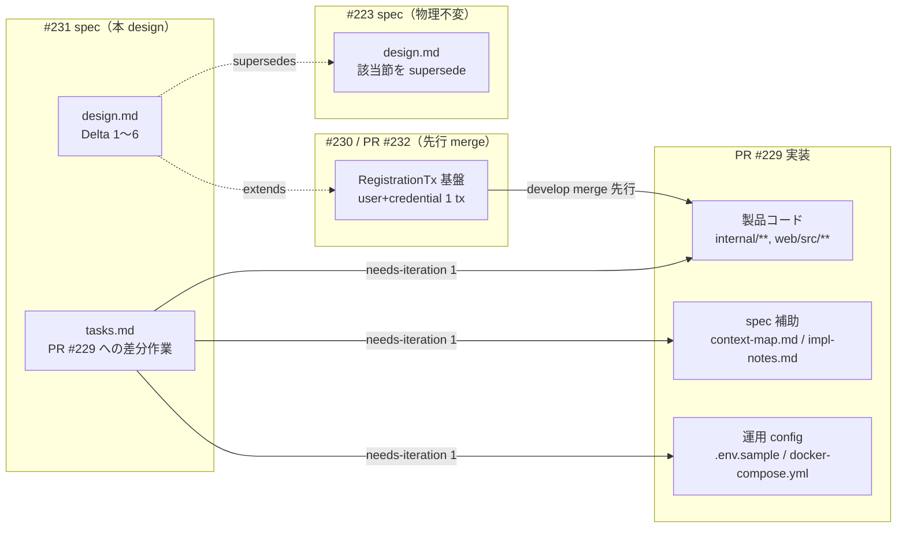
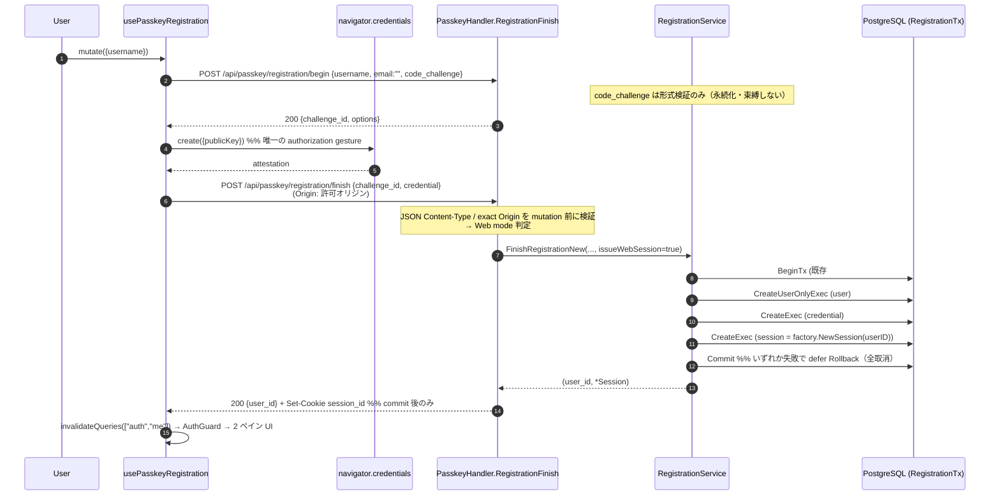
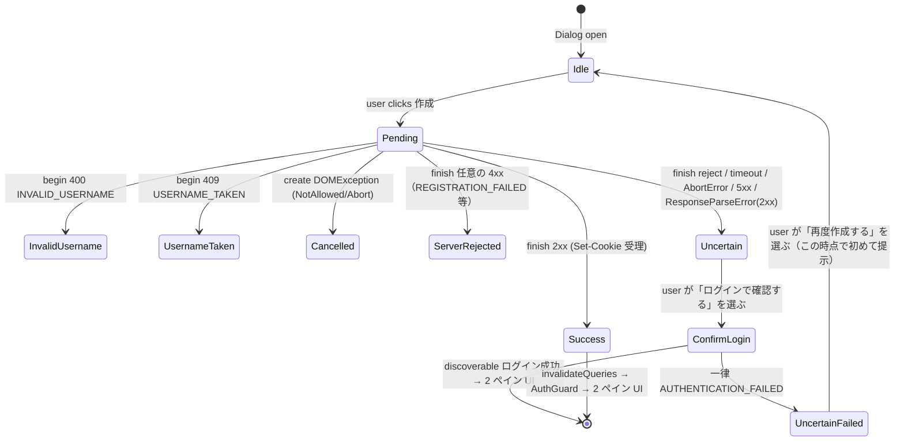

# Design Document

## Overview

**Purpose**: 本設計は Issue #223（Web ログイン画面のパスキー導線追加）に対する
**差分設計（normative delta）** である。#223 の実装 PR #229 レビューで発見された 5 件の
不整合と、運用 config 統合（Requirement 6）を、#223 spec の物理ファイルを一切変更せず、
本 spec 内で normative に上書き（supersede）する。5 件の不整合は
(1) 登録直後の二度目 WebAuthn ceremony、(2) File Structure Plan の欠落、
(3) fail-closed 表の不正確さ、(4) CSRF 記述の誤り、(5) 完了不明状態の未定義。

**中核決定（人間運用者による #231 決定 1.A）**: 新規作成の合流は **`POST /api/passkey/
registration/finish` の検証成功から同一 DB トランザクションで user・credential・Web session の
3 行を作成し、commit 後に同じ finish 応答で `Set-Cookie` する直接 session 方式** で行う。
登録用 auth_code・二度目の `navigator.credentials.get()`・登録専用の `/api/auth/session`
呼び出し・exchange artifact は **導入しない**。`/api/auth/session` は既存パスキー **ログイン**
用（auth_code 交換）としてそのまま残す。本設計は初版 design（auth_code additive 案 = 仮案 B）を
全面的に置き換える。

**前提となる先行実装（#230 / PR #232）**: 新規登録 finish の user + credential を単一
トランザクションで INSERT する基盤は Issue #230（PR #232）が既に実装済みである
（`passkey.RegistrationTx` / `RegistrationTxBeginner` / `RegistrationService.txBeginner` の
`BeginTx → defer Rollback → Commit` パターン、`UserWriter.CreateUserOnlyExec` /
`PasskeyCredentialWriter.CreateExec`、`app` 側の `passkeyRegistrationTxBeginnerAdapter`）。
本 spec は **その既存トランザクションを session 行まで拡張する**（新しい tx 実行機構を作らない）。
`internal/repository/tx.go` は #231 では変更しない。`CreateUserOnlyExec` / credential `CreateExec` /
`txBeginner` は **#230 由来の既存前提**であり #231 の新規作業には数えない。運用順序は
**#230（PR #232）を develop に merge → PR #229 がその実装を取り込む** とし、tasks の依存で明示する。

**Users**: 未認証 Web 訪問者（パスキーで新規作成する層／ iOS #216 で作成したパスキーで Web
にログインする層）と、既存 Google OAuth ユーザー、Feedman 運用者。iOS #216 ユーザーへの
影響はゼロ（`/api/passkey/registration/*` / `/api/passkey/authentication/*` の request/response
JSON を変更しない。Web の差分は `Set-Cookie` ヘッダのみ / NFR 3.2）。

**Impact**: 本 spec は独立した実装 PR を作らない。design PR merge 後、PR #229 の
`needs-iteration` 1 回で製品コード（`internal/passkey/` / `internal/handler/` /
`internal/repository/` / `internal/auth/` / `internal/config/` / `web/src/`）・テスト・spec の
`impl-notes.md` / `context-map.md`（**#223 / #216 / #230 spec の requirements.md / design.md /
tasks.md は書き換えない**）へ差分を反映する。

### 補正する 6 つの Delta サマリ

- **Delta 1（Requirement 1）— 直接 Cookie session**: 登録 finish で二度目の WebAuthn ceremony を
  廃止する。#230（PR #232）の既存 `RegistrationService.FinishRegistrationNew`（`txBeginner` の
  `BeginTx → defer Rollback → Commit` で user → credential を作成）を、**credential INSERT の後・
  commit の前に session 行 INSERT を 1 つ加える** 形に拡張する（3 行 atomic）。session の
  ID / `CreatedAt` / `ExpiresAt` は既存 login session 発行と共有する **session factory** で一貫生成する。
  handler は commit 後に既存 Cookie 属性で `Set-Cookie` する。`registration/finish` の request/response
  JSON は Web / iOS とも `{user_id}` のまま変更しない（Web だけ `Set-Cookie` が付く / NFR 3.2）。
  登録 begin の `code_challenge` は #216 契約維持のためフィールドを残すが **形式検証のみ** で
  永続化・束縛しない。
- **Delta 2（Requirement 2）— File Structure Plan 補正**: PR #229 の実変更ファイルを
  File Structure Plan 差分に **exact-path で完全列挙**し、「#231 でさらに編集するもの」と
  「PR #229 / #232 に既に含まれるが #231 では不変のもの」を分離する（`web/src/lib/api.ts` /
  `api.test.ts` / `.env.sample` / `docker-compose.yml` / `review-notes.md` /
  `router_unauth_ratelimit_test.go` / `session_exchange_test.go` /
  `use-passkey-authentication.contract.test.tsx` を含む）。本設計で新規追加する
  session tx 対応（session repo `CreateExec`・共有 session factory・共有 Cookie builder・
  `WebPasskeyAllowedOrigin` config）も列挙する。
- **Delta 3（Requirement 3）— fail-closed 表 5 列化 + readiness 強化**: fail-closed 表を
  Web capability / Web login exchange / Web registration direct session / iOS registration/* /
  iOS authentication/* の **5 列独立** で組み直す。router の capability / `/api/auth/session` gate は
  PR #229 の `NativeAuthHandler.SessionReady()` を **維持**（弱めない）し、capability には
  **direct-registration readiness（`webRegistrationReady()`）と明示された exact Origin** を
  **追加要件**として課す（capability 200 なのに signup 500 の不整合を防ぐ）。
- **Delta 4（Requirement 4）— CSRF / PKCE 正確化**: 「攻撃者は (auth_code, code_verifier) ペアを
  取得できない」の誤記述を撤回する。直接登録 session の主防御（authenticator の
  **authorization gesture**（user presence、場合により user verification）+ exact Origin +
  JSON Content-Type + CORS preflight / SameSite）と、ログイン auth_code 交換の主防御
  （上記 + PKCE 単回 60s TTL）を **分離** して明記し、PKCE が直接登録を防御しないことを述べる。
  既存 `/api/auth/session`（login）の Origin 検証も **Origin 不在・不一致・許可 Origin 未設定を
  拒否** する fail-closed へ補正する。
- **Delta 5（Requirement 5）— 完了不明状態**: 「finish dispatch 後に確定的な pre-commit 4xx を
  得られない」ケース（network reject / timeout / 送出後 Abort / 5xx / commit 済みを示唆する 2xx だが
  body 欠損・途中切断・parse 不能）を **第 3 の完了不明状態** `registration_uncertain` として定義する。
  この判別を成立させるため **API 層（`api.ts`）で dispatch 前の request preparation 失敗を
  `RequestPreparationError`、fetch 成功後の 2xx body parse 失敗を `ResponseParseError`（status 付き）に
  正規化**し、`fetch()` reject の plain `TypeError` を含む 3 起点を機械的に区別できるようにする（Blocker #1）。
  さらに **discoverable ログインの一律 `AUTHENTICATION_FAILED` を auth hook の machine-readable kind に正規化**
  し（Blocker #3）、復旧は「**discoverable なパスキーログイン**（ユーザー名入力なし）で確認 → 成功なら完了 →
  一律の `AUTHENTICATION_FAILED` の後にのみ再作成導線」に統一する。
- **Delta 6（Requirement 6）— 運用 config 統合**: `.env.sample` / `docker-compose.yml` の記述差分を
  PR #229 のスコープに統合する（別 prerequisite PR に分離しない）。`CORS_ALLOWED_ORIGIN` の
  **既定を空へ変更**し、config が「明示設定された exact Origin のみを Web パスキーで信頼する」
  ように補正することで、fail-closed（未設定 → capability 404 / Origin 検証 403）を **到達可能・
  検証可能**にする。`WebPasskeyAllowedOrigin` は生値の非空判定ではなく **trim + strict exact-Origin
  validation** を課し、malformed 値も `""`（fail-closed）に倒す（Blocker #6）。Verify には代表 env 値
  （`SESSION_SECRET` / `POSTGRES_PASSWORD` を含む）付き `docker compose config` を **set / unset 両方**で
  実行し、api の `CORS_ALLOWED_ORIGIN` 展開値（set=明示 origin / unset=空）を assertion する（Blocker #7）。

### Goals

- 主要目標 1: 新規作成完了までに追加の WebAuthn ceremony を要求しない（Requirement 1）
- 主要目標 2: registration finish の user / credential / session を **単一トランザクションで atomic**
  に作成し、session 生成・保存失敗時も全ロールバックする（Requirement 1 / データ整合性）
- 主要目標 3: iOS #216 の `/api/passkey/*` request/response 契約を破壊しない（NFR 3.2）
- 主要目標 4: fail-closed 表・CSRF 記述・完了不明状態を運用者・レビュワーが誤読しない粒度で明確化
  （Requirement 3 / 4 / 5）
- 成功基準:
  - PR #229 に本差分を反映した後の `go test ./...` / `go vet ./...` / `web` の test / lint / build が green
  - `POST /api/passkey/registration/finish` が Web（Origin 一致）で 200 `{user_id}` + `Set-Cookie` を返し、
    二度目 ceremony なしで 2 ペイン UI に到達する
  - 実 PostgreSQL で「session 書込失敗時に user / credential も作成されず Set-Cookie も出ない
    （3 行 atomic）」ことを検証
  - `CORS_ALLOWED_ORIGIN` 未設定時に capability=404、明示設定時に capability=200 となることを config テストと router テストで検証
  - `NATIVE_AUTH_JWT_SECRET` 未設定 + `WEBAUTHN_*` 設定済み env で iOS 用
    `/api/passkey/registration/*` / `/api/passkey/authentication/*` が引き続き 200 応答する

### Non-Goals

- **#223 / #216 / #230 spec の物理ファイル書換え**（各 requirements.md / design.md / tasks.md）— 本 spec は
  差分宣言のみを行い、それら物理ファイルは触らない（NFR 1.1 / 1.3）
- **独立した実装 PR の作成** — 差分は PR #229 の needs-iteration 1 回で反映（NFR 1.2）
- **#216 iOS パスキー API の request/response JSON 契約の破壊的変更**（NFR 1.3 / NFR 3.2）
- **新しいトランザクション実行機構（`WithinTx` / `txRunner` 等）の追加** — #230 の
  `RegistrationTxBeginner` を再利用する（`internal/repository/tx.go` は不変）
- **登録用 auth_code / 二度目 ceremony / 登録専用 session 交換 endpoint / exchange artifact の導入**
  （決定 1.A により不採用）
- **browser-bound state（transaction cookie / 追加 CSRF token / Origin-bound challenge 拡張）の導入**
  （Requirement 4 の決定事項）
- **`.env.sample` / `docker-compose.yml` を別 prerequisite PR に分離すること**（Requirement 6 の決定事項）
- **WebAuthn の user verification（生体認証）を必須化する設計**（現 adapter は
  `userVerification=required` を指定せず、authorization gesture は user presence の場合もある。Delta 4 参照）

## Architecture

### Existing Architecture Analysis（PR #229 / #232 head 実装に基づく）

本差分は #216 / PR #229 / #230(PR #232) が確立した以下の既存アーキテクチャを **維持する前提** で補正する。
責務境界・依存方向は変更しない（`handler → service → repository → model` の一方向 / CLAUDE.md §1）:

- **維持する既存要素**:
  - `internal/passkey/` の ceremony 責務と `internal/handler/passkey_handler.go` の HTTP I/O 責務の分離、
    `challengeStore.Issue/Consume` の TTL 付き単回消費（#216 で確立）
  - **#230（PR #232）の新規登録 tx 基盤**: `passkey.RegistrationTx`（`Querier() repository.DBTX` /
    `Commit` / `Rollback`）/ `passkey.RegistrationTxBeginner`（`BeginTx(ctx) (RegistrationTx, error)`）/
    `RegistrationService.txBeginner` / `FinishRegistrationNew` の
    `BeginTx → defer Rollback → CreateUserOnlyExec → CreateExec → Commit` パターン /
    `app` 側 `passkeyRegistrationTxBeginnerAdapter`、および
    `UserWriter.CreateUserOnlyExec` / `PasskeyCredentialWriter.CreateExec`（**すべて #230 既存**。UNIQUE 衝突を
    `ErrUsernameTaken` / `ErrCredentialAlreadyRegistered` に正規化）。`internal/repository/tx.go` は **#231 では変更しない**
  - login session 発行: `auth.Service.createSession` と `auth.SessionExchangeService`（PR #229）は
    いずれも `generateSessionID`（**`internal/auth/service.go` に定義**）+ `now` + `CreatedAt=now` +
    `ExpiresAt=now+TTL` で `model.Session{ID, UserID, ExpiresAt, CreatedAt}` を構築する
  - `NativeAuthHandler.Session` + `SessionReady()` / `PasskeyHandler.Capability`（到達 = `{available:true}`）/
    Google OAuth Callback の Cookie 属性（`session_id` / HttpOnly / SameSite=Lax / Secure / Path=/ / Domain / Max-Age）
  - `config.go` の `CORSAllowedOrigin`（既定 `http://localhost:3000`）/ `CookieDomain`（既定空）/
    `CookieSecure`（`BaseURL` が https で true）/ `SessionMaxAge`（既定 86400）、fail-closed route 判定パターン
- **本差分が変更する点**（詳細ファイルは §File Structure Plan [E]/[N] を参照）: 既存 #230 tx クロージャ内へ
  session 行 INSERT を追加（`FinishRegistrationNew` に `issueWebSession bool` + `*model.Session` 返却）/
  session repo `CreateExec`（#231 新規）と **共有 session factory**（`internal/auth/session_factory.go`）で
  session 構築を一元化 / `PasskeyHandler.RegistrationFinish` の Origin mode 判定 + `Set-Cookie` /
  Cookie 生成を canonical builder に集約 / `config.go` の `WebPasskeyAllowedOrigin`（明示設定 exact Origin。
  `CORSAllowedOrigin` 既定は不変）/ capability gate に origin + `webRegistrationReady()` 追加（`SessionReady()` 維持）/
  `native_auth_handler.Session` の Origin fail-closed 補正 / Web の二度目 ceremony 除去 + `registration_uncertain` +
  `api.ts` の 2xx parse 型付き正規化 + 完了不明状態 UI / `.env.sample`・`docker-compose.yml` の CORS 既定変更
- **尊重すべき制約**:
  - iOS #216 の request/response 契約：`registration/begin` request `{username, email?, code_challenge}`、
    `registration/finish` request `{challenge_id, credential}` / response `{user_id}`、
    `authentication/*` の各フィールド構造をそのまま維持する（Web も response は `{user_id}` 不変。
    差分は `Set-Cookie` ヘッダのみで JSON body には現れない）
  - NFR 1.1（#223 spec 物理ファイル不変）/ NFR 1.3（#216 / #230 spec 物理ファイル・API 契約不変）

### 差分適用の運用境界



### Technology Stack

本差分は **技術スタック追加なし**。既存の技術選定（Go 1.25 / chi/v5 / PostgreSQL 16 /
go-webauthn / `database/sql` トランザクション / Next.js 15 / TanStack Query / shadcn/ui /
Vitest）をそのまま使用する。session ID 生成は既存 `internal/auth/service.go` の
`generateSessionID`（32 バイト crypto random / hex）を **共有 session factory 経由で再利用**する
（新たな生成器を作らない）。

## File Structure Plan（PR #229 に適用する差分の変更対象 / 新規追加）

本セクションは PR #229 の `needs-iteration` 1 回で反映する対象ファイルを、Reviewer が
`git diff --name-only develop..<PR#229 head>` と 1:1 で突合できるよう **1 ファイル 1 行の full exact-path** で
列挙する（Requirement 2 / 2.5）。**#223 design.md「File Structure Plan」節を supersede する**。
**canonical な比較対象（機械照合の基準時点）**は、**#230（PR #232）を develop に merge し、PR #229 が
その develop を取り込んだ後の最終 diff**（`git diff --name-only develop..<PR#229 head>`）とする。その時点で
本表と 1:1 の機械照合が成立する（Blocker #5）。各ファイルを 3 区分に分類する:

- **[E]** = #231 でさらに編集する（PR #229 の needs-iteration 1 回で本差分を反映）
- **[U]** = PR #229 / #232 に既に含まれるが **#231 ではさらに編集しない**（記録のみ / 過剰変更でない証跡）
- **[N]** = 本差分で新規追加する

> #216 / #230 spec 本体（`docs/specs/216--app-store-4-8/**` / `docs/specs/230-fix-passkey-credential/**`）は
> いずれの区分にも入れない（NFR 1.3。tasks に編集タスクを置かない）。

### サーバ（Go）

| 区分 | パス | #231 での扱い |
|---|---|---|
| [U] | `internal/repository/tx.go` | #230/#232 の tx 基盤を **そのまま再利用**。#231 変更なし |
| [U] | `internal/repository/postgres_user_repo.go` | `CreateUserOnlyExec` は **#230 既存**。#231 変更なし |
| [U] | `internal/repository/postgres_passkey_credential_repo.go` | `CreateExec` は **#230 既存**。#231 変更なし |
| [E] | `internal/repository/postgres_session_repo.go` | **既存ファイル**（既存 `Create` / `DeleteByUserIDExec` を持つ）へ session 作成の tx 変種 `CreateExec(ctx, q DBTX, s)` を追加、既存 `Create` は委譲（差分等価）。新規ファイルではないため [E]（Blocker #5） |
| [N] | `internal/auth/session_factory.go` | 共有 session factory（ID + 単一 now + CreatedAt + ExpiresAt）。`SessionExchangeService` と RegistrationService が共有 |
| [N] | `internal/auth/session_factory_test.go` | factory の ID / CreatedAt / ExpiresAt / 単一 now / generator 失敗を検証 |
| [U] | `internal/auth/service.go` | `generateSessionID`（**unexported**）を本ファイルに定義済みのまま再利用。`session_factory.go` が同一 package（`internal/auth`）からそのまま参照するため #231 変更なし。旧 File Plan の「session_exchange.go から export」は誤りで、**薄い public `NewSessionID` は追加しない**（Blocker #2） |
| [E] | `internal/auth/session_exchange.go` | session 構築を新 factory 呼び出しに差し替え（`SessionExchangeService` の外部契約・挙動は不変 / 差分等価） |
| [E] | `internal/auth/session_exchange_test.go` | factory 差し替え後も既存アサーションが pass することを確認（CreatedAt / ExpiresAt 検証を追加） |
| [E] | `internal/passkey/registration_service.go` | `FinishRegistrationNew` を既存 tx クロージャ内 session INSERT + `issueWebSession bool` + `*model.Session` 返却に拡張。session factory / session writer を注入、`WebSessionReady()` 追加 |
| [E] | `internal/passkey/registration_service_test.go` | 新シグネチャ追従 + Web/iOS branch + 全 rollback + session の ID/CreatedAt/ExpiresAt 検証 |
| [E] | `internal/handler/passkey_handler.go` | `allowedOrigin` + Cookie 設定 Option 注入、`RegistrationFinish` の mode 判定 / JSON Content-Type / readiness fail-closed / commit 後 `Set-Cookie`、`webRegistrationReady()` |
| [E] | `internal/handler/passkey_handler_test.go` | mode 判定 / Set-Cookie / iOS `{user_id}` + Cookie なし回帰 / partial readiness fail-closed |
| [N] | `internal/handler/session_cookie.go` | canonical Cookie builder `buildSessionCookie(...)` を 3 handler で共有 |
| [N] | `internal/handler/session_cookie_test.go` | builder の属性が Google OAuth Callback と一致することを検証 |
| [E] | `internal/handler/auth_handler.go` | Google OAuth `Callback` のインライン `session_id` Cookie 生成を canonical `buildSessionCookie(...)` へ差し替え（属性は現行と完全一致・差分等価 / Blocker #5） |
| [E] | `internal/handler/native_auth_handler.go` | `Session` の Origin 検証を fail-closed（不在・不一致・許可 Origin 未設定を 403）へ補正。加えてインライン Cookie 生成を `buildSessionCookie(...)` へ差し替え（差分等価） |
| [E] | `internal/handler/native_auth_handler_test.go` | Origin fail-closed の異常系追加 |
| [E] | `internal/handler/router.go` | capability 条件に `WebPasskeyAllowedOrigin != ""` + `PasskeyHandler.webRegistrationReady()` を追加（`SessionReady()` 維持）。iOS route 条件 `PasskeyHandler != nil` は不変 |
| [E] | `internal/handler/router_test.go` | fail-closed 表 5 列 + partial wiring（capability/session/registration の登録一致）を table-driven で検証 |
| [U] | `internal/handler/router_unauth_ratelimit_test.go` | PR #229 で追加済み。#231 変更なし（記録） |
| [E] | `internal/handler/passkey_e2e_db_test.go` | 実 PostgreSQL で 3 行 commit / session 失敗時の全 rollback + Set-Cookie なし |
| [E] | `internal/config/config.go` | `WebPasskeyAllowedOrigin`（`CORS_ALLOWED_ORIGIN` を **trim + strict exact-Origin validation** した値。未設定/空/malformed → `""` の fail-closed）を追加。`CORSAllowedOrigin` 既定は不変（新規 env は追加しない / Blocker #6） |
| [E] | `internal/config/config_test.go` | `CORS_ALLOWED_ORIGIN` の set / unset / empty / **malformed（前後空白・末尾スラッシュ・path/query/fragment 付き・複数 origin）** での `WebPasskeyAllowedOrigin`（valid のみ採用 / それ以外 `""`）を検証。`CORSAllowedOrigin` は既定 localhost:3000 を維持（Blocker #6） |
| [E] | `internal/app/app.go` | RegistrationService へ session writer / session factory / TTL を注入、PasskeyHandler へ `WebPasskeyAllowedOrigin` + Cookie 設定を注入（`NATIVE_AUTH_JWT_SECRET` 非依存で `WEBAUTHN_*` 設定時に配線） |

### Web（TypeScript）

| 区分 | パス | #231 での扱い |
|---|---|---|
| [E] | `web/src/lib/api.ts` | 2xx の `response.json()` 失敗を status 付き `ResponseParseError` へ、dispatch 前の request preparation 失敗（`JSON.stringify` / URL 構築）を `RequestPreparationError` へ **それぞれ正規化**し、`fetch()` reject の plain `TypeError` と機械的に区別可能にする（Blocker #1） |
| [E] | `web/src/lib/api.test.ts` | 2xx body 欠損/途中切断/parse 不能 → `ResponseParseError`（status 2xx）、request preparation 失敗 → `RequestPreparationError`、fetch reject → plain `TypeError` の 3 者が区別されることを検証（Blocker #1） |
| [E] | `web/src/types/passkey.ts` | `PasskeyRegistrationErrorKind` に `"registration_uncertain"` を追加。authentication error 種別に「finish の一律 `AUTHENTICATION_FAILED` のみを表す machine-readable kind」を追加（Blocker #3。raw body / 内部理由は保持しない）。`RegistrationFinishResponse` は `{user_id}` のまま（auth_code を追加しない） |
| [E] | `web/src/hooks/use-passkey-registration.ts` | chain を「begin → create → finish → invalidateQueries」に短縮（二度目 ceremony / 登録用 `/api/auth/session` を除去）。finish の error を uncertain / rejected（全 4xx）/ server_error（`RequestPreparationError`）に分類（Blocker #1） |
| [E] | `web/src/hooks/use-passkey-registration.test.tsx` | 二度目 ceremony 不在回帰 + uncertain 4 サブケース + 全 4xx=rejected 回帰 + `RequestPreparationError`=server_error（ファイル拡張子は `.test.tsx` / PR #229 実体に一致） |
| [E] | `web/src/hooks/use-passkey-authentication.ts` | discoverable ログイン復旧で再利用。**finish の一律 `AUTHENTICATION_FAILED` を表す machine-readable kind** を追加し、begin 拒否 / cancel / network / 5xx / session 交換失敗を別 kind に保つ（Blocker #3。内部理由・raw body は UI に渡さない） |
| [E] | `web/src/hooks/use-passkey-authentication.test.tsx` | 一律 `AUTHENTICATION_FAILED` kind の付与と、begin 拒否 / cancel / network / 5xx / session 交換失敗が別 kind になる negative test（Blocker #3） |
| [E] | `web/src/components/passkey-signup-dialog.tsx` | 完了不明状態 UI + discoverable ログイン復旧導線（段階提示） |
| [E] | `web/src/components/passkey-signup-dialog.test.tsx` | uncertain 見出し / 段階提示 / 一律 `AUTHENTICATION_FAILED` 後のみ再作成 / 内部詳細非漏出の回帰 |
| [E] | `web/src/components/login-page-recovery.test.tsx` | uncertain → discoverable ログイン成功 → 2 ペイン到達の recovery 整合 |
| [U] | `web/src/hooks/use-passkey-authentication.contract.test.tsx` | PR #229 追加済み。#231 変更なし（記録） |
| [U] | `web/src/components/login-page.tsx` | PR #229 追加済み。#231 変更なし |
| [U] | `web/src/components/login-page.test.tsx` | PR #229 追加済み。#231 変更なし |
| [U] | `web/src/components/passkey-buttons.tsx` | PR #229 追加済み。#231 変更なし |
| [U] | `web/src/components/passkey-buttons.test.tsx` | PR #229 追加済み。#231 変更なし |
| [U] | `web/src/hooks/use-passkey-capability.ts` | PR #229 追加済み。#231 変更なし |
| [U] | `web/src/hooks/use-passkey-capability.test.tsx` | PR #229 追加済み。#231 変更なし |
| [U] | `web/src/lib/webauthn.ts` | PR #229 追加済み。#231 変更なし |
| [U] | `web/src/lib/webauthn.test.ts` | PR #229 追加済み。#231 変更なし |
| [U] | `web/src/lib/pkce.ts` | PR #229 追加済み。#231 変更なし |
| [U] | `web/src/lib/pkce.test.ts` | PR #229 追加済み。#231 変更なし |
| [U] | `web/src/lib/passkey-capability.ts` | PR #229 追加済み。#231 変更なし |
| [U] | `web/src/lib/passkey-capability.test.ts` | PR #229 追加済み。#231 変更なし |

### 運用 config（Requirement 6）

| 区分 | パス | #231 での扱い |
|---|---|---|
| [E] | `.env.sample` | `CORS_ALLOWED_ORIGIN` の fail-closed 接続（未設定 → capability 404 / Origin 検証 403）をコメントで明記。WebAuthn env ブロックは PR #229 で追加済み（記述整備のみ） |
| [E] | `docker-compose.yml` | `api` の `CORS_ALLOWED_ORIGIN=${CORS_ALLOWED_ORIGIN:-http://localhost:3000}` を `${CORS_ALLOWED_ORIGIN:-}` へ変更（未設定 → 空 → fail-closed 到達可能に）。WebAuthn passthrough は PR #229 で追加済み |

### spec 補助（#223 spec 本体 3 文書は不変 / NFR 1.1）

| 区分 | パス | #231 での扱い |
|---|---|---|
| [E] | `docs/specs/223-feat-web-web/impl-notes.md` | #231 delta 適用結果を追記 |
| [E] | `docs/specs/223-feat-web-web/context-map.md` | `finish → 3 行 tx → commit → Set-Cookie` へ経路更新 / fail-closed 表 5 列 supersede / 完了不明状態遷移追加 |
| [U] | `docs/specs/223-feat-web-web/requirements.md` | PR #229 に既存。#231 では **書き換えない**（NFR 1.1。記録） |
| [U] | `docs/specs/223-feat-web-web/design.md` | PR #229 に既存。#231 では **書き換えない**（NFR 1.1。記録） |
| [U] | `docs/specs/223-feat-web-web/tasks.md` | PR #229 に既存。#231 では **書き換えない**（NFR 1.1。記録） |
| [U] | `docs/specs/223-feat-web-web/review-notes.md` | PR #229 に既存。#231 では **書き換えない**（NFR 1.1。記録） |

## Requirements Traceability

| Requirement | Summary | Traced to |
|-------------|---------|-----------|
| 1.1 | 登録 finish 後の追加 WebAuthn ceremony 禁止 | Delta 1 §Sequence / §Web Hook |
| 1.2 | 二度目 ceremony を実装として採用しない | Delta 1 §Before → After |
| 1.3 | 3 行単一 tx → commit → Set-Cookie（iOS は 2 行・Cookie なし） | Delta 1 §3 行トランザクション / §Set-Cookie / §iOS 契約維持 |
| 1.4 | 2 ペイン UI 初期表示 | Delta 1 §Sequence（invalidateQueries → AuthGuard） |
| 1.5 | ログイン導線への影響なし | Delta 1 §影響範囲（`use-passkey-authentication` 未変更） |
| 2.1 | api.ts / api.test.ts を変更対象に明示 | File Structure Plan §Web |
| 2.2 | .env.sample / docker-compose.yml を変更対象に明示 | File Structure Plan §運用 config |
| 2.3 | needs-iteration 1 回で完結する粒度のタスク | tasks.md 全体 |
| 2.4 | #223 / #216 / #230 spec 書換タスクを含まない | File Structure Plan（[U] 記録 / 本体編集タスク不在） |
| 2.5 | Reviewer が変更ファイルを exact-path で突合できる | File Structure Plan（[E]/[U]/[N] 区分） |
| 3.1 | Web login session 交換 endpoint を独立列に | Delta 3 §fail-closed 表（列 B） |
| 3.2 | Web capability probe を独立列に | Delta 3 §fail-closed 表（列 A） |
| 3.3 | NATIVE unset + WEBAUTHN set で iOS 継続 | Delta 3 §fail-closed 表 行 2 / §iOS 契約維持 |
| 3.4 | WEBAUTHN unset で Web 縮退 + iOS 停止 | Delta 3 §fail-closed 表 行 4 / 5 |
| 3.5 | iOS request/response 契約破壊禁止 | Delta 1 §iOS 契約維持 / Delta 3 §登録条件不変 |
| 3.6 | direct-registration readiness 不足時に capability 404 | Delta 3 §capability readiness / §webRegistrationReady / Delta 6 §exact Origin validation |
| 4.1 | CSRF 主防御要素を要素ごと・endpoint ごとに明記 | Delta 4 §主防御要素表 |
| 4.2 | 旧誤記述の撤回と正しい前提の明記 | Delta 4 §旧記述の撤回 |
| 4.3 | 残余リスクの列挙 | Delta 4 §残余リスク |
| 4.4 | browser-bound state 不要の決定明記 | Delta 4 §決定記録 |
| 4.5 | Cookie 属性の既存 Google OAuth 一致維持 | Delta 4 §Cookie 属性の維持 / New Files（共有 builder） |
| 4.6 | 将来検討導線を残す | Delta 4 §将来検討導線 |
| 4.7 | PKCE を直接登録に適用せず login 交換に限定 | Delta 1 §mode 判定（code_challenge 形式検証のみ）/ Delta 4 §主防御要素表 |
| 5.1 | 第 3 の完了不明状態としてユーザーに提示 | Delta 5 §状態定義 / §API 層の型付き正規化 / §Hook 判定 |
| 5.2 | discoverable ログイン確認を提示（再作成は同列不可） | Delta 5 §UI 文言と復旧導線 |
| 5.3 | 復旧ログイン成功で 2 ペイン UI | Delta 5 §状態遷移図（成功） |
| 5.4 | 一律失敗の後にのみ再作成導線 | Delta 5 §状態遷移図（失敗）/ §discoverable ログイン結果の machine-readable 判定（auth hook） |
| 5.5 | サーバ内部詳細を反射しない | Delta 5 §UI 文言（generic 固定） |
| 5.6 | 他状態と混同されない文言 | Delta 5 §既存 error kind との弁別 |
| 6.1 | .env.sample を変更対象に明示 | Delta 6 §反映内容 / File Structure Plan |
| 6.2 | docker-compose.yml を変更対象に明示 | Delta 6 §反映内容 / File Structure Plan |
| 6.3 | needs-iteration 1 回で完結する config タスク | tasks.md Task 7 |
| 6.4 | 別 prerequisite PR に分離しない決定明記 | Delta 6 §決定記録 |
| 6.5 | 既存 env 流用に留め新規 env 追加なしを担保 | Delta 6 §既存 env 流用 |
| NFR 1.1 | #223 spec 物理ファイル不変 | Non-Goals / File Structure Plan（[U] 記録） |
| NFR 1.2 | 独立実装 PR を作らず PR #229 needs-iteration 1 回で反映 | Non-Goals / tasks.md 全体 |
| NFR 1.3 | #216 / #230 契約を破壊するタスクを含まない | Delta 1 §iOS 契約維持 / File Structure Plan（[U] 記録） |
| NFR 2.1 | 完了不明状態・session 発行の秘密情報非漏出 | Delta 1 §NFR / Delta 5 §秘密情報の非漏出 |
| NFR 2.2 | CSRF / fail-closed 記述に秘密値を例示しない | Delta 3 / Delta 4（例示値なし） |
| NFR 3.1 | Google OAuth 既存挙動を破壊しない | 全 Delta（Google 経路無変更）/ Delta 6（CORS 層既定不変） |
| NFR 3.2 | iOS #216 request/response 契約不変 | Delta 1 §iOS 契約維持 / Delta 3 §登録条件不変 |

## Delta 1: 登録 finish の直接 Cookie session（Requirement 1）

### Supersedes（#223 design.md の該当節）

- `#223 design.md` §Flows「新規作成フロー（Sequence / 抜粋）」— finish 後の
  `authentication: begin → get → finish → session` 経路と二度目 `navigator.credentials.get()`
- `#223 design.md` §`use-passkey-registration.ts` の「直後に認証 chain」以降のステップ
- 初版 #231 design（auth_code additive 案 = 仮案 B）全体を本 Delta で置き換える

### Before → After Sequence

**Before（PR #229 head の現行実装 = 仮案 B の系譜 / 除去対象）**: finish 200 の後に
`authentication/begin → navigator.credentials.get()`（**二度目 ceremony**）`→ authentication/finish`
`→ POST /api/auth/session {auth_code, code_verifier}`（204 + Set-Cookie）という追加 chain で session に
合流していた。この 4 呼び出しと二度目の authorization gesture を廃止する。

**After（本 Delta 1 で確定する挙動 = 決定 1.A）**:



追加のブラウザ authorization gesture（`navigator.credentials.get`）が消滅し、体験する ceremony は
登録時の `create` 1 回のみになる（Requirement 1.1 / 1.2）。

### Web / iOS mode 判定（`PasskeyHandler.RegistrationFinish`）

handler は challenge consume / DB mutation より **前** に、`Origin` ヘッダで mode を判定する
（推奨境界。別実装でも「JSON body 追加・exchange artifact なしで直接 session」を満たせば可）。
判定に使う許可 Origin は `config.WebPasskeyAllowedOrigin`（**明示設定された** exact Origin。
未設定/空なら `""`）を注入した `h.allowedOrigin` である:

| `Origin` ヘッダ | `h.allowedOrigin`（`WebPasskeyAllowedOrigin`） | 判定 | 挙動 |
|---|---|---|---|
| 一致（`origin == allowedOrigin` かつ `allowedOrigin != ""`） | 設定済 | **Web mode** | JSON Content-Type 検証 → readiness 確認 → `issueWebSession=true` |
| 不在（`""`） | 任意 | **native/iOS mode** | 既存挙動（session 発行なし / `issueWebSession=false`） |
| 非空・不一致、または `allowedOrigin` 未設定（`""`） | — | **拒否** | 403 FORBIDDEN_ORIGIN（mutation・consume なし / fail-closed） |

- Web mode の追加検証（いずれも mutation 前）:
  - **JSON Content-Type 必須**（不一致は 415 UNSUPPORTED_MEDIA_TYPE）。native/iOS mode には
    本検証を **課さない**（#216 既存クライアント互換 / NFR 3.2）
  - **readiness**（`PasskeyHandler.webRegistrationReady()`。定義は Delta 3）が false なら
    fail-closed（500 相当、mutation なし）。通常 wiring では `WEBAUTHN_*` 設定時に session 発行依存が
    常時配線されるため、実質は `WebPasskeyAllowedOrigin` の明示設定有無が支配的
- iOS はネイティブ HTTP クライアントで `Origin` を送らないため native mode に落ち、session / Cookie を
  作らず `{user_id}` のみを返す（#216 と差分等価 / NFR 3.2）

### Server 側の実装差分

#### 共有 session factory（`internal/auth/session_factory.go` / New / Blocker #2 対応）

login session 発行（`Service.createSession` / `SessionExchangeService`）と registration direct session が
**同一の session 構築ロジック**（ID 生成 + 単一 `now` + `CreatedAt=now` + `ExpiresAt=now+TTL`）を
共有するための最小 factory を新設する。RegistrationService には具体型ではなく最小 interface を
注入する（interface segregation / テスト可能性）:

```go
// internal/auth/session_factory.go（New）
// SessionFactory は model.Session を ID + 単一 now + CreatedAt + ExpiresAt で一貫生成する。
// generateSessionID（internal/auth/service.go / 同一 package）と now / TTL を集約し、複製を排除する。
type SessionFactory struct {
    ttl   time.Duration
    now   func() time.Time       // テスト差し替え可（既定 time.Now）
    newID func() (string, error) // ID 生成の test seam（既定 = generateSessionID）。
                                 // crypto/rand.Reader の global 差替えを避け、rand 失敗を局所注入できる（Blocker #2）
}

// NewSessionFactory は production 既定（now=time.Now / newID=generateSessionID）で factory を構築する。
// generateSessionID は同一 package（internal/auth）の unexported 関数のため、export helper を新設せず
// そのまま既定 newID に束ねる（薄い public NewSessionID は追加しない / Blocker #2）。
func NewSessionFactory(ttl time.Duration) *SessionFactory {
    return &SessionFactory{ttl: ttl, now: time.Now, newID: generateSessionID}
}

// NewSession は 1 度の now を用いて ID / CreatedAt / ExpiresAt を整合させた Session を返す。
// ID 生成失敗（newID 失敗 = rand.Read 失敗）はそのまま error として返す（部分構築しない）。
func (f *SessionFactory) NewSession(userID string) (*model.Session, error) {
    id, err := f.newID() // 既定は generateSessionID。テストは失敗する newID を注入して検証（Blocker #2）
    if err != nil { return nil, err }
    now := f.now()
    return &model.Session{ID: id, UserID: userID, CreatedAt: now, ExpiresAt: now.Add(f.ttl)}, nil
}

// RegistrationService が受ける最小 IF（interface segregation）
type SessionFactoryFunc interface {
    NewSession(userID string) (*model.Session, error)
}
```

- `SessionExchangeService` は現在の inline 構築（`generateSessionID` + `now` + `CreatedAt` + `ExpiresAt`）を
  `SessionFactory.NewSession` 呼び出しに差し替える（外部契約・挙動は不変 / 差分等価）
- `Service.createSession`（Google OAuth login）も同 factory 採用が望ましいが、最小差分として
  少なくとも `SessionExchangeService` と registration direct session の 2 経路で factory を共有する
  （review Blocker #2 の要求「at least existing SessionExchangeService and registration direct session」）
- `generateSessionID` は **`internal/auth/service.go`** に **unexported** で定義されている（旧 File Plan の
  「`session_exchange.go` から export」は誤り）。`session_factory.go` は同一 package（`internal/auth`）のため
  この unexported 関数を既定 `newID` としてそのまま参照でき、**`service.go` の変更も薄い public `NewSessionID` の
  追加も不要**（Blocker #2 の指摘に沿う）。ID 生成失敗テストは factory に失敗する `newID` を注入して行い、
  `crypto/rand.Reader` の global 差替え（並列テスト汚染）を避ける

#### `internal/passkey/registration_service.go`（Modified / #230 tx を拡張）

```go
// 追加する最小 IF（interface segregation / CLAUDE.md §5）。
// user/credential の Exec 変種と RegistrationTxBeginner は #230 既存のため再宣言しない。
type SessionWriter interface {
    CreateExec(ctx context.Context, q repository.DBTX, s *model.Session) error // #231 新規（session repo）
}

// 構造体に追加（auth_code 関連依存は追加しない）:
//   sessions       SessionWriter          // session 行 INSERT（tx 変種）
//   sessionFactory auth.SessionFactoryFunc // ID + now + CreatedAt + ExpiresAt を一貫生成（共有）
// 既存 txBeginner RegistrationTxBeginner（#230）はそのまま使用する。

// WebSessionReady は Web mode の直接 session 発行が配線済みかを返す（defense-in-depth）。
func (s *RegistrationService) WebSessionReady() bool {
    return s.sessions != nil && s.sessionFactory != nil && s.txBeginner != nil
}

// FinishRegistrationNew: #230 の既存 BeginTx → defer Rollback → Commit を維持し、
// credential CreateExec の後・Commit の前に session INSERT を 1 つ追加する（Web mode のみ）。
func (s *RegistrationService) FinishRegistrationNew(
    ctx context.Context, challengeID string, requestBody []byte, issueWebSession bool,
) (userID string, webSession *model.Session, err error) {
    // ... challenge consume / adapter.FinishRegistration（#230 と同一。変更しない）...
    tx, err := s.txBeginner.BeginTx(ctx)                       // #230 既存
    if err != nil { return "", nil, fmt.Errorf("...: %w", err) }
    committed := false
    defer func() { if !committed { _ = tx.Rollback() } }()      // #230 既存の defer rollback

    if err := s.users.CreateUserOnlyExec(ctx, tx.Querier(), newUser); err != nil { /* #230 既存の正規化 */ }
    if err := s.credentials.CreateExec(ctx, tx.Querier(), cred); err != nil { /* #230 既存の正規化 */ }

    if issueWebSession {                                        // ← #231 で追加する唯一の tx 内ステップ
        sess, e := s.sessionFactory.NewSession(newUser.ID)     // ID + CreatedAt + ExpiresAt を factory で
        if e != nil { return "", nil, fmt.Errorf("failed to build session: %w", e) }
        if e := s.sessions.CreateExec(ctx, tx.Querier(), sess); e != nil {
            return "", nil, fmt.Errorf("failed to create session: %w", e)
        }
        webSession = sess
    }
    if err := tx.Commit(); err != nil {                        // #230 既存
        return "", nil, fmt.Errorf("...: %w", err)
    }
    committed = true
    return newUser.ID, webSession, nil
}
```

- Preconditions: `sessions` / `sessionFactory` は passkey handler 生成時（`WEBAUTHN_*` 設定時）に
  非 nil で注入されている。`txBeginner` は #230 が既に注入している
- Postconditions:
  - 成功（Web mode）: user / credential / session の **3 行が同一 tx で永続化**され、`webSession` は
    factory が生成した ID / `CreatedAt=now` / `ExpiresAt=now+TTL` を持つ
  - 成功（iOS mode）: user / credential の 2 行のみ永続化（session なし / `{user_id}` 応答）
  - 失敗: 部分保存は残さない（既存 defer Rollback により session INSERT 失敗 / commit 失敗でも
    user / credential 行が残らない。3 行 atomic）
- Invariants: `auth_code` 平文 / session ID 生値をログ・エラー・レスポンスに残さない（NFR 2.1。
  session ID は Set-Cookie でのみクライアントへ渡し、ログには出さない）

#### `internal/handler/passkey_handler.go`（Modified）

`RegistrationFinish` は上表の mode 判定（Origin と `h.allowedOrigin` で Web/iOS/拒否を分岐。Web mode は
mutation 前に JSON Content-Type 検証 + `webRegistrationReady()` fail-closed）を行い、既存の
`{challenge_id, credential}` decode → `FinishRegistrationNew(ctx, challengeID, credential, webMode)` を呼ぶ。
既存 error mapping（`ErrRegistrationFailed` → 400 / infra → 500）を維持し、`webSession != nil` のとき
`buildSessionCookie(...)` で `Set-Cookie` を付け、レスポンスは Web / iOS とも 200 `{user_id}`（不変）とする。

#### iOS #216 契約が破壊されない論証（NFR 3.2 / Req 3.5）

- iOS の `registration/finish` レスポンス期待値は `{user_id}` で不変。Web でも JSON body は `{user_id}` の
  ままで、差分は HTTP **ヘッダ** の `Set-Cookie` のみ（iOS は Origin を送らず native mode に落ちるため
  Cookie を受け取らない）
- request JSON（`{challenge_id, credential}`）・`registration/begin` の JSON も不変。登録 begin の
  `code_challenge` はフィールドを維持（形式検証のみ / Req 4.7）
- JSON Content-Type / Origin の追加検証は **Web mode のみ** に課すため、iOS の既存リクエスト経路は不変

### Web 側の実装差分（`use-passkey-registration.ts`）

```typescript
// mutationFn（イメージ、実装コードではない）
async function mutationFn({ username }: { username: string }) {
  // #216 契約維持のため code_challenge は送るが、直接 session 化により code_verifier は使用しない
  const { codeChallenge } = await generatePkcePair();
  const begin = await apiClient.post("/api/passkey/registration/begin",
    { username, email: "", code_challenge: codeChallenge });
  const cred = await navigator.credentials.create(decodeCreationOptions(begin.options));
  // finish の 2xx + Set-Cookie で session 確定（追加 request なし / 二度目 ceremony なし）
  await apiClient.post("/api/passkey/registration/finish",
    { challenge_id: begin.challenge_id, credential: encodeAttestationResponse(cred) });
  await queryClient.invalidateQueries({ queryKey: ["auth", "me"] });
}
```

- `authentication/begin` / `navigator.credentials.get` / `authentication/finish` / 登録用
  `POST /api/auth/session` の 4 呼び出しを **完全削除**（Req 1.1 / 1.2）
- `apiClient` は `credentials: "include"` で Cookie を受理・送出する（既存 PR #229 の api.ts 経路）
- error 分類は §Delta 5 で `registration_uncertain` を追加（`api.ts` の型付き正規化に依拠）

### 影響範囲

- 変更: `RegistrationService.FinishRegistrationNew` / `PasskeyHandler.RegistrationFinish` /
  session repo `CreateExec` / 共有 session factory / 共有 Cookie builder /
  `use-passkey-registration.ts` / `api.ts` / `passkey-signup-dialog.tsx` / `config.go` / `app.go`
- **無変更で維持**:
  - #230 の `RegistrationTx` / `RegistrationTxBeginner` / `txBeginner` / user・credential Exec 変種 /
    `internal/repository/tx.go`（session ステップの追加以外は既存フローそのまま）
  - `AuthenticationService` / `PasskeyButtons`（ログイン導線の**挙動**は影響を受けない / Req 1.5）。
    `use-passkey-authentication.ts` は discoverable ログイン復旧で再利用しつつ、**復旧判定用に finish 一律
    `AUTHENTICATION_FAILED` を表す machine-readable kind を追加する**のみで、既存ログイン flow の挙動・契約は不変
    （Blocker #3 / Delta 5 §auth hook 判定）
  - `SessionExchangeService` の外部契約（login の auth_code 交換として不変。session 構築のみ factory 化 /
    Delta 4 で Origin 検証の fail-closed 補正）
  - iOS 用 `registration/*` / `authentication/*`（#216 契約不変 / NFR 3.2）
  - Google OAuth 経路一式（NFR 3.1）

## Delta 2: File Structure Plan の補正（Requirement 2）

### Supersedes

- `#223 design.md` §File Structure Plan の以下記述:
  - `web/src/lib/api.ts` を「無変更」と記述した箇所 → **変更対象**
  - `web/src/lib/api.test.ts` / `.env.sample` / `docker-compose.yml` が未列挙 → **列挙**

### canonical 定義

本 spec §File Structure Plan（[E]/[U]/[N] 区分表。**1 ファイル 1 行の full exact path**）が canonical。
機械照合の基準時点は **#230（PR #232）を develop に merge し PR #229 が取り込んだ後**とし、Reviewer は
同節と PR #229 の `git diff --name-only develop..<head>` を突き合わせ、以下を確認できる（Requirement 2.5 / Blocker #5）:

1. PR #229 の全変更ファイルが [E] または [U] に exact-path で列挙されている（漏れなし）
2. [E]/[N] に列挙されているが PR #229 に含まれないファイルがない（過剰な予告なし。[N] は本差分で新規追加）
3. `web/src/lib/api.ts` / `api.test.ts` / `.env.sample` / `docker-compose.yml` /
   `docs/specs/223-feat-web-web/review-notes.md` / `internal/handler/router_unauth_ratelimit_test.go` /
   `internal/auth/session_exchange_test.go` / `web/src/hooks/use-passkey-authentication.contract.test.tsx` が
   いずれかの区分に現れる（旧 #223 design の見落としを訂正済み）
4. 本差分で追加する [N]（session repo `CreateExec` / session factory / `session_cookie.go` /
   config `WebPasskeyAllowedOrigin`）が列挙されている

## Delta 3: fail-closed 表の 5 列補正と gate 維持（Requirement 3）

### Supersedes

- `#223 design.md` §Configuration §fail-closed 挙動の表 —
  `NATIVE_AUTH_JWT_SECRET` 未設定時に iOS 用 `/api/passkey/*` を「未登録 (404)」と誤って
  表現していた箇所。および初版 #231 design の「capability を `PasskeyHandler != nil &&
  NativeAuthHandler != nil` に強化」という **`SessionReady()` を弱めた誤記述**

### 補正後の fail-closed 表（5 列独立）

env 3 軸 — **W**=`WEBAUTHN_RP_ID`+`WEBAUTHN_ORIGINS`、**N**=`NATIVE_AUTH_JWT_SECRET`、
**C**=`CORS_ALLOWED_ORIGIN`（明示設定 = `WebPasskeyAllowedOrigin != ""`） — の代表組合せごとに、
各 endpoint を独立列で示す。列 C は **endpoint の実挙動**を示し、公式 UI からの到達可否は注記で分離する。

| # | W | N | C | A. capability (Web probe) | B. login exchange `/api/auth/session` | C. reg. direct session (finish Web mode) | D. iOS `registration/*` | E. iOS `authentication/*` |
|---|---|---|---|---|---|---|---|---|
| 1 | ✓ | ✓ | ✓ | 登録 (200) | 登録 (204) | **200 + Set-Cookie**（Origin 一致） | 登録 (200) | 登録 (200) |
| 2 | ✓ | ✗ | ✓ | **未登録 (404)** | 未登録 (404) | **200 + Set-Cookie**（endpoint 実挙動。※capability 404 で公式 UI からは未到達） | **登録 (200)** | **登録 (200)** |
| 3 | ✓ | ✓ | ✗ | **未登録 (404)** | 全リクエスト拒否 (403 / Delta 4 補正) | Origin 検証不能 → **fail-closed (403)** | 登録 (200) | 登録 (200) |
| 4 | ✗ | ✓ | ✓ | 未登録 (404) | 登録 (204) | (finish route 自体が未登録 404) | **未登録 (404)** | **未登録 (404)** |
| 5 | ✗ | ✗ | * | 未登録 (404) | 未登録 (404) | 未登録 (404) | 未登録 (404) | 未登録 (404) |

- **行 2（W✓ N✗ C✓）が最重要回帰**: `NATIVE_AUTH_JWT_SECRET` 未設定でも iOS 用
  `registration/*` / `authentication/*` は **200 を維持**（列 D/E）。列 C の registration Web mode は
  N に依存しないため endpoint としては **200 + Set-Cookie を返す**（直接 POST 時）。ただし capability=404
  （SessionReady() が N を要求）で **公式 UI にはパスキー導線が出ない**ため、正規ユーザーはこの
  endpoint に到達しない。「endpoint の実挙動」と「UI 到達可否」を分けて誤読を防ぐ（review Blocker #3）
- **行 3（W✓ N✓ C✗）**: `WebPasskeyAllowedOrigin == ""` のため capability=404、`/api/auth/session` と
  registration Web mode は Origin 検証不能で fail-closed（403）。C=✗ は config 補正（Delta 6）により
  **実 wiring で到達可能**になった（旧 design では localhost:3000 default で到達不能だった）
- **行 4（W✗）**: iOS 用 endpoint は `PasskeyHandler` に紐付くため、`WEBAUTHN_*` 未設定なら 404
  （#216 で確定済みの挙動）。Web も縮退
- **列 B と 列 C の独立性**: login exchange（列 B）は N に依存、registration direct session（列 C）は
  N に **依存しない**（session 発行は auth_code を介さないため）。両者を別列に分けて誤読を防ぐ

各列の登録・成立条件（`router.go` / handler の判定式）:

| 列 | 条件 | 依拠 env |
|---|---|---|
| A. `GET /api/passkey/capability` | `PasskeyHandler != nil && NativeAuthHandler != nil && NativeAuthHandler.SessionReady() && deps.WebPasskeyAllowedOrigin != "" && deps.PasskeyHandler.webRegistrationReady()` | W + N + C |
| B. `POST /api/auth/session` | `NativeAuthHandler != nil && NativeAuthHandler.SessionReady()` **（`SessionReady()` 維持）** + handler 内 Origin fail-closed（Delta 4） | N（+ C で実行成立） |
| C. `registration/finish` Web mode 発行 | route は `PasskeyHandler != nil`（iOS と共有）。Web mode 成立は `webRegistrationReady()` + exact Origin 一致 | W + C |
| D. `POST /api/passkey/registration/*` | `PasskeyHandler != nil` **（変更なし）** | W |
| E. `POST /api/passkey/authentication/*` | `PasskeyHandler != nil` **（変更なし）** | W |

### capability の readiness 強化（Req 3.6 / Blocker #3）

`GET /api/passkey/capability` は「サーバがパスキー Web フロー全体を提供している」判定に使うため、
**session 合流（login exchange）だけでなく direct-registration の発行 readiness も揃っている**ことを
登録条件に加える。これにより「capability だけ 200 で signup が 500 になる部分配線」を排除する:

```go
// PasskeyHandler.webRegistrationReady（イメージ）:
//   allowedOrigin != ""             // 明示された exact Origin（WebPasskeyAllowedOrigin）
//   && cookieMaxAge > 0             // 正の Cookie MaxAge（= SessionMaxAge）
//   && regService.WebSessionReady() // session writer / session factory / txBeginner がすべて非 nil
// 注: cookieDomain 空・cookieSecure=false は有効な構成（本番は https で Secure=true、
//     単一ドメインなら Domain 空が正）。したがって Domain / Secure は readiness 条件に含めない。
//     session factory は正の TTL を内包する（= SessionMaxAge 由来）。
```

- capability route 条件（列 A）= `SessionReady()`（既存維持）**AND** `WebPasskeyAllowedOrigin != ""`
  **AND** `PasskeyHandler.webRegistrationReady()`。3 者いずれか欠落で 404（Req 3.6）
- readiness を曖昧な「Cookie 設定済み」ではなく、**exact Origin / 正の TTL・MaxAge / session writer /
  session factory / #230 の txBeginner** の有効条件として定義する（Domain 空・Secure=false は有効）

### gate を弱めない（Req 3.1 / 3.2 / review #2・#3 との整合）

- `/api/auth/session`（列 B）の gate は PR #229 の `NativeAuthHandler.SessionReady()` を **維持**する
  （`NativeAuthHandler != nil` に弱めない）。本差分は capability（列 A）に `WebPasskeyAllowedOrigin != ""` と
  `webRegistrationReady()` を **追加**するのみ
- 直接登録 session（列 C）は独自の readiness（webRegistrationReady + exact Origin）を持ち、
  未充足なら mutation 前に fail-closed する（§Delta 1 §mode 判定）

### iOS #216 契約が破壊されない論証（Req 3.5）

- iOS が依存する `registration/*` / `authentication/*` はすべて `PasskeyHandler` に紐付き、
  router 登録条件は `PasskeyHandler != nil` のみで **変更しない**
- 本差分で登録条件を強化するのは Web 用 capability（列 A）のみ。iOS は capability を使用しない
  （#216 spec に依存記述なし）
- したがって iOS 用 endpoint の稼働条件は #216 と完全同一（NFR 3.2 / Req 3.5）

## Delta 4: CSRF / PKCE 説明の正確化と残余リスクの明示（Requirement 4）

### Supersedes

- `#223 design.md` §Security Considerations §CSRF の「攻撃者が事前に (auth_code, code_verifier) ペアを
  入手する経路が存在しない」記述、および `NativeAuthHandler.Session` §CSRF 対策の同旨の判断根拠
- 初版 #231 design の「必須ユーザー生体ジェスチャ / 生体承認」を主防御とした記述
  （WebAuthn の authorization gesture は user presence の場合もあり biometric を保証しない）

### 旧記述の撤回（Req 4.2）

以下を **撤回する**:

> auth_code は 60 秒 TTL + 単回消費 + PKCE 束縛 → クロスサイト攻撃者が事前に (auth_code,
> code_verifier) ペアを入手する経路が存在しない

**正しい前提**: 攻撃者は **自身のブラウザで自身の credential を用いて完全な認証フローを走行させ、
自分の (auth_code, code_verifier) ペアを取得できる**。RFC 7636 の PKCE は「同一クライアント内での
authorization_code の中間者盗用を防ぐ」プロパティであり、攻撃者が **自身のセッションで正規に取得した
ペア** を防ぐものではない。したがって PKCE 単独では「攻撃者アカウントへのログイン誘引（login CSRF）」を
阻止できない。

### WebAuthn の防御性質の正確化（Req 4.1 / Blocker #6）

- 登録 `navigator.credentials.create()` は **authenticator の authorization gesture**（user presence、
  authenticator の構成次第で user verification = PIN / 生体）を要求する。現 adapter は
  `userVerification=required` を **指定していない**（`ResidentKeyRequirementRequired` のみ指定）ため、
  gesture は必ずしも生体認証ではない。したがって主防御を「必須生体認証」と記述せず、
  **「ユーザー在席を要する authorization gesture（被害者の明示操作なしに cross-site から silently に
  発火できない）」** と記述する（参考: <https://www.w3.org/TR/webauthn-3/#sctn-terminology>）

### 主防御要素表（endpoint / 経路ごとに分離 / Req 4.1 / 4.7）

セッションを発行する 2 経路を分けて防御要素を明記する（**PKCE の役割はログイン交換にのみ限定**）:

| 経路 | 主防御要素 | 各要素の役割 |
|---|---|---|
| **登録 直接 session**（`registration/finish` Web mode） | authenticator authorization gesture（user presence / 場合により UV）+ exact Origin + JSON Content-Type + CORS preflight + SameSite=Lax | 登録は `create()` の authorization gesture（ユーザー在席の明示操作）を要するため、被害者の操作なしに cross-site から silently 発火できない。加えて exact Origin / JSON Content-Type / CORS preflight が cross-origin 発火を封じ、SameSite=Lax が Cookie 送信を制限。**PKCE は本経路の防御に用いない**（code_challenge は #216 契約維持のため形式検証のみ / Req 4.7） |
| **ログイン auth_code 交換**（`POST /api/auth/session`） | exact Origin + JSON Content-Type + CORS preflight + SameSite=Lax + PKCE 束縛（auth_code 単回 60s TTL） | exact Origin / JSON Content-Type / CORS preflight / SameSite が cross-origin 発火を封じる主防御。PKCE + 単回 60s TTL は「同一クライアント外」による盗聴 auth_code の交換を防ぐ（RFC 7636 の本来目的。login CSRF そのものの防御ではない） |
| **共通** | HttpOnly Cookie | 発行後の `session_id` を JavaScript から不可視化し、XSS 時の生値読出しを阻止 |

### login `/api/auth/session` の Origin 検証を fail-closed へ補正（Req 4.1 / review #2）

PR #229 head の `NativeAuthHandler.Session` は「Origin 不在 or allowedOrigin 未設定なら検証を
スキップ」する（`origin != "" && h.allowedOrigin != "" && origin != h.allowedOrigin` のときのみ 403）。
本差分ではこれを **fail-closed** に補正し、注入する許可 Origin は `WebPasskeyAllowedOrigin` とする:

- `allowedOrigin == ""`（`WebPasskeyAllowedOrigin` 未設定）→ 全リクエスト 403（検証不能なら発行しない）
- `Origin` 不在 → 403（browser fetch は cross-origin で Origin を必ず送る前提。fail-closed）
- `Origin != allowedOrigin` → 403（既存）
- `Origin == allowedOrigin` のみ通過
- トレードオフ: Origin ヘッダを落とす same-origin proxy 構成では `CORS_ALLOWED_ORIGIN` の適切な設定と
  Origin フォワードが前提となる（人間運用者決定として fail-closed を優先）。同一の Origin fail-closed を
  Web registration direct session（列 C）にも適用する

### 残余リスク（受容する脅威 / Req 4.3）

1. **同一オリジン XSS 経由の全フロー実行**: 攻撃者が Feedman Web の同一オリジンに XSS を注入できた場合、
   注入 script が完全な passkey フローを走行させ得る。前提成立時点で同一オリジン権限を持つため、
   どんな追加 CSRF token も同一 script から読める → 追加防御は無効。主対策は既存 CSP / DOMPurify に
   よる XSS 発生確率の最小化（#223 NFR 維持）
2. **攻撃者自身の credential による login 誘引（login CSRF）**: 攻撃者が自身の (auth_code, code_verifier) を
   取得し、被害者ブラウザで `POST /api/auth/session` を実行させ攻撃者アカウントとしてログインさせる。
   `/api/auth/session` は同一オリジン fetch のみ（exact Origin + JSON Content-Type + CORS）で、
   純粋な cross-site 経路では成立せず、同一オリジン XSS 経路に収束する
- **登録直接 session（列 C）の login CSRF 非該当**: 登録は被害者の authenticator による authorization
  gesture（ユーザー在席の明示操作）を必須とするため、cross-site から silently に「被害者を新規登録
  させる」ことはできない

### 決定記録: 追加の browser-bound state を導入しない（Req 4.4）

人間運用者決定として、transaction cookie / 追加 CSRF token（同期トークン）/ Origin-bound challenge 拡張は
**採用しない**。理由: 現状の主防御は RFC 9700（OAuth 2.0 Security BCP §4.7 CSRF）に整合し、単一オリジン
fetch ベースの Web app では十分。残余リスクは同一オリジン XSS に収束するため、追加 state を入れても XSS 時
には同じく読める → 追加コストに見合わない。

### Cookie 属性の維持（Req 4.5）

- `registration/finish`（Web mode）/ `POST /api/auth/session` / Google OAuth Callback が発行する
  `session_id` の属性は **完全同一**: `Name="session_id"` / `HttpOnly=true` /
  `SameSite=http.SameSiteLaxMode` / `Secure=cookieSecure` / `Path="/"` / `Domain=cookieDomain` /
  `Max-Age=sessionMaxAge`
- 属性重複を排すため、`internal/handler/session_cookie.go` の canonical builder
  `buildSessionCookie(...)` を 3 箇所で共有する（§New Files）

### 将来検討導線（Req 4.6）

同一オリジン XSS 由来の CSRF 突破、または攻撃者自身の credential による login CSRF が問題化した場合は、
残余リスク列挙を出発点に追加防御（transaction cookie + double-submit token / OAuth 2.0 `state` 相当）を
**別 Issue** として切り出す。本差分では扱わない。

## Delta 5: 登録完了不明状態と復旧導線（Requirement 5）

### API 層の型付き正規化（`api.ts` / Blocker #1・旧 Blocker #4）

現行 `api.ts` の `request<T>` は、(a) request 送出前の `JSON.stringify(body)` / URL 構築で **plain `TypeError`** を、
(b) `fetch()` の reject でも **plain `TypeError`** を、(c) 2xx（204/205 以外）末尾の `response.json()` 失敗で
**plain `SyntaxError`** を投げ得る。(a) と (b) はどちらも plain `TypeError` のため、呼出側は「dispatch 前の
request preparation 失敗（commit 不成立が確定）」と「dispatch 後の fetch reject（commit 済みの可能性が残る）」を
発生位置の推測なしに区別できない。これは round3 item 1 が指摘した contract 不成立である。

そこで `api.ts` で **2 種類の専用型** を導入し、3 つの失敗起点を機械的に分離する（「plain `TypeError` の発生
位置を呼出側が推測する」設計にしない）:

```typescript
// web/src/lib/api.ts（Modified）
// (a) dispatch 前の request preparation 失敗（JSON.stringify / URL 構築）を正規化する専用型。
export class RequestPreparationError extends Error {
  constructor(cause?: unknown) { super("Request preparation failed"); this.name = "RequestPreparationError"; this.cause = cause; }
}
// (c) fetch 成功後の 2xx body parse 失敗を status 付きで正規化する専用型。
export class ResponseParseError extends Error {
  status: number;         // fetch 成功時の response.status（2xx）
  constructor(status: number) { super(`Response parse failed: ${status}`); this.name = "ResponseParseError"; this.status = status; }
}

// request<T> の構造（イメージ）:
//   let init: RequestInit;
//   try { init = buildInit(body); /* JSON.stringify / URL 構築を含む */ }
//   catch (e) { throw new RequestPreparationError(e); }        // (a) dispatch 前 = commit 不成立が確定
//   const response = await fetch(url, init);                   // (b) reject は plain TypeError（dispatch 後 = 不確定）
//   ... status handling / 204,205 分岐 ...
//   try { return await response.json(); }
//   catch { throw new ResponseParseError(response.status); }   // (c) 2xx だが body 不能 = 不確定
```

- これにより呼出側は 3 起点を確実に弁別できる:
  - `RequestPreparationError` = **dispatch 前**の serialize / URL 構築失敗 → **commit 不成立が確定** → `server_error`
  - plain `TypeError`（`fetch()` の reject）= **dispatch 後**のネットワーク断 → **commit 済みの可能性が残る** → `registration_uncertain`
  - `ResponseParseError`（status 2xx）= **dispatch 後**の 2xx body 不能 → **commit 済み示唆だが確定不能** → `registration_uncertain`
- `credentials: "include"` / 204/205 分岐など既存挙動は不変（request preparation を try/catch で囲み、末尾 json parse を
  try/catch で囲む差分等価。`fetch()` reject の plain `TypeError` はそのまま透過させる）

### 状態定義（Req 5.1）

`PasskeyRegistrationErrorKind` に **新規 kind** `registration_uncertain` を追加する。本 kind は
「`registration/finish` の request dispatch **後**に確定的な pre-commit 4xx を得られなかった」場合に
のみ設定される。具体条件:

- fetch reject（`fetch()` が投げる plain `TypeError` = dispatch 後のネットワーク断 / 接続断 / DNS 失敗。
  dispatch 前の `RequestPreparationError` とは別起点）
- 送出後の Abort（`DOMException.name === "AbortError"`）/ timeout
- 5xx 応答（サーバが受理・commit した可能性があるが応答段で失敗）
- **commit 済みを示唆する 2xx だが body 不能**（`ResponseParseError`。Set-Cookie は付いた可能性があり、
  成否をクライアント側で確定できない）

以下は **uncertain にしない**:

- **dispatch 前のローカル失敗**（request preparation = `JSON.stringify` / URL 構築失敗。`api.ts` が
  `RequestPreparationError` に正規化）→ `server_error`（request がブラウザを離れておらず commit 不成立が確定 / Blocker #1）
- **確定的な 4xx（すべての 4xx）**（finish の 400 REGISTRATION_FAILED / begin の 400/409 / その他 401/403/404/409/422 等）
  → `server_rejected` / `invalid_username` / `username_taken`（拒否が確定。400 だけに限定しない）
- begin / create 段の失敗（`cancelled` / `network_error` 等、finish 送出前）

> 直接 session 化により、registration 経路の `session_exchange_failed`（旧 auth_code→session 段の失敗）は
> **消滅**する。#223 Requirement 3.4 の「合流失敗時のログイン画面復帰」は、直接 session では finish の
> 2xx（session 確定）/ 4xx（拒否確定）/ uncertain（不確定）の 3 分岐に吸収される。

### 状態遷移図



### Hook 側の判定ロジック（`use-passkey-registration.ts`）

```typescript
// finish request 段の catch（イメージ）:
try {
  await apiClient.post("/api/passkey/registration/finish", {...});
} catch (err) {
  // dispatch 前（request preparation = JSON.stringify / URL 構築）= commit 不成立が確定
  // → server_error（uncertain にしない）。fetch reject の TypeError より前に判定する（Blocker #1）
  if (err instanceof RequestPreparationError) throw new PasskeyRegistrationError("server_error", err);
  if (err instanceof ResponseParseError) throw new PasskeyRegistrationError("registration_uncertain", err); // 2xx body 不能
  if (err instanceof DOMException && err.name === "AbortError")
    throw new PasskeyRegistrationError("registration_uncertain", err);                                       // 送出後 Abort
  if (err instanceof ApiError) {
    if (err.status >= 500) throw new PasskeyRegistrationError("registration_uncertain", err);                // 5xx
    if (err.status >= 400) throw new PasskeyRegistrationError("server_rejected", err);                       // 全 4xx = 拒否確定
    throw new PasskeyRegistrationError("server_error", err);
  }
  // 残る plain TypeError は fetch() の reject（dispatch 後）のみ（preparation は上で分岐済み）→ uncertain
  if (err instanceof TypeError) throw new PasskeyRegistrationError("registration_uncertain", err);           // fetch reject（送出後）
  throw new PasskeyRegistrationError("server_error", err);                                                   // その他の想定外
}
```

**安全側 fail 原則**: finish 送出後に「拒否が確定（4xx）」でない限り、commit 済みの可能性を排除できないため
uncertain に倒す。dispatch 前の失敗は commit 不成立が確定するため uncertain にしない。`api.ts` が
**dispatch 前の request preparation 失敗を `RequestPreparationError`、fetch 成功後の 2xx parse 失敗を
`ResponseParseError`（status 2xx）** に正規化するため、hook は「plain `TypeError` の発生位置」を推測せずに
「dispatch 前（`RequestPreparationError` → server_error）/ fetch reject（plain `TypeError` → uncertain）/
2xx parse 失敗（`ResponseParseError` → uncertain）」を機械的に振り分けられる（Blocker #1）。

### discoverable ログイン結果の machine-readable 判定（`use-passkey-authentication.ts` / Blocker #3）

完了不明状態の復旧は「discoverable ログイン → **一律 `AUTHENTICATION_FAILED` の後にのみ再作成導線**」に
固定する（Req 5.4）。ところが PR #229 head の `usePasskeyAuthentication` は begin / finish の 400 / 409 を
すべて `server_rejected` に畳み、status / code / phase を捨てるため、Dialog は「finish の一律
`AUTHENTICATION_FAILED`」を他の失敗（begin 拒否 / cancel / network / 5xx / session 交換失敗）から区別できない。
File Plan で当該 hook を [U]（不変）としていたことと合わせ、そのままでは Req 5.4 を満たせない（Blocker #3）。

そこで `usePasskeyAuthentication` に **authentication finish の一律 `AUTHENTICATION_FAILED` のみを表す
machine-readable な error kind**（例: `authentication_failed`）を追加する。判定は既存の response から得られる
status / code のみで行い、**raw body / 内部理由（credential 未解決 等）は UI に渡さない**（NFR 2.1）。他の失敗は
既存 kind を保つ:

| discoverable ログインの失敗 | error kind（例） | 再作成導線 |
|---|---|---|
| finish の一律 `AUTHENTICATION_FAILED` | `authentication_failed`（**NEW**） | **提示する**（Req 5.4） |
| begin の拒否（400 / 409 等） | 既存の begin 系 kind（`server_rejected` 等） | 提示しない |
| ユーザー cancel（`NotAllowedError` / `AbortError`） | `cancelled` | 提示しない |
| ネットワーク断（fetch reject） | `network_error` | 提示しない |
| 5xx | `server_error` | 提示しない |
| session 交換段（`/api/auth/session`）失敗 | 既存の交換系 kind（`session_exchange_failed` 等） | 提示しない |

- Dialog は復旧ログインの結果 error の kind が `authentication_failed`（finish 一律失敗）**のときにのみ**
  「再度作成する」を提示する（Req 5.4）。上表の他 kind では再作成を出さない（Blocker #3 の negative 条件）
- 本 kind は「finish の一律失敗」という **観察可能な単一事実** のみを表し、内部理由の細分は行わない
  （Req 5.4 の「内部理由を区別して提示しない」と NFR 2.1 を同時に満たす）
- 本補正により File Plan の `use-passkey-authentication.ts` / `use-passkey-authentication.test.tsx` は
  [U]→[E] に更新する（§File Structure Plan §Web）

### UI 文言と復旧導線（`passkey-signup-dialog.tsx` / Req 5.2〜5.6）

`error.kind === "registration_uncertain"` の初期表示は、**「ログインで確認する」を主導線**とし、
再作成導線は **同列に並置しない**（Req 5.2）:

- **メッセージ本文**（generic 固定 / Req 5.5 / 5.6）:

  ```
  登録が完了したかどうかを確認できませんでした。

  通信の問題で、サーバ側の登録の成否をブラウザ側で判別できませんでした。
  まずはログインで確認してください:

  ・「ログインで確認する」— パスキーでログインをお試しください（ユーザー名の入力は不要です）。
    ログインが成功すれば登録は完了しています。
  ```

- **導線の段階提示**:
  1. 初期: 「ログインで確認する」ボタンのみ。押下で `usePasskeyAuthentication` の **discoverable ログイン**
     （`navigator.credentials.get()` を allowCredentials 空で実行 / ユーザー名入力なし）を起動する（Req 5.2）
  2. 成功: 通常の Cookie セッション認証に到達し 2 ペイン UI（Req 5.3）
  3. 復旧ログインの結果 error kind が `authentication_failed`（finish 一律 `AUTHENTICATION_FAILED` /
     §auth hook 判定。内部理由を区別しない）の失敗: **その後にはじめて**「再度作成する」導線を提示する
     （Req 5.4）。再作成は `mutation.reset()` で Idle に戻す。登録済みなら再試行時に `username_taken` になる旨も併記可
  - 再作成導線は **復旧ログインの kind が `authentication_failed` のときのみ**提示する。begin 拒否 / cancel /
    network / 5xx / session 交換失敗 / uncertain の初期画面には再作成を出さない（Blocker #3 / Blocker #8 の負ケース）

### 秘密情報の非漏出（Req 5.5 / NFR 2.1）

- メッセージ本文にサーバ内部詳細（スタックトレース / SQL / DB 名 / 内部 URL / attestation バイト列 /
  session ID 生値）を一切含めない
- Hook は `PasskeyRegistrationError` の `body` を Dialog に渡さず `kind` のみを判定材料とする。
  `console.*` を追加しない

### 既存 error kind との弁別（Req 5.6）

| error.kind | 主要文言（要旨） | ユーザーに求める行動 |
|---|---|---|
| `invalid_username` | ユーザー名の形式が不正 | ユーザー名修正 |
| `username_taken` | このユーザー名は既に使用されています | 別名で再試行 |
| `cancelled` | （エラー表示なし、Idle 復帰） | 再試行 |
| `server_rejected` | 認証に失敗しました | 時間をおいて再試行 |
| **`registration_uncertain`（NEW）** | 登録が完了したかどうかを確認できませんでした | ログインで確認 →（失敗後）再作成 |
| `server_error` / `network_error` | エラーが発生しました | 時間をおいて再試行 |

`registration_uncertain` は専用の見出し（「登録が完了したかどうかを確認できませんでした」）で
他 kind と区別可能（Req 5.6）。

## Delta 6: 運用 config を PR #229 に統合する境界（Requirement 6）

### 決定記録: 別 prerequisite PR に分離しない（Req 6.4）

人間運用者決定として、`.env.sample` / `docker-compose.yml` の変更を別 prerequisite PR に切り出さない。
理由: 既存 env の documentation / passthrough 整備と CORS default 補正のみで独立 Issue にする複雑度がなく、
1 PR = 1 Issue を維持し、Web 動作と config を同一 PR で reviewer が確認できるのが妥当。

### `CORS_ALLOWED_ORIGIN` の既定変更で fail-closed を到達可能にする（Blocker #3）

現行の到達不能問題:

- `config.go`: `cfg.CORSAllowedOrigin = getEnvString("CORS_ALLOWED_ORIGIN", "http://localhost:3000")`
  （空/未設定 → localhost:3000 に default）
- `docker-compose.yml`: `CORS_ALLOWED_ORIGIN=${CORS_ALLOWED_ORIGIN:-http://localhost:3000}`

このため `allowedOrigin == ""` は通常 wiring で到達せず、「未設定なら capability 404」が実装できない。

採用する方式（**明示設定の判別 + CORS 層既定の温存**。理由も併記）:

- `config.go`: **CORS 層用の `CORSAllowedOrigin` は既定 `http://localhost:3000` のまま**（既存 CORS
  ミドルウェア・Google OAuth の後方互換 / NFR 3.1）。加えて Web パスキー専用の
  `WebPasskeyAllowedOrigin string` を **新設**し、`os.Getenv("CORS_ALLOWED_ORIGIN")` の値を
  **trim + strict exact-Origin validation** に通した結果を用いる（下記 §exact Origin validation）。
  **生値の `!= ""` だけで readiness を成立させない**（Blocker #6）: trim 後に空、または exact Origin として
  invalid（scheme/host を欠く / path・query・fragment・userinfo を持つ / 末尾スラッシュ / 空白や複数 origin を
  含む 等）な値は **`WebPasskeyAllowedOrigin = ""` に倒す**（= capability 404 / Origin 検証 403 の fail-closed）。
  localhost へは default しない。パスキー系の Origin fail-closed 判定はすべて `WebPasskeyAllowedOrigin` を参照する
- `docker-compose.yml`: `api` の `CORS_ALLOWED_ORIGIN=${CORS_ALLOWED_ORIGIN:-http://localhost:3000}` を
  `${CORS_ALLOWED_ORIGIN:-}` に変更。理由: 未設定の運用者にはコンテナへ **空文字** が渡り、
  `WebPasskeyAllowedOrigin=""` → capability 404 / registration・login Origin fail-closed（403）に
  到達可能になる。CORS ミドルウェアは `config.go` の getEnvString 既定で引き続き localhost:3000 に
  fall back するため、既存 CORS / Google OAuth の default 挙動は不変（NFR 3.1）
- **新規 env は追加しない**（`WebPasskeyAllowedOrigin` は既存 `CORS_ALLOWED_ORIGIN` env から派生する
  config field であり env ではない / Req 6.5）

方式選択の根拠: review が挙げた 3 案（empty default / 明示設定フラグ / BASE_URL 検証）のうち、
「CORS 層既定を壊さず、パスキーだけ明示設定を要求する」= 明示設定フラグ相当を採る。empty default 単独では
CORS ミドルウェアの既定挙動（localhost:3000）まで空に倒れ Google OAuth の default dev 体験を壊すため
不採用。BASE_URL 検証は BASE_URL と CORS を暗黙結合させ運用の自由度を下げるため不採用。

### exact Origin validation（`WebPasskeyAllowedOrigin` の readiness 判定 / Blocker #6）

`WebPasskeyAllowedOrigin` は「Web パスキーが信頼する **唯一の exact Origin**」であり、単なる非空判定では
malformed 値（末尾空白・path 付き・複数 origin 等）を 200 で通してしまい、capability=200 なのに実 finish が
Origin mismatch で ceremony 後に 500 / 403 破綻する（Req 3.6 違反）。これを避けるため、config load 時に
`os.Getenv("CORS_ALLOWED_ORIGIN")` を以下で検証し、**valid な単一 exact Origin のみ**を採用する:

1. **trim**: 前後空白（`" \t\r\n"`）を除去する
2. **非空**: trim 後が空なら invalid（→ `""`）
3. **単一 origin**: 内部に空白・カンマを含む（複数 origin 列挙）なら invalid
4. **scheme + host を持つ exact Origin**: `url.Parse` で scheme（`http` / `https`）と host（非空）を持ち、
   **path が空**（`""` のみ許容。`"/"` や任意 path は不可）、**query / fragment / userinfo を持たない** こと。
   末尾スラッシュ（`https://example.com/`）は path を持つため invalid
5. 上記いずれか不成立なら **`WebPasskeyAllowedOrigin = ""`（fail-closed。capability 404 / Origin 検証 403）** とする

- **fail-closed へ倒す（既定）**: invalid 値は起動を止めず `""` に正規化し、Web はパスキー導線を出さず Google
  単体へ縮退する。この結果 capability=404 となり「capability だけ 200 で signup 500」の不整合（Req 3.6）を
  構造的に発生させない。運用者向けには invalid を検知した旨を **秘密値を含めず** ログ warn する（生 Origin 値は
  設定ミスの調査に必要な範囲でのみ出し、session_id / secret は出さない / NFR 2.2）
- **代替（起動エラー）**: より厳格な運用では invalid 時に起動を fail させる選択も可能。本設計は既存の
  「未設定 → 空 → fail-closed」方針と一貫させるため **`""` 正規化を既定** とし、起動エラーは採らない
  （挙動を tasks / config test で固定する）

### 既存 env 流用に留める（Req 6.5）

- `WEBAUTHN_RP_ID` / `WEBAUTHN_RP_DISPLAY_NAME` / `WEBAUTHN_ORIGINS` / `WEBAUTHN_IOS_APP_ID` /
  `PASSKEY_CHALLENGE_TTL_SECONDS`（#216 で追加済み）、`NATIVE_AUTH_JWT_SECRET`（#166 系）、
  `CORS_ALLOWED_ORIGIN`（既存 CORS 層）はいずれも `internal/config` が既読み込み済みの **既存 env**
- **新規 env は追加しない**。本差分は既存 `CORS_ALLOWED_ORIGIN` の default 補正と、operator 向け
  documentation（`.env.sample`）の整備のみ（#223 Scope 維持 / Req 6.5）。WebAuthn env の passthrough /
  `.env.sample` ブロックは **PR #229 で既に追加済み**であり、本差分は記述整備に留める

### 反映内容（イメージ）

**`.env.sample`**（既存 CORS 節に fail-closed 接続を追記。文言は tasks / 実装 PR で確定）:

```dotenv
# CORS_ALLOWED_ORIGIN は Web パスキーの exact Origin 検証にも使用される。
# 未設定（空）だと GET /api/passkey/capability は 404、POST /api/auth/session と
# Web 新規登録（registration/finish の Web mode）は 403（fail-closed）になり、Web は
# パスキー導線を出さず Google 単体構成に縮退する。Web パスキーを使うには明示設定すること。
CORS_ALLOWED_ORIGIN=http://localhost:3000
```

**`docker-compose.yml`**（`api` サービスの既定を空へ変更）:

```yaml
services:
  api:
    environment:
      # 未設定なら空 → Web パスキーは fail-closed（capability 404 / Origin 検証 403）。
      # CORS ミドルウェアは config.go の既定（localhost:3000）に fall back する。
      - CORS_ALLOWED_ORIGIN=${CORS_ALLOWED_ORIGIN:-}
```

WebAuthn passthrough（`WEBAUTHN_*` / `PASSKEY_CHALLENGE_TTL_SECONDS`）は PR #229 で既に
`${VAR:-<既定 or 空>}` 形式で追加済みのため、本差分では追加しない（記述の整合確認のみ）。

## Error Handling

既存方針を踏襲し、新規は以下:

- **サーバ**: `FinishRegistrationNew` の tx 内失敗（user race / credential 重複 → `ErrRegistrationFailed`、
  session factory の ID 生成 / session INSERT / commit の infra 失敗 → `fmt.Errorf(...: %w, err)` wrap）は
  既存 defer Rollback 後に handler へ返し、`ErrRegistrationFailed` は 400 REGISTRATION_FAILED、それ以外は
  500 INTERNAL_ERROR にマップ。応答・ログに内部詳細 / session ID 生値を反射しない（NFR 2.1）
- **Web（API 層）**: `api.ts` は 2xx の body parse 失敗を `ResponseParseError`（status 付き）に正規化し、
  dispatch 前失敗（plain `TypeError`）と区別可能にする（Delta 5）
- **Web（hook）**: `PasskeyRegistrationErrorKind` に `registration_uncertain` を追加し、Dialog の段階提示に対応

## Security Considerations

Delta 4 §主防御要素表・§WebAuthn の防御性質の正確化・§残余リスク・§決定記録 を参照。追加事項として、
直接 session 発行は既存 Google OAuth Callback / `SessionExchangeService` と **同一の session factory
（ID 生成器・now・TTL）・同一 Cookie 属性**（canonical builder 共有）を用いるため、session の秘匿性・
属性は既存経路と一貫する。

## Testing Strategy

### Server（Go / `go test`）

- **Unit（`session_factory_test.go`）**:
  1. `NewSession` が ID（非空 / 32 バイト hex）・`CreatedAt`・`ExpiresAt=CreatedAt+TTL` を返し、
     `CreatedAt` と `ExpiresAt` が **同一 now** に基づく（factory の `now` を固定して検証）
  2. ID 生成失敗を **factory の `newID` seam に失敗関数を注入**して再現し、error を返し部分構築しないことを検証する
     （`crypto/rand.Reader` の global 差替えを行わず、並列テストを汚染しない / Blocker #2）
- **Unit（`registration_service_test.go`）**:
  1. 正常系（Web mode）: 既存 txBeginner の `BeginTx` 内で user → credential → session の順に呼ばれ、
     `webSession` に factory 生成の ID / `CreatedAt` / `ExpiresAt` が入る（fake tx で呼び出し順を検証）
  2. 正常系（iOS mode）: `issueWebSession=false` で session を作らず `webSession=nil`・`{user_id}` 相当
  3. 異常系: user UNIQUE 衝突 → `ErrRegistrationFailed`（session 未作成）
  4. 異常系: credential 重複 → `ErrRegistrationFailed`（session 未作成）
  5. 異常系: session INSERT 失敗 / session factory の ID 生成失敗 → defer Rollback・`webSession=nil`・エラー伝播
- **Integration（実 PostgreSQL / `passkey_e2e_db_test.go`）**:
  1. Web mode finish 成功で users / passkey_credentials / sessions に **3 行がすべて存在**
  2. session INSERT を失敗させた場合（重複 session ID 注入等）に users / passkey_credentials にも
     **行が残らない（3 行 atomic rollback / orphan なし）かつ handler が Set-Cookie を出さない**
  3. iOS mode finish 成功で users / passkey_credentials の 2 行のみ存在（sessions なし）
  4. Web session の `CreatedAt` / `ExpiresAt` が Cookie の Max-Age（= SessionMaxAge）と整合する（Blocker #8）
- **Unit（`passkey_handler_test.go`）**:
  1. Origin 一致 → 200 `{user_id}` + `Set-Cookie session_id`（属性は Google OAuth Callback と一致）
  2. Origin 不在（iOS）→ 200 `{user_id}`・`Set-Cookie` **なし**（#216 回帰）
  3. Origin 非空不一致 / allowedOrigin 未設定 → 403、mutation 呼ばれず（regService stub 未呼出）
  4. Web mode で Content-Type 非 JSON → 415、mutation 呼ばれず
  5. `webRegistrationReady()` false（session writer / factory 未配線）→ 500、mutation 呼ばれず（Blocker #8）
- **Unit（`native_auth_handler_test.go`）**: `/api/auth/session` の Origin 不在・不一致・許可 Origin
  未設定で 403（Delta 4 fail-closed 補正の回帰）
- **Unit（`config_test.go`）**: `CORS_ALLOWED_ORIGIN` valid set → `WebPasskeyAllowedOrigin=正規化値` /
  unset・empty・**malformed（前後空白 `" https://x "` / 末尾スラッシュ `https://x/` / path・query・fragment 付き /
  複数 origin `a,b`）→ `WebPasskeyAllowedOrigin=""`（fail-closed）**、`CORSAllowedOrigin` は既定 localhost:3000 を
  維持（Blocker #6 / Blocker #8）
- **Integration（`router_test.go`）**: fail-closed 表 行 1〜5 の各 endpoint（列 A〜E）登録有無。特に
  行 2（W✓ N✗ C✓）で iOS registration/*・authentication/* が 200・capability が 404、
  行 3（W✓ N✓ C✗）で capability 404、partial wiring（webRegistrationReady 未充足）で capability が
  未登録になること（Blocker #8）
- **Unit（`session_cookie_test.go`）**: `buildSessionCookie` の属性が Google OAuth Callback と一致

### Web（Vitest + Testing Library）

- **Unit（`api.test.ts`）**:
  1. 2xx で body 欠損 / 途中切断 / parse 不能 → `ResponseParseError`（status 2xx）を投げる
  2. dispatch 前の request preparation 失敗（`JSON.stringify` の循環参照 / URL 構築失敗）→ `RequestPreparationError`
  3. `fetch()` の reject（ネットワーク断）→ plain `TypeError`（`RequestPreparationError` でも `ResponseParseError` でもない）
     で、3 起点が機械的に区別できる（Blocker #1）
- **Unit（`use-passkey-registration.test.tsx`）**:
  1. 正常系: begin → create → finish の 3 呼び出しのみ。`authentication/*` / 登録用 `/api/auth/session` が
     呼ばれない（二度目 ceremony 除去の回帰）
  2. `registration_uncertain` × fetch reject（送出後 `TypeError`）
  3. `registration_uncertain` × 5xx
  4. `registration_uncertain` × AbortError
  5. `registration_uncertain` × `ResponseParseError`（2xx body 不能）
  6. **全 4xx（400 REGISTRATION_FAILED / 401 / 403 / 404 / 409 / 422）が `server_rejected`（拒否確定）に
     分類され uncertain に誤分類されない**（400 だけに限定しない / Blocker #1 / #8）
  7. dispatch 前ローカル失敗（`api.ts` の `RequestPreparationError`）が `server_error`（非-uncertain）に分類され、
     fetch reject の plain `TypeError`（uncertain）と取り違えられない（Blocker #1）
  8. begin 段の `invalid_username` / `username_taken` / `cancelled` は既存挙動維持
- **Unit（`use-passkey-authentication.test.tsx` / Blocker #3）**:
  1. discoverable ログインの finish 一律 `AUTHENTICATION_FAILED` が machine-readable kind
     （例: `authentication_failed`）に分類される
  2. begin 拒否 / cancel（`NotAllowedError`）/ network（fetch reject）/ 5xx / session 交換段
     （`/api/auth/session`）失敗が **`authentication_failed` 以外の別 kind** になる（negative: 再作成条件に該当しない）
  3. 内部理由 / raw body を error に含めない（NFR 2.1）
- **Component（`passkey-signup-dialog.test.tsx`）**:
  1. `registration_uncertain` で見出し「登録が完了したかどうかを確認できませんでした」が表示され、
     初期に「再度作成する」が **表示されない**（同列並置しない / Req 5.2）
  2. 「ログインで確認する」押下で discoverable ログイン（`usePasskeyAuthentication`）が起動
  3. discoverable ログインが一律失敗した後に「再度作成する」が表示され、押下で `mutation.reset()`
  4. 復旧ログインの kind が `authentication_failed` のときのみ「再度作成する」が出る。begin 拒否 / cancel /
     network / 5xx / session 交換失敗では初期画面にも失敗後にも「再度作成する」が出ない（一律
     `AUTHENTICATION_FAILED` の後のみ / Blocker #3 / Blocker #8）
  5. 文言中にサーバ内部詳細 / 他 kind の代表文言が含まれない（Req 5.5 / 5.6 回帰）
- **Recovery（`login-page-recovery.test.tsx`）**: `registration_uncertain` → 「ログインで確認する」→
  discoverable ログイン成功 → 2 ペイン UI 到達（Req 5.3。unit で組めない場合は E2E 側へ委譲する旨を明記）

### iOS 契約の回帰

- iOS 側の実装変更は無い。サーバ回帰（`passkey_handler_test.go` の Origin 不在 → `{user_id}` + Cookie なし）で
  #216 互換を担保。iOS contract test は #216 スコープであり本差分では追加・変更しない（NFR 1.3）

## Configuration

Delta 6 を参照。**追加 env は無い**。既存 `CORS_ALLOWED_ORIGIN` の default を補正して Web パスキーの
fail-closed を到達可能にし（`config.go` の `WebPasskeyAllowedOrigin` 派生 + compose 既定を空へ）、
`.env.sample` に fail-closed 接続を documentation する。

## Supporting References

- WebAuthn Level 3 §Terminology（authorization gesture / user presence / user verification の定義）:
  <https://www.w3.org/TR/webauthn-3/#sctn-terminology>
- WebAuthn Level 2 §7.1 Registration Ceremony: <https://www.w3.org/TR/webauthn-2/#sctn-registering-a-new-credential>
- RFC 7636 (PKCE for OAuth Public Clients): <https://datatracker.ietf.org/doc/html/rfc7636>
- RFC 9700 (OAuth 2.0 Security Best Current Practice) §4.7 CSRF: <https://datatracker.ietf.org/doc/html/rfc9700>
- MDN Fetch: Origin header は cross-origin および unsafe method の same-origin で付与される:
  <https://developer.mozilla.org/en-US/docs/Web/HTTP/Headers/Origin>
- 先行実装 #230 の tx 基盤: `internal/passkey/registration_service.go`（`RegistrationTx` /
  `RegistrationTxBeginner` / `FinishRegistrationNew` の BeginTx→defer Rollback→Commit）,
  `internal/app/withdraw_wiring.go`（`passkeyRegistrationTxBeginnerAdapter`）
- 既存 session 発行: `internal/auth/service.go`（`createSession` / `generateSessionID`）,
  `internal/auth/session_exchange.go`（`SessionExchangeService`）
- 既存 DBTX 変種の前例: `PostgresSessionRepo.DeleteByUserIDExec` / `PostgresUserRepo.CreateUserOnlyExec`(#230)
- 既存 #216 サーバ設計 / 既存 #223 Web 設計（本 spec が supersede する対象）:
  `docs/specs/216--app-store-4-8/design.md` / `docs/specs/223-feat-web-web/design.md`
