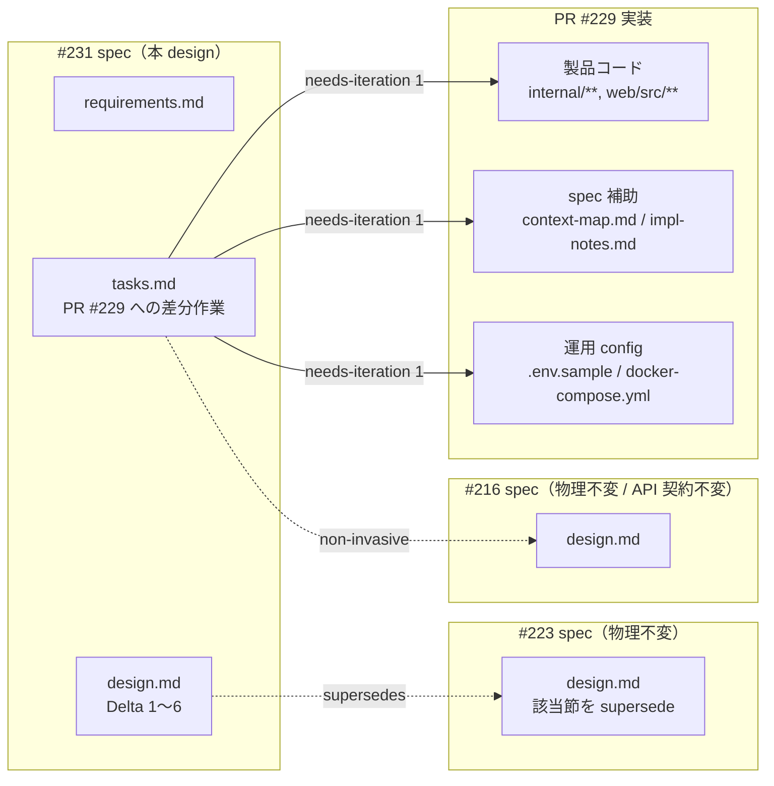
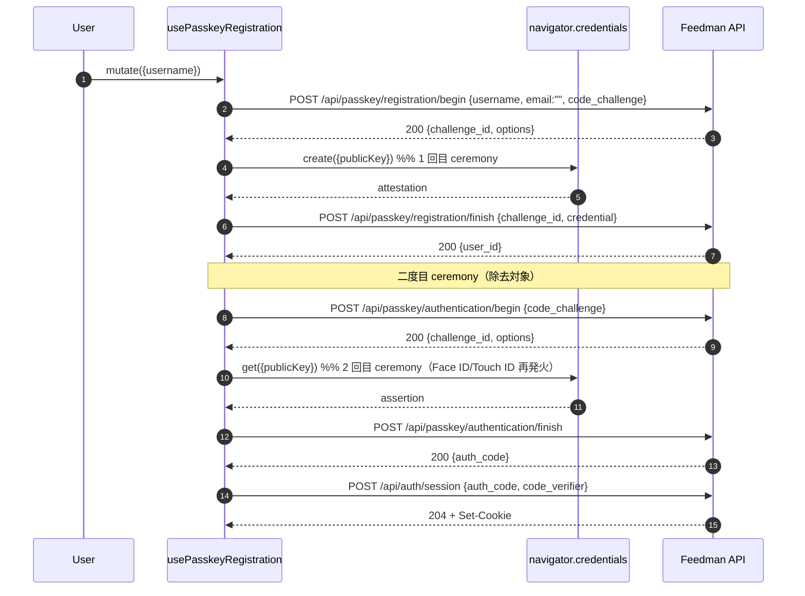
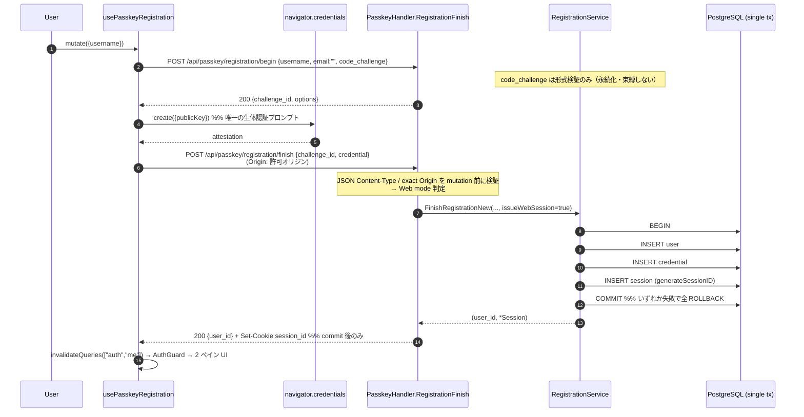
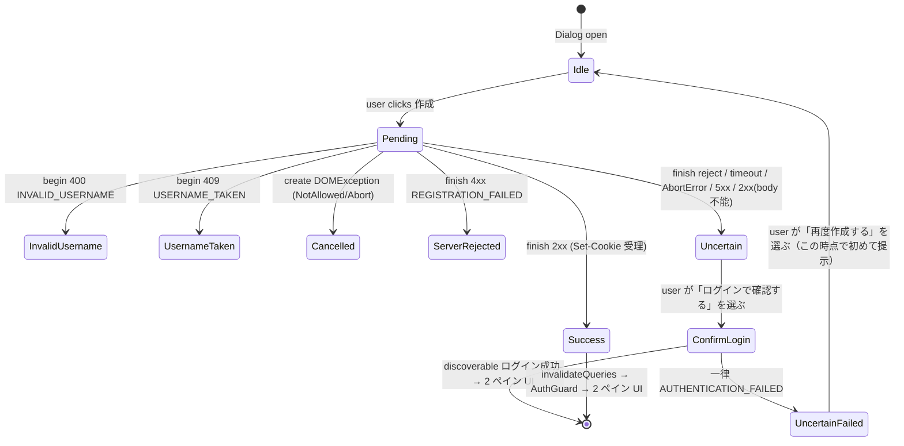

# Design Document

## Overview

**Purpose**: 本設計は Issue #223（Web ログイン画面のパスキー導線追加）に対する
**差分設計（normative delta）** である。#223 の実装 PR #229 レビューで発見された 5 件の
不整合と、運用 config 統合（Requirement 6）を、#223 spec の物理ファイルを一切変更せず、
本 spec 内で normative に上書き（supersede）する。5 件の不整合は
(1) 登録直後の二度目 WebAuthn ceremony、(2) File Structure Plan の欠落、
(3) fail-closed 表の不正確さ、(4) CSRF 記述の誤り、(5) 完了不明状態の未定義。

**中核決定（人間運用者による #231 決定 1.A）**: 新規作成の合流は **`POST /api/passkey/
registration/finish` の検証成功から同一 DB トランザクションで user・credential・Web session の
3 行を作成し、commit 後に同じ finish 応答で `Set-Cookie` する直接 session 方式** で行う。
登録用 auth_code・二度目の `navigator.credentials.get()`・登録専用の `/api/auth/session`
呼び出し・exchange artifact は **導入しない**。`/api/auth/session` は既存パスキー **ログイン**
用（auth_code 交換）としてそのまま残す。本設計は初版 design（auth_code additive 案 = 仮案 B）を
全面的に置き換える。

**Users**: 未認証 Web 訪問者（パスキーで新規作成する層／ iOS #216 で作成したパスキーで Web
にログインする層）と、既存 Google OAuth ユーザー、Feedman 運用者。iOS #216 ユーザーへの
影響はゼロ（`/api/passkey/registration/*` / `/api/passkey/authentication/*` の request/response
JSON を変更しない。Web の差分は `Set-Cookie` ヘッダのみ / NFR 3.2）。

**Impact**: 本 spec は独立した実装 PR を作らない。design PR merge 後、PR #229 の
`needs-iteration` 1 回で製品コード（`internal/passkey/` / `internal/handler/` /
`internal/repository/` / `web/src/`）・テスト・spec の `impl-notes.md` / `context-map.md`
（**#223 / #216 spec の requirements.md / design.md / tasks.md は書き換えない**）へ差分を反映する。

### 補正する 6 つの Delta サマリ

- **Delta 1（Requirement 1）— 直接 Cookie session**: 登録 finish で二度目の WebAuthn ceremony を
  廃止する。`internal/passkey/RegistrationService.FinishRegistrationNew` を、既存
  `internal/repository/tx.go` のトランザクション基盤を用いて **user → credential → session の
  3 行を単一トランザクションで作成** する構成に拡張し、handler が commit 後に既存 Cookie 属性で
  `Set-Cookie` する。`registration/finish` の request/response JSON は Web / iOS とも `{user_id}`
  のまま変更しない（Web だけ `Set-Cookie` が付く / NFR 3.2）。登録 begin の `code_challenge` は
  #216 契約維持のためフィールドを残すが **形式検証のみ** で永続化・束縛しない。
- **Delta 2（Requirement 2）— File Structure Plan 補正**: PR #229 の実変更ファイルを
  File Structure Plan 差分に完全列挙する（`web/src/lib/api.ts` / `api.test.ts` /
  `.env.sample` / `docker-compose.yml` を含む）。本設計で新規追加する session tx 対応
  （`CreateExec` 群・共有 Cookie builder・実 DB tx test）も列挙する。
- **Delta 3（Requirement 3）— fail-closed 表 5 列化**: fail-closed 表を
  Web capability / Web login exchange / Web registration direct session / iOS registration/* /
  iOS authentication/* の **5 列独立** で組み直す。router の capability / `/api/auth/session` gate は
  PR #229 の `NativeAuthHandler.SessionReady()` を **維持**（`NativeAuthHandler != nil` に弱めない）し、
  Origin 検証が不能な構成（`CORS_ALLOWED_ORIGIN` 未設定）でも fail-closed に倒す。
- **Delta 4（Requirement 4）— CSRF / PKCE 正確化**: 「攻撃者は (auth_code, code_verifier) ペアを
  取得できない」の誤記述を撤回する。直接登録 session の主防御（exact Origin / JSON Content-Type /
  CORS preflight / SameSite / **必須ユーザー生体ジェスチャ**）と、ログイン auth_code 交換の主防御
  （上記 + PKCE 単回 60s TTL）を **分離** して明記し、PKCE が直接登録を防御しないことを述べる。
  既存 `/api/auth/session`（login）の Origin 検証も **Origin 不在・不一致・allowedOrigin 未設定を
  拒否** する fail-closed へ補正する。
- **Delta 5（Requirement 5）— 完了不明状態**: 「finish dispatch 後に確定的な pre-commit 4xx を
  得られない」ケース（network reject / timeout / 送出後 Abort / 5xx / commit 済みを示唆する 2xx だが
  body 欠損・途中切断・parse 不能）を **第 3 の完了不明状態** `registration_uncertain` として定義する。
  復旧は「**discoverable なパスキーログイン**（ユーザー名入力なし）で確認 → 成功なら完了 →
  一律の `AUTHENTICATION_FAILED` の後にのみ再作成導線」に統一する（login と再作成を初期画面に
  同列並置しない）。
- **Delta 6（Requirement 6）— 運用 config 統合**: `.env.sample` / `docker-compose.yml` の記述差分を
  PR #229 のスコープに統合する（別 prerequisite PR に分離しない）。`CORS_ALLOWED_ORIGIN` の
  未設定・不一致と fail-closed 挙動の接続を明示し、Verify に代表 env 値付き `docker compose config` を
  追加する。

### Goals

- 主要目標 1: 新規作成完了までに追加の WebAuthn ceremony を要求しない（Requirement 1）
- 主要目標 2: registration finish の user / credential / session を **単一トランザクションで atomic**
  に作成し、session 生成・保存失敗時も全ロールバックする（Requirement 1 / データ整合性）
- 主要目標 3: iOS #216 の `/api/passkey/*` request/response 契約を破壊しない（NFR 3.2）
- 主要目標 4: fail-closed 表・CSRF 記述・完了不明状態を運用者・レビュワーが誤読しない粒度で明確化
  （Requirement 3 / 4 / 5）
- 成功基準:
  - PR #229 に本差分を反映した後の `go test ./...` / `go vet ./...` / `web` の test / lint / build が green
  - `POST /api/passkey/registration/finish` が Web（Origin 一致）で 200 `{user_id}` + `Set-Cookie` を返し、
    二度目 ceremony なしで 2 ペイン UI に到達する
  - 実 PostgreSQL で「session 書込失敗時に user / credential も作成されない（3 行 atomic）」ことを検証
  - `NATIVE_AUTH_JWT_SECRET` 未設定 + `WEBAUTHN_*` 設定済み env で iOS 用
    `/api/passkey/registration/*` / `/api/passkey/authentication/*` が引き続き 200 応答する

### Non-Goals

- **#223 / #216 spec の物理ファイル書換え**（各 requirements.md / design.md / tasks.md）— 本 spec は
  差分宣言のみを行い、物理ファイルは触らない（NFR 1.1 / 1.3）
- **独立した実装 PR の作成** — 差分は PR #229 の needs-iteration 1 回で反映（NFR 1.2）
- **#216 iOS パスキー API の request/response JSON 契約の破壊的変更**（NFR 1.3 / NFR 3.2）
- **登録用 auth_code / 二度目 ceremony / 登録専用 session 交換 endpoint / exchange artifact の導入**
  （決定 1.A により不採用）
- **browser-bound state（transaction cookie / 追加 CSRF token / Origin-bound challenge 拡張）の導入**
  （Requirement 4 の決定事項）
- **`.env.sample` / `docker-compose.yml` を別 prerequisite PR に分離すること**（Requirement 6 の決定事項）

## Architecture

### Existing Architecture Analysis（PR #229 head 実装に基づく）

本差分は #216 / PR #229 が確立した以下の既存アーキテクチャを **維持する前提** で補正する。
責務境界・依存方向は変更しない（`handler → service → repository → model` の一方向 / CLAUDE.md §1）:

- **維持する既存要素**:
  - `internal/passkey/` の ceremony 責務（`RegistrationService` / `AuthenticationService`）と
    `internal/handler/passkey_handler.go` の HTTP I/O 責務の分離（#216 で確立）
  - `challengeStore.Issue/Consume` を通じた TTL 付き単回消費（#216 で確立）
  - `internal/repository/tx.go` のトランザクション基盤（`SQLTx` / `BeginTx` / `Querier() DBTX` /
    `Commit` / `Rollback`）と、repo の `*Exec(ctx, q DBTX, ...)` 変種パターン
    （既存例: `PostgresUserRepo.DeleteByIDExec` / `PostgresSessionRepo.DeleteByUserIDExec`）
  - `NativeAuthHandler.Session`（`POST /api/auth/session`）+ `auth.SessionExchangeService`
    （auth_code → Web Cookie session 交換 / PR #229）と `SessionReady()` readiness
  - `NativeAuthHandler.Session` の CSRF 防御（Content-Type application/json 必須 / Origin allowlist）
  - Google OAuth Callback（`auth_handler.go::Callback`）の Cookie 属性
    （`session_id` / HttpOnly / SameSite=Lax / Secure / Path=/ / Domain / Max-Age）
  - fail-closed による route 未登録判定（`if <条件> { register }` パターン）
- **本差分が変更する点**:
  - `RegistrationService.FinishRegistrationNew` を **user → credential → session の単一トランザクション**
    に拡張（session 発行は Web mode のみ）。シグネチャに `issueWebSession bool` を追加し、返り値に
    `*model.Session`（Web session、iOS では nil）を追加
  - `PasskeyHandler.RegistrationFinish` に Origin ベースの Web / iOS mode 判定と Web mode の
    `Set-Cookie` を追加
  - repo に session 作成の tx 変種 `PostgresSessionRepo.CreateExec(ctx, DBTX, *model.Session)` と、
    user / credential の tx 変種 `CreateUserOnlyExec` / `CreateExec` を追加
  - Cookie 生成を **canonical builder に集約**（`auth_handler.Callback` /
    `native_auth_handler.Session` / `passkey_handler.RegistrationFinish` で共有 / 重複排除）
  - `router.go` の capability route 登録条件に `CORS_ALLOWED_ORIGIN` 設定要件を追加（Origin 検証不能時の
    fail-closed）
  - `native_auth_handler.Session` の Origin 検証を fail-closed（不在・不一致・allowedOrigin 未設定を拒否）へ補正
  - Web hook `use-passkey-registration.ts` の chain（二度目 ceremony 除去 + `registration_uncertain` 追加）
  - Web UI `passkey-signup-dialog.tsx` の完了不明状態 UI と discoverable ログイン復旧導線
  - `.env.sample` / `docker-compose.yml` の既存 WebAuthn env documentation / passthrough 整備
- **尊重すべき制約**:
  - iOS #216 の request/response 契約：`registration/begin` request `{username, email?, code_challenge}`、
    `registration/finish` request `{challenge_id, credential}` / response `{user_id}`、
    `authentication/*` の各フィールド構造をそのまま維持する（Web も response は `{user_id}` 不変。
    差分は `Set-Cookie` ヘッダのみで JSON body には現れない）
  - NFR 1.1（#223 spec 物理ファイル不変）/ NFR 1.3（#216 spec 物理ファイル・API 契約不変）

### 差分適用の運用境界



### Technology Stack

本差分は **技術スタック追加なし**。既存の技術選定（Go 1.25 / chi/v5 / PostgreSQL 16 /
go-webauthn / `database/sql` トランザクション / Next.js 15 / TanStack Query / shadcn/ui /
Vitest）をそのまま使用する。session ID 生成は既存 `auth.SessionExchangeService` /
Google OAuth Callback と同一の生成器を再利用する（重複しない）。

## File Structure Plan（PR #229 に適用する差分の変更対象 / 新規追加）

本セクションは PR #229 の `needs-iteration` 1 回で反映する対象ファイルを **変更対象** と
**新規追加** に分けて明示する。**#223 design.md「File Structure Plan」節を supersede する**
（Requirement 2）。Reviewer は本節を canonical として PR #229 の全変更ファイル被覆を確認できる
（Requirement 2.5）。

### Modified Files（サーバ側）

- `internal/repository/tx.go` — **変更**（3 行 tx orchestration の helper 追加）
  - closure 型のトランザクション実行ヘルパー `WithinTx(ctx, fn func(q DBTX) error) error` を
    `SQLTxBeginner` に追加（`BeginTx` → `fn(tx.Querier())` → 正常時 `Commit` / エラー・panic 時
    `Rollback`）。既存 `SQLTx` / `BeginTx` / `Querier` / `Commit` / `Rollback` は変更しない
- `internal/repository/postgres_session_repo.go` — **変更**
  - `CreateExec(ctx, q DBTX, s *model.Session) error` を追加（既存 `DeleteByUserIDExec` の
    DBTX 変種パターンに準拠）。既存 `Create(ctx, s)` は `CreateExec(ctx, r.db, s)` へ委譲に変更
    （差分等価 / 挙動不変）
- `internal/repository/postgres_user_repo.go` — **変更**
  - `CreateUserOnlyExec(ctx, q DBTX, u *model.User) error` を追加。既存 `CreateUserOnly` は
    `CreateUserOnlyExec(ctx, r.db, u)` へ委譲（`ErrUsernameTaken` 正規化は変えない）
- `internal/repository/postgres_passkey_credential_repo.go` — **変更**
  - `CreateExec(ctx, q DBTX, c *model.PasskeyCredential) error` を追加。既存 `Create` は
    `CreateExec(ctx, r.db, c)` へ委譲（`ErrCredentialAlreadyRegistered` 正規化は変えない）
- `internal/passkey/registration_service.go` — **変更**（Delta 1 サーバ中核）
  - 最小 IF を追加/拡張: `SessionWriter{CreateExec}`、`UserWriter` に `CreateUserOnlyExec`、
    `PasskeyCredentialWriter` に `CreateExec`、tx 実行 IF `txRunner{WithinTx}`
  - 構造体に `sessions SessionWriter` / `tx txRunner` / `newSessionID func() (string, error)` /
    `sessionTTL time.Duration` を追加（**auth_code 関連依存は追加しない**）
  - `FinishRegistrationNew` を単一 tx + `issueWebSession bool` 対応に変更（後述 §Delta 1）
  - `WebSessionReady() bool`（session writer / tx / 生成器が非 nil）を追加
- `internal/passkey/registration_service_test.go` — **変更**（新シグネチャ追従 + branch/正規化テスト）
- `internal/handler/session_cookie.go` — **新規**（後述 §New Files）
- `internal/handler/passkey_handler.go` — **変更**（Delta 1 handler + Delta 3）
  - `PasskeyHandler` に `allowedOrigin string` と Cookie 設定（domain / secure / maxAge）を
    Option で注入（既存 `NativeAuthHandler` の `WithSession*` Option idiom を踏襲）
  - `RegistrationFinish` に Origin ベース mode 判定・Web mode の JSON Content-Type 検証・
    readiness fail-closed・commit 後 `Set-Cookie` を追加（response は 200 `{user_id}` 不変）
- `internal/handler/passkey_handler_test.go` — **変更**（mode 判定 / Set-Cookie / iOS `{user_id}` 回帰）
- `internal/handler/native_auth_handler.go` — **変更**（Delta 4 login Origin fail-closed 補正）
  - `Session` の Origin 検証を「Origin 不在・不一致・allowedOrigin 未設定を拒否（403）」に補正
- `internal/handler/native_auth_handler_test.go` — **変更**（Origin fail-closed の異常系追加）
- `internal/handler/router.go` — **変更**（Delta 3）
  - capability route 条件に `deps.CORSAllowedOrigin != ""` を追加（`SessionReady()` は維持）
  - `/api/auth/session` 条件は既存 `NativeAuthHandler != nil && SessionReady()` を維持
  - iOS `/api/passkey/registration/*` / `/api/passkey/authentication/*`（および Web と共有する
    `registration/finish`）は `PasskeyHandler != nil` を維持（#216 契約 / NFR 3.2）
- `internal/handler/router_test.go` — **変更**（fail-closed 5 列に対応する route 登録テスト）
- `internal/handler/passkey_e2e_db_test.go` — **変更**（実 PostgreSQL で 3 行 commit / rollback 原子性）
- `internal/auth/session_exchange.go` — **変更**（session ID 生成器を `auth.GenerateSessionID` として
  export し RegistrationService と共有 / 重複排除。`SessionExchangeService` の契約は不変）
- `internal/app/app.go` — **変更**（wiring）
  - `passkey.NewRegistrationService(...)` に `sessionRepo`（SessionWriter）/ tx runner /
    `auth.GenerateSessionID` / `sessionTTL` を注入
  - `handler.NewPasskeyHandler(...)` に `allowedOrigin`（`cfg.CORSAllowedOrigin`）と Cookie 設定
    （`cfg.CookieDomain` / `cfg.CookieSecure` / `cfg.SessionMaxAge`）を注入
  - 注記: session 発行依存（sessionRepo / cookie / origin）は `NATIVE_AUTH_JWT_SECRET` に依存せず、
    `WEBAUTHN_*` 設定時（passkey handler 生成時）に常時配線する

### Modified Files（Web 側）

- `web/src/hooks/use-passkey-registration.ts` — **変更**（Delta 1 Web + Delta 5 hook）
  - chain を「begin → create → finish（2xx + Set-Cookie）→ invalidateQueries」に短縮
    （`authentication/begin` / `get` / `authentication/finish` / 登録用 `/api/auth/session` を除去）
  - `PasskeyRegistrationErrorKind` に `"registration_uncertain"` を追加。registration 経路は
    `session_exchange_failed` を発生させない（直接 session 化により該当段が消滅）
- `web/src/hooks/use-passkey-registration.test.ts` — **変更**（uncertain 4 サブケース + 二度目 ceremony 不在回帰）
- `web/src/components/passkey-signup-dialog.tsx` — **変更**（Delta 5 UI: 完了不明 + discoverable 復旧導線）
- `web/src/components/passkey-signup-dialog.test.tsx` — **変更**
- `web/src/hooks/use-passkey-authentication.ts` — 既存維持（discoverable ログイン復旧で **再利用**、変更なし）
- `web/src/components/login-page.tsx` / `login-page.test.tsx` / `login-page-recovery.test.tsx` —
  **変更**（PR #229 で追加済み。完了不明 → discoverable ログイン → 成功で 2 ペイン到達の recovery テスト整合）
- `web/src/lib/api.ts` — **変更対象として列挙**（Requirement 2.1 / #223 design の「無変更」記述を訂正。
  PR #229 で `credentials: "include"` 経路等が変更済み。本差分自身は api.ts をさらに触る必要はない）
- `web/src/lib/api.test.ts` — **変更対象として列挙**（PR #229 で追加済みだが #223 design 未列挙 / Req 2.1）
- `web/src/types/passkey.ts` — **変更**（`PasskeyRegistrationErrorKind` に uncertain 追加。
  `RegistrationFinishResponse` は `{user_id}` のまま **auth_code を追加しない**）
- `web/src/lib/webauthn.ts` / `pkce.ts` / `passkey-capability.ts` / `use-passkey-capability.ts` /
  `passkey-buttons.tsx`（各 `.test`）— 既存維持（変更なし）

### Modified Files（運用 config / Requirement 6）

- `.env.sample` — **変更**（既存 WebAuthn env 群と `CORS_ALLOWED_ORIGIN` の documentation 整備 / 新規 env なし）
- `docker-compose.yml` — **変更**（`api` サービスへ WebAuthn env passthrough 追加 / 新規 env なし）

### Modified Files（spec 補助 / #223 spec の本体 3 文書は不変）

- `docs/specs/223-feat-web-web/impl-notes.md` — **変更**（#231 delta 適用結果の追記）
- `docs/specs/223-feat-web-web/context-map.md` — **変更**（`finish → Cookie session` へ経路更新 /
  fail-closed 表 supersede / 完了不明状態の遷移追加）

### New Files（本差分で新規追加）

- `internal/handler/session_cookie.go` — **新規**: canonical な `session_id` Cookie builder
  `buildSessionCookie(name, value, domain string, secure bool, maxAge int) *http.Cookie` を定義し、
  `auth_handler.Callback` / `native_auth_handler.Session` / `passkey_handler.RegistrationFinish` の
  3 箇所で共有する（Cookie 属性の重複定義を排除 / Delta 4 §Cookie 属性の維持）。
  同ファイルに `session_cookie_test.go` を近接配置し、属性が Google OAuth Callback と一致することを検証する

## Requirements Traceability

| Requirement | Summary | Traced to |
|-------------|---------|-----------|
| 1.1 | 登録 finish 後の追加 WebAuthn ceremony 禁止 | Delta 1 §Sequence / §Web Hook |
| 1.2 | 二度目 ceremony を実装として採用しない | Delta 1 §Before → After |
| 1.3 | 登録トランザクションに紐付いた合流経路 | Delta 1 §3 行トランザクション / §Set-Cookie |
| 1.4 | 2 ペイン UI 初期表示 | Delta 1 §Sequence（invalidateQueries → AuthGuard） |
| 1.5 | ログイン導線への影響なし | Delta 1 §影響範囲（`use-passkey-authentication` 未変更） |
| 2.1 | api.ts / api.test.ts を変更対象に明示 | File Structure Plan §Web 側 |
| 2.2 | .env.sample / docker-compose.yml を変更対象に明示 | File Structure Plan §運用 config |
| 2.3 | needs-iteration 1 回で完結する粒度のタスク | tasks.md 全体 |
| 2.4 | #223 / #216 spec 書換タスクを含まない | tasks.md（spec 本体編集タスク不在） |
| 2.5 | Reviewer が変更ファイルを突合できる状態 | File Structure Plan §Modified/New Files |
| 3.1 | Web login session 交換 endpoint を独立列に | Delta 3 §fail-closed 表（列 B） |
| 3.2 | Web capability probe を独立列に | Delta 3 §fail-closed 表（列 A） |
| 3.3 | NATIVE unset + WEBAUTHN set で iOS 継続 | Delta 3 §fail-closed 表 行 2 / §iOS 契約維持 |
| 3.4 | WEBAUTHN unset で Web 縮退 + iOS 停止 | Delta 3 §fail-closed 表 行 4 / 5 |
| 3.5 | iOS request/response 契約破壊禁止 | Delta 1 §iOS 契約維持 / Delta 3 §登録条件不変 |
| 4.1 | CSRF 主防御要素を要素ごと・endpoint ごとに明記 | Delta 4 §主防御要素表（登録直接 / login 交換） |
| 4.2 | 旧誤記述の撤回と正しい前提の明記 | Delta 4 §旧記述の撤回 |
| 4.3 | 残余リスクの列挙 | Delta 4 §残余リスク |
| 4.4 | browser-bound state 不要の決定明記 | Delta 4 §決定記録 |
| 4.5 | Cookie 属性の既存 Google OAuth 一致維持 | Delta 4 §Cookie 属性の維持 / New Files（共有 builder） |
| 4.6 | 将来検討導線を残す | Delta 4 §将来検討導線 |
| 5.1 | 第 3 の完了不明状態としてユーザーに提示 | Delta 5 §状態定義 / §Hook 判定 |
| 5.2 | discoverable ログイン確認を提示（再作成は同列不可） | Delta 5 §UI 文言と復旧導線 |
| 5.3 | 復旧ログイン成功で 2 ペイン UI | Delta 5 §状態遷移図（成功） |
| 5.4 | 一律失敗の後にのみ再作成導線 | Delta 5 §状態遷移図（失敗） |
| 5.5 | サーバ内部詳細を反射しない | Delta 5 §UI 文言（generic 固定） |
| 5.6 | 他状態と混同されない文言 | Delta 5 §既存 error kind との弁別 |
| 6.1 | .env.sample を変更対象に明示 | Delta 6 §反映内容 / File Structure Plan |
| 6.2 | docker-compose.yml を変更対象に明示 | Delta 6 §反映内容 / File Structure Plan |
| 6.3 | needs-iteration 1 回で完結する config タスク | tasks.md Task 6 |
| 6.4 | 別 prerequisite PR に分離しない決定明記 | Delta 6 §決定記録 |
| 6.5 | 既存 env 流用に留め新規 env 追加なしを担保 | Delta 6 §既存 env 流用 |
| NFR 1.1 | #223 spec 物理ファイル不変 | Non-Goals / File Structure Plan（#223 本体編集タスク不在） |
| NFR 1.2 | 独立実装 PR を作らず PR #229 needs-iteration 1 回で反映 | Non-Goals / tasks.md 全体 |
| NFR 1.3 | #216 契約を破壊するタスクを含まない | Delta 1 §iOS 契約維持 / File Structure Plan（#216 本体編集タスク不在） |
| NFR 2.1 | 完了不明状態・session 発行の秘密情報非漏出 | Delta 1 §NFR / Delta 5 §秘密情報の非漏出 |
| NFR 2.2 | CSRF / fail-closed 記述に秘密値を例示しない | Delta 3 / Delta 4（例示値なし） |
| NFR 3.1 | Google OAuth 既存挙動を破壊しない | 全 Delta（Google 経路無変更）/ File Structure Plan（auth 経路本体未変更） |
| NFR 3.2 | iOS #216 request/response 契約不変 | Delta 1 §iOS 契約維持 / Delta 3 §登録条件不変 |

## Delta 1: 登録 finish の直接 Cookie session（Requirement 1）

### Supersedes（#223 design.md の該当節）

- `#223 design.md` §Flows「新規作成フロー（Sequence / 抜粋）」— finish 後の
  `authentication: begin → get → finish → session` 経路と二度目 `navigator.credentials.get()`
- `#223 design.md` §`use-passkey-registration.ts` の「直後に認証 chain」以降のステップ
- 初版 #231 design（auth_code additive 案 = 仮案 B）全体を本 Delta で置き換える

### Before → After Sequence

#### Before（PR #229 head の現行実装 = 仮案 B の系譜）



#### After（本 Delta 1 で確定する挙動 = 決定 1.A）



追加のブラウザ生体認証プロンプト（`navigator.credentials.get`）が消滅し、体験する ceremony は
登録時の `create` 1 回のみになる（Requirement 1.1 / 1.2）。

### Web / iOS mode 判定（`PasskeyHandler.RegistrationFinish`）

handler は challenge consume / DB mutation より **前** に、`Origin` ヘッダで mode を判定する
（推奨境界。別実装でも「JSON body 追加・exchange artifact なしで直接 session」を満たせば可）:

| `Origin` ヘッダ | `allowedOrigin`（`CORS_ALLOWED_ORIGIN`） | 判定 | 挙動 |
|---|---|---|---|
| 一致（`origin == allowedOrigin`） | 設定済 | **Web mode** | JSON Content-Type 検証 → readiness 確認 → `issueWebSession=true` |
| 不在（`""`） | 任意 | **native/iOS mode** | 既存挙動（session 発行なし / `issueWebSession=false`） |
| 非空・不一致、または `allowedOrigin` 未設定 | — | **拒否** | 403 FORBIDDEN_ORIGIN（mutation・consume なし / fail-closed） |

- Web mode の追加検証（いずれも mutation 前）:
  - **JSON Content-Type 必須**（不一致は 415 UNSUPPORTED_MEDIA_TYPE）。native/iOS mode には
    本検証を **課さない**（#216 既存クライアント互換 / NFR 3.2）
  - **readiness**（`PasskeyHandler.webRegistrationReady()` = `allowedOrigin != "" && Cookie 設定済み &&
    RegistrationService.WebSessionReady()`）が false なら fail-closed（500 相当、mutation なし）。
    通常 wiring では `WEBAUTHN_*` 設定時に session 発行依存が常時配線されるため、実質は
    `allowedOrigin` 設定有無が支配的
- iOS はネイティブ HTTP クライアントで `Origin` を送らないため native mode に落ち、session / Cookie を
  作らず `{user_id}` のみを返す（#216 と差分等価 / NFR 3.2）

### Server 側の実装差分

#### `internal/passkey/registration_service.go`（Modified）

```go
// 追加/拡張する最小 IF（interface segregation / CLAUDE.md §5）
type SessionWriter interface {
    CreateExec(ctx context.Context, q repository.DBTX, s *model.Session) error
}
// UserWriter に追加: CreateUserOnlyExec(ctx, q repository.DBTX, u *model.User) error
// PasskeyCredentialWriter に追加: CreateExec(ctx, q repository.DBTX, c *model.PasskeyCredential) error
type txRunner interface {
    WithinTx(ctx context.Context, fn func(q repository.DBTX) error) error
}

// 構造体に追加（auth_code 関連は追加しない）
type RegistrationService struct {
    // ... 既存 adapter / challenges / users / credentials / now ...
    sessions     SessionWriter
    tx           txRunner
    newSessionID func() (string, error) // = auth.GenerateSessionID（SessionExchangeService と共有）
    sessionTTL   time.Duration          // = time.Duration(cfg.SessionMaxAge) * time.Second
}

// WebSessionReady は Web mode の直接 session 発行が配線済みかを返す（defense-in-depth）。
func (s *RegistrationService) WebSessionReady() bool {
    return s.sessions != nil && s.tx != nil && s.newSessionID != nil
}

// FinishRegistrationNew: 単一 tx で user → credential →（Web mode のみ）session を作成。
//   - 既存 challenge consume / adapter.FinishRegistration（attestation 検証）は変更しない
//   - user UNIQUE 衝突 → ErrRegistrationFailed / credential 重複 → ErrRegistrationFailed（既存正規化を維持）
//   - session ID 生成失敗・session INSERT 失敗も含め、いずれかの失敗で全 ROLLBACK（3 行 atomic）
//   - iOS（issueWebSession=false）は user + credential のみ作成し、webSession=nil を返す
func (s *RegistrationService) FinishRegistrationNew(
    ctx context.Context, challengeID string, requestBody []byte, issueWebSession bool,
) (userID string, webSession *model.Session, err error) {
    // ... consume challenge / rebuild WebAuthnUser / adapter.FinishRegistration（既存どおり）...
    newUser := &model.User{ ID: pendingUserID, Email: "", Username: normalized, UsernameNormalized: normalized }
    cred := &model.PasskeyCredential{ /* parsed から既存どおり */ }

    txErr := s.tx.WithinTx(ctx, func(q repository.DBTX) error {
        if e := s.users.CreateUserOnlyExec(ctx, q, newUser); e != nil {
            if errors.Is(e, repository.ErrUsernameTaken) { return ErrRegistrationFailed }
            return fmt.Errorf("failed to create user: %w", e)
        }
        if e := s.credentials.CreateExec(ctx, q, cred); e != nil {
            if errors.Is(e, repository.ErrCredentialAlreadyRegistered) { return ErrRegistrationFailed }
            return fmt.Errorf("failed to save passkey credential: %w", e)
        }
        if issueWebSession {
            sid, e := s.newSessionID()
            if e != nil { return fmt.Errorf("failed to generate session id: %w", e) }
            webSession = &model.Session{ ID: sid, UserID: newUser.ID, ExpiresAt: s.now().Add(s.sessionTTL) }
            if e := s.sessions.CreateExec(ctx, q, webSession); e != nil {
                return fmt.Errorf("failed to create session: %w", e)
            }
        }
        return nil
    })
    if txErr != nil {
        webSession = nil // 部分状態を返さない（全 ROLLBACK 済み）
        if errors.Is(txErr, ErrRegistrationFailed) { return "", nil, ErrRegistrationFailed }
        return "", nil, txErr
    }
    return newUser.ID, webSession, nil
}
```

- Preconditions: `sessions` / `tx` / `newSessionID` は passkey handler 生成時（`WEBAUTHN_*` 設定時）に
  非 nil で注入されている
- Postconditions:
  - 成功（Web mode）: user / credential / session の **3 行が同一 tx で永続化**される
  - 成功（iOS mode）: user / credential の 2 行のみ永続化（session なし / `{user_id}` 応答）
  - 失敗: 部分保存は残さない（tx の atomic rollback。#216 の「非 tx で部分保存し得る」旧挙動を改善）
- Invariants: `auth_code` 平文 / session ID 生値をログ・エラー・レスポンスに残さない（NFR 2.1。
  session ID は Set-Cookie でのみクライアントへ渡し、ログには出さない）

#### `internal/handler/passkey_handler.go`（Modified）

```go
// RegistrationFinish（イメージ）:
//   origin := r.Header.Get("Origin")
//   webMode := false
//   switch {
//   case origin == "":
//       // native/iOS: 既存挙動（JSON Content-Type 追加検証なし）
//   case h.allowedOrigin != "" && origin == h.allowedOrigin:
//       if !hasJSONContentType(r) { 415; return }          // mutation 前
//       if !h.webRegistrationReady() { 500; return }        // fail-closed / mutation 前
//       webMode = true
//   default:
//       middleware.WriteErrorResponse(w, 403, forbiddenOriginError()); return  // mutation 前
//   }
//   // decode {challenge_id, credential}（既存）
//   userID, sess, err := h.regService.FinishRegistrationNew(ctx, req.ChallengeID, req.Credential, webMode)
//   // 既存 error mapping（ErrRegistrationFailed → 400 REGISTRATION_FAILED / infra → 500）
//   if sess != nil {
//       http.SetCookie(w, buildSessionCookie(sessionCookieName, sess.ID, h.cookieDomain, h.cookieSecure, h.cookieMaxAge))
//   }
//   respond 200 {user_id: userID}   // JSON は Web / iOS とも不変
```

#### iOS #216 契約が破壊されない論証（NFR 3.2 / Req 3.5）

- iOS の `registration/finish` レスポンス期待値は `{user_id}` で不変。Web でも JSON body は `{user_id}` の
  ままで、差分は HTTP **ヘッダ** の `Set-Cookie` のみ（iOS は Origin を送らず native mode に落ちるため
  Cookie を受け取らない）
- request JSON（`{challenge_id, credential}`）・`registration/begin` の JSON も不変。登録 begin の
  `code_challenge` はフィールドを維持（形式検証のみ）
- JSON Content-Type / Origin の追加検証は **Web mode のみ** に課すため、iOS の既存リクエスト経路は不変

### Web 側の実装差分（`use-passkey-registration.ts`）

```typescript
// mutationFn（イメージ、実装コードではない）
async function mutationFn({ username }: { username: string }) {
  // #216 契約維持のため code_challenge は送るが、直接 session 化により code_verifier は使用しない
  const { codeChallenge } = await generatePkcePair();
  const begin = await apiClient.post("/api/passkey/registration/begin",
    { username, email: "", code_challenge: codeChallenge });
  const cred = await navigator.credentials.create(decodeCreationOptions(begin.options));
  // finish の 2xx + Set-Cookie で session 確定（追加 request なし / 二度目 ceremony なし）
  await apiClient.post("/api/passkey/registration/finish",
    { challenge_id: begin.challenge_id, credential: encodeAttestationResponse(cred) });
  await queryClient.invalidateQueries({ queryKey: ["auth", "me"] });
}
```

- `authentication/begin` / `navigator.credentials.get` / `authentication/finish` / 登録用
  `POST /api/auth/session` の 4 呼び出しを **完全削除**（Req 1.1 / 1.2）
- `apiClient` は `credentials: "include"` で Cookie を受理・送出する（既存 PR #229 の api.ts 経路）
- error 分類は §Delta 5 で `registration_uncertain` を追加

### 影響範囲

- 変更: `RegistrationService` / `PasskeyHandler.RegistrationFinish` / repo Exec 変種 / tx helper /
  共有 Cookie builder / `use-passkey-registration.ts` / `passkey-signup-dialog.tsx` / `app.go`
- **無変更で維持**:
  - `AuthenticationService` / `use-passkey-authentication.ts` / `PasskeyButtons`
    （ログイン導線は影響を受けない。discoverable ログイン復旧で再利用のみ / Req 1.5）
  - `SessionExchangeService` / `NativeAuthHandler.Session`（login の auth_code 交換として不変。
    Delta 4 で Origin 検証の fail-closed 補正のみ）
  - iOS 用 `registration/*` / `authentication/*`（#216 契約不変 / NFR 3.2）
  - Google OAuth 経路一式（NFR 3.1）

## Delta 2: File Structure Plan の補正（Requirement 2）

### Supersedes

- `#223 design.md` §File Structure Plan の以下記述:
  - `web/src/lib/api.ts` を「無変更」と記述した箇所 → **変更対象**
  - `web/src/lib/api.test.ts` / `.env.sample` / `docker-compose.yml` が未列挙 → **列挙**

### canonical 定義

本 spec §File Structure Plan（Modified/New Files）が canonical。Reviewer は同節と PR #229 の
`git diff --name-only` を突き合わせ、以下を確認できる（Requirement 2.5）:

1. PR #229 の全変更ファイルが Modified/New Files に列挙されている
2. Modified/New Files に列挙されているが PR #229 に含まれないファイルがない（過剰な予告なし）
3. `web/src/lib/api.ts` / `api.test.ts` / `.env.sample` / `docker-compose.yml` が列挙されている
   （旧 #223 design の見落としを訂正済み）
4. 本差分で追加する session tx 対応（`tx.go` の `WithinTx` / 各 repo の `CreateExec` /
   `session_cookie.go` / `passkey_e2e_db_test.go` の 3 行原子性テスト）が列挙されている

## Delta 3: fail-closed 表の 5 列補正と gate 維持（Requirement 3）

### Supersedes

- `#223 design.md` §Configuration §fail-closed 挙動の表 —
  `NATIVE_AUTH_JWT_SECRET` 未設定時に iOS 用 `/api/passkey/*` を「未登録 (404)」と誤って
  表現していた箇所。および初版 #231 design の「capability を `PasskeyHandler != nil &&
  NativeAuthHandler != nil` に強化」という **`SessionReady()` を弱めた誤記述**

### 補正後の fail-closed 表（5 列独立）

env 3 軸 — **W**=`WEBAUTHN_RP_ID`+`WEBAUTHN_ORIGINS`、**N**=`NATIVE_AUTH_JWT_SECRET`、
**C**=`CORS_ALLOWED_ORIGIN`（exact Origin） — の代表組合せごとに、各 endpoint を独立列で示す。

| # | W | N | C | A. capability (Web probe) | B. login exchange `/api/auth/session` | C. reg. direct session (finish Web mode) | D. iOS `registration/*` | E. iOS `authentication/*` |
|---|---|---|---|---|---|---|---|---|
| 1 | ✓ | ✓ | ✓ | 登録 (200) | 登録 (204) | 発行（Origin 一致で 200 + Set-Cookie） | 登録 (200) | 登録 (200) |
| 2 | ✓ | ✗ | ✓ | **未登録 (404)** | 未登録 (404) | (capability 404 で Web UI 非表示のため未到達) | **登録 (200)** | **登録 (200)** |
| 3 | ✓ | ✓ | ✗ | **未登録 (404)** | 全リクエスト拒否 (403 / Delta 4 補正) | Origin 検証不能 → **fail-closed (403)** | 登録 (200) | 登録 (200) |
| 4 | ✗ | ✓ | ✓ | 未登録 (404) | 登録 (204) | (finish route 自体が未登録 404) | **未登録 (404)** | **未登録 (404)** |
| 5 | ✗ | ✗ | * | 未登録 (404) | 未登録 (404) | 未登録 (404) | 未登録 (404) | 未登録 (404) |

- **行 2（W✓ N✗ C✓）が最重要回帰**: `NATIVE_AUTH_JWT_SECRET` 未設定でも iOS 用
  `registration/*` / `authentication/*` は **200 を維持**（列 D/E）。Web は capability=404 で
  パスキー UI を非表示にし Google 単体へ縮退する（列 A）。iOS を「停止」と誤読させない
- **行 4（W✗）**: iOS 用 endpoint は `PasskeyHandler` に紐付くため、`WEBAUTHN_*` 未設定なら 404
  （#216 で確定済みの挙動）。Web も縮退
- **列 B と 列 C の独立性**: login exchange（列 B）は N に依存、registration direct session（列 C）は
  N に **依存しない**（session 発行は auth_code を介さないため）。両者を別列に分けて誤読を防ぐ

各列の登録・成立条件（`router.go` / handler の判定式）:

| 列 | 条件 | 依拠 env |
|---|---|---|
| A. `GET /api/passkey/capability` | `PasskeyHandler != nil && NativeAuthHandler != nil && NativeAuthHandler.SessionReady() && deps.CORSAllowedOrigin != ""` | W + N + C |
| B. `POST /api/auth/session` | `NativeAuthHandler != nil && NativeAuthHandler.SessionReady()` **（`SessionReady()` 維持）** + handler 内 Origin fail-closed（Delta 4） | N（+ C で成立） |
| C. `registration/finish` Web mode 発行 | route は `PasskeyHandler != nil`（iOS と共有）。Web mode 成立は `webRegistrationReady()`（session repo / Cookie / exact Origin） | W + C |
| D. `POST /api/passkey/registration/*` | `PasskeyHandler != nil` **（変更なし）** | W |
| E. `POST /api/passkey/authentication/*` | `PasskeyHandler != nil` **（変更なし）** | W |

### gate を弱めない（Req 3.1 / 3.2 / review #3・#5 との整合）

- capability（列 A）と `/api/auth/session`（列 B）の gate は PR #229 の
  `NativeAuthHandler.SessionReady()` を **維持**する（`NativeAuthHandler != nil` に弱めない）。
  本差分は capability に `deps.CORSAllowedOrigin != ""` を **追加** するのみ（Origin 検証不能な
  構成で Web パスキー UI を出さないための fail-closed 強化。行 3 参照）
- 直接登録 session（列 C）は独自の readiness（session repo / Cookie 設定 / exact Origin）を持ち、
  未充足なら mutation 前に fail-closed する（§Delta 1 §mode 判定）

### iOS #216 契約が破壊されない論証（Req 3.5）

- iOS が依存する `registration/*` / `authentication/*` はすべて `PasskeyHandler` に紐付き、
  router 登録条件は `PasskeyHandler != nil` のみで **変更しない**
- 本差分で登録条件を強化するのは Web 用 capability（列 A への `C != ""` 追加）のみ。iOS は
  capability を使用しない（#216 spec に依存記述なし）
- したがって iOS 用 endpoint の稼働条件は #216 と完全同一（NFR 3.2 / Req 3.5）

## Delta 4: CSRF / PKCE 説明の正確化と残余リスクの明示（Requirement 4）

### Supersedes

- `#223 design.md` §Security Considerations §CSRF の「攻撃者が事前に (auth_code, code_verifier) ペアを
  入手する経路が存在しない」記述、および `NativeAuthHandler.Session` §CSRF 対策の同旨の判断根拠

### 旧記述の撤回（Req 4.2）

以下を **撤回する**:

> auth_code は 60 秒 TTL + 単回消費 + PKCE 束縛 → クロスサイト攻撃者が事前に (auth_code,
> code_verifier) ペアを入手する経路が存在しない

**正しい前提**: 攻撃者は **自身のブラウザで自身の credential を用いて完全な認証フローを走行させ、
自分の (auth_code, code_verifier) ペアを取得できる**。RFC 7636 の PKCE は「同一クライアント内での
authorization_code の中間者盗用を防ぐ」プロパティであり、攻撃者が **自身のセッションで正規に取得した
ペア** を防ぐものではない。したがって PKCE 単独では「攻撃者アカウントへのログイン誘引（login CSRF）」を
阻止できない。

### 主防御要素表（endpoint / 経路ごとに分離 / Req 4.1）

セッションを発行する 2 経路を分けて防御要素を明記する（**PKCE の役割はログイン交換にのみ限定**）:

| 経路 | 主防御要素 | 各要素の役割 |
|---|---|---|
| **登録 直接 session**（`registration/finish` Web mode） | 必須ユーザー生体ジェスチャ + exact Origin + JSON Content-Type + CORS preflight + SameSite=Lax | 登録は `navigator.credentials.create()` の生体承認（user gesture）を **必須**とするため、被害者の明示操作なしに cross-site から silently 発火できない。加えて exact Origin / JSON Content-Type / CORS preflight が cross-origin 発火を封じ、SameSite=Lax が Cookie 送信を制限。**PKCE は本経路の防御に用いない**（code_challenge は #216 契約維持のため形式検証のみ） |
| **ログイン auth_code 交換**（`POST /api/auth/session`） | exact Origin + JSON Content-Type + CORS preflight + SameSite=Lax + PKCE 束縛（auth_code 単回 60s TTL） | exact Origin / JSON Content-Type / CORS preflight / SameSite が cross-origin 発火を封じる主防御。PKCE + 単回 60s TTL は「同一クライアント外」による盗聴 auth_code の交換を防ぐ（RFC 7636 の本来目的。login CSRF そのものの防御ではない） |
| **共通** | HttpOnly Cookie | 発行後の `session_id` を JavaScript から不可視化し、XSS 時の生値読出しを阻止 |

### login `/api/auth/session` の Origin 検証を fail-closed へ補正（Req 4.1 / review #2）

PR #229 head の `NativeAuthHandler.Session` は「Origin 不在 or allowedOrigin 未設定なら検証を
スキップ」する（false-reject 回避のため存在時のみ厳格化）。本差分ではこれを **fail-closed** に補正する:

- `allowedOrigin == ""`（`CORS_ALLOWED_ORIGIN` 未設定）→ 全リクエスト 403（検証不能なら発行しない）
- `Origin` 不在 → 403（browser fetch は cross-origin で Origin を必ず送る前提。fail-closed）
- `Origin != allowedOrigin` → 403（既存）
- `Origin == allowedOrigin` のみ通過
- トレードオフ: Origin ヘッダを落とす same-origin proxy 構成では `CORS_ALLOWED_ORIGIN` の適切な設定と
  Origin フォワードが前提となる（人間運用者決定として fail-closed を優先）。同一の Origin fail-closed を
  Web registration direct session（列 C）にも適用する

### 残余リスク（受容する脅威 / Req 4.3）

1. **同一オリジン XSS 経由の全フロー実行**: 攻撃者が Feedman Web の同一オリジンに XSS を注入できた場合、
   注入 script が完全な passkey フローを走行させ得る。前提成立時点で同一オリジン権限を持つため、
   どんな追加 CSRF token も同一 script から読める → 追加防御は無効。主対策は既存 CSP / DOMPurify に
   よる XSS 発生確率の最小化（#223 NFR 維持）
2. **攻撃者自身の credential による login 誘引（login CSRF）**: 攻撃者が自身の (auth_code, code_verifier) を
   取得し、被害者ブラウザで `POST /api/auth/session` を実行させ攻撃者アカウントとしてログインさせる。
   `/api/auth/session` は同一オリジン fetch のみ（exact Origin + JSON Content-Type + CORS）で、
   純粋な cross-site 経路では成立せず、同一オリジン XSS 経路に収束する
- **登録直接 session（列 C）の login CSRF 非該当**: 登録は被害者の authenticator による生体承認
  （user gesture）を必須とするため、cross-site から silently に「被害者を新規登録させる」ことはできない

### 決定記録: 追加の browser-bound state を導入しない（Req 4.4）

人間運用者決定として、transaction cookie / 追加 CSRF token（同期トークン）/ Origin-bound challenge 拡張は
**採用しない**。理由: 現状の主防御は RFC 9700（OAuth 2.0 Security BCP §4.7 CSRF）に整合し、単一オリジン
fetch ベースの Web app では十分。残余リスクは同一オリジン XSS に収束するため、追加 state を入れても XSS 時
には同じく読める → 追加コストに見合わない。

### Cookie 属性の維持（Req 4.5）

- `registration/finish`（Web mode）/ `POST /api/auth/session` / Google OAuth Callback が発行する
  `session_id` の属性は **完全同一**: `Name="session_id"` / `HttpOnly=true` /
  `SameSite=http.SameSiteLaxMode` / `Secure=cookieSecure` / `Path="/"` / `Domain=cookieDomain` /
  `Max-Age=sessionMaxAge`
- 属性重複を排すため、`internal/handler/session_cookie.go` の canonical builder
  `buildSessionCookie(...)` を 3 箇所で共有する（§New Files）

### 将来検討導線（Req 4.6）

同一オリジン XSS 由来の CSRF 突破、または攻撃者自身の credential による login CSRF が問題化した場合は、
残余リスク列挙を出発点に追加防御（transaction cookie + double-submit token / OAuth 2.0 `state` 相当）を
**別 Issue** として切り出す。本差分では扱わない。

## Delta 5: 登録完了不明状態と復旧導線（Requirement 5）

### 状態定義（Req 5.1）

`PasskeyRegistrationErrorKind` に **新規 kind** `registration_uncertain` を追加する。本 kind は
「`registration/finish` の request dispatch **後**に確定的な pre-commit 4xx を得られなかった」場合に
のみ設定される。具体条件:

- fetch reject（`TypeError` = ネットワーク断 / 接続断 / DNS 失敗）
- 送出後の Abort（`DOMException.name === "AbortError"`）/ timeout
- 5xx 応答（サーバが受理・commit した可能性があるが応答段で失敗）
- **commit 済みを示唆する 2xx だが応答 body が欠損 / 途中切断 / parse 不能**（Set-Cookie は付いた
  可能性があり、成否をクライアント側で確定できない）

以下は **uncertain にしない**:

- **dispatch 前のローカル失敗**（request 構築 / JSON serialize 等）→ `server_error` 等（commit していないことが確定）
- **確定的な 4xx**（finish の 400 REGISTRATION_FAILED / begin の 400/409 等）→ `server_rejected` /
  `invalid_username` / `username_taken`（拒否が確定）
- begin / create 段の失敗（`cancelled` / `network_error` 等、finish 送出前）

> 直接 session 化により、registration 経路の `session_exchange_failed`（旧 auth_code→session 段の失敗）は
> **消滅**する。#223 Requirement 3.4 の「合流失敗時のログイン画面復帰」は、直接 session では finish の
> 2xx（session 確定）/ 4xx（拒否確定）/ uncertain（不確定）の 3 分岐に吸収される。

### 状態遷移図



### Hook 側の判定ロジック（`use-passkey-registration.ts`）

```typescript
// finish request 段の catch（イメージ）:
try {
  await apiClient.post("/api/passkey/registration/finish", {...});
  // 2xx だが body parse に失敗した場合も uncertain（apiClient が parse エラーを投げる場合）
} catch (err) {
  if (err instanceof DOMException && err.name === "AbortError")
    throw new PasskeyRegistrationError("registration_uncertain", err);
  if (err instanceof ApiError) {
    if (err.status >= 500) throw new PasskeyRegistrationError("registration_uncertain", err);       // 5xx
    if (err.status === 400 && err.body?.code === "REGISTRATION_FAILED")
      throw new PasskeyRegistrationError("server_rejected", err);                                    // 確定拒否
    if (err.kind === "unparseable_2xx") throw new PasskeyRegistrationError("registration_uncertain", err); // 2xx body 不能
    throw new PasskeyRegistrationError("server_error", err);
  }
  if (err instanceof TypeError) throw new PasskeyRegistrationError("registration_uncertain", err);    // fetch reject
  throw new PasskeyRegistrationError("server_error", err);
}
```

**安全側 fail 原則**: finish 送出後に「拒否が確定（4xx）」でない限り、commit 済みの可能性を排除できないため
uncertain に倒す。送出前の失敗は commit 不成立が確定するため uncertain にしない。

### UI 文言と復旧導線（`passkey-signup-dialog.tsx` / Req 5.2〜5.6）

`error.kind === "registration_uncertain"` の初期表示は、**「ログインで確認する」を主導線**とし、
再作成導線は **同列に並置しない**（Req 5.2）:

- **メッセージ本文**（generic 固定 / Req 5.5 / 5.6）:

  ```
  登録が完了したかどうかを確認できませんでした。

  通信の問題で、サーバ側の登録の成否をブラウザ側で判別できませんでした。
  まずはログインで確認してください:

  ・「ログインで確認する」— パスキーでログインをお試しください（ユーザー名の入力は不要です）。
    ログインが成功すれば登録は完了しています。
  ```

- **導線の段階提示**:
  1. 初期: 「ログインで確認する」ボタンのみ。押下で `usePasskeyAuthentication` の **discoverable ログイン**
     （`navigator.credentials.get()` を allowCredentials 空で実行 / ユーザー名入力なし）を起動する（Req 5.2）
  2. 成功: 通常の Cookie セッション認証に到達し 2 ペイン UI（Req 5.3）
  3. 一律 `AUTHENTICATION_FAILED`（内部理由を区別しない）で失敗: **その後にはじめて**「再度作成する」導線を
     提示する（Req 5.4）。再作成は `mutation.reset()` で Idle に戻す。登録済みなら再試行時に
     `username_taken` になる旨も併記可

### 秘密情報の非漏出（Req 5.5 / NFR 2.1）

- メッセージ本文にサーバ内部詳細（スタックトレース / SQL / DB 名 / 内部 URL / attestation バイト列 /
  session ID 生値）を一切含めない
- Hook は `PasskeyRegistrationError` の `body` を Dialog に渡さず `kind` のみを判定材料とする。
  `console.*` を追加しない

### 既存 error kind との弁別（Req 5.6）

| error.kind | 主要文言（要旨） | ユーザーに求める行動 |
|---|---|---|
| `invalid_username` | ユーザー名の形式が不正 | ユーザー名修正 |
| `username_taken` | このユーザー名は既に使用されています | 別名で再試行 |
| `cancelled` | （エラー表示なし、Idle 復帰） | 再試行 |
| `server_rejected` | 認証に失敗しました | 時間をおいて再試行 |
| **`registration_uncertain`（NEW）** | 登録が完了したかどうかを確認できませんでした | ログインで確認 →（失敗後）再作成 |
| `server_error` / `network_error` | エラーが発生しました | 時間をおいて再試行 |

`registration_uncertain` は専用の見出し（「登録が完了したかどうかを確認できませんでした」）で
他 kind と区別可能（Req 5.6）。

## Delta 6: 運用 config を PR #229 に統合する境界（Requirement 6）

### 決定記録: 別 prerequisite PR に分離しない（Req 6.4）

人間運用者決定として、`.env.sample` / `docker-compose.yml` の変更を別 prerequisite PR に切り出さない。
理由: 既存 env の documentation / passthrough 整備のみで独立 Issue にする複雑度がなく、1 PR = 1 Issue を
維持し、Web 動作と config を同一 PR で reviewer が確認できるのが妥当。

### 既存 env 流用に留める（Req 6.5）

- `WEBAUTHN_RP_ID` / `WEBAUTHN_RP_DISPLAY_NAME` / `WEBAUTHN_ORIGINS` / `WEBAUTHN_IOS_APP_ID` /
  `PASSKEY_CHALLENGE_TTL_SECONDS`（#216 で追加済み）、`NATIVE_AUTH_JWT_SECRET`（#166 系）、
  `CORS_ALLOWED_ORIGIN`（既存 CORS 層）はいずれも `internal/config` が既読み込み済みの **既存 env**
- **新規 env は追加しない**。本差分は operator 向け documentation（`.env.sample`）と container passthrough
  （`docker-compose.yml`）の整備のみ（#223 Scope 維持 / Req 6.5）

### `CORS_ALLOWED_ORIGIN` と fail-closed の接続の明示

- `CORS_ALLOWED_ORIGIN` は Delta 3 の列 A（capability）成立条件・Delta 1 の Web mode 判定・Delta 4 の
  Origin 検証の **共通入力**である。未設定なら Web パスキー UI は非表示（capability 404）、
  `/api/auth/session` と registration Web mode は fail-closed（403）に倒れる（行 3）。
  `.env.sample` / `docker-compose.yml` にこの接続をコメントで明記する

### 反映内容（イメージ）

**`.env.sample`**（Native Auth / CORS 節の後にブロック追加。文言は tasks / 実装 PR で確定）:

```dotenv
# Passkey / WebAuthn（Issue #216 iOS API / Issue #229 Web パスキー導線）
# 空文字（未設定）だと passkey handler が生成されず /api/passkey/* が 404（fail-closed）。
# WEBAUTHN_RP_ID=              # 例: example.com（scheme/port を含まないドメイン）
# WEBAUTHN_RP_DISPLAY_NAME=Feedman
# WEBAUTHN_ORIGINS=            # 例: https://example.com,feedman://（カンマ区切り）
# WEBAUTHN_IOS_APP_ID=         # 例: TEAMID.com.example.feedman（AASA 用）
# PASSKEY_CHALLENGE_TTL_SECONDS=300
# CORS_ALLOWED_ORIGIN は Web パスキーの exact Origin 検証にも使用される。未設定だと
# GET /api/passkey/capability は 404、POST /api/auth/session と Web registration は 403（fail-closed）。
```

**`docker-compose.yml`**（`api` サービスの `environment` に追加。`worker` は passkey 非依存のため対象外）:

```yaml
services:
  api:
    environment:
      - WEBAUTHN_RP_ID=${WEBAUTHN_RP_ID:-}
      - WEBAUTHN_RP_DISPLAY_NAME=${WEBAUTHN_RP_DISPLAY_NAME:-Feedman}
      - WEBAUTHN_ORIGINS=${WEBAUTHN_ORIGINS:-}
      - WEBAUTHN_IOS_APP_ID=${WEBAUTHN_IOS_APP_ID:-}
      - PASSKEY_CHALLENGE_TTL_SECONDS=${PASSKEY_CHALLENGE_TTL_SECONDS:-300}
```

すべて `${VAR:-<既定 or 空>}` 形式で **未設定なら空文字 fail-closed**（NFR 3.1）。`CORS_ALLOWED_ORIGIN` は
既存 passthrough 済みのため追加しない（コメントで用途を明記するのみ）。

## Error Handling

既存方針を踏襲し、新規は以下:

- **サーバ**: `FinishRegistrationNew` の tx 内失敗（user race / credential 重複 → `ErrRegistrationFailed`、
  session ID 生成 / session INSERT / commit の infra 失敗 → `fmt.Errorf(...: %w, err)` wrap）は全 ROLLBACK 後に
  handler へ返し、`ErrRegistrationFailed` は 400 REGISTRATION_FAILED、それ以外は 500 INTERNAL_ERROR にマップ。
  応答・ログに内部詳細 / session ID 生値を反射しない（NFR 2.1）
- **Web**: `PasskeyRegistrationErrorKind` に `registration_uncertain` を追加し、Dialog の段階提示に対応

## Security Considerations

Delta 4 §主防御要素表・§残余リスク・§決定記録 を参照。追加事項として、直接 session 発行は既存 Google OAuth
Callback / `SessionExchangeService` と **同一の session ID 生成器・同一 Cookie 属性**（canonical builder 共有）を
用いるため、session の秘匿性・属性は既存経路と一貫する。

## Testing Strategy

### Server（Go / `go test`）

- **Unit（`registration_service_test.go`）**:
  1. 正常系（Web mode）: user / credential / session が同一 tx で作成され、`webSession` に生成 ID・
     `now+sessionTTL` の期限が入る（tx runner を fake し `WithinTx` 内の呼び出し順を検証）
  2. 正常系（iOS mode）: `issueWebSession=false` で session を作らず `webSession=nil`・`{user_id}` 相当
  3. 異常系: user UNIQUE 衝突 → `ErrRegistrationFailed`（session 未作成）
  4. 異常系: credential 重複 → `ErrRegistrationFailed`（session 未作成）
  5. 異常系: session ID 生成失敗 / session INSERT 失敗 → 全 ROLLBACK・`webSession=nil`・エラー伝播
- **Integration（実 PostgreSQL / `passkey_e2e_db_test.go`）**:
  1. Web mode finish 成功で users / passkey_credentials / sessions に **3 行がすべて存在**
  2. session INSERT を失敗させた場合（例: 重複 session ID を注入）に users / passkey_credentials にも
     **行が残らない（3 行 atomic rollback / orphan なし）**
  3. iOS mode finish 成功で users / passkey_credentials の 2 行のみ存在（sessions なし）
- **Unit（`passkey_handler_test.go`）**:
  1. Origin 一致 → 200 `{user_id}` + `Set-Cookie session_id`（属性は Google OAuth Callback と一致）
  2. Origin 不在（iOS）→ 200 `{user_id}`・`Set-Cookie` **なし**（#216 回帰）
  3. Origin 非空不一致 / allowedOrigin 未設定 → 403、mutation 呼ばれず（regService stub 未呼出）
  4. Web mode で Content-Type 非 JSON → 415、mutation 呼ばれず
- **Unit（`native_auth_handler_test.go`）**: `/api/auth/session` の Origin 不在・不一致・allowedOrigin
  未設定で 403（Delta 4 fail-closed 補正の回帰）
- **Integration（`router_test.go`）**: fail-closed 表 行 1〜5 の各 endpoint（列 A〜E）登録有無。特に
  行 2（W✓ N✗ C✓）で iOS registration/*・authentication/* が 200、capability が 404
- **Unit（`session_cookie_test.go`）**: `buildSessionCookie` の属性が Google OAuth Callback と一致

### Web（Vitest + Testing Library）

- **Unit（`use-passkey-registration.test.ts`）**:
  1. 正常系: begin → create → finish の 3 呼び出しのみ。`authentication/*` / 登録用 `/api/auth/session` が
     呼ばれない（二度目 ceremony 除去の回帰）
  2. `registration_uncertain` × fetch reject（`TypeError`）
  3. `registration_uncertain` × 5xx
  4. `registration_uncertain` × AbortError
  5. `registration_uncertain` × 2xx body parse 不能
  6. `server_rejected` × 400 REGISTRATION_FAILED（uncertain に誤分類されない回帰）
  7. begin 段の `invalid_username` / `username_taken` / `cancelled` は既存挙動維持
- **Component（`passkey-signup-dialog.test.tsx`）**:
  1. `registration_uncertain` で見出し「登録が完了したかどうかを確認できませんでした」が表示され、
     初期に「再度作成する」が **表示されない**（同列並置しない / Req 5.2）
  2. 「ログインで確認する」押下で discoverable ログイン（`usePasskeyAuthentication`）が起動
  3. discoverable ログインが一律失敗した後に「再度作成する」が表示され、押下で `mutation.reset()`
  4. 文言中にサーバ内部詳細 / 他 kind の代表文言が含まれない（Req 5.5 / 5.6 回帰）
- **Recovery（`login-page-recovery.test.tsx`）**: `registration_uncertain` → 「ログインで確認する」→
  discoverable ログイン成功 → 2 ペイン UI 到達（Req 5.3。unit で組めない場合は E2E 側へ委譲する旨を明記）

### iOS 契約の回帰

- iOS 側の実装変更は無い。サーバ回帰（`passkey_handler_test.go` の Origin 不在 → `{user_id}` + Cookie なし）で
  #216 互換を担保。iOS contract test は #216 スコープであり本差分では追加・変更しない（NFR 1.3）

## Configuration

Delta 6 を参照。**追加 env は無い**。既存 env の documentation（`.env.sample`）と container passthrough
（`docker-compose.yml`）のみ整備する。

## Supporting References

- WebAuthn Level 2 §7.1 Registration Ceremony: <https://www.w3.org/TR/webauthn-2/#sctn-registering-a-new-credential>
- RFC 7636 (PKCE for OAuth Public Clients): <https://datatracker.ietf.org/doc/html/rfc7636>
- RFC 9700 (OAuth 2.0 Security Best Current Practice) §4.7 CSRF: <https://datatracker.ietf.org/doc/html/rfc9700>
- MDN Fetch: Origin header は cross-origin および unsafe method の same-origin で付与される:
  <https://developer.mozilla.org/en-US/docs/Web/HTTP/Headers/Origin>
- 既存 tx 基盤: `internal/repository/tx.go`（`SQLTx` / `BeginTx` / `Querier` / `Commit` / `Rollback`）
- 既存 DBTX 変種の前例: `PostgresUserRepo.DeleteByIDExec` / `PostgresSessionRepo.DeleteByUserIDExec`
- 既存 Web session 交換（login）: `internal/handler/native_auth_handler.go`（`Session` / `SessionReady`）,
  `internal/auth/session_exchange.go`（`SessionExchangeService` / session ID 生成器）
- 既存 #216 サーバ設計 / 既存 #223 Web 設計（本 spec が supersede する対象）:
  `docs/specs/216--app-store-4-8/design.md` / `docs/specs/223-feat-web-web/design.md`
