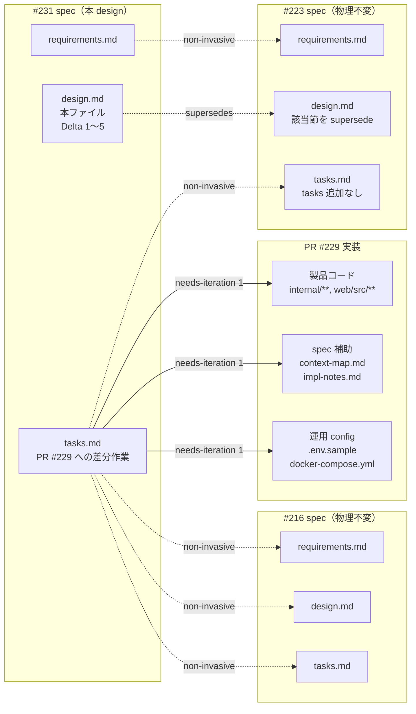
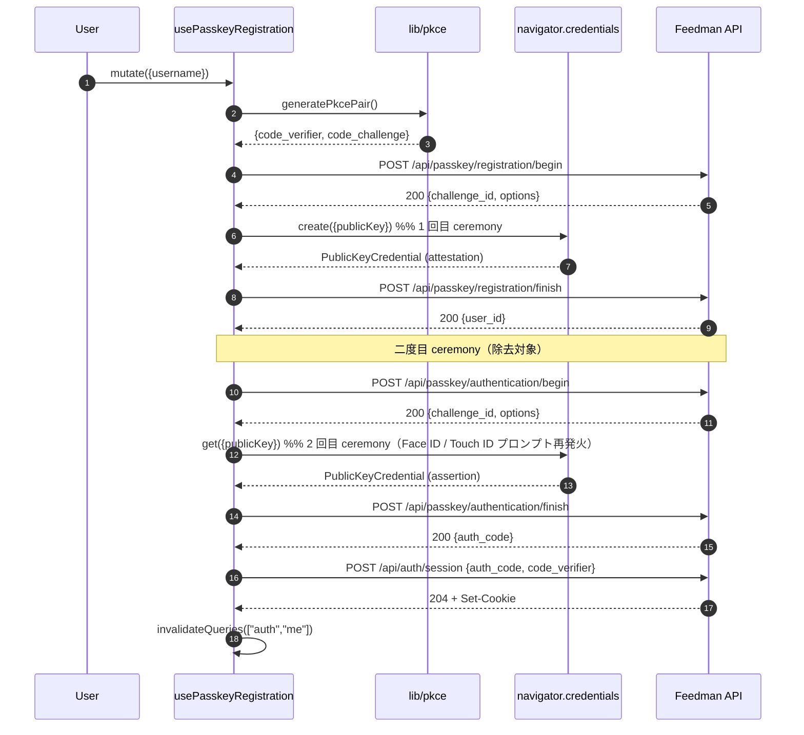
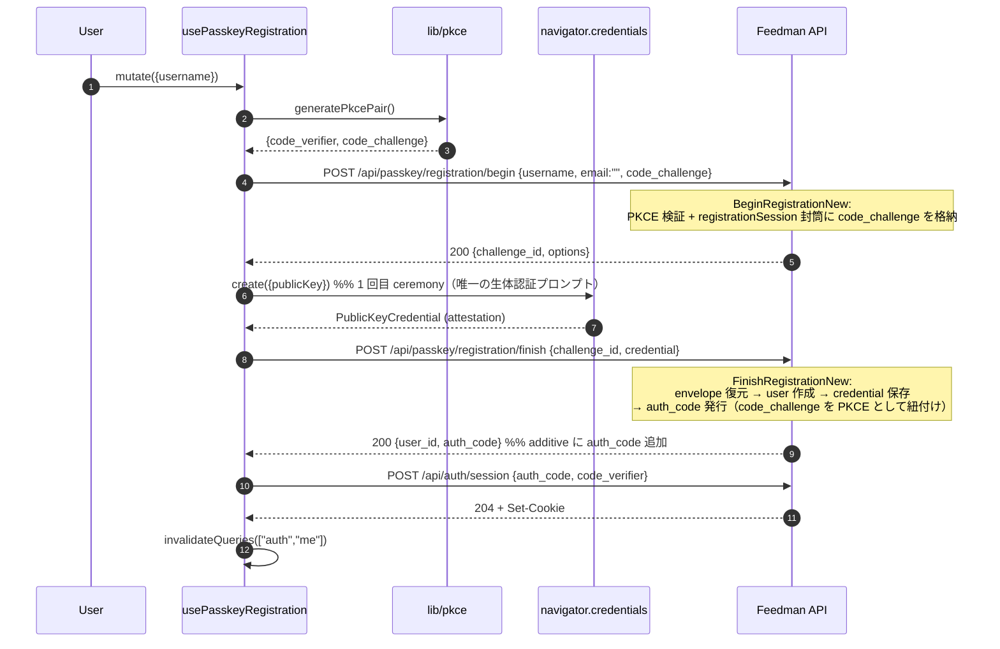
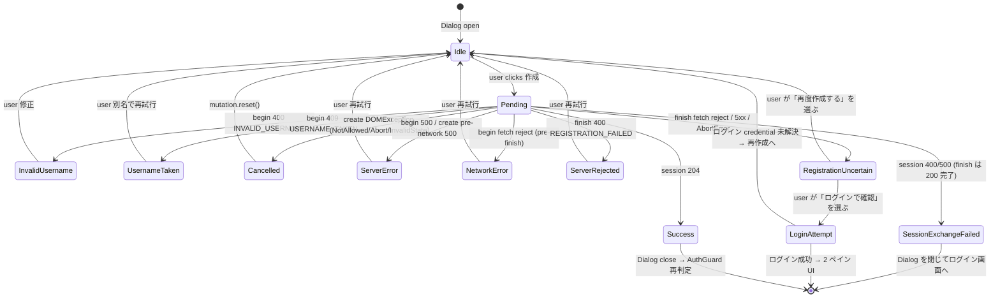

# Design Document

## Overview

**Purpose**: 本設計は Issue #223（Web ログイン画面のパスキー導線追加）に対する
**差分設計（normative delta）** である。#223 の実装 PR #229 レビューで発見された 5 件の
不整合（登録直後の二度目 WebAuthn ceremony / File Structure Plan の欠落 /
fail-closed 表の不正確さ / CSRF 記述の誤り / 完了不明状態の未定義）を、#223 spec の
物理ファイルを一切変更せず、本 spec 内で normative に上書き（supersede）する。

**Users**: 未認証 Web 訪問者（パスキーで新規作成する層／ iOS #216 で作成したパスキーで Web
にログインする層）と、既存 Google OAuth ユーザー、Feedman 運用者。iOS #216 ユーザーへの
影響はゼロ（本差分は iOS の request/response 契約を破壊しない / 追加は additive のみ /
NFR 3.2）。

**Impact**: 本 spec は独立した実装 PR を作らない。design PR merge 後、PR #229 の
`needs-iteration` 1 回で製品コード（`internal/passkey/` / `internal/handler/` /
`web/src/hooks/` / `web/src/components/`）・テスト・spec の
`impl-notes.md` / `context-map.md`（**#223 spec の requirements.md / design.md /
tasks.md は書き換えない**）へ差分を反映する。#231 spec の tasks.md は「PR #229 に
適用する差分作業」を独立コミット可能な粒度で列挙する（NFR 1.2）。

### 補正する 5 つの Delta サマリ

- **Delta 1（Requirement 1）**: 登録 finish で二度目の WebAuthn ceremony を廃止し、
  `POST /api/passkey/registration/finish` の応答に **additive で `auth_code` を含める**方式に
  改める。`internal/passkey/registration_service.go` の `RegistrationService` に、既存
  `AuthenticationService.authnSession` と同型の `registrationSession` 封筒を導入して
  begin 時の `code_challenge` を finish まで運び、既存 `auth.AuthCodeCreator` で auth_code を
  発行する。iOS #216 の `registration/finish` レスポンスは既存 `{user_id}` に `auth_code` が
  追加されるのみで、iOS の JSON 復号は未知フィールドを無視する慣行のため契約破壊にはならない。
- **Delta 2（Requirement 2）**: PR #229 の実変更ファイル一覧を File Structure Plan 差分の
  「変更対象」に完全列挙する（`web/src/lib/api.ts` / `api.test.ts` / `.env.sample` /
  `docker-compose.yml` を含む）。#223 design の「api.ts 無変更」記述を訂正する。
- **Delta 3（Requirement 3）**: fail-closed 表を env × 4 endpoint（session / capability /
  iOS registration/* / iOS authentication/*）の独立列に組み直し、`NATIVE_AUTH_JWT_SECRET`
  未設定時に iOS endpoint が **維持される** ことを表現する。合わせて Web 用 capability probe の
  route 登録条件を `PasskeyHandler != nil` から **`PasskeyHandler != nil && NativeAuthHandler
  != nil`** に強化し、Web で end-to-end 実行不能な env 構成では capability = 404 として
  Google 単体表示に確実に縮退させる（router 側の小修正）。iOS endpoint 群の登録条件は
  従来どおり `PasskeyHandler != nil` のみで変えないため #216 契約は破壊しない（NFR 3.2）。
- **Delta 4（Requirement 4）**: 「攻撃者は (auth_code, code_verifier) ペアを取得できない」の
  誤記述を撤回し、CSRF 主防御（exact Origin / JSON Content-Type / CORS preflight /
  SameSite / PKCE + auth_code 単回 60s TTL）と 2 種の残余リスク（同一オリジン XSS 経由 /
  攻撃者自身の credential による自アカウント誘引）を明記する。人間運用者決定として追加の
  browser-bound state（transaction cookie / 追加 CSRF token / Origin-bound challenge 拡張）は
  導入しない旨も決定記録として残す。**design 側の記述変更のみ**で製品コードへの挙動変更を
  伴わない。
- **Delta 5（Requirement 5）**: 「サーバは registration/finish を commit したがクライアントが
  応答を受け取れなかった」ケースを **第 3 の完了不明状態** として定義し、`PasskeyRegistration
  ErrorKind` に `registration_uncertain` を追加。UI では既存の
  `invalid_username` / `username_taken` / `cancelled` / `server_rejected` /
  `session_exchange_failed` と識別可能な文言で提示し、ログイン導線での確認 / 再作成の
  復旧導線を提供する。

### Goals

- 主要目標 1: 新規作成完了までに追加の WebAuthn ceremony を要求しない（Requirement 1）
- 主要目標 2: iOS #216 の `/api/passkey/*` request/response 契約を破壊しない（NFR 3.2）
- 主要目標 3: 完了不明状態を含む復旧導線を Web UX として明確化する（Requirement 5）
- 主要目標 4: fail-closed 表と CSRF 記述を運用者・レビュワーが誤読しない粒度で明確化する
  （Requirement 3 / 4）
- 成功基準:
  - PR #229 に本差分を反映した後の `go test ./...` と `web/npm test` が既存テストを含めて green
  - `POST /api/passkey/registration/finish` のレスポンスが `{user_id, auth_code}` を含み、
    web が二度目 WebAuthn ceremony なしで `POST /api/auth/session` 呼び出しに到達する
  - `NATIVE_AUTH_JWT_SECRET` 未設定 + `WEBAUTHN_RP_ID/ORIGINS` 設定済み env で iOS 用
    `/api/passkey/registration/*` / `/api/passkey/authentication/*` が引き続き 200 応答する

### Non-Goals

- **#223 spec の物理ファイル書換え**（`docs/specs/223-feat-web-web/requirements.md` /
  `design.md` / `tasks.md`）— 本 spec は差分宣言のみを行い、物理ファイルは触らない（NFR 1.1）
- **独立した実装 PR の作成** — 差分は PR #229 の needs-iteration 1 回で反映（NFR 1.2）
- **#216 iOS パスキー API 契約の破壊的変更**（NFR 1.3 / NFR 3.2）
- **Issue #230 相当の DB トランザクション統合実装**（本 spec は Delta 1 の合流方式要件までを
  扱い、user / credential の単一トランザクション化は #230 に委ねる）
- **browser-bound state（transaction cookie / 追加 CSRF token / Origin-bound challenge 拡張）
  の導入**（Requirement 4 の決定事項として本 spec では要求しない）
- **`.env.sample` / `docker-compose.yml` を別 prerequisite PR に分離すること**
  （Requirement 6 の決定事項）

## Architecture

### Existing Architecture Analysis

本差分は #223 design が確立した以下の既存アーキテクチャを **維持する前提** で、上記 5 点の
不整合のみを補正する。責務境界・依存方向・fail-closed 判定ロジック本体は変更しない
（Delta 3 の router 条件のみ 1 行相当を強化）:

- **既存パターンの維持**:
  - `handler → service → repository → model` の一方向依存（CLAUDE.md §1）
  - `internal/passkey/` の ceremony 責務（`RegistrationService` / `AuthenticationService`）と
    `internal/handler/passkey_handler.go` の HTTP I/O 責務の分離（#216 で確立）
  - `challengeStore.Issue/Consume` を通じた TTL 付き単回消費（#216 で確立）
  - `AuthenticationService` が既に採用している `authnSession` 封筒パターン（sessionData
    バイト列を `{WebAuthnSession, CodeChallenge}` で opaque に運ぶ）→ **Delta 1 で
    `RegistrationService` にも横展開**
  - Web 側の `lib/` 純粋関数 → `hooks/` mutation → `components/` UI の 3 層構成（#223 で確立）
  - fail-closed による route 未登録判定（`if deps.<Handler> != nil { register }` パターン）
- **本差分が変更する点**:
  - `RegistrationService.BeginRegistrationNew` / `FinishRegistrationNew` の内部処理と
    `FinishRegistrationNew` のシグネチャ（`(userID, error)` → `(userID, authCodePlain, error)`）
  - `PasskeyHandler.RegistrationFinish` のレスポンス body に `auth_code` を additive 追加
  - `router.go` の capability route 登録条件を「両 handler 非 nil」に強化
  - Web hook `use-passkey-registration.ts` の内部 chain（二度目 ceremony 除去 +
    `registration_uncertain` state 追加）
  - Web UI `passkey-signup-dialog.tsx` の error state 分岐に uncertain 状態と復旧導線 UI を追加
  - `.env.sample` / `docker-compose.yml` に既存 WebAuthn env の記述を整備（**新規 env 追加は
    なし**、既存 env の documentation / passthrough のみ）
- **尊重すべき制約**:
  - iOS #216 の request/response 契約：`registration/begin` request `{username, email?, code_challenge}`,
    `registration/finish` request `{challenge_id, credential}`, `authentication/begin` request
    `{code_challenge}`, `authentication/finish` response `{auth_code}` の各フィールド構造は
    そのまま維持する。**additive な optional response field 追加のみ許容**（`registration/finish`
    レスポンスへの `auth_code` 追加）
  - `#223` design.md の全 Components セクション（`SessionExchangeService` / `NativeAuthHandler.
    Session` / `PasskeyHandler.Capability` / Web 側 hook/component 群）の責務・契約はそのまま
    維持
  - NFR 1.1（`#223` requirements.md / design.md / tasks.md の物理ファイル不変）
  - NFR 1.3（#216 requirements.md / design.md / tasks.md および `/api/passkey/registration/*` /
    `/api/passkey/authentication/*` の request/response 契約変更禁止 — 本差分の
    `registration/finish` 応答への `auth_code` 追加は additive のため許容）

### 差分適用の運用境界



- `#231 design.md` は `#223 design.md` の該当節を supersede する（本ファイル内の Delta 1〜5 で
  before → after を明示）
- `#231 tasks.md` は PR #229 に適用する製品コード / テスト / 運用 config / spec 補助
  （`impl-notes.md` / `context-map.md`）への差分作業のみを列挙し、**`#223` / `#216` の
  requirements.md / design.md / tasks.md を書き換えるタスクを含まない**
- `#216` spec 全体は本差分の対象外（NFR 1.3）

### Technology Stack

本差分は **技術スタック追加なし**。既存の技術選定（Go 1.25 / chi/v5 / PostgreSQL 16 /
go-webauthn / Next.js 15 / TanStack Query / shadcn/ui / Vitest）をそのまま使用する。

## File Structure Plan（PR #229 に適用する差分の変更対象 / 新規追加）

本セクションは PR #229 の `needs-iteration` 1 回で反映する対象ファイルを **変更対象**
（既存 or PR #229 で既に追加済み → 本差分でさらに編集）と **新規追加**（本差分で初めて
生成）に分けて明示する。**#223 design.md「File Structure Plan」節を supersede する**
（Requirement 2）。

### Modified Files（PR #229 に対する編集対象）

#### サーバ側

- `internal/passkey/registration_service.go` — **変更**（Delta 1 / #216 で main 済み）
  - `registrationSession` 封筒構造体を追加（`{WebAuthnSession json.RawMessage,
    CodeChallenge string}`、既存 `authentication_service.go::authnSession` と同型）
  - `BeginRegistrationNew` を修正: 検証済み `code_challenge` を封筒に格納し
    `challengeStore.Issue(sessionData=封筒 marshal)` として運ぶ
  - `FinishRegistrationNew` のシグネチャを **`(userID string, error) → (userID string,
    authCodePlain string, error)`** に変更（additive: 呼び出し側は handler のみ）
  - `FinishRegistrationNew` に auth_code 発行ロジック追加（`auth.GenerateAuthCode` +
    `auth.HashNativeSecret` + `AuthCodeCreator.Create` — `authentication_service.go` と
    完全同経路）
  - `RegistrationService` 構造体に `authCodes auth.AuthCodeCreator` フィールドを追加、
    `NewRegistrationService` シグネチャに `authCodes` を追加（wiring 側で
    `PostgresAuthCodeRepo` を注入）
- `internal/passkey/registration_service_test.go` — **変更**
  - 既存ケースの assertion を新シグネチャに追従（`userID` に加え `authCodePlain` を返す）
  - 新規ケース: 正常系で `AuthCodeCreator.Create` が `envelope.CodeChallenge` を PKCE として
    紐付ける AuthCode を受け取ることを stub で検証
  - 新規ケース: `code_challenge` を封筒 → sessionData → 復元まで往復させて begin/finish 間で
    保持されることを検証
- `internal/handler/passkey_handler.go` — **変更**（Delta 1 handler 側 + Delta 3 不変）
  - `RegistrationFinish` ハンドラ内で `RegistrationService.FinishRegistrationNew` の 2 番目
    返り値（`authCodePlain`）をレスポンス body へ additive に組み込む
    （`{user_id, auth_code}` の形式）
  - `Capability` ハンドラ（PR #229 で新規追加済み）は本差分では変更しない（route 側の登録
    条件のみ router.go で変更）
- `internal/handler/passkey_handler_test.go` — **変更**
  - `TestPasskeyHandler_RegistrationFinish` の assertion に `body.auth_code` の存在確認・
    形式検証（base64url 43 文字以上、既存 `HashNativeSecret` 入力形式）・**iOS ignore-unknown
    互換の観点で追加フィールドのみ増えたことを確認する**回帰ケースを追加
- `internal/handler/router.go` — **変更**（Delta 3 router 登録条件強化）
  - 現状想定される `if deps.PasskeyHandler != nil { r.With(...).Get("/api/passkey/capability",
    deps.PasskeyHandler.Capability) }` を **`if deps.PasskeyHandler != nil &&
    deps.NativeAuthHandler != nil`** に強化する（NATIVE 系 env が未設定なら Web 側 probe を
    404 に倒し Google 単体に確実に縮退させる）
  - iOS 用 `/api/passkey/registration/*` および `/api/passkey/authentication/*` の登録条件は
    従来どおり `PasskeyHandler != nil` のみで **変更しない**（#216 契約維持 / NFR 3.2）
- `internal/handler/router_test.go` — **変更**
  - fail-closed 表の 4 環境行に対応する route 登録有無テストを追加:
    - 全 env 設定済み → `/api/auth/session` 204 / capability 200 / iOS registration/* /
      authentication/* いずれも登録
    - NATIVE unset + WEBAUTHN set → session 404 / capability 404 / iOS 系登録
    - NATIVE set + WEBAUTHN unset → session 登録 / capability 404 / iOS 系 404
    - 両 unset → 全 404
- `internal/handler/router_unauth_ratelimit_test.go` — 既存テスト維持（本差分で追加変更なし）
- `internal/handler/native_auth_handler.go` — 既存 PR #229 実装を維持（本差分で追加変更なし）
- `internal/handler/native_auth_handler_test.go` — 既存 PR #229 実装を維持
- `internal/auth/session_exchange.go` — 既存 PR #229 実装を維持
- `internal/auth/session_exchange_test.go` — 既存 PR #229 実装を維持
- `internal/app/app.go` — **変更**
  - `passkey.NewRegistrationService` の呼び出しに `authCodes`（`repository.PostgresAuthCodeRepo`）
    を注入する（既存 `AuthenticationService` の wiring と同じ具体依存を再利用）

#### Web 側

- `web/src/hooks/use-passkey-registration.ts` — **変更**（Delta 1 web + Delta 5 hook）
  - 現行 PR #229 の chain は「begin → create → finish → `<認証 chain>: begin → get → finish
    → session`」であり、finish 200 後に **二度目の WebAuthn ceremony**（`navigator.credentials
    .get`）を実行している。本差分ではこの二度目 ceremony を **完全除去** し、finish の応答
    body の `auth_code` を直接 `POST /api/auth/session {auth_code, code_verifier}` に渡す
  - `PasskeyRegistrationErrorKind` に `"registration_uncertain"` を追加（Delta 5）
  - error 分類ロジックを step index ベースで再構成し、`step === registration_finish` かつ
    `fetch reject`（`TypeError`） / 5xx / タイムアウト時に `registration_uncertain` を返す
    （詳細は §Delta 5「状態遷移と判定」）
- `web/src/hooks/use-passkey-registration.test.ts` — **変更**
  - 既存の「登録 → 認証 → session」正常系 test を「登録 → session」正常系に書き換え
    （二度目 ceremony が呼ばれないことを assert）
  - 新規: `registration_uncertain` を 3 サブケース（fetch reject / 5xx / abort）で誘発する test
  - 既存 error kind 分岐（`invalid_username` / `username_taken` / `cancelled` /
    `server_rejected` / `session_exchange_failed`）の test はシグネチャに追従して維持
- `web/src/components/passkey-signup-dialog.tsx` — **変更**（Delta 5 UI）
  - `error.kind === "registration_uncertain"` 分岐を追加し、Delta 5 §UI 文言と復旧導線
    （「ログイン画面で確認する」「再度作成する」の 2 ボタン）を表示
  - 既存 error kind 分岐は文言・挙動を維持（Requirement 5.6 の弁別性を担保）
- `web/src/components/passkey-signup-dialog.test.tsx` — **変更**
  - `registration_uncertain` 分岐の文言表示と復旧ボタンの callback 呼び出しを検証する test を追加
- `web/src/components/login-page.tsx` — 既存 PR #229 実装を維持（本差分で追加変更なし）
- `web/src/components/login-page.test.tsx` — 既存 PR #229 実装を維持
- `web/src/components/login-page-recovery.test.tsx` — **変更**（PR #229 で追加済み）
  - `registration_uncertain` → ログイン試行 → 成功時に 2 ペイン UI に到達する recovery E2E-ish
    テストの追加を検討（Requirement 5.3）。ユニットレベルで実現困難な場合は既存
    login-page.test.tsx 側のカバレッジで代替してよい（本テスト新規は必須ではない / 詳細は
    tasks.md 側で判断）
- `web/src/lib/api.ts` — **変更**（Requirement 2.1 / 現行 #223 design が誤って「無変更」と
  記述している）
  - PR #229 で `credentials: "include"` 経路の追加拡張・エラー body 保持形式の変更・
    `ApiError.code` 判定強化などが行われた形跡。本差分では PR #229 で既に加えた変更を
    File Structure Plan に **正確に列挙する**（本差分自身が api.ts をさらに触る必要はない）
- `web/src/lib/api.test.ts` — **変更**（PR #229 で追加済みだが #223 design 未列挙）
  - 上記 api.ts 変更に対応するテストが PR #229 に含まれる。File Structure Plan に列挙する
- `web/src/lib/webauthn.ts` / `web/src/lib/webauthn.test.ts` — 既存 PR #229 実装を維持
- `web/src/lib/pkce.ts` / `web/src/lib/pkce.test.ts` — 既存 PR #229 実装を維持
- `web/src/lib/passkey-capability.ts` / `web/src/lib/passkey-capability.test.ts` — 既存維持
- `web/src/hooks/use-passkey-capability.ts` / `.test.ts` — 既存維持
- `web/src/hooks/use-passkey-authentication.ts` / `.test.ts` / `.contract.test.ts` — 既存維持
- `web/src/components/passkey-buttons.tsx` / `.test.tsx` — 既存維持
- `web/src/types/passkey.ts` — **変更**
  - `RegistrationFinishResponse` 型に `auth_code: string` フィールドを additive 追加
    （`user_id` は既存維持）

#### 運用 config（PR #229 のスコープに含める / Requirement 6）

- `.env.sample` — **変更**（Requirement 6.1 / 現行 #223 design が「追加 env 無し」と記述
  しつつ既存 WebAuthn 系 env の documentation が未整備）
  - `WEBAUTHN_RP_ID` / `WEBAUTHN_RP_DISPLAY_NAME` / `WEBAUTHN_ORIGINS` /
    `WEBAUTHN_IOS_APP_ID` / `PASSKEY_CHALLENGE_TTL_SECONDS` の 5 変数を **既存 env として
    documentation**（コメントアウト行 + fail-closed 挙動の解説）を追加する
  - **新規 env の追加は行わない**（Requirement 6.5 と #223 Scope の維持）
- `docker-compose.yml` — **変更**（Requirement 6.2）
  - `api` サービスの `environment` に `WEBAUTHN_RP_ID` / `WEBAUTHN_RP_DISPLAY_NAME` /
    `WEBAUTHN_ORIGINS` / `WEBAUTHN_IOS_APP_ID` / `PASSKEY_CHALLENGE_TTL_SECONDS` の
    passthrough を追加（すべて `${VAR:-}` 形式で **既定値なし**、未設定なら空文字で fail-closed）
  - **新規 env の追加は行わない**

#### spec 補助（`docs/specs/223-feat-web-web/` 配下 — requirements/design/tasks 本体は不変）

- `docs/specs/223-feat-web-web/impl-notes.md` — **変更**
  - 「#231 の normative delta を適用済み」旨の追記と、Delta 1〜5 に対応する PR #229 側の
    実装差分の要約を追記する（confirm 事項ではなく事後の記録）
- `docs/specs/223-feat-web-web/context-map.md` — **変更**
  - 二度目 WebAuthn ceremony 除去に伴う経路図の更新、fail-closed 表の supersede 記録、
    完了不明状態の遷移追加

### New Files（本差分で新規追加）

なし。すべての差分は既存ファイル（PR #229 が既に追加した / 既に main 済みのもの含む）への
編集で完結する。

## Requirements Traceability

| Requirement | Summary | Traced to |
|-------------|---------|-----------|
| 1.1 | 登録 finish 後の追加 WebAuthn ceremony 禁止 | Delta 1 §Registration Service / §Web Hook |
| 1.2 | 二度目 ceremony を実装として採用しない | Delta 1 §before → after 図 |
| 1.3 | 登録トランザクションに紐付いた合流経路 | Delta 1 §envelope パターン |
| 1.4 | 2 ペイン UI 初期表示 | Delta 1 §Sequence 図 |
| 1.5 | ログイン導線への影響なし | Delta 1 §影響範囲、`use-passkey-authentication` 未変更 |
| 2.1 | api.ts / api.test.ts を変更対象に明示 | File Structure Plan §Modified Files |
| 2.2 | .env.sample / docker-compose.yml を変更対象に明示 | File Structure Plan §Modified Files |
| 2.3 | needs-iteration 1 回で完結する粒度のタスク | tasks.md 全体（6 タスク） |
| 2.4 | #223 spec 書換タスクを含まない | tasks.md 全体（#223 requirements/design/tasks の編集タスク不在） |
| 2.5 | Reviewer が変更ファイルを突合できる状態 | File Structure Plan §Modified Files（PR #229 変更 25 ファイル全列挙） |
| 3.1 | session endpoint の登録・未登録を独立列に | Delta 3 §fail-closed 表（列: `/api/auth/session`） |
| 3.2 | capability endpoint の登録・未登録を独立列に | Delta 3 §fail-closed 表（列: `/api/passkey/capability`） |
| 3.3 | NATIVE unset + WEBAUTHN set で iOS 継続 | Delta 3 §env 行 2 と router 変更 |
| 3.4 | WEBAUTHN unset で capability 404 + iOS 停止 | Delta 3 §env 行 3 / 4 |
| 3.5 | iOS request/response 契約破壊禁止 | Delta 3 §iOS 契約維持論証 / Delta 1 §additive 論証 |
| 4.1 | CSRF 主防御要素を要素ごとに明記 | Delta 4 §主防御要素表 |
| 4.2 | 旧誤記述の撤回と正しい前提の明記 | Delta 4 §旧記述の撤回 |
| 4.3 | 残余リスクの列挙 | Delta 4 §残余リスク |
| 4.4 | browser-bound state 不要の決定明記 | Delta 4 §決定記録 |
| 4.5 | Cookie 属性の既存 Google OAuth 一致維持 | Delta 4 §Cookie 属性維持 |
| 4.6 | 将来検討導線を残す | Delta 4 §将来検討導線 |
| 5.1 | 第 3 の完了不明状態としてユーザーに提示 | Delta 5 §状態定義 / §Hook error kind 追加 |
| 5.2 | ログインで確認する旨の復旧案内を同一画面に | Delta 5 §UI 文言と復旧導線 |
| 5.3 | 復旧ログインで成功時に 2 ペイン UI | Delta 5 §状態遷移図（成功遷移） |
| 5.4 | 復旧ログイン失敗時に再作成導線 | Delta 5 §状態遷移図（失敗遷移） |
| 5.5 | サーバ内部詳細を反射しない | Delta 5 §UI 文言（generic 固定） |
| 5.6 | 他状態と混同されない文言 | Delta 5 §既存 error kind との弁別表 |
| 6.1 | .env.sample を変更対象に明示 | File Structure Plan §運用 config |
| 6.2 | docker-compose.yml を変更対象に明示 | File Structure Plan §運用 config |
| 6.3 | needs-iteration 1 回で完結する config タスク | tasks.md Task 5 |
| 6.4 | 別 prerequisite PR に分離しない決定明記 | Delta 6 §決定記録 |
| 6.5 | 既存 env 流用に留め新規 env 追加なしを担保 | File Structure Plan §運用 config 本文 |
| NFR 1.1 | #223 spec 物理ファイル不変 | File Structure Plan（#223 spec 編集タスク不在）+ Non-Goals |
| NFR 1.2 | 独立実装 PR を作らず PR #229 needs-iteration 1 回で反映 | Non-Goals + tasks.md 全体 |
| NFR 1.3 | #216 契約を破壊するタスクを含まない | Delta 1 §additive 論証 + File Structure Plan（#216 spec 編集タスク不在） |
| NFR 2.1 | 完了不明状態の秘密情報非漏出 | Delta 5 §秘密情報の非漏出 |
| NFR 2.2 | CSRF / fail-closed 記述に秘密値を例示しない | Delta 3 / Delta 4（例示値なし） |
| NFR 3.1 | Google OAuth 既存挙動を破壊しない | 全 Delta（既存 Google 経路無変更）+ File Structure Plan（auth_handler.go / use-auth.ts 未変更） |
| NFR 3.2 | iOS #216 request/response 契約不変 | Delta 1 §additive 論証 + Delta 3 §iOS 契約維持論証 |

## Delta 1: 登録 finish 直後のセッション合流（Requirement 1）

### Supersedes（#223 design.md の該当節）

- `#223 design.md` §Flows「新規作成フロー（Sequence / 抜粋）」（line ~957-999）— 特に
  L993 の `HR->>HR: <認証 chain>: begin → get → finish → session` の記述と、それに続く
  L994-996 のシーケンス
- `#223 design.md` §`use-passkey-registration.ts` の「5. **直後に認証 chain**」以降（L655-661）
- `#223 tasks.md` L177-179 の task 8 (5) 「**直後に認証 chain**」記述

### Before → After Sequence

#### Before（現行 #223 design / PR #229 の実装）



#### After（本 Delta 1 で確定する挙動）



追加のブラウザ生体認証プロンプト（`navigator.credentials.get`）が消滅し、ユーザーが体験する
ceremony は登録時の `create` の 1 回のみになる。

### Server 側の実装差分

#### `internal/passkey/registration_service.go`（Modified）

`AuthenticationService` に既に存在する `authnSession` 封筒パターンを踏襲する
（`internal/passkey/authentication_service.go` L57-66 と同型）。`model.PasskeyChallenge` /
`WebAuthnAdapter` / `challengeStore` の interface は変更せず、sessionData バイト列に
`{WebAuthnSession, CodeChallenge}` を JSON marshal して opaque に運ぶ。

```go
// internal/passkey/registration_service.go に追加（authentication_service.go::authnSession と同型）

// registrationSession は registration_new kind の challenge に紐付ける封筒。
// begin 時の code_challenge を finish まで運び、auth_code の PKCEChallenge として紐付ける
// （Req 1.3 の「登録トランザクションと結び付いた合流経路」）。
type registrationSession struct {
    // WebAuthnSession は adapter.BeginRegistration が返す webauthn.SessionData の JSON bytes。
    // FinishRegistration にそのまま渡すため RawMessage で無改変に保持する。
    WebAuthnSession json.RawMessage `json:"webauthn_session"`
    // CodeChallenge は begin 時に検証した PKCE S256 challenge（base64url 43 文字）。
    // finish 時に auth_code の PKCEChallenge として設定される。
    CodeChallenge string `json:"code_challenge"`
}

// RegistrationService に authCodes フィールドを追加
type RegistrationService struct {
    adapter     WebAuthnAdapter
    challenges  challengeStore
    users       UserWriter
    credentials PasskeyCredentialWriter
    authCodes   auth.AuthCodeCreator  // 新規: auth_code 発行（authentication_service.go と同じ具体依存）
    now         func() time.Time
}

// NewRegistrationService のシグネチャに authCodes を追加（wiring 側で調整）
func NewRegistrationService(
    adapter WebAuthnAdapter, challenges challengeStore,
    users UserWriter, credentials PasskeyCredentialWriter,
    authCodes auth.AuthCodeCreator, now func() time.Time,
) *RegistrationService

// BeginRegistrationNew: PKCE 検証済み code_challenge を封筒に格納
//   - PKCE 形式検証（既存挙動、変更なし / Req 1.5 の early validation 継続）
//   - envelope := registrationSession{WebAuthnSession: sessionData, CodeChallenge: codeChallenge}
//   - envelopeBytes := json.Marshal(envelope)
//   - challenges.Issue(sessionData=envelopeBytes, ...) として保存
//   - 戻り値は既存と同じ (challengeID string, options []byte, error)
func (s *RegistrationService) BeginRegistrationNew(
    ctx context.Context, rawUsername string, optionalEmail string, codeChallenge string,
) (string, []byte, error)

// FinishRegistrationNew:
//   - シグネチャ変更: (string, error) → (string, string, error)
//     - 1 番目: userID
//     - 2 番目: authCodePlain（NEW）
//     - 3 番目: error
//   - challenges.Consume で PasskeyChallenge を取得
//   - envelope を json.Unmarshal し、WebAuthnSession と CodeChallenge を復元
//     （破損 / 不完全は ErrRegistrationFailed / uniform 拒否）
//   - 既存の adapter.FinishRegistration → CreateUserOnly → credentials.Create フローを維持
//   - **auth_code 発行を末尾に追加**:
//       plain, _ := auth.GenerateAuthCode()  // authentication_service.go L320 と同じ
//       codeHash := auth.HashNativeSecret(plain)
//       authCode := &model.AuthCode{
//         ID:            uuid.New().String(),
//         CodeHash:      codeHash,
//         UserID:        newUser.ID,
//         PKCEChallenge: envelope.CodeChallenge,  // Req 1.3 の合流点
//         ExpiresAt:     s.now().Add(auth.NativeAuthCodeTTL),
//       }
//       s.authCodes.Create(ctx, authCode)
//   - 平文 plain を戻り値としてのみ返す（NFR 2.1 準拠、authentication_service.go と同方針）
//   - ログには hash 先頭 8 文字のみ（authentication_service.go L338-341 と同方針）
func (s *RegistrationService) FinishRegistrationNew(
    ctx context.Context, challengeID string, requestBody []byte,
) (userID string, authCodePlain string, err error)
```

- Preconditions: `authCodes` は `NewRegistrationService` 時に non-nil で注入されている
  （`app.go` の wiring で `PostgresAuthCodeRepo` を渡す。既存 `AuthenticationService` と同経路）
- Postconditions:
  - 成功時: user / credential / auth_code の 3 レコードが永続化される
    （single-transaction 統合は #230 のスコープで本 spec の対象外 / Out of Scope）
  - 失敗時: 部分保存は `#216` の既存挙動と同じ（追加の rollback ロジックは持たない）
- Invariants:
  - `envelope.CodeChallenge` が空 or 復元不能なら `ErrRegistrationFailed`（uniform 拒否）
  - `auth_code` 平文をログ・エラーメッセージに残さない（NFR 2.1 / `authentication_service.go`
    L336-341 の既存方針を踏襲）

#### `internal/handler/passkey_handler.go`（Modified）

```go
// PasskeyHandler.RegistrationFinish（新シグネチャに追従）

// レスポンス body 型を additive に拡張
type registrationFinishResponse struct {
    UserID   string `json:"user_id"`
    AuthCode string `json:"auth_code"`  // NEW: additive フィールド
}

// 内部ロジック（イメージ）:
//   userID, authCode, err := h.regService.FinishRegistrationNew(ctx, req.ChallengeID, req.Credential)
//   if err != nil { ... 既存の error mapping（400 REGISTRATION_FAILED / 500）... }
//   respond 200 registrationFinishResponse{UserID: userID, AuthCode: authCode}
```

#### iOS #216 契約が破壊されない論証

- iOS の `POST /api/passkey/registration/finish` レスポンス期待値は `#216 design.md` L708 で
  `{user_id}` と規定されている。本差分では **既存 `user_id` フィールドを削除せず維持し、
  `auth_code` を additive に追加する** のみである。
- Swift の JSON decoding（`Codable` / `JSONDecoder`）は既定で未知フィールドを **無視する**
  （`JSONDecoder` は `allowsJSON5` / `dateDecodingStrategy` などのオプションはあるが、
  「未知キー拒否」は既定オプションに存在しない）。iOS 実装が意図的に strict-mode の decoder を
  組んでいない限り、追加フィールドは黙って無視される。#216 iOS design（`docs/specs/216--app-store-4-8/`）
  でも strict decode の記述はない。
- iOS の登録フローは `#216 design.md` L681-685 の記述どおり、`registration/finish` の後に
  authentication ceremony を走らせて `authentication/finish` で `auth_code` を取得する経路を
  採る（Web 実装より 1 ceremony 多い）。iOS はこの経路を維持できる（`authentication/*` endpoint
  も無変更）。
- したがって本差分は **iOS の request/response 契約を破壊しない**（NFR 1.3 / NFR 3.2）。

### Web 側の実装差分

`web/src/hooks/use-passkey-registration.ts` の内部 mutation chain を以下に整理する。
`#223 design.md` §`use-passkey-registration.ts` の「5. **直後に認証 chain**」以降 4 ステップを
除去する。

```typescript
// use-passkey-registration.ts の mutationFn（イメージ、実装コードではない）

// Before（現行 PR #229）: 6 段の chain（登録 → 認証 → session）
// After（本差分）: 4 段の chain（登録 → session）

async function mutationFn({ username }: { username: string }) {
  const { codeVerifier, codeChallenge } = await generatePkcePair();

  // 1. registration/begin
  const beginRes = await apiClient.post<PasskeyBeginResponse>(
    "/api/passkey/registration/begin",
    { username, email: "", code_challenge: codeChallenge }
  );

  // 2. navigator.credentials.create（唯一の WebAuthn ceremony）
  const creationOptions = decodeCreationOptions(beginRes.options);
  const cred = await navigator.credentials.create(creationOptions);

  // 3. registration/finish → **additive な auth_code を受け取る**
  const finishRes = await apiClient.post<RegistrationFinishResponse>(
    "/api/passkey/registration/finish",
    { challenge_id: beginRes.challenge_id, credential: encodeAttestationResponse(cred) }
  );
  // finishRes.auth_code を直接次段へ渡す（二度目 ceremony 廃止）

  // 4. session 交換
  await apiClient.post(
    "/api/auth/session",
    { auth_code: finishRes.auth_code, code_verifier: codeVerifier }
  );

  await queryClient.invalidateQueries({ queryKey: ["auth", "me"] });
}
```

- `code_verifier` は closure 変数のみに保持（NFR 2.1 準拠、`#223 design.md` §NFR 1.1 準拠）
- `auth_code` は `finishRes` から `apiClient.post("/api/auth/session", ...)` に渡す 1 request 間
  のみメモリ保持し、それ以降は参照されない
- error 分類は §Delta 5 で `registration_uncertain` を追加する形で拡張する

### 影響範囲

- 変更対象コンポーネント: `RegistrationService` / `PasskeyHandler.RegistrationFinish` /
  `router.go`（Delta 3 と合わせて）/ `use-passkey-registration.ts` /
  `passkey-signup-dialog.tsx`（Delta 5 と合わせて）/ `types/passkey.ts` / `app.go`（wiring）
- **無変更で維持する既存要素**:
  - `AuthenticationService` / `use-passkey-authentication.ts` / `PasskeyButtons`（ログイン
    導線は影響を受けない / Requirement 1.5）
  - `SessionExchangeService` / `NativeAuthHandler.Session`（受け取る `auth_code` の由来が
    「authentication 由来」→「registration 由来」に増えるだけで、契約自体は不変）
  - iOS 用 `authentication/*` endpoint（iOS は従来経路を維持）
  - Google OAuth 経路一式（NFR 3.1）

## Delta 2: File Structure Plan の補正（Requirement 2）

### Supersedes

- `#223 design.md` §File Structure Plan の以下記述:
  - L255: `api.ts # 既存（無変更）` → **変更**（`web/src/lib/api.ts` は PR #229 で変更されている）
  - `.env.sample` / `docker-compose.yml` が File Structure Plan に **列挙されていない** →
    **列挙する**
  - `web/src/lib/api.test.ts` が File Structure Plan に **列挙されていない** → **列挙する**

### 補正後の変更対象表（本 spec §File Structure Plan §Modified Files が canonical）

上記「File Structure Plan」節が本 Delta の実質的な canonical 定義であり、Reviewer は同節を
参照して PR #229 の全変更ファイルの被覆を確認できる（Requirement 2.5）。#223 design.md の
「api.ts # 既存（無変更）」記述は本 delta で supersede される。

### Reviewer 突合の観点（Requirement 2.5）

Reviewer は PR #229 の変更ファイル一覧（`git diff --name-only`）を本 File Structure Plan §
Modified Files と突き合わせ、以下を確認できる:

1. PR #229 の全変更ファイルが `Modified Files` セクションに列挙されている
2. `Modified Files` に列挙されているが PR #229 に含まれないファイルがない（過剰な予告なし）
3. `web/src/lib/api.ts` / `api.test.ts` / `.env.sample` / `docker-compose.yml` が
   Modified Files に含まれている（旧 #223 design の見落としを訂正済み）

## Delta 3: fail-closed 表の補正と capability 登録条件の強化（Requirement 3）

### Supersedes

- `#223 design.md` §Configuration §fail-closed 挙動の表（L1158-1162）—
  `NATIVE_AUTH_JWT_SECRET` 未設定行で `POST /api/passkey/*` を「未登録 (404)」と
  誤って記述している箇所

### 補正後の fail-closed 表

env 組合せごとに **各 endpoint を独立列** として表現し、iOS 用 endpoint と Web 用 endpoint の
提供状態を混同しない形に組み直す。

| Env 状態 | `POST /api/auth/session`（Web） | `GET /api/passkey/capability`（Web probe） | iOS `/api/passkey/registration/*` | iOS `/api/passkey/authentication/*` | Web 挙動 | iOS 挙動 |
|---|---|---|---|---|---|---|
| **NATIVE_AUTH_JWT_SECRET 設定 + WEBAUTHN_RP_ID/ORIGINS 設定** | 登録済 (204) | 登録済 (200) | 登録済 (200) | 登録済 (200) | パスキー導線 2 種 + Google 導線 | 通常稼働 |
| **NATIVE_AUTH_JWT_SECRET 未設定 + WEBAUTHN_RP_ID/ORIGINS 設定** | 未登録 (404) | 未登録 (404) | 登録済 (200) | 登録済 (200) | Google 単体表示（capability = 404 で PasskeyButtons 非表示） | **通常稼働（Req 3.3）** |
| **NATIVE_AUTH_JWT_SECRET 設定 + WEBAUTHN_RP_ID/ORIGINS 未設定** | 登録済 (204) | 未登録 (404) | 未登録 (404) | 未登録 (404) | Google 単体表示（capability = 404） | 停止（#216 で確定済み） |
| **NATIVE_AUTH_JWT_SECRET 未設定 + WEBAUTHN_RP_ID/ORIGINS 未設定** | 未登録 (404) | 未登録 (404) | 未登録 (404) | 未登録 (404) | Google 単体表示 | 停止 |

各列の登録条件（router.go の判定式）:

| Endpoint | 登録条件（`router.go` の判定） | 依拠 env |
|---|---|---|
| `POST /api/auth/session` | `deps.NativeAuthHandler != nil` | `NATIVE_AUTH_JWT_SECRET` |
| `GET /api/passkey/capability` | `deps.PasskeyHandler != nil && deps.NativeAuthHandler != nil` **（強化）** | `WEBAUTHN_RP_ID` + `WEBAUTHN_ORIGINS` + `NATIVE_AUTH_JWT_SECRET` |
| `POST /api/passkey/registration/*` | `deps.PasskeyHandler != nil` **（従来どおり / 変更なし）** | `WEBAUTHN_RP_ID` + `WEBAUTHN_ORIGINS` |
| `POST /api/passkey/authentication/*` | `deps.PasskeyHandler != nil` **（従来どおり / 変更なし）** | `WEBAUTHN_RP_ID` + `WEBAUTHN_ORIGINS` |

### capability 登録条件を強化する理由（設計判断）

- **意図**: Web の capability probe は「Web で end-to-end に完了できるか」を答える endpoint と
  して意味を持つべき。NATIVE 未設定環境で `capability = 200` を返すと、Web は PasskeyButtons を
  表示するがユーザーが実行すると最後の `/api/auth/session` で 404 に遭遇し UX が悪化する
  （Req 3.3 が言う「Google 単体表示に縮退する」の主旨に反する）。
- **判断**: capability の登録条件を「両 handler 非 nil」に強化することで、Web は capability =
  404 を受け取り PasskeyButtons を非表示にする（Requirement 5.2 の既存挙動を踏襲）。
- **iOS への影響**: iOS 用 `registration/*` / `authentication/*` の登録条件は `PasskeyHandler
  != nil` のみで **変更しないため、iOS 契約は不変**（NFR 3.2 / Req 3.5）。

### iOS #216 契約が破壊されない論証（Req 3.5）

- iOS が依存する 6 endpoint（`registration/{begin,finish,add/begin,add/finish}` /
  `authentication/{begin,finish}`）はすべて `PasskeyHandler` に紐付いており、router.go での
  登録条件は `PasskeyHandler != nil` のみで変更しない。
- 本差分で新規に登録条件を強化するのは `/api/passkey/capability` のみで、これは PR #229 で
  Web 用に追加した endpoint であり iOS は使用しない（#216 spec には capability endpoint への
  依存記述がない）。
- したがって iOS 用 endpoint 群の稼働条件は #216 と完全同一で、iOS の request/response
  契約・提供状態の env 依存性ともに破壊されない。

## Delta 4: CSRF / PKCE 説明の正確化と残余リスクの明示（Requirement 4）

### Supersedes

- `#223 design.md` §Security Considerations §CSRF 箇条書き（L1115-1121）— 特に L1119-1120 の
  「攻撃者が事前に (auth_code, code_verifier) ペアを入手する経路が存在しない」記述
- `#223 design.md` §`NativeAuthHandler.Session` §CSRF 対策（L862-867）— 同上の誤記述と、
  「明示的 CSRF token は不要」の判断根拠

### 旧記述の撤回

以下の記述を **撤回する**:

> auth_code は 60 秒 TTL + 単回消費 + PKCE 束縛 → クロスサイト攻撃者が事前に (auth_code,
> code_verifier) ペアを入手する経路が存在しない

**正しい前提**（Delta 4 §主防御要素表 §PKCE + auth_code 単回 60s TTL の役割で置き換え）:

- 攻撃者は **自身のブラウザで自身のパスキー credential を用いて完全な認証フローを走行させ、
  自分の (auth_code, code_verifier) ペアを取得できる**。RFC 7636 の PKCE は「同一クライアント
  内での authorization_code の中間者盗用を防ぐ」プロパティであり、攻撃者が **自身のセッション
  で正規に取得したペア** を防ぐものではない。
- したがって PKCE 単独では「攻撃者による自アカウントへのログイン誘引（login CSRF）」を阻止
  できない。これに対する主防御は SameSite Cookie / Origin 検証 / CORS preflight /
  JSON Content-Type の複合による cross-origin 発火不能化である。

### 主防御要素表（Web セッション交換 endpoint の CSRF 対策）

| 防御要素 | 役割 | 何を防ぐか |
|---|---|---|
| **exact Origin 検証** | ブラウザ fetch の Origin ヘッダを CORS で厳密検証 | クロスオリジンからの直接 `POST /api/auth/session` を preflight で拒否 |
| **JSON Content-Type 要求** | `application/json` 以外の Content-Type を 400 で拒否 | classic な HTML form submit（`application/x-www-form-urlencoded`）による cross-site POST を無効化（form は Content-Type を任意に設定できない） |
| **CORS preflight** | non-simple request の preflight OPTIONS 要求 | クロスオリジンの `application/json` POST は preflight を必ず経由するため、Origin 未許可なら本 request が発火しない |
| **SameSite=Lax Cookie** | `session_id` Cookie の SameSite 属性 | 攻撃者サイトからの top-level ナビゲーションでも Cookie 送信を制限（既存 Google OAuth と同じ属性） |
| **PKCE 束縛 + auth_code 単回 60 秒 TTL** | 特定の attacker-in-the-middle シナリオ | 「同一クライアント内で認証 flow を開始したセッション以外」が正しい code_verifier を持たないため、盗聴された auth_code を交換できない。ネットワーク中間経路での code 盗用に対する定番対策（RFC 7636 の本来目的） |
| **HttpOnly Cookie** | `session_id` を JavaScript から不可視化 | XSS 発生時に Cookie 生値を script が読み出して外部送信するのを阻止 |
| **auth_code の 60 秒 TTL + 単回消費** | 発行済み auth_code の有効期間・再利用防止 | replay / 盗聴された auth_code の遅延利用ウィンドウを最小化 |

### 残余リスク（受容する脅威）

上記主防御を受容した上で残る 2 種の残余リスクを明記する:

1. **同一オリジン XSS 経由の全フロー実行**
   - 前提: 攻撃者が Feedman Web の同一オリジンに XSS を注入できた状態
   - 攻撃: 注入 script が完全な passkey 認証フローを走行させ、被害者が Face ID を承認した
     結果で被害者のセッションを乗っ取る、または攻撃者が用意した credential でログイン誘引
   - 補足: 前提を満たす時点で Feedman Web の完全な同一オリジン権限を攻撃者が持つため、
     どんな追加 CSRF token を導入しても同一 script から読める → 防御不能。この脅威の主対策は
     既存 CSP / DOMPurify sanitize（#223 NFR 1.3 で維持）による XSS 発生確率の最小化。
2. **攻撃者自身の credential によるアカウント誘引**
   - 前提: 攻撃者が自身のブラウザで先に (auth_code, code_verifier) ペアを取得し、被害者を
     誘導して被害者ブラウザで `POST /api/auth/session {攻撃者の auth_code, 攻撃者の code_verifier}`
     を実行させる
   - 攻撃: 被害者が **攻撃者アカウントとしてログインしてしまう**（login CSRF）
   - 現状の主防御:
     - `/api/auth/session` は同一オリジン fetch のみ（CORS + exact Origin）→ 被害者ブラウザ内の
       攻撃者スクリプト経由でしか発火できない → **同一オリジン XSS がなければ発火不能**
     - 直接的な cross-site form submit は JSON Content-Type 要求で拒否
   - 補足: 純粋な cross-site 経路では本攻撃は成立しない。同一オリジン XSS を経由する経路は
     上記 1 と同じ脅威モデルに収束する。

### 決定記録: 追加の browser-bound state を導入しない（Req 4.4）

人間運用者の Issue コメント決定（2.A）として、以下を採用 **しない**:

- transaction cookie（begin 時に発行 → finish 時に検証する Cookie）
- 追加の CSRF token（同期トークンパターン）
- Origin-bound challenge 拡張（WebAuthn Level 3 の `additionalUnknownAssertionInputs` 等）

**理由**:
- 現状の主防御（exact Origin + JSON Content-Type + CORS preflight + SameSite + PKCE）は
  RFC 9700 (OAuth 2.0 Security BCP §4.7.1 CSRF) の推奨に整合しており、単一オリジン fetch
  ベースの Web app では十分な CSRF 主防御となる
- 残余リスクは同一オリジン XSS に収束するため、追加 state を導入しても XSS 発生時には同じく
  読める → 追加防御コストに見合わない
- WebAuthn Level 3 の browser-side origin binding（`ClientDataJSON.origin`）は WebAuthn
  ceremony の中で既に検証済みで、passkey 発行段階の attester 認証には効いている

### Cookie 属性の維持（Req 4.5）

- `POST /api/auth/session` が Set-Cookie で発行する `session_id` の各属性は、既存 Google OAuth
  Callback（`auth_handler.go::Callback`）と **完全同一**:
  - `Name = "session_id"`
  - `HttpOnly = true`
  - `SameSite = http.SameSiteLaxMode`
  - `Secure = cookieSecure`（`COOKIE_SECURE` env と `BASE_URL` の https 判定に従う）
  - `Path = "/"`
  - `Domain = cookieDomain`（`COOKIE_DOMAIN` env）
  - `Max-Age = sessionMaxAge`（`SESSION_MAX_AGE` env、既定 86400 秒）
- PR #229 の `NativeAuthHandler.Session` 既存実装がこれを既に満たしている（本差分では変更しない）

### 将来検討導線（Req 4.6）

将来、以下のいずれかを新規 Issue として切り出す前提を残す:

- 同一オリジン XSS 由来の CSRF 突破が問題化した場合 → 追加 Origin-bound state（transaction
  cookie + double-submit token）の導入検討
- 攻撃者自身の credential による login CSRF が問題化した場合 → OAuth 2.0 の `state`
  パラメータ相当を introspection 可能な形で追加する検討
- WebAuthn Level 3 の `additionalUnknownAssertionInputs` によるチャレンジ拡張の実装検討

これらは本差分では扱わず、必要性が生じた時点で別 Issue として起票する。

## Delta 5: 登録完了不明状態と復旧導線（Requirement 5）

### 状態定義

現行 `PasskeyRegistrationErrorKind` に **新規 kind** `registration_uncertain` を追加する。
本 kind は以下いずれかの条件を満たす場合にのみ設定される:

- `POST /api/passkey/registration/finish` の request 送出後、**レスポンスを受け取れなかった**
  （fetch reject `TypeError` = ネットワーク断・DNS 失敗・接続断など）
- `POST /api/passkey/registration/finish` の request 送出後、**5xx 応答**を受け取った
  （サーバが request を受理して commit した可能性はあるが、応答段で失敗した状態）
- `POST /api/passkey/registration/finish` の request が **タイムアウト**した
  （fetch AbortController / signal timeout。Feedman Web は明示 timeout を持たないため実質
  ネットワーク断と同じ扱いになるが、判定コードでは AbortError も含める）

上記以外の失敗（begin での 4xx / create の DOMException / finish の 400 REGISTRATION_FAILED /
session 段の 400/500）は既存 kind（`invalid_username` / `username_taken` / `cancelled` /
`server_rejected` / `session_exchange_failed`）で表現し、`registration_uncertain` にはしない。

### 状態遷移図



### Hook 側の判定ロジック（`use-passkey-registration.ts` 内部）

```typescript
// mutationFn 内の error catch（イメージ）:

try {
  // ... 1. generatePkcePair / 2. begin ...
  // ... 3. create ...
  let finishRes: RegistrationFinishResponse;
  try {
    finishRes = await apiClient.post("/api/passkey/registration/finish", {...});
  } catch (err) {
    // finish request 段の失敗は uncertain / server_rejected / network_error を弁別
    if (err instanceof DOMException && err.name === "AbortError") {
      throw new PasskeyRegistrationError("registration_uncertain", err);
    }
    if (err instanceof ApiError) {
      if (err.status >= 500 && err.status <= 599) {
        // 5xx: commit したかも / しなかったかも → uncertain
        throw new PasskeyRegistrationError("registration_uncertain", err);
      }
      if (err.status === 400 && err.body?.code === "REGISTRATION_FAILED") {
        throw new PasskeyRegistrationError("server_rejected", err);
      }
      throw new PasskeyRegistrationError("server_error", err);
    }
    if (err instanceof TypeError) {
      // fetch reject（network drop / connection reset）
      // finish request は送出済みの可能性が高いため uncertain 側に倒す
      throw new PasskeyRegistrationError("registration_uncertain", err);
    }
    throw new PasskeyRegistrationError("server_error", err);
  }
  // ... 4. session 交換 ...
} catch (err) {
  // begin / create / session 段の失敗は既存分類（invalid_username / username_taken /
  // cancelled / server_rejected / session_exchange_failed / server_error / network_error）
  // registration_uncertain は上の finish catch 内でのみ発生する
}
```

**判定原則（安全側 fail 原則 / Req 5.1）**:

- finish の request が **送出済みでレスポンスが確定的に失敗（4xx）** した場合のみ、
  「サーバが登録を拒否した = commit していない」と断定可能 → `server_rejected`
- finish の request が **送出済みで response が確定できない**（fetch reject / 5xx / abort）
  場合、サーバが commit したかもしれないし、していないかもしれない → `registration_uncertain`
- finish 送出 **前** の失敗（begin での network error）は uncertain ではなく `network_error` /
  `server_error` として扱う（commit していないことが確定するため）

### UI 文言と復旧導線（`passkey-signup-dialog.tsx`）

`error.kind === "registration_uncertain"` の場合、Dialog は以下を提示する:

- **メッセージ本文**（Req 5.1 / 5.5 / 5.6 の弁別性を担保）:

  ```
  登録が完了したかどうかを確認できませんでした。

  この状態は、通信の一時的な問題により、サーバ側での登録の成否をブラウザ側で
  判別できない場合に発生します。次のいずれかをお試しください:

  ・「ログインで確認する」— 入力したユーザー名でログインをお試しください。ログインが
    成功すれば登録は完了しています。
  ・「再度作成する」— ログインで解決しない場合、もう一度新規作成をお試しください。
    登録済みのユーザー名は再利用できないため、この時はユーザー名重複エラーが表示
    される可能性があります。
  ```

- **ボタン 2 種**:
  - 「ログインで確認する」: Dialog を閉じ、`LoginPage` にフォーカスを戻す。ユーザーが
    `PasskeyButtons` の「パスキーでログイン」を押下し、input なしの認証フローで credential
    確認を行う（Req 5.3）。登録が実は完了していれば認証成功 → 2 ペイン UI に遷移する
  - 「再度作成する」: `mutation.reset()` を呼び Dialog を Idle 状態に戻す（同じ username
    で再試行すると多くの場合 `username_taken` になり登録済みが確認できる / Req 5.4）

### 秘密情報の非漏出（Req 5.5 / NFR 2.1）

- 上記メッセージ本文にはサーバ側の内部詳細（スタックトレース・SQL 内部エラー・DB 名・
  内部 URL・attestation バイト列・code_verifier・auth_code）を一切含まない
- Hook 側で `PasskeyRegistrationError` の `body` は Dialog に渡さない（`kind` のみを判定
  材料とする / #223 design §秘密情報の非漏出 と同方針）
- `console.log` / `console.error` を追加しない

### 既存 error kind との弁別（Req 5.6）

| error.kind | 主要文言（要旨） | ユーザーに求める行動 |
|---|---|---|
| `invalid_username` | 「ユーザー名の形式が不正です（3〜32 文字、英数字・ハイフン・アンダースコアのみ）」 | ユーザー名を修正 |
| `username_taken` | 「このユーザー名は既に使用されています」 | 別のユーザー名で再試行 |
| `cancelled` | （エラー表示なし、Idle に戻る） | 再試行 |
| `server_rejected` | 「認証に失敗しました。時間をおいて再度お試しください」 | 時間をおいて再試行 |
| `session_exchange_failed` | 「ログインに問題が発生しました。ログイン画面から再度お試しください」 | ログイン画面へ遷移してログイン試行 |
| **`registration_uncertain`（NEW）** | 「登録が完了したかどうかを確認できませんでした」+ 詳細案内 | 「ログインで確認する」または「再度作成する」を選ぶ |
| `server_error` / `network_error` | 「エラーが発生しました。時間をおいて再度お試しください」 | 時間をおいて再試行 |

7 種すべての文言が相互に区別可能（Req 5.6）。特に `registration_uncertain` は
`session_exchange_failed` と紛らわしくならないよう、専用の説明文（「登録が完了したかどうかを
確認できませんでした」）を採用する。

### #223 Requirement 3.4 との関係整理

- **#223 Req 3.4**（合流失敗時のログイン画面復帰）→ 本 spec の `session_exchange_failed` kind
  が担当する。この場合 registration/finish は 200 完了しており、user と credential は
  永続化済み。session 交換のみが失敗しているため、ユーザーはログイン画面から通常ログインで
  復帰可能。
- **#231 Req 5**（登録 commit の完了不明）→ 本 spec の `registration_uncertain` kind が担当
  する。registration/finish 自体が確定応答を返さなかった状態で、commit の有無が不明。
  Req 5.2 の「ログイン試行で確認」経路は、実は commit 済みなら `session_exchange_failed` 相当
  の後続フロー（もう既に user は作成済み → ログイン成功）を経由する。

両者は **finish 応答が確定したかどうか** で明確に分岐する（前者は 200 確定・後者は不確定）。
状態遷移図と UI 文言で区別を担保する。

## Delta 6: 運用 config を PR #229 に統合する境界（Requirement 6）

### 決定記録: 別 prerequisite PR に分離しない（Req 6.4）

人間運用者の Issue コメント決定（3.A）として、以下を採用 **しない**:

- `.env.sample` および `docker-compose.yml` の変更を **別 prerequisite PR** として PR #229 の
  前に merge させる

**理由**:
- config 変更は既存 env の documentation / passthrough 整備のみで、独立した Issue にする
  ほどの複雑度・レビュー観点を持たない
- PR 分岐を単純化して 1 PR = 1 Issue の原則を維持する（CLAUDE.md）
- iOS 側の稼働環境で `WEBAUTHN_*` env が既に設定されているデプロイでは、passthrough を
  追加するだけで Web 側の capability 判定が正しく動作するため、config 反映と Web 動作は
  同一 PR で reviewer が確認できたほうが妥当

### 既存 env 流用に留める（Req 6.5）

- `WEBAUTHN_RP_ID` / `WEBAUTHN_RP_DISPLAY_NAME` / `WEBAUTHN_ORIGINS` /
  `WEBAUTHN_IOS_APP_ID` / `PASSKEY_CHALLENGE_TTL_SECONDS` は **すべて #216 で追加済み**の
  既存 env であり、`internal/config/config.go` L87-109 に既に読込ロジックが存在する
- `NATIVE_AUTH_JWT_SECRET` / `NATIVE_AUTH_JWT_KID` は **#166 系で追加済み**の既存 env であり
  現行 `.env.sample` L120-130 と `docker-compose.yml` L74-76 に既に記述されている
- **新規追加する env は無い**。本差分の config 変更は「既に config.go / runtime が読み込む
  env を、operator 向けの documentation（`.env.sample`）と container passthrough
  （`docker-compose.yml`）に整備するのみ」の範囲
- したがって `#223 requirements.md` の Scope（既存 env 流用に留め、新規 env は追加しない）を
  破らない

### 反映内容（イメージ）

**`.env.sample`**: 現行 L119-130 の Native Auth 節の後に、以下ブロックを追加する
（実際のコメント文言は tasks.md / 実装 PR で確定）:

```dotenv
# Passkey / WebAuthn 設定（Issue #216: /api/passkey/*, AASA / Issue #229: Web パスキー導線）
# WEBAUTHN_RP_ID は WebAuthn Relying Party ID（scheme / port を含まないドメイン、例: "example.com"）。
# 空文字（未設定）だと passkey handler が生成されず /api/passkey/* / /api/passkey/capability が
# 404 になる（fail-closed）。既存デプロイで passkey を使わない場合は未設定のまま起動可。
# WEBAUTHN_RP_ID=
# WEBAUTHN_RP_DISPLAY_NAME はブラウザに表示される RP display name（既定: "Feedman"）。
# WEBAUTHN_RP_DISPLAY_NAME=Feedman
# WEBAUTHN_ORIGINS は WebAuthn ceremony が許容する origin リスト（カンマ区切り）。
# 例: "https://example.com,https://staging.example.com,feedman://"。空文字だと fail-closed。
# WEBAUTHN_ORIGINS=
# WEBAUTHN_IOS_APP_ID は AASA（Apple App Site Association）に載せる iOS App ID
# （"TEAM_ID.com.example.feedman" 形式）。空文字だと AASA が 404（iOS 連携 fail-closed）。
# WEBAUTHN_IOS_APP_ID=
# PASSKEY_CHALLENGE_TTL_SECONDS は WebAuthn challenge の有効期限（秒）。既定: 300。
# PASSKEY_CHALLENGE_TTL_SECONDS=300
```

**`docker-compose.yml`**: `api` サービスの `environment` に以下を追加する（`worker` サービス
は passkey に依存しないため対象外）:

```yaml
services:
  api:
    environment:
      # ... 既存 env ...
      - WEBAUTHN_RP_ID=${WEBAUTHN_RP_ID:-}
      - WEBAUTHN_RP_DISPLAY_NAME=${WEBAUTHN_RP_DISPLAY_NAME:-Feedman}
      - WEBAUTHN_ORIGINS=${WEBAUTHN_ORIGINS:-}
      - WEBAUTHN_IOS_APP_ID=${WEBAUTHN_IOS_APP_ID:-}
      - PASSKEY_CHALLENGE_TTL_SECONDS=${PASSKEY_CHALLENGE_TTL_SECONDS:-300}
```

すべて `${VAR:-<既定値または空>}` 形式で **既定値なし / 空文字 fail-closed** に統一し、
NFR 3.1（既存挙動不変）を担保する（未設定なら env が空文字で渡り、config.go が空文字を
検出して passkey handler を nil に倒す）。

## Error Handling

本差分は既存 error handling 方針を **踏襲** し、新規に追加するのは以下のみ:

- **サーバ側**: `RegistrationService.FinishRegistrationNew` の auth_code 発行段階での失敗
  （`AuthCodeCreator.Create` の infra エラー）は既存の `fmt.Errorf(...: %w, err)` wrap で
  伝播し、handler で 500 INTERNAL_ERROR にマップする（既存
  `AuthenticationService.FinishAuthentication` L332-333 と同経路）
- **Web 側**: `PasskeyRegistrationErrorKind` に `registration_uncertain` を追加し、Dialog の
  分岐に対応 UI を追加（§Delta 5 §UI 文言と復旧導線）

秘密情報非漏出方針（NFR 2.1）は既存 §Security Considerations（#223）と本 spec §Delta 5
§秘密情報の非漏出で担保される。

## Testing Strategy

### Server 側（Go / `go test`）

- **Unit（`internal/passkey/registration_service_test.go` 拡張）**:
  1. 正常系: begin → finish で `code_challenge` が envelope 経由で保持され、finish の
     `authCodePlain` 戻り値が `AuthCodeCreator.Create` に渡された `AuthCode.PKCEChallenge` と
     符合する
  2. 正常系: `authCodePlain` が非空・base64url 形式（既存 `auth.GenerateAuthCode` の返り値
     形式）である
  3. 異常系: envelope 復元失敗（sessionData が破損）→ `ErrRegistrationFailed`
  4. 異常系: envelope の `CodeChallenge` が空 → `ErrRegistrationFailed`
  5. 異常系: `AuthCodeCreator.Create` が infra error → wrap して伝播（handler で 500）
- **Unit（`internal/handler/passkey_handler_test.go` 拡張）**:
  1. `TestPasskeyHandler_RegistrationFinish_Success` の期待レスポンスに `auth_code` を追加、
     `user_id` が引き続き存在することを assert（iOS 互換性の回帰）
  2. auth_code フィールドが非空 base64url 形式であることを assert
- **Integration（`internal/handler/router_test.go` 拡張）**:
  1. env 組合せ 4 行それぞれで `POST /api/auth/session` / `GET /api/passkey/capability` /
     `POST /api/passkey/registration/begin` / `POST /api/passkey/authentication/begin` の
     登録有無を fail-closed 表と符合させる（Delta 3 §fail-closed 表）
  2. 特に `NATIVE unset + WEBAUTHN set` 行で `/api/passkey/registration/begin` および
     `/api/passkey/authentication/begin` が 200 応答すること（iOS 継続稼働の回帰）を assert
  3. 同行で `/api/passkey/capability` が 404 になること（capability 強化条件の回帰）

### Web 側（Vitest + Testing Library）

- **Unit（`web/src/hooks/use-passkey-registration.test.ts` 変更）**:
  1. 正常系: begin → create → finish → session の 4 段のみが呼ばれ、`authentication/begin`
     が呼ばれないこと（二度目 ceremony 除去の回帰）
  2. 正常系: `finish` レスポンスの `auth_code` が `session` の request body に渡ること
  3. `registration_uncertain` × fetch reject: finish が `TypeError` を throw → error.kind =
     "registration_uncertain"
  4. `registration_uncertain` × 5xx: finish が 500 応答 → error.kind = "registration_uncertain"
  5. `registration_uncertain` × AbortError: finish が AbortError → error.kind = "registration_uncertain"
  6. `server_rejected` × 400 REGISTRATION_FAILED: finish が 400 → error.kind = "server_rejected"
     （uncertain と誤って判定されないことの回帰）
  7. 既存 kind（`invalid_username` / `username_taken` / `cancelled` / `session_exchange_failed`）
     の分岐は #223 テスト方針に従い維持
- **Component（`web/src/components/passkey-signup-dialog.test.tsx` 変更）**:
  1. `error.kind === "registration_uncertain"` で専用文言（「登録が完了したかどうかを
     確認できませんでした」）が表示される
  2. 「ログインで確認する」ボタン押下で `onOpenChange(false)` が呼ばれる（Dialog を閉じて
     ログイン画面へ）
  3. 「再度作成する」ボタン押下で `mutation.reset()` が呼ばれ Dialog が Idle 状態に戻る
  4. 文言中にサーバ内部詳細（`error.body` の値・スタックトレースを想起させる文字列等）が
     出現しないこと（Req 5.5 の回帰）
- **Integration / Recovery（optional、`web/src/components/login-page-recovery.test.tsx`）**:
  - `registration_uncertain` → 「ログインで確認する」→ `usePasskeyAuthentication` mutation
    成功 → `AuthGuard` 再判定 → 2 ペイン UI 表示のフローが unit level で組めるなら追加
    （組めない場合は E2E 側の担当として本 spec では追加しない）

### iOS 契約の回帰

- 本差分に伴う iOS 側の実装変更は無い（iOS の request 送信・response 受信ロジックを
  変更しないため）
- サーバ側の回帰テスト（`internal/handler/passkey_handler_test.go` L\* の
  `registration/finish` response が `user_id` を含む assert）で iOS 互換性を担保する
- iOS 側の contract test は #216 spec のスコープであり、本差分では追加・変更しない
  （NFR 1.3）

## Security Considerations

Delta 4 §主防御要素表・§残余リスク・§決定記録 を参照。

追加事項として、本 spec で追加する `RegistrationService.FinishRegistrationNew` の `auth_code`
発行は既存 `AuthenticationService.FinishAuthentication` と **完全同一の経路**
（`auth.GenerateAuthCode` → `auth.HashNativeSecret` → `AuthCodeCreator.Create` /
`PKCEChallenge` = envelope の値）を用いる。したがって #216 で確定した native auth
契約（60 秒 TTL / 単回消費 / PKCE 束縛）と一貫している。

## Configuration

Delta 6 を参照。**追加 env は無い**。既存 env の documentation（`.env.sample`）と
container passthrough（`docker-compose.yml`）のみを整備する。

## Supporting References

- WebAuthn Level 2 §7.1 Registration Ceremony: <https://www.w3.org/TR/webauthn-2/#sctn-registering-a-new-credential>
- RFC 7636 (PKCE for OAuth Public Clients): <https://datatracker.ietf.org/doc/html/rfc7636>
- RFC 9700 (OAuth 2.0 Security Best Current Practice) §4.7 CSRF Protection:
  <https://datatracker.ietf.org/doc/html/rfc9700>
- Swift `JSONDecoder`（未知キーの既定挙動は「無視」）: <https://developer.apple.com/documentation/foundation/jsondecoder>
- 既存 #216 サーバ設計: `docs/specs/216--app-store-4-8/design.md`
- 既存 #223 Web 設計（本 spec が supersede する対象）: `docs/specs/223-feat-web-web/design.md`
- 既存 `AuthenticationService.authnSession` 実装（本 spec の envelope パターンの前例）:
  `internal/passkey/authentication_service.go` L57-66
