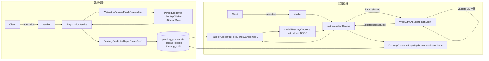
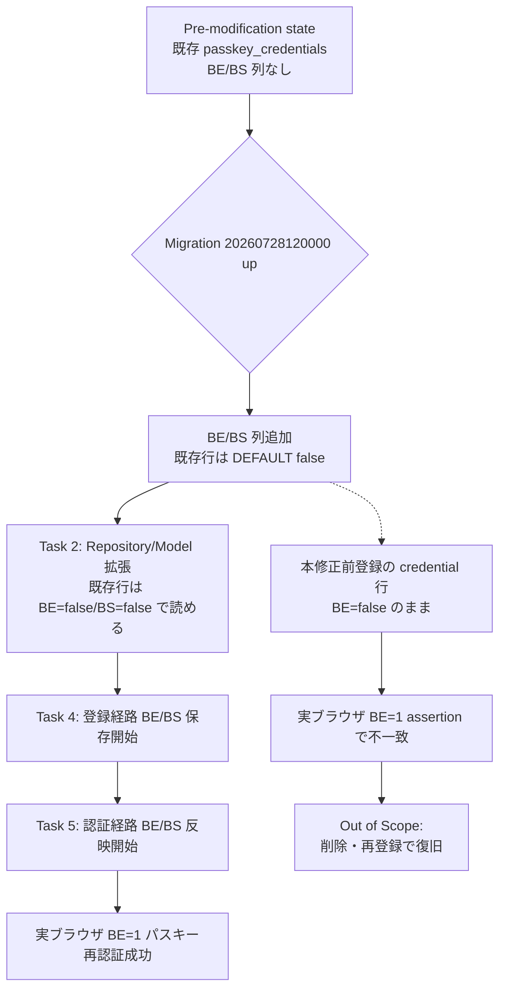

# Design Document

## Overview

**Purpose**: 本 spec は Feedman の Web パスキー再認証が「実ブラウザで登録された同期パスキー
（BackupEligible=1）で常に 400 失敗する」不具合を、credential backup 属性（BE/BS）の
永続化と認証時 lookup での復元によって修正する。修正後は同期パスキーおよびネイティブ経路の
どちらでも再認証が成立し、ユーザーがログイン継続できるようになる。

**Users**: 実ブラウザ（Chrome / Safari 等の同期パスキー生成環境）でパスキー登録を行った
エンドユーザー、および iOS ネイティブアプリでパスキー登録・認証を行うエンドユーザー。
運用者は本修正により regression の再発を CI で自動検知できるようになる。

**Impact**: 現在は `passkey_credentials` テーブルが credential backup 属性を保持しておらず、
認証時の credential 復元が常に BE=false / BS=false のゼロ値で `webauthn.Credential.Flags` を
組み立てるため、go-webauthn v0.17.4 の login validation
（`webauthn/login.go:371` の "Backup Eligible flag inconsistency detected"）に必ず不合致で
拒否される。本 spec は `passkey_credentials` に列 2 個を追加し、登録 → 保存 → lookup →
`webauthn.Credential.Flags` 復元の全経路を貫通させることで、上記 400 を解消する。

### Goals

- `passkey_credentials` テーブルに `backup_eligible` / `backup_state` 2 列を安全側の既定値
  （false）で追加し、後方互換を破らないマイグレーションで反映する
- 登録 ceremony（新規登録 / 追加登録）で attestation から得た BE/BS 属性を永続化する
- 認証 ceremony の lookup で保存済み BE/BS を `webauthn.Credential.Flags` に反映することで、
  go-webauthn の validate step 4（BE 一致判定）を通過させる
- 認証成功時に検証層から返される最新 BS を永続化更新する（BE は保存時の値を不変で保持）
- BE=1 assertion の regression を CI で検知するテストケースを追加し、既存 BE=0 synthetic E2E
  を破壊しない

### Non-Goals

- 本修正前に登録された既存 credential 行（BE/BS がゼロ値のまま保存された行）の backfill
  補完（staging データのみに限定されるため、削除・再登録で復旧する / Out of Scope 明示）
- go-webauthn v0.17.4 の library バージョンアップ（v0.17.4 前提を維持）
- credential backup 属性を運用者が閲覧・監査するための UI・API 追加
- ログアウト・アカウント設定導線に起因する既知の別 Issue

## Architecture

### Existing Architecture Analysis

- パスキーのレイヤ構造は既に確立している: `handler → passkey/{Registration,Authentication}Service
  → passkey/WebAuthnAdapter + repository.PasskeyCredentialRepository → model.PasskeyCredential`
  の一方向依存（CLAUDE.md §1 準拠）
- 認証・認可の判断は service 層に集約されている。handler / adapter は認可判断を持たない
- `repository.PostgresPasskeyCredentialRepo` は `Create` / `FindByCredentialID` / `ListByUserID` /
  `UpdateSignCount` / `DeleteByUserID(Exec)` を公開しており、`CreateExec` 経由の共有 tx 対応で
  `FinishRegistrationNew` の users + credentials の 1 tx 保存が Issue #230 で完了している
- WebAuthn library 呼び出しは `passkey.WebAuthnAdapter` interface で service 層から隔離済み。
  `ParsedCredential` は library の `webauthn.Credential` を最小情報に射影した DTO
- Registration finish は `credential_id` UNIQUE / `username_normalized` UNIQUE の race を
  `ErrCredentialAlreadyRegistered` / `ErrUsernameTaken` sentinel に正規化して uniform 拒否
  （Req 1.7）に倒す既存契約がある
- 既存 E2E `TestE2E_PasskeyFullFlow_DBBacked` は `virtualwebauthn.NewAuthenticator()`（既定
  BE=false / BS=false）で登録 → 認証を回しており、既定値のまま両者が一致するため現状 green

### 尊重すべき既存境界と維持すべき統合点

- **レイヤリング**: handler は SQL / 認可を持たない。service 層のみが認可を行い、repository は
  純粋な SQL 実行と domain 型スキャンに閉じる。本 spec の修正でもこの境界は破らない
- **WebAuthnAdapter 境界**: `webauthn.*` 型は adapter 内に閉じ込め、service 層には
  `ParsedCredential` / `WebAuthnUser` を通じてのみ露出する。BE/BS の伝搬もこの境界を守る
- **既存 tx 契約**: `FinishRegistrationNew` は users + credentials（+ optional session）を 1 tx
  で INSERT する（Issue #230 / #231）。BE/BS 列追加後も同じ tx 境界に閉じ、Req 1.5 の
  「credential 保存失敗時に user 行も残さない」を維持する
- **uniform 拒否契約**: 認証拒否は `ErrAuthenticationFailed` に正規化し内部理由を反射しない。
  BE 不一致（新規に発生し得るケース）も同一 sentinel でクライアントに返す

### 解消・回避する technical debt

- 既存 `PostgresPasskeyCredentialRepo` の `Create` / `FindByCredentialID` / `ListByUserID` の
  3 メソッドで **同一 SELECT 列並びをインライン展開** して scan している既存 pattern
  （`scanItem` / `itemSelectColumns` を再利用しない）に列 2 個を追加するため、本 spec でも
  scan ヘルパー抽出は行わず、既存インラインパターンを踏襲する（既存 debt は現状維持。scan
  ヘルパー抽出は別 refactor Issue として起票する）

### Architecture Pattern & Boundary Map

本修正は横断ではなく縦断（1 動線内の情報 propagation）の追加。既存レイヤ間の依存方向は
変更せず、各層が扱う値オブジェクトに 2 属性を追加する。



**Architecture Integration**:

- **採用パターン**: Ports & Adapters を既存構造そのまま踏襲。BE/BS 追加は「port の DTO に
  フィールド追加、実装は library 側から propagate、逆方向で lookup 時に stored → adapter へ」
  という Add-Field パターンで、レイヤの向き・責務は変わらない
- **ドメイン境界**: `model.PasskeyCredential` が「BE/BS を含む credential の canonical 表現」の
  所有権を持つ。adapter・repository・service は同じ 2 属性を素通しに扱う
- **既存パターンの維持**: 1-tx 保存（Issue #230 の RegistrationTx オーケストレーション）、
  uniform 拒否（`ErrAuthenticationFailed`）、interface segregation（最小 interface で受ける）、
  scan ヘルパーのインライン展開（既存 debt 維持）、challenge_id_prefix 8 文字ログ（NFR 2.3）
  はいずれも本修正で崩さない
- **新規コンポーネントの根拠**: 新規コンポーネントは追加しない。既存の 5 コンポーネント
  （migration / model / repository / adapter / 2 service）にフィールド 2 個 + メソッド 1 個
  （`UpdateAuthenticationState`）を追加するのみで実現できる

### Technology Stack

| Layer | Choice / Version | Role in Feature | Notes |
|-------|------------------|-----------------|-------|
| Frontend / CLI | 変更なし | — | Web / iOS クライアントは無変更（同じ登録 / 認証 API を叩く） |
| Backend / Services | Go 1.25, chi v5 | Registration / Authentication service に BE/BS 伝搬を追加 | 既存 service を最小 diff で拡張 |
| WebAuthn Library | `github.com/go-webauthn/webauthn` v0.17.4 | credential 検証（v0.17.4 の `webauthn/login.go:371` BE 一致判定を通す） | 本 spec ではバージョン固定 |
| Data / Storage | PostgreSQL 16, `lib/pq` | `passkey_credentials` に BOOLEAN 列 2 個追加 | `NOT NULL DEFAULT false` で後方互換 |
| Migrations | `golang-migrate` | `20260728120000_add_passkey_credential_backup_flags.{up,down}.sql` を追加 | 既存命名規約 `YYYYMMDDHHMMSS_<slug>.up/down.sql` |
| Testing | 標準 `testing`, `descope/virtualwebauthn` v1.0.5 | BE=1 / BE=0 双方の synthetic authenticator を用いた regression | test-only 依存（`authenticator.Options.BackupEligible=true` で BE=1 を再現可能） |
| Messaging / Events | 変更なし | — | 非同期 event 発火は無関係 |
| Infrastructure / Runtime | Docker / docker-compose | 変更なし | migration は既存 wiring から自動適用 |

## File Structure Plan

### Directory Structure

```
internal/
├── database/migrations/
│   ├── 20260728120000_add_passkey_credential_backup_flags.up.sql   # 新規: BOOLEAN 2 列追加
│   └── 20260728120000_add_passkey_credential_backup_flags.down.sql # 新規: DROP COLUMN
├── model/
│   └── passkey.go                                                   # 修正: BackupEligible, BackupState 追加
├── repository/
│   ├── interfaces.go                                                # 修正: UpdateAuthenticationState 追加 / UpdateSignCount 除去
│   ├── postgres_passkey_credential_repo.go                          # 修正: INSERT/SELECT 列拡張 + 更新メソッド差し替え
│   └── postgres_passkey_credential_repo_db_test.go                  # 修正: BE/BS round-trip + UpdateAuthenticationState + Case 8 want map 更新
├── passkey/
│   ├── webauthn_adapter.go                                          # 修正: ParsedCredential 拡張 / toParsedCredential / FinishLogin 戻り値追加
│   ├── webauthn_adapter_test.go                                     # 修正: BE=1 authenticator round-trip + updatedBackupState 検証
│   ├── registration_service.go                                      # 修正: FinishRegistrationNew / FinishAddCredential で BE/BS 保存
│   ├── registration_service_test.go                                 # 修正: stub adapter 経由で BE=true 保存を検証
│   ├── authentication_service.go                                    # 修正: lookup で Flags 反映 / UpdateAuthenticationState 呼び出し
│   └── authentication_service_test.go                               # 修正: stubCredentialReader を新 method 対応 / lookup Flags 反映検証
└── handler/
    └── passkey_e2e_db_test.go                                       # 修正: BE=1 subtest 追加（Req 5.1 regression） / BE=0 baseline は無変更
```

### Modified Files

- `internal/database/migrations/20260728120000_add_passkey_credential_backup_flags.up.sql` — 新規作成。
  `ALTER TABLE passkey_credentials ADD COLUMN backup_eligible BOOLEAN NOT NULL DEFAULT false` および
  `backup_state` の同型追加。既存列の削除・型変更・rename は行わない（NFR 1.1）
- `internal/database/migrations/20260728120000_add_passkey_credential_backup_flags.down.sql` — 新規作成。
  `ALTER TABLE passkey_credentials DROP COLUMN IF EXISTS backup_state, DROP COLUMN IF EXISTS backup_eligible`
- `internal/model/passkey.go` — `PasskeyCredential` に `BackupEligible bool` / `BackupState bool` を追加。
  既存フィールドの並びは変更しない
- `internal/repository/interfaces.go` — `PasskeyCredentialRepository` から
  `UpdateSignCount(id, signCount, lastUsedAt) error` を除去し、
  `UpdateAuthenticationState(id, signCount, backupState, lastUsedAt) error` を追加。
  Doc comment に「BE は保存時の値を不変で保持し、認証成功時に更新しない（Req 4.3）」旨を明記
- `internal/repository/postgres_passkey_credential_repo.go` — 3 経路（`CreateExec` / `FindByCredentialID`
  / `ListByUserID`）の SQL 列並びに `backup_eligible, backup_state` を追加。scan ヘルパーは
  抽出せず既存インラインパターンを踏襲。`UpdateSignCount` を `UpdateAuthenticationState` に置き換え
- `internal/repository/postgres_passkey_credential_repo_db_test.go` — Case 8 の `want` map に
  `backup_eligible` / `backup_state` を追加。round-trip 検証と `UpdateAuthenticationState` の
  DB 反映テストを追加
- `internal/passkey/webauthn_adapter.go` — `ParsedCredential` に BE/BS 追加、`toParsedCredential`
  で `cred.Flags.BackupEligible` / `cred.Flags.BackupState` を反映。`FinishLogin` の戻り値に
  `updatedBackupState bool` を追加（`updatedSignCount` の後・`err` の前）。interface / impl / doc
  を同時に更新
- `internal/passkey/webauthn_adapter_test.go` — BE=1 authenticator（`authenticator.Options.BackupEligible=true`）
  での round-trip テスト追加、および `FinishLogin` の新戻り値検証
- `internal/passkey/registration_service.go` — `FinishRegistrationNew` と `FinishAddCredential` で
  `model.PasskeyCredential` 生成時に `BackupEligible: parsed.BackupEligible` /
  `BackupState: parsed.BackupState` を反映
- `internal/passkey/registration_service_test.go` — stub adapter が `ParsedCredential` に
  BE/BS=true を詰めて返した際に、`PasskeyCredentialWriter.Create`（および `CreateExec`）が
  受け取る `*model.PasskeyCredential` の BE/BS が true になることを検証
- `internal/passkey/authentication_service.go` — `lookup` closure 内で `webauthn.Credential.Flags`
  に `webauthn.CredentialFlags{BackupEligible: cred.BackupEligible, BackupState: cred.BackupState}`
  を反映。`FinishLogin` の新戻り値 `updatedBackupState` を受け取り、
  `credentials.UpdateAuthenticationState(ctx, resolvedCred.ID, updatedSignCount, updatedBackupState, s.now())`
  で保存する（BE は渡さない = Req 4.3）
- `internal/passkey/authentication_service_test.go` — `stubCredentialReader` の method を
  `UpdateAuthenticationState` に切替。lookup closure が返す `webauthn.Credential` の
  `Flags.BackupEligible` / `Flags.BackupState` が stored 値を反映することを spy 経由で検証。
  `updatedBackupState=true` が UpdateAuthenticationState まで伝搬することを検証
- `internal/handler/passkey_e2e_db_test.go` — BE=1 assertion を扱う subtest / 関数を追加
  （`authenticator.Options.BackupEligible = true` + `authenticator.Options.BackupState = true`
  を先に設定してから登録 → 認証を回す）。既存 `TestE2E_PasskeyFullFlow_DBBacked` は無変更で
  引き続き green（BE=0 baseline / Req 5.4）

## Requirements Traceability

| Requirement | Summary | Components | Interfaces | Flows |
|-------------|---------|------------|------------|-------|
| 1.1 | 未認証新規登録時に BE/BS 保存 | RegistrationService, WebAuthnAdapter, PasskeyCredentialRepo | `ParsedCredential.{BackupEligible,BackupState}`, `PasskeyCredential.{BackupEligible,BackupState}` | 登録 finish → parsed.BE/BS → CreateExec |
| 1.2 | 認証済み追加登録時に BE/BS 保存 | RegistrationService, WebAuthnAdapter, PasskeyCredentialRepo | 同上 | 追加登録 finish → parsed.BE/BS → Create |
| 1.3 | BE=1/BS=1 authenticator → true 保存 | RegistrationService | 同上 | parsed.BE=true → cred.BE=true 保存 |
| 1.4 | BE=0/BS=0 authenticator → false 保存 | RegistrationService | 同上 | parsed.BE=false → cred.BE=false 保存 |
| 1.5 | credential 保存失敗 → user も残さない | RegistrationService, RegistrationTx | 既存 `RegistrationTx.Commit/Rollback` | 既存 1-tx 契約を継承（新規失敗経路は増やさない） |
| 2.1 | lookup で保存済み BE/BS を復元 | AuthenticationService, PasskeyCredentialRepo | `PasskeyCredential.{BackupEligible,BackupState}` → `webauthn.CredentialFlags` | Find → lookup closure が Flags 反映 |
| 2.2 | 保存 BE/BS=true → BE=1/BS=1 提示 | AuthenticationService | `webauthn.Credential.Flags` | Flags.BackupEligible=true 提示 |
| 2.3 | 保存 BE/BS=false → BE=0/BS=0 提示 | AuthenticationService | 同上 | Flags.BackupEligible=false 提示 |
| 2.4 | 未存在 credential は uniform 拒否 | AuthenticationService, WebAuthnAdapter | 既存 `ErrAuthenticationFailed` | 既存契約を維持 |
| 3.1 | 実ブラウザ BE=1 の Web 経路成功 | 全経路 | 既存 API 契約 | E2E BE=1 テストで縦断検証 |
| 3.2 | 実ブラウザ BE=1 のネイティブ経路成功 | 全経路 | 既存 API 契約 | 同一 lookup を共有するため 3.1 と同じ修正で成立 |
| 3.3 | BE=0 synthetic 登録・認証成功維持 | 全経路 | 既存 API 契約 | 既存 E2E `TestE2E_PasskeyFullFlow_DBBacked` |
| 3.4 | BE 不一致 → uniform 拒否 | AuthenticationService, WebAuthnAdapter | `ErrAuthenticationFailed` | library の BE 一致判定 → adapter が sentinel 正規化 |
| 3.5 | 拒否時に平文を出さない | AuthenticationService, WebAuthnAdapter | 既存 `logRejection` / challenge_id_prefix | 既存 log 契約を維持 |
| 4.1 | sign_count / last_used_at 更新継続 | AuthenticationService, PasskeyCredentialRepo | `UpdateAuthenticationState` | 従来の UpdateSignCount と同じ列を含む |
| 4.2 | 認証時に BS を最新化 | AuthenticationService, WebAuthnAdapter, PasskeyCredentialRepo | `FinishLogin.updatedBackupState`, `UpdateAuthenticationState.backupState` | library 返却値 → repo UPDATE |
| 4.3 | 認証時に BE を上書きしない | AuthenticationService, PasskeyCredentialRepo | `UpdateAuthenticationState` は BE を引数に取らない | UPDATE 文が backup_eligible を含まない |
| 5.1 | BE=1 stored + BE=1 assertion 成功テスト | 全経路 | — | E2E 新 subtest（虚仮 authenticator BE=1） |
| 5.2 | BE=0 stored + BE=0 assertion 成功テスト | 全経路 | — | 既存 E2E を BE=0 baseline として維持 |
| 5.3 | 保存 BE と assertion BE の不一致で uniform 拒否テスト | AuthenticationService, WebAuthnAdapter | `ErrAuthenticationFailed` | adapter 単体 or 統合テストで検証 |
| 5.4 | 既存 synthetic E2E green 維持 | 全経路 | 既存 API 契約 | `TestE2E_PasskeyFullFlow_DBBacked` 無変更 |
| NFR 1.1 | 列追加のみ / 削除・rename しない | Migration | `.up.sql` / `.down.sql` | ALTER TABLE ADD COLUMN のみ |
| NFR 1.2 | 追加列の既定値は安全側 (false) | Migration | 同上 | `NOT NULL DEFAULT false` |
| NFR 1.3 | 旧 credential 行を読んでも異常終了しない | AuthenticationService, PasskeyCredentialRepo | scan が BOOLEAN 直値で受ける | DEFAULT false により旧行も false で読める |
| NFR 2.1 | BE/BS 生値・raw authenticatorData をログ・エラーに出さない | 全 service | 既存 `logRejection` 契約 | boolean 以外の中間表現をログに出さない |
| NFR 2.2 | 認証失敗時の内部理由を HTTP レスポンス本文に反射しない | AuthenticationService | 既存 uniform 拒否契約 | `ErrAuthenticationFailed` sentinel |
| NFR 2.3 | 認証拒否時 challenge_id は先頭 8 文字のみ | AuthenticationService | 既存 `shortID` helper | 既存規約を維持 |

## Components and Interfaces

### Persistence Layer

#### passkey_credentials Migration

| Field | Detail |
|-------|--------|
| Intent | credential backup 属性（BE/BS）を永続化するための列追加 |
| Requirements | NFR 1.1, NFR 1.2, NFR 1.3, 1.1〜1.4 の物理的裏付け |

**Responsibilities & Constraints**

- 追加は 2 列（`backup_eligible BOOLEAN NOT NULL DEFAULT false` /
  `backup_state BOOLEAN NOT NULL DEFAULT false`）のみ
- 既存列（id / user_id / credential_id / public_key / sign_count / attestation_type / aaguid /
  transports / created_at / last_used_at）の削除・型変更・rename は禁止（NFR 1.1）
- 既存行には自動的に既定値 false が入る（NFR 1.3 の「読み出しで異常終了しない」を DB 側で担保）
- 追加インデックスは張らない（BE/BS は WHERE 句で使わないため）
- down 側は 2 列を `DROP COLUMN IF EXISTS` で撤去。既存データを不変で復元する

**Dependencies**

- Inbound: `internal/database.RunMigrations`（既存 wiring / Critical）
- Outbound: PostgreSQL 16（Critical）
- External: `golang-migrate`（Critical）

**Contracts**: State [x]

##### Schema Delta

```sql
-- up
ALTER TABLE passkey_credentials
    ADD COLUMN backup_eligible BOOLEAN NOT NULL DEFAULT false,
    ADD COLUMN backup_state    BOOLEAN NOT NULL DEFAULT false;

-- down
ALTER TABLE passkey_credentials
    DROP COLUMN IF EXISTS backup_state,
    DROP COLUMN IF EXISTS backup_eligible;
```

### Domain Model

#### model.PasskeyCredential（拡張）

| Field | Detail |
|-------|--------|
| Intent | credential の canonical ドメイン表現に BE/BS を含める |
| Requirements | 1.1〜1.4, 2.1〜2.3, 4.2, 4.3 |

**Responsibilities & Constraints**

- 既存フィールド（ID / UserID / CredentialID / PublicKey / SignCount / AttestationType /
  AAGUID / Transports / CreatedAt / LastUsedAt）は無変更
- 新規に `BackupEligible bool` / `BackupState bool` を追加。ゼロ値は false（DB 既定と一致）
- Doc comment には Req 4.3 の「BE は初回登録時の値を不変で保持する」旨を明記する
  （Reviewer が本 spec の意図を読み取れるように）

**Contracts**: State [x]

##### Struct Delta（疑似コード）

```go
type PasskeyCredential struct {
    // ... 既存フィールド ...

    // BackupEligible は WebAuthn CredentialFlags.BackupEligible の永続化値。
    // 登録時に authenticator が報告した値を保存し、認証時の flag 一致判定に用いる。
    // Req 4.3: 認証成功時に上書き更新しない（初回登録時の値を不変で保持する）。
    BackupEligible bool

    // BackupState は WebAuthn CredentialFlags.BackupState の永続化値。
    // 登録時に authenticator が報告した値を保存し、認証成功時には検証層から
    // 返却される最新値へ更新する（Req 4.2）。
    BackupState bool
}
```

### Repository Layer

#### PasskeyCredentialRepository（interface 拡張）

| Field | Detail |
|-------|--------|
| Intent | 新規列を永続化・復元し、認証成功時の状態更新経路を Req 4.2 / 4.3 の契約通りに一本化する |
| Requirements | 1.1〜1.4, 2.1〜2.3, 4.1, 4.2, 4.3, NFR 1.1, NFR 1.2, NFR 1.3 |

**Responsibilities & Constraints**

- `Create` / `CreateExec` / `FindByCredentialID` / `ListByUserID` の SQL 列並びに
  `backup_eligible, backup_state` を追加する
- `UpdateSignCount(ctx, id, signCount, lastUsedAt)` を **除去** し、後継として
  `UpdateAuthenticationState(ctx, id, signCount, backupState, lastUsedAt)` を追加する
  （呼び出し元は AuthenticationService のみのため boundary の副次影響は最小）
- `UpdateAuthenticationState` は `sign_count` / `backup_state` / `last_used_at` の 3 列のみを
  UPDATE し、`backup_eligible` を UPDATE 対象に含めない（Req 4.3 を SQL レベルで保証）
- エラーメッセージには credential_id / public_key / user_id 等の機密値を含めない（NFR 1.2 継承）
- scan ヘルパー抽出は本 spec で行わない（既存 debt を新たに悪化させない範囲でインライン踏襲）

**Dependencies**

- Inbound: `passkey.AuthenticationService` / `passkey.RegistrationService`（Critical）
- Outbound: PostgreSQL / `database/sql` / `lib/pq`（Critical）
- External: なし

**Contracts**: Service [x], State [x]

##### Interface Delta（疑似コード）

```go
type PasskeyCredentialRepository interface {
    Create(ctx context.Context, c *model.PasskeyCredential) error
    FindByCredentialID(ctx context.Context, credentialID []byte) (*model.PasskeyCredential, error)
    ListByUserID(ctx context.Context, userID string) ([]*model.PasskeyCredential, error)

    // 除去: UpdateSignCount(ctx, id, signCount, lastUsedAt) error

    // 新規: 認証成功時の 3 列 (sign_count / backup_state / last_used_at) を更新する。
    // backup_eligible は引数に取らず SQL の SET 句にも含めない（Req 4.3）。
    UpdateAuthenticationState(
        ctx context.Context,
        id string,
        signCount uint32,
        backupState bool,
        lastUsedAt time.Time,
    ) error

    DeleteByUserID(ctx context.Context, userID string) error
    DeleteByUserIDExec(ctx context.Context, q DBTX, userID string) error
}
```

##### PostgresPasskeyCredentialRepo SQL 差分

- **INSERT** (`CreateExec` 内): 列並びに `backup_eligible, backup_state` を追加、`VALUES` に
  対応するプレースホルダを追加、Go 側からは `c.BackupEligible, c.BackupState` を渡す
- **SELECT** (`FindByCredentialID` / `ListByUserID`): 列並びに 2 列を追加、Scan の receiver に
  対応する `*bool` を渡し、`c.BackupEligible` / `c.BackupState` に反映
- **UPDATE** (`UpdateAuthenticationState`):
  `UPDATE passkey_credentials SET sign_count = $2, backup_state = $3, last_used_at = $4 WHERE id = $1`

**Preconditions**

- 呼び出し側は `id` として credential PK（`passkey_credentials.id`）を渡す（credential_id ではない）
- `signCount` は library `Authenticator.SignCount`、`backupState` は library `Flags.BackupState`
  の直後の観測値

**Postconditions**

- 0 rows でもエラーにしない（既存 `UpdateSignCount` と同流儀。呼び出し側が存在確認済み前提）
- `backup_eligible` 列は本メソッドで一切変更されない

**Invariants**

- `backup_eligible` は登録時に一度保存された値を、以降 authentication 経路では変更しない
  （Req 4.3）。DELETE / re-CREATE 経由の変更は該当外

### WebAuthn Adapter

#### passkey.WebAuthnAdapter / GoWebAuthnAdapter（拡張）

| Field | Detail |
|-------|--------|
| Intent | library 型 (`webauthn.Credential.Flags`) と service 層 DTO (`ParsedCredential`) の間で BE/BS を双方向に伝搬する |
| Requirements | 1.1〜1.4, 2.1〜2.3, 3.4, 4.2, NFR 2.1 |

**Responsibilities & Constraints**

- `ParsedCredential` に `BackupEligible bool` / `BackupState bool` を追加
- `toParsedCredential` で `cred.Flags.BackupEligible` / `cred.Flags.BackupState` を propagate
- `FinishLogin` の返り値に `updatedBackupState bool` を追加。位置は
  `(userHandle, credentialID, updatedSignCount, updatedBackupState, err)`
  （既存の `updatedSignCount` の直後、`err` の直前）
- go-webauthn v0.17.4 の `webauthn/login.go:371-373` の BE 一致判定は adapter 層では手を加えず、
  library に任せる。BE 不一致は `ValidateDiscoverableLogin` が error を返すため、既存の
  `ErrAuthenticationFailed` 正規化ロジックがそのまま適用される（Req 3.4）
- 平文 assertion / requestBody / attestation blob / sessionData をログ・エラーに出さない
  （NFR 2.1 / 既存契約継承）
- interface / impl / stub / test を同一タスクで整合させる（`FinishLogin` の signature
  変更は compile-breaking のため、必ず同一 commit で完結させる）

**Dependencies**

- Inbound: `passkey.RegistrationService` / `passkey.AuthenticationService`（Critical）
- Outbound: `github.com/go-webauthn/webauthn` v0.17.4（Critical）
- External: なし

**Contracts**: Service [x]

##### Interface Delta（疑似コード）

```go
type ParsedCredential struct {
    ID              []byte
    PublicKey       []byte
    SignCount       uint32
    AttestationType string
    AAGUID          []byte
    Transports      []string
    BackupEligible  bool // 新規: WebAuthn CredentialFlags.BackupEligible
    BackupState     bool // 新規: WebAuthn CredentialFlags.BackupState
}

type WebAuthnAdapter interface {
    BeginRegistration(user WebAuthnUser, excludeCredentials [][]byte) (
        options []byte, sessionData []byte, rawChallenge []byte, err error,
    )
    FinishRegistration(user WebAuthnUser, sessionData []byte, requestBody []byte) (
        *ParsedCredential, error,
    )
    BeginLogin() (options []byte, sessionData []byte, rawChallenge []byte, err error)

    // 変更: 戻り値に updatedBackupState bool を追加。
    // 位置は updatedSignCount の直後・err の直前で、既存 3 値のセマンティクスは無変更。
    FinishLogin(sessionData []byte, requestBody []byte,
        credentialLookup func(credentialID []byte) (WebAuthnUser, *ParsedCredential, error),
    ) (
        userHandle []byte,
        credentialID []byte,
        updatedSignCount uint32,
        updatedBackupState bool,
        err error,
    )
}
```

**Preconditions**

- `FinishLogin` は `ValidateDiscoverableLogin` 成功後に `cred.Flags.BackupState`（library が
  assertion から `NewCredentialFlags(...)` 経由で更新した値）を `updatedBackupState` に代入する
- `credentialLookup` の返す `WebAuthnUser.WebAuthnCredentials()` が返す `webauthn.Credential.Flags`
  は service 層で stored BE/BS を反映させる責務（本 interface では要求のみ、実装は service 側）

**Postconditions**

- BE=0 のケースでは `updatedBackupState=false` のまま（library が assertion 側の BS を反映するが、
  BE=0 で BS=1 は library が invalid combo として reject するため、safe）

### Registration Service

#### passkey.RegistrationService.FinishRegistrationNew / FinishAddCredential（拡張）

| Field | Detail |
|-------|--------|
| Intent | 登録時に adapter から得た BE/BS を永続化する |
| Requirements | 1.1, 1.2, 1.3, 1.4, 1.5, NFR 2.1 |

**Responsibilities & Constraints**

- `model.PasskeyCredential{...}` リテラル 2 箇所（`FinishRegistrationNew` / `FinishAddCredential`）に
  `BackupEligible: parsed.BackupEligible` / `BackupState: parsed.BackupState` を追加
- 既存 1-tx オーケストレーション（`RegistrationTxBeginner` + `CreateUserOnlyExec` +
  `CreateExec` + optional `sessions.CreateExec`）は変更しない。BE/BS 保存失敗経路は
  DB 側の NOT NULL DEFAULT により発生し得ないため、Req 1.5 は既存 tx 契約でカバーされる
- BE/BS の生値・raw authenticatorData をログ・エラーに出さない（NFR 2.1）
- 追加登録経路（`FinishAddCredential`）は既存の credential 単体 INSERT のまま。BE/BS の
  追加が失敗しても user 行は既存なので Req 1.5 の user 保護対象は新規登録のみ

**Dependencies**

- Inbound: `handler.PasskeyRegistrationHandler`（Critical）
- Outbound: `passkey.WebAuthnAdapter.FinishRegistration`, `PasskeyCredentialWriter.CreateExec` /
  `Create`（Critical）
- External: なし

**Contracts**: Service [x]

##### Service Delta（疑似コード）

```go
// FinishRegistrationNew / FinishAddCredential 内、cred リテラル生成に 2 行追加:
cred := &model.PasskeyCredential{
    UserID:          newUser.ID,          // 追加登録では u.ID
    CredentialID:    parsed.ID,
    PublicKey:       parsed.PublicKey,
    SignCount:       parsed.SignCount,
    AttestationType: parsed.AttestationType,
    AAGUID:          parsed.AAGUID,
    Transports:      parsed.Transports,
    BackupEligible:  parsed.BackupEligible, // 追加 (Req 1.1, 1.2, 1.3, 1.4)
    BackupState:     parsed.BackupState,    // 追加 (同上)
}
```

### Authentication Service

#### passkey.AuthenticationService.FinishAuthentication（拡張）

| Field | Detail |
|-------|--------|
| Intent | lookup で stored BE/BS を webauthn.Credential.Flags に反映し、成功時に BS を最新化する |
| Requirements | 2.1, 2.2, 2.3, 2.4, 3.4, 3.5, 4.1, 4.2, 4.3, 5.1, 5.2, 5.3, NFR 1.3, NFR 2.1, NFR 2.2, NFR 2.3 |

**Responsibilities & Constraints**

- `lookup` closure が組み立てる `webauthn.Credential` に、stored BE/BS を反映した
  `webauthn.CredentialFlags` を設定する:

  ```go
  wu := &authnUser{
      // ...
      creds: []webauthn.Credential{
          {
              ID:        cred.CredentialID,
              PublicKey: cred.PublicKey,
              Flags: webauthn.CredentialFlags{
                  BackupEligible: cred.BackupEligible, // 追加 (Req 2.1〜2.3)
                  BackupState:    cred.BackupState,    // 追加 (同上)
                  // UserPresent / UserVerified は login validation の BE 比較に影響しないため
                  // ゼロ値のままで良い（library は BE のみ比較する / login.go:371）
              },
              Authenticator: webauthn.Authenticator{
                  AAGUID:    cred.AAGUID,
                  SignCount: cred.SignCount,
              },
          },
      },
  }
  ```

- `FinishLogin` の新戻り値 `updatedBackupState` を受け取り、
  `credentials.UpdateAuthenticationState(ctx, resolvedCred.ID, updatedSignCount, updatedBackupState, s.now())`
  で保存する（BE を引数に取らない = Req 4.3 を interface レベルで保証）
- BE 不一致による library 拒否は既存の `ErrAuthenticationFailed` uniform 化経路に落ちるため
  追加ロジック不要（Req 3.4）
- 既存の `logRejection("... rejected: webauthn assertion", shortID(challengeID))` と
  challenge_id_prefix 8 文字ログは無変更（NFR 2.1 / 2.3）
- HTTP レスポンスへ「BE 不一致」等の内部理由は反射しない（NFR 2.2 / 既存契約継承）

**Dependencies**

- Inbound: `handler.PasskeyAuthenticationHandler`（Critical）
- Outbound: `PasskeyCredentialReader.FindByCredentialID` / `UpdateAuthenticationState`,
  `WebAuthnAdapter.FinishLogin`（Critical）
- External: `github.com/go-webauthn/webauthn` v0.17.4 の library 内部 BE 一致判定
  （login.go:371、v0.17.4 fixed / 本 spec バージョンアップ対象外）

**Contracts**: Service [x]

**Preconditions**

- lookup が成功した credential は必ず BE/BS を含む（DB DEFAULT false により旧行も NOT NULL）
- `FinishLogin` 成功時に `updatedBackupState` は library が assertion authenticatorData から
  取り出した最新値

**Postconditions**

- 成功時: DB 上の `backup_state` は `updatedBackupState` に更新される（Req 4.2）
- 成功時: DB 上の `backup_eligible` は不変（Req 4.3、SQL SET 句に含まれないため）
- 拒否時: DB は無変更、`ErrAuthenticationFailed` を返す（既存契約）

**Invariants**

- BE 不一致（stored BE ≠ assertion BE）は library の validate step で必ず拒否される。service
  層はこれを uniform 化して外部に反射しない

## Data Models

### Domain Model

- **Aggregate**: PasskeyCredential（1 credential = 1 aggregate。トランザクション境界は
  user + credential + optional session の同一 tx 内 INSERT を含む / Issue #230, #231）
- **Value Objects**: `webauthn.CredentialFlags`（library 型を service 層に閉じ込めるため、
  service 層では触らず adapter 内でのみ扱う）
- **Domain Events**: 本 spec で新規発火は無し（既存の `passkey authentication succeeded` /
  拒否ログは維持）

### Physical Data Model

`passkey_credentials` テーブル（本修正後）:

| Column | Type | Nullable | Default | 目的 |
|---|---|---|---|---|
| id | UUID | NOT NULL | `gen_random_uuid()` | PK |
| user_id | UUID | NOT NULL | — | users(id) FK CASCADE |
| credential_id | BYTEA | NOT NULL UNIQUE | — | WebAuthn credential ID |
| public_key | BYTEA | NOT NULL | — | COSE-encoded 公開鍵 |
| sign_count | BIGINT | NOT NULL | 0 | counter |
| attestation_type | VARCHAR(32) | NOT NULL | '' | "none" / "packed" 等 |
| aaguid | BYTEA | NULL | — | authenticator 識別子 |
| transports | VARCHAR(255) | NOT NULL | '' | "internal" / "usb" 等 |
| created_at | TIMESTAMPTZ | NOT NULL | `now()` | 登録時刻 |
| last_used_at | TIMESTAMPTZ | NULL | — | 最終ログイン時刻 |
| **backup_eligible** | **BOOLEAN** | **NOT NULL** | **false** | **新規: CredentialFlags.BackupEligible** |
| **backup_state** | **BOOLEAN** | **NOT NULL** | **false** | **新規: CredentialFlags.BackupState** |

- 既存 index（`idx_passkey_credentials_user_id`）は無変更。BE/BS 用 index は追加しない
- 保存対象は WebAuthn credential 検証情報のみ（NFR 1.1 / 既存 spec Case 8 の regression と整合）

## Error Handling

### Error Strategy

本 spec は新しいエラー分岐を導入せず、既存の uniform 拒否契約に沿って BE 関連の失敗を
すべて `ErrAuthenticationFailed` / `ErrRegistrationFailed` に正規化する。

### Error Categories and Responses

- **User Errors (4xx)**:
  - **BE 不一致による認証拒否 → 400 AUTHENTICATION_FAILED (uniform)**: library が validate step で
    拒否 → adapter が `ErrAuthenticationFailed` に正規化 → service が uniform 拒否として handler
    に返す → handler は既存契約通り 400 を返す。クライアント側には「BE 不一致」等の内部理由を
    反射しない（NFR 2.2）
  - **未存在 credential lookup → uniform 拒否**: 既存契約（Req 2.4）を維持
- **System Errors (5xx)**:
  - **DB エラー（INSERT / SELECT / UPDATE）**: 既存の `fmt.Errorf("... : %w", err)` wrap を
    そのまま踏襲。メッセージには credential_id / public_key / BE/BS 生値を含めない（NFR 2.1）
  - **Migration 失敗**: `internal/database.RunMigrations` の既存 error 経路（アプリケーション
    起動失敗として扱う）を踏襲
- **Business Logic Errors (422)**: 本 spec では該当なし（BE 関連はすべて 400 uniform 拒否経路）

### 拒否ログ規約（NFR 2.1 / 2.3）

- BE/BS の boolean 以外の中間表現・raw authenticatorData をログ・エラーに含めない
- 認証拒否時は既存の `slog.Warn("passkey authentication finish rejected: webauthn assertion",
  slog.String("challenge_id_prefix", shortID(challengeID)))` パターンを踏襲。BE 不一致で
  発生した拒否も同一の msg / 属性のみを載せる（内部理由を追加しない）

## Testing Strategy

### Unit Tests（各 3〜5 項目）

- **Repository**: BE=true / BS=true を含む `Create` → `FindByCredentialID` の round-trip で
  値が同値復元される（DB backed）
- **Repository**: `UpdateAuthenticationState(id, signCount, true, now)` 後に `FindByCredentialID`
  で `SignCount` / `BackupState` / `LastUsedAt` が反映され、`BackupEligible` は不変であること
  （DB backed）
- **Repository**: information_schema Case 8 の期待列に `backup_eligible` / `backup_state` を
  追加した regression（NFR 1.1）
- **Adapter**: BE=1 authenticator（`virtualwebauthn.Options.BackupEligible=true`）で
  `FinishRegistration` の結果が `parsed.BackupEligible=true` を持つ
- **Adapter**: `FinishLogin` の戻り値 `updatedBackupState` が library `cred.Flags.BackupState`
  の値と一致する（BE=1 / BS=1 authenticator）
- **RegistrationService**: stub adapter が `ParsedCredential{BE=true, BS=true}` を返した際、
  `PasskeyCredentialWriter.CreateExec` に渡る `*model.PasskeyCredential` の BE/BS が true
- **AuthenticationService**: lookup closure が組み立てる `webauthn.Credential.Flags.BackupEligible`
  / `BackupState` が stored 値を反映する（spy 経由で `stubAuthnAdapter.finishLoginFn` 内で捕捉）
- **AuthenticationService**: `FinishLogin` が `updatedBackupState=true` を返した際に
  `UpdateAuthenticationState` に `backupState=true` が渡される（BE は引数に含まれない）

### Integration Tests（3〜5 項目）

- **Adapter + Library**: `virtualwebauthn` で BE=1 authenticator を作り、
  `BeginRegistration → FinishRegistration → BeginLogin → FinishLogin` の round-trip が
  green（BE 一致で成功）
- **Adapter + Library**: BE=1 authenticator の attestation を保存後、BE=0 assertion を投げると
  `ErrAuthenticationFailed`（library の BE 一致判定に落ちる）
- **Adapter + Library**: BE=0 authenticator（既存 default）でも round-trip が引き続き green
  （BE=0 baseline / Req 5.2）

### E2E / UI Tests（3〜5 項目）

- **E2E (BE=1)**: `TestE2E_PasskeyFullFlow_DBBacked_BackupEligible`（新規）—
  `authenticator.Options.BackupEligible=true` + `BackupState=true` で登録 → 認証 → auth_code 発行 →
  token 交換までを real service / real repo で通す（Req 3.1, 3.2, 5.1）
- **E2E (BE=0 baseline)**: 既存 `TestE2E_PasskeyFullFlow_DBBacked` が本修正後も無変更で green
  （Req 3.3, 5.4）
- **E2E (uniform reject)**: BE=1 で登録した credential に対し BE=0 assertion（別 authenticator）を
  提示すると 400 uniform 拒否となる（Req 3.4, 5.3。オプション: 実装コストが高い場合は Adapter +
  Library の integration test で代替）

### Performance / Load

- 本 spec は BOOLEAN 列 2 個追加のみ。INSERT / SELECT のパフォーマンスに実質的影響なし。
  負荷試験は追加しない

## Migration Strategy

### 適用フロー



### 適用戦略

1. **列追加 migration の unlock**: `ALTER TABLE ADD COLUMN ... NOT NULL DEFAULT false` は
   PostgreSQL 11+ で即時完了（既存行は system catalog レベルで default を保持し全行 rewrite 無し）。
   long-running lock の懸念なし
2. **旧行の扱い**: 本修正前に登録された credential 行は自動的に `backup_eligible=false /
   backup_state=false` として読み出される。BE=1 の実ブラウザで再認証すると library の BE 一致
   判定で不合致となり拒否されるが、これは Out of Scope の通り「削除・再登録で復旧」する運用
   （staging データのみに限定される前提 / NFR 1.3）
3. **backfill を行わない理由**: 実 authenticator の BE/BS 属性はサーバ側では復元不能（登録時の
   attestation にしか含まれない）。推測 backfill（全行 BE=true 決め打ち等）は WebAuthn spec 上
   invalid combination を発生させ得るため、明示的に禁止する
4. **rollback**: down migration で 2 列を DROP。BE 対応 code は列不在時にコンパイル・実行に
   失敗するため、rollback は「code のロールバック → migration のロールバック」の順で行う運用
   （既存 down migration と同流儀 / operator ドキュメントには追加記述不要）
5. **既存 E2E への影響**: `TestE2E_PasskeyFullFlow_DBBacked` は BE=0 baseline のため、migration
   適用後も stored BE=false（新規登録も既定 false）+ assertion BE=false で library 判定を
   通過し、green を維持する（Req 5.4）

## Security Considerations

- **生値ログ禁止（NFR 2.1 継承）**: BE/BS は boolean 型のためログ出力自体が機密性を持たないが、
  raw authenticatorData / 平文 assertion / attestation blob は既存契約通りログ・エラーに
  出さない。本 spec で新たな生値露出経路を作らない
- **uniform 拒否（NFR 2.2 継承）**: BE 不一致による拒否も既存の `ErrAuthenticationFailed`
  sentinel に正規化し、HTTP レスポンス本文には内部理由を反射しない
- **challenge_id_prefix 8 文字（NFR 2.3 継承）**: 拒否ログの `challenge_id_prefix` は既存
  `shortID(challengeID)` helper で 8 文字にトリムする既存規約を維持
- **credential 属性の耐タンパー性**: BE/BS 列は登録時に authenticator が報告した値をそのまま
  保存する。攻撃者が BE 値を上書きするための外部 API は追加しない（Non-Goals 参照）
- **BE を認証時に上書きしない（Req 4.3）**: SQL SET 句が `backup_eligible` を含まないため、
  たとえ将来 code 側で誤って渡そうとしても DB に到達しない構造で担保する

## Supporting References

- go-webauthn v0.17.4 login validation の BE 一致判定:
  `webauthn/login.go:371` "Backup Eligible flag inconsistency detected during login validation"
  および直後の invalid combination 判定（!BE && BS）は本 spec の library 前提として動作する
  （バージョンアップは Non-Goals）
- W3C WebAuthn Level 3 §6.1 Authenticator Data flags（BE bit 3, BS bit 4）—
  `<https://www.w3.org/TR/webauthn-3/#authdata-flags>`
- 既存関連 Issue: #216（passkey initial impl）/ #230（1-tx 化）/ #231（Web 直接 session）—
  本 spec は #230 の tx 契約を継承し、BE/BS の追加による失敗経路を tx で覆う
