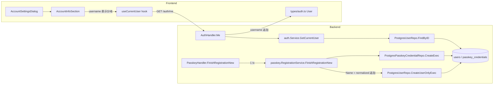

# Design Document

## Overview

**Purpose**: パスキー（WebAuthn）で新規登録したユーザーが、自分の指定した ID
（username）を画面上でも API 応答でも確認できるようにする不具合修正である。現状は
`users.username` / `users.username_normalized` を保存する一方で `users.name` を空のまま
とし、`GET /auth/me` にも username フィールドが無いため、アカウント設定ダイアログ
（#236）で「表示名は空 / email 未設定」となり、ログイン中のアカウントを識別できない。
本改修は **後方互換を厳格に保ちながら** 3 箇所（登録 finish の name 初期化 / API 応答フィールド
追加 / UI 表示追加）を最小差分で修正する。

**Users**: パスキーで新規登録した Web ユーザー（本修正後に登録される新規ユーザーが直接的
受益者）と、既存のパスキー / Google 由来ユーザー（後方互換が担保される受益者）が、アカウント
設定ダイアログを開いて自分のログイン主体を目視確認する動線で利用する。

**Impact**: 現在の「パスキー新規登録では users 行の name が空文字のまま作成され、`/auth/me`
は username を露出しない」状態を、「新規登録時に name = username で初期化 + `/auth/me` は
`username` フィールドを常時含める（未保有時は `null`） + アカウント設定ダイアログで
username を目視表示する」状態に変える。既存の /auth/me レスポンスキー `{id, email, name}`
の名前・型・値の意味は不変（**追加のみ**）で、Google 由来ユーザーの users 行は書き換えない。

### Goals

- パスキー新規登録 finish 成功時、`users.name` を保存する username と同一トランザクション内で
  同値初期化する（Req 1.1〜1.4）
- `GET /auth/me` の応答に `username` フィールドを追加する。保有時は文字列、未保有時は `null`
  を返す（Req 2.1〜2.3）
- アカウント設定ダイアログで、username が非 null / 非空のときのみ目視可能な形式で表示する
  （Req 3.1〜3.4）
- 既存の /auth/me レスポンスキー・HTTP ステータス・Content-Type・Google 由来ユーザー体験を
  完全に維持する（Req 2.4〜2.6 / Req 4.1〜4.3 / NFR 1.1 / NFR 1.2）
- 秘匿値（session ID / refresh token / password hash / OAuth access token 等）をレスポンスに
  含めず、username 生値をログにも出さない（NFR 2.1 / NFR 2.2）

### Non-Goals

- 表示名（name）および username の編集機能（ユーザー自身による変更 UI / API）— PM の Out of
  Scope に明示
- ヘッダー領域へのアバター表示・ユーザーメニューの新設 — Out of Scope
- 本修正前に登録済みのパスキーユーザーの `users.name` の遡及補完マイグレーション —
  NFR 3.1 が禁止
- パスキー credential の管理画面（追加・削除・一覧） — Out of Scope
- iOS ネイティブアプリ側の表示改修（本修正は Web と /auth/me に限定） — Out of Scope
- 同ドメインで並立する `GET /api/users/me`（#207）への username 追加 — 要件 2 は `/auth/me`
  に限定しており、必要になれば別 Issue で扱う（本 spec で不用意に広げない）

## Architecture

### Existing Architecture Analysis

現在のアーキテクチャは CLAUDE.md「アーキテクチャと機能追加ガイド」§1 の
**handler → service → repository → model** 一方向依存に厳格に沿っている。本修正の影響範囲を
既存構造にマップすると:

- **passkey 登録経路**（Req 1）: `handler` → `passkey.RegistrationService.FinishRegistrationNew`
  → `repository.PostgresUserRepo.CreateUserOnlyExec` / `PostgresPasskeyCredentialRepo.CreateExec`
  → `users` / `passkey_credentials` テーブル。Issue #230 により users INSERT と credential
  INSERT は既に **同一トランザクション**で実行される（`RegistrationTx.Commit`）。本修正で
  追加する `users.name = normalized` の永続化はこの既存 tx 境界に **完全包含** される
  （Req 1.4 の同一トランザクション要件を追加コード無しで満たす）。
- **/auth/me 経路**（Req 2）: `AuthHandler.Me` → `auth.Service.GetCurrentUser` →
  `PostgresUserRepo.FindByID` → `*model.User`。既存の `FindByID` は
  `SELECT ... username, username_normalized ...` で既に username を scan しており（NULL は
  `sql.NullString` 経由で空文字にマップ）、**リポジトリ層は無変更**で handler がキー追加
  するだけで済む。
- **アカウント設定ダイアログ**（Req 3）: `web/src/components/account-settings-dialog.tsx` の
  `AccountInfoSection` が `useCurrentUser` の返す `User` を表示。表示名 / email の 2 行構成に
  **username 行を追加**するだけで、退会導線・エラー時 UI・ローディング分岐は不変。
- **Google OAuth 経路**（Req 4）: `auth.Service.HandleCallback` → `PostgresUserRepo.CreateWithIdentity`
  は `INSERT INTO users (id, email, name, ...)` のみで `username` カラムを設定しない
  （NULL のまま）。本修正はこの経路のコードを **一切変更しない** ため、既存 Google ユーザーの
  users 行は書き換えられず、`/auth/me` からは `username: null` として応答される（Req 4.3）。

尊重すべきドメイン境界: (a) handler は SQL / 認可判断を持たない、(b) `internal/passkey/`
は WebAuthn ceremony 専任で users 行の詳細型はモデル層に委譲、(c) 秘匿値ログ抑制の既存契約
（`shortID` / `logRejection`）は本修正でも維持。解消・回避する technical debt: なし
（本修正は最小差分の bug fix であり、追加の抽象化は導入しない）。

### Architecture Pattern & Boundary Map

**採用パターン**: 既存の handler / service / repository / model 一方向依存を維持したまま、
影響のある 4 モジュール（passkey / handler / web/types / web/components）に対して
**最小差分の追加**を行う。新規コンポーネント・新規パッケージ・新規 interface は導入しない
（YAGNI / CLAUDE.md §7）。

**ドメイン／機能境界**:
- passkey 登録の 1 tx オーケストレーションは `RegistrationService` 内に閉じる
  （handler は関与しない）
- /auth/me の JSON 応答整形は `AuthHandler.Me` に閉じる（service 層は `*model.User` を
  返すのみ）
- username 表示の判定（null / 空文字なら描画しない）は `AccountInfoSection` に閉じる
  （フック側は生の応答を返すだけ）



**既存パターンの維持**:
- `RegistrationTxBeginner` を介した 1 tx オーケストレーション（Issue #230）
- `UserWriter` / `PasskeyCredentialWriter` 最小 interface + 具体実装が構造的充足
- `AuthHandler` が map/struct → `json.NewEncoder(w).Encode` で応答本文を書く既存様式
- `AccountInfoSection` の「ラベル + 値」の並列レイアウト（表示名 / メールアドレス）
- Google OAuth の `CreateWithIdentity` 経路と passkey 経路の分離

**新規コンポーネントの根拠**: 該当なし。**追加するのはフィールド 1 つ、行 1 つ、struct 1 つ**
のみで、抽象・パッケージ・interface は増やさない。

### Technology Stack

| Layer | Choice / Version | Role in Feature | Notes |
|-------|------------------|-----------------|-------|
| Frontend (Web) | Next.js 15 + React 19 + TypeScript 5 | `AccountSettingsDialog` に username 表示行を追加 | 既存 shadcn/ui の Dialog / span 構成をそのまま流用 |
| Frontend Types | TypeScript 5 | `User` 型に `username: string \| null` を追加 | 必須プロパティ（`?` ではなく union with `null`）。API が常に返す |
| Frontend Tests | Vitest + Testing Library | `useCurrentUser` fixture / `AccountSettingsDialog` の描画分岐 | 既存 `describe` / `it` パターンを踏襲 |
| Backend Handler | Go 1.25 + go-chi/chi v5 | `AuthHandler.Me` の応答本文に `username` を追加 | 既存の `map[string]interface{}` を struct 化して null 明示 |
| Backend Service (passkey) | Go 1.25 | `RegistrationService.FinishRegistrationNew` で `newUser.Name = normalized` | 既存 tx 境界内で完結（追加 tx 不要） |
| Backend Repository | PostgreSQL 16 + `lib/pq` | 変更なし（既存 INSERT / SELECT 文がそのまま利用可能） | `CreateUserOnlyExec` の SQL は `name` を既に INSERT リストに含む |
| Data Storage | PostgreSQL 16 | `users.name` / `users.username` / `users.username_normalized` の既存カラム | スキーマ変更・マイグレーション **なし** |
| Backend Tests | Go standard `testing` + DB-backed integration | passkey unit test + handler unit test | `mockAuthService` / `stubUserWriter` の既存パターンを流用 |

## File Structure Plan

本修正はスキーマ変更・新規パッケージ追加・新規ファイル追加を **一切伴わない** ため、
既存ファイルの変更点のみを列挙する。

### Modified Files

#### Backend (`internal/`)

- `internal/passkey/registration_service.go` — `FinishRegistrationNew` 内で `newUser` を構築
  する箇所（現状 `Email/Username/UsernameNormalized` のみ設定）に **`Name: normalized`**
  を追加する 1 行。既存 tx オーケストレーション（Issue #230）は無変更で、users 行の
  INSERT に含まれる `name` カラム値が空文字から `normalized` に切り替わるだけ。
- `internal/passkey/registration_service_test.go` — 既存の成功テスト
  `"成功: user 行と credential 行を単一 tx で作成し Commit / userID を返す ..."` に
  `users.lastCreated.Name == pendingUsername`（Req 1.1）の assert を追加。失敗系テスト群
  （credential 重複・infra 障害）は既存の rollback 検証（`commitCalled=0` /
  `rollbackCalled=1`）で「name を含む user 行が commit されない」を包含済み（Req 1.3）。
- `internal/repository/postgres_passkey_registration_tx_db_test.go` — 既存の
  `TestPasskeyRegistrationTx_HappyPathCommitsBoth` に `found.Name == normalized` の assert を
  1 行追加（Req 1.1 の DB-backed regression）。tx 構造は無変更。
- `internal/handler/auth_handler.go` — `Me()` の応答本文組み立てを **`map[string]interface{}`
  から専用 struct へ変更**し、`username` フィールドを `*string`（`json:"username"`、
  `omitempty` **なし**）で追加する（後述「Components and Interfaces §Backend」参照）。
- `internal/handler/auth_handler_test.go` — 既存
  `TestAuthHandler_Me_CookiePathUnchanged/Cookie_Present_ReturnsExistingShape` の
  `allowed` set を `{id, email, name} → {id, email, name, username}` に更新し、既存
  forbidden 検証（`avatar_url` / `session_id` / `refresh_token` / `password` / `password_hash`
  / `access_token`）は完全維持。新たに 2 subtest を追加:
  - `Cookie_Present_UsernameSet_ReturnsUsernameString` — `user.Username = "alice"` のとき
    `body["username"] == "alice"`（string 型）
  - `Cookie_Present_UsernameUnset_ReturnsNull` — `user.Username = ""` のとき `body["username"]`
    が **キー存在 かつ 値 null**（JSON 上 `"username": null`）
  既存 `NoCookie_ReturnsUnauthorized` サブテストは無変更（Req 2.6 / Req 4.1 の 401 経路
  非regression）。

#### Frontend (`web/src/`)

- `web/src/types/auth.ts` — `User` interface に `username: string | null` を **必須**
  プロパティとして追加。既存 `id / email / name / created_at` は無変更。
- `web/src/hooks/use-auth.test.tsx` — 既存 `it("認証済みユーザー情報を取得できること", ...)`
  の mock JSON に `username: "test-user"` を追加、`toEqual` の期待値も同じく更新
  （型互換維持のため）。未認証テスト（401）は無変更。
- `web/src/components/account-settings-dialog.tsx` — `AccountInfoSection` に username 表示
  ブロックを 1 つ追加。判定 `user.username != null && user.username !== ""` を満たすときのみ
  「ユーザー名」ラベル + `<span data-testid="account-info-username">` を描画。null / 空
  ならブロック全体を非描画（要素そのものを DOM に出さない / Req 3.3）。既存の表示名 / email /
  退会導線の描画ロジックは **一切変更しない** （Req 3.4 / Req 4.2）。
- `web/src/components/account-settings-dialog.test.tsx` — `setupMockFetch` の `"ok"` /
  `"ok-empty-email"` 両分岐の mock 応答に `username` を含める（`"ok"` は文字列、
  `"ok-empty-email"` は Google 由来ユーザー相当として `null`）。以下の describe/it を追加:
  - `it("username が非 null / 非空のとき username が表示されること (Req 3.2)")`
  - `it("username が null のとき username 表示要素が描画されないこと (Req 3.3 / Req 4.2)")`
  - `it("username が空文字のとき username 表示要素が描画されないこと (Req 3.3)")`
  既存の「表示名と email が表示されること」「email 未設定プレースホルダ」「退会フロー」
  テストは、mock fixture の username 追加により壊れないことを確認する（既存 assert は
  `account-info-name` / `account-info-email` / `withdraw-*` を対象としており、username 追加で
  影響を受けない）。

### Directory Structure（変更箇所のみ）

```
internal/
├── passkey/
│   ├── registration_service.go        # FinishRegistrationNew に Name: normalized を追加
│   └── registration_service_test.go   # Name 初期化 assert 追加
├── handler/
│   ├── auth_handler.go                # Me() を struct 応答化 + username フィールド追加
│   └── auth_handler_test.go           # TestAuthHandler_Me_CookiePathUnchanged 更新 + username 新規テスト
└── repository/
    └── postgres_passkey_registration_tx_db_test.go  # HappyPath に name 永続化 assert 追加

web/src/
├── types/
│   └── auth.ts                        # User に username: string | null 追加
├── hooks/
│   └── use-auth.test.tsx              # mock fixture に username 追加
└── components/
    ├── account-settings-dialog.tsx    # AccountInfoSection に username 行追加
    └── account-settings-dialog.test.tsx  # username 表示分岐テスト追加
```

**新規追加ファイル・パッケージ**: **なし**。

## Requirements Traceability

| Requirement | Summary | Components | Interfaces | Flows |
|-------------|---------|------------|------------|-------|
| 1.1 | finish 成功時 `users.name` を保存 username と同値で初期化 | `RegistrationService.FinishRegistrationNew` | `UserWriter.CreateUserOnlyExec` | 登録 finish tx → users INSERT に `Name: normalized` 含む |
| 1.2 | 登録成功時 username / username_normalized を変更しない | `RegistrationService.FinishRegistrationNew` | 変更なし（INSERT のみ / UPDATE 不使用） | 既存フロー無変更 |
| 1.3 | finish 失敗時に users 行を永続化しない | `RegistrationService.FinishRegistrationNew` | `RegistrationTx.Rollback` (defer) | credential 重複・infra 障害で `committed=false` → Rollback |
| 1.4 | Name 初期化を users 行作成と同一トランザクション内で実施 | `RegistrationService.FinishRegistrationNew` | `RegistrationTx.Querier` / `Commit` | `CreateUserOnlyExec(tx.Querier(), newUser{Name: normalized})` |
| 2.1 | `GET /auth/me` 応答本文に username フィールドを含める | `AuthHandler.Me` | `meResponse` struct + `json.Encoder` | Cookie 経由の 200 応答で常に username キーを serialize |
| 2.2 | username 保有時は文字列を返す | `AuthHandler.Me` | `meResponse.Username *string` | `user.Username != "" → *string(user.Username)` |
| 2.3 | username 未保有時（Google 由来等）は null を返す | `AuthHandler.Me` | `meResponse.Username *string` | `user.Username == "" → nil` → JSON `null`（`omitempty` 不使用） |
| 2.4 | 既存フィールド（id / email / name）の名前・型・値の意味を変更しない | `AuthHandler.Me` | `meResponse.ID/Email/Name string` | 既存キー名・型を厳密維持（`TestAuthHandler_Me_CookiePathUnchanged` の forbidden 集合で継続保護） |
| 2.5 | HTTP ステータス（200 / 401）を変更しない | `AuthHandler.Me` | `http.StatusUnauthorized` / 200 既存分岐 | Cookie 検証 → 200、失敗 → 401（既存挙動） |
| 2.6 | 未認証時に 401 を返し username を含む本文を返さない | `AuthHandler.Me` | `http.Error(w, "unauthorized", 401)` | Cookie 不在 → text/plain "unauthorized" のみ（既存） |
| 3.1 | ダイアログで応答の name を表示名フィールドに表示 | `AccountInfoSection` | 既存 `account-info-name` テストID | 既存レイアウト無変更 |
| 3.2 | username が非 null / 非空のとき目視可能な形式で表示 | `AccountInfoSection` | 新規 `account-info-username` テストID | `user.username != null && user.username !== ""` 条件で `<span>` 描画 |
| 3.3 | username が null または空文字のとき表示要素を描画しない | `AccountInfoSection` | 条件レンダリング（`{cond && <div>...}`） | 要素そのものを DOM に出さない |
| 3.4 | username 追加により表示名・email・退会導線の条件・操作を変更しない | `AccountInfoSection` / `WithdrawSection` | 既存 testID / 既存 mutation flow | 既存 subtree に触れない追加 |
| 4.1 | Google 由来ユーザー `/auth/me` 応答が本修正前と同じ id / email / name | `AuthHandler.Me` | 追加のみで既存キー不変 | `user.Username == "" → username: null`（追加）、他キーは既存経路そのまま |
| 4.2 | Google 由来ユーザー ダイアログ表示（表示名 / email）を維持 | `AccountInfoSection` | `username === null` で username 行 skip | 既存 UI subtree 無変更 |
| 4.3 | 本修正で Google 由来ユーザーの users 行を書き換えない | `RegistrationService`（範囲外） | Google OAuth 経路（`CreateWithIdentity`）は本 spec で触れない | passkey 経路のみ変更、Google 経路コード無変更 |
| NFR 1.1 | /auth/me 既存フィールド（id / email / name）の同名・同型・同意味を維持（追加のみ） | `AuthHandler.Me` | `meResponse` struct field tags | `json:"id" / json:"email" / json:"name"` を既存挙動と厳密一致（`created_at` 等の追加はしない） |
| NFR 1.2 | Content-Type を application/json のまま維持 | `AuthHandler.Me` | `w.Header().Set("Content-Type", "application/json")` | 既存 1 行を維持 |
| NFR 2.1 | 応答本文に session ID / refresh token / password hash / OAuth access token 等を含めない | `AuthHandler.Me` | `meResponse` struct fields | `id / email / name / username` のみを field として定義（構造的保証） |
| NFR 2.2 | ログに username 生値を含めない | `RegistrationService.FinishRegistrationNew` | 既存 `logRejection` / `shortID` の維持 | 本修正で追加ログを増やさない（既存の `challenge_id_prefix` のみを維持） |
| NFR 3.1 | 本修正前に登録済みユーザーの users.name を自動更新しない | `RegistrationService.FinishRegistrationNew` | INSERT のみ / UPDATE / migration script を使わない | passkey finish の INSERT にのみ Name を含める（既存行への UPDATE / migration 不発 / 4.3 と表裏一体） |

## Components and Interfaces

### Backend

#### `passkey.RegistrationService` — `FinishRegistrationNew` の name 初期化

| Field | Detail |
|-------|--------|
| Intent | パスキー新規登録 finish で users 行を作成する際、`Name` を保存する username と同値で初期化する |
| Requirements | 1.1, 1.2, 1.3, 1.4, 4.3, NFR 2.2, NFR 3.1 |

**Responsibilities & Constraints**
- 責務: `newUser := &model.User{...}` の構築時に **`Name: normalized`** を追加する
  （**1 行の追加**）。他フィールド（`ID` / `Email` / `Username` / `UsernameNormalized`）は
  無変更。
- ドメイン境界・トランザクションスコープ: 既存の `s.txBeginner.BeginTx` → `CreateUserOnlyExec`
  → `credentials.CreateExec`（→ Web mode のみ `sessions.CreateExec`）→ `tx.Commit` の
  境界内で完結する。**追加のトランザクション制御コードは書かない**（Issue #230 の 1 tx
  オーケストレーションを再利用）。
- データ所有権: `users` テーブルの `name` カラムのみ影響（本修正で INSERT 値が空文字から
  `normalized` に切り替わる）。`username` / `username_normalized` は無変更（Req 1.2）。
- Invariants: `pendingUsername` は `BeginRegistrationNew` で `ValidateAndNormalize` を
  通過した非空・lowercase の string である（既存契約）。したがって `Name = normalized`
  は常に非空。

**Dependencies**
- Inbound: `PasskeyHandler.FinishRegistrationNew` (Critical) — 変更なし
- Outbound: `UserWriter.CreateUserOnlyExec(ctx, tx.Querier(), *model.User)` (Critical) —
  interface 変更なし（`*model.User.Name` フィールドを介して値を渡す既存契約を利用）
- External: 変更なし

**Contracts**: Service [x] / API [ ] / Event [ ] / Batch [ ] / State [ ]

##### Service Interface (変更なし・値のみ変わる)

```go
// FinishRegistrationNew の signature は変更しない
func (s *RegistrationService) FinishRegistrationNew(
    ctx context.Context,
    challengeID string,
    requestBody []byte,
    issueWebSession bool,
) (userID string, webSession *model.Session, err error)

// 変更箇所（構築中の *model.User に Name フィールドを追加するだけ）:
newUser := &model.User{
    ID:                 pendingUserID,
    Email:              "",             // Req 1.6 既存: リカバリ用メールなしを許容
    Name:               normalized,     // ★ Req 1.1: 追加。username と同値で初期化
    Username:           normalized,     // 既存
    UsernameNormalized: normalized,     // 既存
}
```

- Preconditions: `challenge.PendingUsername != nil`（既存契約）、`normalized` は非空・
  lowercase（既存 `ValidateAndNormalize` を通過済み）
- Postconditions: `tx.Commit` 成功時、`users` 行の `name` カラムに `normalized` と同じ文字列が
  永続化される。tx 失敗時は Rollback により行そのものが永続化されない（Req 1.3）
- Invariants: 本修正は既存の tx 境界・失敗時 Rollback 契約を破壊しない

#### `handler.AuthHandler` — `Me()` の応答 struct 化 + username 追加

| Field | Detail |
|-------|--------|
| Intent | `/auth/me` 応答に `username` フィールドを追加し、null（未保有）を型構造的に明示する |
| Requirements | 2.1, 2.2, 2.3, 2.4, 2.5, 2.6, 4.1, NFR 1.1, NFR 1.2, NFR 2.1 |

**Responsibilities & Constraints**
- 責務: 応答本文の組み立てを **`map[string]interface{}` → 専用 struct `meResponse`** に
  切り替え、`Username *string` フィールドを追加する。`user.Username` が空文字なら `nil`、
  非空ならその文字列へのポインタを設定する。
- ドメイン境界: handler 層内で完結。service 層（`auth.Service.GetCurrentUser`）は無変更で
  `*model.User` を返し続ける。
- Invariants:
  - 応答キー集合は **厳密に** `{id, email, name, username}` の 4 つ（`omitempty` を
    付けないため、`username` は null のときもキーが存在する / Req 2.1）
  - `id / email / name` の field tag と型は既存と厳密一致（NFR 1.1）
  - session ID / refresh token / password hash / OAuth access token 等の秘匿値は struct
    定義に含まれない（NFR 2.1 / 構造的保証）
  - Content-Type は `application/json` を継続（NFR 1.2 / 既存 1 行を維持）

**Dependencies**
- Inbound: `SetupAuthRoutes` の `GET /auth/me` route (Critical) — 変更なし
- Outbound: `AuthServiceInterface.GetCurrentUser` (Critical) — interface / 返り値型（`*model.User`）
  は変更なし
- External: `encoding/json` (Critical) — 既存

**Contracts**: Service [ ] / API [x] / Event [ ] / Batch [ ] / State [ ]

##### API Contract

| Method | Endpoint | Request | Response | Errors |
|--------|----------|---------|----------|--------|
| GET | /auth/me | Cookie: `session_id=<value>` | 200 `application/json`: `{id, email, name, username}` where `username: string \| null` | 401 (Cookie 不在 / 検証失敗) — text/plain `"unauthorized"` |

**JSON 応答 schema（本修正後）**:

```json
{
  "id": "user-uuid",
  "email": "alice@example.com",
  "name": "alice",
  "username": "alice"
}
```

or（Google 由来ユーザー）:

```json
{
  "id": "user-uuid",
  "email": "alice@example.com",
  "name": "Alice Google",
  "username": null
}
```

##### Response Struct（Go）

```go
// meResponse は GET /auth/me の応答 JSON 表現である（Issue #241 / Req 2.1〜2.4 /
// NFR 1.1 / NFR 2.1）。
//
// - Username は保有時に *string で文字列、未保有時に nil（JSON では null）。
//   omitempty を付けないため、null のときも "username" キーが必ず存在する（Req 2.1）。
// - session_id / refresh_token 等の秘匿値は本 struct のフィールドに **含めない**
//   （NFR 2.1 の構造的保証）。
type meResponse struct {
    ID       string  `json:"id"`
    Email    string  `json:"email"`
    Name     string  `json:"name"`
    Username *string `json:"username"`
}
```

**設計判断: `*string` を採用する理由**（採用案）:
- Req 2.3 が「username 未保有時は `null` を返す」ことを明示的に要求している。Go の string
  は zero value が空文字（`""`）であり、そのまま JSON 化すると `"username": ""` になる
  （要件違反）。`*string` を採用することで nil → `null` の変換が `encoding/json` に
  よって構造的に保証される。
- 代替案 (a) `interface{}` を map で分岐して assign する方式は、キー集合の厳密性
  （`TestAuthHandler_Me_CookiePathUnchanged` の allowed 集合検査）を維持しやすいが、
  型安全性が弱く、将来のフィールド追加時にキー漏れが起きやすい。
- 代替案 (b) `json.RawMessage` を持たせて serialize 前に条件分岐する方式は、複雑度が
  過剰。要件を最小差分で満たす目的に照らして採用しない。

**設計判断: 空文字 vs NULL の判定を handler 側で行う理由**（採用案）:
- `PostgresUserRepo.FindByID` は既存契約で「DB NULL → `model.User.Username = ""` にマップ」
  する（`sql.NullString.Valid = false` → 空文字）。したがって model 層は既に `Username string`
  で「空文字 = 未保有」の意味論を持っている。
- handler 側で `user.Username != ""` を判定して `*string` に変換するのが最も局所的で
  副作用が少ない。model 層を `*string` に切り替えると、`FindByID` / `FindByNormalizedUsername`
  など既存 scan コード全体に影響が波及し、本修正のスコープを大きく超える。
- 空文字判定は `strings.TrimSpace` を **使わない**（NULL / 空文字を「未保有」として扱う契約は
  Req 2.3 に一致するが、WebAuthn 登録で通過した `ValidateAndNormalize` は空文字を弾いており、
  空白のみの値が DB に入る経路は存在しない / 現時点で `TrimSpace` 相当の防衛は不要）。

##### Handler Skeleton（Go / 変更後の Me() 疑似コード）

```go
func (h *AuthHandler) Me(w http.ResponseWriter, r *http.Request) {
    cookie, err := r.Cookie(sessionCookieName)
    if err != nil || cookie.Value == "" {
        http.Error(w, "unauthorized", http.StatusUnauthorized)  // 既存 401 経路 / Req 2.6
        return
    }
    user, err := h.service.GetCurrentUser(r.Context(), cookie.Value)
    if err != nil {
        slog.Error("failed to get current user", slog.String("error", err.Error()))
        http.Error(w, "unauthorized", http.StatusUnauthorized)  // 既存 401 経路
        return
    }

    // Req 2.3: 空文字 → nil (JSON null)、非空 → *string
    var username *string
    if user.Username != "" {
        v := user.Username
        username = &v
    }

    w.Header().Set("Content-Type", "application/json")  // NFR 1.2 既存
    _ = json.NewEncoder(w).Encode(meResponse{
        ID:       user.ID,
        Email:    user.Email,
        Name:     user.Name,
        Username: username,
    })
}
```

### Frontend

#### `types/auth.ts` — `User` 型に username 追加

| Field | Detail |
|-------|--------|
| Intent | バックエンド `/auth/me` の応答 schema と型を一致させる |
| Requirements | 2.1, 2.2, 2.3, 3.1, 3.2, 3.3 |

**Responsibilities & Constraints**
- `User` interface に `username: string | null` を **必須プロパティ**として追加
  （`username?: string` ではなく union with `null`。API が常にキーを返すため）
- 既存の `id / email / name / created_at` は無変更（型の後方互換 / NFR 1.1 とは別レイヤの
  Web 型後方互換）

**Contracts**: Service [ ] / API [ ] / Event [ ] / Batch [ ] / State [x]（型宣言）

```typescript
// web/src/types/auth.ts
export interface User {
  id: string;
  email: string;
  name: string;
  /**
   * ユーザー指定 ID（パスキー登録時に設定）。
   * Google 由来ユーザーは常に null。API は常にこのキーを返す
   * （Req 2.1 / Req 2.3 / Issue #241）。
   */
  username: string | null;
  created_at: string;
}
```

#### `components/account-settings-dialog.tsx` — `AccountInfoSection` に username 行を追加

| Field | Detail |
|-------|--------|
| Intent | username が非 null / 非空のとき目視表示、null / 空なら要素そのものを描画しない |
| Requirements | 3.1, 3.2, 3.3, 3.4, 4.2 |

**Responsibilities & Constraints**
- 責務: 表示名行 / メールアドレス行の並列レイアウトに、**同じスタイル**でユーザー名行を
  追加する（新規スタイル・新規 UI コンポーネントは追加しない）
- 判定式: `user.username != null && user.username !== ""` を満たすときのみブロック全体を
  描画。それ以外は `{condition && <div>...}` パターンで DOM 出力そのものを skip
  （Req 3.3 / 既存の email 未設定プレースホルダのように「未設定」ラベルを **出さない**。
  Req 3.3 が「描画しない」を明示している）
- 既存の `account-info-name` / `account-info-email` / `account-info-email-unset` /
  `account-withdraw-section` は **一切変更しない**（Req 3.4 / Req 4.2 の非破壊性）

**表示フォーマットの設計判断**（PM の Open Question に対する結論）:
- **採用: 装飾なしで username 文字列そのものを表示**する
- **不採用**: `@` プレフィックス付加（Issue 本文の例示に留まり、要件上必須ではない）
- 理由:
  - 既存の「表示名 / メールアドレス」行と一貫した「ラベル + 生値」レイアウトを保つ
  - `@` プレフィックスは将来 email 表示との視覚衝突リスクがある
  - DB 上の生値と UI 上の表示を一致させることで、サポート問い合わせ時の主体明示
    （Req 3 の Objective）を最も忠実に満たす
- ラベル文字列: `"ユーザー名"`（表示名 / メールアドレス と同じ「日本語ラベル」統一）

**Contracts**: Service [ ] / API [ ] / Event [ ] / Batch [ ] / State [x]（コンポーネント状態）

```tsx
// AccountInfoSection の追加ブロック（表示名行と email 行の間、または email 行の後）
{user.username != null && user.username !== "" && (
  <div className="flex items-baseline justify-between gap-3">
    <span className="text-xs font-medium text-muted-foreground">ユーザー名</span>
    <span
      data-testid="account-info-username"
      className="text-sm font-medium break-all"
    >
      {user.username}
    </span>
  </div>
)}
```

**配置位置**: 表示名行の **直後** / email 行の **直前** を推奨（実装者判断で email 行の
直後でも可）。理由は「表示名 = 人間可読なラベル」「username = システム上の識別子」を
まとめて認識できるようにするため。

## Data Models

### Domain Model

- 変更なし。`model.User` の既存フィールド `Username string` / `UsernameNormalized string`
  をそのまま利用する。
- 空文字（`""`）が「username 未保有」の意味を持つ（Google 由来ユーザー / 既存パスキー
  ユーザーで初期化されていないもの / DB NULL）。この意味論は **既存契約** であり、本修正で
  変更しない。

### Physical Data Model

- スキーマ変更・マイグレーション **なし**。`users` テーブルの既存カラム
  `id / email / name / username / username_normalized / created_at / updated_at` を
  そのまま使用。
- 既存の部分 UNIQUE INDEX `idx_users_username_normalized`（`WHERE username_normalized IS NOT NULL`）
  は本修正で影響を受けない。

### 遡及適用の明示的な非対象化（NFR 3.1）

- migration script や UPDATE 文の追加を **一切行わない**。本修正前に登録済みのパスキー
  ユーザー（name が空のまま残存）は名前が空のまま残る（Req のスコープ外）。
- Google 由来ユーザーの `users.username` カラム（NULL）を UPDATE する経路は本 spec で
  追加しない（Req 4.3 / NFR 3.1 が禁止）。

## Error Handling

### Error Strategy

本修正は既存エラーハンドリング契約を **完全に維持**する。追加のエラー型・追加のエラー
メッセージ・追加のログ出力は原則導入しない（NFR 2.2 の「username 生値をログに含めない」
制約を守るため、log field を増やさない方針）。

### Error Categories and Responses

- **User Errors (4xx)**: `/auth/me` は既存の 401 のみ（Cookie 不在 / 検証失敗）。本修正で
  新たな 4xx を追加しない。username フィールド由来のバリデーションエラーは発生しない
  （応答生成に失敗する経路がない）。
- **System Errors (5xx)**: passkey 登録 finish で DB 障害・infra 障害が発生した場合、
  既存の `RegistrationTx.Rollback` により users 行そのものが永続化されない（Req 1.3 が
  Name を含めて自動的に保護される）。handler で既存の `fmt.Errorf("failed to ...: %w", err)`
  wrap + `http.Error(w, ..., 500)` 経路を維持。
- **Business Logic Errors (422)**: 該当なし。username の重複・形式不正は既存
  `BeginRegistrationNew` の pre-check（`ValidateAndNormalize` / `FindByNormalizedUsername`）
  で検出済み。

### Failure Modes Matrix

| 失敗モード | 現状挙動 | 本修正後挙動 | 変更点 |
|-----------|---------|-------------|--------|
| passkey finish 中に credential 重複 | tx rollback + `ErrRegistrationFailed` | 同左（Name を含む users 行も rollback） | なし（既存 Rollback で自動保護） |
| passkey finish 中に infra 障害 | tx rollback + 500 wrap | 同左 | なし |
| `/auth/me` セッション不在 | 401 text/plain | 同左 | なし |
| `/auth/me` セッション検証失敗 | 500 wrap → 401 変換（既存） | 同左 | なし |
| Google 由来ユーザーの `/auth/me` | 200 `{id, email, name}` | 200 `{id, email, name, username: null}` | username: null のみ追加 |
| ダイアログで `/auth/me` 取得失敗 | `account-settings-error` 表示 | 同左 | なし（既存 error UI を再利用） |

## Testing Strategy

### Unit Tests

- **Passkey (Go / stub)**: 既存 `TestRegistrationService_FinishRegistrationNew` の成功サブテストに
  `users.lastCreated.Name == pendingUsername` の assert を追加（Req 1.1）
- **Passkey (Go / stub)**: 既存の失敗サブテスト（credential 重複 / infra 障害 / session
  factory 失敗）が `commitCalled == 0` かつ `rollbackCalled == 1` を検証済みで、これが
  「Name を含む users 行も永続化されない」の担保となる（Req 1.3 の追加 assert 不要）
- **AuthHandler.Me (Go / stub)**: 新規サブテスト
  `Cookie_Present_UsernameSet_ReturnsUsernameString`（Req 2.2 / 2.4 / NFR 1.1）—
  `user.Username = "alice"` のとき応答 JSON に `"username": "alice"` が含まれ、他フィールド
  （id / email / name）の値も既存経路と一致する
- **AuthHandler.Me (Go / stub)**: 新規サブテスト
  `Cookie_Present_UsernameUnset_ReturnsNull`（Req 2.3 / Req 4.1 / NFR 2.1）—
  `user.Username = ""`（Google 由来ユーザー相当）のとき `body["username"]` が
  **キー存在 かつ 値 nil**（JSON 上 `"username": null`）
- **AuthHandler.Me (Go / stub)**: 既存 `TestAuthHandler_Me_CookiePathUnchanged/Cookie_Present_ReturnsExistingShape`
  の更新 — `allowed` set を `{id, email, name, username}` に拡張、既存 `forbidden` set は
  無変更で秘匿値（`session_id` / `refresh_token` / `avatar_url` 等）の非漏出を継続保護
  （NFR 2.1 の regression net）
- **AccountSettingsDialog (Vitest)**: 新規テスト `it("username が非 null / 非空のとき username
  が表示されること (Req 3.2)")` — `getByTestId("account-info-username")` が期待文字列を持つ
- **AccountSettingsDialog (Vitest)**: 新規テスト `it("username が null のとき username 表示要素が
  描画されないこと (Req 3.3 / Req 4.2)")` — `queryByTestId("account-info-username")` が null
- **AccountSettingsDialog (Vitest)**: 新規テスト `it("username が空文字のとき username 表示
  要素が描画されないこと (Req 3.3)")` — 同上
- **useCurrentUser (Vitest)**: 既存テストの mock 応答に username を追加した上で `toEqual`
  期待値を更新（型後方互換の担保）

### Integration Tests

- **PostgresPasskeyRegistrationTx (Go / DB-backed)**: 既存
  `TestPasskeyRegistrationTx_HappyPathCommitsBoth` に `found.Name == normalized` の assert を
  1 行追加（Req 1.1 の DB-backed regression。stub test に対する real DB での二重化）
- **AccountSettingsDialog + useCurrentUser (Vitest)**: 既存の「表示名と email が表示されること」
  「email 未設定プレースホルダ」テストが mock fixture の username 追加後も pass することを確認
  （既存動線の非破壊性 / Req 3.4）
- **AuthHandler.Me 全体（Go / handler + mock service）**: 既存 401 テスト
  `NoCookie_ReturnsUnauthorized` が本修正後も pass することを確認（Req 2.6 / Req 4.1）

### E2E/UI Tests

- 本 spec では **E2E は追加しない**。既存の integration 系（`internal/handler/integration_test.go`
  / `router_full_test.go` / `router_test.go`）で `/auth/me` の 200 経路が触れている場合、
  本修正で応答本文キー数が 3 → 4 に増えても既存 assert が `id/email/name` の値のみを見る
  ケースが多く、破壊的影響は最小と見込まれる。実装 task で当該 test の grep 検証を含める。

### Performance/Load

- 該当なし。本修正は既存クエリ回数を増やさず、JSON serialize フィールドを 1 つ増やすのみ
  （典型応答サイズが数十バイト増加）。性能目標は変更しない。

## Security Considerations

- **秘匿値の非漏出（NFR 2.1）**: `meResponse` struct のフィールドを `{ID, Email, Name, Username}`
  の 4 つに限定することで、`session_id` / `refresh_token` / `password_hash` /
  `oauth_access_token` 等の秘匿値が誤って応答に含まれる余地を構造的に排除する。既存の
  `TestAuthHandler_Me_CookiePathUnchanged` の forbidden set 検証を無変更で維持することで、
  将来のフィールド追加時にも regression net が働く。
- **username 生値のログ非漏出（NFR 2.2）**: `RegistrationService` の既存 `logRejection` /
  `shortID` 契約は本修正で **一切変更しない**。追加の `slog` 呼び出しを行わない
  （username を新規に log field へ載せない）。既存の `challenge_id_prefix`（先頭 8 文字のみ）
  の運用が継続される。
- **Google 由来ユーザーの非破壊性（Req 4）**: `passkey.RegistrationService.FinishRegistrationNew`
  は passkey 経路の users 行 INSERT にのみ Name を含める。Google OAuth 経路
  （`auth.Service.HandleCallback` → `PostgresUserRepo.CreateWithIdentity`）のコードを
  一切変更しない。既存 Google ユーザーへの UPDATE / migration も行わない（NFR 3.1）。
- **/auth/me の認証境界**: 未認証時 401 の既存挙動を維持（Req 2.6）。ボディに認証情報を
  一切載せない。

## Migration Strategy

- **不要**。DB スキーマ変更・データ移動・段階的ロールアウト・feature flag は導入しない。
- 本修正前に登録済みのパスキーユーザーの `users.name` は空のまま残る（PM の Out of Scope /
  NFR 3.1 が遡及適用を禁止）。運用上救済が必要になった場合は別 Issue として起票する
  （PM の Open Question に記載）。

## Supporting References

- Issue #241 requirements: `docs/specs/241-fix-passkey-username-auth-me-username/requirements.md`
- 関連 Issue: #223（Web パスキー登録） / #236（アカウント設定ダイアログ） / #216（passkey
  登録の初出） / #230（passkey 登録 finish の 1 tx 化） / #207（`/api/users/me` エンドポイント
  導入 — 本 spec とは別エンドポイント）
- 既存コード参照: `internal/passkey/registration_service.go:319-458`（FinishRegistrationNew）,
  `internal/handler/auth_handler.go:305-327`（Me 現行実装）, `internal/handler/auth_handler_test.go:974-1089`
  （TestAuthHandler_Me_CookiePathUnchanged 現行実装）, `web/src/components/account-settings-dialog.tsx:146-187`
  （AccountInfoSection 現行実装）, `internal/repository/postgres_user_repo.go:33-98`
  （FindByID / FindByNormalizedUsername の NULL → 空文字マッピング）
