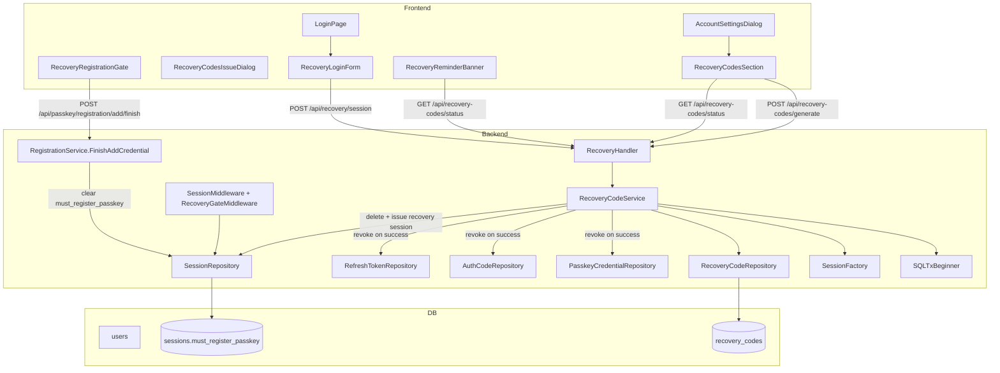
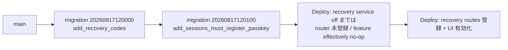

# Design Document

## Overview

**Purpose**: 本機能はパスキーのみ登録のユーザーが全端末を喪失した場合の唯一の復旧手段として、
GitHub 2FA と同型の**リカバリコード方式**を Feedman に追加する。認証済みユーザーが任意に
発行して自分で保管したリカバリコードを、全パスキー喪失時にログイン画面から提示することで、
既存 credential・セッションを全て失効させた上で復旧セッションを確立し、新パスキー登録を強制する。

**Users**: (1) 復旧手段を事前に用意しておきたい **認証済みユーザー**、(2) 全パスキー喪失後に
アカウントへ再アクセスしたい **未認証ユーザー**、(3) 復旧エンドポイントを総当たり試行から
保護したい **運用者**、の 3 者が対象となる。ワークフローは「発行 → 保管 → 喪失 → 復旧 →
新パスキー登録」の順で、Web の Account Settings Dialog / Login Page / 2 ペイン遷移前ゲートの
3 面 UI と、Backend の 4 endpoint（発行・状態・復旧開始・状態確認）で構成される。

**Impact**: 既存 Google OAuth / パスキー登録・認証 / native auth の request/response 契約は
一切変更せず、新規テーブル `recovery_codes` と既存 `sessions` テーブルへの 1 カラム追加
（`must_register_passkey`）で復旧セッション状態を表現する。復旧成功時に既存 sessions /
auth_codes / refresh_token_families / passkey_credentials を service 層 tx でまとめて失効させる
点だけが挙動追加であり、通常フロー（復旧を経由しないユーザー）の挙動は不変（NFR 2.1〜2.3）。

### Goals

- **主要目標 1**: 全パスキー喪失ユーザーが自己完結で復旧セッションを確立し、新パスキーを登録して
  通常認証状態へ復帰できる（Req 3, 4）
- **主要目標 2**: リカバリコード生値をサーバ側で 1 度も永続化せず、SHA-256 ハッシュのみを保持
  してブルートフォース耐性と漏洩耐性を確保する（Req 1.4, NFR 1.1〜1.4）
- **主要目標 3**: 復旧成功時に既存 credential・セッション・トークンを全失効することで、
  リカバリコード漏洩・盗難時の乗っ取りリスクを最小化する（Req 4.1, 4.2, GitHub 2FA と同型）
- **主要目標 4**: 未発行ユーザーに Web UI でリマインドを提示し、事前発行を促進する（Req 2）
- **成功基準**: `docs/specs/243-feat-auth-phase-2/requirements.md` の全 numeric AC が外部
  ネットワーク依存なしのテストで検証可能（NFR 4.1）

### Non-Goals

- メール送信基盤・メールによるリカバリフロー（App Store 4.8 姿勢維持のため）
- パスキー credential のセルフサービス管理 UI（一覧・削除・リネーム）
- iOS クライアント側 UI 実装（サーバ API と Web UI 先行、iOS は別 Issue）
- 管理者・カスタマーサポート経由の手動アカウント復旧
- リカバリコードの印刷・PDF・QR 出力
- 復旧成功後のメール通知
- 復旧セッションで新パスキー登録を完了できなかったユーザーへの追加復旧手段（新パスキー登録に
  到達することを前提とする）
- 個別リカバリコードの部分無効化 UI（無効化操作は再発行による一括無効化のみ）
- リカバリコード発行後の TTL 自動失効
- 複数アカウントに対する一括発行・エクスポート

## Architecture

### Existing Architecture Analysis

- **レイヤリング**: `handler → service → repository → model` の一方向依存を維持する（CLAUDE.md
  §1）。既存 `internal/passkey/` / `internal/auth/` / `internal/user/` と同型のパターンで
  `internal/recovery/` 新ドメインを追加する（CLAUDE.md §2）
- **認可の集約**: `user_id` スコープでの認可は Service 層に集約する既存規約を維持する。
  発行 endpoint は Session/Bearer middleware 経由で認証済み userID を取得し、復旧開始 endpoint は
  未認証グループ配下に置いて service 内で uniform 拒否を実施する
- **secret hash 保存規約**: `internal/repository/postgres_auth_code_repo.go` の
  `code_hash` / `crypto/subtle` 比較（正確には `auth.HashNativeSecret` = SHA-256 hex）と同一パターンで、
  リカバリコードは `code_hash` (SHA-256 hex) のみを保存する（NFR 1.1）
- **未認証 IP レート制限**: 既存 `internal/middleware/ip_ratelimit.go` の `IPRateLimiter` を
  `unauthIPMW` として再利用する（native auth token / refresh / revoke / passkey 6 endpoint と
  同じ縮退パターン。Req 6）
- **退会トランザクション**: `internal/user/service.go` の `withdrawTx` に、既存の
  `TxAuthCodeDeleter` / `TxRefreshTokenDeleter` / `TxPasskeyCredentialDeleter` と同型の
  `TxRecoveryCodeDeleter` 段を追加する（FK CASCADE の防衛線は残しつつ明示削除順序を確定する）

### Architecture Pattern & Boundary Map

**Architecture Integration**:
- 採用パターン: **既存 `internal/passkey/` と対の新規ドメインサービス** (`internal/recovery/`)
  として実装する。理由: 復旧はパスキー認証・登録と密結合する新しい認証手段であり、既存
  passkey サービスへ混ぜると単一責務が崩れるため、独立ドメインとして切り出す
- ドメイン境界: `RecoveryCodeService` はコード発行・再発行・検証・消費・全失効を担い、
  復旧成功時の副作用（既存 credential/session/token 一斉失効）は同一トランザクション内で
  service 層が既存 repository 群を呼び出して実行する（1 service = 1 責務、外側 caller は
  handler のみ）
- 復旧セッションの表現: 既存 `sessions` テーブルに `must_register_passkey BOOLEAN NOT NULL
  DEFAULT false` を追加し、`SessionMiddleware` の後段で新設 `RecoveryGateMiddleware` が本
  フラグを判定して「新パスキー登録以外」の API を拒否する。この設計は既存 session Cookie 枠を
  そのまま流用でき、Bearer 認証（JWT）経路とも独立に動作する
- 既存パターンの維持: `NewPostgresRefreshTokenRepo` / `NewPostgresAuthCodeRepo` の scan 慣行、
  handler の uniform 拒否パターン（`AUTHENTICATION_FAILED` / `REGISTRATION_FAILED`）、
  `interface segregation` によるサービス層依存宣言
- 新規コンポーネントの根拠: リカバリコードは既存 auth_code / refresh_token とは lifecycle が
  異なる（10 個一括発行・単回消費 + 再発行時一括無効化）ため、既存 repo に相乗りせず独立
  テーブル・独立 service を新設する



### Technology Stack

| Layer | Choice / Version | Role in Feature | Notes |
|-------|------------------|-----------------|-------|
| Frontend / CLI | Next.js 15 (App Router) + React 19 + TypeScript 5 / TanStack Query | 発行 UI・状態表示・リマインドバナー・復旧フォーム・強制登録ゲート | 既存 `web/src/components/`・`web/src/hooks/`・`web/src/lib/api.ts` を再利用 |
| Backend / Services | Go 1.25 + chi/v5 | 発行・状態・復旧開始 endpoint、`RecoveryCodeService` | 既存 handler → service → repository レイヤリングを維持 |
| Data / Storage | PostgreSQL 16 + lib/pq + golang-migrate | `recovery_codes` テーブル新設、`sessions.must_register_passkey` カラム追加 | 既存 migration 命名規則（`YYYYMMDDhhmmss_*.up.sql`）を踏襲 |
| Messaging / Events | — | 本機能は非同期メッセージング不使用 | 全て同一 request 内で完結 |
| Infrastructure / Runtime | 既存 `internal/middleware/ip_ratelimit.go` の `IPRateLimiter` | 未認証復旧 endpoint への IP 単位レート制限 | `cfg.RateLimitUnauthIP` (既定 30 req/min/IP) を流用 |

## File Structure Plan

### Directory Structure

```
internal/
├── recovery/                                     # 新規ドメイン（既存 internal/passkey/ と対）
│   ├── code.go                                   # コード生成・正規化・hash・形式検証（純粋関数）
│   ├── code_test.go
│   ├── service.go                                # RecoveryCodeService: 発行/再発行/検証/消費/全失効
│   └── service_test.go
├── repository/
│   ├── postgres_recovery_code_repo.go            # RecoveryCodeRepository の PostgreSQL 実装
│   ├── postgres_recovery_code_repo_db_test.go    # DB 結合テスト
│   └── interfaces.go                             # [MODIFY] RecoveryCodeRepository interface 追加
├── model/
│   ├── recovery.go                               # RecoveryCode ドメイン型・errors・APIError
│   └── errors.go                                 # [MODIFY] ErrCode* / New*Error 追加
├── database/migrations/
│   ├── 20260817120000_add_recovery_codes.up.sql
│   ├── 20260817120000_add_recovery_codes.down.sql
│   ├── 20260817120100_add_sessions_must_register_passkey.up.sql
│   └── 20260817120100_add_sessions_must_register_passkey.down.sql
├── handler/
│   ├── recovery_handler.go                       # 4 endpoint (generate / status / recover / gate)
│   ├── recovery_handler_test.go
│   └── router.go                                 # [MODIFY] recovery routes 登録 + RecoveryHandler フィールド追加
├── middleware/
│   └── recovery_gate.go                          # RecoveryGateMiddleware: must_register_passkey 判定
│   └── recovery_gate_test.go
├── passkey/
│   └── registration_service.go                   # [MODIFY] FinishAddCredential 内で must_register_passkey=false 解除
├── user/
│   └── service.go                                # [MODIFY] withdrawTx に TxRecoveryCodeDeleter 段追加
└── app/
    └── app.go                                    # [MODIFY] wiring: recovery service / handler / middleware 配線

web/src/
├── types/
│   └── recovery.ts                               # API request/response 型（RecoveryCodesStatus 等）
├── hooks/
│   ├── use-recovery-codes-status.ts              # GET /api/recovery-codes/status（TanStack Query）
│   ├── use-recovery-codes-status.test.tsx
│   ├── use-generate-recovery-codes.ts            # POST /api/recovery-codes/generate（mutation）
│   ├── use-generate-recovery-codes.test.tsx
│   ├── use-recover-with-code.ts                  # POST /api/recovery/session（mutation）
│   └── use-recover-with-code.test.tsx
├── components/
│   ├── recovery-codes-section.tsx                # AccountSettings 内セクション（発行トリガー + 状態表示）
│   ├── recovery-codes-section.test.tsx
│   ├── recovery-codes-issue-dialog.tsx           # 発行後 1 度限り全文表示 Dialog
│   ├── recovery-codes-issue-dialog.test.tsx
│   ├── recovery-reminder-banner.tsx              # 未発行ユーザー向けリマインドバナー
│   ├── recovery-reminder-banner.test.tsx
│   ├── recovery-login-form.tsx                   # ログイン画面の復旧フォーム
│   ├── recovery-login-form.test.tsx
│   ├── recovery-registration-gate.tsx            # 復旧セッション中の強制新パスキー登録画面
│   ├── recovery-registration-gate.test.tsx
│   ├── account-settings-dialog.tsx               # [MODIFY] RecoveryCodesSection の埋め込み
│   ├── login-page.tsx                            # [MODIFY] RecoveryLoginForm への導線追加
│   └── app-shell.tsx                             # [MODIFY] RecoveryReminderBanner の上端配置 + RecoveryRegistrationGate ラップ
```

### Modified Files

- `internal/repository/interfaces.go` — `RecoveryCodeRepository` interface 追加。既存 sentinel
  error 群と同様に `ErrRecoveryCodeNotUsable` を追加
- `internal/model/errors.go` — `ErrCodeRecoveryFailed` / `ErrCodeRecoveryTooMany` /
  `ErrCodeRecoveryRegistrationRequired` の 3 エラーコードと対応する `New*Error()` 追加
- `internal/handler/router.go` — 認証必須グループに `POST /api/recovery-codes/generate` /
  `GET /api/recovery-codes/status` を登録、未認証グループに `unauthIPMW + MaxBodyBytes` 経由で
  `POST /api/recovery/session` を登録。`RouterDeps` に `RecoveryHandler *RecoveryHandler` 追加
- `internal/passkey/registration_service.go` — `FinishAddCredential` で INSERT 成功後に、
  当該 session の `must_register_passkey=true` を `false` へ更新する副作用を追加（既存
  `SessionRepository` に新規メソッド `ClearMustRegisterPasskeyByID` を追加して呼び出す）
- `internal/user/service.go` — `TxRecoveryCodeDeleter` interface 追加、`withdrawTx` に
  `passkey_credentials` の直前で `recovery_codes` 削除段を挿入（削除順序: item_states →
  subscriptions → sessions → **recovery_codes** → passkey_credentials → auth_codes →
  refresh_token_families → user）
- `internal/app/app.go` — `recoveryCodeRepo` 生成、`RecoveryCodeService` 配線、`RecoveryHandler`
  組み立て、`RouterDeps.RecoveryHandler` へ注入、退会 tx に `TxRecoveryCodeDeleter` 注入
- `web/src/components/account-settings-dialog.tsx` — `AccountSettingsBody` の `PasskeyAddSection`
  の直後に `<RecoveryCodesSection />` を挿入
- `web/src/components/login-page.tsx` — Google/パスキーボタン群の下部に「リカバリコードで復旧」
  導線を追加、クリックで `<RecoveryLoginForm />` を展開
- `web/src/components/app-shell.tsx` — 最上部に `<RecoveryReminderBanner />` を配置、
  子レンダリングを `<RecoveryRegistrationGate>` でラップし、復旧セッション状態を検知した際は
  ゲート画面を代替表示

## Requirements Traceability

| Requirement | Summary | Components | Interfaces | Flows |
|-------------|---------|------------|------------|-------|
| 1.1 | 認証済み任意発行で相互異なる複数コード発行 | RecoveryCodesSection / RecoveryHandler / RecoveryCodeService / RecoveryCodeRepository | POST /api/recovery-codes/generate | Generate Flow |
| 1.2 | 発行直後 1 度だけ全文表示 | RecoveryCodesIssueDialog | (frontend only, response body) | Generate Flow (response) |
| 1.3 | 再訪時は生値非表示・発行済み事実のみ | RecoveryCodesSection / use-recovery-codes-status | GET /api/recovery-codes/status | Status Flow |
| 1.4 | 生値非保存・照合可能変換値のみ保存 | RecoveryCodeService / RecoveryCodeRepository (hash 保存) | RecoveryCodeService.Generate | Generate Flow |
| 1.5 | 未認証は発行拒否 | RecoveryHandler / SessionMiddleware (認証必須グループ) | POST /api/recovery-codes/generate | Router |
| 1.6 | 既存機能への影響なし | RouterDeps / SessionMiddleware / NativeAuthHandler (無変更) | (regression) | 既存契約 |
| 2.1 | 未発行時のリマインド提示 | RecoveryReminderBanner / use-recovery-codes-status | GET /api/recovery-codes/status | Status Flow |
| 2.2 | 発行済み時はリマインド非表示 | RecoveryReminderBanner | GET /api/recovery-codes/status | Status Flow |
| 2.3 | リマインドから発行導線を辿れる | RecoveryReminderBanner (AccountSettingsDialog を open) | (internal navigation) | UI |
| 2.4 | リマインド本文に機密情報を含めない | RecoveryReminderBanner (固定文言) | — | UI (static text) |
| 3.1 | ユーザー識別子+コードで検証 | RecoveryHandler / RecoveryCodeService.Verify | POST /api/recovery/session | Recover Flow |
| 3.2 | 検証成功で復旧セッション確立 | RecoveryCodeService / SessionFactory / SessionRepository | POST /api/recovery/session (Set-Cookie) | Recover Flow |
| 3.3 | 使用済みコードの再利用不能化 | RecoveryCodeService / RecoveryCodeRepository.MarkUsed | (repository single-use) | Recover Flow |
| 3.4 | uniform エラーで拒否理由非開示 | RecoveryHandler (RECOVERY_FAILED 単一 code) | POST /api/recovery/session (400) | Recover Flow |
| 3.5 | ユーザー未存在も同一形式 | RecoveryCodeService (存在有無非開示 constant-time) | POST /api/recovery/session | Recover Flow |
| 3.6 | 形式不正も同一形式 | RecoveryCodeService.NormalizeAndValidate | POST /api/recovery/session | Recover Flow |
| 4.1 | 復旧成功時に既存 credential 全失効 | RecoveryCodeService (PCRepo.DeleteByUserIDExec 呼出) | (tx orchestration) | Recover Flow (tx) |
| 4.2 | 復旧成功時に既存 session/token 全失効 | RecoveryCodeService (SessionRepo/ACRepo/RTRepo の Delete/Revoke Exec 呼出) | (tx orchestration) | Recover Flow (tx) |
| 4.3 | 通常 UI 進入前に新パスキー登録を必須提示 | RecoveryRegistrationGate / RecoveryGateMiddleware | GET /api/users/me (拡張) or GET /api/recovery-codes/status | UI + Middleware |
| 4.4 | 新パスキー登録完了で通常状態へ | RegistrationService.FinishAddCredential (must_register_passkey clear) | POST /api/passkey/registration/add/finish | 登録完了フック |
| 4.5 | 復旧セッション中は他機能を実行不能に | RecoveryGateMiddleware (403 で新パスキー登録以外を拒否) | 全 /api/* | Middleware |
| 4.6 | 未完了破棄で失効を巻き戻さない | RecoveryCodeService (idempotent。session Delete のみで、逆遷移は無い) | — | Recover Flow (no rollback) |
| 5.1 | 単回利用 enforce | RecoveryCodeRepository.MarkUsed (WHERE used=false atomic UPDATE) | (single-use atomic) | Recover Flow |
| 5.2 | 再発行で旧一式全無効化 | RecoveryCodeService.Generate (先に DeleteByUserID → INSERT) | POST /api/recovery-codes/generate | Regenerate Flow |
| 5.3 | 旧一式提示は 3.4 と同形式で拒否 | RecoveryCodeRepository.FindByHash (旧 hash は既に消滅) | POST /api/recovery/session | Recover Flow |
| 5.4 | 再発行時も 1.2 と同規則 | RecoveryCodesIssueDialog (発行 API 応答の共通処理) | POST /api/recovery-codes/generate | Regenerate Flow |
| 6.1 | 閾値超過は 429 | 既存 IPRateLimiter (unauthIPMW) | POST /api/recovery/session | Middleware |
| 6.2 | 閾値以内は通常通過 | 既存 IPRateLimiter | POST /api/recovery/session | Middleware |
| 6.3 | IP 別独立カウント | 既存 IPRateLimiter | POST /api/recovery/session | Middleware |
| 6.4 | 拒否形式は既存未認証 endpoint と同一 | 既存 IPRateLimiter (writeRateLimitResponse) | POST /api/recovery/session | Middleware |
| 7.1 | Google OAuth / Native Auth 契約不変 | (無変更) | GET /auth/google/login / POST /api/auth/token 他 | 既存 (regression) |
| 7.2 | Passkey Registration / Authentication 契約不変 | (RegistrationService の add finish のみ副作用追加。request/response 契約は不変) | POST /api/passkey/* | 既存 (regression) |
| 7.3 | 未発行ユーザーの既存 UI 動線が不変 | 既存 AppShell / AuthGuard 挙動維持 | (regression) | Frontend (regression) |
| 7.4 | 復旧フロー外の他ログインでコード消費しない | RecoveryCodeService は復旧経路以外で呼ばれない | (isolation) | Isolation |
| NFR 1.1 | 生値非保存・照合値のみ | RecoveryCodeService / RecoveryCodeRepository | (hash 保存) | Generate Flow |
| NFR 1.2 | 生値をログ/レスポンス/ヘッダに残さない | 全 handler / service (hash 先頭 8 文字のみログ) | — | 全経路 |
| NFR 1.3 | 生値を localStorage / sessionStorage / URL / console に残さない | RecoveryCodesIssueDialog (closure only、blob download 除く) / use-generate-recovery-codes (closure only) | — | Frontend |
| NFR 1.4 | 拒否応答に入力値・内部詳細を反射しない | RecoveryHandler (uniform error) | — | 全 endpoint |
| NFR 2.1 | 追加個人情報を必須化しない | (メール収集ゼロを維持) | — | 設計制約 |
| NFR 2.2 | 破壊的変更なし | 既存契約は不変、追加 endpoint のみ | — | API 契約 |
| NFR 2.3 | 既存契約テスト green 維持 | (無変更 endpoint への影響なし) | — | CI |
| NFR 3.1 | 発行/再発行/成功/拒否/レート拒否をログ記録 | RecoveryCodeService / RecoveryHandler (slog.Info/Warn) | — | 運用ログ |
| NFR 3.2 | 運用ログに生値・照合値・PII を含めない | slog 引数は user_id + hash 先頭 8 文字のみ | — | 運用ログ |
| NFR 4.1 | 外部ネットワーク非依存でテスト可能 | 各 service の依存を最小 interface に絞る (interface segregation) | — | テスト |

## Components and Interfaces

### Backend — Recovery Domain

#### RecoveryCodeService

| Field | Detail |
|-------|--------|
| Intent | リカバリコードの発行・再発行・検証・単回消費・復旧成功時の全失効を担うドメインサービス |
| Requirements | 1.1, 1.4, 2.x (indirectly), 3.1, 3.2, 3.3, 3.4, 3.5, 3.6, 4.1, 4.2, 4.6, 5.1, 5.2, 5.3, 5.4, 7.4, NFR 1.1, 1.2, 1.4, 3.1, 3.2, 4.1 |

**Responsibilities & Constraints**
- コードの生成・hash 保存・単回消費・再発行時の一括無効化を実装する
- 復旧成功時のみ、既存 sessions / auth_codes / refresh_token_families / passkey_credentials
  を service 層 tx でまとめて失効させる (Req 4.1 / 4.2)
- 復旧成功時に新規 session を発行し、`must_register_passkey=true` で INSERT する (Req 3.2 / 4.3)
- 拒否は理由詳細を反射せず `ErrRecoveryFailed` に uniform 化する (Req 3.4 / 3.5 / 3.6 /
  NFR 1.4)
- 生値をログ・エラーメッセージに一切残さない (hash 先頭 8 文字のみ / NFR 1.2 / 3.2)
- ユーザー存在有無を返り値・処理時間で識別できないようにする（存在しないユーザー識別子でも
  同じ code paths を通す / Req 3.5、`crypto/subtle` は不要だが早期 return は避ける）

**Dependencies**
- Inbound: `RecoveryHandler` — HTTP request 起点 (Critical)
- Outbound: `RecoveryCodeRepository` — コード hash の永続化 (Critical)
- Outbound: `UserReader` (`FindByNormalizedUsername`) — ユーザー識別子解決 (Critical)
- Outbound: `SessionCreator` / `SessionRepository.DeleteByUserIDExec` — 復旧 session 発行と既存
  session 失効 (Critical)
- Outbound: `PasskeyCredentialRepository.DeleteByUserIDExec` — 既存 credential 失効 (Critical)
- Outbound: `RefreshTokenRepository` (family revoke or delete) — 既存 token 失効 (Critical)
- Outbound: `AuthCodeRepository.DeleteByUserIDExec` — 既存 auth_code 失効 (Critical)
- Outbound: `SessionFactoryFunc` — 復旧 session の ID / TTL 生成 (Critical)
- Outbound: `RecoveryTxBeginner` — 復旧成功時の失効・session 発行を 1 tx でまとめる (Critical)

**Contracts**: Service [x] / API [ ] / Event [ ] / Batch [ ] / State [ ]

##### Service Interface

```go
// internal/recovery/service.go
package recovery

// GeneratedCodes は Generate/Regenerate の戻り値。plain は 1 回だけ handler → response に流し、
// 直後に GC 対象に落とす。永続化・ログには含まれない (Req 1.2 / 1.4 / NFR 1.1 / 1.2).
type GeneratedCodes struct {
    Plain []string  // 発行された生コード N 個（handler が 1 度だけ response へ）
    Count int       // len(Plain) と一致
}

// RecoveryStatus は当該ユーザーの発行状態（未発行 / 発行済み）を返す。
// 生値・hash 値は一切含まれない (Req 1.3 / 2.1 / 2.2 / NFR 1.2)
type RecoveryStatus struct {
    Issued              bool      // recovery_codes に 1 個以上あれば true
    IssuedAt            *time.Time // 最新発行時刻（発行済みの場合のみ）
    RemainingCount      int       // 未使用コード数（発行済みの場合のみ）
    MustRegisterPasskey bool      // 復旧セッション中フラグ（RecoveryGate 判定材料）
}

type RecoveryCodeService interface {
    // Generate は認証済み userID に対して新しいコード一式を発行し、旧一式を全無効化する
    // (Req 1.1 / 5.2)。1 tx 内で「旧一式 DELETE → 新規 N 個 INSERT」を実行。
    Generate(ctx context.Context, userID string) (*GeneratedCodes, error)

    // Status は当該ユーザーの発行状態と復旧セッション状態を返す (Req 1.3 / 2.1 / 2.2)。
    Status(ctx context.Context, userID string) (*RecoveryStatus, error)

    // Recover は未認証クライアントが提示した (username, recoveryCode) を検証し、
    // 成功時に (a) 既存 sessions/credentials/authCodes/refreshTokens を全失効、
    // (b) 復旧セッション (must_register_passkey=true) を新規発行して返す
    // (Req 3.1〜3.6 / 4.1 / 4.2 / 4.6 / 5.1 / 5.3 / 7.4)。
    // 拒否時は (nil, ErrRecoveryFailed) を返す。
    Recover(ctx context.Context, rawUsername, rawCode string) (*model.Session, error)
}

// ErrRecoveryFailed は user 未存在 / code 未検出 / used / 別ユーザー / 形式不正 のいずれも
// 表す sentinel。handler は 400 RECOVERY_FAILED に射影する (Req 3.4)。
var ErrRecoveryFailed = errors.New("recovery failed")
```

- **Preconditions**:
  - `Generate` は認証済み userID (SessionMiddleware 通過済み) で呼ばれる
  - `Recover` は未認証で呼ばれる。rawUsername / rawCode は空文字も許容し内部で uniform 拒否
- **Postconditions**:
  - `Generate` 成功: `Plain` はサーバ側でこれ以降参照されない。DB には SHA-256 hex のみ
  - `Recover` 成功: 新 session 1 行が `must_register_passkey=true` で永続化、既存 credentials /
    sessions / auth_codes / refresh_token_families / recovery_codes 全て user_id スコープで
    delete/revoke 済み
- **Invariants**:
  - `recovery_codes` テーブルに残る行は必ず `used=false` のいずれか（成功消費行は削除）
  - 復旧 session の `user_id` は必ず既存 users.id と一致 (FK)

#### RecoveryCodeRepository

| Field | Detail |
|-------|--------|
| Intent | recovery_codes テーブルへの永続化操作を提供 |
| Requirements | 1.4, 3.3, 5.1, 5.2, 7.4, NFR 1.1, NFR 1.2 |

**Contracts**: Service [ ] / API [ ] / Event [ ] / Batch [ ] / State [ ]

```go
// internal/repository/interfaces.go に追加
type RecoveryCodeRepository interface {
    // BulkInsertExec は共有トランザクション上で複数コード hash を一括 INSERT する (Req 1.1 / 1.4)
    BulkInsertExec(ctx context.Context, q DBTX, userID string, codeHashes []string, issuedAt time.Time) error

    // FindByUserAndHash は user_id と code_hash 一致で未使用行を 1 件返す。未検出は (nil, nil)。
    // NFR 1.2: hash / user_id をエラーメッセージに含めない。
    FindByUserAndHash(ctx context.Context, userID, codeHash string) (*model.RecoveryCode, error)

    // MarkUsedExec は当該 ID の recovery_code の used=true を atomic に確定する (Req 3.3 / 5.1)。
    // 対象が既に used / 存在しない場合は ErrRecoveryCodeNotUsable。
    MarkUsedExec(ctx context.Context, q DBTX, id string) error

    // CountUnusedByUserID は user_id に紐付く未使用コード数を返す (Req 2.1 / 2.2 の状態判定)。
    CountUnusedByUserID(ctx context.Context, userID string) (int, error)

    // LatestIssuedAtByUserID は user_id に紐付くコードの最新 issued_at を返す。未発行は (nil, nil)。
    LatestIssuedAtByUserID(ctx context.Context, userID string) (*time.Time, error)

    // DeleteByUserIDExec は user_id に紐付く全 recovery_codes を削除する
    // (Req 5.2 の再発行前一括無効化 / 退会 tx cleanup)。
    DeleteByUserIDExec(ctx context.Context, q DBTX, userID string) error
}

var ErrRecoveryCodeNotUsable = errors.New("recovery code is not usable")
```

- 既存 `PostgresAuthCodeRepo.MarkUsed` と同じ atomic UPDATE パターン
  (`WHERE id=$1 AND used=false`) を採用し、race を起こさない単回消費を保証する
- `SessionRepository` に **追加メソッド** `ClearMustRegisterPasskeyByID(ctx, sessionID) error`
  を新設する（既存 `Create` / `FindByID` / `DeleteByID` / `DeleteByUserID` に相乗り）。
  `passkey/registration_service.go` の `FinishAddCredential` から呼ばれる

### Backend — HTTP Layer

#### RecoveryHandler

| Field | Detail |
|-------|--------|
| Intent | 発行・状態・復旧開始の 3 endpoint を HTTP I/O のみで処理し、認可・ビジネスロジックは Service に委譲 |
| Requirements | 1.1, 1.3, 1.5, 2.1, 2.2, 3.1, 3.2, 3.4, 3.5, 3.6, 6.4, NFR 1.2, NFR 1.4 |

**Contracts**: Service [ ] / API [x] / Event [ ] / Batch [ ] / State [ ]

##### API Contract

| Method | Endpoint | Auth | Request | Response | Errors |
|--------|----------|------|---------|----------|--------|
| POST | `/api/recovery-codes/generate` | 認証必須 (Session/Bearer) | `{}` (body 空) | `{codes: string[], count: number}` | 401, 500 |
| GET  | `/api/recovery-codes/status`   | 認証必須 | — | `{issued: bool, issued_at?: string, remaining_count?: number, must_register_passkey: bool}` | 401, 500 |
| POST | `/api/recovery/session`        | 未認証 (unauthIPMW + MaxBodyBytes + Content-Type + Origin) | `{username: string, recovery_code: string}` | 204 No Content + Set-Cookie `session_id=...` | 400 INVALID_REQUEST, 400 RECOVERY_FAILED, 403 FORBIDDEN_ORIGIN, 415 UNSUPPORTED_MEDIA_TYPE, 429 (via unauthIPMW), 500 |

- Cookie 属性は既存 `buildSessionCookie` を再利用（`session_cookie.go`）。`must_register_passkey`
  フラグは Cookie では表現せず DB `sessions` 行内に持つ（Cookie は既存 opaque session_id のみ）
- CSRF 対策は既存 `POST /api/auth/session` と同型（Content-Type: application/json 必須 + Origin
  allowlist）を採用する（Req 6.4 の「既存応答形式と同一」に整合）
- レスポンスの `code` フィールドは常に `RECOVERY_FAILED` に uniform 化（Req 3.4）。
  「ユーザー未存在」「コード未検出」「使用済み」「形式不正」を反射しない

##### Handler Interface

```go
// internal/handler/recovery_handler.go
package handler

type RecoveryService interface {
    Generate(ctx context.Context, userID string) (*recovery.GeneratedCodes, error)
    Status(ctx context.Context, userID string) (*recovery.RecoveryStatus, error)
    Recover(ctx context.Context, rawUsername, rawCode string) (*model.Session, error)
}

type RecoveryHandler struct {
    svc RecoveryService
    // Cookie 属性 (buildSessionCookie に流し込む)
    cookieDomain  string
    cookieSecure  bool
    sessionMaxAge int
    // /api/recovery/session の Origin allowlist（cfg.WebPasskeyAllowedOrigin を注入）
    allowedOrigin string
}

func NewRecoveryHandler(svc RecoveryService, opts ...RecoveryHandlerOption) *RecoveryHandler

func (h *RecoveryHandler) Generate(w http.ResponseWriter, r *http.Request) // POST /api/recovery-codes/generate
func (h *RecoveryHandler) Status(w http.ResponseWriter, r *http.Request)   // GET  /api/recovery-codes/status
func (h *RecoveryHandler) Recover(w http.ResponseWriter, r *http.Request)  // POST /api/recovery/session
```

#### RecoveryGateMiddleware

| Field | Detail |
|-------|--------|
| Intent | 復旧セッション状態 (`must_register_passkey=true`) のリクエストを新パスキー登録以外の API から遮断 |
| Requirements | 4.3, 4.5, 4.4 (登録完了で解除) |

**Responsibilities & Constraints**
- 認証必須グループの `SessionMiddleware`（および `BearerOrSessionMiddleware` の Session 経路）の
  **後段** に配置し、認証済み userID がコンテキストに入った状態で `SessionRepository` から
  session を再解決して `must_register_passkey` を判定する
- `must_register_passkey=true` の場合、`POST /api/passkey/registration/add/begin` /
  `POST /api/passkey/registration/add/finish` / `GET /api/users/me` / `GET /api/recovery-codes/status`
  以外の全パスは 403 `RECOVERY_REGISTRATION_REQUIRED` で拒否する
- Bearer 経路（JWT）は `sessions` テーブルを参照しないため本 gate は Session Cookie 経路のみ
  適用（Bearer 認証で復旧セッション状態は表現できないので、本機能で発行される復旧 session は
  常に Cookie セッションとして発行される）
- 登録完了時に `RegistrationService.FinishAddCredential` が `SessionRepository.ClearMustRegisterPasskeyByID`
  を呼び出して同 tx でフラグを解除する (Req 4.4)

### Backend — Wiring

- `internal/app/app.go` に以下を追加:
  - `recoveryCodeRepo := repository.NewPostgresRecoveryCodeRepo(db)`
  - `recoveryTxBeginner := newRecoveryTxBeginner(txBeginner)` （既存 `SQLTxBeginner` を薄く
    adapter 化して `recovery.RecoveryTxBeginner` interface に合わせる。既存
    `passkeyRegistrationTxBeginner` と同 idiom）
  - `recoverySvc := recovery.NewRecoveryCodeService(recoveryCodeRepo, userRepo, sessionRepo,
    passkeyCredentialRepo, authCodeRepo, refreshTokenRepo, sessionFactory, recoveryTxBeginner)`
  - `recoveryHandler := handler.NewRecoveryHandler(recoverySvc, handler.WithRecoveryCookie(...),
    handler.WithRecoveryAllowedOrigin(cfg.WebPasskeyAllowedOrigin))`
  - `RouterDeps.RecoveryHandler = recoveryHandler`
  - 退会 tx 配線 `newTxUserService(...)` に `TxRecoveryCodeDeleter`（= `PostgresRecoveryCodeRepo`）
    を末尾追加

### Frontend — Recovery UI

#### RecoveryCodesSection (`web/src/components/recovery-codes-section.tsx`)

| Field | Detail |
|-------|--------|
| Intent | AccountSettings 内の発行トリガーと発行状態表示 |
| Requirements | 1.1, 1.3, 5.4, 2.3 |

**Responsibilities & Constraints**
- `useRecoveryCodesStatus()` で状態取得。`issued=false` なら「未発行 — 発行を推奨します」+
  「リカバリコードを発行」ボタン。`issued=true` なら発行日時と残数だけ表示し「再発行」ボタン
  （生値は再表示しない / Req 1.3）
- ボタンクリック → `useGenerateRecoveryCodes()` mutation → 成功時に `RecoveryCodesIssueDialog`
  を open してレスポンスの `codes` を props で受け渡す (1 回限り表示 / Req 1.2 / 5.4)
- 生値は React state に保持しつつも `RecoveryCodesIssueDialog` を閉じたら state から破棄
  （closure 経由で GC 対象。localStorage / sessionStorage 不使用 / NFR 1.3）

#### RecoveryCodesIssueDialog (`web/src/components/recovery-codes-issue-dialog.tsx`)

| Field | Detail |
|-------|--------|
| Intent | 発行された N 個のコードを 1 度だけ全文表示、コピー・ダウンロード・保管確認 UI を提供 |
| Requirements | 1.2, 5.4, NFR 1.3 |

**Responsibilities & Constraints**
- コード一覧を等幅フォントで表示、「クリップボードへコピー」（Clipboard API）と「テキスト
  ファイルとしてダウンロード」（`Blob` + `URL.createObjectURL` を open 時に生成、close 時に
  `URL.revokeObjectURL`）を提供
- 「安全な場所に保管しました」チェックボックスをチェックしないと Dialog を閉じられない
  （UI 補助 / Req 1.2 の趣旨）
- Dialog を閉じた時点で props の生値参照を親側で破棄させるコールバックを発火。以後の再表示は
  不可能（Req 1.3）
- URL クエリ・console 出力・localStorage への保存は一切行わない（NFR 1.3）

#### RecoveryReminderBanner (`web/src/components/recovery-reminder-banner.tsx`)

| Field | Detail |
|-------|--------|
| Intent | 未発行ユーザーへの Web 上リマインド提示 |
| Requirements | 2.1, 2.2, 2.3, 2.4 |

**Responsibilities & Constraints**
- `useRecoveryCodesStatus()` で `issued=false` かつ `mustRegisterPasskey=false` のときのみ表示
- 本文は固定文言（「万一のためにリカバリコードを発行しておくと安心です」等 / Req 2.4）で、
  ユーザー個別の機密情報を含めない
- 「発行画面を開く」ボタンで `AccountSettingsDialog` を open（既存 `AccountSettingsDialog` に
  外部 open トリガー API を追加。または `useState` を親（`AppShell`）で持ち上げて共有）

#### RecoveryLoginForm (`web/src/components/recovery-login-form.tsx`)

| Field | Detail |
|-------|--------|
| Intent | ログイン画面から呼ばれる「ユーザー名 + リカバリコード」入力フォーム |
| Requirements | 3.1, 3.4, 3.5, 3.6 |

**Responsibilities & Constraints**
- `useRecoverWithCode({username, recoveryCode})` mutation を実行、成功時は AuthGuard 再判定
  （`queryClient.invalidateQueries({queryKey: ["auth", "me"]})`）で 2 ペイン UI へ遷移し、
  `RecoveryRegistrationGate` が新パスキー登録画面を代替表示する (Req 4.3)
- 拒否時（400 RECOVERY_FAILED / 429 / 500）は固定文言（`kind` enum を露出、内部詳細非反射 /
  NFR 1.4）。ユーザー存在有無・形式不正・使用済み・別ユーザーは同一文言に集約
- 送信中は入力欄・送信ボタンを disable、ボタン文言を「復旧中...」に変更（多重送信防止）

#### RecoveryRegistrationGate (`web/src/components/recovery-registration-gate.tsx`)

| Field | Detail |
|-------|--------|
| Intent | 復旧セッション中に、新パスキー登録以外の UI を一切表示せず、既存 `PasskeyAddSection` を単独提示 |
| Requirements | 4.3, 4.4, 4.5 |

**Responsibilities & Constraints**
- `useRecoveryCodesStatus()` の `mustRegisterPasskey=true` を検知して、`AppShell` の子 render を
  差し替える（`AuthGuard` 相当の 2 段目ガード）
- 中央に「復旧処理が完了しました。新しいパスキーを登録してください」文言 + 既存
  `PasskeyAddSection` を配置。登録成功で mutation → `useCurrentUser` / `useRecoveryCodesStatus`
  を invalidate → 通常 2 ペイン UI に自動遷移 (Req 4.4)
- ログアウト・退会・フィード操作等の他機能へのリンクは一切表示しない（Req 4.5 のフロント側実装。
  バックエンド側は `RecoveryGateMiddleware` が定義的な安全網を提供）

### Frontend — Hooks

```typescript
// web/src/hooks/use-recovery-codes-status.ts
export function useRecoveryCodesStatus(): UseQueryResult<RecoveryCodesStatus, ApiError>

// web/src/hooks/use-generate-recovery-codes.ts
export function useGenerateRecoveryCodes(): UseMutationResult<
  { codes: string[]; count: number },
  ApiError,
  void
>

// web/src/hooks/use-recover-with-code.ts
export type RecoveryLoginErrorKind =
  | "recovery_failed"
  | "network_error"
  | "server_error"
  | "rate_limited"
export function useRecoverWithCode(): UseMutationResult<
  void,
  RecoveryLoginError,
  { username: string; recoveryCode: string }
>
```

- `use-recovery-codes-status` は成功時 `queryKey: ["recovery", "status"]` でキャッシュ。
  `useGenerateRecoveryCodes` / `useRecoverWithCode` / `usePasskeyAddRegistration` の成功時に
  invalidate される
- 生値の扱いは既存 `use-passkey-authentication.ts` / `use-passkey-registration.ts` と同型
  （closure 変数のみ、console 出力・localStorage 保存禁止 / NFR 1.3）

## Data Models

### Domain Model

- **アグリゲート境界**:
  - `RecoveryCode` アグリゲート: 単一ユーザーに属する N 個の recovery_code 行の集合。
    Aggregate root は user（recovery_codes は必ず user 単位でしか操作されない）。
  - 復旧セッション状態: `Session` アグリゲート（既存）の一部として `must_register_passkey`
    列を持つ

- **ドメイン型**:

```go
// internal/model/recovery.go
package model

// RecoveryCode はリカバリコード 1 個の永続化用ドメイン型。
// 生値 (plain) はフィールドに含めない (NFR 1.1)。
type RecoveryCode struct {
    ID       string    // UUID
    UserID   string    // users.id への FK
    CodeHash string    // SHA-256 hex (auth.HashNativeSecret と同流儀)
    IssuedAt time.Time // 発行時刻
    Used     bool      // 単回利用フラグ (Req 5.1)
    UsedAt   *time.Time // 消費時刻（未使用は nil、成功消費行は削除するので実質的に常に nil）
}
```

### Logical / Physical Data Model

#### Table: `recovery_codes` (新規)

```sql
-- internal/database/migrations/20260817120000_add_recovery_codes.up.sql
CREATE TABLE recovery_codes (
    id UUID PRIMARY KEY DEFAULT gen_random_uuid(),
    user_id UUID NOT NULL REFERENCES users(id) ON DELETE CASCADE,
    code_hash VARCHAR(128) NOT NULL,
    issued_at TIMESTAMPTZ NOT NULL DEFAULT now(),
    used BOOLEAN NOT NULL DEFAULT false,
    used_at TIMESTAMPTZ,
    -- 同一ユーザー内での code_hash の一意性（万一同じ hash が同ユーザーへ 2 個発行されないよう防御）
    CONSTRAINT uq_recovery_codes_user_hash UNIQUE (user_id, code_hash)
);

CREATE INDEX idx_recovery_codes_user_id ON recovery_codes(user_id);
```

- `code_hash` は SHA-256 hex 64 文字 (`auth.HashNativeSecret` 流儀)。VARCHAR(128) は将来
  ハッシュ長拡張余地（既存 `auth_codes.code_hash` と同）
- 復旧成功時に該当行は **DELETE** する（`used=true` に更新して残す方式ではなく、消費行を
  即座に削除する。理由: 復旧成功時に user_id スコープで全 credential/session/token を
  wipe する tx の中で recovery_codes を明示 DELETE することが自然）
- 再発行時（Req 5.2）は user_id スコープで全行 DELETE してから新規 N 個を BulkInsert する

#### Table: `sessions` 拡張

```sql
-- internal/database/migrations/20260817120100_add_sessions_must_register_passkey.up.sql
ALTER TABLE sessions
    ADD COLUMN must_register_passkey BOOLEAN NOT NULL DEFAULT false;
```

- 既存 session 行はデフォルト値 `false` で既存挙動と等価（NFR 2.1）
- `SessionRepository.Create` は新規 arg `mustRegisterPasskey bool` を追加。既存
  Google OAuth / パスキー Web 登録 / パスキーログイン session 交換の 3 経路は全て `false` を
  渡す（既存挙動不変）。新設 `RecoveryCodeService.Recover` のみ `true` を渡す
- `SessionRepository.FindByID` は `must_register_passkey` を追加 scan。`Session` 型に同名の
  bool フィールドを追加
- 追加メソッド `ClearMustRegisterPasskeyByID(ctx, sessionID) error`（`UPDATE sessions SET
  must_register_passkey=false WHERE id=$1`）を新設し、`RegistrationService.FinishAddCredential`
  から呼び出す (Req 4.4)

### Recovery Code フォーマット決定 (Open Question の確定)

- **本数**: **10 個**（GitHub 2FA の 16 個より少なく、Feedman 規模に合わせて減らす）
- **1 コードの長さ**: **10 文字**（表示区切り込みで `XXXXX-XXXXX` の 11 文字）
- **文字集合**: **Crockford Base32 の subset**（`0123456789ABCDEFGHJKMNPQRSTVWXYZ`、I/L/O/U を
  除外）。生成側は uppercase 固定、正規化側で入力の lowercase → uppercase と `-` / 空白除去を
  実施し、混同を吸収
- **エントロピー**: 32^10 = 約 50 bit。10 コードあれば実質エントロピーは 47 bit 相当。
  既存 unauth IP レート制限 30 req/min/IP のもとでブルートフォース試行に少なくとも数千万年
  必要となり、実用上安全
- **hash 方式**: SHA-256 hex（`auth.HashNativeSecret` を流用）。salt なし（コード自体が高
  エントロピーで、コード集合が全ユーザー横断で衝突する確率は無視できる）
- **表示形式**: `XXXXX-XXXXX`（5 文字ずつハイフン区切り）。ハッシュ時と入力正規化時に
  ハイフン・空白を除去し、大小同一視して照合

## Error Handling

### Error Strategy

- **service 層**: 拒否は `ErrRecoveryFailed` sentinel に uniform 化。infra エラーは
  `fmt.Errorf("...: %w", err)` で wrap して返す
- **handler 層**: `errors.Is(err, recovery.ErrRecoveryFailed)` で 400 `RECOVERY_FAILED` に射影、
  それ以外は 500 `INTERNAL_ERROR`。認可失敗は SessionMiddleware が 401 を返す
- **middleware 層**: `RecoveryGateMiddleware` は 403 `RECOVERY_REGISTRATION_REQUIRED`（新パスキー
  登録以外の要求）を返す。IP レート超過は既存 `IPRateLimiter` が 429 を返す（Req 6.4 の
  「既存応答形式と同一」に整合）
- **frontend**: `RecoveryLoginError` の kind enum で分岐。生値・server error message を DOM に
  反射しない（既存 `PasskeyAuthError` / `PasskeyRegistrationError` と同 idiom）

### Error Categories and Responses

- **User Errors (4xx)**:
  - 400 `RECOVERY_FAILED` (Req 3.4 / 3.5 / 3.6): 未存在ユーザー・未検出コード・使用済み・別
    ユーザー・形式不正のすべてを同一 code / message に uniform 化
  - 400 `INVALID_REQUEST`: JSON 不正・必須フィールド欠落・body 上限超過
  - 401 `UNAUTHORIZED`: 発行・状態 endpoint への未認証アクセス (Req 1.5)
  - 403 `RECOVERY_REGISTRATION_REQUIRED`: 復旧セッション中に新パスキー登録以外を試みた場合
    (Req 4.5)
  - 403 `FORBIDDEN_ORIGIN` / 415 `UNSUPPORTED_MEDIA_TYPE`: 復旧 endpoint の CSRF 対策
    （既存 `POST /api/auth/session` と同型）
  - 429: `IPRateLimiter` から Retry-After 付き（Req 6.1 / 6.4）

- **System Errors (5xx)**:
  - 500 `INTERNAL_ERROR`: DB 障害・session factory 失敗・infra 例外を graceful degradation
    （応答は固定文言、詳細は slog のみ / NFR 1.4）

- **Business Logic Errors (422)**: 本 spec では 422 は使用しない（すべて 400 に集約）

## Testing Strategy

- **Unit Tests** (対象コードの近傍、外部ネットワーク非依存 / NFR 4.1):
  1. `internal/recovery/code_test.go`: コード生成が相互異なる N 個を返し、Crockford Base32 で
     N chars、正規化が lowercase/hyphen/whitespace を吸収する
  2. `internal/recovery/service_test.go`: `Generate` が既存 hash を全 DELETE してから新規 N 個を
     INSERT する（stub repo で観測）
  3. `internal/recovery/service_test.go`: `Recover` が未存在 user / 未検出 hash / used / 別
     user / 形式不正のすべてで `ErrRecoveryFailed` を返す（uniform）
  4. `internal/recovery/service_test.go`: `Recover` 成功時に PCRepo/RTRepo/ACRepo/SessionRepo の
     `DeleteByUserIDExec` / `RevokeByUserIDExec` が同一 tx で呼ばれ、`SessionRepo.CreateExec` に
     `must_register_passkey=true` が渡される
  5. `internal/handler/recovery_handler_test.go`: `Generate` / `Status` / `Recover` の 200 系と
     エラー系 status code / error code のマッピング

- **Integration Tests** (cross-component / DB 結合):
  1. `internal/repository/postgres_recovery_code_repo_db_test.go`: `BulkInsertExec` + `FindByUserAndHash`
     + `MarkUsedExec` の atomic 単回消費（並行 UPDATE race）
  2. `internal/repository/postgres_recovery_code_repo_db_test.go`: `DeleteByUserIDExec` + FK
     ON DELETE CASCADE（user 削除で recovery_codes も消える）
  3. `internal/handler/recovery_e2e_db_test.go`: 発行 → 再発行 → 旧 hash は復旧に使えず、
     新 hash のみ有効
  4. `internal/handler/recovery_e2e_db_test.go`: 復旧成功後、既存 sessions / passkey_credentials /
     refresh_token_families / auth_codes / recovery_codes が全て空になり、新 session 1 行が
     `must_register_passkey=true` で残る
  5. `internal/middleware/recovery_gate_test.go`: `must_register_passkey=true` の session で
     `/api/passkey/registration/add/*` 以外を叩くと 403 `RECOVERY_REGISTRATION_REQUIRED`
  6. `internal/handler/passkey_e2e_db_test.go` 拡張: `RegistrationAddFinish` 成功時に
     `must_register_passkey` が false に更新される

- **E2E/UI Tests** (Vitest + Testing Library):
  1. `web/src/components/recovery-codes-section.test.tsx`: 未発行時に「発行」ボタン、発行済み時
     は「再発行」ボタン + 発行日時、コード生値の再表示なし
  2. `web/src/components/recovery-codes-issue-dialog.test.tsx`: N 個のコードが 1 度だけ全文表示
     される、コピーボタン / ダウンロードボタン / 保管確認チェックボックスが機能する、閉じたら
     再表示不可
  3. `web/src/components/recovery-reminder-banner.test.tsx`: `issued=false` かつ
     `mustRegisterPasskey=false` のときのみ描画、機密情報（コード生値・hash・user_id）を DOM に
     出さない
  4. `web/src/components/recovery-login-form.test.tsx`: 拒否時に固定文言のみ表示（内部 body 非
     反射）、成功時に AuthGuard が再判定される
  5. `web/src/components/recovery-registration-gate.test.tsx`: `mustRegisterPasskey=true` で
     `AppShell` の通常 2 ペインではなく `PasskeyAddSection` のみを描画、登録完了で通常 UI に
     戻る

- **Performance/Load**: 本 spec では対象外（発行・状態・復旧は極めて低頻度で、既存 unauth IP
  レート制限で保護されているため）

## Security Considerations

- **生値の非漏出** (NFR 1.1〜1.4):
  - サーバ側: `RecoveryCodeService.Generate` の戻り値 `Plain []string` は handler → response で
    1 度だけ流し、closure が GC 対象になる前提。ログには hash 先頭 8 文字のみ
  - クライアント側: `useGenerateRecoveryCodes` は React state / props にのみ保持し、
    `localStorage` / `sessionStorage` / URL クエリ / `console.*` に一切書かない。ダウンロード
    ファイル生成は `Blob` + `URL.createObjectURL` を open 時に生成 / close 時に revoke
  - `PostgresRecoveryCodeRepo` のエラーメッセージは `hash` / `user_id` の生値を含めない
    （既存 `PostgresAuthCodeRepo` と同 idiom / NFR 1.2）
- **ブルートフォース対策**:
  - 既存 `IPRateLimiter` (30 req/min/IP 既定) を `POST /api/recovery/session` に適用 (Req 6)
  - コードは 50 bit エントロピー相当。1 分間の最大試行数 30 との組み合わせで実効的に総当たり
    不可能
  - `Recover` は成功・失敗いずれも同じ処理時間になるよう early return を極力避ける（timing
    oracle 対策）。ただし `crypto/subtle.ConstantTimeCompare` は hash 一致検索が `FindByUserAndHash`
    (WHERE 一致) で行われるため用いない（tuple lookup 相当は既存 `auth_code` 経路と同じ）
- **CSRF 対策** (`POST /api/recovery/session`):
  - Content-Type: `application/json` 必須 + Origin allowlist（既存 `POST /api/auth/session` と
    同型）。cross-site simple request を弾く
- **乗っ取り耐性** (Req 4.1 / 4.2 の意義):
  - 復旧成功時に既存 credential/session/token を全 wipe することで、リカバリコード漏洩ケースに
    おいても被害を「新パスキー登録までの短期間」に閉じ込める
  - 新パスキー登録完了までは `RecoveryGateMiddleware` が新パスキー登録以外の API を全て 403
    に倒し、フィード購読等の副作用を発生させない (Req 4.5)
- **監査ログ** (NFR 3.1 / 3.2):
  - 発行成功: `slog.Info("recovery codes issued", user_id, code_count)`
  - 復旧成功: `slog.Info("recovery succeeded", user_id, session_id_hash[:8])`
  - 復旧拒否: `slog.Warn("recovery rejected", reason_class)` （reason_class は「user_not_found」
    「code_not_found」「format_invalid」等の内部分類。クライアントには反射しない）
  - リマインド表示・状態取得はログしない（ノイズ削減）

## Migration Strategy



- 2 migration は独立で idempotent。順序は `20260817120000` → `20260817120100`
- `sessions.must_register_passkey` はデフォルト `false` で追加するため、既存 session 行は
  無変更・既存 middleware 挙動は無変更（NFR 2.1）
- 既存 `SessionRepository.Create` / `FindByID` のシグネチャ変更はあるが、内部 caller は全て
  同一 PR で更新するため runtime での互換問題はない
- ロールバック（`.down.sql`）: `sessions.must_register_passkey` は DROP COLUMN、
  `recovery_codes` は DROP TABLE。復旧 session 中のユーザーがロールバック直後にログイン
  すると通常 UI に到達するが、そのユーザーが自分で改めてパスキー登録を進めるだけなので
  影響は限定的（Non-Goal 「復旧完遂できなかったユーザーへの追加復旧手段」を参照）

## Supporting References

- 既存 hash 保存規約: `internal/repository/postgres_auth_code_repo.go`（`code_hash` /
  `MarkUsed` atomic UPDATE パターン）
- 既存未認証 IP レート制限適用例: `internal/handler/router.go` の native auth 3 route と
  `POST /api/passkey/*` 4 route（同じ `unauthIPMW + MaxBodyBytes` を復旧 endpoint にも適用）
- 既存 CSRF 対策パターン: `internal/handler/native_auth_handler.go::Session`（Content-Type +
  Origin allowlist + `buildSessionCookie` 共有）
- 既存退会 tx 拡張パターン: `internal/user/service.go::withdrawTx` の `TxAuthCodeDeleter` /
  `TxRefreshTokenDeleter` / `TxPasskeyCredentialDeleter` の 3 段（同型で `TxRecoveryCodeDeleter`
  を追加）
- 既存 session factory 共有: `internal/auth/session_factory.go`（`SessionFactoryFunc` を
  `RecoveryCodeService` に注入して同一 ID / TTL 生成ロジックを共有）
- Crockford Base32 定義: <https://www.crockford.com/base32.html>
