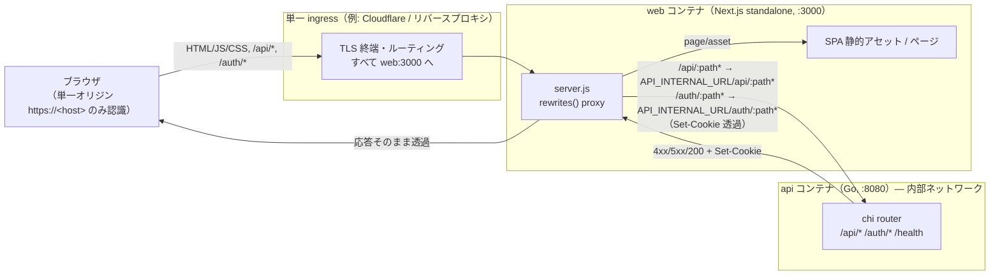
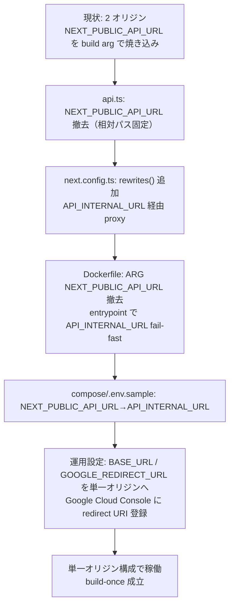

# Design Document

## Overview

**Purpose**: ブラウザから見た Feedman のアクセス先を単一オリジンに統合し、フロントエンド（`web`）が
バックエンド（`api`）を **同一オリジンの相対パス**経由で呼べるようにする。これにより、ビルド時 URL 焼き込み
（`NEXT_PUBLIC_API_URL`）を廃止して **build-once**（同一イメージの環境横断再利用）を成立させ、Cookie を
first-party 化し、CORS 依存を縮小する。さらに内部 API 接続先（`API_INTERNAL_URL`）が未設定なら **起動時に
fail-fast** させ、誤設定の本番投入を防ぐ。

**Users**: 主に **運用者**（build-once・誤設定検出の恩恵を受ける）と **エンドユーザー**（クロスオリジン起因の
ログイン/通信失敗が解消される）。開発者は環境差異の少ないルーティング規約で開発できる。

**Impact**: 現在は「ブラウザ → `web:3000`」「ブラウザ → `api:8080`」の **2 オリジン直接アクセス**構成。本機能で
「ブラウザ → 単一オリジン → `web:3000`（Next.js standalone の rewrites による server-side proxy）→ `api:8080`」の
**単一オリジン**構成へ変える。`web` の `next.config.ts` に `rewrites()` を追加し、`web/src/lib/api.ts` の
`NEXT_PUBLIC_API_URL` 依存を撤去し、Docker / compose / `.env.sample` / README を新しい接続先設定
（`API_INTERNAL_URL`）に合わせて更新する。**バックエンド（Go）のルーティング・ハンドラ・Cookie 実装コードは
変更しない**（後述 Decision 参照）。

### Goals

- ビルド成果物に API オリジン絶対 URL を含めず、`NEXT_PUBLIC_API_URL` 未指定でビルドを完了できる（Req 1）
- ブラウザの `/api/*` と `/auth/*` リクエストを Next.js rewrites で同一オリジン経由で `api` へ転送し、応答・
  ステータス・本文・`Set-Cookie` をそのまま透過する（Req 2）
- first-party Cookie のまま Google OAuth フローを完結させる（`SameSite=None` を要求しない）（Req 3）
- 内部 API 接続先設定（`API_INTERNAL_URL`）が未設定/空なら起動を fail-fast させ、不足項目を識別できる
  ログを出力する（Req 4 / NFR 2）
- ローカル・本番で同一の `/api` ルーティング規約・オリジン相対パス規約で動作し、ブラウザ可視 API オリジンを
  切り替えるビルド時引数を要求しない（Req 5 / NFR 1）
- 既存フロント/バックエンドのテストスイートを壊さない（Req 6）

### Non-Goals

- バックエンドの API エンドポイントパス設計・ビジネスロジックの変更（アクセス経路の統合のみ）
- 単一 ingress を提供する具体的インフラ製品（Cloudflare 等）の選定・構築手順（運用ドキュメントの領分。
  本書ではトポロジ図と前提のみ示す）
- CORS ミドルウェア・関連オリジン設定の撤去/整理（#23 の領分）
- フロントエンド API クライアントの構造的リファクタリング（#25 の領分）
- CSP ヘッダの追加・強化（#53 の領分）
- 認証方式そのものの変更、既存セッション/ユーザーデータのマイグレーション

## Architecture

### Existing Architecture Analysis

調査により、Issue 本文の一部前提が実コードと食い違うことが判明した。設計は **実コードの事実**に基づく。

- **バックエンドは既に `/api` プレフィックス付きでデータ系ルートを提供している**
  （`internal/handler/router.go`）:
  - データ系: `/api/feeds`・`/api/items`・`/api/subscriptions`・`/api/users`（chi `r.Route("/api/...")`）
  - 認証系: `/auth/google/login`・`/auth/google/callback`・`/auth/logout`・`/auth/me`（ルート直下、`/api` なし）
  - `/health` もルート直下
- **`web/src/lib/api.ts` は既に同一オリジン相対パスにフォールバック済み**:
  `API_BASE_URL = (process.env.NEXT_PUBLIC_API_URL || "").replace(/\/+$/, "")`。未設定時 `""` となり
  `fetch("" + "/api/feeds")` = 相対パス。`api.test.ts` も `/api/feeds` を期待している。
- **`web/next.config.ts`** は `output: "standalone"` + `headers()` のみで `rewrites()` を持たない。
- **Cookie 実装**（`internal/handler/auth_handler.go`）は state Cookie / session Cookie / logout クリア
  すべて `HttpOnly: true` / `Secure: h.config.CookieSecure` / `SameSite: http.SameSiteLaxMode`。
  `CookieSecure` は `config.go` で `BASE_URL` が `https://` 始まりかで自動判定。
  コールバック後リダイレクト先は `h.config.BaseURL`。
- 尊重すべき境界: バックエンドのルーティング規約・Cookie 属性・OAuth フローは Out of Scope。**Go コードは
  触らない**。本機能は `web` のプロキシ層と運用設定（env / compose / docs）に閉じる。

#### Decision: rewrites で `/api` プレフィックスを strip しない

- **採用案**: Next.js rewrites は `/api/:path*` → `${API_INTERNAL_URL}/api/:path*`、
  `/auth/:path*` → `${API_INTERNAL_URL}/auth/:path*` と **プレフィックスを保持してそのまま転送**する。
- **根拠**: バックエンドは既に `/api/*` と `/auth/*` をルート直下に持つ（router.go）。strip すると
  `api` 側で 404 になる。保持転送なら Req 2.1（`/api/*` 転送）/ 2.2（`/auth/*` 転送）を Go コード変更なしで
  満たし、Out of Scope（バックエンドパス設計の不変更）とも整合する。**確認事項#3 をこの事実で解決する**。
- **却下案 A（strip）**: `/api` を除去して `${API_INTERNAL_URL}/:path*` へ。→ バックエンドが root に
  `/api/*` を持つため不整合。Issue 本文の strip 前提は「backend が root にデータ系を持つ」誤認に由来。
- **却下案 B（backend を `/api` 配下へ再マウント）**: Go ルータの mount point 変更が必要 → Out of Scope。

### Architecture Pattern & Boundary Map

採用パターン: **Backend-for-Frontend 風の Reverse Proxy（Next.js standalone rewrites）**。`web` が
同一オリジンのエッジとして振る舞い、ブラウザに対しては自身のオリジンのみを露出し、`/api/*`・`/auth/*` を
内部ネットワーク経由で `api` へ server-side proxy する。



**Architecture Integration**:
- 採用パターン: Reverse Proxy（Next.js `rewrites()` の server-side proxy）。新規ミドルウェアや別サービスを
  足さず、Next.js standalone の既存 `server.js` が proxy を担う。
- ドメイン／機能境界: ブラウザ可視オリジン（= web のオリジン）と内部 API 接続先（`API_INTERNAL_URL`、
  内部ネットワークのみ到達）を分離。ブラウザは `API_INTERNAL_URL` を一切知らない（NFR 3.3）。
- 既存パターンの維持: バックエンドの chi ルーティング・Cookie 属性・OAuth フロー・`api.ts` のエンドポイント
  パス（`/api/feeds` 等）はすべて不変。
- 新規コンポーネントの根拠: `rewrites()` 設定は単一オリジン化の中核。`API_INTERNAL_URL` の読取/fail-fast は
  誤設定検出（Req 4）のために必要。

### Technology Stack

| Layer | Choice / Version | Role in Feature | Notes |
|-------|------------------|-----------------|-------|
| Frontend / Proxy | Next.js 15（App Router, `output: "standalone"`） | `rewrites()` による同一オリジン proxy | `server.js`（standalone）が runtime で rewrites を適用 |
| Frontend / Client | TypeScript 5（`web/src/lib/api.ts`） | 相対パス（`""` 始まり）で `fetch` | `NEXT_PUBLIC_API_URL` 依存を撤去 |
| Backend / Services | Go 1.25 + chi v5（`api`） | `/api/*`・`/auth/*` を提供（**変更なし**） | ルート直下にマウント済み |
| Auth / Cookie | Go `net/http` Cookie（`auth_handler.go`） | first-party セッション Cookie（**コード変更なし**） | `SameSite=Lax` 維持（後述 Decision） |
| Infrastructure / Runtime | Docker（node:20-alpine standalone）/ docker-compose | web の起動・proxy・fail-fast チェック | 起動 entrypoint で `API_INTERNAL_URL` を検証 |
| Ingress | 単一 ingress（Cloudflare 等、製品選定は Out of Scope） | TLS 終端・単一オリジン公開 | 本書はトポロジ前提のみ規定 |
| Test | Vitest（web）/ Go `testing`（api） | rewrites/fail-fast/api.ts の単体検証、回帰 | 既存スイート維持（Req 6.1/6.2） |

## File Structure Plan

### Directory Structure

```
web/
├── next.config.ts            # 変更: rewrites() 追加。buildRewrites(apiInternalUrl) を呼ぶ
├── src/lib/
│   ├── rewrites.ts           # 新規: rewrites ルール生成 + API_INTERNAL_URL 読取/検証の純粋ロジック
│   ├── rewrites.test.ts      # 新規: buildRewrites / API_INTERNAL_URL 検証の単体テスト
│   ├── api.ts                # 変更: NEXT_PUBLIC_API_URL 依存撤去、常に相対パス（API_BASE_URL=""）
│   └── api.test.ts           # 変更: NEXT_PUBLIC_API_URL 非依存を明示するケース追加（相対パス期待を維持）
├── server-entrypoint.mjs     # 新規: 起動前に API_INTERNAL_URL を検証し fail-fast、その後 server.js を起動
└── Dockerfile                # 変更: NEXT_PUBLIC_API_URL の ARG/ENV 撤去、entrypoint 経由の起動へ
```

非自明なファイルの根拠:
- `web/src/lib/rewrites.ts` — `next.config.ts` は Vitest から直接テストしづらく副作用（環境変数読取）も
  混ざるため、rewrites ルール生成と `API_INTERNAL_URL` 検証を **純粋関数**として切り出し単体テスト可能にする。
- `web/server-entrypoint.mjs` — standalone の `server.js` は Next 生成物で編集不可。起動前 fail-fast を
  実現するため薄いラッパ entrypoint を新設し、検証通過後に `server.js` を起動する（後述 Error Handling 参照）。

### Modified Files

- `web/next.config.ts` — `async rewrites()` を追加し、`web/src/lib/rewrites.ts` の `buildRewrites()` を呼ぶ。
  `headers()` / `output: "standalone"` は維持。
- `web/src/lib/api.ts` — `API_BASE_URL` を常に `""`（相対パス）にし、`NEXT_PUBLIC_API_URL` 参照と
  フォールバック記述を撤去。エンドポイントパス・`credentials: "include"` は不変。doc comment を更新。
- `web/src/lib/api.test.ts` — 既存ケース（相対パス期待）を維持しつつ、`NEXT_PUBLIC_API_URL` が設定されても
  相対パスのままであることを示すケースを追加（Req 1.4）。
- `web/Dockerfile` — builder stage の `ARG/ENV NEXT_PUBLIC_API_URL` を削除（Req 1.1/5.3）。runner stage で
  `server-entrypoint.mjs` をコピーし `CMD ["node", "server-entrypoint.mjs"]` に変更。
- `docker-compose.yml` — `web.build.args.NEXT_PUBLIC_API_URL` を削除し、`web.environment` に
  `API_INTERNAL_URL=${API_INTERNAL_URL:-http://api:8080}` を追加。`api` の `GOOGLE_REDIRECT_URL` /
  `BASE_URL` のデフォルトを単一オリジン前提のコメントで補足。
- `.env.sample` — `NEXT_PUBLIC_API_URL` を削除し `API_INTERNAL_URL` を追加。`GOOGLE_REDIRECT_URL` /
  `BASE_URL` を単一オリジン（ブラウザ可視 `https://<host>`）に合わせる説明へ更新。
- `README.md` — アーキテクチャ説明（2 オリジン → 単一オリジン）、環境変数表、本番デプロイ注意事項、
  セキュリティ節（CSRF/Cookie 説明）を更新。

### internal/config / Go コードの扱い

- **Go コードの改修は不要**。`internal/config/config.go`（`GOOGLE_REDIRECT_URL` / `BASE_URL` /
  `CookieSecure` 自動判定）、`internal/handler/router.go`、`internal/handler/auth_handler.go` は変更しない。
- 影響は **設定値そのものとドキュメント**にとどまる（`GOOGLE_REDIRECT_URL` / `BASE_URL` を単一オリジンの
  値に運用上設定する）。Migration Strategy 節で運用手順として記述する。

## Requirements Traceability

| Requirement | Summary | Components | Interfaces | Flows |
|-------------|---------|------------|------------|-------|
| 1.1 | NEXT_PUBLIC_API_URL 未指定でビルド完了 | API Client, Dockerfile | api.ts（env 非依存）、Dockerfile（ARG 撤去） | ビルド |
| 1.2 | 成果物に API 絶対 URL を含まない | API Client | API_BASE_URL=`""` | ビルド |
| 1.3 | 同一イメージで各環境 API へ到達 | Rewrites Proxy | rewrites() → API_INTERNAL_URL | runtime proxy |
| 1.4 | NEXT_PUBLIC_API_URL が与えられても相対パス維持 | API Client | api.ts（env 無視） | ブラウザ fetch |
| 2.1 | `/api/*` を同一オリジンで転送 | Rewrites Proxy | `/api/:path*`→`API_INTERNAL_URL/api/:path*` | proxy |
| 2.2 | `/auth/*` を同一オリジンで転送 | Rewrites Proxy | `/auth/:path*`→`API_INTERNAL_URL/auth/:path*` | proxy |
| 2.3 | CORS プリフライト不要 | Rewrites Proxy, API Client | 同一オリジン化（相対パス） | ブラウザ fetch |
| 2.4 | 4xx/5xx ステータス・本文をそのまま伝達 | Rewrites Proxy | Next.js proxy 透過挙動 | proxy 応答 |
| 2.5 | Set-Cookie をブラウザへ伝達 | Rewrites Proxy | proxy 応答ヘッダ透過 | proxy 応答 |
| 3.1 | 同一オリジンに対するセッション Cookie 確立 | Auth (api, 不変), Rewrites Proxy | Set-Cookie 透過 + first-party | OAuth callback |
| 3.2 | セッション Cookie を付与して転送 | Rewrites Proxy | server-side proxy が Cookie 転送 | 認証必須 /api/* |
| 3.3 | callback 完了後フロントへリダイレクト | Auth (api, 不変) | `BASE_URL` を単一オリジンに設定 | OAuth callback |
| 3.4 | first-party / SameSite=None 不要 | Auth (api, 不変) | `SameSite=Lax` 維持 | Cookie 属性 |
| 3.5 | state 検証失敗時に Cookie 確立せずエラー | Auth (api, 不変) | 既存挙動 | OAuth callback |
| 4.1 | API_INTERNAL_URL 未指定/空で起動中断 | Startup Validation | server-entrypoint.mjs throw/exit | 起動 |
| 4.2 | 不足項目を識別できるエラー出力 | Startup Validation | エラーメッセージに変数名明記 | 起動 |
| 4.3 | 有効値で起動完了・転送受付 | Startup Validation, Rewrites Proxy | 検証通過 → server.js 起動 | 起動 |
| 5.1 | ローカル/本番で同一 `/api` 規約 | Rewrites Proxy | 同一 rewrites ルール | proxy |
| 5.2 | ローカルも本番同一のオリジン相対転送 | Rewrites Proxy, API Client | 相対パス + rewrites | proxy |
| 5.3 | ブラウザ可視 API オリジンのビルド時引数を要求しない | Dockerfile, API Client | ARG 撤去 | ビルド |
| 6.1 | 既存フロントテスト成功 | API Client | api.test.ts 維持 | test |
| 6.2 | 既存バックエンドテスト成功 | Auth (api, 不変) | Go コード不変 | test |
| 6.3 | 各既存エンドポイントへ相対パス到達 | API Client, Rewrites Proxy | api.ts パス不変 + rewrites | proxy |
| NFR 1.1 | エンドポイントパス不変で利用継続 | API Client | パス不変 | ブラウザ fetch |
| NFR 1.2 | NEXT_PUBLIC_API_URL なしで本番デプロイ完了 | Dockerfile, compose, .env.sample | ARG/env 撤去 | デプロイ |
| NFR 2.1 | 起動失敗理由をログ 1 件以上出力 | Startup Validation | stderr へエラー出力 | 起動 |
| NFR 3.1 | セッション Cookie に HttpOnly | Auth (api, 不変) | 既存 HttpOnly:true | Cookie 属性 |
| NFR 3.2 | HTTPS 時に Secure | Auth (api, 不変) | `BASE_URL` https → CookieSecure | Cookie 属性 |
| NFR 3.3 | 機密情報をブラウザへ露出しない | Rewrites Proxy | API_INTERNAL_URL は server-side のみ | proxy |

## Components and Interfaces

### Web Proxy Layer

#### Rewrites Proxy（`web/next.config.ts` + `web/src/lib/rewrites.ts`）

| Field | Detail |
|-------|--------|
| Intent | ブラウザの `/api/*`・`/auth/*` を同一オリジン経由で `API_INTERNAL_URL` の `api` へ server-side proxy する |
| Requirements | 1.3, 2.1, 2.2, 2.3, 2.4, 2.5, 3.1, 3.2, 5.1, 5.2, NFR 3.3 |

**Responsibilities & Constraints**
- `/api/:path*` と `/auth/:path*` のみを転送対象とする（プレフィックス保持。strip しない）
- Next.js standalone の rewrites は server-side proxy であり、レスポンスのステータス・本文・`Set-Cookie` を
  含むヘッダをそのままブラウザへ透過する（Req 2.4/2.5/3.1 の根拠）
- `API_INTERNAL_URL` は server-side のみで参照し、ブラウザバンドルに含めない（NFR 3.3）
- 末尾スラッシュ正規化（`API_INTERNAL_URL` 末尾 `/` を除去してから `${base}/api/:path*` を組む）

**Dependencies**
- Inbound: ブラウザ（単一オリジン）— `/api/*`・`/auth/*` リクエスト (Critical)
- Outbound: `api` コンテナ（`API_INTERNAL_URL`）— バックエンド転送 (Critical)
- External: Next.js `rewrites()` 機構 — proxy 実体 (Critical)

**Contracts**: Service [x] / API [x] / Event [ ] / Batch [ ] / State [ ]

##### Service Interface（`web/src/lib/rewrites.ts`）

```typescript
import type { Rewrite } from "next/dist/lib/load-custom-routes";

/** 環境変数名（fail-fast / rewrites 双方で参照する単一定義） */
export const API_INTERNAL_URL_ENV = "API_INTERNAL_URL";

/**
 * API_INTERNAL_URL を読み取り、未設定/空ならエラーを投げる（fail-fast 用）。
 * 末尾スラッシュを除去した base を返す。
 */
export function resolveApiInternalUrl(env?: NodeJS.ProcessEnv): string;

/**
 * 与えられた api 接続先 base から rewrites ルール配列を生成する純粋関数。
 * /api/:path* と /auth/:path* をプレフィックス保持で転送する。
 */
export function buildRewrites(apiInternalUrl: string): Rewrite[];
```

- Preconditions: `buildRewrites` の引数は非空・正規化済み base（`resolveApiInternalUrl` 通過後）
- Postconditions: 返却 Rewrite 配列は `{ source: "/api/:path*", destination: "<base>/api/:path*" }` と
  `{ source: "/auth/:path*", destination: "<base>/auth/:path*" }` の 2 件
- Invariants: source に `/api`・`/auth` プレフィックスを保持し、destination で strip しない

##### Rewrite Rule 定義

| source | destination | 対象 Req |
|--------|-------------|----------|
| `/api/:path*` | `${API_INTERNAL_URL}/api/:path*` | 2.1, 3.2, 6.3 |
| `/auth/:path*` | `${API_INTERNAL_URL}/auth/:path*` | 2.2, 3.1, 3.3 |

> `/health` はブラウザから直接叩かれない（コンテナ healthcheck は `api` に対し別途実施済み）ため rewrites
> 対象に含めない。必要が生じた場合の追加は本機能スコープ外。

#### API Client（`web/src/lib/api.ts`）

| Field | Detail |
|-------|--------|
| Intent | ブラウザから常に同一オリジン相対パスで API を呼ぶ。ビルド時 URL 焼き込みを行わない |
| Requirements | 1.1, 1.2, 1.4, 2.3, 5.2, 5.3, 6.1, 6.3, NFR 1.1 |

**Responsibilities & Constraints**
- `API_BASE_URL` を常に `""`（相対パス）とし、`process.env.NEXT_PUBLIC_API_URL` を参照しない（Req 1.4）
- エンドポイントパス（`/api/feeds` 等）と `credentials: "include"` は不変（NFR 1.1, Req 6.3）
- `ApiError` / `createApiClient` のシグネチャは不変

**Dependencies**
- Inbound: React Query フック等の呼び出し側 — API 呼び出し (Critical)
- Outbound: 同一オリジン（rewrites 経由で `api`）— `fetch` (Critical)

**Contracts**: Service [x] / API [ ] / Event [ ] / Batch [ ] / State [ ]

##### Service Interface（差分のみ）

```typescript
/**
 * API のベース URL。常に空文字（同一オリジン相対パス）。
 * NEXT_PUBLIC_API_URL は参照しない（build-once / 単一オリジン化のため）。
 */
export const API_BASE_URL = "";
```

- Preconditions: なし（環境変数非依存）
- Postconditions: `fetch(\`${API_BASE_URL}${url}\`)` は常に相対 URL（例: `/api/feeds`）になる
- Invariants: `NEXT_PUBLIC_API_URL` の設定有無に関わらず相対パス（Req 1.4）

### Web Startup Layer

#### Startup Validation（`web/server-entrypoint.mjs`）

| Field | Detail |
|-------|--------|
| Intent | web 起動前に `API_INTERNAL_URL` を検証し、未設定/空なら fail-fast する |
| Requirements | 4.1, 4.2, 4.3, NFR 2.1 |

**Responsibilities & Constraints**
- `resolveApiInternalUrl(process.env)`（rewrites.ts の関数を再利用）を呼び、throw されたら
  stderr にエラーメッセージ（不足変数名 `API_INTERNAL_URL` を含む）を出力して **非ゼロ終了**（Req 4.1/4.2/NFR 2.1）
- 検証通過時のみ standalone の `server.js` を起動する（Req 4.3）
- 標準のロギングは stderr で十分（Next.js standalone も stderr/stdout を使う）

**Dependencies**
- Inbound: Docker `CMD`（runner stage）— 起動エントリ (Critical)
- Outbound: `web/src/lib/rewrites.ts` の `resolveApiInternalUrl` — 検証ロジック共有 (Critical)
- Outbound: standalone `server.js` — 検証通過後の起動 (Critical)

**Contracts**: Service [ ] / API [ ] / Event [ ] / Batch [ ] / State [x]

##### State 遷移（起動）

| 状態 | 条件 | 遷移先 / 結果 |
|------|------|---------------|
| 起動開始 | `API_INTERNAL_URL` 未設定/空 | エラー出力 → 非ゼロ終了（fail-fast, Req 4.1/4.2/NFR 2.1） |
| 起動開始 | `API_INTERNAL_URL` に有効値 | `server.js` 起動 → 転送受付（Req 4.3） |

### Backend Auth（`internal/handler/auth_handler.go` — 変更なし）

| Field | Detail |
|-------|--------|
| Intent | first-party セッション Cookie で OAuth フローを完結（既存実装を維持） |
| Requirements | 3.1, 3.3, 3.4, 3.5, 6.2, NFR 3.1, NFR 3.2 |

**Responsibilities & Constraints**
- セッション/state Cookie は `HttpOnly:true` / `Secure: CookieSecure`（`BASE_URL` が https で自動 true）/
  `SameSite=Lax`（後述 Decision で維持）
- callback 完了後は `BASE_URL` へリダイレクト（運用上 `BASE_URL` を単一オリジンに設定する）
- state 検証失敗時は Cookie を確立せずエラー応答（既存挙動、Req 3.5）
- **本コンポーネントは Go コードを変更しない**。Cookie 属性・フローは現状維持

**Contracts**: Service [ ] / API [ ] / Event [ ] / Batch [ ] / State [ ]（既存の API/State 契約を維持）

#### Decision: SameSite は `Lax` を維持する

- **採用案**: 現状の `http.SameSiteLaxMode` を維持（Go コード変更なし）。
- **根拠**: 単一オリジン化により Cookie は first-party になるため `SameSite=None`（third-party 許可）は
  不要（Req 3.4 を満たす）。OAuth コールバックは Google からの cross-site トップレベル遷移（GET リダイレクト）で
  Cookie が伴うため、`Strict` だと callback 直後の遷移で Cookie が送られず不具合になり得る。`Lax` は
  トップレベル GET ナビゲーションで Cookie を送るため OAuth フローと整合し、既存テスト
  （`auth_handler_test.go` が `SameSiteLaxMode` を期待）とも齟齬がない（Req 6.2）。→ **確認事項#2 を `Lax` 維持で解決**。
- **却下案（Strict）**: callback リダイレクトで Cookie 不送出のリスク、既存テスト変更も必要。本機能スコープで
  リスクを取る理由がない。

## Data Models

本機能はアクセス経路の統合であり、新規エンティティ・永続データモデルの追加・変更はない。
関わる「設定モデル」のみ整理する。

### 設定モデル（環境変数）

| 変数 | 所有 | 用途 | 変更内容 |
|------|------|------|----------|
| `API_INTERNAL_URL` | web（server-side） | rewrites の転送先 base。ブラウザ非公開 | **新規** |
| `NEXT_PUBLIC_API_URL` | web（旧 build arg） | 旧: ブラウザ可視 API URL | **撤去**（参照しない / ビルド arg 削除） |
| `BASE_URL` | api | callback リダイレクト先・CookieSecure 判定 | 値を単一オリジン（ブラウザ可視）へ（コード不変） |
| `GOOGLE_REDIRECT_URL` | api | Google に登録する callback URL | 値を `https://<host>/auth/google/callback` へ（コード不変） |
| `CORS_ALLOWED_ORIGIN` | api | CORS 許可オリジン | 本機能では撤去しない（#23 領分） |

## Error Handling

### Error Strategy

- **起動時 fail-fast（Req 4 / NFR 2）**: `API_INTERNAL_URL` の検証は **起動 entrypoint（`server-entrypoint.mjs`）**
  で行う。検証失敗時は stderr にエラーメッセージを出力し非ゼロ終了。これにより誤設定コンテナは
  ready にならず、ロードバランサ/compose の healthcheck で検知できる。

#### Decision: fail-fast の実現場所は起動 entrypoint

- **採用案**: 薄いラッパ `server-entrypoint.mjs` で `resolveApiInternalUrl(process.env)` を呼び、未設定/空なら
  `console.error("FATAL: API_INTERNAL_URL is not set ...")` 出力後 `process.exit(1)`。通過時に
  `import("./server.js")` で standalone サーバを起動。
- **根拠**: standalone の `server.js` は Next 生成物で編集できない。`next.config.ts` の `async rewrites()` 内で
  throw する案は **初回リクエスト時にしか発火しない**（起動成功扱いになる）ため Req 4.1「起動を中断」を
  満たさない。entrypoint なら起動時点で確実に fail でき、`API_INTERNAL_URL_ENV` 定数とメッセージで不足項目を
  識別できる（Req 4.2 / NFR 2.1）。
- **却下案 A（rewrites 内 throw）**: 発火が遅延しヘルスチェック前に exit しない → 不採用。
- **却下案 B（compose の command でシェル `[ -n "$API_INTERNAL_URL" ] || exit 1`）**: compose 専用で
  Dockerfile 単体起動時に効かず、メッセージ整形も弱い → 不採用（entrypoint に集約）。

### Error Categories and Responses

- **User Errors (4xx)**: バックエンドが返す 4xx を rewrites proxy がそのまま透過（Req 2.4）。フロントの
  `ApiError` が status/body を保持して呼び出し側へ伝える（既存挙動）。
- **System Errors (5xx)**: バックエンド 5xx・`api` 到達不能時は proxy が対応するエラー応答をブラウザへ返す
  （Req 2.4）。`API_INTERNAL_URL` 自体の欠落は起動時 fail-fast で握り込み、稼働後は発生しない。
- **Startup Errors（運用）**: `API_INTERNAL_URL` 未設定/空 → entrypoint が stderr 出力 + 非ゼロ終了
  （Req 4.1/4.2, NFR 2.1）。
- **Business Logic Errors (422)**: 本機能では新規発生なし（バックエンドの既存挙動を透過）。

## Testing Strategy

### Unit Tests

1. `buildRewrites(base)` が `/api/:path*`→`<base>/api/:path*`、`/auth/:path*`→`<base>/auth/:path*` の
   2 ルールをプレフィックス保持で返す（Req 2.1/2.2）
2. `buildRewrites` が `API_INTERNAL_URL` 末尾スラッシュを正規化する（`http://api:8080/` でも二重スラッシュに
   ならない）
3. `resolveApiInternalUrl` が未設定/空文字で throw し、メッセージに `API_INTERNAL_URL` を含む（Req 4.1/4.2）
4. `resolveApiInternalUrl` が有効値で正規化済み base を返す（Req 4.3）
5. `api.ts`: `NEXT_PUBLIC_API_URL` が設定されていても `fetch` が相対パス（`/api/feeds`）で呼ばれる（Req 1.4）。
   既存の相対パス期待ケースも維持（Req 6.1）

### Integration Tests

1. web standalone（または `next start` 相当）に対し `/api/feeds` をリクエストし、`API_INTERNAL_URL` 先の
   スタブ `api` へ転送され応答が透過されることを確認（Req 2.1）
2. `/auth/me` を web 経由でリクエストし、バックエンド応答が透過されることを確認（Req 2.2）
3. スタブ `api` が `Set-Cookie`（session / state）を返したとき、web 経由のレスポンスにも `Set-Cookie` が
   含まれることを確認（Req 2.5 / 3.1）
4. スタブ `api` が 404/500 を返したとき、status と本文が透過されることを確認（Req 2.4）
5. `API_INTERNAL_URL` 未設定で `server-entrypoint.mjs` を起動し、非ゼロ終了 + stderr にメッセージが出ることを
   確認（Req 4.1/4.2/NFR 2.1）

### E2E / 手動 PoC（確認事項#1 の検証戦略）

> 確認事項#1（Set-Cookie 伝播の検証手段）を、**結合テスト（上記 3）を主、手動 PoC を補**として確定する。
> Next.js rewrites は standalone Node サーバの fetch ベース proxy であり、`Set-Cookie` を含むレスポンス
> ヘッダを透過する。これを結合テストで自動検証し、OAuth 実フローは手動 PoC で確認する。

1. ローカル単一オリジン（compose）で Google OAuth ログインを実施し、callback 後に `web` オリジンへ
   リダイレクトされ、`/auth/me` がログイン状態を返すことを確認（Req 3.1/3.3）
2. ブラウザ devtools で、セッション Cookie が web オリジンに対し first-party（`SameSite=Lax` / `HttpOnly`、
   HTTPS 時 `Secure`）で保存されることを確認（Req 3.4 / NFR 3.1/3.2）
3. Network タブで `/api/*` リクエストに CORS プリフライト（OPTIONS）が発生しないことを確認（Req 2.3）
4. `API_INTERNAL_URL` を空にして web を起動し、コンテナが起動失敗することを確認（Req 4.1）

### 回帰（Req 6）

1. `npm test`（web Vitest）全件成功（Req 6.1）
2. `go test ./...`（api）全件成功（Go コード不変のため既存維持。Req 6.2）

## Security Considerations

- **first-party Cookie**: 単一オリジン化により session/state Cookie は web オリジンに対する first-party と
  なり、`SameSite=None`（third-party 許可）は不要（Req 3.4）。`SameSite=Lax` を維持（Decision 参照）。
- **HttpOnly / Secure**: 既存実装どおり `HttpOnly:true`、`BASE_URL` が https のとき `Secure:true`
  （NFR 3.1/3.2）。Go コードは変更しない。
- **機密情報の非露出（NFR 3.3）**: `API_INTERNAL_URL` は web の server-side（rewrites/entrypoint）のみで
  参照し、ブラウザバンドル・ブラウザ可視応答に含めない。OAuth client secret 等もバックエンド内に閉じる。
- **CORS の縮小は本機能スコープ外**: 同一オリジン化により実質クロスオリジンプリフライトは発生しなくなる
  （Req 2.3）が、`CORS_ALLOWED_ORIGIN` ミドルウェア・設定の撤去/整理は **#23 の領分**として明確に境界を引く。
  本機能では CORS 設定を削除しない（既存挙動を壊さないため、Req 6.2 とも整合）。
- **CSP** は #53 の領分（本機能では扱わない）。

## Migration Strategy



### 環境変数の移行（NEXT_PUBLIC_API_URL 撤去 → API_INTERNAL_URL 導入）

- `NEXT_PUBLIC_API_URL`: `web/Dockerfile` の `ARG/ENV`、`docker-compose.yml` の `web.build.args`、
  `.env.sample`、README から削除。`api.ts` でも参照しない（Req 1.1/5.3/NFR 1.2）。
- `API_INTERNAL_URL`: web の **実行時**環境変数として導入（例: compose で `http://api:8080`）。ビルド arg では
  ない（Req 5.3 / NFR 1.2）。compose のデフォルトは `API_INTERNAL_URL=${API_INTERNAL_URL:-http://api:8080}`。

### OAuth リダイレクト先設定の更新範囲（確認事項#4 の解決）

> 認証系（`/auth/*`）はバックエンドのルート直下にあり、rewrites は **プレフィックスを strip しない**ため、
> 単一オリジン化後のブラウザ可視 callback URL は **`https://<host>/auth/google/callback`**（`/api` は付かない）。
> Issue 仮案の `/api/auth/...` は「strip 前提 + backend root マウント」の誤認に由来し、本設計では採らない。
> → **確認事項#4 を以下の運用手順で解決する**。

- `GOOGLE_REDIRECT_URL` を `https://<host>/auth/google/callback` に設定する（単一オリジンのブラウザ可視ホスト）。
- `BASE_URL` を `https://<host>`（単一オリジン）に設定する。これにより callback 後リダイレクト先が
  単一オリジンになり（Req 3.3）、`CookieSecure` が https 判定で true になる（NFR 3.2）。
- **Google Cloud Console** の OAuth 2.0 クライアント設定で、承認済みリダイレクト URI に
  `https://<host>/auth/google/callback` を登録する（ローカルは `http://localhost:3000/auth/google/callback`）。
- `GOOGLE_REDIRECT_URL` / `BASE_URL` を読む Go コード（`config.go` / `auth_handler.go`）は変更不要（値の更新のみ）。

### ロールバック

- rewrites/entrypoint 導入後に問題が出た場合、`API_INTERNAL_URL` を正しい内部 URL に設定する以外の特別な
  手当は不要。旧構成（2 オリジン）に戻すには本 PR を revert する（DB/データ移行を伴わないため安全）。
